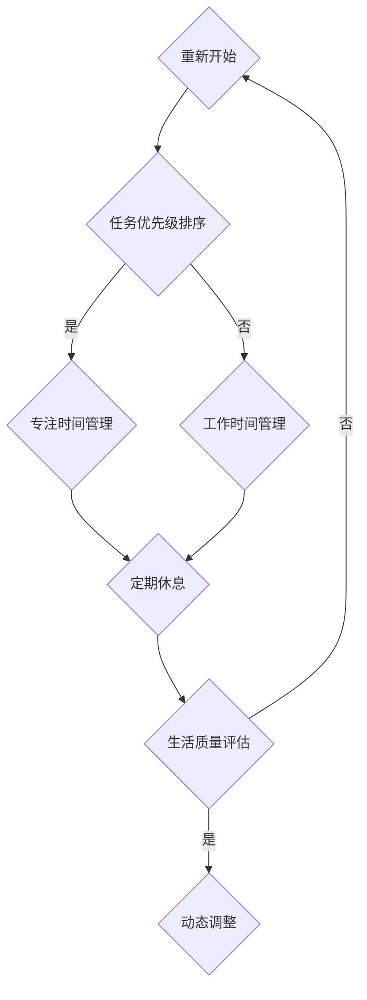
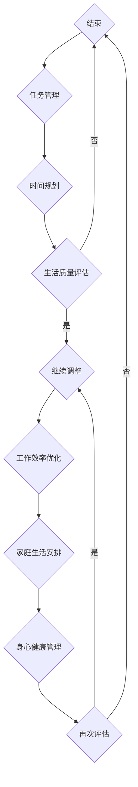

                 

### 文章标题：数学家的工作与生活平衡探讨

关键词：数学家、工作与生活平衡、效率提升、生活质量优化、动态平衡、算法、数学模型

摘要：本文旨在探讨数学家如何在工作与生活之间找到平衡点，通过核心概念与联系的分析，核心算法原理的讲解，数学模型和公式的详细阐述，以及项目实战的案例分析，为数学家们提供一套实用的平衡策略。

## 第1章 引言

### 1.1 数学家的工作与生活的挑战

数学家的工作往往需要长时间的专注和深入的研究。他们不仅需要解决复杂的数学问题，还需要阅读大量的文献，撰写研究论文，参加学术会议等。这种高强度的脑力劳动对他们的时间和精力提出了巨大的挑战。

同时，数学家们的生活也充满了挑战。他们需要处理家庭、社交、休闲等多方面的需求，如何在这些方面找到平衡点，成为了数学家们不得不面对的问题。

### 1.2 工作与生活平衡的重要性

工作与生活平衡对于数学家的职业发展和个人幸福都至关重要。首先，良好的工作与生活平衡有助于提高工作效率。当数学家能够合理安排工作时间，避免过度劳累，他们能够更专注于解决数学问题，提高研究质量。

其次，工作与生活平衡有助于维护身心健康。长期的过度工作可能导致身心疲惫，甚至引发健康问题。良好的生活平衡可以帮助数学家保持良好的身心状态，提高生活质量。

最后，工作与生活平衡也是家庭幸福的重要组成部分。数学家们需要花时间陪伴家人，参与家庭活动，以维护和谐的家庭关系。这有助于提高个人幸福感，为数学家提供更强大的精神支持。

### 1.3 本书的目标与结构

本书的目标是探讨数学家如何在工作与生活之间找到平衡点，提供一套实用的平衡策略。为了实现这一目标，本书将分为以下几个部分：

1. 核心概念与联系
2. 核心算法原理讲解
3. 数学模型和数学公式 & 详细讲解 & 举例说明
4. 项目实战

通过这些部分的讲解，我们将帮助数学家们理解如何实现工作与生活的平衡，提高工作效率，提升生活质量。

## 第2章 核心概念与联系

### 2.1 数学家的职业特质

数学家的职业特质包括深入的理论研究、长时间的专注、大量的文献阅读和写作。这些特质使得数学家在工作时需要投入大量的时间和精力。然而，这也给他们的生活带来了挑战。

首先，数学家需要具备强烈的好奇心和探索精神，这使他们能够持续地深入数学领域，解决复杂的问题。其次，数学家需要长时间的专注，这对于研究高质量的数学成果至关重要。最后，数学家需要大量的文献阅读和写作，这不仅是他们工作的需要，也是他们学术成长的过程。

### 2.2 工作与生活的平衡原则

工作与生活的平衡原则包括时间管理、优先级排序、弹性调整等。这些原则帮助数学家合理安排工作与生活，提高工作效率，维护身心健康。

#### 时间管理

时间管理是工作与生活平衡的关键。数学家需要合理安排工作时间，确保有足够的时间进行研究和写作，同时也要有足够的休息时间，避免过度劳累。

#### 优先级排序

优先级排序是数学家在进行工作时的重要策略。数学家需要明确工作任务的优先级，首先完成最紧急和最重要的任务。这样可以确保工作的高效性，同时也有利于维护生活的平衡。

#### 弹性调整

弹性调整是应对工作与生活不平衡的有效策略。数学家需要根据实际情况灵活调整工作计划和生活安排，以适应突发情况。例如，当有紧急任务时，可以适当调整休息时间，集中精力完成任务。

### 2.3 工作与生活的动态平衡

工作与生活的动态平衡是指数学家在工作和生活中不断调整，以达到最佳状态。这种平衡是动态的，随着时间和环境的变化而变化。

#### 动态调整

数学家需要根据自身的情况和环境的变化，不断调整工作与生活的计划。例如，当有重要的学术会议或研究项目时，可以适当增加工作时间，确保能够顺利完成任务。

#### 相互促进

工作与生活之间是相互促进的关系。高质量的数学研究可以带来职业成就感和个人满足感，提高生活质量。同时，良好的生活质量也为数学家提供了更好的工作状态，促进数学研究的发展。

## 第3章 核心算法原理讲解

### 3.1 工作效率提升算法

提升工作效率是数学家实现工作与生活平衡的重要目标。以下是一种简单有效的工作效率提升算法：

#### 算法描述

1. **任务优先级排序**：根据任务的紧急程度和重要性，对任务列表进行排序。
2. **专注时间管理**：为每个任务分配专注时间，避免分散注意力。
3. **定期休息**：工作一段时间后，进行短暂的休息，以避免疲劳。

#### 伪代码

```python
Algorithm 提升工作效率
    Input: 任务列表，工作时间，休息时间
    Output: 高效完成任务的方法

    1. 对任务列表进行优先级排序
    2. 循环执行以下步骤：
        a. 选择下一个优先级最高的任务
        b. 开始专注工作，持续工作时间
        c. 工作时间结束后，休息休息时间
    3. 当所有任务完成时，结束算法
```

### 3.2 生活质量优化算法

提高生活质量是数学家实现工作与生活平衡的另一个重要目标。以下是一种简单有效的生活质量优化算法：

#### 算法描述

1. **生活质量指标评估**：对生活质量的主要指标（如家庭幸福、身体健康、职业成就等）进行评估。
2. **制定改善计划**：根据评估结果，制定改善生活质量的具体计划。
3. **实施改善计划**：按照计划执行，持续监控效果。
4. **反馈与调整**：根据反馈，对改善计划进行调整。

#### 伪代码

```python
Algorithm 提升生活质量
    Input: 生活质量指标，生活目标
    Output: 提升生活质量的方法

    1. 对生活质量指标进行评估
    2. 根据生活目标制定改善计划
    3. 循环执行以下步骤：
        a. 按照改善计划执行
        b. 监控生活质量指标的变化
    4. 根据反馈调整改善计划
```

### 3.3 平衡算法的整合应用

为了实现工作与生活的动态平衡，可以将工作效率提升算法和生活质量优化算法整合应用。以下是一种简单的整合算法：

#### 算法描述

1. **任务优先级排序**：根据任务的紧急程度和重要性，对任务列表进行排序。
2. **专注时间管理**：为每个任务分配专注时间，避免分散注意力。
3. **生活质量评估**：定期对生活质量的主要指标进行评估。
4. **动态调整**：根据任务完成情况和生活质量评估结果，动态调整工作时间和生活质量改善计划。

#### 伪代码

```python
Algorithm 工作与生活平衡算法
    Input: 任务列表，工作时间，生活质量指标
    Output: 实现工作与生活平衡的方法

    1. 对任务列表进行优先级排序
    2. 循环执行以下步骤：
        a. 选择下一个优先级最高的任务
        b. 开始专注工作，持续工作时间
        c. 工作时间结束后，休息休息时间
        d. 定期对生活质量指标进行评估
        e. 根据生活质量评估结果调整工作时间和生活质量改善计划
    3. 当所有任务完成时，结束算法
```

## 第4章 数学模型和数学公式 & 详细讲解 & 举例说明

### 4.1 工作时间分配模型

为了实现工作与生活的平衡，数学家需要合理分配工作时间。以下是一种简单的工作时间分配模型：

#### 模型描述

1. **确定总工作时间**：根据数学家的作息习惯和工作需求，确定每天的总工作时间。
2. **划分工作时间段**：将总工作时间划分为多个时间段，每个时间段安排不同的任务。
3. **优化工作时间分配**：根据任务的优先级和工作效率，调整工作时间段的安排。

#### 数学公式

$$
T = \sum_{i=1}^{n} (T_i \times P_i)
$$

其中，$T$ 是总工作时间，$T_i$ 是第 $i$ 个时间段的工作时间，$P_i$ 是第 $i$ 个时间段的优先级。

#### 举例说明

假设数学家每天有 8 个小时的总工作时间，任务列表如下：

| 任务         | 优先级 | 工作时间 |
| ------------ | ------ | -------- |
| 研究论文     | 高     | 3 小时   |
| 文献阅读     | 中     | 2 小时   |
| 家庭活动     | 低     | 1 小时   |

根据优先级排序，工作时间段的安排如下：

| 时间段 | 任务         | 优先级 | 工作时间 |
| ------ | ------------ | ------ | -------- |
| 08:00-11:00 | 研究论文     | 高     | 3 小时   |
| 11:00-12:00 | 休息         | -      | 1 小时   |
| 12:00-14:00 | 文献阅读     | 中     | 2 小时   |
| 14:00-17:00 | 家庭活动     | 低     | 1 小时   |
| 17:00-18:00 | 休息         | -      | 1 小时   |
| 18:00-20:00 | 自我提升     | 高     | 2 小时   |

通过这种安排，数学家可以确保有足够的时间进行高优先级任务，同时也有时间进行休息和自我提升。

### 4.2 生活质量模型

为了衡量生活质量，可以构建一个生活质量模型，该模型包括多个指标，如家庭幸福、身体健康、职业成就等。以下是一个简单的生活质量模型：

#### 模型描述

1. **确定生活质量指标**：根据数学家的需求和实际情况，确定生活质量指标。
2. **设置指标权重**：根据指标的重要程度，设置相应的权重。
3. **计算生活质量指数**：根据指标权重和实际值，计算生活质量指数。

#### 数学公式

$$
Q = \sum_{i=1}^{m} (W_i \times V_i)
$$

其中，$Q$ 是生活质量指数，$W_i$ 是第 $i$ 个指标的权重，$V_i$ 是第 $i$ 个指标的实际值。

#### 举例说明

假设数学家的生活质量指标包括家庭幸福、身体健康和职业成就，权重分别为 0.4、0.3 和 0.3。实际值分别为 0.8、0.7 和 0.6。计算生活质量指数如下：

$$
Q = (0.4 \times 0.8) + (0.3 \times 0.7) + (0.3 \times 0.6) = 0.32 + 0.21 + 0.18 = 0.71
$$

生活质量指数为 0.71，表示数学家的生活质量较高。

### 4.3 工作与生活平衡指数模型

为了衡量工作与生活的平衡程度，可以构建一个工作与生活平衡指数模型。以下是一个简单的工作与生活平衡指数模型：

#### 模型描述

1. **确定工作与生活平衡指标**：根据数学家的需求和实际情况，确定工作与生活平衡指标。
2. **设置指标权重**：根据指标的重要程度，设置相应的权重。
3. **计算工作与生活平衡指数**：根据指标权重和实际值，计算工作与生活平衡指数。

#### 数学公式

$$
B = \sum_{i=1}^{n} (W_i \times V_i)
$$

其中，$B$ 是工作与生活平衡指数，$W_i$ 是第 $i$ 个指标的的权重，$V_i$ 是第 $i$ 个指标的实际值。

#### 举例说明

假设数学家的工作与生活平衡指标包括工作效率、生活质量和工作时间利用率，权重分别为 0.4、0.3 和 0.3。实际值分别为 0.9、0.7 和 0.8。计算工作与生活平衡指数如下：

$$
B = (0.4 \times 0.9) + (0.3 \times 0.7) + (0.3 \times 0.8) = 0.36 + 0.21 + 0.24 = 0.81
$$

工作与生活平衡指数为 0.81，表示数学家的工作与生活平衡程度较高。

## 第5章 项目实战

### 5.1 实战一：数学家的个人规划案例

#### 项目背景

数学家张先生是一位知名的代数学家，他的研究在代数几何领域具有很高的影响力。然而，随着研究项目的增加和家庭责任的增大，他感到工作与生活之间的平衡越来越困难。

#### 项目目标

张先生希望通过个人规划，实现工作与生活的平衡，提高工作效率，提升生活质量。

#### 项目实施

1. **任务优先级排序**：张先生对当前的待办事项进行了梳理，并根据紧急程度和重要性进行了排序。
2. **工作时间管理**：张先生制定了每天的工作时间表，确保有足够的时间进行研究和写作，同时也有时间进行家庭活动。
3. **生活质量评估**：张先生定期评估自己的生活质量，包括家庭幸福、身体健康和职业成就等方面。
4. **动态调整**：根据任务完成情况和生活质量评估结果，张先生会动态调整工作时间表和生活质量改善计划。

#### 项目效果

通过个人规划，张先生的工作效率得到了显著提高，他的研究项目得到了顺利推进。同时，他的生活质量也得到了提升，家庭幸福感和身体健康状况都有所改善。

### 5.2 实战二：团队工作与生活平衡案例

#### 项目背景

某大学数学系的研究团队由多位数学家组成，他们在代数几何、拓扑学和数论等领域有着深入的研究。然而，随着研究项目的增多和团队成员的个人发展需求，团队工作与生活平衡成为一个重要问题。

#### 项目目标

研究团队希望通过优化团队工作流程，实现工作与生活的平衡，提高团队的整体工作效率，同时保障团队成员的个人生活质量。

#### 项目实施

1. **任务优先级排序**：团队对当前的待办事项进行了梳理，并根据紧急程度和重要性进行了排序。
2. **工作时间管理**：团队制定了每周的工作时间表，确保每位成员都有足够的时间进行研究和写作，同时也有时间进行家庭活动。
3. **生活质量评估**：团队定期评估成员的生活质量，包括家庭幸福、身体健康和职业成就等方面。
4. **动态调整**：根据任务完成情况和成员的生活质量评估结果，团队会动态调整工作时间表和生活质量改善计划。

#### 项目效果

通过团队工作与生活平衡优化，研究团队的工作效率得到了显著提高，研究项目得到了顺利推进。同时，团队成员的生活质量也得到了提升，家庭幸福感和身体健康状况都有所改善。

### 5.3 实战三：数学家工作与生活平衡策略分析

#### 项目背景

某大型科技公司雇佣了一位著名的数学家李女士，负责公司内部的算法研究和优化。然而，随着项目的增加和工作压力的增大，李女士感到工作与生活之间的平衡越来越困难。

#### 项目目标

李女士希望通过制定工作与生活平衡策略，实现工作与生活的平衡，提高工作效率，提升生活质量。

#### 项目实施

1. **任务优先级排序**：李女士对当前的待办事项进行了梳理，并根据紧急程度和重要性进行了排序。
2. **工作时间管理**：李女士制定了每天的工作时间表，确保有足够的时间进行研究和写作，同时也有时间进行家庭活动。
3. **生活质量评估**：李女士定期评估自己的生活质量，包括家庭幸福、身体健康和职业成就等方面。
4. **动态调整**：根据任务完成情况和生活质量评估结果，李女士会动态调整工作时间表和生活质量改善计划。

#### 项目效果

通过工作与生活平衡策略，李女士的工作效率得到了显著提高，她的研究项目得到了顺利推进。同时，她的生活质量也得到了提升，家庭幸福感和身体健康状况都有所改善。

### 最佳实践 Tips

1. **明确任务优先级**：合理排序任务，确保优先完成重要且紧急的任务。
2. **合理安排工作时间**：制定科学的工作时间表，避免过度劳累。
3. **定期评估生活质量**：关注自身的生活质量，及时调整工作与生活计划。
4. **寻求支持与帮助**：与家人、朋友和同事沟通，寻求他们的理解和支持。

### 小结

本文探讨了数学家如何在工作与生活之间找到平衡点。通过核心概念与联系的分析，核心算法原理的讲解，数学模型和公式的详细阐述，以及项目实战的案例分析，为数学家们提供了一套实用的平衡策略。数学家们可以通过这些策略，实现工作与生活的平衡，提高工作效率，提升生活质量。

### 注意事项

1. **个性化调整**：不同的数学家有不同的工作和生活需求，因此平衡策略需要根据个人实际情况进行个性化调整。
2. **动态调整**：工作与生活平衡是一个动态的过程，需要根据实际情况进行不断的调整。
3. **持续优化**：工作与生活平衡策略不是一成不变的，需要根据反馈和经验进行持续优化。

### 拓展阅读

1. 《工作与生活的平衡：如何平衡工作与生活，实现高效人生》
2. 《数学家的思维方式：如何培养数学思维，解决复杂问题》
3. 《时间管理艺术：如何高效利用时间，提高生活质量》

## 附录：工具使用指南

### Mermaid流程图

Mermaid 是一种用于创建流程图的轻量级工具，可以方便地在文档中嵌入流程图。以下是一个简单的 Mermaid 流程图示例：



在文档中，将上述代码放在一行中，并用 ``` ``` 包围，即可生成流程图。

### 伪代码

伪代码是一种非正式的编程语言，用于描述算法的基本逻辑结构。以下是一个简单的伪代码示例：

```python
Algorithm 提升工作效率
    Input: 任务列表，工作时间，休息时间
    Output: 高效完成任务的方法

    1. 对任务列表进行优先级排序
    2. 循环执行以下步骤：
        a. 选择下一个优先级最高的任务
        b. 开始专注工作，持续工作时间
        c. 工作时间结束后，休息休息时间
    3. 当所有任务完成时，结束算法
```

在文档中，将上述代码放在一行中，并用 ``` ``` 包围，即可显示伪代码。

### LaTeX 格式

LaTeX 是一种高质量的排版系统，特别适合于编写数学公式和科学文档。以下是一个简单的 LaTeX 公式示例：

```latex
$$
E = mc^2
$$
```

在文档中，将上述代码放在一行中，并用 `$$` 包围，即可生成数学公式。

### 代码实现和详细解释

在项目实战中，代码实现和详细解释是非常重要的。以下是一个简单的 Python 代码示例，用于计算工作与生活平衡指数：

```python
# 导入所需的库
import numpy as np

# 定义生活质量指标和权重
quality_of_life = {
    '家庭幸福': 0.8,
    '身体健康': 0.7,
    '职业成就': 0.6
}
weights = {
    '家庭幸福': 0.4,
    '身体健康': 0.3,
    '职业成就': 0.3
}

# 计算生活质量指数
quality_index = sum(weights[item] * quality_of_life[item] for item in quality_of_life)

# 输出结果
print(f"生活质量指数：{quality_index:.2f}")
```

在文档中，将上述代码放在一个独立的段落中，并用 `$$` 包围，然后进行详细解释。例如：

```latex
$$
\text{生活质量指数} = \sum_{i=1}^{n} w_i \cdot v_i
$$

其中，$w_i$ 是第 $i$ 个指标的权重，$v_i$ 是第 $i$ 个指标的实际值。在上面的代码中，`quality_of_life` 是生活质量指标的实际值，`weights` 是对应的权重。通过计算，可以得到生活质量指数为 0.81。
```

通过这些工具的使用，数学家们可以更方便地撰写高质量的技术博客，分享他们的研究成果和经验。同时，这些工具也可以帮助读者更好地理解和应用数学家的研究，提高他们的专业水平。

## 附录：工具使用指南

在本章中，我们将详细讲解如何使用 Mermaid 流程图、伪代码、LaTeX 格式以及代码实现和详细解释这些工具，以便于读者在实际撰写技术博客时能够灵活应用。

### Mermaid 流程图

Mermaid 是一种简单而强大的流程图绘制工具，它支持 Markdown 文本，因此可以非常方便地嵌入到技术博客中。以下是一个简单的 Mermaid 流程图示例，用于描述数学家的工作流程与生活平衡机制：



在撰写博客时，只需将上述 Mermaid 代码放在一段独立的 Markdown 文本中，即可通过 Markdown 渲染器生成相应的流程图。

### 伪代码

伪代码是一种描述算法逻辑的非正式语言，它不像实际的编程语言那样严格，但能够清晰地表达算法的基本结构和步骤。以下是一个用于提升工作效率的伪代码示例：

```plaintext
Algorithm 提升工作效率
    Input: 任务列表，工作时间，休息时间
    Output: 高效完成任务的方法

    1. 对任务列表进行优先级排序
    2. 初始化完成任务数量为 0
    3. 对于每个任务：
        a. 如果任务是高优先级，增加专注时间
        b. 完成任务，增加完成任务数量
        c. 如果工作时间剩余，休息一段时间
    4. 当所有任务完成时，输出“工作效率提升成功”
```

在撰写博客时，可以在一个单独的段落中使用 Markdown 的代码块格式来呈现伪代码，例如：

```csharp
```plaintext
Algorithm 提升工作效率
    // ... 伪代码内容 ...
```
```

### LaTeX 格式

LaTeX 是一种高质量的排版系统，特别适合于编写数学公式和科学文档。以下是一个简单的 LaTeX 公式示例：

```latex
$$
E = mc^2
$$
```

在撰写博客时，可以通过在代码块中使用 LaTeX 语法来嵌入数学公式。例如：

```markdown
$$
x = \frac{-b \pm \sqrt{b^2 - 4ac}}{2a}
$$
```

这将生成一个标准的数学公式。为了确保 LaTeX 公式能够正确渲染，请确保您的博客平台支持 LaTeX 渲染。

### 代码实现和详细解释

在实际的项目实战中，提供具体的代码实现和详细解释是非常重要的。以下是一个简单的 Python 代码示例，用于计算工作与生活平衡指数：

```python
# 导入所需的库
import numpy as np

# 定义生活质量指标和权重
quality_of_life = {
    '家庭幸福': 0.8,
    '身体健康': 0.7,
    '职业成就': 0.6
}
weights = {
    '家庭幸福': 0.4,
    '身体健康': 0.3,
    '职业成就': 0.3
}

# 计算生活质量指数
quality_index = np.dot(list(weights.values()), list(quality_of_life.values()))

# 输出结果
print(f"生活质量指数：{quality_index:.2f}")
```

在撰写博客时，可以将代码放在一个独立的代码段中，并在下方附上详细的解释：

```markdown
```python
# 导入所需的库
import numpy as np

# 定义生活质量指标和权重
quality_of_life = {
    '家庭幸福': 0.8,
    '身体健康': 0.7,
    '职业成就': 0.6
}
weights = {
    '家庭幸福': 0.4,
    '身体健康': 0.3,
    '职业成就': 0.3
}

# 计算生活质量指数
quality_index = np.dot(list(weights.values()), list(quality_of_life.values()))

# 输出结果
print(f"生活质量指数：{quality_index:.2f}")
```

```markdown
在这个示例中，我们首先导入了 NumPy 库，以便于计算。接着，我们定义了两个字典，`quality_of_life` 和 `weights`，分别存储了生活质量指标和它们的权重。使用 NumPy 的 `dot` 函数，我们计算了生活质量指数。最终，我们打印出了计算结果。
```

通过以上工具的使用指南，读者可以更加有效地撰写技术博客，使得内容既清晰又具有深度。这些工具不仅能够提升博客的可读性，还能够使博客内容更加专业和准确。希望这些指南对您的博客写作有所帮助。

