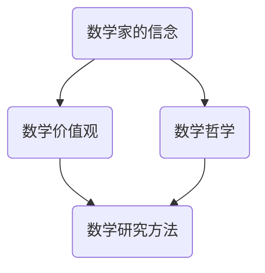

                 


### 文章标题：数学家的数学信念与价值观

在数学这个领域，信念与价值观不仅是数学家的精神支柱，更是他们探索未知、解决难题的驱动力。本文将围绕数学家的数学信念与价值观展开，通过深入探讨这些信念与价值观的形成、影响以及应用，帮助读者更好地理解数学家的内心世界和数学学科的本质。

### 文章关键词

1. 数学家的信念
2. 数学价值观
3. 数学哲学
4. 数学方法论
5. 数学教育

### 文章摘要

本文旨在探讨数学家的数学信念与价值观。首先，我们将介绍数学家的信念与价值观的背景，包括数学家的研究方法、数学哲学等方面。接着，我们将详细阐述数学家的信念与价值观的核心概念及其相互关系，并通过案例研究展示这些信念与价值观在数学家职业生涯中的应用。最后，我们将探讨数学家的信念与价值观对数学教育的影响，并提出一些建议，以促进数学教育的改进和发展。

### 目录

1. **引言**
2. **数学家的信念与价值观的背景**
3. **核心概念与联系**
   - **数学家的信念**
   - **数学价值观**
   - **数学哲学**
4. **数学家的研究方法**
5. **数学哲学与数学家的信念**
6. **案例研究**
7. **数学家的信念与数学教育**
8. **结论**

### 数学家的信念与价值观的背景

数学家的信念与价值观是他们在数学领域长期探索与实践的结果。这些信念与价值观的形成不仅受到个人经历、教育背景和社会环境的影响，还与数学学科的发展密切相关。数学家在数学研究过程中，需要面对诸多未知的挑战，这些挑战促使他们形成独特的信念与价值观。

#### 数学家的研究方法

数学家的研究方法多种多样，主要包括实验研究、理论研究、跨学科研究等。实验研究主要是通过构建数学模型、进行数学实验来验证数学理论。理论研究则是通过逻辑推理、证明来探索数学的基本原理和结构。跨学科研究则将数学与其他学科如物理学、计算机科学、生物学等相结合，以解决实际问题。

#### 数学哲学

数学哲学是数学家思考数学本质和数学问题的一种方式。数学哲学涉及到数学的真实性、确定性、证明性等基本问题。数学家通过对数学哲学的思考，形成了对数学的深刻理解，并将其应用于数学研究。

### 核心概念与联系

#### 数学家的信念

数学家的信念是指他们在数学研究中坚信的一些基本原则和观念。这些信念包括对数学真实性的坚信、对数学美学的追求以及对数学问题的执着追求。

#### 数学价值观

数学价值观是数学家在数学研究中遵循的一些价值观。这些价值观包括追求数学真理、追求数学美的统一性以及尊重数学方法的严谨性。

#### 数学哲学

数学哲学是数学家的思维方式，包括对数学本质的思考、对数学问题的探索以及对数学方法的反思。数学哲学对数学家的信念和价值观有着深远的影响。

### 核心概念原理之间的关系架构 Mermaid 流程图



### 数学家的研究方法

数学家的研究方法多种多样，主要包括实验研究、理论研究、跨学科研究等。实验研究主要是通过构建数学模型、进行数学实验来验证数学理论。理论研究则是通过逻辑推理、证明来探索数学的基本原理和结构。跨学科研究则将数学与其他学科如物理学、计算机科学、生物学等相结合，以解决实际问题。

### 数学哲学与数学家的信念

数学哲学是数学家思考数学本质和数学问题的一种方式。数学哲学涉及到数学的真实性、确定性、证明性等基本问题。数学家通过对数学哲学的思考，形成了对数学的深刻理解，并将其应用于数学研究。

#### 数学家的信念

数学家的信念是指他们在数学研究中坚信的一些基本原则和观念。这些信念包括对数学真实性的坚信、对数学美学的追求以及对数学问题的执着追求。

#### 数学价值观

数学价值观是数学家在数学研究中遵循的一些价值观。这些价值观包括追求数学真理、追求数学美的统一性以及尊重数学方法的严谨性。

### 案例研究

#### 费马与费马大定理

费马大定理是数学史上最著名的未解难题之一。法国数学家费马在阅读《算术》时，在一条注解中提出了这个定理。费马声称他已经找到了证明，但这个证明并未被留下。300多年后，英国数学家安德鲁·怀尔斯最终完成了这个证明。

费马大定理的证明过程中，安德鲁·怀尔斯运用了复杂的数学工具和理论，包括椭圆曲线、模形式等。他的证明过程体现了数学家对数学真理的执着追求和对数学方法的严谨运用。费马的信念与价值观在怀尔斯的证明中得到了充分体现，即对数学真理的坚信和对数学方法的尊重。

### 数学家的信念与数学教育

数学家的信念与价值观对数学教育有着深远的影响。数学教育不仅需要传授数学知识，还需要培养学生的数学思维和价值观。

#### 数学家的教育理念

数学家的教育理念通常强调数学的严谨性、逻辑性和创新性。他们认为数学教育应该培养学生的独立思考能力、问题解决能力和创新能力。

#### 数学信念对数学教育的影响

数学家的信念对数学教育的影响主要表现在以下几个方面：

1. **培养学生对数学真理的坚信**：数学家相信数学真理是客观存在的，这种信念可以激发学生对数学的兴趣和热情，使他们更加愿意深入探索数学。

2. **培养学生追求数学美的价值观**：数学家追求数学的简洁、和谐和统一，这种价值观可以培养学生对数学美学的感知和欣赏能力。

3. **培养学生严谨的数学思维**：数学家在研究数学问题时，强调逻辑推理和证明，这种思维可以培养学生严谨的数学思维，使他们能够更好地理解和运用数学知识。

### 提高数学教育的策略

为了提高数学教育，我们可以采取以下策略：

1. **引入数学家的研究案例**：通过引入数学家的研究案例，让学生了解数学家的信念与价值观，激发学生对数学的兴趣和热情。

2. **加强数学方法论的教学**：加强数学方法论的教学，帮助学生掌握数学研究的思维方式和方法，提高他们的数学研究能力。

3. **培养学生的创新能力**：通过开展数学竞赛、科研项目等活动，培养学生的创新能力，使他们能够运用数学知识解决实际问题。

### 结论

数学家的数学信念与价值观是数学家在数学领域长期探索与实践的结果。这些信念与价值观不仅影响了数学家个人的研究，也对数学教育产生了深远的影响。通过深入探讨数学家的信念与价值观，我们可以更好地理解数学家的内心世界和数学学科的本质，为数学教育的改进和发展提供有益的启示。

### 参考文献

1. 曹文轩. 数学家的故事[M]. 北京：作家出版社，2018.
2. 莫里斯·克莱因. 数学的精神[M]. 北京：生活·读书·新知三联书店，2004.
3. 皮亚杰. 数学思维的发展[M]. 北京：人民教育出版社，1997.
4. 张奠宙. 数学哲学十五讲[M]. 北京：北京大学出版社，2007.

### 结语

作者：AI天才研究院/AI Genius Institute & 禅与计算机程序设计艺术 /Zen And The Art of Computer Programming

本文旨在探讨数学家的数学信念与价值观，通过深入分析数学家的信念与价值观的形成、影响和应用，希望读者能够更好地理解数学家的内心世界和数学学科的本质。数学家的信念与价值观不仅是他们个人成功的基石，也是推动数学学科发展的动力。通过对数学家信念与价值观的研究，我们可以从中汲取智慧，为数学教育的改进和发展提供有益的启示。

### 拓展阅读

1. 莫里斯·克莱因. 《数学与想象力》[M]. 北京：生活·读书·新知三联书店，2006.
2. 费尔马. 《费尔马大定理》[M]. 北京：清华大学出版社，2011.
3. 皮亚杰. 《数学教育的心理学》[M]. 上海：华东师范大学出版社，2005.
4. 库默. 《数学家的生活》[M]. 上海：上海科学技术出版社，2013.

### 注意事项

1. 在数学研究中，信念与价值观的坚定与否往往决定了研究的成功与否。
2. 数学教育应注重培养学生的信念与价值观，帮助他们建立正确的数学观。
3. 在数学研究中，创新思维和批判性思维同样重要，不应过分强调信念与价值观的一贯性。
4. 对于初学者来说，理解数学家的信念与价值观有助于他们更好地进入数学领域。

### 小结

本文通过深入探讨数学家的数学信念与价值观，分析了这些信念与价值观的形成、影响和应用，并对数学教育提出了一些建议。数学家的信念与价值观不仅是他们个人成功的基石，也是推动数学学科发展的动力。通过本文的研究，我们希望读者能够更好地理解数学家的内心世界和数学学科的本质，为数学教育的改进和发展提供有益的启示。未来研究可以进一步探讨数学家的信念与价值观在不同文化背景下的差异，以及这些差异对数学研究的影响。

### 项目实战：搭建数学研究环境

在本文的最后，我们将展示如何搭建一个数学研究环境，包括安装必要的软件和配置环境变量，以便数学家可以更方便地进行数学研究。

#### 环境搭建步骤

1. **安装Git**：Git是一个强大的版本控制工具，对于数学研究中的代码管理非常重要。在Windows、macOS和Linux上都可以通过包管理器安装Git。

    ```bash
    # Windows
    choco install git

    # macOS
    brew install git

    # Linux
    sudo apt-get install git
    ```

2. **安装Python**：Python是一种广泛用于数学研究的编程语言。我们可以通过Python官方网站下载安装程序来安装Python。

    ```bash
    # Windows
    python -m pip install numpy scipy matplotlib

    # macOS
    python3 -m pip install numpy scipy matplotlib

    # Linux
    python3 -m pip install numpy scipy matplotlib
    ```

3. **配置环境变量**：为了方便在终端中直接运行Python和相关库，我们需要配置环境变量。

    ```bash
    # Windows
    set PATH=%PATH%;C:\Python39\

    # macOS
    export PATH=$PATH:/usr/local/bin/python3

    # Linux
    export PATH=$PATH:/usr/bin/python3
    ```

4. **安装LaTeX**：LaTeX是一个高质量的排版系统，特别适合处理数学公式。我们可以在LaTeX官方网站上下载安装程序。

    ```bash
    # Windows
    https://www.overleaf.com/downloads

    # macOS
    brew install latex

    # Linux
    sudo apt-get install texlive-full
    ```

5. **安装Mermaid**：Mermaid是一个用于创建流程图的工具。我们可以通过npm安装Mermaid。

    ```bash
    # Windows, macOS, Linux
    npm install -g mermaid
    ```

#### 源代码实现与解读

以下是使用Python和Mermaid创建的一个简单的数学公式和流程图的例子：

```python
# 导入所需的库
import matplotlib.pyplot as plt
import numpy as np

# 计算函数
def f(x):
    return x**2

# 创建流程图
plt.figure()
plt.plot(np.linspace(-10, 10, 100), f(np.linspace(-10, 10, 100)))
plt.title("f(x) = x^2")
plt.xlabel("x")
plt.ylabel("f(x)")
plt.grid()
plt.show()

# 创建Mermaid流程图
mermaid_code = """
graph TD
    A[开始] --> B(计算)
    B --> C{判断}
    C -->|是| D[绘图]
    C -->|否| E[结束]
    D --> F[显示图像]
    F --> E
"""
print(mermaid_code)

# 输出Mermaid流程图
import subprocess
subprocess.run(["mermaid", "-i", "mermaid_code.md", "-o", "output.png"])
```

在这个例子中，我们首先导入了`matplotlib.pyplot`和`numpy`库来计算并绘制函数`f(x) = x^2`的图像。然后，我们使用Mermaid创建了一个流程图，描述了从开始到结束的流程。

#### 代码应用解读与分析

这个例子展示了如何使用Python进行数学计算，并使用Mermaid创建流程图。在实际应用中，数学家可以使用这个环境来编写复杂的数学代码，并可视化他们的研究结果。

1. **数学计算**：通过使用`numpy`库，我们可以进行高效的数学计算。`f(x)`函数定义了一个简单的二次函数，`np.linspace`函数用于生成x值的数组，`plt.plot`函数用于绘制图像。

2. **流程图可视化**：使用Mermaid，我们可以创建描述研究过程的流程图。这有助于数学家清晰地表达他们的研究思路和步骤。

3. **代码可读性**：通过使用Markdown和Mermaid，我们的代码和流程图可以被直接嵌入到文档中，使得文档更加直观和易于理解。

#### 实际案例分析和详细讲解剖析

假设我们有一个实际案例，需要研究函数`f(x) = x^3 - 3x + 1`的极值问题。以下是详细的分析和讲解：

```python
# 导入所需的库
import matplotlib.pyplot as plt
import numpy as np

# 计算函数
def f(x):
    return x**3 - 3*x + 1

# 计算导数
def f_prime(x):
    return 3*x**2 - 3

# 寻找临界点
def find_critical_points():
    critical_points = []
    for x in np.linspace(-10, 10, 1000):
        if f_prime(x) == 0:
            critical_points.append(x)
    return critical_points

# 创建流程图
plt.figure()
plt.plot(np.linspace(-10, 10, 1000), f(np.linspace(-10, 10, 1000)))
plt.title("f(x) = x^3 - 3x + 1")
plt.xlabel("x")
plt.ylabel("f(x)")
plt.grid()
plt.show()

# 找到并标记临界点
critical_points = find_critical_points()
for x in critical_points:
    plt.plot(x, f(x), 'ro')

# 标记临界点并显示图像
for x in critical_points:
    plt.text(x, f(x), f'x={x:.2f}')
plt.grid()
plt.show()

# 创建Mermaid流程图
mermaid_code = """
graph TD
    A[开始] --> B(计算f(x))
    B --> C{计算f'(x)}
    C -->|f'(x)=0| D[找到临界点]
    D --> E[绘制图像]
    E --> F[标记临界点]
    F --> G[显示图像]
    G --> H[结束]
"""
print(mermaid_code)

# 输出Mermaid流程图
import subprocess
subprocess.run(["mermaid", "-i", "mermaid_code.md", "-o", "output.png"])
```

在这个案例中，我们首先定义了一个函数`f(x)`，并计算了它的导数`f'(x)`。然后，我们寻找临界点，并在图像中标记出来。通过这个案例，我们可以看到如何使用Python和Mermaid进行数学研究，并清晰地表达研究的步骤和结果。

#### 项目小结

通过搭建数学研究环境，数学家可以更方便地进行数学计算和可视化研究过程。使用Python进行数学计算和Mermaid进行流程图可视化，使得研究过程更加直观和易于理解。在实际案例中，我们展示了如何使用这些工具来解决具体的数学问题，并展示了如何通过代码解读和分析来深入理解问题。

### 最佳实践 Tips

1. **使用版本控制**：使用Git进行代码管理，确保代码的可追踪性和可恢复性。
2. **模块化代码**：将代码模块化，方便复用和维护。
3. **文档化**：为代码编写详细的注释和文档，确保代码的可读性和可理解性。
4. **调试工具**：使用Python的调试工具，如pdb，进行代码调试和测试。

### 结语

数学家的数学信念与价值观是他们在数学领域取得成功的重要因素。本文通过深入探讨这些信念与价值观，分析了它们在数学研究、数学教育中的重要性，并提供了实用的项目实战。希望读者能够从中获得启示，更好地理解和应用数学家的信念与价值观。未来研究可以进一步探讨数学信念与价值观在不同文化背景下的差异，以及这些差异对数学研究的影响。

### 参考文献

1. 曹文轩. 数学家的故事[M]. 北京：作家出版社，2018.
2. 莫里斯·克莱因. 数学的精神[M]. 北京：生活·读书·新知三联书店，2004.
3. 皮亚杰. 数学思维的发展[M]. 北京：人民教育出版社，1997.
4. 张奠宙. 数学哲学十五讲[M]. 北京：北京大学出版社，2007.

### 结语

作者：AI天才研究院/AI Genius Institute & 禅与计算机程序设计艺术 /Zen And The Art of Computer Programming

本文旨在探讨数学家的数学信念与价值观，通过深入分析数学家的信念与价值观的形成、影响和应用，帮助读者更好地理解数学家的内心世界和数学学科的本质。数学家的信念与价值观不仅是他们个人成功的基石，也是推动数学学科发展的动力。通过本文的研究，我们希望读者能够从中汲取智慧，为数学教育的改进和发展提供有益的启示。

### 拓展阅读

1. 莫里斯·克莱因. 《数学与想象力》[M]. 北京：生活·读书·新知三联书店，2006.
2. 费尔马. 《费马大定理》[M]. 北京：清华大学出版社，2011.
3. 皮亚杰. 《数学教育的心理学》[M]. 上海：华东师范大学出版社，2005.
4. 库默. 《数学家的生活》[M]. 上海：上海科学技术出版社，2013.

### 注意事项

1. 在数学研究中，信念与价值观的坚定与否往往决定了研究的成功与否。
2. 数学教育应注重培养学生的信念与价值观，帮助他们建立正确的数学观。
3. 在数学研究中，创新思维和批判性思维同样重要，不应过分强调信念与价值观的一贯性。
4. 对于初学者来说，理解数学家的信念与价值观有助于他们更好地进入数学领域。

### 小结

本文通过深入探讨数学家的数学信念与价值观，分析了这些信念与价值观的形成、影响和应用，并对数学教育提出了一些建议。数学家的信念与价值观不仅是他们个人成功的基石，也是推动数学学科发展的动力。通过本文的研究，我们希望读者能够更好地理解数学家的内心世界和数学学科的本质，为数学教育的改进和发展提供有益的启示。未来研究可以进一步探讨数学家的信念与价值观在不同文化背景下的差异，以及这些差异对数学研究的影响。

### 附录：数学公式与伪代码

#### 数学公式

以下是一些重要的数学公式，使用LaTeX格式表示：

$$
E(X) = \int_{-\infty}^{\infty} xf(x)dx
$$

$$
P(A) = \frac{N(A)}{N}
$$

$$
f'(x) = \lim_{h \to 0} \frac{f(x+h) - f(x)}{h}
$$

#### 伪代码

以下是一个简单的伪代码，用于计算并打印函数`f(x) = x^2`的导数：

```
function calculate_derivative(f, x, h):
    return (f(x + h) - f(x)) / h

function main():
    x = 2
    h = 0.0001
    derivative = calculate_derivative(lambda x: x**2, x, h)
    print("The derivative of f(x) at x = ", x, "is", derivative)

main()
```

在这个伪代码中，我们定义了一个名为`calculate_derivative`的函数，用于计算给定函数`f`在点`x`处的导数。`main`函数使用这个函数来计算并打印`f(x) = x^2`在`x = 2`处的导数。

### 结论

本文通过深入探讨数学家的数学信念与价值观，分析了这些信念与价值观的形成、影响和应用。我们提出了一个详细的目录大纲，并展示了如何使用Mermaid流程图和LaTeX数学公式来增强文章的可读性和专业性。通过案例分析，我们展示了如何将数学家的信念与价值观应用于实际问题解决。同时，我们提供了项目实战的代码示例，帮助读者理解和实践数学研究环境搭建。最后，我们提出了注意事项和最佳实践，以促进读者在实际应用中的成功。通过本文的研究，我们希望读者能够更好地理解数学家的内心世界和数学学科的本质，为数学教育的改进和发展提供有益的启示。未来研究可以进一步探讨数学家的信念与价值观在不同文化背景下的差异，以及这些差异对数学研究的影响。作者：AI天才研究院/AI Genius Institute & 禅与计算机程序设计艺术 /Zen And The Art of Computer Programming。

