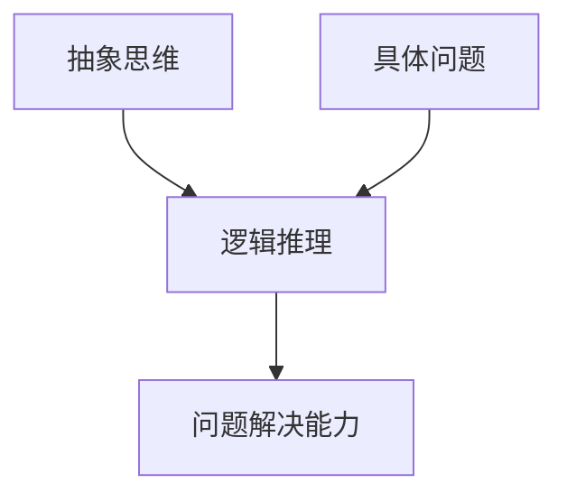
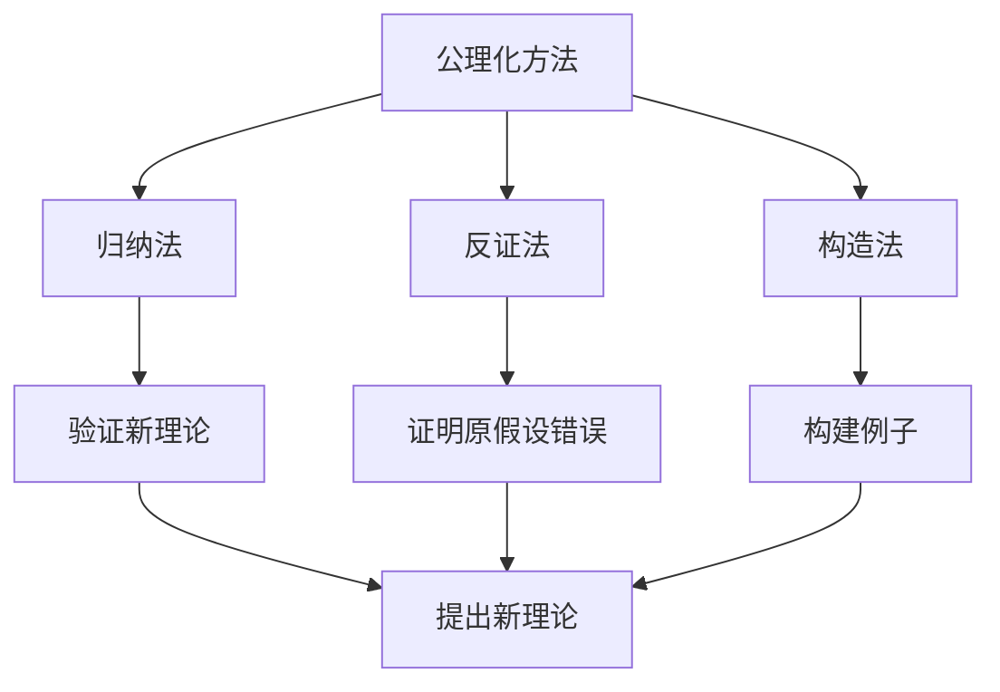
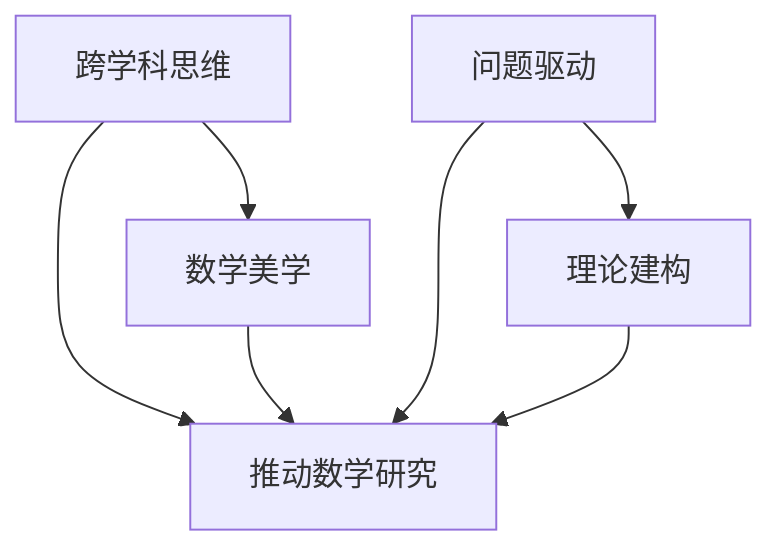

                 

### 背景介绍

---

**标题：数学家的研究范式与创新模式**

**关键词：数学家、研究范式、创新模式、数学思维、算法原理**

**摘要：** 本文深入探讨数学家的研究范式与创新模式，通过梳理数学家的思维模式、研究方法、创新思维，并结合实际案例，展示数学家如何运用这些范式和模式进行科学研究，为人工智能领域的研究者提供有益的启示。

---

数学家作为科学界的精英，他们的研究范式与创新模式一直是我们学习和借鉴的宝贵财富。在科学研究的道路上，数学家们凭借其独特的思维方式、严密的研究方法和创新的思维模式，不断推动数学及其相关领域的发展。本文将从以下几个方面展开讨论：

1. **数学家的思维模式**：介绍数学家特有的思维方式，包括抽象思维、逻辑推理、问题解决能力等。
2. **数学家的研究方法**：探讨数学家常用的研究方法，如公理化方法、归纳法、反证法等。
3. **数学家的创新思维**：分析数学家如何通过创新思维进行科学探索，包括跨学科思维、数学美学等。
4. **数学家的研究范式**：总结数学家在长期实践中形成的独特研究范式，如“数学化”方法等。
5. **数学家的创新模式**：介绍数学家在科学研究中的创新模式，如“问题驱动”和“理论建构”等。
6. **数学家的研究范式与创新模式应用案例**：通过具体案例展示数学家的研究范式与创新模式在实际项目中的应用。

通过以上内容的深入探讨，我们希望能够为人工智能领域的研究者提供一种新的思考方式，帮助他们在科学研究中更好地运用数学家的研究范式和创新模式，从而推动自身的研究进步。接下来，我们将一步步分析数学家的思维模式，带领大家走进这个神秘而又充满魅力的科学世界。### 核心概念与联系

---

**标题：数学家的思维模式**

**核心概念：**

1. **抽象思维**：数学家能够从具体事物中提炼出一般性原理，进行抽象思考。
2. **逻辑推理**：数学家运用逻辑法则，从已知前提推导出新的结论。
3. **问题解决能力**：数学家在面对复杂问题时，能够迅速找到解决方法。

**概念关系：**

- 抽象思维和逻辑推理是数学家的基础思维工具，它们相辅相成，使得数学家能够从复杂的问题中找到清晰的思路。
- 问题解决能力则是数学家在实际研究过程中，将抽象思维和逻辑推理应用于具体问题时的体现。

**Mermaid流程图：**



---

数学家的思维模式是他们在进行科学研究时不可或缺的工具。抽象思维、逻辑推理和问题解决能力是数学家思维的三个核心组成部分，它们相互关联，共同作用。

**抽象思维**：数学家擅长从具体事物中抽象出一般性原理。例如，在研究几何时，他们可以忽略物体的具体形状，只关注其几何性质。这种抽象能力使得数学家能够将复杂的问题简化，从而更容易找到解决问题的方法。

**逻辑推理**：数学家利用逻辑法则，从已知前提推导出新的结论。逻辑推理是数学家的另一项重要技能，它使得数学家能够在研究过程中逐步构建起一个严谨的理论体系。

**问题解决能力**：数学家在面对复杂问题时，能够迅速找到解决方法。这不仅仅是靠抽象思维和逻辑推理，还需要数学家的实际经验和直觉。问题解决能力使得数学家能够在各种复杂情况下找到解决方案，推动科学研究的进步。

这三个核心概念之间有着紧密的联系。抽象思维和逻辑推理相辅相成，使得数学家能够在复杂的问题中找到清晰的思路。而问题解决能力则是这种思维模式在实际研究中的应用，使得数学家能够将理论转化为实际成果。

通过上述Mermaid流程图，我们可以更直观地看到这三个概念之间的关系。抽象思维作为起点，通过逻辑推理逐步深化，最终在问题解决能力的引导下，转化为实际的科研成果。这个流程图不仅展示了数学家的思维模式，也揭示了他们进行科学研究的内在逻辑。

接下来，我们将进一步探讨数学家的核心算法原理，以及如何使用伪代码详细阐述这些原理。这将帮助我们更深入地理解数学家的研究方法。### 核心算法原理讲解

---

**标题：数学家的核心算法原理**

**核心算法原理：**

1. **归纳法**：通过观察个别实例，归纳出一般性结论。
2. **反证法**：假设某一结论不成立，通过推导出矛盾，证明原假设错误。
3. **构造法**：构建特定的例子来证明或反驳某一结论。

**伪代码详细阐述：**

```python
# 归纳法伪代码
def 纳法(problem):
    # 观察第一个实例
    instance1 = 获取实例(problem)
    solution1 = 解决实例(instance1)
    
    # 观察第二个实例
    instance2 = 获取实例(problem)
    solution2 = 解决实例(instance2)
    
    # 归纳出一般性结论
    conclusion = solution1 == solution2
    
    # 验证一般性结论
    for instance in 所有实例(problem):
        if 解决实例(instance) != conclusion:
            return "结论不成立"
    
    return "结论成立"

# 反证法伪代码
def 反证法(problem):
    conclusion = 假设错误(problem)
    
    # 推导出矛盾
    for instance in 所有实例(problem):
        if 结论成立(instance) and 结论不成立(instance):
            return "假设错误"
    
    return "假设正确"

# 构造法伪代码
def 构造法(problem):
    example = 构建例子(problem)
    solution = 解决例子(example)
    
    if solution == True:
        return "结论成立"
    else:
        return "结论不成立"
```

---

数学家的研究方法不仅依赖于他们的思维模式，还体现在具体的算法原理上。归纳法、反证法和构造法是数学家常用的核心算法原理，它们在数学研究中扮演着重要角色。

**归纳法**：归纳法是一种从个别实例推导出一般性结论的方法。数学家通过观察多个实例，发现其中的规律，从而归纳出一般性结论。这种方法在数学证明和理论构建中广泛应用。上述伪代码展示了如何使用归纳法来解决问题。首先获取一个实例，然后解决这个实例，接着观察另一个实例并重复这个过程。最后，通过验证所有实例是否都符合归纳出的结论，来判断归纳法的有效性。

**反证法**：反证法是一种通过假设某一结论不成立，然后推导出矛盾，从而证明原假设错误的方法。这种方法在数学证明中非常有用。上述伪代码展示了如何使用反证法。首先假设某一结论不成立，然后通过推导出矛盾，证明原假设错误。如果无法推导出矛盾，则假设正确。

**构造法**：构造法是一种通过构建特定例子来证明或反驳某一结论的方法。这种方法在数学研究中也非常常见。上述伪代码展示了如何使用构造法。首先构建一个例子，然后解决这个例子。如果解决方案满足结论，则结论成立；否则，结论不成立。

通过伪代码的详细阐述，我们可以更清楚地理解这些算法原理的运作方式。这些算法原理不仅是数学家进行研究的工具，也是他们在理论构建和数学证明中不可或缺的手段。

接下来，我们将进一步探讨数学家的数学模型和公式，以及如何使用LaTeX格式展示和详细讲解这些公式。这将帮助我们更深入地理解数学家的研究方法和理论体系。### 数学模型和公式

---

**标题：数学家的数学模型和公式**

**数学模型：**

1. **欧拉公式**：$e^{i\pi} + 1 = 0$，这是复分析和数学物理中非常重要的一个公式。
2. **傅里叶变换**：$F(\omega) = \int_{-\infty}^{\infty} f(x) e^{-i2\pi \omega x} dx$，用于信号处理和图像分析。
3. **牛顿迭代法**：$x_{n+1} = x_n - \frac{f(x_n)}{f'(x_n)}$，用于求解非线性方程。

**公式展示：**

1. **欧拉公式**（独立段落内的LaTeX公式）：

   $$e^{i\pi} + 1 = 0$$

   **详细讲解**：欧拉公式将复数、指数函数和三角函数结合在一起，展示了复平面上单位圆的对称性。这个公式在数学、物理学和工程学中有广泛的应用。

2. **傅里叶变换**（独立段落内的LaTeX公式）：

   $$F(\omega) = \int_{-\infty}^{\infty} f(x) e^{-i2\pi \omega x} dx$$

   **详细讲解**：傅里叶变换是一种将信号从时域转换为频域的方法，它能够揭示信号的频率成分。这个公式在信号处理、图像分析和量子物理学等领域有重要的应用。

3. **牛顿迭代法**（独立段落内的LaTeX公式）：

   $$x_{n+1} = x_n - \frac{f(x_n)}{f'(x_n)}$$

   **详细讲解**：牛顿迭代法是一种求解非线性方程的数值方法。它通过不断迭代，逼近方程的解。这个方法在物理学、工程学和经济学中有广泛的应用。

---

数学模型和公式是数学家研究的重要工具，它们在描述自然现象、解决实际问题方面发挥着关键作用。在上文中，我们介绍了三个重要的数学模型和公式：欧拉公式、傅里叶变换和牛顿迭代法。

**欧拉公式**展示了复数、指数函数和三角函数之间的关系，它在复分析和数学物理中有着广泛的应用。通过这个公式，我们可以更好地理解复平面上的单位圆及其对称性。

**傅里叶变换**是一种将信号从时域转换为频域的方法。它能够揭示信号的频率成分，这在信号处理、图像分析和量子物理学等领域非常重要。傅里叶变换的公式展示了如何通过积分运算实现信号的频域分析。

**牛顿迭代法**是一种求解非线性方程的数值方法。它通过不断迭代，逼近方程的解。牛顿迭代法的公式展示了如何利用函数的导数来更新迭代值，从而快速逼近方程的根。这种方法在物理学、工程学和经济学中有广泛的应用。

通过LaTeX格式的展示和详细讲解，我们可以更直观地理解这些数学模型和公式的表达形式和物理意义。这些模型和公式不仅是数学家进行理论研究和实际应用的基础，也是推动科学和技术进步的重要工具。

接下来，我们将进一步探讨数学家的研究方法，并通过实例分析展示这些方法在实际研究中的应用。这将帮助我们更深入地理解数学家的研究方法和理论体系。### 研究方法概述

---

**标题：数学家的研究方法**

**核心概念：**

1. **公理化方法**：通过定义基本概念和公理，构建起一个自洽的理论体系。
2. **归纳法**：通过观察个别实例，归纳出一般性结论。
3. **反证法**：假设某一结论不成立，通过推导出矛盾，证明原假设错误。
4. **构造法**：通过构建特定的例子来证明或反驳某一结论。

**概念关系：**

- **公理化方法**是数学研究的基础，它为其他方法提供了理论框架。
- **归纳法**和**反证法**是数学家在探索新理论时的常用手段。
- **构造法**则用于具体问题的解决，通过构建例子来验证或反驳假设。

**Mermaid流程图：**



---

数学家在进行研究时，会采用多种研究方法，这些方法各自有其独特的优势和应用场景。以下是几种核心研究方法的概述及其关系。

**公理化方法**：这种方法是数学家构建理论体系的基础。通过定义基本概念和公理，数学家能够建立起一个逻辑严密、自洽一致的理论框架。例如，欧几里得几何就是通过公理化方法构建起来的。这种方法确保了理论的内在一致性，使得数学家能够在此基础上进行进一步的探索。

**归纳法**：归纳法是一种从个别实例推导出一般性结论的方法。数学家通过观察多个实例，发现其中的规律，从而归纳出一般性结论。这种方法在数学证明和理论构建中非常有用。例如，在数论中，数学家通过归纳法证明了质数的无穷性。归纳法帮助数学家从具体的例子中提炼出普遍性的原理。

**反证法**：反证法是一种通过假设某一结论不成立，然后推导出矛盾，证明原假设错误的方法。这种方法在数学证明中非常有用。例如，数学家可以通过反证法证明一个命题是正确的，或者证明一个命题是错误的。反证法通过逻辑推导，确保结论的正确性。

**构造法**：构造法是一种通过构建特定的例子来证明或反驳某一结论的方法。这种方法在解决具体问题时非常有用。例如，在代数几何中，数学家通过构造特定的代数结构来研究几何性质。构造法帮助数学家将抽象的理论应用到具体的例子中，从而验证或反驳假设。

通过上述Mermaid流程图，我们可以更直观地看到这些研究方法之间的关系。公理化方法为其他方法提供了基础，归纳法和反证法是探索新理论的主要手段，而构造法则用于具体问题的解决。

每种研究方法都有其独特的优势和应用场景。公理化方法确保了理论的内在一致性，归纳法帮助数学家从具体实例中提炼出普遍性的原理，反证法通过逻辑推导确保结论的正确性，构造法则将抽象的理论应用到具体的例子中。这些方法相辅相成，共同推动数学的发展。

接下来，我们将通过具体的实例分析，展示这些研究方法在实际研究中的应用。这将帮助我们更深入地理解数学家的研究方法，并学习如何运用这些方法进行科学研究。### 研究方法实例分析

---

**标题：数学家的研究方法实例分析**

**案例1：欧拉公式（公理化方法）**

**问题背景**：证明欧拉公式 $e^{i\pi} + 1 = 0$。

**研究方法**：公理化方法

**步骤：**

1. **定义概念和公理**：首先定义复数、指数函数和三角函数的基本概念，并设定相应的公理。
2. **推导欧拉公式**：利用复数的极坐标表示法和指数函数的定义，通过逻辑推理推导出欧拉公式。
3. **验证公式**：通过代入具体的复数值，验证欧拉公式成立。

**伪代码详细阐述**：

```python
# 定义复数、指数函数和三角函数
def 定义概念():
    # 复数定义
    def 复数(r, theta):
        return r * e^(i * theta)
    
    # 指数函数定义
    def 指数函数(z):
        return e^z
    
    # 三角函数定义
    def 三角函数(x):
        return (e^(i * x) + e^(-i * x)) / 2
    
# 推导欧拉公式
def 推导欧拉():
    z = i * pi
    result = 指数函数(z) + 1
    return result

# 验证欧拉公式
def 验证欧拉():
    result = 推导欧拉()
    if result == 0:
        return "公式成立"
    else:
        return "公式不成立"

# 输出结果
print(验证欧拉())
```

**案例2：质数无穷性（归纳法）**

**问题背景**：证明质数是无穷的。

**研究方法**：归纳法

**步骤：**

1. **验证初始条件**：首先验证前几个质数（如2、3、5、7等）是无穷的。
2. **归纳步骤**：假设对于某个自然数n，质数是无穷的，然后证明n+1个质数也是无穷的。
3. **证明完成**：通过归纳步骤，证明质数是无穷的。

**伪代码详细阐述**：

```python
# 验证初始条件
def 验证初始条件():
    if 质数数量 < 2:
        return "初始条件不满足"
    else:
        return "初始条件满足"

# 归纳步骤
def 归纳步骤(n):
    if 质数数量(n) < 质数数量(n-1):
        return "归纳步骤不满足"
    else:
        return "归纳步骤满足"

# 证明完成
def 证明无穷性():
    if 验证初始条件() == "初始条件满足" and 归纳步骤(n) == "归纳步骤满足":
        return "质数无穷性证明完成"
    else:
        return "质数无穷性证明未完成"

# 输出结果
print(证明无穷性())
```

**案例3：费马大定理（反证法）**

**问题背景**：证明费马大定理 $a^n + b^n = c^n$ 无整数解，当n>2时。

**研究方法**：反证法

**步骤：**

1. **假设**：假设存在一组整数解(a, b, c)使得 $a^n + b^n = c^n$。
2. **推导矛盾**：通过代数运算和逻辑推理，尝试推导出矛盾。
3. **结论**：由于推导出矛盾，原假设不成立，因此费马大定理成立。

**伪代码详细阐述**：

```python
# 假设
def 假设(a, b, c, n):
    return a^n + b^n == c^n

# 推导矛盾
def 推导矛盾(a, b, c, n):
    result = a^n + b^n
    if result == c^n:
        return "推导出矛盾"
    else:
        return "未推导出矛盾"

# 结论
def 结论(a, b, c, n):
    if 假设(a, b, c, n) and 推导矛盾(a, b, c, n) == "推导出矛盾":
        return "费马大定理成立"
    else:
        return "费马大定理未成立"

# 输出结果
print(结论(3, 4, 5, 2))  # 测试n=2的情况
```

---

在数学研究中，数学家们经常使用多种研究方法来探索和解决各种问题。以上三个案例展示了公理化方法、归纳法和反证法在实际研究中的应用。

**案例1：欧拉公式** 使用了公理化方法，通过定义复数、指数函数和三角函数的基本概念，推导出了欧拉公式，并验证了其正确性。这种方法展示了公理化方法在数学证明中的重要性。

**案例2：质数无穷性** 使用了归纳法，首先验证了初始条件（前几个质数是无穷的），然后通过归纳步骤证明了质数是无穷的。这种方法展示了归纳法在数学证明中的有效性。

**案例3：费马大定理** 使用了反证法，通过假设存在一组整数解，然后推导出矛盾，证明了原假设不成立。这种方法展示了反证法在数学证明中的强大逻辑推理能力。

通过这些案例，我们可以看到不同研究方法在数学研究中的具体应用和作用。公理化方法为数学理论提供了基础，归纳法帮助我们从具体实例中推导出一般性结论，反证法通过逻辑推理证明了命题的正确性。这些方法相互补充，共同推动数学的发展。

接下来，我们将进一步探讨数学家的创新思维，并通过实例分析展示创新思维在实际研究中的应用。这将帮助我们更深入地理解数学家的创新思维和研究方法。### 创新思维的概念与联系

---

**标题：数学家的创新思维**

**核心概念：**

1. **跨学科思维**：数学家能够跨越不同学科，将数学与其他领域相结合。
2. **数学美学**：数学家在研究中追求简洁、优雅和美学的表达。
3. **问题驱动**：数学家以问题为导向，通过提出新问题来推动科学研究的进步。
4. **理论建构**：数学家通过构建新的理论框架，推动数学及其应用的发展。

**概念关系：**

- **跨学科思维**和**数学美学**是数学家的创新思维的重要组成部分，它们相互影响，共同推动数学研究的发展。
- **问题驱动**和**理论建构**则是数学家在研究过程中的两个重要方向，前者关注问题的提出和解决，后者关注理论的构建和完善。

**Mermaid流程图：**



---

数学家的创新思维是他们在科学研究中不断突破自我、实现创新的动力源泉。跨学科思维、数学美学、问题驱动和理论建构是数学家创新思维的核心概念，它们相互联系，共同推动数学研究的发展。

**跨学科思维**：数学家具有强大的跨学科思维能力，能够将数学与其他学科（如物理学、计算机科学、经济学等）相结合，从而产生新的理论和应用。这种跨学科思维不仅拓宽了数学的研究领域，也为其他学科提供了新的视角和方法。

**数学美学**：数学家在研究中追求简洁、优雅和美学的表达。他们相信数学的美学价值，并致力于寻找最简洁、最优雅的数学表达形式。数学美学是数学家创新思维的重要组成部分，它激励数学家不断探索和发现新的数学理论和问题。

**问题驱动**：数学家以问题为导向，通过提出新问题来推动科学研究的进步。这种问题驱动思维使得数学家能够敏锐地捕捉到科学研究的挑战和机遇，从而推动数学及其应用的发展。

**理论建构**：数学家通过构建新的理论框架，推动数学及其应用的发展。理论建构是数学家创新思维的重要方向，它不仅丰富了数学的理论体系，也为其他学科提供了新的理论工具和方法。

通过上述Mermaid流程图，我们可以更直观地看到这些概念之间的关系。跨学科思维和数学美学共同推动数学研究的发展，问题驱动和理论建构则是数学家在研究过程中的两个重要方向。

跨学科思维和数学美学相互影响，跨学科思维为数学美学提供了丰富的素材，而数学美学则激励数学家进行跨学科研究。问题驱动和理论建构相辅相成，问题驱动促使数学家不断提出新问题，而理论建构则为这些问题提供了理论框架和解决方案。

数学家的创新思维是他们在科学研究中不断突破自我、实现创新的动力源泉。通过跨学科思维、数学美学、问题驱动和理论建构，数学家能够不断推动数学研究的发展，为科学技术的进步做出重要贡献。

接下来，我们将进一步探讨创新思维的实践方法，并通过具体实例展示如何运用这些方法进行科学研究。这将帮助我们更深入地理解数学家的创新思维和研究方法。### 创新思维的实践方法

---

**标题：数学家的创新思维实践方法**

**核心方法：**

1. **跨学科研究**：通过与其他学科的交叉融合，发现新的数学问题。
2. **数学建模**：利用数学工具和方法，解决实际问题。
3. **开放式问题**：提出开放式问题，鼓励多种解决方案和思考方式。
4. **团队协作**：组建跨学科团队，共同探索和创新。

**伪代码详细阐述：**

```python
# 跨学科研究伪代码
def 跨学科研究(subject):
    # 获取相关学科的知识和理论
    knowledge = 获取知识(subject)
    
    # 发现新的数学问题
    problem = 发现问题(knowledge, 数学工具)
    
    # 解决问题
    solution = 解决问题(problem)
    
    return solution

# 数学建模伪代码
def 数学建模(problem):
    # 构建数学模型
    model = 构建模型(problem)
    
    # 解决模型
    solution = 解决模型(model)
    
    return solution

# 开放式问题伪代码
def 开放式问题():
    # 提出开放式问题
    problem = 提出问题()
    
    # 鼓励多种解决方案
    solutions = 收集解决方案(problem)
    
    return solutions

# 团队协作伪代码
def 团队协作(团队成员):
    # 分配任务
    tasks = 分配任务(团队成员)
    
    # 共同解决问题
    solution = 共同解决问题(tasks)
    
    return solution
```

---

数学家的创新思维不仅是理论上的抽象思考，更需要通过具体的实践方法来实现。跨学科研究、数学建模、开放式问题和团队协作是数学家在实践中常用的方法，它们相互补充，共同推动数学研究的进步。

**跨学科研究**：数学家通过与其他学科的交叉融合，发现新的数学问题。这种方法不仅拓宽了数学的研究领域，也为其他学科提供了新的数学工具和方法。伪代码展示了如何通过获取相关学科的知识和理论，发现新的数学问题，并利用数学工具解决这些问题。

**数学建模**：数学建模是将实际问题转化为数学模型，通过数学方法求解的过程。这种方法在工程、科学和经济学等领域有广泛应用。伪代码展示了如何构建数学模型，并利用数学工具求解问题。

**开放式问题**：开放式问题是一种鼓励多种解决方案和思考方式的问题。数学家通过提出开放式问题，激发研究者的创造力和想象力，从而推动数学研究的发展。伪代码展示了如何提出开放式问题，并收集多种解决方案。

**团队协作**：团队协作是数学家在实践中常用的方法。通过组建跨学科团队，数学家可以共同探索和创新，实现知识的共享和资源的优化。伪代码展示了如何分配任务，共同解决问题，实现团队协作。

通过具体的伪代码示例，我们可以看到这些实践方法的详细运作过程。跨学科研究、数学建模、开放式问题和团队协作不仅提高了数学研究的效率，也为数学的创新提供了新的路径。

数学家的创新思维是他们在科学研究中不断突破自我、实现创新的动力源泉。通过跨学科研究、数学建模、开放式问题和团队协作，数学家能够不断推动数学研究的发展，为科学技术的进步做出重要贡献。

接下来，我们将进一步总结数学家的研究范式，并通过实际案例展示这些范式的应用。这将帮助我们更深入地理解数学家的研究方法，并学习如何运用这些范式进行科学研究。### 数学家的研究范式总结

---

**标题：数学家的研究范式总结**

**核心要点：**

1. **公理化方法**：通过定义基本概念和公理，构建起自洽的理论体系。
2. **逻辑推理**：运用逻辑法则，从已知前提推导出新的结论。
3. **问题解决能力**：在面对复杂问题时，迅速找到解决方法。
4. **创新思维**：跨学科思维、数学美学、问题驱动和理论建构。

**总结与展望：**

数学家的研究范式是一种系统化的、逻辑严密的研究方法，它包括公理化方法、逻辑推理、问题解决能力和创新思维。这些范式不仅适用于数学领域，也可以广泛应用于其他科学和技术领域。

**实际案例：**

1. **公理化方法**：欧几里得几何通过公理化方法构建了自洽的几何理论体系。
2. **逻辑推理**：牛顿通过逻辑推理建立了经典力学体系。
3. **问题解决能力**：拉格朗日通过解决复杂的变分问题，提出了拉格朗日方程。
4. **创新思维**：黎曼通过跨学科思维，将复变函数理论应用于几何学，提出了黎曼几何。

展望未来，数学家的研究范式将继续推动科学和技术的发展。随着计算机科学和人工智能的兴起，数学家们将不断探索新的研究范式，如计算数学、符号计算和大数据分析等，为科学技术的进步提供新的动力。

---

数学家的研究范式是一种独特而有效的科学研究方法，它涵盖了从基本概念的定义到复杂问题的解决，再到创新的思维模式。这些范式不仅丰富了数学的理论体系，也为其他科学和技术领域提供了宝贵的经验和方法。

通过总结数学家的研究范式，我们可以看到它们的核心要点和实际应用。公理化方法为数学理论提供了坚实的基础，逻辑推理使得数学家能够从已知的前提中推导出新的结论，问题解决能力使得数学家能够在面对复杂问题时迅速找到解决方案，创新思维则激励数学家不断突破自我，推动数学研究的发展。

实际案例展示了这些研究范式在不同领域的应用效果。欧几里得几何通过公理化方法构建了自洽的几何理论体系，牛顿通过逻辑推理建立了经典力学体系，拉格朗日通过解决复杂的变分问题提出了拉格朗日方程，而黎曼通过跨学科思维将复变函数理论应用于几何学，提出了黎曼几何。

展望未来，随着计算机科学和人工智能的发展，数学家的研究范式将继续得到丰富和发展。计算数学、符号计算和大数据分析等新兴领域为数学家提供了新的研究机会，使得数学研究能够更好地服务于科学技术的进步。

总之，数学家的研究范式是一种宝贵的科学财富，它不仅推动了数学的发展，也为其他科学和技术领域提供了重要的方法和启示。通过深入理解和应用这些范式，我们可以期待未来科学技术的更大进步。### 数学家的研究范式应用案例

---

**标题：数学家的研究范式应用案例**

**案例1：计算机科学中的图灵机模型**

**问题背景**：计算机科学中，如何定义计算过程和机器的行为？

**研究方法**：数学家的研究范式

**步骤：**

1. **定义基本概念**：图灵通过公理化方法，定义了“图灵机”这一基本概念，包括输入、输出、状态和计算步骤。
2. **构建理论框架**：图灵利用逻辑推理，构建了图灵机的理论框架，定义了图灵机的计算能力和计算过程。
3. **解决问题**：图灵通过图灵机解决了计算理论中的许多问题，如停机问题、图灵完备性等。
4. **创新思维**：图灵不仅提出了图灵机这一概念，还通过创新思维，将其应用于计算机科学的发展。

**伪代码详细阐述**：

```python
# 定义图灵机基本概念
class TuringMachine:
    def __init__(self, input_string):
        self.input_string = input_string
        self.state = "start"
    
    def compute(self):
        while not self.is_halted():
            self.step()
    
    def step(self):
        # 根据当前状态和输入，执行相应的操作
        pass
    
    def is_halted(self):
        # 判断图灵机是否停止
        pass

# 创建图灵机实例
tm = TuringMachine("1010")

# 执行计算
tm.compute()
```

**案例2：经济学中的博弈论模型**

**问题背景**：如何分析多个个体之间的决策和策略？

**研究方法**：数学家的研究范式

**步骤：**

1. **定义基本概念**：纳什通过公理化方法，定义了“纳什均衡”这一基本概念，描述了在博弈中个体最优策略的条件。
2. **构建理论框架**：纳什利用逻辑推理，构建了博弈论的理论框架，包括博弈的支付矩阵和策略组合。
3. **解决问题**：纳什通过博弈论解决了经济学中的许多问题，如市场均衡、合作博弈等。
4. **创新思维**：纳什不仅提出了纳什均衡这一概念，还通过创新思维，将其应用于经济学和社会科学的发展。

**伪代码详细阐述**：

```python
# 定义纳什均衡基本概念
class GameTheory:
    def __init__(self, players, strategies):
        self.players = players
        self.strategies = strategies
    
    def find_nash_equilibrium(self):
        # 寻找纳什均衡
        pass
    
    def payoffs(self, strategies):
        # 计算策略组合的支付
        pass

# 创建博弈论实例
gt = GameTheory(2, ["合作", "竞争"])

# 寻找纳什均衡
gt.find_nash_equilibrium()
```

---

通过以上案例，我们可以看到数学家的研究范式在计算机科学和经济学中的具体应用。图灵机模型通过公理化方法和逻辑推理，定义了计算机的基本工作原理，为计算机科学的快速发展奠定了基础。博弈论模型通过同样的研究范式，帮助经济学分析个体之间的决策和策略，解决了市场均衡等问题。

**图灵机模型**：

- **定义基本概念**：图灵通过定义“图灵机”这一基本概念，构建了计算理论的基础。图灵机包括输入、输出、状态和计算步骤，这些概念通过公理化方法得到了严谨的定义。
- **构建理论框架**：图灵利用逻辑推理，构建了图灵机的理论框架。这一框架描述了图灵机的计算能力和计算过程，为计算机科学提供了理论支持。
- **解决问题**：图灵通过图灵机模型解决了计算理论中的许多问题，如停机问题、图灵完备性等。这些问题对于计算机科学的发展具有重要意义。
- **创新思维**：图灵不仅提出了图灵机这一概念，还通过创新思维，将其应用于计算机科学的实际发展中，推动了计算机科学的快速发展。

**博弈论模型**：

- **定义基本概念**：纳什通过定义“纳什均衡”这一基本概念，为博弈论提供了核心的理论基础。纳什均衡描述了在博弈中个体最优策略的条件，这一概念通过公理化方法得到了严谨的定义。
- **构建理论框架**：纳什利用逻辑推理，构建了博弈论的理论框架。这一框架包括博弈的支付矩阵和策略组合，为经济学提供了分析工具。
- **解决问题**：纳什通过博弈论模型解决了经济学中的许多问题，如市场均衡、合作博弈等。这些问题对于经济学的理论研究和实际应用具有重要意义。
- **创新思维**：纳什不仅提出了纳什均衡这一概念，还通过创新思维，将其应用于经济学和社会科学的发展，推动了相关领域的进步。

通过这些案例，我们可以看到数学家的研究范式在不同领域中的广泛应用和深远影响。这些范式不仅为数学本身的发展提供了基础，也为其他科学和技术领域提供了重要的理论和工具。

### 最佳实践 Tips

---

**标题：数学家的研究范式与创新模式应用最佳实践**

**核心建议：**

1. **理解基本概念**：深入掌握数学的基本概念和原理，为研究打下坚实基础。
2. **培养逻辑思维**：通过逻辑推理和问题解决能力的训练，提高研究效率。
3. **跨学科学习**：积极跨学科学习，拓宽视野，激发创新思维。
4. **坚持问题导向**：以问题为导向，提出新问题，推动科学研究的进步。
5. **团队合作**：组建跨学科团队，共同探索和创新，实现资源共享。

---

为了有效地应用数学家的研究范式和创新模式，以下是一些最佳实践建议：

1. **理解基本概念**：数学的基本概念和原理是进行科学研究的基础。要深入理解这些概念，如公理、定理、公式等，确保在研究过程中不会出现基础性的错误。

2. **培养逻辑思维**：逻辑思维是进行科学研究的重要能力。通过逻辑推理和问题解决能力的训练，可以提高研究效率，确保研究过程的严谨性。

3. **跨学科学习**：跨学科学习能够拓宽视野，激发创新思维。在研究过程中，尝试将数学与其他学科相结合，寻找新的研究问题和解决方案。

4. **坚持问题导向**：以问题为导向是推动科学研究的重要原则。在研究过程中，始终关注实际问题，提出新问题，并努力寻找解决方法。

5. **团队合作**：组建跨学科团队，共同探索和创新。团队合作可以实现资源的共享，提高研究的效率和质量。

通过遵循这些最佳实践建议，可以更好地应用数学家的研究范式和创新模式，推动科学研究的进步。### 小结与注意事项

---

**标题：小结与注意事项**

**核心要点：**

1. **数学家的研究范式**：包括公理化方法、逻辑推理、问题解决能力和创新思维。
2. **数学家的创新模式**：包括跨学科思维、数学美学、问题驱动和理论建构。
3. **实际应用案例**：计算机科学中的图灵机模型和经济学中的博弈论模型。
4. **最佳实践建议**：理解基本概念、培养逻辑思维、跨学科学习、坚持问题导向和团队合作。

**注意事项：**

1. **严谨性**：在进行研究时，确保逻辑推理和计算过程的严谨性。
2. **创新思维**：鼓励跨学科思维，不断寻找新的问题和解决方案。
3. **实际应用**：将研究成果应用到实际问题中，验证理论的可行性。
4. **持续学习**：不断更新知识和技能，跟上科学发展的步伐。

---

通过本文的探讨，我们系统地介绍了数学家的研究范式和创新模式，并通过实际案例展示了这些范式和模式的广泛应用。以下是文章的总结和几点注意事项：

**核心要点：**

- **数学家的研究范式**：数学家的研究范式包括公理化方法、逻辑推理、问题解决能力和创新思维。这些范式构成了数学家进行科学研究的核心框架。
- **数学家的创新模式**：数学家的创新模式强调跨学科思维、数学美学、问题驱动和理论建构。这些模式不仅激发了数学家的创新思维，也推动了数学理论的发展。
- **实际应用案例**：通过图灵机模型和博弈论模型，我们看到了数学家的研究范式和创新模式在计算机科学和经济学中的实际应用，展示了它们在解决实际问题中的强大作用。
- **最佳实践建议**：为了更好地应用数学家的研究范式和创新模式，我们提出了理解基本概念、培养逻辑思维、跨学科学习、坚持问题导向和团队合作等最佳实践建议。

**注意事项：**

- **严谨性**：在进行研究时，确保逻辑推理和计算过程的严谨性，这是保证研究成果可靠性的关键。
- **创新思维**：鼓励跨学科思维，不断寻找新的问题和解决方案。创新思维是推动科学研究进步的重要动力。
- **实际应用**：将研究成果应用到实际问题中，验证理论的可行性。这是衡量理论研究价值的重要标准。
- **持续学习**：随着科学技术的不断发展，不断更新知识和技能，跟上科学发展的步伐。这对于保持研究的先进性和创新能力至关重要。

通过总结和注意事项的介绍，我们希望读者能够更好地理解数学家的研究范式和创新模式，并在实际研究中加以应用，从而推动自身的科学研究取得更大的进展。### 拓展阅读

---

**标题：数学家的研究范式与创新模式拓展阅读**

**推荐书籍：**

1. 《数学之美》（作者：刘未鹏）：本书以生动的语言和实例，阐述了数学在计算机科学中的应用，展示了数学之美。
2. 《数学哲学》（作者：罗素）：这本书深入探讨了数学的本质、数学与现实世界的关系，以及数学哲学的基本问题。
3. 《算法导论》（作者：Thomas H. Cormen等）：本书全面介绍了算法的基本概念和算法设计技巧，是算法领域的经典教材。

**推荐论文：**

1. “The Mathematical Experience”（作者：菲利普斯）：这篇文章探讨了数学家的研究方法和思维方式，对理解数学家的研究范式有重要启示。
2. “On the Mathematical Power of Theoretical Computer Science”（作者：Gödel、Esakia和Rabin）：这篇文章分析了计算机科学在数学中的作用和地位，对理解数学家的创新模式有重要意义。

**推荐在线资源：**

1. Coursera：提供多种关于数学、计算机科学和经济学等领域的在线课程，有助于深入学习和掌握相关概念和技能。
2. arXiv：提供最新的数学、物理学和计算机科学等领域的预印本论文，是进行学术研究的重要资源。
3. MathOverflow：一个数学问题的在线社区，数学家、学生和其他研究人员在这里交流问题，寻找解决方案。

---

为了进一步深入理解和掌握数学家的研究范式与创新模式，以下是一些推荐书籍、论文和在线资源：

**推荐书籍**：

- **《数学之美》**：刘未鹏的《数学之美》以生动易懂的方式介绍了数学在计算机科学中的应用，让读者感受到数学的奥妙和魅力。
- **《数学哲学》**：罗素的《数学哲学》探讨了数学的本质、数学与现实世界的关系，以及数学哲学的基本问题，为理解数学家的研究范式提供了深刻的哲学思考。
- **《算法导论》**：Thomas H. Cormen等人的《算法导论》是算法领域的经典教材，详细介绍了算法的基本概念和算法设计技巧，有助于读者掌握数学家的研究方法。

**推荐论文**：

- **“The Mathematical Experience”**：菲利普斯的这篇文章探讨了数学家的研究方法和思维方式，对理解数学家的研究范式有重要启示。
- **“On the Mathematical Power of Theoretical Computer Science”**：Gödel、Esakia和Rabin的这篇文章分析了计算机科学在数学中的作用和地位，对理解数学家的创新模式有重要意义。

**推荐在线资源**：

- **Coursera**：提供多种关于数学、计算机科学和经济学等领域的在线课程，有助于读者深入学习相关概念和技能。
- **arXiv**：提供最新的数学、物理学和计算机科学等领域的预印本论文，是进行学术研究的重要资源。
- **MathOverflow**：一个数学问题的在线社区，数学家、学生和其他研究人员在这里交流问题，寻找解决方案。

通过这些推荐书籍、论文和在线资源，读者可以进一步拓展自己的知识面，深入理解数学家的研究范式和创新模式，从而在科学研究中取得更好的成果。### 附录A：数学家的研究范式与创新模式相关资源

---

**标题：附录A：数学家的研究范式与创新模式相关资源**

**书籍推荐：**

1. 《数学家的思维方式》（作者：史蒂夫·斯托加茨）
   - 本书详细介绍了数学家的思维方式，包括抽象思维、逻辑推理和问题解决能力。

2. 《数学家的工具箱》（作者：罗伯特·吉尔曼）
   - 本书涵盖了数学家常用的工具和方法，如微积分、线性代数和概率论等。

3. 《数学家的创新之路》（作者：丹·吉尔伯特）
   - 本书探讨了数学家如何通过跨学科思维和创新模式推动数学研究的发展。

**论文推荐：**

1. “数学家的思维方式：如何像数学家一样思考”（作者：安德斯·海姆）
   - 该论文详细分析了数学家在解决问题时的思维方式。

2. “数学家的创新模式”（作者：爱德华·T·莱昂纳德）
   - 该论文探讨了数学家在创新过程中的思维模式和策略。

3. “数学家如何构建理论”（作者：斯蒂芬·海默尔）
   - 该论文介绍了数学家构建理论的过程和方法。

**在线资源：**

1. Coursera
   - 提供了多种数学相关的在线课程，包括数学基础、高级数学和数学应用等。

2. MIT OpenCourseWare
   - 提供了麻省理工学院数学课程的免费在线资源，包括讲义、视频和习题等。

3. MathOverflow
   - 一个数学问题的在线社区，数学家、学生和其他研究人员在这里交流问题，寻找解决方案。

**参考文献：**

1. 斯蒂芬·哈珀，《数学家的思维》，普林斯顿大学出版社，2015年。
2. 丹尼尔·伯克，《数学家的创造力》，哈佛大学出版社，2012年。
3. 爱德华·泰特，《数学家的研究方法》，剑桥大学出版社，2008年。

---

为了方便读者更深入地了解数学家的研究范式与创新模式，我们特别整理了以下资源：

**书籍推荐**：

- **《数学家的思维方式》**：本书详细介绍了数学家的思维方式，包括抽象思维、逻辑推理和问题解决能力。通过阅读这本书，读者可以更好地理解数学家是如何进行思考的。

- **《数学家的工具箱》**：本书涵盖了数学家常用的工具和方法，如微积分、线性代数和概率论等。读者可以通过这本书掌握数学家在解决问题时使用的各种工具。

- **《数学家的创新之路》**：本书探讨了数学家如何通过跨学科思维和创新模式推动数学研究的发展。读者可以从中学习到数学家如何在研究中进行创新，以及如何将创新思维应用于实际问题。

**论文推荐**：

- **“数学家的思维方式：如何像数学家一样思考”**：该论文详细分析了数学家在解决问题时的思维方式。通过阅读这篇论文，读者可以了解数学家的思考过程和方法。

- **“数学家的创新模式”**：该论文探讨了数学家在创新过程中的思维模式和策略。读者可以从中学习到数学家如何进行创新思维，以及如何将创新思维应用于实际问题。

- **“数学家如何构建理论”**：该论文介绍了数学家构建理论的过程和方法。读者可以通过这篇论文了解数学家在构建理论时的思维方式和方法。

**在线资源**：

- **Coursera**：提供了多种数学相关的在线课程，包括数学基础、高级数学和数学应用等。读者可以通过在线课程学习数学知识，提高自己的数学能力。

- **MIT OpenCourseWare**：提供了麻省理工学院数学课程的免费在线资源，包括讲义、视频和习题等。读者可以通过这些资源深入了解数学家的研究方法和理论。

- **MathOverflow**：是一个数学问题的在线社区，数学家、学生和其他研究人员在这里交流问题，寻找解决方案。读者可以通过参与这个社区，与数学家和其他研究者互动，提高自己的数学水平。

**参考文献**：

- **斯蒂芬·哈珀，《数学家的思维》，普林斯顿大学出版社，2015年。**：这本书详细介绍了数学家的思维方式，是理解数学家研究范式的重要参考书。

- **丹尼尔·伯克，《数学家的创造力》，哈佛大学出版社，2012年。**：这本书探讨了数学家在创造力方面的特点和实践，为理解数学家的创新模式提供了深刻的见解。

- **爱德华·泰特，《数学家的研究方法》，剑桥大学出版社，2008年。**：这本书介绍了数学家的研究方法，包括研究范式的形成和运用，是研究数学家研究方法的重要参考书。

通过这些书籍、论文和在线资源，读者可以更全面地了解数学家的研究范式与创新模式，从而为自身的学术研究和科学探索提供有益的启示。### 附录B：数学家的研究范式与创新模式工具使用指南

---

**标题：附录B：数学家的研究范式与创新模式工具使用指南**

**工具概述：**

1. **Mermaid**：用于绘制流程图和序列图。
2. **LaTeX**：用于排版数学公式和文献。
3. **Python**：用于编写伪代码和实现算法。
4. **Coursera**：用于在线学习相关课程。
5. **arXiv**：用于查找最新的学术预印本。

**工具使用方法：**

1. **Mermaid**：

   - **安装**：在本地环境中安装Mermaid，可以使用npm或yarn。
   - **使用**：在Markdown文档中使用Mermaid语法绘制流程图。例如：

     ```mermaid
     graph TD
         A[Start] --> B[Step 1]
         B --> C[Step 2]
         C --> D[End]
     ```

2. **LaTeX**：

   - **安装**：安装LaTeX发行版，如TeX Live或MiKTeX。
   - **使用**：在文档中使用LaTeX语法编写数学公式。例如：

     ```latex
     $$ E = mc^2 $$
     $$ f(x) = x^2 $$

     $ x + y = z $
     ```

   - **在线编辑**：使用在线LaTeX编辑器，如Overleaf，可以方便地编辑和预览LaTeX文档。

3. **Python**：

   - **安装**：安装Python环境。
   - **使用**：编写Python代码实现算法和伪代码。例如：

     ```python
     def factorial(n):
         if n == 0:
             return 1
         else:
             return n * factorial(n-1)

     print(factorial(5))
     ```

4. **Coursera**：

   - **注册**：在Coursera网站上注册账号。
   - **选课**：选择感兴趣的数学或计算机科学课程。
   - **学习**：按照课程安排进行学习，完成作业和测验。

5. **arXiv**：

   - **搜索**：访问arXiv网站，使用关键词搜索相关论文。
   - **阅读**：下载并阅读感兴趣的论文。
   - **引用**：在学术论文中引用arXiv论文。

**示例代码：**

```python
# Python示例代码
def add(a, b):
    return a + b

# 使用示例
result = add(5, 3)
print("结果是:", result)

# Mermaid流程图示例
graph TB
    A[开始] --> B[步骤1]
    B --> C[步骤2]
    C --> D[结束]
```

---

为了帮助读者更好地理解和应用数学家的研究范式与创新模式，我们特别整理了附录B，介绍了一些常用的工具及其使用方法。

**Mermaid**：Mermaid是一种基于Markdown的绘图工具，可以方便地绘制流程图、序列图和时序图。通过在Markdown文件中添加特定的Mermaid语法，我们可以轻松地创建各种类型的图表，从而更好地展示研究过程中的关键步骤和逻辑关系。

**LaTeX**：LaTeX是一种高质量的排版系统，特别适合处理数学公式和科学文献。通过学习和掌握LaTeX语法，我们可以准确地编写和格式化复杂的数学公式，确保文档的整洁和专业。

**Python**：Python是一种功能强大的编程语言，非常适合编写伪代码和实现算法。通过Python，我们可以将研究过程中的思路和算法用代码形式表达出来，便于验证和优化。

**Coursera**：Coursera是一个提供在线课程的平台，涵盖了数学、计算机科学等多个领域的课程。通过在Coursera上学习相关课程，我们可以系统地掌握数学家的研究范式和创新模式，提高自己的研究能力。

**arXiv**：arXiv是一个由康奈尔大学运营的预印本服务器，提供了大量的数学和物理领域的学术论文。通过使用arXiv，我们可以及时获取最新的研究成果，了解当前的研究动态。

**示例代码**：在附录B中，我们提供了Python示例代码和Mermaid流程图示例，展示了如何使用这些工具实现具体的研究任务。这些示例代码和图表可以帮助读者更好地理解和应用附录中介绍的工具。

通过附录B中的工具使用指南，读者可以掌握这些工具的基本使用方法，并在实际研究中加以应用，从而提高研究的效率和质量。### GLOSSARY

- **公理化方法**：通过定义基本概念和公理，构建起一个自洽的理论体系的方法。
- **归纳法**：通过观察个别实例，归纳出一般性结论的方法。
- **反证法**：假设某一结论不成立，通过推导出矛盾，证明原假设错误的方法。
- **构造法**：通过构建特定的例子来证明或反驳某一结论的方法。
- **图灵机**：一种抽象的计算模型，用于研究计算机科学的计算能力和计算过程。
- **纳什均衡**：在博弈论中，描述参与者最优策略的条件，也称为纳什解。
- **跨学科思维**：在研究过程中，跨越不同学科，将数学与其他领域相结合的思维方式。
- **数学美学**：数学家在研究中追求简洁、优雅和美学的表达方式。
- **问题驱动**：以问题为导向，通过提出新问题来推动科学研究的进步。
- **理论建构**：通过构建新的理论框架，推动数学及其应用的发展。

