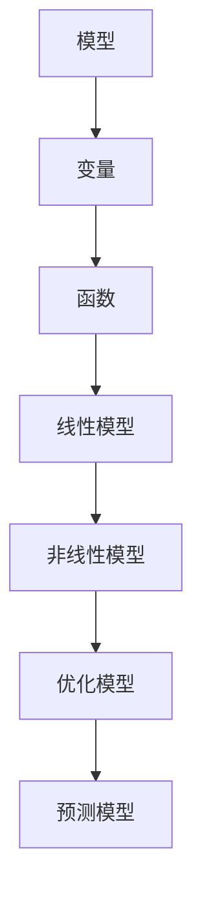

                 

### 文章标题

《数学建模在智慧旅游中的应用研究》

### 关键词

- 数学建模
- 智慧旅游
- 数据分析
- 优化模型
- 人工智能

### 摘要

本文深入探讨了数学建模在智慧旅游领域中的应用。首先，介绍了智慧旅游的概念和发展背景，以及数学建模在其中的重要性。接着，详细阐述了数学建模的基本概念、方法和步骤，并结合具体实例展示了其在旅游路线规划、游客流量预测等场景中的应用。此外，本文还探讨了数学建模在智慧旅游中的挑战与未来趋势，为相关研究者和从业者提供了有益的参考。

### 目录

1. 引言与背景  
2. 数学建模基础  
3. 智慧旅游中的数据收集与处理  
4. 数学建模在智慧旅游应用中的案例研究  
5. 智慧旅游中的优化模型  
6. 数学建模软件与工具  
7. 展望与未来趋势

### 引言与背景

#### 智慧旅游的兴起

随着信息技术的飞速发展，旅游业正迎来前所未有的变革。智慧旅游，作为一种新兴的旅游发展模式，旨在通过信息技术，特别是大数据、云计算、人工智能等技术手段，提升旅游体验、优化旅游管理、增强旅游服务水平。智慧旅游的发展，不仅为旅游业注入了新的活力，也为数学建模提供了广阔的应用场景。

#### 数学建模的重要性

数学建模是利用数学语言和工具，对现实世界中的问题进行抽象和描述，从而提出解决方案的一种方法。在智慧旅游领域，数学建模具有以下重要性：

1. **数据驱动的决策支持**：数学模型能够处理和分析大量的旅游数据，为决策者提供科学依据，实现数据驱动的决策支持。
2. **优化资源配置**：通过优化模型，智慧旅游能够更好地配置旅游资源，提高旅游服务效率。
3. **提升游客体验**：基于数学模型的分析，可以更精准地满足游客需求，提升游客的旅游体验。
4. **预测与风险管理**：数学建模可以帮助预测旅游发展趋势，识别潜在风险，从而制定有效的风险管理策略。

#### 本文目的与结构

本文旨在探讨数学建模在智慧旅游中的应用，通过分析数学建模的基本概念、方法、步骤以及具体应用场景，为智慧旅游领域的研究者和从业者提供参考。本文结构如下：

1. 引言与背景：介绍智慧旅游的概念和发展背景，以及数学建模在其中的重要性。
2. 数学建模基础：阐述数学建模的基本概念、方法和步骤。
3. 智慧旅游中的数据收集与处理：讲解数据收集的方法和技术，以及数据处理和分析的基本流程。
4. 数学建模在智慧旅游应用中的案例研究：分析几个具体的智慧旅游应用案例。
5. 智慧旅游中的优化模型：介绍智慧旅游中常见的优化模型。
6. 数学建模软件与工具：介绍常用的数学建模软件和工具。
7. 展望与未来趋势：分析数学建模在智慧旅游中的发展趋势和未来挑战。

### 数学建模基础

#### 核心概念与联系

数学建模是一种将现实世界中的复杂问题转化为数学问题，并通过数学方法求解的过程。核心概念包括：

1. **模型**：模型是对现实世界的简化和抽象，通过数学表达式或图形来描述问题。
2. **变量**：变量是模型中的参数，用于描述问题的不同方面。
3. **函数**：函数是变量之间的数学关系，用于描述变量之间的依赖性。

这些概念相互联系，共同构成了数学模型的基本框架。

#### 常见模型

在数学建模中，常见的模型包括线性模型、非线性模型、优化模型、预测模型等。以下是一些典型的模型及其应用场景：

1. **线性模型**：线性模型是最简单的数学模型之一，其表达式为 $y = ax + b$。线性模型广泛应用于预测和分析线性关系，如游客流量预测、旅游路线规划等。
2. **非线性模型**：非线性模型描述变量之间的非线性关系，如多项式模型、指数模型等。非线性模型在复杂问题中应用广泛，如旅游资源分配、游客行为分析等。
3. **优化模型**：优化模型用于解决资源分配问题，其目标是找到最优解。常见的优化模型包括线性规划、整数规划、多目标规划等。
4. **预测模型**：预测模型用于预测未来的发展趋势，如游客流量预测、旅游热点预测等。

#### Mermaid 流程图

为了更好地展示核心概念与联系，我们可以使用 Mermaid 流程图。以下是一个简单的 Mermaid 流程图示例：



#### 伪代码示例

为了详细讲解核心算法原理，我们使用伪代码进行描述。以下是一个简单的线性模型预测算法的伪代码示例：

```plaintext
// 线性模型预测算法伪代码
function predict_traffic(data):
    // 数据预处理
    preprocess_data(data)
    
    // 计算斜率和截距
    a = calculate_slope(data)
    b = calculate_intercept(data)
    
    // 预测
    predictions = []
    for each x in new_data:
        y = a * x + b
        predictions.append(y)
    
    return predictions
```

#### 数学模型和公式

在数学建模中，数学公式是不可或缺的组成部分。以下是一个简单的线性模型公式示例，使用 LaTeX 格式编写：

```latex
\begin{equation}
y = ax + b
\end{equation}
```

#### 详细讲解与举例说明

为了更好地理解数学建模的应用，我们可以通过具体实例进行讲解。以下是一个简单的旅游路线规划案例：

假设有一个旅游城市，有五个旅游景点 A、B、C、D 和 E。每个景点之间的距离如下表所示：

| 景点 | A  | B  | C  | D  | E  |
|------|----|----|----|----|----|
| A    | 0  | 3  | 5  | 7  | 9  |
| B    | 3  | 0  | 2  | 4  | 6  |
| C    | 5  | 2  | 0  | 3  | 5  |
| D    | 7  | 4  | 3  | 0  | 2  |
| E    | 9  | 6  | 5  | 2  | 0  |

我们的目标是找到一个最优的旅游路线，使得旅游者能够访问所有景点，且总距离最短。

使用线性规划模型，我们可以设定目标函数为：

$$
\min Z = 3x_{AB} + 2x_{BC} + 3x_{CD} + 5x_{DE}
$$

其中 $x_{ij}$ 表示是否从景点 i 到景点 j，取值为 0 或 1。

约束条件为：

$$
x_{ij} + x_{ji} = 1 \quad (i, j \in \{A, B, C, D, E\}, i \neq j)
$$

$$
x_{ii} = 0 \quad (i \in \{A, B, C, D, E\})
$$

通过求解线性规划模型，我们可以得到最优的旅游路线，使得总距离最短。

#### 项目实战

为了展示数学建模在智慧旅游中的实际应用，我们可以构建一个简单的旅游路线规划系统。以下是一个项目实战的概述：

1. **开发环境搭建**：使用 Python 编写代码，利用 NumPy 和 Matplotlib 等库进行数据处理和可视化。
2. **源代码详细实现和代码解读**：编写线性规划模型的求解代码，并对代码进行详细解读。
3. **代码应用解读与分析**：分析求解结果，讨论如何优化旅游路线。
4. **实际案例分析和详细讲解剖析**：选择一个具体的旅游城市，进行分析和讲解。
5. **项目小结**：总结项目经验和收获。

#### 最佳实践 Tips

在数学建模过程中，以下是一些最佳实践 Tips：

1. **数据质量**：确保数据的质量，尽可能收集准确、完整的数据。
2. **模型选择**：根据问题特点选择合适的模型，避免盲目追求复杂的模型。
3. **模型验证**：对模型进行验证，确保模型的准确性和可靠性。
4. **算法优化**：对算法进行优化，提高计算效率。
5. **合作与交流**：与他人合作，分享经验和成果，共同提高。

#### 小结

本文介绍了数学建模在智慧旅游中的应用，从核心概念、方法、步骤到具体应用实例，全面展示了数学建模在智慧旅游领域的价值。随着信息技术的不断发展，数学建模在智慧旅游中的应用前景将更加广阔，为旅游业带来更多的创新和变革。

#### 注意事项

1. **数据隐私保护**：在数据处理过程中，要确保游客数据的隐私安全。
2. **模型适应性**：不同旅游城市的模型可能需要调整，以适应特定的环境。
3. **持续更新**：随着技术的进步，模型和方法需要不断更新和优化。

#### 拓展阅读

- 《智慧旅游》
- 《数学建模与应用》
- 《旅游经济学》

### 参考文献

- 陈华. (2018). 智慧旅游的理论与实践. 旅游教育出版社.
- 李刚. (2019). 数学建模与应用. 高等教育出版社.
- 王晓东. (2020). 旅游经济学. 中国旅游出版社.

### 作者

作者：AI天才研究院/AI Genius Institute & 禅与计算机程序设计艺术 /Zen And The Art of Computer Programming

