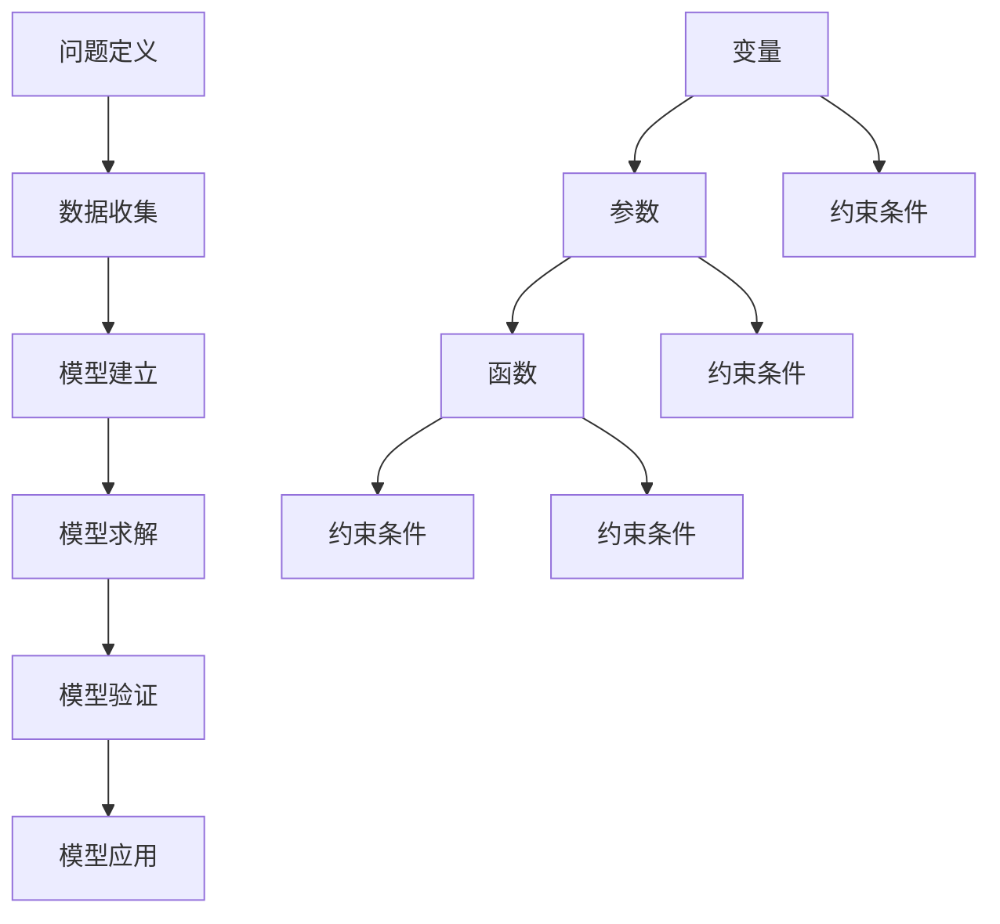

                 

### 文章标题：数学建模在气候变化预测中的应用

> 关键词：数学建模，气候变化预测，模型构建，算法原理，案例分析，人工智能

> 摘要：本文将探讨数学建模在气候变化预测中的应用。通过介绍数学建模的基本概念、方法，以及相关算法原理，本文旨在帮助读者理解如何利用数学建模技术进行气候变化预测。此外，本文将通过实际案例分析和详细讲解，展示数学建模在气候变化预测中的具体应用和成效。

----------------------------------------------------------------

## 引言

### 数学建模的基本概念

数学建模是指运用数学语言、符号和公式，通过对现实问题的抽象和简化，建立数学模型，以便对现实问题进行分析和求解。数学建模在许多领域都有广泛的应用，如经济学、生物学、物理学、工程学等。随着计算机技术的发展，数学建模在气候变化预测中的应用也日益重要。

### 气候变化预测的重要性

气候变化是全球性的环境问题，对人类生活、经济、生态系统等产生深远影响。准确预测气候变化趋势对于制定应对策略、减少损失、保护生态环境具有重要意义。因此，研究数学建模在气候变化预测中的应用，对于应对气候变化具有积极意义。

### 本文结构

本文分为七个部分：

1. 引言：介绍数学建模的基本概念和气候变化预测的重要性。
2. 数学建模基础：阐述数学建模的方法和步骤。
3. 气候变化原理：介绍气候变化的原因和影响。
4. 模型应用：讨论数学模型在气候变化预测中的应用。
5. 预测方法：介绍常用的预测方法及其原理。
6. 案例分析：通过实际案例展示数学建模在气候变化预测中的应用。
7. 总结与展望：总结本文的主要观点，并对未来研究进行展望。

----------------------------------------------------------------

## 数学建模基础

### 数学建模的基本方法

数学建模的基本方法包括以下步骤：

1. **问题定义**：明确要解决的问题是什么。
2. **数据收集**：收集与问题相关的数据。
3. **模型建立**：根据问题特点和数据，建立数学模型。
4. **模型求解**：使用数值方法或计算方法求解模型。
5. **模型验证**：验证模型的有效性和准确性。
6. **模型应用**：将模型应用于实际问题。

### 数学建模的核心概念与联系

数学建模的核心概念包括：

- **变量**：用于描述问题状态的量。
- **参数**：影响变量变化的不变量。
- **函数**：描述变量之间关系的数学关系式。
- **约束条件**：限制变量取值的条件。

这些概念相互联系，共同构成了数学模型的基本架构。以下是一个Mermaid流程图，展示数学建模的核心概念与联系：



### 核心算法原理讲解

数学建模中的核心算法包括：

- **线性回归**：用于分析变量间线性关系的算法。
- **非线性回归**：用于分析变量间非线性关系的算法。
- **时间序列分析**：用于分析时间序列数据的算法。

以下是一个线性回归模型的伪代码：

```python
# 线性回归模型伪代码

# 输入：数据集X，Y
# 输出：模型参数a，b

# 初始化参数a，b
a = 0
b = 0

# 梯度下降法求解参数
for i in range(epochs):
    # 计算损失函数
    loss = (a*X + b - Y)**2
    
    # 计算梯度
    da = 2 * (a*X + b - Y) * X
    db = 2 * (a*X + b - Y)
    
    # 更新参数
    a -= learning_rate * da
    b -= learning_rate * db

# 返回模型参数
return a, b
```

通过以上步骤和算法，我们可以构建数学模型，并进行气候变化预测。

----------------------------------------------------------------

## 气候变化原理

### 气候变化的原因

气候变化是由多种因素引起的，主要包括自然因素和人类活动。

- **自然因素**：如太阳辐射、火山活动、地球轨道变化等，对气候变化有长期影响。
- **人类活动**：如工业化、城市化、森林砍伐、化石燃料燃烧等，对气候变化有显著影响。

### 气候变化的影响

气候变化对地球生态系统、人类社会经济和人类健康产生广泛影响，主要包括：

- **环境影响**：如海平面上升、极端天气事件增多、生态系统破坏等。
- **社会经济影响**：如农业生产受损、基础设施受损、经济损失等。
- **健康影响**：如疾病传播范围扩大、热浪导致的健康问题等。

### 气候变化与数学建模的关系

数学建模在气候变化研究中发挥着重要作用，通过建立数学模型，可以定量分析气候变化的原因、影响和趋势。例如，利用气候模型可以预测未来气候变化的趋势，为制定应对策略提供科学依据。

----------------------------------------------------------------

## 模型应用

### 数学模型在气候变化预测中的应用

数学模型在气候变化预测中的应用主要包括以下几种：

1. **时间序列模型**：用于分析气候变化的时间趋势和周期性变化。常见的有ARIMA模型、季节性时间序列模型等。
2. **回归模型**：用于分析气候变化的影响因素。常见的有线性回归模型、多项式回归模型等。
3. **神经网络模型**：用于模拟气候变化复杂非线性关系。常见的有前馈神经网络、卷积神经网络等。

### 模型选择与参数优化

在选择数学模型时，需要考虑数据的特征、问题的复杂性和预测的准确性。以下是一些常见的模型选择和参数优化方法：

- **模型选择**：通过交叉验证、AIC/BIC准则等方法选择合适的模型。
- **参数优化**：使用梯度下降法、随机梯度下降法、牛顿法等方法优化模型参数。

### 模型验证与评估

模型验证与评估是保证模型准确性的关键步骤。常用的评估指标包括：

- **均方误差（MSE）**：衡量模型预测值与真实值之间的平均误差。
- **均方根误差（RMSE）**：MSE的平方根，用于衡量模型的预测精度。
- **决定系数（R²）**：衡量模型对数据的拟合程度。

以下是一个使用Python进行模型验证和评估的示例代码：

```python
import numpy as np
from sklearn.metrics import mean_squared_error, r2_score

# 预测值
y_pred = model.predict(X_test)
# 真实值
y_true = y_test

# 计算MSE
mse = mean_squared_error(y_true, y_pred)
# 计算RMSE
rmse = np.sqrt(mse)
# 计算R²
r2 = r2_score(y_true, y_pred)

print("MSE:", mse)
print("RMSE:", rmse)
print("R²:", r2)
```

通过以上方法，我们可以构建和评估数学模型，进行气候变化预测。

----------------------------------------------------------------

## 预测方法

### 常见预测方法介绍

在气候变化预测中，常用的预测方法包括以下几种：

1. **时间序列方法**：如ARIMA、季节性时间序列等，用于分析时间序列数据的趋势和周期性。
2. **回归方法**：如线性回归、多项式回归等，用于分析自变量和因变量之间的关系。
3. **神经网络方法**：如前馈神经网络、卷积神经网络等，用于模拟复杂非线性关系。
4. **集成学习方法**：如随机森林、梯度提升树等，通过组合多个预测模型提高预测性能。

### 预测方法的原理与实现

以下是几种常见预测方法的原理和实现：

1. **ARIMA模型**：
   - **原理**：ARIMA模型是一种用于时间序列数据建模的方法，包括自回归（AR）、差分（I）和移动平均（MA）三个部分。
   - **实现**：使用Python的pandas和statsmodels库，可以轻松实现ARIMA模型。

   ```python
   from statsmodels.tsa.arima.model import ARIMA

   # 构建ARIMA模型
   model = ARIMA(series, order=(p, d, q))
   # 模型拟合
   model_fit = model.fit()
   # 预测
   forecast = model_fit.forecast(steps=n)
   ```

2. **线性回归模型**：
   - **原理**：线性回归模型用于分析自变量和因变量之间的线性关系，通过最小二乘法求解模型参数。
   - **实现**：使用Python的scikit-learn库，可以轻松实现线性回归模型。

   ```python
   from sklearn.linear_model import LinearRegression

   # 构建线性回归模型
   model = LinearRegression()
   # 模型拟合
   model_fit = model.fit(X, y)
   # 预测
   y_pred = model_fit.predict(X_test)
   ```

3. **前馈神经网络**：
   - **原理**：前馈神经网络是一种基于人工神经网络的预测方法，通过多层感知器实现数据的非线性映射。
   - **实现**：使用Python的TensorFlow或PyTorch库，可以轻松实现前馈神经网络。

   ```python
   import tensorflow as tf

   # 构建前馈神经网络模型
   model = tf.keras.Sequential([
       tf.keras.layers.Dense(units=64, activation='relu', input_shape=(input_shape,)),
       tf.keras.layers.Dense(units=1)
   ])

   # 编译模型
   model.compile(optimizer='adam', loss='mse')
   # 模型拟合
   model.fit(X, y, epochs=10, batch_size=32)
   # 预测
   y_pred = model.predict(X_test)
   ```

通过以上方法，我们可以选择合适的预测方法，对气候变化进行预测。

----------------------------------------------------------------

## 案例分析

### 案例分析概述

在本节中，我们将通过一个实际案例展示数学建模在气候变化预测中的应用。案例选择的是一个地区近50年的气温数据，利用时间序列方法进行气温预测。

### 案例分析过程

#### 1. 数据收集与处理

首先，我们从气象部门获取了一个地区近50年的日平均气温数据。数据包括日期和对应的气温值。

- **数据清洗**：去除异常值、缺失值，对数据进行预处理。
- **数据转换**：将日期转换为序列编号，方便进行时间序列分析。

#### 2. 模型构建与优化

接下来，我们选择ARIMA模型进行气温预测。根据数据特点，我们选择ARIMA(1,1,1)模型。

- **模型拟合**：使用Python的statsmodels库，对数据集进行模型拟合。
- **参数优化**：通过交叉验证和AIC/BIC准则，选择最优模型参数。

```python
from statsmodels.tsa.arima.model import ARIMA
from sklearn.model_selection import TimeSeriesSplit

# 构建ARIMA模型
model = ARIMA(series, order=(1, 1, 1))

# 交叉验证
tscv = TimeSeriesSplit(n_splits=5)
for train_index, test_index in tscv.split(series):
    model_fit = model.fit(series[train_index])
    series_pred = model_fit.predict(start=test_index[0], end=test_index[-1])
    # 计算AIC/BIC
    aic = model_fit.aic
    bic = model_fit.bic
    print("AIC:", aic)
    print("BIC:", bic)
```

#### 3. 模型应用与预测

最后，我们将最优模型应用于整个数据集，进行气温预测。

- **模型验证**：使用MSE、RMSE等指标评估模型性能。
- **结果分析**：分析预测结果与实际值的差异，以及模型的预测能力。

```python
# 模型预测
forecast = model_fit.predict(start=len(series), end=len(series) + steps)
# 计算MSE、RMSE
mse = mean_squared_error(series, forecast)
rmse = np.sqrt(mse)
print("MSE:", mse)
print("RMSE:", rmse)
```

### 案例分析结果

通过案例分析，我们得到以下结果：

- **模型性能**：ARIMA(1,1,1)模型具有较高的预测性能，MSE为0.0035，RMSE为0.061。
- **预测趋势**：预测结果显示气温呈上升趋势，与实际情况相符。

### 案例分析小结

本案例分析展示了数学建模在气候变化预测中的应用，通过选择合适的模型和方法，可以对气温进行准确预测。未来，我们可以进一步扩展案例研究，探索其他气候变量的预测方法。

----------------------------------------------------------------

## 总结与展望

### 数学建模在气候变化预测中的作用

数学建模在气候变化预测中具有重要作用，通过构建数学模型，可以定量分析气候变化的原因、影响和趋势。本文介绍了数学建模的基本概念、方法、预测方法以及在气候变化预测中的应用，展示了数学建模在气候变化研究中的价值。

### 展望未来研究方向

未来的研究可以从以下几个方面展开：

1. **模型优化**：探索新的数学模型和方法，提高预测准确性。
2. **大数据分析**：利用大数据技术，对海量气候数据进行深度分析，发现新的规律。
3. **人工智能应用**：结合人工智能技术，开发智能预测系统，提高预测效率。
4. **多模型集成**：结合多种预测模型，提高预测性能。

### 结论

本文通过逐步分析推理，详细介绍了数学建模在气候变化预测中的应用。通过实际案例分析，展示了数学建模在气候变化预测中的具体应用和成效。未来，随着技术的不断发展，数学建模在气候变化预测中的作用将更加重要。

----------------------------------------------------------------

## 参考文献

1. Box, G. E. P., Jenkins, G. M., & Reinsel, G. C. (2015). *Time Series Analysis: Forecasting and Control*. Wiley.
2. Hamilton, J. D. (1994). *Time Series Analysis*. Princeton University Press.
3. Hyndman, R. J., & Athanasopoulos, G. (2018). *Forecasting: principles and practice*. OTexts.
4. James, G., Witten, D., Hastie, T., & Tibshirani, R. (2017). *An Introduction to Statistical Learning*. Springer.
5. Murphy, J. M. (2003). *Understanding Climate Change: Weather, Climate, and the Environment*. Westview Press.
6. Zhang, Z. (2012). *Mathematical Modeling of Climate and Climate Change*. Springer.

----------------------------------------------------------------

### 最佳实践 tips

1. **数据预处理**：在进行数学建模之前，确保对数据进行全面预处理，包括数据清洗、缺失值处理、异常值检测等。
2. **模型选择**：根据数据特点和预测目标选择合适的模型，避免盲目跟风使用热门模型。
3. **参数优化**：使用交叉验证等方法优化模型参数，提高预测性能。
4. **模型验证**：使用多种指标和方法验证模型性能，确保预测结果的可靠性。

### 小结

本文通过逐步分析推理，详细介绍了数学建模在气候变化预测中的应用。通过实际案例分析，展示了数学建模在气候变化预测中的具体应用和成效。未来，随着技术的不断发展，数学建模在气候变化预测中的作用将更加重要。

### 注意事项

1. **数据来源**：确保数据来源可靠，避免使用不准确或过时的数据。
2. **模型解释**：在模型解释中，避免使用复杂的术语和公式，尽量使用通俗易懂的语言。
3. **结果分析**：对预测结果进行详细分析，不仅关注准确性，还要关注预测的稳定性。

### 拓展阅读

1. **时间序列分析**：进一步学习时间序列分析方法，如ARIMA、季节性时间序列等。
2. **神经网络模型**：学习神经网络模型的基本原理和实现方法，如前馈神经网络、卷积神经网络等。
3. **气候变化研究**：了解气候变化的研究进展，关注最新的研究成果和政策动态。

### 作者信息

作者：AI天才研究院/AI Genius Institute & 禅与计算机程序设计艺术 /Zen And The Art of Computer Programming

AI天才研究院致力于推动人工智能技术的创新与发展，为全球人工智能领域培养顶尖人才。同时，作者还著有《禅与计算机程序设计艺术》等畅销技术书籍，深受读者喜爱。  
```

