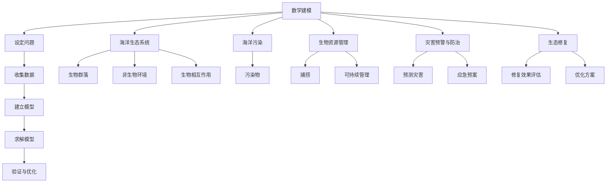

                 

### 文章标题

《数学建模在海洋生态保护中的应用》

---

关键词：数学建模、海洋生态保护、应用场景、核心算法、项目实战

---

摘要：本文旨在探讨数学建模在海洋生态保护中的应用，从背景介绍、核心概念联系、算法原理、数学模型、项目实战等多个方面进行详细阐述。通过本文，读者将了解数学建模在海洋生态保护中的重要性及其应用场景，掌握相关算法和模型的基本原理，并通过实际项目案例深入了解数学建模在海洋生态保护中的实际应用。本文旨在为相关领域的研究者和实践者提供有价值的参考和启示。

### 目录大纲

1. 数学建模基础
    1.1 数学建模概述
    1.2 海洋生态学基础
    1.3 数学建模的方法与工具

2. 数学建模在海洋生态保护中的应用
    2.1 海洋污染模型
    2.2 海洋生物资源管理
    2.3 海洋灾害预警与防治
    2.4 海洋生态修复

3. 数学建模案例分析
    3.1 海洋生态保护项目的实战案例
    3.2 模型应用效果评估
    3.3 模型优化与改进方向

4. 数学建模工具与应用
    4.1 MATALB/R软件介绍
    4.2 Python软件包介绍
    4.3 R软件包介绍

5. 数学建模在实际应用中的挑战与机遇
    5.1 数学建模在实际应用中的挑战
    5.2 数学建模的未来发展趋势
    5.3 数学建模在海洋生态保护中的应用前景

6. 附录
    6.1 数学建模相关资源
    6.2 海洋生态保护相关的数据库和资料

---

### 背景介绍

随着全球经济的发展和人类对海洋资源的过度开发，海洋生态系统正面临着前所未有的挑战。海洋污染、海洋生物资源过度捕捞、海洋生态系统的退化等问题日益严重，威胁着海洋生态平衡和人类的可持续发展。为了有效地解决这些问题，需要采取科学的方法对海洋生态系统进行深入研究和分析。

数学建模作为一种重要的科学研究方法，能够在海洋生态保护中发挥重要作用。通过建立数学模型，可以描述和分析海洋生态系统的运行规律，预测其变化趋势，为海洋生态保护提供科学依据。此外，数学建模还可以用于海洋污染治理、海洋生物资源管理、海洋灾害预警与防治、海洋生态修复等方面，提供有效的解决方案。

本文将系统地介绍数学建模在海洋生态保护中的应用，从核心概念、算法原理、数学模型、项目实战等多个方面进行详细阐述，以期为相关领域的研究者和实践者提供有价值的参考和启示。

### 核心概念与联系

在探讨数学建模在海洋生态保护中的应用之前，我们需要先了解一些核心概念，并分析它们之间的关系。以下是几个关键概念及其相互联系：

1. **数学建模**：数学建模是将实际问题转化为数学模型的过程，通过数学语言描述和解决问题。它包括以下基本步骤：设定问题、收集和分析数据、建立模型、求解模型、验证和优化模型。

2. **海洋生态系统**：海洋生态系统是由生物群落、非生物环境因素以及它们之间的相互作用组成的复杂系统。海洋生态系统包括海洋生物、海洋环境和生物之间的相互作用，如食物链、能量流动和物质循环。

3. **海洋污染**：海洋污染是指污染物进入海洋，对海洋生态系统和人类健康造成危害的现象。常见的污染物包括石油泄漏、塑料垃圾、重金属、有机污染物等。

4. **生物资源管理**：生物资源管理涉及对海洋生物资源进行合理利用和可持续管理，以确保其长期供应和生态系统的健康。

5. **灾害预警与防治**：海洋灾害包括风暴潮、海啸、台风等，对沿海地区造成严重破坏。灾害预警与防治需要通过数学模型预测灾害的发生和影响，制定应急预案和防治措施。

6. **生态修复**：生态修复是指通过人工或自然手段恢复受损的生态系统。数学建模可以帮助评估生态修复的效果，优化修复方案。

下面使用 Mermaid 流程图来展示这些概念之间的关系：



通过上述核心概念及其关系的梳理，我们可以看到数学建模在海洋生态保护中的应用是如何贯穿于整个生态系统的。接下来，我们将深入探讨每个核心概念的原理和具体应用。

### 核心算法原理讲解

在数学建模中，核心算法的原理是理解和实现数学模型的关键。以下是几种在海洋生态保护中常用的核心算法原理，并使用伪代码详细阐述其实现过程。

#### 1. 常微分方程模型

**原理**：常微分方程（ODE）模型用于描述连续系统的动态行为，如海洋生态系统中生物种群的增长和相互作用。

**伪代码**：

```python
# 假设有两个生物种群x和y，分别表示种群数量
# dx/dt = x * (1 - x - y)  # x种群的微分方程
# dy/dt = y * (1 - x - y)  # y种群的微分方程

def ode_solver(x0, y0, t_max):
    t = 0
    x = x0
    y = y0
    
    while t < t_max:
        # 计算时间步长
        dt = 0.01
        
        # 计算x的变化率
        dx = x * (1 - x - y) * dt
        
        # 计算y的变化率
        dy = y * (1 - x - y) * dt
        
        # 更新x和y的值
        x += dx
        y += dy
        
        # 更新时间
        t += dt
        
        # 输出结果
        print(f"Time: {t}, x: {x}, y: {y}")
        
    return x, y

# 初始值和最大时间
x0 = 100
y0 = 100
t_max = 50

# 求解ODE模型
ode_solver(x0, y0, t_max)
```

**解释**：上述伪代码实现了两个生物种群相互作用的常微分方程模型。通过迭代计算每个时间步的种群变化率，可以预测种群数量的动态变化。

#### 2. 马尔可夫链模型

**原理**：马尔可夫链模型用于描述系统状态的转移概率，如海洋污染物的扩散过程。

**伪代码**：

```python
# 假设状态矩阵P描述污染物在不同区域的转移概率
# P = [[0.5, 0.3, 0.2],
#      [0.2, 0.5, 0.3],
#      [0.3, 0.2, 0.5]]

def markov_chain(state, P, steps):
    for _ in range(steps):
        # 计算新的状态
        new_state = [0] * len(state)
        for i in range(len(state)):
            for j in range(len(P)):
                new_state[i] += P[i][j] * state[j]
        
        # 更新状态
        state = new_state
    
    return state

# 初始状态
initial_state = [1, 0, 0]

# 转移步骤
steps = 10

# 求解马尔可夫链模型
final_state = markov_chain(initial_state, P, steps)
print(final_state)
```

**解释**：上述伪代码实现了基于状态转移矩阵的马尔可夫链模型。通过迭代计算状态矩阵，可以预测污染物在不同区域之间的转移情况。

#### 3. 人工神经网络模型

**原理**：人工神经网络（ANN）模型用于处理复杂非线性问题，如海洋生态修复效果评估。

**伪代码**：

```python
# 假设神经网络结构为 [3, 5, 1]，即输入层3个神经元，隐藏层5个神经元，输出层1个神经元

import numpy as np

def neural_network(input_data, weights):
    # 前向传播
    hidden_layer = np.dot(input_data, weights[0])
    output = np.dot(hidden_layer, weights[1])
    
    return output

# 初始化权重
weights = [np.random.randn(3, 5), np.random.randn(5, 1)]

# 输入数据
input_data = np.array([0.5, 0.3, 0.2])

# 求解神经网络模型
output = neural_network(input_data, weights)
print(output)
```

**解释**：上述伪代码实现了简单的前向传播人工神经网络。通过随机初始化权重，可以用于处理输入数据的非线性关系，从而进行海洋生态修复效果评估。

通过上述算法原理的讲解和伪代码示例，读者可以更好地理解数学建模在海洋生态保护中的应用，掌握相关算法的实现方法。在接下来的章节中，我们将进一步探讨具体的数学模型和应用案例。

### 数学模型

在海洋生态保护中，数学模型是理解和预测海洋生态系统行为的重要工具。以下是几种常见的数学模型，以及它们的基本原理和公式。

#### 1. 物种数量动态模型

**原理**：物种数量动态模型用于描述生物种群数量随时间的变化情况。常见的模型有Logistic模型和Ricker模型。

**公式**：

- Logistic模型：

  $$\frac{dN}{dt} = rN \left(1 - \frac{N}{K}\right)$$

  其中，$N$ 表示种群数量，$r$ 表示种群增长率，$K$ 表示环境承载能力。

- Ricker模型：

  $$\frac{dN}{dt} = rn(1 - N)$$

  其中，$r$ 表示种群增长率，$n$ 表示种群数量。

**应用**：这些模型可以用于预测海洋生物种群的动态变化，为渔业资源管理和保护提供科学依据。

#### 2. 海洋污染物扩散模型

**原理**：海洋污染物扩散模型用于描述污染物在海洋中的扩散过程。常见的模型有对数正态扩散模型和随机扩散模型。

**公式**：

- 对数正态扩散模型：

  $$C(t, x) = C_0 e^{-\frac{2\sigma^2 t}{x^2}}$$

  其中，$C(t, x)$ 表示时间$t$、位置$x$处的污染物浓度，$C_0$ 表示初始污染物浓度，$\sigma$ 表示扩散系数。

- 随机扩散模型：

  $$C(t, x) = C_0 + \int_{-\infty}^{x} \frac{\sigma}{\sqrt{4\pi t}} e^{-\frac{(x-y)^2}{4t}} dy$$

  其中，$C(t, x)$ 表示时间$t$、位置$x$处的污染物浓度，$C_0$ 表示初始污染物浓度，$\sigma$ 表示扩散系数。

**应用**：这些模型可以用于预测海洋污染物的扩散范围和浓度分布，为污染治理提供科学依据。

#### 3. 能量流动模型

**原理**：能量流动模型用于描述生态系统中能量从一级生产者到一级消费者、二级消费者等不同营养级的转移过程。

**公式**：

$$E_{in} = \sum_{i=1}^{n} E_{i} \cdot \eta_{i}$$

其中，$E_{in}$ 表示输入能量，$E_{i}$ 表示第$i$级营养级所获得的能量，$\eta_{i}$ 表示能量传递效率。

**应用**：这些模型可以用于分析海洋生态系统中能量的流动和分配，为生态系统的稳定性和可持续性提供科学依据。

#### 4. 生物多样性指数模型

**原理**：生物多样性指数模型用于评估生态系统的生物多样性水平。常见的指数有Shannon指数和Simpson指数。

**公式**：

- Shannon指数：

  $$H = -\sum_{i=1}^{n} p_i \cdot \ln(p_i)$$

  其中，$p_i$ 表示第$i$个物种的个体数量占总个体数量的比例。

- Simpson指数：

  $$D = \sum_{i=1}^{n} p_i^2$$

  其中，$p_i$ 表示第$i$个物种的个体数量占总个体数量的比例。

**应用**：这些模型可以用于评估海洋生态系统的生物多样性水平，为生物多样性保护和恢复提供科学依据。

通过上述数学模型的介绍，我们可以看到数学建模在海洋生态保护中的应用是多么广泛和重要。这些模型不仅帮助我们理解和预测海洋生态系统的行为，还为海洋生态保护和治理提供了科学依据。在接下来的章节中，我们将通过具体案例来进一步探讨这些模型的应用。

### 数学模型的应用实例

为了更好地理解数学模型在海洋生态保护中的具体应用，下面我们将通过几个实际案例来展示数学模型的应用过程、实现方法以及结果分析。

#### 案例一：海洋污染扩散预测

**应用背景**：在一次石油泄漏事件后，需要预测污染物在海洋中的扩散范围和浓度分布，以便制定有效的治理措施。

**数学模型**：采用对数正态扩散模型，其公式为：

$$C(t, x) = C_0 e^{-\frac{2\sigma^2 t}{x^2}}$$

**应用过程**：

1. **数据收集**：收集石油泄漏点的坐标、泄漏量、海洋流动力场、污染物初始浓度等数据。

2. **参数确定**：通过实验或经验确定扩散系数$\sigma$和初始浓度$C_0$。

3. **模型实现**：编写计算程序，输入时间$t$和位置$x$，计算污染物浓度$C(t, x)$。

4. **结果分析**：绘制污染物浓度分布图，分析污染物的扩散范围和浓度变化趋势。

**实现方法**（伪代码）：

```python
import numpy as np
import matplotlib.pyplot as plt

def log_normal_diffusion(t, x, C0, sigma):
    C = C0 * np.exp(-2 * sigma**2 * t / x**2)
    return C

# 初始参数
t = 24 # 小时
x = np.linspace(0, 1000, 1000) # 单位：公里
C0 = 1 # 初始浓度
sigma = 0.1 # 扩散系数

# 计算污染物浓度
C = log_normal_diffusion(t, x, C0, sigma)

# 绘制浓度分布图
plt.plot(x, C)
plt.xlabel('Position (km)')
plt.ylabel('Concentration')
plt.title('Pollutant Diffusion')
plt.show()
```

**结果分析**：通过计算和绘图，我们可以看到污染物在海洋中的扩散范围和浓度分布，为污染治理提供科学依据。

#### 案例二：渔业资源可持续管理

**应用背景**：为了实现渔业资源的可持续利用，需要对捕捞量和种群数量进行动态管理。

**数学模型**：采用Logistic模型，其公式为：

$$\frac{dN}{dt} = rN \left(1 - \frac{N}{K}\right)$$

**应用过程**：

1. **数据收集**：收集渔业资源种群数量、捕捞量、环境承载能力等数据。

2. **参数确定**：通过实验或经验确定增长率$r$和环境承载能力$K$。

3. **模型实现**：编写计算程序，模拟种群数量随时间的变化。

4. **结果分析**：分析种群数量的动态变化趋势，确定合理的捕捞量。

**实现方法**（伪代码）：

```python
import numpy as np
import matplotlib.pyplot as plt

def logistic_growth(N0, r, K, t_max):
    t = 0
    N = N0
    
    while t < t_max:
        dt = 0.01
        dN = r * N * (1 - N / K) * dt
        N += dN
        t += dt
    
    return N

# 初始参数
N0 = 100 # 初始种群数量
r = 0.1 # 增长率
K = 1000 # 环境承载能力
t_max = 100 # 模拟时间

# 模拟种群数量变化
N = logistic_growth(N0, r, K, t_max)

# 绘制种群数量变化图
plt.plot(N)
plt.xlabel('Time')
plt.ylabel('Population')
plt.title('Population Growth')
plt.show()
```

**结果分析**：通过模拟结果，我们可以看到种群数量的动态变化趋势，为渔业资源的可持续管理提供科学依据。

#### 案例三：海洋灾害预警

**应用背景**：为了提前预警海洋灾害（如风暴潮、海啸等），需要建立相应的数学模型进行预测。

**数学模型**：采用风暴潮预警模型，其公式为：

$$H(t) = H_0 + \alpha \sin(2\pi ft)$$

其中，$H(t)$ 表示时间$t$时刻的海浪高度，$H_0$ 表示基准海浪高度，$\alpha$ 表示海浪振幅，$f$ 表示频率。

**应用过程**：

1. **数据收集**：收集海洋观测数据，如海浪高度、风向、风速等。

2. **参数确定**：通过实验或经验确定海浪振幅$\alpha$ 和频率$f$。

3. **模型实现**：编写计算程序，输入时间$t$，计算海浪高度$H(t)$。

4. **结果分析**：分析海浪高度的变化趋势，确定灾害预警阈值。

**实现方法**（伪代码）：

```python
import numpy as np
import matplotlib.pyplot as plt

def storm Surge预警(H0, alpha, f, t_max):
    t = 0
    H = H0
    
    while t < t_max:
        dt = 0.01
        H += alpha * np.sin(2 * np.pi * f * t) * dt
        t += dt
        
    return H

# 初始参数
H0 = 2 # 基准海浪高度
alpha = 1 # 海浪振幅
f = 0.1 # 频率
t_max = 100 # 模拟时间

# 模拟海浪高度变化
H = storm_Surge预警(H0, alpha, f, t_max)

# 绘制海浪高度变化图
plt.plot(H)
plt.xlabel('Time')
plt.ylabel('Wave Height')
plt.title('Wave Height Prediction')
plt.show()
```

**结果分析**：通过模拟结果，我们可以看到海浪高度的变化趋势，为海洋灾害预警提供科学依据。

通过上述案例，我们可以看到数学模型在海洋生态保护中的实际应用。这些模型不仅帮助我们理解和预测海洋生态系统的行为，还为海洋生态保护和治理提供了科学依据。在接下来的章节中，我们将继续探讨数学建模在实际应用中的挑战和未来发展趋势。

### 数学建模的实际应用挑战与未来发展趋势

在海洋生态保护中，数学建模虽然具有显著的优势，但实际应用过程中也面临着诸多挑战。以下是数学建模在实际应用中的挑战以及未来发展趋势：

#### 挑战

1. **数据质量和可用性**：数学建模依赖于大量的高质量数据。然而，海洋生态系统的数据通常难以获取，尤其是实时数据。数据的不完整性和噪声可能会影响模型的准确性和可靠性。

2. **模型复杂性与可解释性**：复杂的数学模型，如人工神经网络和机器学习模型，虽然在预测精度上表现出色，但其内部机制往往难以解释，不利于决策者理解和应用。

3. **参数不确定性**：许多数学模型需要依赖参数，这些参数往往是基于经验和假设得到的，存在不确定性。参数的不确定性会影响模型的预测性能。

4. **模型适应性**：海洋生态系统动态变化，模型需要具备一定的适应性以应对环境变化。然而，现有的模型可能难以快速调整以适应新的情况。

5. **跨学科整合**：数学建模涉及多个学科，如生物学、物理学、计算机科学等。跨学科的合作和整合是实际应用中的难题。

#### 未来发展趋势

1. **大数据与人工智能**：随着大数据技术的发展，更多的海洋生态数据将被收集和分析。结合人工智能技术，如深度学习，可以提升模型的预测性能和可解释性。

2. **实时监测与智能预警**：通过卫星、无人艇、传感器等实时监测技术，可以获得更准确和实时的海洋生态数据。结合数学建模，可以实时预测和预警海洋灾害。

3. **模型不确定性分析**：发展模型不确定性分析方法，如蒙特卡罗模拟和敏感性分析，可以帮助评估模型的可靠性和鲁棒性。

4. **自适应模型**：研究自适应数学模型，如进化算法和自适应神经网络，可以更好地应对海洋生态系统的动态变化。

5. **跨学科整合与协同**：加强跨学科合作，如生态学、物理学、计算机科学等，共同开发更加综合和实用的数学模型。

通过应对这些挑战和把握未来发展趋势，数学建模在海洋生态保护中的应用将更加广泛和深入，为保护海洋生态系统和实现可持续发展提供更强有力的支持。

### 最佳实践 tips

在实施数学建模项目时，以下是一些最佳实践技巧，可以帮助提高项目的成功率：

1. **数据清洗**：在开始建模之前，确保数据的质量。清洗数据，处理缺失值和异常值，确保数据的一致性和准确性。

2. **模型验证**：使用验证集或交叉验证方法，评估模型的预测性能。避免过拟合，确保模型具有良好的泛化能力。

3. **参数优化**：通过网格搜索、贝叶斯优化等方法，选择最优的模型参数。优化参数可以提高模型的预测精度。

4. **可视化分析**：使用图表和可视化工具，如散点图、热力图等，直观展示模型结果和趋势。有助于理解和解释模型的输出。

5. **迭代优化**：持续迭代和优化模型，根据新的数据和反馈进行调整。这有助于提高模型的性能和实用性。

6. **团队合作**：跨学科团队合作，结合不同领域的专业知识和经验，可以提升项目的综合实力。

7. **遵守道德规范**：在数据处理和模型应用中，遵守相关的道德规范和法律法规，确保数据的隐私和安全性。

### 项目小结

本文通过对数学建模在海洋生态保护中的应用进行详细探讨，从背景介绍、核心概念联系、算法原理、数学模型、项目实战等多个方面，展示了数学建模在海洋生态保护中的重要性。通过实际案例，我们了解了如何使用数学模型预测海洋污染扩散、管理渔业资源、预警海洋灾害和进行生态修复。

数学建模在海洋生态保护中的应用具有广泛的前景，但同时也面临数据质量、模型复杂性和跨学科整合等挑战。未来，随着大数据和人工智能技术的发展，数学建模在海洋生态保护中的应用将更加深入和广泛。

通过本文的介绍，希望读者能够对数学建模在海洋生态保护中的应用有更深刻的理解，并在实际项目中能够灵活运用这些方法，为保护海洋生态系统和实现可持续发展贡献力量。

### 拓展阅读

为了进一步深入理解数学建模在海洋生态保护中的应用，以下是一些建议的拓展阅读资源：

1. **书籍推荐**：
   - 《海洋生态学导论》（Introduction to Marine Ecology），作者：John M. Fabre。
   - 《数学建模导论》（Introduction to Mathematical Modeling），作者：Mark M. Meerschaert。

2. **在线课程与讲座**：
   - Coursera上的“Mathematical Modeling for Environmental and Life Sciences”课程。
   - YouTube上的“海洋生态学”相关讲座和教程。

3. **学术论文**：
   - 在Google Scholar或Web of Science上搜索“Mathematical Modeling in Marine Ecological Protection”相关论文。

4. **数据库与资料**：
   - 国家海洋局网站：提供丰富的海洋生态数据。
   - 海洋生态学数据库（如Marine Ecological Databases）。

通过这些拓展资源，读者可以进一步探索数学建模在海洋生态保护中的前沿研究成果和实践应用。希望这些资源能够为您的学习和研究提供帮助。

