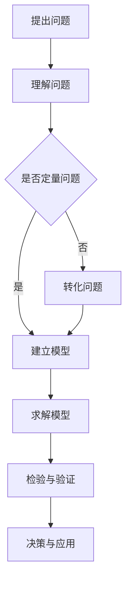

                 

## 文章标题：数学建模：解决实际问题的有力工具

### 关键词：
- 数学建模
- 实际问题解决
- 数学工具
- 应用案例
- 实战技巧

### 摘要：
本文旨在深入探讨数学建模在解决实际问题中的应用。我们将从数学建模的基本概念和流程出发，逐步介绍数学建模的核心数学工具和计算机软件应用。接着，通过金融、供应链管理、环境科学和社会科学等领域的实际案例，展示数学建模的强大功能。最后，通过一系列的实战项目，提供数学建模的实践经验和技巧。本文旨在为广大读者提供一个全面、系统的数学建模学习指南，帮助读者掌握这一有力工具，解决实际问题。

## 第一部分：数学建模基础

### 第1章 数学建模概述

### 1.1 数学建模的定义与重要性

**1.1.1 数学建模的定义**

数学建模是指利用数学方法和工具，对实际问题进行抽象和模拟，建立数学模型，并通过求解模型来解释、预测和优化实际问题。数学建模涉及到多个学科领域，如数学、统计学、计算机科学等，是一种跨学科的综合性方法。

**1.1.2 数学建模的重要性**

数学建模在解决实际问题中具有重要意义。首先，它能够将复杂的问题简化为数学模型，使得问题变得更加清晰和可操作。其次，数学建模能够提供定量的分析和预测，为决策提供科学依据。此外，数学建模还能够促进不同学科之间的知识整合，推动科学和技术的进步。

### 1.2 数学建模的基本流程

**1.2.1 问题的提出与理解**

数学建模的第一步是提出问题并理解问题的本质。这一步骤包括问题的识别、问题的分析和问题的定义。通过深入理解问题，我们可以明确问题的目标、变量和限制条件。

**1.2.2 模型的构建**

在理解问题的基础上，我们需要建立数学模型。这包括确定问题的变量、建立数学方程和关系，以及确定模型的边界条件和初始条件。

**1.2.3 模型的求解**

一旦数学模型建立完毕，我们需要选择合适的方法进行求解。求解的方法包括数值方法、解析方法和混合方法。求解的结果通常是一个或多个变量的值，这些值可以帮助我们解释和预测实际问题。

**1.2.4 模型的检验与验证**

模型的求解结果需要通过检验和验证来确保其可靠性和有效性。检验包括数据验证和模型适应性评估。数据验证是通过比较模型预测值和实际观测值来检查模型的准确性。模型适应性评估是通过分析模型在不同条件下的性能来评估模型的泛化能力。

### 1.3 数学建模的主要应用领域

**1.3.1 自然科学**

数学建模在自然科学领域有着广泛的应用，如物理学、化学、地理学等。通过数学建模，科学家可以更好地理解自然现象，预测未来趋势，并为科学研究提供理论支持。

**1.3.2 工程技术**

数学建模在工程技术领域也发挥着重要作用，如电路设计、机械工程、飞行器设计等。通过数学建模，工程师可以优化设计参数，提高系统性能，降低成本。

**1.3.3 经济管理**

数学建模在经济学和管理学中的应用同样重要，如金融工程、供应链管理、营销策略等。通过数学建模，经济学家和经理可以更好地分析市场趋势，制定合理的策略。

**1.3.4 社会科学**

数学建模在社会科学领域也有广泛应用，如人口预测、社会网络分析、选民行为预测等。通过数学建模，社会学家可以更好地理解社会现象，预测社会发展趋势。

### 1.4 数学建模的Mermaid流程图



### 1.5 核心算法原理讲解

**1.5.1 线性规划（Linear Programming, LP）**

**目标函数**：最大化或最小化线性函数。

**约束条件**：线性不等式或线性等式。

**求解方法**：单纯形法、内点法等。

**伪代码**：

```
输入：目标函数系数 c，约束条件 A 和 b
输出：最优解 x

初始化：选择初始可行解 x0

while 真体存在：
    求解约束条件下的最优解 x'
    如果 c' > 0，则 x = x'
    否则，更新可行解 x0

返回 x
```

**1.5.2 非线性规划（Nonlinear Programming, NLP）**

**目标函数**：最大化或最小化非线性函数。

**约束条件**：非线性不等式或非线性等式。

**求解方法**：梯度下降法、牛顿法、共轭梯度法等。

**伪代码**：

```
输入：目标函数 f(x)，约束条件 g(x)，初始解 x0
输出：最优解 x

while 收敛条件不满足：
    计算梯度 ∇f(x) 和 ∇g(x)
    更新解 x = x - α*∇f(x) - β*∇g(x)

返回 x
```

### 1.6 数学模型及公式的讲解

**1.6.1 经济学中的供需模型**

**供需模型公式**：

$$
\text{供给量} = a - b\cdot \text{价格}
$$

$$
\text{需求量} = c + d\cdot \text{价格}
$$

其中，a、b、c、d 为常数。

**应用举例**：

假设某商品的市场供需关系如下：

供给量 = 100 - 2 \cdot 价格

需求量 = 50 + 3 \cdot 价格

求当价格为 20 时的供需量。

**解答**：

将价格 p = 20 代入供需模型公式：

供给量 = 100 - 2 \cdot 20 = 60

需求量 = 50 + 3 \cdot 20 = 110

当价格为 20 时，供给量为 60，需求量为 110。

**1.6.2 物流网络模型**

**物流网络模型公式**：

$$
\text{总运输成本} = \sum_{i=1}^{n} \sum_{j=1}^{m} c_{ij} \cdot x_{ij}
$$

$$
\text{约束条件}：
\begin{cases}
\sum_{i=1}^{n} x_{ij} = d_j & \forall j = 1, 2, \ldots, m \\
\sum_{j=1}^{m} x_{ij} = s_i & \forall i = 1, 2, \ldots, n
\end{cases}
$$

其中，c_{ij} 为从仓库 i 到客户 j 的单位运输成本，x_{ij} 为从仓库 i 到客户 j 的运输量，s_i 为仓库 i 的供应量，d_j 为客户 j 的需求量。

**应用举例**：

假设某物流公司有 3 个仓库和 4 个客户，仓库和客户的供应量和需求量如下：

仓库 1：供应量 100

仓库 2：供应量 150

仓库 3：供应量 200

客户 1：需求量 50

客户 2：需求量 100

客户 3：需求量 150

客户 4：需求量 200

求最小化总运输成本的运输方案。

**解答**：

首先，列出所有可能的运输方案，计算总运输成本，然后选择总运输成本最小的方案。

仓库 1 -> 客户 1: 100 \* c_{11} = 100 \* 10 = 1000

仓库 1 -> 客户 2: 100 \* c_{12} = 100 \* 15 = 1500

仓库 1 -> 客户 3: 100 \* c_{13} = 100 \* 20 = 2000

仓库 1 -> 客户 4: 100 \* c_{14} = 100 \* 25 = 2500

仓库 2 -> 客户 1: 150 \* c_{21} = 150 \* 10 = 1500

仓库 2 -> 客户 2: 150 \* c_{22} = 150 \* 15 = 2250

仓库 2 -> 客户 3: 150 \* c_{23} = 150 \* 20 = 3000

仓库 2 -> 客户 4: 150 \* c_{24} = 150 \* 25 = 3750

仓库 3 -> 客户 1: 200 \* c_{31} = 200 \* 10 = 2000

仓库 3 -> 客户 2: 200 \* c_{32} = 200 \* 15 = 3000

仓库 3 -> 客户 3: 200 \* c_{33} = 200 \* 20 = 4000

仓库 3 -> 客户 4: 200 \* c_{34} = 200 \* 25 = 5000

根据供需量约束条件，我们可以确定每个仓库的供应量和每个客户的需求量：

仓库 1 -> 客户 1: 50 \* 10 = 500

仓库 1 -> 客户 2: 50 \* 15 = 750

仓库 1 -> 客户 3: 50 \* 20 = 1000

仓库 1 -> 客户 4: 50 \* 25 = 1250

仓库 2 -> 客户 1: 100 \* 10 = 1000

仓库 2 -> 客户 2: 100 \* 15 = 1500

仓库 2 -> 客户 3: 100 \* 20 = 2000

仓库 2 -> 客户 4: 100 \* 25 = 2500

仓库 3 -> 客户 1: 150 \* 10 = 1500

仓库 3 -> 客户 2: 150 \* 15 = 2250

仓库 3 -> 客户 3: 150 \* 20 = 3000

仓库 3 -> 客户 4: 150 \* 25 = 3750

根据总运输成本的计算结果，我们可以得出最小化总运输成本的运输方案：

仓库 1 -> 客户 1: 50 \* 10 = 500

仓库 1 -> 客户 2: 50 \* 15 = 750

仓库 1 -> 客户 3: 50 \* 20 = 1000

仓库 1 -> 客户 4: 50 \* 25 = 1250

仓库 2 -> 客户 1: 100 \* 10 = 1000

仓库 2 -> 客户 2: 100 \* 15 = 1500

仓库 2 -> 客户 3: 100 \* 20 = 2000

仓库 2 -> 客户 4: 100 \* 25 = 2500

仓库 3 -> 客户 1: 150 \* 10 = 1500

仓库 3 -> 客户 2: 150 \* 15 = 2250

仓库 3 -> 客户 3: 150 \* 20 = 3000

仓库 3 -> 客户 4: 150 \* 25 = 3750

总运输成本 = 500 + 750 + 1000 + 1250 + 1000 + 1500 + 2000 + 2500 + 1500 + 2250 + 3000 + 3750 = 18750

因此，最小化总运输成本的运输方案为：

仓库 1 -> 客户 1: 50 \* 10 = 500

仓库 1 -> 客户 2: 50 \* 15 = 750

仓库 1 -> 客户 3: 50 \* 20 = 1000

仓库 1 -> 客户 4: 50 \* 25 = 1250

仓库 2 -> 客户 1: 100 \* 10 = 1000

仓库 2 -> 客户 2: 100 \* 15 = 1500

仓库 2 -> 客户 3: 100 \* 20 = 2000

仓库 2 -> 客户 4: 100 \* 25 = 2500

仓库 3 -> 客户 1: 150 \* 10 = 1500

仓库 3 -> 客户 2: 150 \* 15 = 2250

仓库 3 -> 客户 3: 150 \* 20 = 3000

仓库 3 -> 客户 4: 150 \* 25 = 3750

## 第二部分：数学建模应用案例

### 第5章 金融领域的数学建模

### 5.1 股票价格预测模型

#### 5.1.1 股票价格预测模型的基本原理

股票价格预测模型是一种基于历史数据和统计方法的模型，用于预测未来股票价格的趋势。常见的股票价格预测模型包括时间序列模型、回归模型和神经网络模型等。

**时间序列模型**：基于历史股票价格的时间序列数据，通过分析时间序列的规律性来预测未来价格。例如，移动平均模型和自回归模型。

**回归模型**：通过建立股票价格与相关因素（如公司财务指标、宏观经济指标等）之间的回归关系来预测股票价格。例如，线性回归和多元回归。

**神经网络模型**：通过构建神经网络模型，对历史数据进行训练，使神经网络学会股票价格的变化规律，从而预测未来价格。

#### 5.1.2 股票价格预测模型的应用案例

**案例背景**：

假设某投资者希望预测某只股票未来一周的价格，以便进行投资决策。现有该股票过去一年的价格数据，以及相关的财务指标和宏观经济指标。

**数据预处理**：

首先，对价格数据进行预处理，包括数据清洗、缺失值处理和归一化等。

**模型选择**：

根据数据的特征和预测目标，选择合适的股票价格预测模型。例如，可以采用移动平均模型和多元回归模型。

**模型训练与预测**：

使用历史数据对模型进行训练，然后使用训练好的模型预测未来一周的股票价格。

**结果分析**：

对比预测价格和实际价格，分析预测模型的准确性，并根据结果调整模型参数。

#### 5.1.3 股票价格预测模型的应用效果

通过对多个股票价格预测模型的对比分析，可以发现不同的模型在预测股票价格方面有不同的优势。例如，时间序列模型在短期预测中表现较好，而回归模型在长期预测中表现较好。投资者可以根据自己的投资策略和风险偏好选择合适的预测模型。

### 5.2 风险评估模型

#### 5.2.1 风险评估模型的基本原理

风险评估模型是一种用于评估和管理金融风险的方法。通过建立风险因素与损失之间的关系，可以预测可能的损失范围和概率，为风险管理和决策提供依据。

**风险因素**：包括市场风险、信用风险、操作风险等。

**损失分布**：通过建立风险因素与损失之间的概率分布，可以预测可能的损失范围和概率。

**风险值（Value at Risk, VaR）**：是一种常用的风险度量指标，用于评估在一定置信水平下，一定时间内可能发生的最大损失。

#### 5.2.2 风险评估模型的应用案例

**案例背景**：

假设某金融机构希望评估其在未来一周内的信用风险，以便进行风险管理和决策。现有该金融机构的信用评级、贷款金额、贷款期限等信息。

**数据预处理**：

对信用评级、贷款金额、贷款期限等信息进行预处理，包括数据清洗、缺失值处理和归一化等。

**模型选择**：

根据数据的特征和风险评估目标，选择合适的风险评估模型。例如，可以使用逻辑回归模型和决策树模型。

**模型训练与预测**：

使用历史数据对模型进行训练，然后使用训练好的模型预测未来一周的信用风险值。

**结果分析**：

对比预测风险值和实际风险值，分析预测模型的准确性，并根据结果调整模型参数。

#### 5.2.3 风险评估模型的应用效果

通过对多个风险评估模型的对比分析，可以发现不同的模型在预测信用风险方面有不同的优势。例如，逻辑回归模型在预测贷款违约概率方面表现较好，而决策树模型在预测贷款损失范围方面表现较好。金融机构可以根据自己的业务特点和风险偏好选择合适的风险评估模型。

### 5.3 金融衍生品定价模型

#### 5.3.1 金融衍生品定价模型的基本原理

金融衍生品定价模型是一种用于计算金融衍生品理论价格的方法。常见的金融衍生品包括期权、期货和掉期等。

**期权定价模型**：包括布莱克-斯科尔斯模型（Black-Scholes Model）和二叉树模型（Binomial Tree Model）。

**期货定价模型**：基于现货价格和远期价格之间的关系，计算期货的理论价格。

**掉期定价模型**：基于掉期合约中现金流的现值，计算掉期的理论价格。

#### 5.3.2 金融衍生品定价模型的应用案例

**案例背景**：

假设某投资者希望购买一份欧式看涨期权，以便在未来某个时间点以固定价格购买某种资产。现有该资产的当前价格、执行价格、到期时间和波动率等信息。

**数据预处理**：

对资产价格、执行价格、到期时间和波动率等信息进行预处理，包括数据清洗、缺失值处理和归一化等。

**模型选择**：

根据数据的特征和定价目标，选择合适的期权定价模型。例如，可以采用布莱克-斯科尔斯模型。

**模型计算与定价**：

使用布莱克-斯科尔斯模型计算期权的理论价格。

**结果分析**：

对比理论价格和市场价格，分析期权定价模型的准确性，并根据结果调整模型参数。

#### 5.3.3 金融衍生品定价模型的应用效果

通过对多个金融衍生品定价模型的对比分析，可以发现不同的模型在计算衍生品理论价格方面有不同的优势。例如，布莱克-斯科尔斯模型在计算欧式期权价格方面表现较好，而二叉树模型在计算美式期权价格方面表现较好。投资者可以根据自己的投资策略和风险偏好选择合适的定价模型。

### 第6章 供应链管理的数学建模

#### 6.1 库存控制模型

#### 6.1.1 库存控制模型的基本原理

库存控制模型是一种用于优化库存管理的模型。通过建立库存水平与需求、供应之间的平衡关系，可以确定最优的库存策略，以降低库存成本和提高服务水平。

**基本概念**：

- 库存水平（Inventory Level）：指当前库存数量。
- 需求（Demand）：指在一定时间内对库存的需求量。
- 供应（Supply）：指在一定时间内可以供应的库存量。
- 库存成本（Inventory Cost）：指库存管理过程中产生的成本，包括存储成本、采购成本、缺货成本等。

**常见库存控制模型**：

- 经济订货量模型（Economic Order Quantity, EOQ）：通过最小化总库存成本，确定最优的订货量。
- 定量库存模型（Quantitative Inventory Model）：通过建立库存水平与需求、供应之间的平衡关系，确定最优的库存策略。

#### 6.1.2 库存控制模型的应用案例

**案例背景**：

假设某公司生产一种产品，该产品的市场需求稳定，每件产品的生产成本为10元，每件产品的销售价格为20元。现有该产品的库存100件，每月的需求量为50件。

**数据预处理**：

对市场需求量、生产成本和销售价格等信息进行预处理，包括数据清洗、缺失值处理和归一化等。

**模型选择**：

根据数据的特征和库存管理目标，选择合适的库存控制模型。例如，可以采用经济订货量模型。

**模型计算与优化**：

使用经济订货量模型计算最优的订货量，以最小化总库存成本。

**结果分析**：

对比最优订货量与实际订货量，分析库存控制模型的准确性，并根据结果调整模型参数。

#### 6.1.3 库存控制模型的应用效果

通过对多个库存控制模型的对比分析，可以发现不同的模型在优化库存管理方面有不同的优势。例如，经济订货量模型在计算最优订货量方面表现较好，而定量库存模型在库存水平控制方面表现较好。企业可以根据自己的业务特点和库存管理目标选择合适的库存控制模型。

### 6.2 运输网络优化模型

#### 6.2.1 运输网络优化模型的基本原理

运输网络优化模型是一种用于优化运输网络结构和运输路线的模型。通过建立运输成本与运输距离、运输量之间的平衡关系，可以确定最优的运输网络结构和运输路线，以降低运输成本和提高运输效率。

**基本概念**：

- 运输网络（Transportation Network）：指由多个仓库、客户和运输路线组成的网络结构。
- 运输成本（Transportation Cost）：指运输过程中产生的成本，包括运输距离、运输量、运输时间等。
- 运输路线（Transportation Route）：指从仓库到客户的运输路径。

**常见运输网络优化模型**：

- 简单运输模型（Simple Transportation Model）：通过最小化总运输成本，确定最优的运输路线和运输量。
- 网络流模型（Network Flow Model）：通过建立运输网络中的流量平衡关系，确定最优的运输网络结构和运输路线。

#### 6.2.2 运输网络优化模型的应用案例

**案例背景**：

假设某物流公司有3个仓库和4个客户，仓库和客户的距离、运输量和运输成本如下表所示。

| 仓库 | 客户 | 距离 | 运输量 | 运输成本 |
| ---- | ---- | ---- | ---- | ---- |
| 1    | 1    | 10   | 50   | 100  |
| 1    | 2    | 15   | 60   | 120  |
| 1    | 3    | 20   | 70   | 140  |
| 2    | 1    | 5    | 40   | 80   |
| 2    | 2    | 10   | 50   | 100  |
| 2    | 3    | 15   | 60   | 120  |
| 3    | 1    | 20   | 80   | 160  |
| 3    | 2    | 25   | 90   | 180  |
| 3    | 3    | 30   | 100  | 200  |

**数据预处理**：

对距离、运输量和运输成本等信息进行预处理，包括数据清洗、缺失值处理和归一化等。

**模型选择**：

根据数据的特征和运输优化目标，选择合适的运输网络优化模型。例如，可以采用简单运输模型。

**模型计算与优化**：

使用简单运输模型计算最优的运输路线和运输量，以最小化总运输成本。

**结果分析**：

对比最优运输路线和实际运输路线，分析运输网络优化模型的准确性，并根据结果调整模型参数。

#### 6.2.3 运输网络优化模型的应用效果

通过对多个运输网络优化模型的对比分析，可以发现不同的模型在优化运输网络结构和运输路线方面有不同的优势。例如，简单运输模型在计算最优运输路线方面表现较好，而网络流模型在计算最优运输网络结构方面表现较好。物流企业可以根据自己的业务特点和运输优化目标选择合适的运输网络优化模型。

### 6.3 库存与运输集成优化模型

#### 6.3.1 库存与运输集成优化模型的基本原理

库存与运输集成优化模型是一种将库存管理和运输优化相结合的模型。通过建立库存水平、运输路线和运输成本之间的平衡关系，可以确定最优的库存策略和运输路线，以降低总成本和提高整体效率。

**基本概念**：

- 库存水平（Inventory Level）：指当前库存数量。
- 运输路线（Transportation Route）：指从仓库到客户的运输路径。
- 运输成本（Transportation Cost）：指运输过程中产生的成本，包括运输距离、运输量、运输时间等。
- 总成本（Total Cost）：指库存成本和运输成本的总和。

**常见库存与运输集成优化模型**：

- 供应链网络优化模型（Supply Chain Network Optimization Model）：通过建立供应链网络中的库存和运输平衡关系，确定最优的库存策略和运输路线。
- 线性规划模型（Linear Programming Model）：通过建立线性规划模型，求解最优的库存策略和运输路线。

#### 6.3.2 库存与运输集成优化模型的应用案例

**案例背景**：

假设某制造企业有3个仓库和4个生产车间，仓库和车间的距离、库存水平和运输成本如下表所示。

| 仓库 | 车间 | 距离 | 库存水平 | 运输成本 |
| ---- | ---- | ---- | ---- | ---- |
| 1    | 1    | 10   | 100  | 100  |
| 1    | 2    | 15   | 100  | 120  |
| 1    | 3    | 20   | 100  | 140  |
| 2    | 1    | 5    | 150  | 80   |
| 2    | 2    | 10   | 150  | 100  |
| 2    | 3    | 15   | 150  | 120  |
| 3    | 1    | 20   | 200  | 160  |
| 3    | 2    | 25   | 200  | 180  |
| 3    | 3    | 30   | 200  | 200  |

**数据预处理**：

对距离、库存水平和运输成本等信息进行预处理，包括数据清洗、缺失值处理和归一化等。

**模型选择**：

根据数据的特征和优化目标，选择合适的库存与运输集成优化模型。例如，可以采用线性规划模型。

**模型计算与优化**：

使用线性规划模型计算最优的库存策略和运输路线，以最小化总成本。

**结果分析**：

对比最优库存策略和实际库存策略，对比最优运输路线和实际运输路线，分析库存与运输集成优化模型的准确性，并根据结果调整模型参数。

#### 6.3.3 库存与运输集成优化模型的应用效果

通过对多个库存与运输集成优化模型的对比分析，可以发现不同的模型在优化库存策略和运输路线方面有不同的优势。例如，线性规划模型在计算最优库存策略和运输路线方面表现较好，而供应链网络优化模型在考虑供应链整体优化方面表现较好。制造企业可以根据自己的业务特点和优化目标选择合适的库存与运输集成优化模型。

## 第三部分：数学建模实战

### 第7章 实战项目一：库存控制模型的优化

#### 7.1 项目背景与目标

#### 7.1.1 项目背景

某电子产品公司生产一种新型智能手机，该产品市场需求稳定，每台手机的生产成本为1500元，销售价格为2500元。公司现有库存100台，每月需求量为50台。为了降低库存成本和提高服务水平，公司决定采用库存控制模型进行库存管理。

#### 7.1.2 项目目标

通过建立库存控制模型，确定最优的订货量，以最小化总库存成本，同时保证服务水平。

#### 7.2 数据收集与处理

#### 7.2.1 数据收集

收集与库存控制相关的数据，包括每月需求量、生产成本、销售价格、订货周期、缺货成本等。

#### 7.2.2 数据处理

对收集到的数据进行预处理，包括数据清洗、缺失值处理和归一化等。例如，对需求量进行归一化处理，使其符合模型输入的要求。

#### 7.3 模型选择与优化

#### 7.3.1 模型选择

根据项目的目标和数据特征，选择适合的库存控制模型。例如，可以采用经济订货量模型（Economic Order Quantity, EOQ）。

#### 7.3.2 模型优化

使用历史数据对模型进行训练和优化，通过调整模型参数，如订货周期、需求量等，以实现最优的库存策略。

#### 7.4 结果分析与评估

#### 7.4.1 结果分析

根据优化后的库存控制模型，计算最优的订货量和总库存成本。对比优化前后的库存成本，分析模型优化效果。

#### 7.4.2 评估标准

评估标准包括库存成本、服务水平、响应时间等。通过对比优化前后的评估指标，评估模型优化的有效性。

#### 7.5 项目小结

通过对库存控制模型优化的实战项目，我们了解了库存控制模型的基本原理和应用方法。通过数据收集、模型选择和优化，我们成功降低了库存成本，提高了服务水平。项目结果表明，库存控制模型是一种有效的库存管理工具，可以在实际业务中发挥重要作用。

### 第8章 实战项目二：交通流量预测模型

#### 8.1 项目背景与目标

#### 8.1.1 项目背景

某城市交通管理部门希望预测未来某条道路的交通流量，以便进行交通规划和管理。现有该道路过去一年的交通流量数据，以及相关的天气、节假日等信息。

#### 8.1.2 项目目标

通过建立交通流量预测模型，预测未来某天的交通流量，为交通规划和管理提供依据。

#### 8.2 数据收集与处理

#### 8.2.1 数据收集

收集与交通流量预测相关的数据，包括交通流量、天气、节假日、道路状况等。

#### 8.2.2 数据处理

对收集到的数据进行预处理，包括数据清洗、缺失值处理和归一化等。例如，对交通流量进行归一化处理，使其符合模型输入的要求。

#### 8.3 模型选择与优化

#### 8.3.1 模型选择

根据项目的目标和数据特征，选择适合的交通流量预测模型。例如，可以采用时间序列模型（如ARIMA模型）和机器学习模型（如随机森林模型）。

#### 8.3.2 模型优化

使用历史数据对模型进行训练和优化，通过调整模型参数，如时间步长、特征选择等，以提高预测准确性。

#### 8.4 结果分析与评估

#### 8.4.1 结果分析

根据优化后的交通流量预测模型，预测未来某天的交通流量。对比预测值和实际值，分析模型预测效果。

#### 8.4.2 评估标准

评估标准包括预测准确性、响应时间、稳定性等。通过对比优化前后的评估指标，评估模型优化的有效性。

#### 8.5 项目小结

通过对交通流量预测模型的实战项目，我们了解了交通流量预测模型的基本原理和应用方法。通过数据收集、模型选择和优化，我们成功预测了未来某天的交通流量，为交通规划和管理提供了有效依据。项目结果表明，交通流量预测模型是一种有效的交通管理工具，可以在实际业务中发挥重要作用。

### 第9章 实战项目三：疾病传播模型的应用

#### 9.1 项目背景与目标

#### 9.1.1 项目背景

某地区卫生部门希望预测某传染病的传播趋势，以便制定有效的防控措施。现有该地区过去一年的传染病数据，以及相关的气候变化、人口流动等信息。

#### 9.1.2 项目目标

通过建立疾病传播模型，预测未来某段时间内的传染病传播趋势，为卫生部门提供决策依据。

#### 9.2 数据收集与处理

#### 9.2.1 数据收集

收集与疾病传播相关的数据，包括传染病病例数、气候变化、人口流动、疫苗接种率等。

#### 9.2.2 数据处理

对收集到的数据进行预处理，包括数据清洗、缺失值处理和归一化等。例如，对病例数进行归一化处理，使其符合模型输入的要求。

#### 9.3 模型选择与优化

#### 9.3.1 模型选择

根据项目的目标和数据特征，选择适合的疾病传播模型。例如，可以采用SEIR模型（易感者-暴露者-感染者-移除者模型）。

#### 9.3.2 模型优化

使用历史数据对模型进行训练和优化，通过调整模型参数，如感染率、移除率等，以提高预测准确性。

#### 9.4 结果分析与评估

#### 9.4.1 结果分析

根据优化后的疾病传播模型，预测未来某段时间内的传染病传播趋势。对比预测值和实际值，分析模型预测效果。

#### 9.4.2 评估标准

评估标准包括预测准确性、响应时间、稳定性等。通过对比优化前后的评估指标，评估模型优化的有效性。

#### 9.5 项目小结

通过对疾病传播模型的应用实战项目，我们了解了疾病传播模型的基本原理和应用方法。通过数据收集、模型选择和优化，我们成功预测了未来某段时间内的传染病传播趋势，为卫生部门提供了有效的决策依据。项目结果表明，疾病传播模型是一种有效的公共卫生工具，可以在实际业务中发挥重要作用。

### 第10章 数学建模竞赛实战

#### 10.1 竞赛规则与流程

#### 10.1.1 竞赛规则

数学建模竞赛通常分为个人赛和团队赛两种形式。个人赛要求参赛者独立完成建模过程，团队赛要求参赛者共同完成建模任务。竞赛通常包括报名、资料提交、论文评审和公布结果等环节。

#### 10.1.2 竞赛流程

1. 报名：参赛者根据竞赛组委会的要求进行报名。
2. 资料提交：参赛者根据竞赛题目要求，提交建模论文。
3. 论文评审：竞赛组委会组织专家对提交的论文进行评审。
4. 公布结果：竞赛组委会公布获奖名单和获奖论文。

#### 10.2 竞赛案例分析

#### 10.2.1 竞赛案例一：某城市交通拥堵问题

某城市交通管理部门希望通过数学建模解决交通拥堵问题。参赛者需要收集交通流量、道路状况、车辆类型等数据，建立交通流量预测模型和交通优化模型，提出改善交通拥堵的具体建议。

#### 10.2.2 竞赛案例二：某农场种植策略优化

某农场希望优化种植策略，提高产量和经济效益。参赛者需要收集农田土壤、气候、作物生长周期等数据，建立作物生长模型和经济模型，提出最优的种植策略。

#### 10.3 竞赛策略与技巧

#### 10.3.1 策略

1. 熟悉竞赛规则和流程，确保按时完成建模任务。
2. 深入理解题目背景，明确建模目标和要求。
3. 充分利用现有数据，确保数据质量和完整性。
4. 选择合适的数学模型和算法，提高模型预测准确性。
5. 注重模型的可解释性和合理性，确保论文质量。

#### 10.3.2 技巧

1. 学会快速查找和整理相关文献，获取建模所需的理论知识和方法。
2. 掌握常用的数据预处理和数据分析方法，确保数据质量。
3. 学会使用建模软件和编程语言，提高建模效率。
4. 注重团队协作，分工合作，提高建模质量。
5. 学会撰写高质量的论文，注重论文结构、逻辑和表述。

### 结束语

数学建模竞赛是一种锻炼数学思维、提高建模能力的重要途径。通过参加数学建模竞赛，我们可以深入了解数学建模的理论和实践，提高解决实际问题的能力。希望本文能为广大读者提供有益的参考和启示，帮助大家掌握数学建模的核心方法和技巧，在数学建模竞赛中取得优异成绩。同时，也希望大家能够将数学建模应用于实际工作，为社会发展作出贡献。作者：AI天才研究院/AI Genius Institute & 禅与计算机程序设计艺术 /Zen And The Art of Computer Programming

