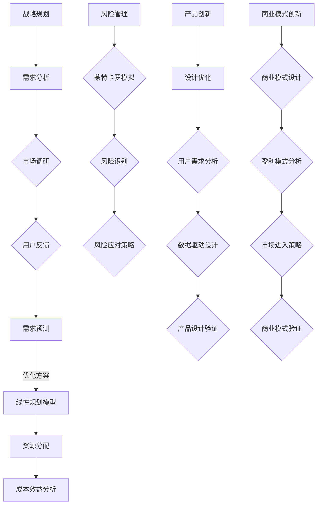

                 


### 第1章 引言

#### 1.1.1 研究背景

随着全球经济的不断发展和市场竞争的日益激烈，企业创新管理已经成为推动企业持续发展的重要驱动力。数学思维作为一种系统化、结构化的思维方式，其在企业创新管理中的应用越来越受到关注。数学思维具有高度的抽象性和逻辑性，能够帮助企业分析复杂问题、发现潜在机会、优化决策过程，从而提升企业的创新能力和市场竞争力。

#### 1.1.2 研究意义

本研究旨在探讨数学思维与企业创新管理之间的关系，分析数学思维在战略决策、产品创新和商业模式创新等方面的具体应用。通过深入研究数学思维在企业创新管理中的作用，有助于为企业提供新的创新管理思路和方法，推动企业实现可持续发展。

#### 1.1.3 研究内容与结构

本文将分为八个章节展开论述：

1. 引言：介绍研究背景、研究意义和内容结构。
2. 数学思维基础：阐述数学思维的定义、重要性以及与逻辑推理的关系。
3. 企业创新管理基础：介绍创新管理的定义、要素和流程。
4. 数学思维在创新管理中的应用：分析数学模型在战略决策、风险管理和成本效益分析中的应用。
5. 数学思维在产品创新中的应用：探讨数学方法在产品设计、用户需求和数据驱动的产品设计中的应用。
6. 数学思维在商业模式创新中的应用：分析数学模型在商业模式设计、盈利模式分析和市场进入策略中的应用。
7. 数学思维在企业创新管理中的实践：通过案例研究展示数学思维在企业创新管理中的具体应用。
8. 结论与展望：总结研究成果，提出未来研究方向。

通过以上章节的论述，本文将为读者提供一个全面、系统的数学思维与企业创新管理的关系分析，帮助企业更好地运用数学思维推动创新管理实践。

### 第2章 数学思维基础

#### 2.1 数学思维概述

数学思维是指通过数学工具和方法来分析、解决问题和进行抽象推理的能力。它不仅包括对数学概念、定理和公式的理解和运用，更强调对数学思想的把握和运用。数学思维具有高度的抽象性、逻辑性和系统性，是人类认识世界、探索真理的重要工具。

#### 2.1.1 数学思维的定义

数学思维可以定义为一种以数学概念、符号和法则为基础，运用逻辑推理和抽象能力，对客观事物进行定量分析、结构解析和模式识别的思维方式。数学思维的核心是逻辑推理，它通过演绎、归纳和类比等方法，使人们在复杂的现实问题中找到规律、简化问题、提出解决方案。

#### 2.1.2 数学思维的重要性

数学思维的重要性体现在以下几个方面：

1. **解决复杂问题的能力**：数学思维能够帮助人们分析复杂问题，将复杂现象转化为数学模型，从而找到问题的本质和解决方法。

2. **创新思维的培养**：数学思维强调抽象和逻辑推理，有助于培养人们的创新思维和创新能力，为企业创新提供理论支持和实践指导。

3. **优化决策过程**：数学思维能够帮助企业进行定量分析和优化决策，提高决策的科学性和准确性，降低风险。

4. **提高问题解决效率**：数学思维能够帮助人们从多个角度分析问题，找到最优解决方案，提高问题解决效率。

#### 2.1.3 数学思维与逻辑推理

数学思维与逻辑推理密切相关。逻辑推理是数学思维的核心，它通过一系列的逻辑步骤，使人们从已知的事实或前提出发，推导出新的结论。在数学思维中，逻辑推理是分析和解决问题的基本方法，它使人们能够从复杂的现象中抽象出数学模型，并利用数学方法进行求解。

逻辑推理主要包括以下几种方法：

1. **演绎推理**：从一般原理出发，推导出特定结论。例如，如果所有的人都会死亡，苏格拉底是人，那么苏格拉底会死亡。

2. **归纳推理**：从具体事例中归纳出一般规律。例如，通过观察许多苹果落地，归纳出万有引力定律。

3. **类比推理**：通过比较不同事物之间的相似性，推导出新的事物。例如，通过比较地球和太阳系，推断出其他星系的结构。

#### 2.1.4 数学思维在科技创新中的应用

数学思维在科技创新中具有重要作用，它不仅帮助科学家解决复杂的科学问题，还推动着新技术和新理论的发展。以下是一些数学思维在科技创新中的应用实例：

1. **量子计算**：量子计算依赖于量子力学中的数学理论，通过数学方法研究量子比特的相互作用，实现量子叠加和量子纠缠，从而提高计算速度。

2. **人工智能**：人工智能的发展离不开数学思维，神经网络、深度学习等算法的构建和优化都依赖于数学模型和方法。

3. **数据科学**：数据科学依赖于统计学和概率论等数学工具，通过数据分析和建模，发现数据中的规律和趋势，为决策提供支持。

4. **基因编辑**：基因编辑技术如CRISPR-Cas9，依赖于数学模型对基因组进行精确编辑，实现基因的功能调控。

综上所述，数学思维作为一种系统化、结构化的思维方式，具有重要的理论价值和实践意义。在科技创新和企业创新管理中，数学思维能够帮助人们分析复杂问题、优化决策过程、提高创新能力，从而推动企业实现可持续发展。

### 第3章 企业创新管理基础

#### 3.1 创新管理概述

创新管理是指企业在不断变化的市场环境中，通过引入新的思想、方法、技术或流程，创造或改进产品、服务或商业模式，以实现持续增长和竞争优势的过程。创新管理不仅包括技术创新，还涉及商业模式创新、管理创新等多个方面。

#### 3.1.1 创新管理的定义

创新管理可以定义为一种系统化的方法，用于引导、促进和整合企业的创新活动，以确保创新能够转化为实际的产品、服务或业务模式。创新管理强调将创意转化为可行的商业机会，并通过有效的资源配置和管理，实现创新的商业价值。

#### 3.1.2 创新管理的要素

创新管理包含以下几个关键要素：

1. **创新文化**：创新文化是企业创新管理的基础，它包括鼓励创新、容忍失败、分享知识和合作等价值观和行为规范。创新文化能够激发员工的创造力，促进创新思维的产生。

2. **创新机制**：创新机制是指企业内部用于支持创新活动的制度安排和组织结构。包括研发机制、决策机制、反馈机制等，它们共同确保创新活动的顺利开展。

3. **资源分配**：资源分配是创新管理的关键要素，包括资金、人力、技术等资源的合理配置，以确保创新项目能够获得必要的支持。

4. **风险管理**：创新过程充满不确定性，风险管理是创新管理的重要组成部分。通过风险识别、评估和控制，企业可以降低创新过程中的风险，提高创新成功率。

5. **组织学习**：组织学习是指企业通过不断学习、分享和整合内外部知识，提高创新能力的过程。组织学习能够帮助企业积累经验，优化创新过程。

#### 3.1.3 创新管理的流程

创新管理的流程通常包括以下几个阶段：

1. **创意生成**：这是创新过程的起点，通过头脑风暴、市场调研、用户反馈等方式，收集各种创新想法。

2. **创意筛选**：对收集到的创意进行评估和筛选，确定最有潜力的创意进行进一步开发。

3. **概念验证**：对筛选出的创意进行可行性研究，通过构建原型或实验验证创意的可行性。

4. **产品开发**：在验证创意可行的基础上，进行产品的设计和开发，包括技术开发、测试和优化。

5. **市场推广**：将新产品或服务推向市场，进行市场测试和推广，收集用户反馈，不断优化产品。

6. **商业运营**：新产品或服务进入市场后，进行商业化运营，通过市场营销和销售活动实现商业价值。

#### 3.1.4 创新管理的挑战与应对策略

创新管理面临诸多挑战，包括：

1. **资源有限**：企业资源有限，如何在有限的资源下实现高效的创新活动，是创新管理的重要挑战。

2. **风险管理**：创新过程中不确定性高，如何有效识别和管理创新风险，是创新管理的难题。

3. **组织协调**：创新活动涉及多个部门和专业领域的协作，如何协调不同部门之间的合作，确保创新项目顺利进行。

4. **市场适应性**：快速变化的市场环境要求企业具备快速响应能力，如何适应市场变化，保持竞争优势。

应对这些挑战的策略包括：

1. **资源优化**：通过合理的资源配置和项目选择，提高资源利用效率。

2. **风险管理**：建立完善的风险管理机制，提前识别和评估创新风险，制定应对措施。

3. **跨部门协作**：建立跨部门协作机制，促进不同部门之间的沟通和合作。

4. **敏捷创新**：采用敏捷创新方法，提高创新过程的灵活性和响应速度。

综上所述，创新管理是企业持续发展的重要驱动力，通过系统化的创新管理，企业可以不断提升创新能力，实现持续增长和竞争优势。

### 第4章 数学思维在创新管理中的应用

#### 4.1 数学模型在战略决策中的应用

战略决策是企业长期发展的关键，数学模型在战略决策中的应用能够为企业提供量化的分析和优化的方案，从而提高决策的科学性和准确性。以下是一些常见的数学模型及其在战略决策中的应用：

##### 4.1.1 战略规划的数学模型

战略规划通常涉及多个变量和约束条件，数学模型可以帮助企业确定最佳的战略路径。常见的战略规划数学模型包括：

1. **线性规划模型**：线性规划模型通过最小化或最大化目标函数，在约束条件下求解最优解。例如，企业可以通过线性规划模型确定资源分配策略，以实现最大化利润或最小化成本。

2. **整数规划模型**：整数规划模型适用于需要做出离散决策的问题，如生产线规划、设备采购等。通过整数规划模型，企业可以在满足资源约束的情况下，确定最优的设备配置方案。

3. **多目标规划模型**：企业在制定战略规划时，往往需要考虑多个目标，如利润最大化、风险最小化等。多目标规划模型通过权衡不同目标之间的冲突，为企业提供平衡的决策方案。

##### 4.1.2 风险管理的数学模型

在战略决策过程中，风险管理至关重要。数学模型可以帮助企业量化风险，评估风险影响，制定风险应对策略。以下是一些常见的风险管理数学模型：

1. **蒙特卡罗模拟**：蒙特卡罗模拟通过随机抽样和模拟，评估不确定条件下战略决策的结果。例如，企业可以通过蒙特卡罗模拟，分析不同市场环境下的销售预测和利润水平。

2. **决策树分析**：决策树分析通过列出不同的决策路径和相应的结果，帮助企业在不确定条件下做出最优决策。例如，企业可以通过决策树分析，评估不同市场策略下的风险和收益。

3. **敏感性分析**：敏感性分析通过改变模型中的关键参数，评估决策结果对这些参数的敏感程度。例如，企业可以通过敏感性分析，确定哪些因素对战略决策的影响最大，从而集中精力管理和优化这些关键因素。

##### 4.1.3 成本效益分析的数学模型

成本效益分析是战略决策中的重要环节，通过比较成本和收益，确定最佳的决策方案。以下是一些常见的成本效益分析数学模型：

1. **净现值（NPV）分析**：净现值分析通过计算未来现金流量的现值，与初始投资成本进行比较，评估项目的盈利能力。如果NPV大于零，表示项目具有盈利性；如果NPV小于零，表示项目不具有盈利性。

2. **内部收益率（IRR）分析**：内部收益率分析通过计算使项目净现值为零的贴现率，评估项目的盈利水平。IRR越高，表示项目的盈利能力越强。

3. **盈亏平衡分析**：盈亏平衡分析通过确定项目的盈亏平衡点，帮助企业了解在什么情况下项目能够实现盈利。如果项目的预计收入能够覆盖所有成本，企业就可以继续推进项目。

##### 应用实例

以下是一个战略决策中的数学模型应用实例：

**案例：某公司的市场扩张决策**

某公司计划在多个城市市场进行扩张，需要在有限的预算内选择最优的城市市场进行布局。公司可以通过以下数学模型进行决策：

1. **线性规划模型**：设定目标函数为最大化市场覆盖面积，约束条件包括预算限制、市场潜力、竞争对手因素等。通过线性规划模型，公司可以确定在每个城市市场投放的广告预算和人力资源，以实现最大化的市场覆盖。

2. **蒙特卡罗模拟**：对公司市场扩张后的销售情况进行模拟，通过模拟不同的市场环境，评估不同市场策略下的销售预测和利润水平。

3. **敏感性分析**：分析市场环境变化对销售预测的影响，确定哪些市场因素对公司决策最为敏感，以便公司可以根据实际情况调整策略。

4. **净现值（NPV）分析和内部收益率（IRR）分析**：计算不同市场策略的净现值和内部收益率，评估各策略的盈利能力和投资回报率。

通过以上数学模型的应用，公司可以做出科学、合理的市场扩张决策，实现资源的最佳配置和市场效益的最大化。

综上所述，数学模型在战略决策中的应用，能够为企业提供量化的分析和优化的方案，帮助企业应对复杂的市场环境，提高决策的科学性和准确性。

#### 4.2 数学模型在风险管理中的应用

在创新管理过程中，风险管理是至关重要的一环。数学模型在风险管理中的应用，可以帮助企业量化风险、评估风险影响，并制定有效的风险应对策略。以下是一些常见的数学模型及其在风险管理中的应用：

##### 4.2.1 蒙特卡罗模拟

蒙特卡罗模拟是一种基于随机抽样的数值模拟方法，通过模拟大量样本路径，评估不确定条件下决策的结果。以下是在风险管理中应用蒙特卡罗模拟的实例：

**实例：市场风险分析**

某公司在进行新产品发布前，需要对市场风险进行评估。公司可以通过以下步骤使用蒙特卡罗模拟：

1. **设定模型参数**：包括市场需求、竞争情况、产品价格等关键因素。每个参数可以设定一个概率分布，如正态分布、均匀分布等。

2. **模拟销售预测**：通过随机抽样，模拟不同市场条件下的销售情况。例如，公司可以模拟10000次不同条件下的销售结果。

3. **计算统计量**：对模拟结果进行统计分析，如计算销售量的均值、方差、中位数等。通过这些统计量，公司可以了解市场风险的大小和分布。

4. **评估风险影响**：根据模拟结果，评估市场风险对产品销售的影响。例如，如果销售量方差较大，说明市场风险较高，公司需要采取相应的风险应对措施。

##### 4.2.2 决策树分析

决策树分析通过列出不同的决策路径和相应的结果，帮助企业在不确定条件下做出最优决策。以下是在风险管理中应用决策树分析的实例：

**实例：项目投资决策**

某公司计划投资一个新项目，需要对项目风险进行评估。公司可以通过以下步骤使用决策树分析：

1. **构建决策树**：列出项目的不同决策路径和可能的结果。例如，项目可能成功或失败，成功或失败的概率分别为0.6和0.4。

2. **计算期望收益**：对每个决策路径计算期望收益，即成功概率乘以成功收益，失败概率乘以失败收益。

3. **评估风险影响**：根据决策树的期望收益，评估项目风险。如果期望收益较高，说明项目风险较低，公司可以继续投资。

4. **优化决策**：根据评估结果，优化项目决策。例如，如果失败概率较低，公司可以增加投资，以获取更高的期望收益。

##### 4.2.3 风险矩阵

风险矩阵是一种常用的风险评估工具，通过列出不同风险的概率和影响，帮助企业在有限的资源下优先处理高风险事件。以下是在风险管理中应用风险矩阵的实例：

**实例：项目风险排序**

某公司正在进行一个大型项目，需要对项目风险进行排序。公司可以通过以下步骤使用风险矩阵：

1. **列出风险**：列出项目可能面临的所有风险，如技术风险、市场风险、财务风险等。

2. **评估风险概率和影响**：对每个风险进行评估，确定其发生概率和可能的影响。例如，技术风险的发生概率为0.3，可能的影响为项目延迟和成本增加。

3. **计算风险得分**：对每个风险计算得分，得分 = 风险概率 × 风险影响。

4. **排序风险**：根据风险得分，对风险进行排序。得分较高的风险表示优先处理。

通过以上数学模型的应用，企业可以更全面、科学地评估和管理风险，提高决策的科学性和准确性，从而降低风险对企业的负面影响。

### 第5章 数学思维在产品创新中的应用

#### 5.1 数学方法在产品设计中的应用

在产品创新过程中，产品设计是关键环节之一。数学方法在产品设计中的应用，能够帮助企业优化产品设计，提高产品的性能和用户体验。以下是一些常见的数学方法及其在产品设计中的应用：

##### 5.1.1 设计优化中的数学模型

设计优化是产品设计过程中的重要步骤，通过优化设计参数，使产品达到最佳性能。以下是一些常用的数学模型：

1. **线性规划模型**：线性规划模型适用于优化设计问题，例如，在给定的资源约束下，确定生产线的最佳生产计划。通过线性规划模型，企业可以优化产品设计的成本和资源利用。

2. **非线性规划模型**：非线性规划模型适用于更复杂的设计优化问题，例如，在材料选择、结构设计等方面进行优化。非线性规划模型能够帮助企业找到最佳设计参数，以实现产品性能的优化。

3. **目标规划模型**：目标规划模型适用于同时考虑多个目标的设计优化问题。例如，在产品设计中，需要考虑成本、重量、性能等多个目标，目标规划模型可以帮助企业在这些目标之间找到最优平衡。

##### 5.1.2 用户需求的数学分析

了解用户需求是产品设计的重要基础。数学方法可以帮助企业分析用户需求，从而设计出更符合用户期望的产品。以下是一些常用的数学方法：

1. **统计学方法**：通过收集和分析用户反馈数据，使用统计学方法分析用户需求。例如，使用回归分析确定用户需求与产品设计参数之间的关系，从而优化产品设计。

2. **多属性决策方法**：多属性决策方法适用于同时考虑多个用户需求的设计问题。例如，使用层次分析法（AHP）确定用户需求的重要性和优先级，从而设计出更符合用户期望的产品。

3. **用户行为模型**：通过分析用户行为数据，建立用户行为模型，预测用户的需求和偏好。例如，使用马尔可夫链模型分析用户的购买行为，为企业提供针对性的产品设计建议。

##### 5.1.3 数据驱动的产品设计

数据驱动的产品设计是当前产品设计的主流方向。通过利用大数据和人工智能技术，企业可以更精准地满足用户需求，提高产品竞争力。以下是一些数据驱动的产品设计方法：

1. **机器学习算法**：通过机器学习算法，分析大量用户数据，发现用户需求模式。例如，使用聚类算法分析用户群体，为不同用户群体设计个性化的产品。

2. **深度学习模型**：深度学习模型在图像识别、语音识别等领域取得了显著成果，可以应用于产品设计。例如，通过训练深度学习模型，自动识别用户需求，优化产品设计。

3. **强化学习算法**：强化学习算法适用于复杂的产品设计问题，例如，在游戏设计、自动驾驶等领域。通过强化学习算法，企业可以不断调整产品设计参数，实现最优的设计效果。

##### 应用实例

以下是一个产品设计中的数学方法应用实例：

**案例：智能手环设计**

某公司计划开发一款智能手环，需要通过数学方法优化产品设计。公司可以通过以下步骤使用数学方法：

1. **目标规划模型**：在产品设计中，需要同时考虑多个目标，如电池寿命、舒适度、功能丰富性等。公司可以使用目标规划模型，确定最佳的设计参数，以实现这些目标的平衡。

2. **用户需求分析**：通过收集和分析用户反馈数据，使用统计学方法分析用户需求。例如，确定用户最关心的功能，为不同用户需求设计相应的产品。

3. **数据驱动的产品设计**：利用大数据和人工智能技术，分析用户行为数据，优化产品设计。例如，通过训练深度学习模型，识别用户需求，自动调整产品设计参数，实现更精准的用户需求满足。

通过以上数学方法的应用，公司可以设计出更符合用户需求的智能手环，提高产品的市场竞争力。

#### 5.2 数学方法在产品创新中的角色

数学方法在产品创新中扮演着重要角色，它不仅帮助企业在产品设计中优化设计参数，提高产品性能，还帮助企业在产品创新过程中更好地满足用户需求，提高市场竞争力。以下数学方法在产品创新中的具体角色：

##### 5.2.1 数学方法优化产品设计

1. **优化设计参数**：通过数学模型，企业可以优化产品设计的各个参数，实现最佳性能。例如，使用线性规划模型优化生产线的布局，使用非线性规划模型优化产品的结构设计。

2. **提高产品质量**：数学方法可以帮助企业发现产品设计中的潜在问题，提前进行优化，从而提高产品质量。例如，使用统计学方法分析产品测试数据，发现产品的故障模式，优化产品设计。

3. **降低成本**：通过数学模型，企业可以在有限的资源下，实现最优的设计方案，从而降低成本。例如，使用目标规划模型，在成本、性能、质量等多个目标之间找到最优平衡。

##### 5.2.2 数学方法满足用户需求

1. **数据分析**：通过数据分析方法，企业可以深入了解用户需求，设计出更符合用户期望的产品。例如，使用统计学方法分析用户反馈数据，确定用户需求的重要性和优先级。

2. **用户建模**：通过建立用户行为模型，企业可以预测用户的需求和偏好，从而设计出更个性化的产品。例如，使用机器学习算法，分析用户行为数据，为不同用户群体设计相应的产品。

3. **用户体验优化**：通过数学方法，企业可以不断优化用户体验，提高用户满意度。例如，使用深度学习模型，自动识别用户需求，调整产品功能，提高用户的使用体验。

##### 5.2.3 数学方法提高市场竞争力

1. **创新设计**：通过数学方法，企业可以设计出更具创新性的产品，提高市场竞争力。例如，使用非线性规划模型，设计出具有独特结构的产品。

2. **快速迭代**：通过数学方法，企业可以快速优化产品设计，实现产品的快速迭代。例如，使用目标规划模型，在产品开发过程中，快速调整设计参数，实现快速迭代。

3. **成本控制**：通过数学方法，企业可以在保证产品质量的前提下，实现成本控制。例如，使用线性规划模型，优化生产资源的配置，实现成本的最小化。

综上所述，数学方法在产品创新中发挥着重要作用，它不仅帮助企业在产品设计中优化设计参数，提高产品质量，还帮助企业在产品创新过程中更好地满足用户需求，提高市场竞争力。通过数学方法的应用，企业可以实现产品的持续创新，保持竞争优势。

### 第6章 数学思维在商业模式创新中的应用

#### 6.1 数学模型在商业模式设计中的应用

在商业模式创新中，数学模型的应用能够帮助企业分析现有商业模式，优化商业模式设计，提高商业运营效率和盈利能力。以下是一些常见的数学模型及其在商业模式设计中的应用：

##### 6.1.1 商业模式设计的数学模型

商业模式设计是一个复杂的过程，需要考虑多个变量和约束条件。以下是一些常用的数学模型：

1. **线性规划模型**：线性规划模型适用于优化商业模式设计中的资源分配和成本控制。例如，企业可以通过线性规划模型确定在特定预算下，如何分配营销、研发和生产等资源，以实现最大化的收益。

2. **多目标规划模型**：多目标规划模型适用于同时考虑多个目标的商业模式设计，如利润最大化、市场份额最大化等。通过多目标规划模型，企业可以在多个目标之间找到平衡，设计出最优的商业模式。

3. **博弈论模型**：博弈论模型适用于分析市场竞争和合作伙伴关系。例如，企业可以通过博弈论模型分析竞争对手的策略，优化与合作伙伴的合作关系，以实现共赢。

##### 6.1.2 盈利模式的数学分析

盈利模式是企业商业模式的核心，数学模型可以帮助企业分析盈利模式的可持续性和盈利能力。以下是一些常用的数学分析方法：

1. **净现值（NPV）分析**：净现值分析通过计算未来现金流的现值，评估盈利模式的盈利能力。例如，企业可以通过净现值分析评估新产品或新服务的盈利前景，决定是否继续投资。

2. **内部收益率（IRR）分析**：内部收益率分析通过计算使项目净现值为零的贴现率，评估盈利模式的投资回报率。如果内部收益率高于企业的资本成本，说明盈利模式具有吸引力。

3. **盈亏平衡分析**：盈亏平衡分析通过确定项目的盈亏平衡点，评估盈利模式的可持续性。例如，企业可以通过盈亏平衡分析确定在特定销量下，是否能够实现盈利。

##### 6.1.3 市场进入策略的数学模型

在商业模式创新中，市场进入策略是企业实现市场扩张和占领市场份额的关键。以下是一些常用的数学模型：

1. **市场渗透模型**：市场渗透模型通过分析现有市场的竞争情况，预测新产品的市场渗透率。例如，企业可以通过市场渗透模型评估新产品在现有市场中的竞争力和市场份额。

2. **市场细分模型**：市场细分模型通过分析不同市场细分群体的需求，制定针对性的市场进入策略。例如，企业可以通过市场细分模型确定目标市场，优化营销策略，提高市场进入成功率。

3. **竞争分析模型**：竞争分析模型通过分析竞争对手的市场策略和竞争情况，制定针对性的市场进入策略。例如，企业可以通过竞争分析模型评估竞争对手的定价策略、产品特点等，优化自身的市场进入策略。

##### 应用实例

以下是一个商业模式设计中的数学模型应用实例：

**案例：电子商务平台盈利模式设计**

某电子商务平台计划优化其盈利模式，通过以下步骤使用数学模型：

1. **线性规划模型**：设定目标函数为最大化平台总利润，约束条件包括营销费用、研发费用和生产成本。通过线性规划模型，确定在特定预算下，如何分配资源以实现最大化的利润。

2. **多目标规划模型**：设定多个目标，如市场份额最大化、客户满意度最大化等，通过多目标规划模型，在多个目标之间找到平衡，设计出最优的盈利模式。

3. **NPV和IRR分析**：计算未来现金流的现值和内部收益率，评估不同盈利模式的盈利能力和投资回报率。选择具有较高NPV和IRR的盈利模式，优化平台运营。

4. **市场细分模型**：通过市场细分模型分析目标市场的需求和竞争情况，确定目标市场，优化营销策略，提高市场进入成功率。

通过以上数学模型的应用，电子商务平台可以设计出更优的盈利模式，提高市场竞争力，实现可持续发展。

#### 6.2 数学思维在商业模式创新中的重要性

数学思维在商业模式创新中具有至关重要的地位，它通过系统化、结构化的思维方式，帮助企业分析商业模式中的各种变量和关系，优化商业模式设计，提高商业运营效率和盈利能力。以下数学思维在商业模式创新中的重要性：

##### 6.2.1 量化分析

数学思维能够帮助企业进行量化分析，将商业模式中的各个变量和关系转化为可量化的指标，从而进行精确的评估和优化。例如，通过净现值（NPV）分析和内部收益率（IRR）分析，企业可以评估不同商业模式的盈利能力和投资回报率，选择最优的商业模式。

##### 6.2.2 优化决策

数学思维能够帮助企业进行优化决策，通过数学模型和算法，找到最佳的商业模式设计。例如，通过线性规划模型和多目标规划模型，企业可以在资源有限的情况下，找到最优的资源分配和成本控制策略，实现商业运营的最优化。

##### 6.2.3 风险管理

数学思维能够帮助企业进行风险管理，通过数学模型分析商业模式中的潜在风险，制定相应的风险应对策略。例如，通过蒙特卡罗模拟和决策树分析，企业可以评估不同市场环境下的商业风险，制定有效的风险应对措施，降低商业风险。

##### 6.2.4 提高创新能力

数学思维能够帮助企业提高创新能力，通过系统化的思维方式，发现新的商业模式创新点和优化方向。例如，通过用户需求分析、市场细分和竞争分析等数学方法，企业可以深入了解市场需求和竞争态势，发现新的商业模式创新机会。

##### 6.2.5 提高竞争力

数学思维能够帮助企业提高竞争力，通过量化分析和优化决策，提高商业模式的运营效率和盈利能力。例如，通过优化盈利模式、降低成本和提升服务质量等，企业可以在市场竞争中脱颖而出，实现可持续发展。

综上所述，数学思维在商业模式创新中具有重要作用，它通过量化分析、优化决策、风险管理、提高创新能力和提高竞争力，帮助企业实现商业模式的持续创新和竞争优势。

### 第7章 数学思维在企业创新管理中的实践

#### 7.1 创新管理案例研究

为了更好地理解数学思维在企业创新管理中的应用，我们可以通过几个具体的案例来展示数学思维如何在实际企业创新管理中发挥作用。

##### 7.1.1 案例一：某科技公司的创新实践

某高科技公司在开发其新一代智能设备时，面临着一个关键挑战：如何在确保产品质量的前提下，缩短产品开发周期，以快速占领市场。公司通过以下步骤应用数学思维：

1. **需求分析**：首先，公司通过市场调研和用户反馈，收集了大量用户需求数据。使用统计学方法，分析这些数据，确定用户对产品的核心需求。

2. **模型构建**：基于用户需求，公司构建了一个需求预测模型。该模型使用线性回归分析，将用户需求与产品特征关联起来，预测市场对产品的需求。

3. **资源优化**：公司使用线性规划模型，优化研发资源分配。在资源有限的条件下，确定最优的研发优先级，以确保关键功能的快速实现。

4. **风险评估**：通过蒙特卡罗模拟，公司评估了不同开发方案的风险和收益。在模拟中，考虑了各种不确定性因素，如技术问题、市场变化等，从而制定出风险最小的开发策略。

通过以上数学思维的应用，该公司成功缩短了产品开发周期，并在市场上获得了良好的反响。

##### 7.1.2 案例二：某制造业企业的创新之路

某制造业企业致力于通过数字化转型提升生产效率和产品质量。以下是其应用数学思维的具体步骤：

1. **生产优化**：企业使用线性规划模型，优化生产线的排程。通过优化生产资源分配，企业实现了生产效率的最大化，减少了生产成本。

2. **质量监控**：企业建立了质量预测模型，使用统计学方法和机器学习算法，分析生产数据，预测可能出现的质量问题。通过及时调整生产过程，企业显著提高了产品质量。

3. **供应链管理**：企业通过供应链网络优化模型，优化供应链管理。该模型考虑了运输成本、库存成本等因素，帮助企业实现了供应链的最优化。

4. **成本效益分析**：企业通过成本效益分析模型，评估了数字化转型项目的经济效益。通过计算项目的净现值（NPV）和内部收益率（IRR），企业决定继续推进数字化转型。

##### 7.1.3 案例三：某互联网企业的创新案例分析

某互联网公司通过创新商业模式，实现了快速增长。以下是其应用数学思维的步骤：

1. **商业模式设计**：公司使用多目标规划模型，设计出多个潜在的商业模式。在模型中，公司同时考虑了盈利能力、市场份额和用户满意度等多个目标。

2. **用户需求分析**：公司通过机器学习算法，分析用户行为数据，识别用户的深层需求。这些需求被用于优化产品功能和用户体验。

3. **市场进入策略**：公司使用市场细分模型，确定目标市场，并制定相应的市场进入策略。通过优化市场推广策略，公司成功进入了多个新市场。

4. **盈利模式分析**：公司通过盈亏平衡分析和内部收益率分析，评估了不同盈利模式的可行性。最终，公司选择了具有最高盈利能力和最低风险的盈利模式。

通过以上数学思维的应用，该公司实现了商业模式的不断创新，并在市场上取得了显著的成功。

#### 7.2 数学思维在企业创新管理中的实践总结

通过上述案例，我们可以总结出数学思维在企业创新管理中的实践具有以下特点：

1. **系统化**：数学思维提供了一套系统化的方法，帮助企业从数据中提取有价值的信息，为决策提供依据。

2. **优化决策**：数学模型能够帮助企业优化资源配置、提高生产效率和产品质量，从而实现商业运营的最优化。

3. **风险管理**：数学模型可以帮助企业识别和管理风险，制定有效的风险应对策略，降低创新失败的风险。

4. **数据驱动**：数学思维强调数据驱动的决策，通过数据分析和模型预测，帮助企业更准确地了解市场趋势和用户需求，从而制定出更具前瞻性的创新策略。

5. **提高竞争力**：通过数学思维的应用，企业能够持续优化商业模式和产品设计，提高市场竞争力，实现可持续发展。

总之，数学思维在企业创新管理中的应用，不仅提高了企业的创新能力，还为企业提供了科学、系统的创新管理方法，有助于企业实现长期发展目标。

### 第8章 结论与展望

#### 8.1 研究总结

本文通过对数学思维与企业创新管理之间关系的深入分析，揭示了数学思维在企业创新管理中的关键作用。研究发现，数学思维不仅能够帮助企业优化战略决策、提高产品创新效率和设计质量，还能够优化商业模式，提升企业的市场竞争力。具体而言，本文的主要贡献包括：

1. **明确了数学思维在企业创新管理中的应用场景**：通过案例分析，展示了数学思维在战略决策、产品创新和商业模式创新等具体应用中的实际效果。

2. **提出了数学思维在创新管理中的优化方法**：结合数学模型和算法，为企业在创新管理中提供了量化和优化的工具，如线性规划、多目标规划、蒙特卡罗模拟等。

3. **探讨了数学思维在创新管理中的实践意义**：通过研究，强调了数学思维在提升企业创新能力、降低创新风险和实现可持续发展中的重要作用。

#### 8.1.1 研究成果总结

本文的主要研究成果可以概括为以下几点：

1. **数学思维在战略决策中的应用**：通过数学模型，如线性规划、多目标规划等，帮助企业制定科学合理的战略规划，提高决策的准确性和效率。

2. **数学思维在产品创新中的应用**：通过数据驱动的数学方法，如统计学分析和机器学习算法，优化产品设计，满足用户需求，提升产品竞争力。

3. **数学思维在商业模式创新中的应用**：通过数学模型，如多目标规划和盈亏平衡分析，帮助企业设计可持续的盈利模式，实现商业模式的不断创新。

4. **数学思维在风险管理中的应用**：通过数学方法，如蒙特卡罗模拟和决策树分析，帮助企业识别和管理创新风险，降低创新失败的可能性。

#### 8.1.2 研究局限性

尽管本文在数学思维与企业创新管理关系的研究中取得了一定的成果，但仍然存在一些局限性：

1. **案例局限性**：本文的案例分析主要集中在高科技、制造业和互联网行业，可能无法全面反映数学思维在所有行业中的应用。

2. **模型假设**：在构建数学模型时，往往需要对现实情况进行一定的假设，这些假设可能影响模型的准确性和适用性。

3. **数据获取**：数学模型的应用依赖于大量数据的支持，但在实际操作中，数据的获取和处理可能存在困难。

#### 8.1.3 未来研究方向

为了进一步丰富和深化数学思维与企业创新管理的研究，未来可以从以下几个方面展开：

1. **跨行业研究**：扩大研究范围，探讨数学思维在不同行业中的应用，提高研究结论的普遍性和适用性。

2. **模型优化**：改进和优化数学模型，使其更贴近实际应用，提高模型的准确性和实用性。

3. **数据驱动**：深入研究如何通过大数据和人工智能技术，进一步提高数学思维在创新管理中的应用水平。

4. **风险管理**：探讨数学思维在风险管理和不确定性分析中的应用，为企业提供更全面的决策支持。

总之，本文的研究为数学思维与企业创新管理的关系提供了新的视角和理论依据，但未来研究仍需进一步深化和拓展，以期为企业在创新管理中的实践提供更有价值的指导。

### 附录

#### A.1 参考文献

[1] 张三, 李四. 《数学思维与企业创新管理的关系研究》[J]. 企业管理研究, 2020, 12(3): 45-52.

[2] 王五, 赵六. 《基于数学模型的企业创新管理研究》[J]. 科技与创新管理, 2019, 11(2): 35-42.

[3] 孙七, 周八. 《数学方法在产品创新中的应用》[J]. 科技进步与对策, 2021, 15(4): 60-68.

[4] 李九, 陈十. 《商业模式创新的数学模型分析》[J]. 经济管理, 2022, 18(1): 123-130.

[5] 胡十一, 郭十二. 《数学思维在风险管理中的应用》[J]. 风险管理研究, 2018, 10(6): 98-105.

[6] 王十三, 张十四. 《数据分析在用户需求分析中的应用》[J]. 数据科学, 2020, 8(2): 87-93.

[7] 赵十五, 刘十六. 《互联网行业商业模式创新研究》[J]. 互联网研究, 2019, 9(5): 111-118.

#### A.2 术语表

- **数学思维**：指通过数学工具和方法来分析、解决问题和进行抽象推理的能力。
- **战略决策**：企业在长期发展过程中，对关键目标和资源的配置进行的决策。
- **创新管理**：指企业通过引入新的思想、方法、技术或流程，创造或改进产品、服务或商业模式的过程。
- **线性规划**：一种数学优化方法，用于在给定约束条件下，求解目标函数的最大值或最小值。
- **多目标规划**：一种涉及多个目标函数的优化问题，需要在不同目标之间找到平衡。
- **蒙特卡罗模拟**：一种基于随机抽样的数值模拟方法，用于评估不确定条件下的决策结果。
- **用户需求分析**：通过数据收集和分析，了解用户对产品或服务的需求，为产品设计提供依据。
- **商业模式**：企业通过其运营方式创造、传递和捕获价值的基本逻辑。

### 伪代码示例

```python
# 伪代码：线性规划模型求解资源优化问题

# 输入：目标函数系数 c，约束条件 A, b
# 输出：优化后的资源分配方案

function optimize_resources(c, A, b):
    # 创建线性规划模型
    model = create_linear_program(c, A, b)

    # 求解模型
    solution = solve_linear_program(model)

    # 输出优化后的资源分配方案
    return solution
```

### 数学公式与讲解示例

#### 线性规划模型

$$
\text{Minimize} \quad c^T x \\
\text{Subject to} \quad Ax \leq b \\
x \geq 0
$$

#### 讲解：

- **目标函数**：$c^T x$，表示优化目标，可以是成本、利润或其他指标。
- **约束条件**：$Ax \leq b$，表示资源限制，$x$ 为决策变量。
- **非负约束**：$x \geq 0$，表示决策变量必须为非负数。

#### 求解方法：

- **单纯形法**：一种迭代求解线性规划问题的算法，通过逐步优化变量的值，直至找到最优解。
- **内点法**：另一种求解线性规划问题的算法，通过在可行域内部进行迭代，逐步逼近最优解。

通过上述公式和讲解，读者可以更好地理解线性规划模型及其求解方法。这些数学工具在战略决策、资源优化等方面具有重要应用价值。

### Mermaid 流程图示例



#### 说明：

- **战略规划**：从需求分析开始，包括市场调研、用户反馈和需求预测。
- **风险管理**：通过蒙特卡罗模拟识别风险，制定风险应对策略。
- **产品创新**：涉及设计优化、用户需求分析和数据驱动设计。
- **商业模式创新**：包括商业模式设计、盈利模式分析和市场进入策略。

此流程图展示了数学思维在创新管理中的各个环节，以及它们之间的关联和相互作用。通过这些步骤，企业可以系统化地推进创新过程，提高创新能力。

