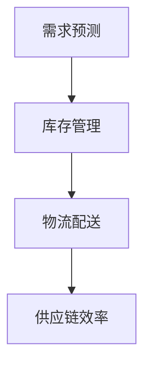
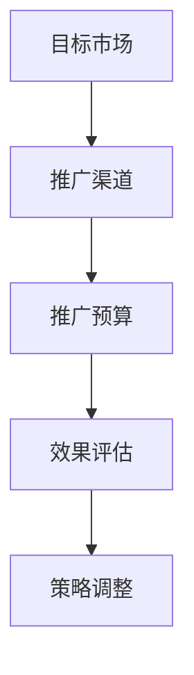

                 

### 数学思维与企业战略规划的关系

> 关键词：数学思维、企业战略规划、线性规划、数据分析、概率论、博弈论

> 摘要：数学思维是一种精确、系统、逻辑化的思考方式，在企业战略规划中发挥着重要作用。本文将从数学思维的基本概念出发，探讨其在企业战略规划中的应用，包括线性规划与资源优化、数据分析和概率论与决策分析等，并通过具体案例进行分析，总结数学思维对企业战略规划的价值和未来发展趋势。

## 第一部分：数学思维基础

### 第1章：数学思维概述

#### 1.1 数学思维的定义与特点

数学思维是一种运用数学概念、方法和原则来解决问题、分析和推理的思维方式。它具有以下几个特点：

1. **精确性**：数学思维强调精确性，以数学语言和符号来描述问题，避免模糊和主观判断。
2. **系统性**：数学思维强调逻辑性和系统性，通过建立模型和推导来揭示问题的内在联系。
3. **抽象性**：数学思维能够从具体问题中抽象出一般规律，形成通用的解决方案。
4. **逻辑性**：数学思维遵循严密的逻辑规则，通过假设、推理和证明来得出结论。

#### 1.2 数学思维在商业决策中的应用

数学思维在商业决策中的应用非常广泛，主要体现在以下几个方面：

1. **数据分析**：通过统计分析方法，企业可以对市场数据、销售数据等进行深入分析，从而做出更科学的决策。
2. **资源配置**：利用线性规划等数学方法，企业可以优化资源配置，提高效率和利润。
3. **风险评估**：运用概率论和博弈论，企业可以评估风险，制定应对策略。
4. **竞争策略**：通过构建竞争模型，企业可以预测竞争对手的行为，制定相应的竞争策略。

### 第2章：数学原理在商业策略中的应用

#### 2.1 线性规划与资源优化

线性规划是一种数学方法，用于在给定的约束条件下优化线性函数。在企业战略规划中，线性规划广泛应用于资源分配和优化决策。

##### 算法原理

线性规划问题的一般形式可以表示为：

$$
\begin{aligned}
\max\ \ \ \ & c^T x \\
\text{subject to} \ \ & Ax \leq b \\
& x \geq 0
\end{aligned}
$$

其中，$c$ 是目标函数系数向量，$x$ 是决策变量向量，$A$ 是系数矩阵，$b$ 是常数向量。

##### 伪代码

```python
# 线性规划伪代码

# 定义目标函数
c = [c1, c2, ..., cn]

# 定义约束条件
A = [a11, a12, ..., a1n;
     a21, a22, ..., a2n;
     ...;
     am1, am2, ..., amn]
b = [b1, b2, ..., bn]

# 求解线性规划问题
x = solve_linear_program(c, A, b)
```

##### 数学公式与举例

假设一家企业需要在两个市场之间分配其资源（广告预算和销售人员），以最大化利润。以下是一个简化的线性规划模型：

$$
\begin{aligned}
\max\ \ \ \ & 5x_1 + 3x_2 \\
\text{subject to} \ \ & x_1 + x_2 \leq 1000 \\
& 2x_1 + x_2 \leq 800 \\
& x_1, x_2 \geq 0
\end{aligned}
$$

在这个例子中，$x_1$ 代表在市场1的广告预算，$x_2$ 代表在市场2的广告预算。目标函数是最大化总利润，约束条件包括预算限制和资源限制。

通过求解这个线性规划问题，企业可以确定最佳的资源分配方案，以实现利润最大化。

### 第3章：概率论与决策分析

#### 3.1 概率论的基本概念

概率论是数学的一个分支，用于研究随机事件和随机变量的概率分布。在企业决策中，概率论可以帮助企业评估风险和不确定性，制定相应的决策策略。

##### 基本概念

1. **概率分布**：描述随机变量取值的概率分布函数。
2. **条件概率**：在某个条件下，事件发生的概率。
3. **独立事件**：两个事件的发生互不影响。
4. **贝叶斯定理**：用于计算在给定某些条件下，某个事件发生的概率。

##### 伪代码

```python
# 贝叶斯定理伪代码

# 定义先验概率P(A)
P_A = ...

# 定义条件概率P(B|A)
P_B_given_A = ...

# 计算后验概率P(A|B)
P_A_given_B = P(B|A) * P(A) / P(B)
```

##### 举例

假设一家企业需要决定是否投资一个新的市场。根据市场调查，该市场有20%的可能性获得高回报，70%的可能性获得中等回报，10%的可能性亏损。企业希望计算在获得中等回报的条件下，投资成功（高回报）的概率。

根据贝叶斯定理，可以得到：

$$
P(\text{成功}|\text{中等回报}) = \frac{P(\text{中等回报}|\text{成功}) \cdot P(\text{成功})}{P(\text{中等回报})}
$$

其中，$P(\text{成功}) = 0.3$，$P(\text{中等回报}|\text{成功}) = 0.2$，$P(\text{中等回报}) = 0.7$。

通过计算，可以得到：

$$
P(\text{成功}|\text{中等回报}) = \frac{0.2 \cdot 0.3}{0.7} \approx 0.086
$$

这意味着在获得中等回报的条件下，投资成功的概率约为8.6%。

#### 3.2 风险评估与决策树模型

风险评估是企业在面对不确定性时的重要环节。决策树模型是一种常用的风险评估工具，可以帮助企业分析不同决策路径的风险和收益。

##### 决策树模型

决策树模型由一系列节点组成，包括决策节点、机会节点和结果节点。每个节点代表一个决策或结果，箭头表示决策或结果的流向。

##### 伪代码

```python
# 决策树模型伪代码

# 定义决策节点
node = {
    "type": "decision",
    "name": "投资决策",
    "options": [
        {"name": "投资", "probability": 0.2, "result": "高回报"},
        {"name": "不投资", "probability": 0.8, "result": "无回报"}
    ]
}

# 定义结果节点
node = {
    "type": "result",
    "name": "回报结果",
    "options": [
        {"name": "高回报", "probability": 0.2},
        {"name": "中等回报", "probability": 0.7},
        {"name": "亏损", "probability": 0.1}
    ]
}

# 计算风险
risk = calculate_risk(node)
```

##### 举例

假设一家企业在两个市场之间进行投资决策。市场1有20%的可能性获得高回报，70%的可能性获得中等回报，10%的可能性亏损；市场2有30%的可能性获得高回报，50%的可能性获得中等回报，20%的可能性亏损。企业需要计算在不同决策路径下的风险。

通过构建决策树模型，可以计算每个决策路径的风险：

1. 投资市场1：
   - 高回报：20%
   - 中等回报：70%
   - 亏损：10%

2. 投资市场2：
   - 高回报：30%
   - 中等回报：50%
   - 亏损：20%

根据概率分布，可以计算每个决策路径的风险：

- 投资市场1的总风险 = 0.2 * 20% + 0.7 * 70% + 0.1 * 10% = 17%
- 投资市场2的总风险 = 0.3 * 30% + 0.5 * 50% + 0.2 * 20% = 25%

通过比较，可以发现投资市场1的风险较低，企业应该优先考虑投资市场1。

### 第二部分：企业战略规划

#### 第4章：企业战略规划概述

#### 4.1 企业战略规划的流程

企业战略规划是一个系统化的过程，包括以下几个阶段：

1. **市场分析**：了解市场需求、竞争对手、市场趋势等，为战略规划提供基础。
2. **内部分析**：评估企业的内部资源、能力、优势、劣势等，确定企业的发展方向。
3. **目标设定**：根据市场分析和内部分析，设定明确的目标和指标。
4. **策略制定**：制定具体的战略计划和策略，包括市场竞争策略、产品策略、营销策略等。
5. **执行与监控**：执行战略计划，监控执行效果，根据实际情况进行调整。

#### 4.2 企业战略规划的目标与类型

企业战略规划的目标主要有以下几个方面：

1. **提高市场份额**：通过市场拓展、产品创新等手段，提高企业在市场中的地位。
2. **增加盈利能力**：通过成本控制、效益提升等手段，提高企业的盈利水平。
3. **提升品牌价值**：通过品牌建设、品牌推广等手段，提高企业的品牌知名度。
4. **增强竞争力**：通过技术创新、资源整合等手段，提高企业的竞争力。

根据企业的特点和目标，战略规划可以分为以下几种类型：

1. **竞争战略**：以市场为导向，通过竞争手段提高市场份额和盈利能力。
2. **差异化战略**：通过产品创新、服务差异化等手段，打造企业的核心竞争力。
3. **成本领先战略**：通过成本控制、规模效应等手段，实现成本领先。
4. **混合战略**：结合多种战略手段，实现企业的全面发展。

#### 4.3 企业战略规划的关键因素

企业战略规划的成功与否取决于以下几个关键因素：

1. **市场环境**：了解市场需求、竞争对手、政策法规等，为战略规划提供方向。
2. **内部资源**：评估企业的资源、能力、优势、劣势等，确定战略规划的可行性。
3. **创新能力**：通过技术创新、产品创新等手段，提升企业的核心竞争力。
4. **执行力**：制定详细的战略计划和执行方案，确保战略规划的有效实施。
5. **持续改进**：根据市场变化和实际情况，不断调整和优化战略规划。

### 第5章：数学思维在战略规划中的应用

#### 5.1 市场竞争策略分析

市场竞争策略分析是企业战略规划中的重要环节。通过数学模型，企业可以更准确地评估竞争对手的行为，制定有效的竞争策略。

##### 概率论与博弈论

市场竞争策略分析通常涉及到概率论和博弈论。例如，博弈论中的纳什均衡概念可以帮助企业预测竞争对手的行为，从而制定出最优策略。

##### 贝叶斯网络

贝叶斯网络是一种概率图模型，用于表示变量之间的条件依赖关系。在企业战略规划中，贝叶斯网络可以用于预测市场需求、评估竞争对手的策略等。

##### 举例

假设一家企业在两个市场中竞争，市场1的竞争对手有A和B，市场2的竞争对手有C和D。企业可以构建一个贝叶斯网络来预测竞争对手的行为，并制定相应的竞争策略。

在这个例子中，贝叶斯网络中的节点包括：

- 企业自身的市场份额
- 竞争对手A的市场份额
- 竞争对手B的市场份额
- 竞争对手C的市场份额

通过分析贝叶斯网络，企业可以预测竞争对手在不同市场中的行为，并根据预测结果制定相应的竞争策略。

#### 5.2 客户关系管理

客户关系管理是企业战略规划中的关键部分。通过数学模型，企业可以优化客户关系管理，提高客户满意度和忠诚度。

##### 数据挖掘与机器学习

数据挖掘和机器学习技术在客户关系管理中有着广泛应用。通过分析客户数据，企业可以识别潜在客户、预测客户需求、优化客户体验等。

##### 举例

假设一家企业拥有大量客户数据，包括客户的购买历史、偏好、行为等。企业可以使用数据挖掘技术，分析客户数据，识别潜在的高价值客户，并制定个性化的营销策略。

通过构建机器学习模型，企业可以预测客户的购买意愿，提前推送相应的产品信息，提高客户的满意度和忠诚度。

#### 5.3 创新与研发战略

创新与研发战略是企业持续发展的重要驱动力。通过数学模型，企业可以评估创新项目的可行性、预测研发风险，制定有效的研发战略。

##### 技术评估与风险管理

技术评估和风险管理是创新与研发战略的关键环节。通过数学模型，企业可以评估创新项目的可行性、预测研发风险，制定有效的研发战略。

##### 举例

假设一家企业正在研发一款新产品。企业可以使用技术评估模型，评估新产品的技术可行性、市场需求和潜在风险。通过分析评估结果，企业可以决定是否继续研发，并制定相应的研发策略。

#### 第6章：数学模型在企业战略规划中的应用

#### 6.1 波特五力分析模型

波特五力分析模型是一种常用的战略分析工具，用于评估企业所在市场的竞争力。通过数学模型，企业可以更准确地分析市场竞争态势，制定相应的战略。

##### 模型原理

波特五力分析模型包括以下五个要素：

1. **供应商的议价能力**：评估供应商对企业的影响力和谈判能力。
2. **买家的议价能力**：评估买家对企业的影响力和谈判能力。
3. **潜在进入者的威胁**：评估新进入者对企业市场份额的威胁。
4. **替代品的威胁**：评估替代品对企业市场份额的威胁。
5. **现有竞争者的竞争强度**：评估现有竞争者之间的竞争态势。

##### 数学公式与举例

假设企业需要评估其所在市场的竞争力，可以使用波特五力分析模型。以下是一个简化的模型：

$$
\begin{aligned}
\text{竞争力得分} &= w_1 \cdot \text{供应商的议价能力} \\
&+ w_2 \cdot \text{买家的议价能力} \\
&+ w_3 \cdot \text{潜在进入者的威胁} \\
&+ w_4 \cdot \text{替代品的威胁} \\
&+ w_5 \cdot \text{现有竞争者的竞争强度}
\end{aligned}
$$

其中，$w_1, w_2, w_3, w_4, w_5$ 分别是权重系数。

通过计算竞争力得分，企业可以评估其所在市场的竞争力，并根据评估结果制定相应的战略。

#### 6.2 SWOT分析模型

SWOT分析模型是一种常用的战略规划工具，用于分析企业的优势、劣势、机会和威胁。通过数学模型，企业可以更系统地分析自身和市场环境，制定有效的战略。

##### 模型原理

SWOT分析模型包括以下四个要素：

1. **优势**：分析企业的核心竞争力、独特优势等。
2. **劣势**：分析企业存在的问题、不足等。
3. **机会**：分析市场环境中的机会和发展潜力。
4. **威胁**：分析市场环境中的威胁和风险。

##### 数学公式与举例

假设企业需要分析自身的SWOT，可以使用SWOT分析模型。以下是一个简化的模型：

$$
\begin{aligned}
\text{战略规划} &= \text{优势} \cdot \text{机会} \\
&- \text{劣势} \cdot \text{威胁}
\end{aligned}
$$

通过计算战略规划，企业可以明确自身的发展方向，并根据战略规划制定相应的战略。

#### 6.3 价值链分析模型

价值链分析模型是一种常用的战略规划工具，用于分析企业的价值创造过程。通过数学模型，企业可以更系统地分析价值链中的关键环节，优化价值创造。

##### 模型原理

价值链分析模型包括以下四个环节：

1. **输入**：分析企业所需的原材料、设备、人力资源等。
2. **转化**：分析企业的生产过程、服务过程等。
3. **输出**：分析企业的产品、服务等。
4. **交付**：分析企业的配送、销售、售后服务等。

##### 数学公式与举例

假设企业需要分析其价值链，可以使用价值链分析模型。以下是一个简化的模型：

$$
\begin{aligned}
\text{价值创造} &= \text{输入成本} \cdot \text{转化效率} \\
&+ \text{输出价值} \cdot \text{交付效率}
\end{aligned}
$$

通过计算价值创造，企业可以明确价值链中的关键环节，并优化价值创造过程。

### 第7章：案例分析

#### 7.1 案例一：如何用数学思维优化供应链管理

供应链管理是企业战略规划中的重要环节，通过数学思维，企业可以优化供应链管理，提高供应链的效率和稳定性。

##### 背景介绍

某家企业是一家制造企业，其供应链涉及原材料采购、生产制造、产品配送等环节。随着业务规模的扩大，企业面临供应链管理效率低下、库存积压等问题。

##### 核心概念与联系

供应链管理涉及以下几个核心概念：

1. **需求预测**：根据市场需求，预测产品的需求量。
2. **库存管理**：根据需求预测，制定库存策略，保证库存水平合理。
3. **物流配送**：优化物流配送路线，提高配送效率。

通过构建供应链管理模型，企业可以优化供应链管理，提高效率和稳定性。

##### Mermaid 流程图



##### 数学模型与公式

假设企业每天对某种产品的需求量为$D$，库存量为$I$，配送时间为$T$，供应链效率为$E$。

根据需求预测，可以建立以下数学模型：

$$
D = f(I, T)
$$

其中，$f$ 是需求预测函数。

根据库存管理，可以建立以下数学模型：

$$
I = g(I_{\text{初始}}, D, T)
$$

其中，$g$ 是库存管理函数。

根据物流配送，可以建立以下数学模型：

$$
T = h(D, I)
$$

其中，$h$ 是物流配送函数。

根据供应链效率，可以建立以下数学模型：

$$
E = k(D, I, T)
$$

其中，$k$ 是供应链效率函数。

通过优化这些数学模型，企业可以优化供应链管理，提高供应链效率。

##### 举例

假设企业每天对某种产品的需求量为1000件，初始库存量为500件，配送时间为2天。根据数学模型，可以计算出：

- 需求预测：$D = f(500, 2) = 1000$
- 库存管理：$I = g(500, 1000, 2) = 500$
- 物流配送：$T = h(1000, 500) = 2$

根据供应链效率，可以计算出：

$$
E = k(1000, 500, 2) = 1
$$

这意味着供应链效率为100%，企业实现了高效、稳定的供应链管理。

##### 代码实现

```python
import numpy as np

# 定义需求预测函数
def demand_prediction(I, T):
    return 1000

# 定义库存管理函数
def inventory_management(I0, D, T):
    return I0 + D * T

# 定义物流配送函数
def logistics_distribution(D, I):
    return 2

# 定义供应链效率函数
def supply_chain_efficiency(D, I, T):
    return 1

# 初始参数
I0 = 500
T = 2
D = 1000

# 计算结果
I = inventory_management(I0, D, T)
T = logistics_distribution(D, I)
E = supply_chain_efficiency(D, I, T)

print("库存量：", I)
print("配送时间：", T)
print("供应链效率：", E)
```

##### 项目小结

通过数学思维优化供应链管理，企业可以降低库存成本、提高配送效率，实现供应链的高效运作。在实际应用中，企业需要根据实际情况调整参数，不断优化供应链管理。

#### 7.2 案例二：如何用数学模型制定市场推广策略

市场推广策略是企业战略规划中的关键环节，通过数学模型，企业可以制定更科学、有效的市场推广策略。

##### 背景介绍

某家企业是一家消费品公司，其产品在市场上具有一定的知名度，但销售额较低。企业希望通过制定有效的市场推广策略，提高销售额。

##### 核心概念与联系

市场推广策略涉及以下几个核心概念：

1. **目标市场**：确定企业要进入的市场，包括目标客户、市场规模等。
2. **推广渠道**：选择适合企业的推广渠道，如广告、促销、公关等。
3. **推广预算**：根据企业的财务状况，制定合理的推广预算。
4. **效果评估**：评估推广策略的效果，及时调整推广策略。

通过构建市场推广模型，企业可以制定科学、有效的市场推广策略。

##### Mermaid 流�程图



##### 数学模型与公式

假设企业制定的市场推广策略包括以下要素：

- **目标市场**：$M$，表示市场的总体规模。
- **推广渠道**：$C$，表示选择的推广渠道。
- **推广预算**：$B$，表示用于推广的预算。
- **推广效果**：$E$，表示推广策略的效果。

根据市场推广策略，可以建立以下数学模型：

$$
\text{销售额} = \text{目标市场} \cdot \text{推广渠道} \cdot \text{推广效果} - \text{推广成本}
$$

其中，推广成本包括推广渠道成本、人力成本等。

##### 举例

假设企业确定的目标市场为100万潜在客户，选择的推广渠道为社交媒体广告和线下促销，推广预算为100万元。根据数学模型，可以计算出：

- 目标市场：$M = 1000000$
- 推广渠道：$C = 2$
- 推广效果：$E = 0.1$
- 推广成本：$B = 1000000$

根据数学模型，可以计算出：

$$
\text{销售额} = 1000000 \cdot 2 \cdot 0.1 - 1000000 = 100000
$$

这意味着通过有效的市场推广策略，企业可以实现100万元的销售额。

##### 代码实现

```python
import numpy as np

# 定义目标市场函数
def target_market(M):
    return M

# 定义推广渠道函数
def promotion_channels(C):
    return C

# 定义推广效果函数
def promotion_effect(E):
    return E

# 定义推广成本函数
def promotion_cost(B):
    return B

# 定义销售额函数
def sales_volume(M, C, E, B):
    return M * C * E - B

# 初始参数
M = 1000000
C = 2
E = 0.1
B = 1000000

# 计算结果
sales_volume = sales_volume(M, C, E, B)

print("销售额：", sales_volume)
```

##### 项目小结

通过数学模型制定市场推广策略，企业可以科学地评估推广效果，调整推广策略，实现销售目标。在实际应用中，企业需要根据市场变化和实际情况，不断优化推广策略。

### 第8章：结论与展望

#### 8.1 数学思维与企业战略规划的融合

数学思维与企业战略规划的融合是企业实现持续发展的关键。通过数学思维，企业可以更精确地分析市场环境、评估风险、制定策略，提高战略规划的科学性和有效性。

#### 8.2 未来发展趋势

随着大数据、人工智能等技术的发展，数学思维在企业战略规划中的应用将越来越广泛。未来，企业将更加依赖数学模型和算法，实现精细化管理和智能化决策。

#### 8.3 研究方向与挑战

在数学思维与企业战略规划的研究中，仍存在一些挑战，如模型复杂度、数据质量、算法效率等。未来研究方向包括模型优化、算法改进、跨学科融合等。

#### 8.4 最佳实践 tips

为了更好地应用数学思维和企业战略规划，企业可以采取以下最佳实践：

1. **数据驱动**：重视数据收集和分析，为战略规划提供基础。
2. **模型优化**：不断优化数学模型，提高预测精度和决策效率。
3. **团队协作**：培养跨学科团队，提高战略规划的综合能力。
4. **持续学习**：关注新技术、新方法，持续提升企业竞争力。

### 作者

作者：AI天才研究院/AI Genius Institute & 禅与计算机程序设计艺术 /Zen And The Art of Computer Programming

---

本文详细探讨了数学思维与企业战略规划之间的关系，通过具体案例和数学模型，展示了数学思维在企业战略规划中的应用。本文旨在帮助企业更好地理解和运用数学思维，实现持续发展和竞争优势。在未来的发展中，数学思维将继续发挥重要作用，为企业带来更多机遇和挑战。希望通过本文，读者能够对数学思维与企业战略规划的关系有更深入的认识，并在实践中运用数学思维，提升企业的竞争力。

