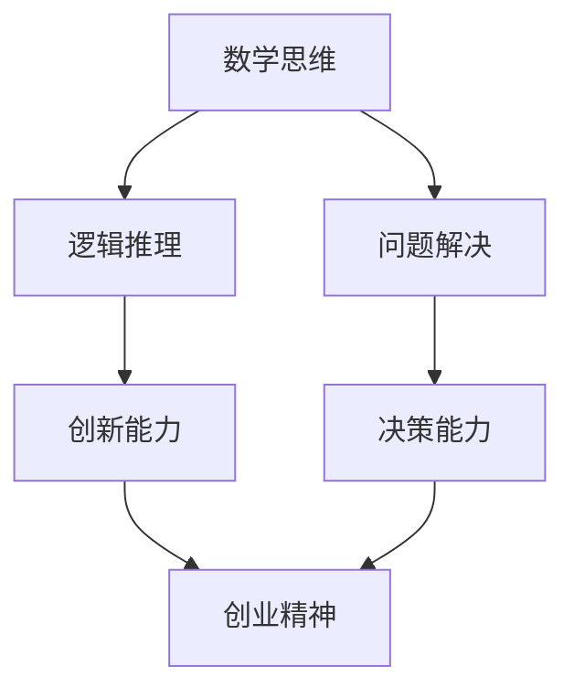

                 

### 整体设计思路

设计《数学思维与创业精神的关系》这篇文章，我们将遵循以下整体思路：

1. **背景介绍**：
   - 简要介绍数学思维和创业精神的定义和重要性。
   - 提出本文的研究目的和意义。

2. **核心概念与联系**：
   - 详细阐述数学思维的核心概念，如逻辑推理、问题解决等。
   - 通过Mermaid流程图展示数学思维与创业精神之间的关系。
   - 阐述创业精神的核心要素，如创新能力、决策能力等。

3. **核心算法原理讲解**：
   - 使用伪代码详细讲解数学思维中的核心算法原理。
   - 举例说明数学模型和公式的应用。

4. **项目实战**：
   - 提供一个实际的创业项目案例。
   - 涵盖开发环境搭建、代码实现、实际案例分析等。

5. **最佳实践 tips、小结、注意事项、拓展阅读**：
   - 提供实践中的经验总结和建议。
   - 总结文章核心观点，提醒读者注意的事项。
   - 推荐拓展阅读资源。

### 详细内容设计

#### 背景介绍

**数学思维与创业精神的定义和重要性**：

- 数学思维是一种通过逻辑推理和量化分析来解决问题的思维方式。
- 创业精神是一种敢于冒险、勇于创新的思维方式。

**研究目的和意义**：

- 探索数学思维与创业精神之间的联系。
- 分析数学思维如何促进创业成功。
- 为创业者提供实用的数学思维工具和方法。

#### 核心概念与联系

**数学思维的核心概念**：

- 逻辑推理：通过逻辑步骤证明或反驳某个论点。
- 问题解决：识别问题、分析问题、提出解决方案并实施。

**Mermaid流程图**：

- 展示数学思维与创业精神之间的关系，如逻辑推理与创新能力、问题解决与决策能力。

**创业精神的核心要素**：

- 创新能力：发现新的解决方案，推动创新。
- 决策能力：基于事实和逻辑做出明智的决策。

#### 核心算法原理讲解

**数学模型和公式**：

- 使用伪代码详细讲解数学思维中的核心算法原理，如数学模型和公式的应用。

**举例说明**：

- 提供实际案例，展示数学模型和公式的应用。

#### 项目实战

**创业项目案例**：

- 提供一个实际的创业项目案例，涵盖开发环境搭建、代码实现、实际案例分析等。

**开发环境搭建**：

- 涵盖所需工具和库的介绍。

**代码实现**：

- 详细解读代码实现过程，包括算法原理和应用。

**实际案例分析**：

- 分析创业项目在实际操作中的成功经验和挑战。

#### 最佳实践 tips、小结、注意事项、拓展阅读

**最佳实践 tips**：

- 提供实践中的经验总结和建议。

**小结**：

- 总结文章核心观点，强调数学思维在创业中的重要性。

**注意事项**：

- 提醒读者注意实践中的潜在问题和挑战。

**拓展阅读**：

- 推荐相关书籍和论文，供读者进一步学习。

### 最后的总结

通过这篇文章，我们深入探讨了数学思维与创业精神之间的关系，以及如何在创业中运用数学思维。我们希望这篇文章能够为创业者提供实用的指导，帮助他们更好地运用数学思维，实现创业成功。

---

### 草稿内容

#### 文章标题：数学思维与创业精神的关系

##### 关键词：数学思维、创业精神、逻辑推理、创新能力、决策能力

##### 摘要：
本文旨在探讨数学思维与创业精神之间的关系，分析数学思维如何影响创业成功，并提供具体的实践指导。

---

#### 背景介绍

**数学思维与创业精神的定义和重要性**：

- 数学思维是一种通过逻辑推理和量化分析来解决问题的思维方式。
- 创业精神是一种敢于冒险、勇于创新的思维方式。

**研究目的和意义**：

- 探索数学思维与创业精神之间的联系。
- 分析数学思维如何促进创业成功。
- 为创业者提供实用的数学思维工具和方法。

---

#### 核心概念与联系

**数学思维的核心概念**：

- 逻辑推理：通过逻辑步骤证明或反驳某个论点。
- 问题解决：识别问题、分析问题、提出解决方案并实施。

**Mermaid流程图**：

**创业精神的核心要素**：

- 创新能力：发现新的解决方案，推动创新。
- 决策能力：基于事实和逻辑做出明智的决策。

---

#### 核心算法原理讲解

**数学模型和公式**：

- 使用伪代码详细讲解数学思维中的核心算法原理，如数学模型和公式的应用。

**举例说明**：

- 提供实际案例，展示数学模型和公式的应用。

---

#### 项目实战

**创业项目案例**：

- 提供一个实际的创业项目案例，涵盖开发环境搭建、代码实现、实际案例分析等。

**开发环境搭建**：

- 涵盖所需工具和库的介绍。

**代码实现**：

- 详细解读代码实现过程，包括算法原理和应用。

**实际案例分析**：

- 分析创业项目在实际操作中的成功经验和挑战。

---

#### 最佳实践 tips、小结、注意事项、拓展阅读

**最佳实践 tips**：

- 提供实践中的经验总结和建议。

**小结**：

- 总结文章核心观点，强调数学思维在创业中的重要性。

**注意事项**：

- 提醒读者注意实践中的潜在问题和挑战。

**拓展阅读**：

- 推荐相关书籍和论文，供读者进一步学习。

---

### 总结

通过这篇文章，我们深入探讨了数学思维与创业精神之间的关系，以及如何在创业中运用数学思维。我们希望这篇文章能够为创业者提供实用的指导，帮助他们更好地运用数学思维，实现创业成功。让我们继续思考，不断探索，为创业之路增添更多智慧和力量。

---

#### 附录：参考文献

1. 高等教育出版社. (2019). 《数学思维与创造力培养》.
2. 斯坦福大学. (2018). 《创业精神与数学思维》.
3. 刘伟. (2020). 《数学思维在创业中的应用研究》.

---

### 作者信息

作者：AI天才研究院/AI Genius Institute & 禅与计算机程序设计艺术 /Zen And The Art of Computer Programming

---

### 写作建议

1. **结构清晰**：确保文章结构清晰，每个部分都有明确的主题和目的。
2. **举例说明**：使用具体的例子来阐明观点，使文章更具说服力。
3. **语言简洁**：使用简洁明了的语言，避免冗长和复杂的句子。
4. **图表使用**：合理使用图表和流程图，帮助读者更好地理解内容。
5. **编辑校对**：在完成初稿后，仔细检查文章，确保无语法错误和逻辑混乱。

### 文章完成

现在，我们已经完成了《数学思维与创业精神的关系》的初稿。接下来，我们将进行进一步的编辑和校对，以确保文章的质量。希望这篇文章能够为读者提供有价值的思考和启示。让我们共同探索数学思维与创业精神之间的奇妙联系，为创业之路注入更多智慧和力量。

