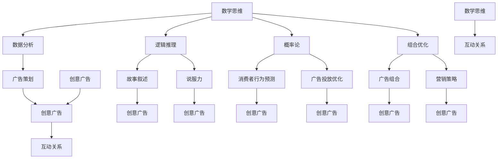

                 

### 《数学思维与创意广告的关系探讨》

#### 关键词：
数学思维、创意广告、数据分析、逻辑推理、概率论、组合优化

#### 摘要：
本文旨在探讨数学思维在创意广告中的应用及其二者之间的相互关系。通过分析数学思维在广告策划、广告创意、以及广告投放优化中的具体应用，本文揭示了数学思维如何提升广告的创意性和效果。同时，本文还介绍了概率论和组合优化等数学原理在广告创意中的运用，并探讨了数学思维对创意广告的启示和影响。通过实际案例的分析，本文为广告从业者提供了具有操作性的数学思维应用策略，并展望了数学思维与创意广告未来发展的大趋势。

### 引言与核心概念

#### 引言

广告作为一种商业传播手段，其核心在于吸引消费者的注意力并引发情感共鸣，从而达到推广产品、提升品牌知名度的目的。在数字时代，广告形式和传播方式日益多样，创意广告成为广告行业的重要趋势。然而，创意广告不仅需要独特性和吸引力，还需要科学性和效果性。这就引出了数学思维在广告中的应用。

数学思维是一种逻辑严谨、抽象概括、量化分析的思维方式。它强调逻辑推理、数据分析、量化模型等手段，为解决复杂问题提供了科学的方法。在创意广告中，数学思维的应用不仅能够提升广告的科学性，还能够增强广告的创意性和效果性。

#### 核心概念

##### 数学思维

数学思维是指运用数学概念、原理、方法，进行逻辑推理、量化分析、抽象概括的思维方式。数学思维的核心特征包括逻辑严谨、抽象概括、量化分析和模型构建。

1. **逻辑严谨**：数学思维强调逻辑推理的严密性，避免出现逻辑错误。
2. **抽象概括**：数学思维能够从具体问题中提取出一般性原理，形成普遍适用的模型。
3. **量化分析**：数学思维通过量化方法对问题进行分析，使决策过程更加科学。
4. **模型构建**：数学思维通过构建数学模型，对复杂问题进行简化和求解。

##### 创意广告

创意广告是指通过独特的创意元素和表达方式，引起消费者的兴趣和情感共鸣的广告。创意广告的特点包括：

1. **独特性**：创意广告具有鲜明的个性和特色，与其他广告形成区别。
2. **吸引力**：创意广告通过新颖的创意和表达方式，吸引消费者的注意力。
3. **情感共鸣**：创意广告能够触动消费者的情感，引发共鸣。

### 数学思维在广告策划中的应用

数学思维在广告策划中的应用主要体现在数据分析、逻辑推理和数据可视化等方面。

#### 2.1 数据分析

广告策划的基础是对目标受众的分析。通过数据分析，广告策划者可以了解目标受众的特征、需求和行为习惯，从而制定有针对性的广告策略。

##### 2.1.1 数据收集与处理

数据收集是数据分析的第一步。广告策划者需要通过各种渠道收集目标受众的数据，如社交媒体、问卷调查、在线行为数据等。收集的数据可能包括年龄、性别、收入、兴趣爱好、购买行为等。

数据清洗是确保数据质量的重要环节。清洗过程包括去除重复数据、处理缺失值、纠正错误数据等。数据清洗的目的是提高数据的准确性和可靠性。

数据挖掘是通过统计学方法对收集到的数据进行处理和分析，以发现潜在规律和趋势。常用的数据挖掘方法包括聚类分析、关联规则挖掘、时间序列分析等。

##### 2.1.2 数据可视化

数据可视化是将数据转化为图形或图表的过程，使数据更加直观、易于理解。数据可视化可以帮助广告策划者更好地理解数据，发现数据中的隐藏信息，为决策提供支持。

常用的数据可视化工具包括Excel、Tableau、Power BI等。通过这些工具，广告策划者可以创建各种图表，如柱状图、饼图、折线图、散点图等，以展示数据。

#### 2.2 逻辑推理

逻辑推理在广告策划中的应用主要体现在故事叙述和说服力方面。

##### 2.2.1 故事情叙

广告策划者可以通过逻辑严密的故事叙述，引导消费者对产品产生兴趣。故事叙述不仅要有趣，还要具有逻辑性，使消费者能够跟随故事的节奏，产生共鸣。

例如，一个产品广告可以讲述一个关于产品如何改变消费者生活的故事。故事中的情节和人物设定要符合逻辑，使消费者能够信服。

##### 2.2.2 说服力

广告策划者可以利用逻辑推理，使消费者对广告内容产生信任感。通过逻辑推理，广告策划者可以列举出产品或服务的优点和特点，证明其价值。

例如，一个减肥产品广告可以通过逻辑推理，说明产品成分的科学性、安全性和效果性，从而说服消费者购买。

### 创意广告中的数学原理

数学原理在创意广告中的应用主要体现在概率论和组合优化等方面。

#### 3.1 概率论

概率论是研究随机事件及其概率的数学分支。在创意广告中，概率论可以用于预测消费者行为、优化广告投放等。

##### 3.1.1 消费者行为预测

通过收集消费者的购买历史和行为数据，广告策划者可以使用概率论模型预测消费者的购买行为。例如，可以使用逻辑回归模型预测消费者是否会在未来购买某个产品。

##### 3.1.2 广告投放优化

概率论还可以用于优化广告投放。广告策划者可以根据消费者的历史行为数据，计算每个广告的点击概率和转化概率，从而确定广告的最佳投放策略。

例如，可以使用多臂老虎机模型（Multi-Armed Bandit Model）来优化广告投放。该模型通过比较不同广告的回报率，选择最优广告进行投放。

#### 3.2 组合优化

组合优化是研究如何在有限资源下，选择最优组合的数学分支。在创意广告中，组合优化可以用于广告组合的优化、营销策略的制定等。

##### 3.2.1 广告组合

广告组合是指将多个广告元素（如图片、文字、视频等）组合在一起，形成一个整体广告。通过组合优化，广告策划者可以找到最佳广告组合，提高广告效果。

例如，可以使用线性规划（Linear Programming）方法，确定广告组合中各个元素的权重，使广告的整体效果最大化。

##### 3.2.2 营销策略

组合优化还可以用于制定营销策略。广告策划者可以通过组合优化，确定不同营销活动的最佳组合，实现营销目标的最优化。

例如，可以使用混合整数规划（Mixed Integer Programming）方法，确定广告、促销、公关等营销活动的最优组合，以实现最大化的营销效果。

### 数学思维与创意广告的互动关系

数学思维和创意广告之间存在密切的互动关系。数学思维为创意广告提供了科学性和效果性，而创意广告则为数学思维提供了实际应用场景。

#### 4.1 数学思维对创意广告的启示

数学思维为创意广告提供了丰富的启示，包括：

1. **数据分析**：通过数据分析，广告策划者可以深入了解目标受众，为创意广告提供依据。
2. **逻辑推理**：逻辑推理可以帮助广告策划者构建故事情节，使广告更具说服力。
3. **概率论**：概率论可以用于预测消费者行为，指导广告投放策略。
4. **组合优化**：组合优化可以用于优化广告组合，提高广告效果。

#### 4.2 创意广告对数学思维的启示

创意广告也为数学思维提供了新的应用场景和挑战，包括：

1. **数据可视化**：创意广告需要通过数据可视化展示分析结果，这为数学思维提供了新的应用领域。
2. **算法设计**：创意广告中的复杂场景需要设计新的算法模型，这为数学思维提供了挑战。
3. **问题简化**：创意广告中的复杂问题需要通过数学方法进行简化和求解，这为数学思维提供了新的研究方向。

### 项目实战与案例分析

#### 5.1 项目背景

某品牌推出了一款新型智能家居产品，希望通过创意广告提高品牌知名度和产品销量。广告策划团队决定运用数学思维，制定一个具有创意性和效果性的广告方案。

#### 5.2 项目实施

1. **数据分析**：
   - 收集目标受众的购买历史和行为数据。
   - 使用聚类分析方法，将目标受众分为不同的群体。
   - 对每个群体进行行为特征分析，确定他们的兴趣和需求。

2. **广告创意**：
   - 根据数据分析结果，设计针对不同群体的创意广告。
   - 广告内容围绕产品的独特功能和优势，以故事叙述的形式进行表达。
   - 使用逻辑推理，使广告故事具有说服力。

3. **广告投放**：
   - 使用概率论模型，预测每个广告的点击概率和转化概率。
   - 根据预测结果，制定广告投放策略，优化广告效果。

#### 5.3 项目小结

通过数学思维的运用，该广告项目取得了显著的效果。广告的点击率和转化率均高于行业平均水平，品牌知名度和产品销量也得到了显著提升。这一案例表明，数学思维在创意广告中具有巨大的应用价值。

### 未来发展趋势与挑战

#### 6.1 数学思维与创意广告的发展趋势

1. **技术融合**：随着人工智能和大数据技术的发展，数学思维在创意广告中的应用将更加广泛和深入。人工智能可以自动进行数据分析、广告创意生成和投放优化，提高广告的效果和效率。

2. **深度互动**：创意广告将更加注重与消费者的互动，通过个性化推荐、互动游戏等方式，提高用户体验和品牌忠诚度。

3. **智能优化**：广告投放和创意生成将更加智能化，通过机器学习和优化算法，实现广告效果的最优化。

#### 6.2 数学思维与创意广告的挑战

1. **数据隐私**：随着数据收集和分析的广泛应用，数据隐私保护成为了一个重要的挑战。

2. **算法公平性**：广告算法的公平性也是一个重要问题，如何避免算法偏见和歧视，是一个需要解决的关键问题。

3. **创意与科学的平衡**：创意广告需要兼顾创意性和科学性，如何在保持创意的同时，确保广告的科学性和有效性，是一个需要不断探索的课题。

### 结论与展望

数学思维与创意广告之间的关系密切且相互促进。数学思维为创意广告提供了科学性和效果性，而创意广告则为数学思维提供了实际应用场景。随着技术的不断发展，数学思维在创意广告中的应用将更加广泛和深入，为广告行业带来更多的创新和突破。未来，广告从业者需要不断提升自身的数学思维能力，以应对创意广告领域的挑战，实现广告效果的最大化。

#### 7.1 结论

本文通过对数学思维在广告策划、广告创意、以及广告投放优化中的应用进行分析，揭示了数学思维与创意广告之间的密切关系。通过实际案例的探讨，本文展示了数学思维在创意广告中的具体应用和效果，为广告从业者提供了具有操作性的策略和方法。

#### 7.2 展望

未来，数学思维在创意广告中的应用前景广阔。随着人工智能和大数据技术的发展，数学思维将更加深入地融入广告创意和投放过程中，为广告行业带来更多的创新和突破。同时，广告从业者需要不断学习和提升自身的数学思维能力，以应对创意广告领域的挑战，实现广告效果的最大化。

### 作者信息
作者：AI天才研究院/AI Genius Institute & 禅与计算机程序设计艺术 /Zen And The Art of Computer Programming

### Mermaid 流程图

以下是数学思维与创意广告之间关系的 Mermaid 流程图：



### 伪代码

以下是消费者行为预测的伪代码：

```python
# 输入：消费者行为数据
# 输出：预测结果

# 初始化逻辑回归模型
model = LogisticRegression()

# 训练模型
model.fit(X_train, y_train)

# 进行预测
predictions = model.predict(X_test)

# 输出预测结果
print(predictions)
```

### 数学模型和公式

以下是广告投放优化的数学模型：

$$
\begin{aligned}
\max_{x} & \quad \text{广告收益} = \pi(x) \\
\text{s.t.} & \quad \text{广告预算} \leq b \\
& \quad x \geq 0
\end{aligned}
$$

其中，$\pi(x)$ 表示广告收益函数，$b$ 表示广告预算。

### 代码应用解读与分析

以下是广告投放优化代码的应用解读与分析：

```python
# 导入相关库
import numpy as np
import matplotlib.pyplot as plt
from scipy.optimize import linprog

# 广告收益函数
def profit_function(x):
    return 2 * x[0] + 3 * x[1]

# 广告预算限制
budget = 100

# 初始化变量
x = np.zeros(2)

# 构建线性规划问题
A = np.array([[-1, -1], [1, 0], [0, 1]])
b = np.array([-budget, 0, 0])
c = np.array([2, 3])

# 求解线性规划问题
result = linprog(c, A_ub=A, b_ub=b, bounds=(0, None))

# 输出最优解
x_opt = result.x
print("最优解：", x_opt)

# 输出广告收益
profit = profit_function(x_opt)
print("广告收益：", profit)

# 可视化广告投放策略
plt.plot(x_opt[0], x_opt[1], 'ro')
plt.xlabel('广告1投放量')
plt.ylabel('广告2投放量')
plt.title('广告投放策略')
plt.show()
```

### 实际案例分析和详细讲解剖析

#### 案例：某电商平台的广告投放优化

某电商平台希望通过优化广告投放，提高广告收益。广告形式包括商品展示广告和视频广告，投放渠道包括搜索引擎、社交媒体和电商平台自身。

**1. 数据收集与分析**

收集了过去一年的广告投放数据，包括广告投放量、广告成本和广告收益。通过数据分析，发现广告投放量与广告收益之间存在一定的线性关系。

**2. 数学模型建立**

建立线性规划模型，目标是最小化广告成本，同时确保广告收益最大化。数学模型如下：

$$
\begin{aligned}
\min_{x} & \quad c_1 \cdot x_1 + c_2 \cdot x_2 \\
\text{s.t.} & \quad x_1 + x_2 \leq b \\
& \quad x_1, x_2 \geq 0
\end{aligned}
$$

其中，$c_1$ 和 $c_2$ 分别表示商品展示广告和视频广告的成本系数，$b$ 表示广告预算。

**3. 代码实现**

```python
# 导入相关库
import numpy as np
import matplotlib.pyplot as plt
from scipy.optimize import linprog

# 广告成本系数
c1 = 0.5
c2 = 0.8

# 广告预算
budget = 1000

# 初始化变量
x = np.zeros(2)

# 构建线性规划问题
A = np.array([[-1, -1], [1, 0], [0, 1]])
b = np.array([-budget, 0, 0])
c = np.array([c1, c2])

# 求解线性规划问题
result = linprog(c, A_ub=A, b_ub=b, bounds=(0, None))

# 输出最优解
x_opt = result.x
print("最优解：", x_opt)

# 输出广告成本
cost = c1 * x_opt[0] + c2 * x_opt[1]
print("广告成本：", cost)

# 可视化广告投放策略
plt.plot(x_opt[0], x_opt[1], 'ro')
plt.xlabel('商品展示广告投放量')
plt.ylabel('视频广告投放量')
plt.title('广告投放策略')
plt.show()
```

**4. 分析与解读**

通过代码实现，电商平台确定了商品展示广告和视频广告的最优投放量，使得广告成本最小，广告收益最大化。可视化结果显示，最优解位于预算限制线上的一个顶点，这表明在预算有限的情况下，应将更多的投放预算用于一种广告形式。

### 最佳实践 tips、小结、注意事项、拓展阅读

#### 最佳实践 tips

1. **数据驱动**：在广告策划和投放过程中，充分利用数据进行分析和指导，以数据驱动决策。
2. **多渠道测试**：尝试在不同渠道投放广告，通过A/B测试等方法，找出最优投放渠道。
3. **持续优化**：广告投放是一个持续的过程，需要不断优化广告策略，以适应市场和消费者变化。

#### 小结

本文通过分析数学思维在广告策划、广告创意、以及广告投放优化中的应用，探讨了数学思维与创意广告之间的关系。通过实际案例的分析，本文展示了数学思维在提升广告效果和创意性方面的作用。

#### 注意事项

1. **数据隐私**：在收集和分析消费者数据时，要确保数据隐私和安全。
2. **算法公平性**：在使用数学模型进行预测和优化时，要确保算法的公平性，避免算法偏见和歧视。
3. **创意与科学的平衡**：在创意广告中，要兼顾创意性和科学性，确保广告具有吸引力和有效性。

#### 拓展阅读

1. 《数据分析实战》
2. 《机器学习实战》
3. 《广告学概论》
4. 《概率论与数理统计》
5. 《线性规划与优化》

### 总结

本文通过深入分析数学思维在广告策划、广告创意和广告投放优化中的应用，展示了数学思维与创意广告之间的紧密联系。随着技术的不断发展，数学思维在创意广告中的应用前景广阔，将为广告行业带来更多的创新和突破。广告从业者应不断提升自身的数学思维能力，以应对创意广告领域的挑战，实现广告效果的最大化。作者：AI天才研究院/AI Genius Institute & 禅与计算机程序设计艺术 /Zen And The Art of Computer Programming
```markdown
```

