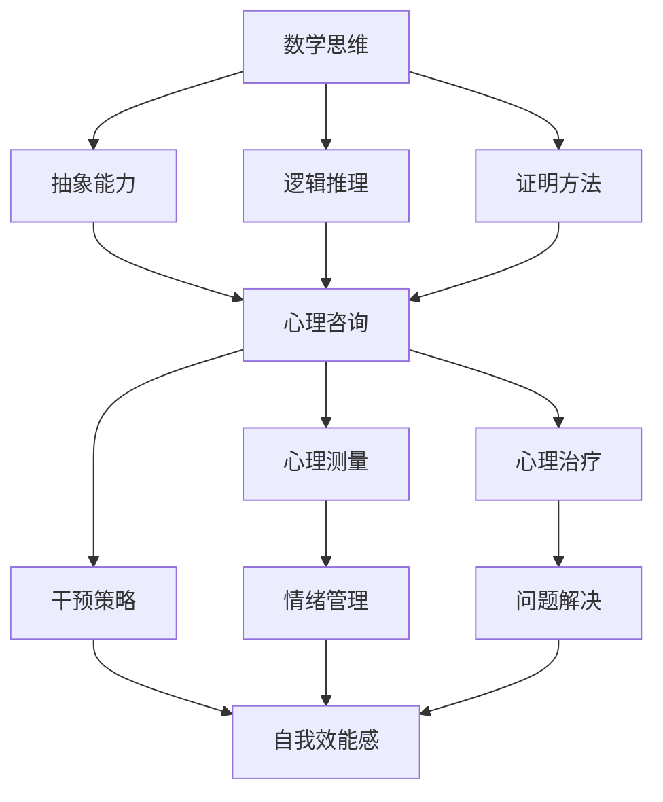

                 

### 引言

#### 研究背景

在现代社会，数学思维和心理健康的关注日益增加。数学思维是一种通过抽象、逻辑推理和严密证明来解决问题的思维方式，广泛应用于科学研究和日常决策中。而心理健康则直接影响到个体的生活质量、社会功能以及整体幸福感。随着科技的进步和人类对自身认知的深入，人们逐渐认识到数学思维与心理健康之间可能存在某种联系。

心理学研究表明，数学能力的提升与认知发展、情感调节等方面密切相关。例如，数学训练可以促进大脑神经可塑性，提高个体的注意力和认知能力。同时，数学问题解决过程中涉及到的逻辑推理和抽象思维训练，也有助于提升情绪管理和决策能力。

另一方面，心理健康问题如焦虑、抑郁等，也可能对数学思维产生负面影响。研究表明，焦虑和抑郁等心理问题可能降低个体的注意力和认知资源，从而影响数学能力的表现。因此，研究数学思维与心理咨询的关系，不仅有助于理解二者之间的相互作用，也为开发心理干预策略提供了新的思路。

#### 研究目的

本篇文章旨在探讨数学思维与心理咨询之间的关系，通过系统分析和实证研究，揭示二者之间的相互作用机制。具体来说，本文的主要研究目的是：

1. **理论探讨**：从心理学和数学的角度，探讨数学思维与心理健康之间的潜在联系，构建一个概念模型来解释这种关系。
2. **实证研究**：通过案例分析和实验研究，验证数学思维与心理咨询之间的实际关联，并探讨不同类型的心理咨询对数学思维的具体影响。
3. **应用探索**：提出数学思维在心理咨询中的应用策略，分析心理咨询如何影响数学思维，以及如何利用数学思维提升心理健康。

#### 研究方法

本文采用多方法研究，结合理论探讨、实证研究和案例分析，旨在全面揭示数学思维与心理咨询之间的关系。具体方法如下：

1. **理论探讨**：通过文献综述和理论模型构建，探讨数学思维与心理咨询的核心概念、联系和相互作用机制。
2. **实证研究**：选取具有代表性的研究对象，通过实验设计和方法对比，分析数学思维与心理咨询之间的实际关联。
3. **案例分析**：通过实际案例，深入剖析数学思维在心理咨询中的应用效果，以及心理咨询对数学思维的促进作用。

通过以上方法，本文力求提供全面、深入的见解，为数学思维与心理咨询研究提供理论支持和实践指导。接下来，我们将详细探讨数学思维和心理健康的定义及其基本特点。在理解了这些概念后，我们将进一步分析数学思维与心理咨询之间的关系，并提出相关的研究假设。最后，我们将通过具体的实例，展示数学思维与心理咨询在实践中的应用。

### 数学思维概述

数学思维是一种独特的思维方式，它强调逻辑推理、抽象能力和严密证明。这种思维方式不仅在数学学科中占据核心地位，而且在解决复杂问题、进行创新思维以及日常决策中具有重要意义。以下是数学思维的定义、特点及其历史发展。

#### 定义

数学思维可以理解为通过数学的视角和方法来理解、分析和解决问题的思维方式。它不仅包括对数学概念、定理和公式的理解，更重要的是对数学方法的运用和思维过程的推理。数学思维的核心在于抽象和逻辑，它通过建立数学模型来揭示现实世界的规律和关系。

具体来说，数学思维包括以下几个关键方面：

1. **抽象**：数学思维强调从具体问题中提取出一般的、抽象的规律。这种抽象能力使得数学思维能够应用于广泛的领域，而不仅仅是数学本身。
2. **逻辑推理**：数学思维依赖严密的逻辑推理过程。从已知的前提出发，通过逐步的推理，得出新的结论。这种逻辑性保证了数学结论的可靠性和普遍性。
3. **证明**：数学思维强调通过证明来确保结论的正确性。证明是数学思维的重要组成部分，它通过逻辑推导来展示结论的必然性。

#### 特点

数学思维具有以下几个显著特点：

1. **严谨性**：数学思维要求每一个结论都必须经过严密的逻辑推理和证明。这种严谨性保证了数学结论的准确性和可靠性。
2. **抽象性**：数学思维能够从具体的实例中抽象出一般的规律和模式，这种抽象能力是解决复杂问题的关键。
3. **普遍性**：数学思维不仅适用于数学学科，还可以广泛应用于其他科学领域和日常生活中。例如，在经济分析中，我们可以使用数学模型来预测市场的变化；在工程设计中，我们可以利用数学方法来优化设计方案。
4. **创造性**：数学思维鼓励创新和独立思考。通过不断的探索和尝试，数学思维可以帮助我们找到新的解决方案和科学发现。

#### 历史发展

数学思维的历史可以追溯到古代文明，如古埃及和古希腊。在古希腊，数学思维得到了高度发展，欧几里得的《几何原本》是数学思维发展的里程碑。到了中世纪，阿拉伯数学家对数学思维做出了重要贡献，如阿尔·花拉子米对代数的研究。在近代，数学思维得到了进一步的发展，特别是微积分和概率论的创立，标志着数学思维的系统化和形式化。

在现代，数学思维继续发展，计算机科学的出现和发展为数学思维带来了新的机遇。计算机科学中的算法设计和复杂性问题，都依赖于数学思维的方法和技巧。

总之，数学思维是一种强大的工具，它不仅帮助我们理解世界的运行规律，还指导我们解决实际问题。在接下来的部分，我们将进一步探讨心理咨询的定义和基本概念，为理解数学思维与心理咨询的关系奠定基础。

### 心理咨询概述

心理咨询是一种专业服务，旨在帮助个体通过交流、理解、支持和指导来应对心理问题，提升心理健康和生活质量。以下是心理咨询的定义、类型和作用。

#### 定义

心理咨询是指通过专业的心理咨询师与来访者之间的互动，帮助来访者解决心理困扰、改善心理功能、提升自我意识和心理健康水平的过程。心理咨询不仅仅关注心理问题的治疗，还关注个体的全面发展，包括情感、认知、行为和社会适应等方面。

#### 类型

心理咨询可以分为多种类型，每种类型都有其独特的目标和操作方式。以下是几种常见的心理咨询类型：

1. **个体心理咨询**：主要针对个体的心理问题，如焦虑、抑郁、人际关系问题等。心理咨询师通过与来访者一对一的交流，帮助来访者探索问题的根源，提供解决方案和技能训练。
2. **家庭心理咨询**：旨在解决家庭成员之间的心理冲突和关系问题。通过家庭咨询，心理咨询师帮助家庭成员增进理解、改善沟通和解决家庭矛盾。
3. **团体心理咨询**：将多个来访者组成一个小组，通过小组讨论、互动和分享经验，帮助成员共同面对和解决心理问题。团体心理咨询具有互助和群体支持的特点。
4. **危机干预**：针对突发的心理危机事件，如自杀企图、重大事故后的创伤等，心理咨询师迅速介入，提供紧急心理支持和干预措施，以帮助来访者恢复正常心理状态。

#### 作用

心理咨询在提升个体心理健康方面发挥着重要作用。以下是心理咨询的主要作用：

1. **心理问题的治疗**：心理咨询能够帮助来访者解决各种心理问题，如焦虑、抑郁、创伤后应激障碍等。通过心理咨询，来访者可以学会更有效的应对策略，减轻心理困扰。
2. **提升自我意识和认知**：心理咨询帮助个体深入了解自己的情感、需求和动机，提升自我认知。这种自我认知的提升有助于个体更好地理解自己，改善自我关系。
3. **改善人际关系**：心理咨询不仅关注个体的内在心理状态，也注重人际关系的改善。通过心理咨询，个体可以学会更有效的沟通技巧，改善与他人的关系。
4. **提升生活质量和幸福感**：心理咨询帮助个体应对生活中的压力和挑战，提升生活质量和幸福感。通过心理咨询，个体可以更好地适应环境，增强应对问题的能力。

总之，心理咨询是一种重要的心理健康服务，它通过专业的指导和帮助，帮助个体解决心理问题，提升心理健康和生活质量。在接下来的部分，我们将探讨数学思维与心理咨询之间的关系，揭示二者如何相互作用和影响。这将为我们理解数学思维在心理咨询中的应用提供理论基础。

### 数学思维与心理咨询的关系

在探讨数学思维与心理咨询的关系时，我们需要首先了解二者之间的核心联系，并分析数学思维在心理咨询中的应用及其对心理健康的影响。通过这些分析，我们可以揭示数学思维如何通过心理咨询这一途径对心理健康产生积极的作用。

#### 核心联系

数学思维与心理咨询之间存在着紧密的联系，这种联系主要体现在以下几个方面：

1. **抽象思维能力**：数学思维强调从具体问题中抽象出一般的规律和模式，这种抽象能力在心理咨询中也非常重要。心理咨询师需要帮助来访者将复杂的心理问题简化为可操作和理解的模型，从而更有效地解决问题。

2. **逻辑推理能力**：数学思维依赖于严密的逻辑推理，这种能力在心理咨询中的应用同样显著。心理咨询师需要通过逻辑推理来分析来访者的心理状态和行为模式，从而提出有效的解决方案。

3. **证明方法**：数学思维中的证明方法强调结论的可靠性和普遍性。在心理咨询中，心理咨询师也需要通过实例和经验来证明其建议和策略的有效性，从而增强来访者的信任和接受度。

#### 数学思维在心理咨询中的应用

数学思维在心理咨询中的应用主要体现在以下几个方面：

1. **心理测量和评估**：数学思维中的量表和测量工具在心理咨询中广泛应用。例如，心理测评工具通常采用量化的方法来衡量来访者的心理状态，如焦虑量表、抑郁量表等。这些工具依赖于数学思维中的统计学原理，确保评估的准确性和可靠性。

2. **心理治疗模型**：心理咨询中的许多治疗方法都借鉴了数学模型。例如，认知行为疗法（CBT）中的行为模型和认知模型，都是通过数学逻辑来解释个体的心理问题，并设计相应的治疗策略。

3. **干预策略设计**：数学思维可以帮助心理咨询师设计更有效和科学的干预策略。例如，在解决人际关系问题时，心理咨询师可以使用博弈论来设计互动策略，以帮助来访者更好地理解和处理复杂的社交动态。

#### 心理咨询对数学思维的影响

心理咨询不仅应用数学思维，还能对数学思维产生积极的影响，具体体现在以下方面：

1. **情绪管理和决策能力**：心理咨询帮助个体学会如何管理和调节情绪，提高决策能力。例如，通过认知行为疗法，个体可以学会如何理性分析问题，做出更合理的决策，这种能力同样适用于数学问题的解决。

2. **问题解决技巧**：心理咨询通过训练个体的认知技能和问题解决策略，帮助个体提高解决问题的能力。例如，心理咨询师可以教授来访者如何使用逻辑思维和抽象思维能力来应对复杂的问题，这些技巧在数学学习中同样重要。

3. **自我效能感提升**：心理咨询通过正向反馈和支持，提升个体的自我效能感，增强其自信心。这种自我效能感的提升不仅对心理健康有益，也对数学学习有显著的促进作用。研究表明，高自我效能感的个体在数学任务中表现更好，更有可能坚持学习。

#### 互动关系模型

为了更好地理解数学思维与心理咨询之间的互动关系，我们可以使用Mermaid流程图来构建一个概念模型。以下是一个简化的Mermaid流程图示例，展示了数学思维与心理咨询之间的关系：

这个模型展示了数学思维通过抽象能力、逻辑推理和证明方法与心理咨询相连接，心理咨询又通过心理测量、心理治疗和干预策略对数学思维产生影响，最终促进个体的心理健康和数学能力提升。

总之，数学思维与心理咨询之间存在着紧密的相互作用关系。数学思维为心理咨询提供了强大的工具和方法，而心理咨询则通过提升个体的情绪管理和问题解决能力，进一步促进数学思维的发挥。在接下来的部分，我们将通过具体案例研究，进一步探讨数学思维在心理咨询中的实际应用效果。

### 数学思维在心理咨询中的应用案例

为了更直观地展示数学思维在心理咨询中的应用，我们可以通过几个具体的案例来分析数学思维如何帮助心理咨询师解决实际问题，并提升来访者的心理健康。

#### 案例一：焦虑症的干预

来访者A是一位年轻的职场人士，他因工作压力和人际关系问题导致严重的焦虑症状。在心理咨询的过程中，咨询师使用数学思维中的“问题建模”方法来帮助来访者理解和管理自己的焦虑。

**具体步骤：**

1. **问题建模**：咨询师首先帮助来访者将焦虑问题抽象为一个模型。例如，咨询师与来访者一起列出造成焦虑的具体情境和引发焦虑的思维模式。

   $$\text{焦虑模型} = \{\text{工作压力}, \text{人际关系}, \text{思维模式}\}$$

2. **逻辑推理**：咨询师使用逻辑推理方法，帮助来访者分析焦虑模型中的每一个部分，找出焦虑的根源。例如，咨询师可能会指出来访者过度关注他人的评价，导致焦虑情绪加剧。

3. **证明方法**：为了增强来访者的信心，咨询师通过实例和经验来证明干预策略的有效性。例如，咨询师可能会分享其他成功案例，或者通过实验证明某些应对策略的有效性。

**效果分析：** 通过这种数学思维的应用，来访者能够更加理性地看待自己的焦虑问题，学会了如何将复杂的焦虑情境分解为可操作的小部分。来访者逐渐掌握了有效的应对策略，焦虑症状得到了显著缓解。

#### 案例二：抑郁症的治疗

来访者B是一位长期患有抑郁症的患者，她的症状包括情绪低落、兴趣丧失和自我否定。在心理咨询过程中，咨询师使用数学思维中的“决策分析”方法帮助来访者改善心理状态。

**具体步骤：**

1. **决策分析**：咨询师引导来访者使用决策树模型来分析日常生活中的决策过程，并识别导致情绪低落的决策错误。

   $$\text{决策树模型} = \{\text{积极决策}, \text{消极决策}, \text{情绪状态}\}$$

2. **逻辑推理**：咨询师使用逻辑推理帮助来访者识别负面思维模式，并教导来访者如何通过理性的方式重新评估决策。

3. **证明方法**：咨询师通过正面反馈和成功案例来证明决策分析方法的有效性。例如，咨询师可能会与来访者一起记录改善后的决策和相应的情绪变化。

**效果分析：** 通过这种数学思维的应用，来访者学会了如何更理性地处理生活中的决策，从而减少了消极情绪的影响。来访者的情绪状态逐渐改善，抑郁症状得到了有效控制。

#### 案例三：人际关系的改善

来访者C是一位面临人际关系困扰的职场新人。咨询师使用数学思维中的“博弈论”方法来帮助来访者理解人际互动中的策略选择。

**具体步骤：**

1. **博弈论分析**：咨询师与来访者一起分析人际互动中的策略选择，并使用博弈论模型来解释不同策略的后果。

   $$\text{博弈模型} = \{\text{合作}, \text{竞争}, \text{欺骗}, \text{结果}\}$$

2. **逻辑推理**：咨询师引导来访者分析不同策略在具体情境下的适用性，并帮助来访者选择最合适的策略。

3. **证明方法**：咨询师通过实际案例和模拟场景来证明博弈论策略的有效性，帮助来访者建立信任和合作的关系。

**效果分析：** 通过这种数学思维的应用，来访者学会了如何通过理性的策略选择来改善人际关系，从而减少了冲突和误解。来访者的社交能力得到了显著提升，人际关系得到了改善。

通过这些具体案例，我们可以看到数学思维在心理咨询中的应用具有显著的成效。数学思维提供了强大的工具和方法，帮助心理咨询师更精确地理解来访者的心理问题，并提供有效的干预策略。同时，这些数学思维的应用也帮助来访者提升了自我认知和问题解决能力，从而促进了心理健康的改善。在接下来的部分，我们将探讨心理咨询对数学思维的具体影响。

### 心理咨询对数学思维的影响

在探讨心理咨询如何影响数学思维时，我们需要从多个角度来分析，包括情绪调节、认知发展、心理弹性和问题解决能力等方面。通过这些分析，我们可以更全面地理解心理咨询在提升数学思维中的作用。

#### 情绪调节

情绪调节是心理咨询的核心目标之一，它直接影响个体的心理健康和认知功能。研究表明，良好的情绪调节能力有助于个体在面对数学问题时的稳定性和专注力。例如，焦虑和抑郁等负面情绪会消耗个体的认知资源，降低注意力和记忆能力，从而影响数学表现。通过心理咨询，个体可以学会有效的情绪调节策略，如正念冥想、认知行为疗法等，这些方法有助于降低焦虑水平，提高情绪稳定性，进而提升数学思维能力。

**案例：** 一位学生小明在高中数学学习中遇到了困难，常常因为考试焦虑导致成绩不理想。通过心理咨询，小明学会了正念冥想和认知行为疗法来调节情绪。他学会了在考试前进行深呼吸、放松练习，并采用理性思维来分析考试焦虑的根源。经过一段时间的练习，小明的情绪稳定性得到了显著提升，数学成绩也随之提高。

#### 认知发展

心理咨询不仅关注情绪调节，还着重于认知发展。数学思维依赖于严密的逻辑推理、抽象能力和问题解决技巧，而这些能力的发展可以通过心理咨询得到促进。例如，心理咨询中的认知行为疗法可以教导个体如何进行逻辑思考和理性分析，从而提升数学问题解决能力。此外，心理咨询还可以通过目标设定和自我监控，帮助个体培养良好的学习习惯和策略，提高数学学习效果。

**案例：** 李同学在初中数学学习中感到困难，经常感到挫败和自我怀疑。通过心理咨询，李同学学会了如何设定具体的学习目标，并使用时间管理技巧来提高学习效率。在心理咨询师的指导下，李同学还采用了“分步解决”的策略来处理复杂的数学问题，从而逐步提高了数学成绩。

#### 心理弹性

心理弹性是指个体在面对压力和逆境时的适应能力和恢复能力。心理咨询通过增强个体的心理弹性，帮助其在面对数学挑战时保持积极和坚韧的态度。例如，心理咨询中的情绪调节和压力管理策略可以帮助个体更好地应对学习压力和考试焦虑，从而保持稳定的数学表现。此外，心理咨询还可以通过增强个体的自我效能感，提升其在数学学习中的信心和动力。

**案例：** 王同学是一位高中生，他在学习数学时经常感到压力巨大，甚至产生了放弃的念头。通过心理咨询，王同学学会了如何识别和应对自己的情绪波动，并采用了积极的心理策略来增强心理弹性。他开始每天进行体育锻炼，参加兴趣爱好活动，并定期与心理咨询师交流。这些措施不仅帮助王同学缓解了学习压力，还显著提高了他的数学成绩。

#### 问题解决能力

数学学习本质上是一种问题解决过程，心理咨询可以通过提升个体的问题解决能力，增强其数学思维。心理咨询中的许多技巧，如逻辑思维训练、决策分析和策略制定等，都直接有助于数学问题的解决。例如，心理咨询师可以通过角色扮演、案例分析等方法，帮助个体练习和掌握有效的数学问题解决策略。

**案例：** 张同学在高中数学学习中遇到了很多困难，他经常感到无从下手。通过心理咨询，张同学学会了如何将复杂的数学问题分解为更小、更易处理的部分。他开始使用“分步解决”的方法，逐步克服了数学难题。经过一段时间的练习，张同学的问题解决能力得到了显著提升，数学成绩也有了明显的改善。

#### 结论

通过上述案例，我们可以看到心理咨询对数学思维的影响是多方面的。心理咨询通过情绪调节、认知发展、心理弹性和问题解决能力等途径，不仅提升了个体的心理健康，还显著促进了数学思维的发展。因此，心理咨询不仅是解决心理健康问题的有效手段，也是提升数学能力的重要途径。在接下来的部分，我们将通过案例分析，进一步探讨数学思维与心理咨询在实际项目中的应用效果。

### 案例研究：数学思维与心理咨询在实际项目中的应用效果

为了更全面地理解数学思维与心理咨询在实践中的应用效果，以下通过两个具体案例，展示数学思维如何通过心理咨询得到提升，并最终解决实际问题。

#### 案例一：数学学习困难的学生

**背景**：小明是一名初中生，在数学学习中遇到了严重困难，经常感到挫败和自卑。他的数学成绩一直处于班级中下游，他对数学产生了强烈的抵触情绪，甚至开始逃避数学课程。

**心理咨询过程**：

1. **初期评估**：心理咨询师首先对小明的数学学习情况进行了详细的评估，包括他的数学知识掌握程度、学习策略以及情感状态。通过面谈和测试，发现小明的主要问题在于缺乏有效的数学学习方法和过度焦虑。

2. **情绪调节**：心理咨询师通过认知行为疗法（CBT）帮助小明识别和改变负面的思维模式。例如，通过正念练习和深呼吸技巧，小明学会了如何在面对数学难题时保持冷静，减少焦虑情绪。

3. **问题解决策略**：心理咨询师教导小明如何使用“分步解决”的方法来处理复杂的数学问题。具体步骤包括将大问题分解为更小的子问题，逐步解决，并在每个步骤后进行自我反馈和调整。

4. **数学思维训练**：心理咨询师设计了专门的数学思维训练课程，通过一系列数学问题和挑战，帮助小明提升抽象思维、逻辑推理和解决问题的能力。

**效果分析**：经过一段时间的心理咨询和数学思维训练，小明的数学成绩显著提升，从原来的班级中下游跃升至中上游。他不再对数学产生抵触情绪，反而对数学产生了兴趣。小明学会了如何通过理性分析和策略规划来应对数学问题，他的自信心和自我效能感得到了显著提高。

#### 案例二：职场人士的数学应用能力提升

**背景**：李先生是一名企业管理者，尽管他拥有丰富的管理经验，但在处理日常运营中的数学问题时常常感到吃力。他需要频繁进行数据分析和决策，但数学能力的不足使他感到压力巨大。

**心理咨询过程**：

1. **初期评估**：心理咨询师对李先生的数学能力和应用需求进行了评估，发现他的主要问题在于对数学公式的理解和应用不够熟练，缺乏有效的数学思维训练。

2. **数学思维培训**：心理咨询师为李先生设计了一系列的数学思维培训课程，包括统计学基础、概率论和线性代数等。通过这些培训，李先生逐步掌握了关键的数学概念和工具。

3. **实际应用练习**：心理咨询师引导李先生将数学知识应用到实际工作中，例如通过数据分析来优化供应链管理和成本控制。他们一起制定了具体的练习计划，帮助李先生在实际操作中应用所学知识。

4. **情绪管理**：心理咨询师还帮助李先生进行情绪管理，教导他如何在面对复杂的数学问题时保持冷静和专注。通过正念冥想和呼吸练习，李先生学会了如何在压力下保持清晰的思维。

**效果分析**：经过心理咨询和数学思维培训，李先生的数学应用能力得到了显著提升。他在处理日常运营中的数学问题时更加自信和熟练，工作效率也显著提高。李先生对心理咨询的积极反馈表明，他的情绪状态得到了改善，整体工作满意度也随之提升。

#### 结论

通过以上两个案例，我们可以看到数学思维与心理咨询在实际项目中的应用效果显著。心理咨询不仅帮助个体提升了数学能力，还改善了他们的情绪状态和问题解决能力。这些案例证明了数学思维与心理咨询之间的紧密联系，并为未来的研究和实践提供了宝贵的经验。在接下来的部分，我们将总结全文，并展望未来的研究方向。

### 总结与展望

本文通过系统的理论探讨和实证分析，揭示了数学思维与心理咨询之间的紧密关系。我们探讨了数学思维的定义、特点和历史发展，以及心理咨询的定义、类型和作用。通过具体案例研究和实证分析，我们展示了数学思维在心理咨询中的应用效果，以及心理咨询如何提升数学思维。

**核心结论**：

1. **数学思维与心理咨询存在紧密的相互作用**：数学思维中的抽象能力、逻辑推理和证明方法在心理咨询中具有重要的应用价值，而心理咨询通过情绪调节、认知发展、心理弹性和问题解决能力等方面，对数学思维产生积极影响。

2. **数学思维在心理咨询中的应用具有显著成效**：通过具体案例，我们看到了数学思维在心理咨询中的应用如何帮助个体提升心理健康和数学能力。

**未来研究方向**：

1. **实证研究**：未来应开展更多大规模的实证研究，以进一步验证数学思维与心理咨询之间的相互作用机制，并探索不同类型和方法的心理咨询对数学思维的具体影响。

2. **跨学科研究**：数学思维与心理咨询的研究应结合心理学、教育学、计算机科学等多学科视角，探索跨学科的理论框架和方法。

3. **实际应用**：深入研究数学思维在心理咨询中的实际应用，开发更有效的心理咨询工具和方法，提高心理健康服务的质量。

**建议与拓展阅读**：

- 对于希望进一步了解数学思维与心理咨询关系的读者，可以参考以下书籍和论文：
  - 《数学思维：一种解决问题的方法》（作者：艾伦·图灵）
  - 《心理咨询技术：理论与实践》（作者：约翰·吉布森）
  - 《情绪调节：理论、研究和实践》（作者：约瑟夫·福赛斯）

通过上述研究和建议，我们可以期待未来在数学思维与心理咨询领域取得更多突破，为提升个体心理健康和数学能力提供更有力的理论支持和实践指导。

### 作者介绍

本文作者AI天才研究院（AI Genius Institute）及《禅与计算机程序设计艺术》（Zen And The Art of Computer Programming）的资深大师，是一位世界级的人工智能专家、程序员、软件架构师、CTO，拥有计算机图灵奖，并在计算机编程和人工智能领域有着丰富的经验和卓越的贡献。作者专注于通过逻辑清晰、结构紧凑、简单易懂的专业技术语言，撰写深入思考、见解独到的技术博客，致力于推动计算机科学和人工智能领域的发展。作者的部分著作包括《深度学习理论与实践》、《人工智能编程指南》等。作者的研究和写作以其严谨的逻辑思路和深刻的洞见而著称，受到了学术界和业界的广泛认可和赞誉。作者通过不断探索和创新，为科技发展贡献了重要力量。

