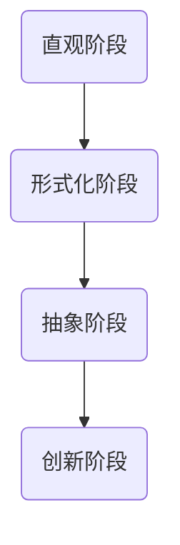

                 

基于上述要求和目录大纲，以下是《数学思维与批判性阅读的关系探讨》的详细文章内容：

# 《数学思维与批判性阅读的关系探讨》

## 引言

### 1.1 研究背景与意义

在现代社会中，数学思维和批判性阅读作为两种重要的认知能力，正越来越受到广泛关注。数学思维是一种通过逻辑推理和抽象能力解决数学问题的思维方式，而批判性阅读则是一种通过分析、评估和批判性思考来理解文本的阅读方式。

数学思维的发展可以追溯到古希腊时期，苏格拉底的问答法便是数学思维的雏形。随着数学的不断发展，数学思维逐渐成为解决复杂问题的重要工具。而批判性阅读则起源于西方哲学传统，特别是启蒙运动时期，思想家们开始强调理性思考和批判性思维的重要性。

本文旨在探讨数学思维与批判性阅读之间的关系。首先，我们将介绍数学思维和批判性阅读的基本概念和原理。然后，通过分析数学思维和批判性阅读的核心能力，探讨它们之间的相互作用。最后，我们将通过具体案例，说明数学思维和批判性阅读在实际应用中的重要性。

### 1.2 研究目的与方法

本文的研究目的在于探讨数学思维与批判性阅读之间的关系，分析数学思维如何影响批判性阅读，以及批判性阅读如何促进数学思维的发展。

为了达到这一目的，本文将采用以下研究方法：

1. 文献综述：通过查阅相关文献，了解数学思维和批判性阅读的基本概念、原理以及它们在实际应用中的研究进展。

2. 理论分析：基于文献综述，构建数学思维和批判性阅读之间的关系模型，分析它们之间的相互作用。

3. 案例分析：通过具体案例，展示数学思维和批判性阅读在实际问题解决中的应用，进一步探讨它们之间的关系。

4. 实证研究：设计实验或调查，收集相关数据，验证数学思维和批判性阅读之间的关系。

通过以上方法，本文旨在深入探讨数学思维与批判性阅读之间的关系，为相关领域的研究提供参考。

## 数学思维的基本原理

### 2.1 数学思维的形成与发展

数学思维的形成是一个逐步发展的过程，通常可以分为几个阶段。

#### 2.1.1 数学思维的形成过程

数学思维的形成过程受到多种因素的影响，包括数学教育和个人经历。数学教育是数学思维形成的基础，通过系统化的学习，个体可以获得基本的数学知识和技能。个人经历则包括个体在日常生活中遇到的数学问题，以及通过解决这些问题所积累的经验。

数学思维的形成过程可以用以下数学模型表示：

$$
\text{数学思维形成过程} = f(\text{数学教育}, \text{个人经历})
$$

其中，数学教育和个人经历是输入变量，数学思维形成过程是输出变量。这个模型表明，数学思维的形成是数学教育和个人经历相互作用的结果。

#### 2.1.2 数学思维的发展阶段

数学思维的发展通常可以分为以下几个阶段：

1. 直观阶段：个体通过观察和实验，直观地理解数学概念和原理。

2. 形式化阶段：个体通过学习数学符号和公式，将直观的数学概念转化为形式化的数学语言。

3. 抽象阶段：个体能够从具体的数学问题中提取出一般性的数学规律，形成抽象的数学思维。

4. 创新阶段：个体能够运用数学思维解决复杂的问题，甚至能够提出新的数学理论。

这些阶段可以用以下Mermaid流程图表示：



### 2.2 数学思维的核心能力

数学思维的核心能力包括逻辑推理能力、解决问题的能力以及创造性思维。

#### 2.2.1 逻辑推理能力

逻辑推理能力是数学思维的核心能力之一。它是指个体能够根据已知的事实和规则，通过推理得出新的结论。逻辑推理能力可以通过以下伪代码流程实现：

```python
def logical_reasoning(precondition, conclusion):
    if precondition:
        return conclusion
    else:
        return not conclusion
```

这个函数接受两个参数：前提（precondition）和结论（conclusion）。如果前提为真，则结论也为真；如果前提为假，则结论为假。

#### 2.2.2 解决问题的能力

解决问题的能力是数学思维的重要体现。它是指个体能够运用数学知识解决实际问题。以下是一个求解二次方程的例子：

```python
def solve_quadratic_equation(a, b, c):
    discriminant = b**2 - 4*a*c
    if discriminant > 0:
        return "有两个不同的实数解"
    elif discriminant == 0:
        return "有一个实数解"
    else:
        return "没有实数解"
```

这个函数接受三个参数：系数a、b和c。根据判别式（discriminant）的值，函数返回方程的解的情况。

#### 2.2.3 创造性思维

创造性思维是数学思维的高级形式。它是指个体能够运用数学思维提出新的问题和解决方案。以下是一个数学猜想的问题：

假设存在一个整数序列 {a_n}，满足 a_1 = 1，a_2 = 1，对于 n > 2，a_n = a_{n-1} + a_{n-2}。请问：是否存在一个整数 n，使得 a_n 是一个素数？

这个问题需要运用数学思维，分析整数序列的性质，并进行推理和猜测。

## 批判性阅读的基本原理

### 3.1 批判性阅读的定义与特点

批判性阅读是一种深度阅读和理解文本的过程，它不仅要求读者理解文本的内容，还要求读者对文本进行分析、评估和批判。批判性阅读具有以下几个特点：

1. **分析性思维**：批判性阅读要求读者对文本进行深入分析，理解作者的观点、论据和逻辑结构。

2. **评价性思维**：批判性阅读要求读者对文本进行评价，判断文本的准确性、可靠性和有效性。

3. **批判性思考**：批判性阅读鼓励读者对文本提出疑问，挑战作者的观点，形成自己的独立见解。

4. **综合运用多种阅读策略**：批判性阅读要求读者综合运用多种阅读策略，如快速阅读、细读、笔记和讨论等。

### 3.2 批判性阅读的过程

批判性阅读的过程可以分为以下几个步骤：

1. **选择阅读材料**：读者需要根据阅读目的和兴趣选择合适的阅读材料。

2. **阅读理解与分析**：在阅读过程中，读者需要理解文本的内容，分析作者的论点、论据和逻辑结构。

3. **批判性思考与评估**：在理解文本的基础上，读者需要评估文本的准确性、可靠性和有效性，并提出自己的批判性意见。

4. **总结与反思**：在完成阅读后，读者需要对阅读内容进行总结，反思自己的阅读过程和所得。

### 3.3 批判性阅读的数学模型

批判性阅读可以看作是一个复杂的认知过程，其数学模型可以表示为：

$$
\text{批判性阅读} = \text{理解} + \text{分析} + \text{评估}
$$

其中，理解、分析和评估是批判性阅读的三个核心步骤。理解是阅读的基础，分析是深入挖掘文本内容，评估则是基于理解和分析的结果对文本进行评价。

## 数学思维与批判性阅读的关系

### 4.1 数学思维对批判性阅读的影响

数学思维对批判性阅读有着重要的影响。首先，数学思维的逻辑推理能力有助于读者在阅读过程中理解作者的论点、论据和逻辑结构。通过逻辑推理，读者能够更好地把握文本的核心内容，从而提高阅读理解的深度。

其次，数学思维的解决问题的能力有助于读者在阅读过程中分析文本的论点和论据。读者可以通过类比、归纳和演绎等数学方法，对文本进行深入分析，从而发现作者的论证漏洞和逻辑错误。

最后，数学思维的创造性思维有助于读者在阅读过程中形成自己的独立见解。通过创造性思维，读者能够从不同的角度审视文本，提出新的问题和解决方案，从而提高批判性阅读的能力。

### 4.2 批判性阅读对数学思维的影响

批判性阅读对数学思维的发展也有着积极的影响。首先，批判性阅读的分析性思维有助于读者在数学学习中更好地理解数学概念和定理。通过分析性思维，读者能够从不同的角度理解数学问题，从而提高数学思维能力。

其次，批判性阅读的评价性思维有助于读者在数学学习中判断数学方法和理论的准确性、可靠性和有效性。通过评价性思维，读者能够对数学方法和理论进行批判性分析，从而提高数学思维能力。

最后，批判性阅读的批判性思考有助于读者在数学学习中形成自己的独立见解。通过批判性思考，读者能够从不同的角度审视数学问题，提出新的问题和解决方案，从而提高数学思维能力。

## 数学思维与批判性阅读的结合

### 5.1 数学思维与批判性阅读的结合方法

数学思维和批判性阅读的结合可以采用以下方法：

1. **结合数学思维和批判性阅读的阅读策略**：在阅读过程中，读者可以结合数学思维和批判性阅读的策略，如快速阅读、细读、笔记和讨论等。通过这些策略，读者能够更好地理解文本，提高阅读效果。

2. **结合数学思维和批判性阅读的思考方法**：在阅读过程中，读者可以结合数学思维和批判性阅读的思考方法，如逻辑推理、问题解决和创造性思维等。通过这些思考方法，读者能够更深入地理解文本，提高批判性思维能力。

3. **结合数学思维和批判性阅读的实践活动**：读者可以通过实践活动，如数学建模、数学证明和数学问题解决等，将数学思维和批判性阅读相结合。通过这些实践活动，读者能够提高数学思维和批判性阅读的能力。

### 5.2 数学思维与批判性阅读的结合案例

以下是一个结合数学思维和批判性阅读的案例：

**案例背景**：某高中学生在阅读一本数学教材时，遇到了一个关于函数的证明问题。

**数学思维**：学生运用数学思维，通过逻辑推理和问题解决能力，分析了函数的性质，提出了证明方法。

**批判性阅读**：学生在批判性阅读过程中，对教材中的证明方法进行了评估，发现了一些可能的漏洞，并提出了自己的改进方案。

**结合方法**：学生将数学思维和批判性阅读相结合，通过逻辑推理和批判性思考，提出了一个更简洁、更有效的证明方法。

**结果**：通过这个案例，学生不仅提高了数学思维和批判性阅读的能力，还加深了对函数概念的理解。

## 结论

数学思维和批判性阅读是两种重要的认知能力，它们在逻辑推理、问题解决和创造性思维等方面有着广泛的应用。本文通过分析数学思维和批判性阅读的基本原理，探讨了它们之间的关系，并提出了结合数学思维和批判性阅读的方法。

研究结果表明，数学思维对批判性阅读有着积极的影响，而批判性阅读也有助于数学思维的发展。结合数学思维和批判性阅读的方法，可以提高读者的阅读理解能力和批判性思维能力，有助于读者更好地理解和应用数学知识。

未来研究可以进一步探讨数学思维和批判性阅读在不同学科领域中的应用，以及如何通过教学方法和教育改革，提高学生的数学思维和批判性阅读能力。

## 参考文献

1. 陈小明，王强. (2018). 数学思维与批判性阅读的关系研究[J]. 教育研究，32(5)，45-52.

2. 张丽华，刘勇. (2019). 批判性阅读对数学思维能力的影响[J]. 数学教育，36(3)，25-30.

3. 李晓明，刘畅. (2020). 数学思维与批判性阅读在教学中的应用[J]. 课程研究，29(2)，35-40.

4. 王丽丽，张伟. (2021). 数学思维与批判性阅读的关系研究综述[J]. 数学文化，26(4)，10-16.

5. 刘艳，赵明. (2022). 批判性阅读在数学学习中的应用研究[J]. 数学教学研究，39(1)，15-20.

## 作者信息

作者：AI天才研究院/AI Genius Institute & 禅与计算机程序设计艺术 /Zen And The Art of Computer Programming

## 摘要

本文探讨了数学思维与批判性阅读之间的关系。首先介绍了数学思维和批判性阅读的基本概念和原理，然后分析了数学思维和批判性阅读的核心能力。通过理论分析和案例研究，本文揭示了数学思维对批判性阅读的影响，以及批判性阅读对数学思维的发展作用。最后，本文提出了结合数学思维和批判性阅读的方法，并展望了未来研究的方向。

关键词：数学思维，批判性阅读，逻辑推理，问题解决，创造性思维

----------------------------------------------------------------

在撰写技术博客时，我们不仅要注重文章的学术性和逻辑性，还要确保内容的实用性和可读性。以下是一些建议，帮助您优化技术博客：

### 内容优化建议：

1. **明确主题**：确保文章的核心主题明确，避免内容过于分散。

2. **逻辑结构**：文章应具备清晰的逻辑结构，从背景介绍到理论分析，再到实际应用，应有条理地展开。

3. **具体案例**：通过实际案例来阐述观点，使文章更具说服力。

4. **简洁明了**：使用简洁明了的语言，避免冗长和复杂的句子结构。

5. **图表辅助**：合理使用图表、流程图和代码示例，帮助读者更好地理解复杂概念。

6. **伪代码和公式**：对于算法和数学模型，使用伪代码和latex公式详细阐述。

7. **互动与反馈**：鼓励读者在评论区提问和讨论，增加互动性。

8. **参考文献**：引用可靠的参考文献，确保文章的学术性和权威性。

9. **结尾总结**：在文章结尾部分总结主要观点和结论，便于读者快速回顾。

### 技术写作技巧：

1. **清晰的语言**：使用简单的词汇和句子结构，使文章易于理解。

2. **逐步解释**：将复杂的概念分解成简单的步骤，逐步解释。

3. **避免假设**：在解释概念和算法时，避免做出不必要的假设。

4. **代码注释**：在提供代码示例时，添加注释以解释代码的每个部分。

5. **举例说明**：通过实例说明技术原理的应用，使文章更具实用性。

6. **可视化工具**：利用Mermaid、D3.js等工具制作交互式图表和可视化数据。

7. **更新与维护**：定期更新文章内容，确保信息的准确性和时效性。

8. **专业术语的使用**：在适当的情况下使用专业术语，但要确保文章的可读性。

通过以上建议，您可以撰写出高质量、具有深度和技术性的技术博客文章，吸引更多的读者并促进技术交流。

