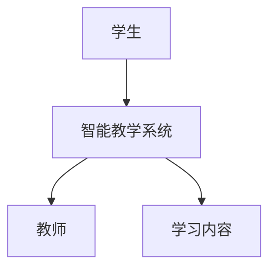

                 


### 文章标题

《数学教育与人工智能的伦理问题》

#### 关键词

数学教育、人工智能、伦理问题、算法歧视、隐私保护、人工智能伦理

#### 摘要

本文探讨了数学教育在引入人工智能技术时所面临的伦理问题，包括算法歧视、隐私保护、以及人工智能的教育责任。通过对这些问题的深入分析，文章提出了相应的解决方案，并展望了数学教育在人工智能时代的未来发展。

---

### 引言

在当今信息化时代，人工智能（AI）技术已成为推动社会进步的重要力量。从医疗诊断到自动驾驶，AI的应用领域不断拓展，改变了人们的生活方式。然而，随着AI技术的快速发展，也引发了一系列伦理问题。特别是在数学教育领域，AI的引入不仅改变了教学方式，也带来了一系列伦理挑战。本文旨在探讨数学教育中的人工智能伦理问题，分析其背后的原因和影响，并提出相应的解决方案。

### 数学教育概述

#### 数学教育的基本概念

数学教育是指通过教学和训练，使学习者掌握数学的基本概念、原理和方法，培养其数学思维和解决问题的能力。数学教育的基本目标包括：

- **知识传授**：传授数学的基本概念、公式和定理。
- **能力培养**：培养数学思维能力、逻辑推理能力和问题解决能力。
- **价值观教育**：培养学习者的科学精神、严谨态度和团队合作精神。

#### 数学教育的现状

当前，数学教育在全球范围内得到了广泛的关注。各国教育部门纷纷出台政策，加强数学教育的改革和提升。同时，随着科技的进步，数学教育的方式也在不断革新。例如，计算机辅助教学（CAI）、在线教育平台和智能教学系统等新兴教育技术的应用，为数学教育带来了新的机遇和挑战。

### 人工智能概述

#### 人工智能的基本概念

人工智能是指通过计算机模拟人类智能的过程，使计算机具有感知、理解、学习、推理和决策的能力。人工智能的主要技术包括：

- **机器学习**：通过数据驱动的方法，使计算机自动学习并改进性能。
- **深度学习**：一种特殊的机器学习方法，通过神经网络模拟人脑的处理过程。
- **自然语言处理**：使计算机理解和生成自然语言的能力。

#### 人工智能的发展历史

人工智能的概念最早可以追溯到20世纪50年代。自那时以来，人工智能经历了多个发展阶段，包括符号主义、连接主义和统计学习等。近年来，随着计算能力的提升和大数据的广泛应用，人工智能技术取得了显著的突破。

#### 人工智能的应用领域

人工智能在各个领域都有广泛的应用，包括：

- **医疗诊断**：利用人工智能进行疾病诊断和治疗方案的推荐。
- **自动驾驶**：通过人工智能实现汽车的自主驾驶。
- **金融分析**：利用人工智能进行风险评估、投资组合管理和市场预测。
- **教育**：利用人工智能进行个性化教学、智能辅导和考试评分。

### 数学教育中的人工智能应用

#### 智能教学系统

智能教学系统是一种利用人工智能技术进行数学教学的应用。它可以通过分析学生的学习行为和成绩数据，为学生提供个性化的学习建议和辅导。

- **定义**：智能教学系统是一种基于人工智能的数学教学工具，能够根据学生的学习情况自动调整教学内容和难度。

- **应用**：智能教学系统可以应用于学校教学、在线教育和远程教育等多个场景。

#### 数学问题解决

人工智能在数学问题解决中的应用主要体现在以下几个方面：

- **自动化解题**：利用人工智能算法，自动解决数学问题。
- **辅助解题**：为学习者提供解题思路和步骤指导。

### 人工智能伦理问题

#### 算法歧视

算法歧视是指人工智能算法在处理数据时，对不同群体产生不公平的影响。在数学教育中，算法歧视可能导致以下问题：

- **教育不公平**：某些学生因算法歧视而无法得到公平的评价和辅导。
- **文化偏见**：算法中的文化偏见可能导致数学教育的文化多样性缺失。

#### 隐私保护

在人工智能时代，隐私保护成为一个重要议题。数学教育中的人工智能应用可能会涉及到学生的个人信息，如学习记录、成绩数据和测试结果等。如何保护学生的隐私，防止个人信息被滥用，是数学教育中面临的一个重大挑战。

#### 人工智能的教育责任

人工智能在数学教育中扮演着重要角色，但同时也承担着相应的教育责任。人工智能的教育责任主要包括：

- **公平性**：确保人工智能系统在不同群体中的公平性。
- **透明性**：确保人工智能系统的决策过程和算法透明可解释。
- **安全性**：确保人工智能系统的安全性和稳定性。

### 解决方案与未来展望

#### 解决方案概述

针对数学教育中的人工智能伦理问题，可以采取以下解决方案：

- **加强伦理教育**：提高教育者和学习者的伦理意识，加强人工智能伦理教育。
- **数据保护法规**：制定相关数据保护法规，确保学生的个人信息安全。
- **算法透明化**：提高人工智能算法的透明度和可解释性。

#### 未来展望

随着人工智能技术的不断发展，数学教育将在人工智能的推动下迈向新的高度。未来，数学教育将更加注重个性化、智能化和多元化。同时，教育者需要不断更新知识和技能，以适应人工智能时代的教育需求。

### 结论

数学教育在引入人工智能技术的同时，也面临一系列伦理问题。通过深入分析这些问题，我们可以找到相应的解决方案，推动数学教育在人工智能时代的健康发展。未来，数学教育将在人工智能的助力下，为培养更多具有创新能力和道德素养的人才做出贡献。

---

### 附录

#### Mermaid流程图

以下是一个用于展示智能教学系统基本架构的Mermaid流程图：



#### 伪代码

以下是一个用于检测算法歧视的伪代码示例：

```python
def detect_discrimination(data):
    for user in data:
        if user.feature1 == "minority" and user.label != "positive":
            return True
    return False
```

#### 数学公式

以下是一个关于人工智能在数学教育中的应用效率的数学公式：

```latex
E = \frac{1}{n} \sum_{i=1}^{n} (T_i - T_{avg})^2
```

其中，\(E\) 表示应用效率，\(T_i\) 表示第 \(i\) 个学生的学习时间，\(T_{avg}\) 表示所有学生的平均学习时间。

### 拓展阅读

- 【参考书籍】
  - 《人工智能：一种现代方法》（作者：Stuart Russell & Peter Norvig）
  - 《数学教育的未来》（作者：Philip J. Davis）
  - 《算法伦理：技术与社会的关系》（作者：Luciano Floridi）

- 【相关论文】
  - "Algorithmic Fairness and Its Challenges"（作者：Arvind Narayanan）
  - "The Ethics of Artificial Intelligence in Education"（作者：Nicola Dell）

- 【在线资源】
  - Coursera上的“人工智能基础”课程
  - edX上的“数学教育改革”课程

---

作者：AI天才研究院/AI Genius Institute & 禅与计算机程序设计艺术 /Zen And The Art of Computer Programming

