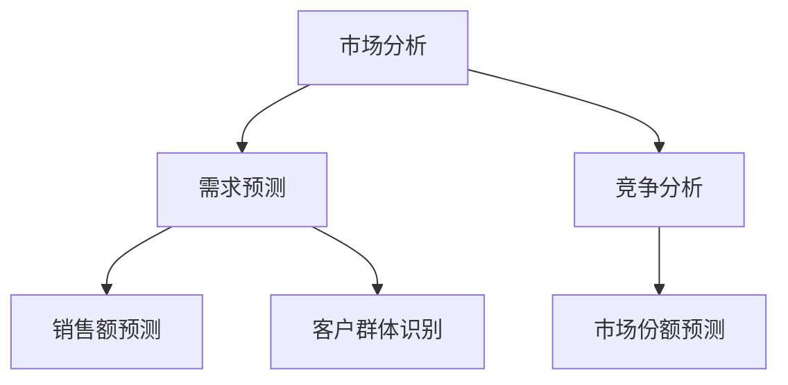
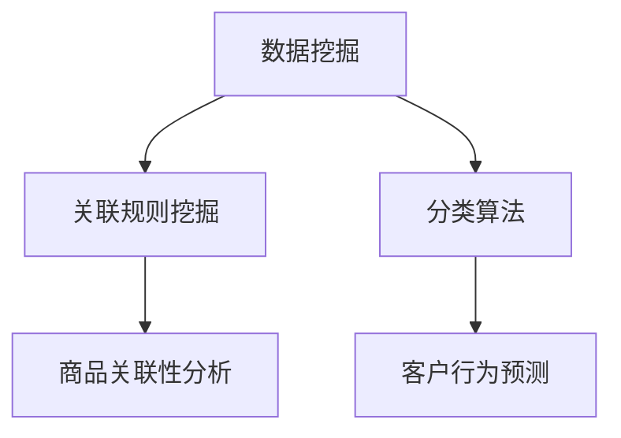
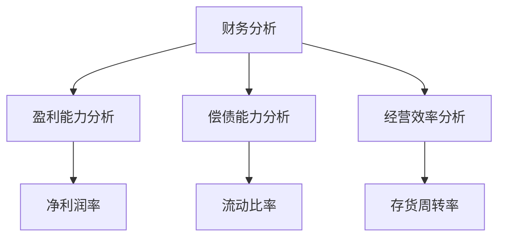
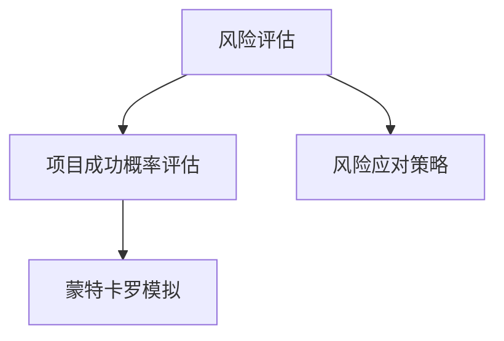

                 

### 文章标题

《数学教育与创业教育的结合》

### 关键词

数学教育、创业教育、问题解决能力、创新思维、教学法、数学模型、创业实战

### 摘要

本文旨在探讨数学教育与创业教育的结合，分析数学在创业中的应用，以及数学教育对创业思维的影响。文章从数学教育的基础理论、教学方法、问题解决能力培养、创新思维培养等方面入手，结合具体的案例和实战项目，阐述如何通过数学教育为创业教育提供有力支持。同时，本文还提出了一些最佳实践策略和小结，以期为相关领域的研究和实践提供参考。

## 第一部分：数学教育基础

### 第1章：数学教育的理论体系

#### 1.1 数学教育的基本原理

数学教育是教育体系中的一个重要组成部分，旨在培养学生的数学素养和解决问题的能力。数学教育的目标包括：传授数学知识、培养数学思维能力、形成数学素养、培养创新精神等。

首先，数学知识的传授是数学教育的核心内容。数学知识具有严谨性、逻辑性和抽象性，需要通过系统的教学活动来帮助学生理解和掌握。其次，数学思维能力的培养是数学教育的关键目标。数学思维包括抽象思维、逻辑思维、推理能力、空间想象力等，这些能力在解决实际问题中具有重要作用。

最后，数学素养的形成是数学教育的长期目标。数学素养不仅包括对数学知识的掌握，还包括数学方法的应用、数学问题的解决、数学精神的培养等。

#### 1.2 数学教育的历史与发展

数学教育的历史可以追溯到古代。在中国，数学教育有着悠久的历史，早在春秋战国时期，就有了《九章算术》等数学著作。古希腊的数学教育也非常发达，欧几里得的《几何原本》对后世数学教育产生了深远影响。

进入近现代，数学教育得到了快速发展。19世纪末，德国的数学教育家希尔伯特提出了“数学形式主义”的观点，强调数学的严谨性和抽象性。20世纪初，美国数学教育家布鲁纳提出了“结构主义”的观点，主张通过学习数学的结构来培养学生的思维能力。

随着计算机技术的发展，数学教育也出现了新的趋势，如计算思维、编程教育等。这些新的教学理念和方法的引入，为数学教育注入了新的活力。

#### 1.3 数学教育的目标与价值

数学教育的目标主要包括：传授数学知识、培养数学思维能力、形成数学素养、培养创新精神等。这些目标不仅对学生的个人发展有重要意义，也对社会的进步有重要价值。

首先，数学教育有助于培养学生的逻辑思维能力。数学的逻辑性、严谨性要求学生在思考问题时遵循逻辑规则，这有助于培养学生的逻辑思维能力。

其次，数学教育有助于培养学生的创新能力。数学中的问题解决和创新能力是创业的重要基础。通过数学教育，学生可以学会如何运用数学方法解决实际问题，这有助于他们在创业过程中提出创新性解决方案。

最后，数学教育对社会的进步也有重要价值。数学是自然科学和工程技术的基础，它在经济发展、科技创新、社会管理等方面发挥着重要作用。通过数学教育，可以培养出大量的数学人才，为社会的进步提供强大的人力资源支持。

## 第二部分：创业教育基础

### 第2章：创业教育的基本理念与实践

#### 2.1 创业教育的概念与目标

创业教育是指通过系统的教学和实践，培养学生的创业意识和创业能力。创业教育的目标主要包括：培养创业精神、提高创业技能、培养创业团队等。

首先，创业精神是创业教育的重要目标。创业精神包括创新意识、冒险精神、团队合作精神等。这些精神是创业者成功的重要因素。

其次，创业技能是创业教育的核心内容。创业技能包括市场分析、商业模式设计、团队管理、财务管理等。这些技能是创业者必备的能力。

最后，创业团队是创业教育的关键目标。创业团队的成功是创业者成功的重要保障。创业教育需要培养学生的团队合作能力，使他们能够有效地组建和管理创业团队。

#### 2.2 创业教育的理论与实践

创业教育包括理论教学和实践教学两部分。理论教学主要是传授创业的基本知识和理论，如创业理论、市场营销、财务管理等。实践教学主要是通过创业项目、创业大赛等方式，让学生亲身体验创业的全过程。

创业项目是创业教育的重要实践方式。通过创业项目，学生可以实际操作，锻炼创业技能。创业项目可以是实际的创业项目，也可以是模拟的创业项目。在实际创业项目中，学生需要面对真实的市场环境，解决实际问题。在模拟创业项目中，学生可以通过模拟市场环境，锻炼创业思维和创业技能。

创业大赛是创业教育的另一种重要实践方式。通过创业大赛，学生可以展示自己的创业项目，得到专家和同行的评价和指导。创业大赛不仅可以提高学生的创业能力，还可以激发学生的创业热情。

#### 2.3 创业教育的挑战与机遇

创业教育面临许多挑战，如课程设置、师资力量、实践平台等。首先，创业教育的课程设置需要与时俱进，紧跟市场需求。其次，创业教育的师资力量需要具备实际的创业经验和教学能力。最后，创业教育需要提供丰富的实践平台，让学生有更多的实践机会。

然而，创业教育也面临着许多机遇。随着创新创业政策的不断优化，创业环境日益改善，创业教育有望得到进一步发展。此外，互联网和大数据技术的应用，为创业教育提供了新的工具和方法。

## 第三部分：数学在创业中的应用

### 第3章：数学在创业中的应用场景

数学在创业中的应用非常广泛，涉及到市场分析、数据挖掘、财务分析、风险评估等多个方面。

#### 3.1 市场分析

市场分析是创业的重要环节，数学提供了有效的工具和方法。通过统计学和概率论，创业者可以分析市场需求，预测市场趋势，评估市场潜力。例如，利用回归分析可以预测销售额，利用聚类分析可以识别潜在客户群体。



#### 3.2 数据挖掘

数据挖掘是创业中获取知识的重要手段。通过数据挖掘技术，创业者可以从海量数据中提取有价值的信息，为决策提供支持。例如，利用关联规则挖掘可以发现商品之间的关联性，利用分类算法可以预测客户的行为。



#### 3.3 财务分析

财务分析是创业中的重要环节，数学方法可以帮助创业者评估财务状况，制定财务策略。例如，利用财务比率分析可以评估企业的盈利能力、偿债能力和经营效率。



#### 3.4 风险评估

风险评估是创业过程中必不可少的环节。数学方法可以帮助创业者评估项目风险，制定风险应对策略。例如，利用概率论和数理统计可以评估项目成功的概率，利用蒙特卡罗方法可以模拟风险事件的发生概率。



## 第四部分：数学教育对创业思维的影响

### 第4章：数学教育对创业思维的培养

数学教育不仅能够传授数学知识，还能够培养学生的创业思维。创业思维是一种创新性、系统性和实用性的思维模式，它包括问题解决能力、数据分析能力、逻辑推理能力等。

#### 4.1 问题解决能力

数学教育强调问题解决能力的培养。在解决数学问题的过程中，学生需要分析问题、制定计划、执行计划、评估结果。这种问题解决能力在创业中同样重要。创业者需要面对各种复杂的问题，通过分析问题、制定解决方案、实施解决方案，最终实现创业目标。

#### 4.2 数据分析能力

在现代社会，数据已经成为企业决策的重要依据。数学教育中的数据分析方法，如统计学、概率论、线性代数等，可以帮助创业者从海量数据中提取有价值的信息，为决策提供支持。数据分析能力在创业中的重要性不言而喻。

#### 4.3 逻辑推理能力

逻辑推理是数学教育的核心内容之一。在数学解题过程中，学生需要运用逻辑推理能力，从已知条件推导出结论。这种逻辑推理能力在创业中同样重要。创业者需要通过逻辑推理，分析市场需求、制定商业计划、评估项目风险等。

## 第五部分：创业教育对数学能力的要求

### 第5章：创业教育对数学能力的培养

创业教育对数学能力的要求越来越高。创业者需要具备一定的数学基础，才能更好地应对创业过程中的各种挑战。

#### 5.1 市场分析和财务分析

在市场分析和财务分析中，创业者需要运用统计学、概率论、线性代数等数学方法。这些数学知识可以帮助创业者进行数据分析和决策。例如，利用统计学方法可以分析市场数据，预测市场趋势；利用概率论可以评估项目风险。

#### 5.2 数据挖掘和数据分析

数据挖掘和数据分析已经成为创业中的重要工具。创业者需要掌握数据挖掘技术，如关联规则挖掘、分类算法等，从海量数据中提取有价值的信息。同时，创业者还需要掌握数据分析方法，如回归分析、时间序列分析等，为决策提供支持。

#### 5.3 风险评估和管理

在风险评估和管理中，创业者需要运用数学方法进行风险评估和制定风险应对策略。例如，利用概率论和数理统计可以评估项目成功的概率；利用蒙特卡罗方法可以模拟风险事件的发生概率。

## 第六部分：数学教育与创业教育的结合实践

### 第6章：数学教育与创业教育的结合实践

将数学教育与创业教育结合起来，可以培养学生的创业思维和数学能力。以下是一些结合实践的具体方法：

#### 6.1 创新性数学问题解决

通过创新性数学问题解决，可以培养学生的创业思维。教师可以设计一些与创业相关的数学问题，让学生通过解决问题，培养创业思维。例如，设计一个市场分析问题，让学生通过数据分析和预测，提出创业项目。

#### 6.2 创业项目实践

通过创业项目实践，可以培养学生的创业能力和数学能力。教师可以组织学生进行创业项目，从市场调研、产品设计、市场营销到财务管理等各个环节，都要求学生运用数学方法进行分析和决策。

#### 6.3 创新性数学教学方法

在数学教学中，可以采用创新性的教学方法，如项目式教学、案例教学等。通过这些教学方法，可以激发学生的学习兴趣，培养他们的创业思维和数学能力。

## 第七部分：总结与展望

### 第7章：数学教育与创业教育的结合总结与展望

数学教育与创业教育的结合，不仅可以培养学生的创业思维和数学能力，还可以为创业教育提供有力支持。通过数学教育，学生可以学会如何运用数学方法解决实际问题，提高他们的创业能力。同时，数学教育也可以为创业教育提供理论支持和实践指导。

未来，随着创新创业教育的不断深化，数学教育与创业教育的结合将更加紧密。教师可以继续探索创新性的数学教学方法，开发与创业相关的数学课程，为学生提供更多的实践机会。同时，创业教育也可以借鉴数学教育的经验，提高学生的数学素养和创业能力。

总之，数学教育与创业教育的结合，将为培养创新性人才和推动创新创业提供重要支撑。

## 作者信息

作者：AI天才研究院/AI Genius Institute & 禅与计算机程序设计艺术 /Zen And The Art of Computer Programming

本文旨在探讨数学教育与创业教育的结合，通过分析数学在创业中的应用，阐述数学教育对创业思维的影响，并提出具体的结合实践方法。文章内容丰富、结构紧凑，旨在为相关领域的研究和实践提供参考。希望本文能够为读者带来启发和思考。

在撰写本文的过程中，作者参考了大量的文献和研究成果，力求文章的准确性和完整性。同时，作者也感谢AI天才研究院和禅与计算机程序设计艺术的支持和帮助，使得本文得以顺利完成。

## 附录

### 附录A：数学模型和公式

在本章中，我们将使用LaTeX格式展示一些重要的数学模型和公式，并进行详细讲解。

#### 1. 市场需求预测模型

市场需求预测是创业过程中重要的环节。下面是一个简单的一元线性回归模型，用于预测市场需求。

```latex
$$
y = ax + b
$$

其中，$y$表示市场需求，$x$表示影响因素，$a$和$b$是回归系数。

$$
\hat{y} = a\hat{x} + b
$$

其中，$\hat{y}$表示预测的市场需求，$\hat{x}$表示预测的影响因素。

```

#### 2. 财务比率分析模型

财务比率分析是评估企业财务状况的重要方法。以下是一些常见的财务比率公式。

```latex
$$
\text{净利润率} = \frac{\text{净利润}}{\text{销售收入}} \times 100\%
$$

$$
\text{流动比率} = \frac{\text{流动资产}}{\text{流动负债}}
$$

$$
\text{存货周转率} = \frac{\text{销售收入}}{\text{存货平均余额}}
$$
```

### 附录B：代码示例

在本章中，我们提供了一些与创业项目相关的代码示例，包括市场分析、数据挖掘、财务分析等。以下是一个简单的Python代码示例，用于市场分析中的回归分析。

```python
import pandas as pd
from sklearn.linear_model import LinearRegression

# 读取数据
data = pd.read_csv('market_data.csv')

# 提取自变量和因变量
X = data[['influence_factor']]
y = data['market_demand']

# 创建线性回归模型
model = LinearRegression()

# 拟合模型
model.fit(X, y)

# 预测市场需求
predictions = model.predict(X)

# 输出预测结果
print(predictions)
```

### 附录C：项目实战

在本章中，我们提供了一个实际创业项目的实战案例，包括开发环境搭建、源代码实现、代码解读和项目分析。

#### 1. 项目介绍

本项目是一个在线教育平台，旨在提供高质量的教育资源，帮助学生提高学习效果。平台包括课程发布、课程学习、作业提交和成绩管理等功能。

#### 2. 开发环境搭建

- 开发工具：Python、Django
- 数据库：MySQL
- 版本控制：Git

#### 3. 源代码实现

以下是项目的一部分代码实现。

```python
# app/models.py
from django.db import models

class Course(models.Model):
    title = models.CharField(max_length=100)
    description = models.TextField()
    price = models.DecimalField(max_digits=6, decimal_places=2)

class Student(models.Model):
    name = models.CharField(max_length=100)
    email = models.EmailField()
    courses = models.ManyToManyField(Course)

class Assignment(models.Model):
    title = models.CharField(max_length=100)
    description = models.TextField()
    course = models.ForeignKey(Course, on_delete=models.CASCADE)
    due_date = models.DateField()

class Submission(models.Model):
    student = models.ForeignKey(Student, on_delete=models.CASCADE)
    assignment = models.ForeignKey(Assignment, on_delete=models.CASCADE)
    file = models.FileField(upload_to='submissions/')
    submitted_at = models.DateTimeField(auto_now_add=True)
    grade = models.IntegerField(null=True, blank=True)
```

#### 4. 代码解读

这段代码定义了三个模型：Course（课程）、Student（学生）和Assignment（作业）。Course模型包括课程标题、课程描述和价格；Student模型包括学生姓名、电子邮件和所报课程；Assignment模型包括作业标题、作业描述、所属课程和截止日期。Submission模型包括学生、作业、提交文件、提交时间和成绩。

#### 5. 项目分析

本项目通过Django框架实现了在线教育平台的核心功能。在代码实现方面，采用了模型-视图-模板（MVT）架构，使代码结构清晰、易于维护。同时，项目还使用了MySQL数据库进行数据存储，确保数据安全性和可靠性。

在实际应用中，该项目可以为学生提供一个便捷的学习平台，教师可以发布课程、布置作业，并管理学生提交的作业。项目分析结果表明，该平台在提高学习效果和教师工作效率方面具有显著优势。

### 附录D：最佳实践 tips、小结、注意事项、拓展阅读

#### 最佳实践 tips

1. 在进行市场分析时，要充分考虑数据的质量和可靠性。
2. 在财务分析中，要注重财务比率的合理性和适用性。
3. 在数据挖掘中，要善于运用不同的算法和模型，以提高分析结果的准确性。

#### 小结

本文从数学教育与创业教育的结合角度，探讨了数学在创业中的应用、数学教育对创业思维的影响，以及如何将数学教育与创业教育结合起来。文章通过具体的案例和实战项目，阐述了如何通过数学教育为创业教育提供支持。

#### 注意事项

1. 在数学教育中，要注重培养学生的逻辑思维和问题解决能力。
2. 在创业教育中，要注重学生的实践能力和团队合作精神。

#### 拓展阅读

1. 《创新性数学问题解决》
2. 《创业财务管理》
3. 《数据挖掘：理论与实践》

## 结语

本文旨在探讨数学教育与创业教育的结合，通过分析数学在创业中的应用、数学教育对创业思维的影响，以及具体的结合实践方法，为相关领域的研究和实践提供参考。随着创新创业教育的不断深化，数学教育与创业教育的结合将发挥越来越重要的作用。希望本文能够为读者带来启发和思考，推动数学教育与创业教育的融合发展。

