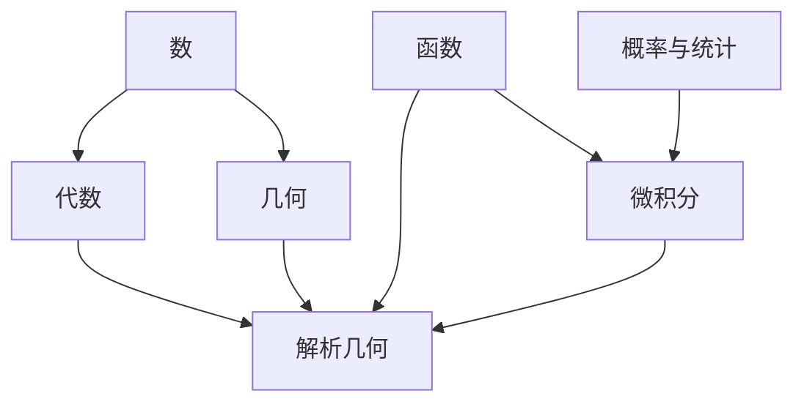

                 

### 文章标题

**数学教育与创客空间的结合**

### 关键词

数学教育、创客空间、项目式学习、问题解决、创新思维、实践应用

### 摘要

本文探讨了数学教育与创客空间的结合，分析了两者的定义、背景、重要性以及具体应用。文章首先概述了数学教育的基本理念、目标、现状和存在的问题，接着介绍了创客空间的概念、特点和发展历程。在此基础上，文章分析了数学教育中可以融入的创客元素，并详细探讨了创客空间在数学教育中的应用案例。此外，文章还介绍了如何将创客空间的方法应用于数学教育中，提供了具体的案例分析。最后，文章讨论了数学教育与创客空间结合面临的挑战和未来的发展趋势。本文旨在为教育工作者、创客空间管理者及相关领域研究者提供参考和启示。

### 目录

1. 引言
   1.1 数学教育与创客空间的结合定义
   1.2 数学教育与创客空间的重要性

2. 数学教育概述
   2.1 数学教育的基本理念
   2.2 数学教育的目标
   2.3 数学教育的现状与问题

3. 创客空间概述
   3.1 创客空间的概念
   3.2 创客空间的特点
   3.3 创客空间的发展历程

4. 数学教育中的创客元素
   4.1 项目式学习
   4.2 动手实践
   4.3 问题解决

5. 创客空间在数学教育中的应用
   5.1 创客空间在数学教育中的具体应用案例
   5.2 创客空间与数学教学活动设计

6. 数学教育方法与创客空间的结合
   6.1 创客空间教学方法在数学教育中的应用
   6.2 开发数学创客课程

7. 案例分析
   7.1 案例分析一：某学校数学创客课程实施情况
   7.2 案例分析二：某地区数学教育与创客空间结合的实践经验

8. 挑战与展望
   8.1 数学教育与创客空间结合的挑战
   8.2 数学教育与创客空间结合的未来发展趋势

### 第1章 引言

随着科技的飞速发展，教育领域正面临着前所未有的变革。传统的教学模式已经无法满足现代学生的需求，创新教育理念和教育模式应运而生。其中，数学教育与创客空间的结合成为了备受关注的话题。本文将从以下几个方面进行探讨：首先，介绍数学教育与创客空间的结合定义和重要性；其次，概述数学教育的基本理念、目标、现状与问题；接着，介绍创客空间的概念、特点和发展历程；然后，分析数学教育中可以融入的创客元素；随后，详细探讨创客空间在数学教育中的应用案例；之后，介绍如何将创客空间的方法应用于数学教育中；接着，通过具体案例分析数学教育与创客空间结合的效果；最后，讨论数学教育与创客空间结合面临的挑战和未来的发展趋势。

数学教育是指通过数学的学习和探究，培养学生的数学思维能力、解决问题的能力和创新意识。创客空间则是一个提供动手实践、创新探索的平台，鼓励学生自主学习和合作学习。数学教育与创客空间的结合，旨在将数学知识与实践相结合，培养学生的创新能力和解决问题的能力。

本章首先介绍数学教育与创客空间的结合定义和重要性。接下来，将分别对数学教育和创客空间进行概述，分析两者之间的关系和联系。在此基础上，进一步探讨数学教育中的创客元素，以及创客空间在数学教育中的应用案例。通过这些分析，我们可以更好地理解数学教育与创客空间结合的必要性和意义，为后续章节的内容奠定基础。

#### 1.1 数学教育与创客空间的结合定义

数学教育与创客空间的结合，指的是将数学学习的理论与创客空间的实践相结合，通过动手操作和项目式学习，促进学生的数学思维和创新能力发展的教育模式。这种结合不仅强调数学知识的传授，更注重学生在实际操作中体验数学、应用数学，从而加深对数学概念的理解和运用。

数学教育，传统的数学教学更注重知识的传授和技能的掌握，强调公式、定理的记忆和运算能力的培养。然而，现代教育理念认为，数学学习不仅仅是抽象的符号和计算，更是理解世界、解决实际问题的工具。因此，数学教育需要更加注重学生的思考过程、问题解决能力和创新能力的培养。

创客空间，创客空间则是一个集创作、实践、分享于一体的开放环境，通常配备有各种工具、材料和技术设备。创客空间强调学生的自主探究、动手实践和团队合作，鼓励学生在解决实际问题的过程中发挥创造力和创新能力。

数学教育与创客空间的结合，具体表现在以下几个方面：

1. **项目式学习**：数学教育中的项目式学习，是指以实际项目为驱动，让学生在解决实际问题的过程中，运用数学知识和技能。这种学习模式有助于提高学生的实际操作能力和问题解决能力。

2. **动手实践**：创客空间的动手实践，为学生提供了探索和验证数学知识的机会。学生在动手操作中，可以更加直观地理解数学概念，加深对知识的理解和记忆。

3. **问题解决**：数学教育中的问题解决，强调学生在面对实际问题时，运用数学知识和方法进行思考和解决。创客空间为学生提供了一个真实的情境，让学生在解决实际问题的过程中，锻炼自己的问题解决能力。

4. **合作学习**：创客空间强调团队合作，学生在合作中相互学习、共同进步。这种合作学习模式有助于培养学生的团队合作能力和沟通能力。

通过数学教育与创客空间的结合，可以实现以下目标：

1. 提高学生的数学思维能力：通过项目式学习和动手实践，学生可以在实际操作中体验数学、理解数学，从而提高数学思维能力。

2. 培养学生的创新能力：创客空间为学生提供了一个开放、自由的探索环境，鼓励学生在解决问题时进行创新思考，培养学生的创新能力。

3. 增强学生的实际操作能力：通过动手实践，学生可以学会使用各种工具和设备，提高实际操作能力。

4. 提高学生的团队合作能力：在创客空间中，学生需要与他人合作，共同完成任务。这种合作学习模式有助于培养学生的团队合作能力和沟通能力。

总之，数学教育与创客空间的结合，是一种新型的教育模式，有助于提高学生的数学素养和创新能力，为培养未来的人才奠定基础。

#### 1.2 数学教育与创客空间的重要性

数学教育与创客空间的结合具有重要意义，这种结合不仅有助于提高学生的数学素养和创新能力，还能够促进教育模式的变革，培养适应未来社会需求的人才。

首先，数学教育对于培养学生的逻辑思维、抽象思维和解决问题的能力具有重要意义。数学不仅是自然科学的基础，也是工程、经济、管理等领域的重要工具。通过数学教育，学生可以学会运用数学思维和方法分析问题、解决问题，提高逻辑推理能力和抽象思维能力。创客空间则提供了一个动手实践的平台，让学生在探索和验证数学知识的过程中，更深刻地理解数学概念，提高数学思维能力。

其次，创客空间为学生提供了创新能力的培养环境。在创客空间中，学生可以自由探索、实验和创造，发挥自己的创造力和创新能力。数学教育与创客空间的结合，可以将数学知识与实际应用相结合，激发学生的创新思维，培养创新型人才。

此外，数学教育与创客空间的结合有助于提高学生的实际操作能力和团队合作能力。在创客空间中，学生需要学会使用各种工具和设备，这有助于提高他们的实际操作能力。同时，创客空间强调团队合作，学生在合作中可以学会与他人沟通、协作，提高团队合作能力。

最后，数学教育与创客空间的结合有助于促进教育模式的变革。传统的教育模式注重知识的传授，而创客空间强调学生的自主学习和探索。通过数学教育与创客空间的结合，可以推动教育模式的变革，实现从以教师为中心的传统教育模式向以学生为中心的新型教育模式的转变。

总之，数学教育与创客空间的结合具有重要意义，它不仅有助于提高学生的数学素养和创新能力，还能够促进教育模式的变革，培养适应未来社会需求的人才。随着教育理念的不断更新和发展，数学教育与创客空间的结合将越来越受到重视，为培养创新型人才提供有力支持。

### 第2章 数学教育概述

数学教育是培养学生数学素养、逻辑思维和创新能力的重要途径。本章将详细探讨数学教育的基本理念、目标、现状和存在的问题。

#### 2.1 数学教育的基本理念

数学教育的基本理念包括以下几个方面：

1. **数学素养的全面培养**：数学教育不仅关注学生对数学知识的掌握，更注重培养学生的数学思维能力、数学语言表达能力和数学应用能力。

2. **学生主体的参与**：数学教育强调学生的主动参与和自主学习，鼓励学生在探索和解决问题的过程中，主动思考、合作交流。

3. **实践与应用的结合**：数学教育强调将数学知识应用于实际生活中，通过实际问题引导学生运用数学知识解决问题，提高学生的实际操作能力。

4. **过程与结果的并重**：数学教育不仅关注学生的学习结果，更注重学生在学习过程中的思考、探究和发现，培养学生的创新意识和解决问题的能力。

5. **多元评价与激励**：数学教育提倡多元化的评价方式，鼓励学生积极参与数学活动，通过过程性评价和激励性评价，提高学生的学习兴趣和自信心。

#### 2.2 数学教育的目标

数学教育的目标可以分为以下几个方面：

1. **知识目标**：使学生掌握基本的数学知识和技能，包括数学概念、定理、公式和运算方法。

2. **能力目标**：培养学生运用数学知识解决问题的能力，包括逻辑推理能力、抽象思维能力、数据分析能力和问题解决能力。

3. **情感目标**：激发学生对数学的兴趣，培养学生的好奇心和探究精神，提高学生的数学学习兴趣和自信心。

4. **价值观目标**：培养学生正确的数学观和科学价值观，培养学生的严谨态度和科学精神，使学生能够理性地看待数学和科学问题。

#### 2.3 数学教育的现状与问题

尽管数学教育的基本理念和目标明确，但在实际教学中仍存在一些问题：

1. **教学模式单一**：传统的教学模式以教师为中心，注重知识传授，忽视学生的主体地位和自主学习能力的培养。

2. **教学内容陈旧**：数学教育内容相对固定，难以跟上时代的发展，导致学生缺乏实践应用的机会，难以激发学生的学习兴趣。

3. **教学方法不当**：部分教师教学方法单一，缺乏创新性，难以激发学生的学习热情和积极性。

4. **评价方式单一**：传统的评价方式过于注重考试成绩，忽视学生的过程性表现和实际能力，导致学生产生应试压力。

5. **教育资源分配不均**：城乡教育资源分配不均，导致农村地区学生的数学教育质量相对较低。

为解决这些问题，需要从以下几个方面进行改进：

1. **改革教学模式**：推行以学生为中心的教学模式，注重培养学生的自主学习能力和团队合作精神。

2. **更新教学内容**：结合实际生活和社会需求，更新数学教育内容，增加实践应用环节。

3. **创新教学方法**：采用多元化的教学方法，如项目式学习、探究式学习、合作学习等，激发学生的学习兴趣和积极性。

4. **完善评价体系**：建立多元化的评价体系，注重过程性评价和激励性评价，全面衡量学生的数学素养和实际能力。

5. **优化教育资源分配**：加大教育投入，优化城乡教育资源分配，提高农村地区的数学教育质量。

通过以上改进措施，可以进一步提高数学教育的质量和效果，为培养具有数学素养和创新能力的现代化人才奠定坚实基础。

#### 2.4 数学教育中的核心概念与联系

在数学教育中，核心概念与联系构成了数学知识体系的基础，也是学生理解和应用数学的关键。以下是数学教育中的几个核心概念及其相互之间的联系：

**1. 数的概念**：数是数学中最基本的概念，包括自然数、整数、分数、小数、实数等。这些数构成了数学运算的基础，如加法、减法、乘法和除法。

**2. 几何学**：几何学研究平面和空间中的形状、大小和位置关系。核心概念包括点、线、面、多边形、圆、三角形等。

**3. 函数**：函数是描述变量之间关系的一种数学工具，核心概念包括定义域、值域、单调性、奇偶性等。函数在数学中具有广泛的应用，如解析几何、微积分等。

**4. 代数**：代数研究数、运算和方程。核心概念包括代数表达式、方程、不等式、代数系统等。代数是数学的基础，广泛应用于科学和工程领域。

**5. 概率与统计**：概率与统计研究随机事件的发生规律和数据的分析。核心概念包括概率分布、期望、方差、相关系数等。

**6. 解析几何**：解析几何利用代数方法研究几何问题，核心概念包括坐标系、向量、矩阵等。

**7. 微积分**：微积分研究函数的变化率和面积等问题，核心概念包括导数、积分、微分方程等。

这些核心概念之间的联系构成了数学知识体系的整体架构：

- **数与代数**：数是代数的基础，代数运算和方程解决依赖于数的概念。

- **几何与函数**：几何研究形状和位置，函数描述变量之间的关系，两者相互补充。

- **函数与微积分**：函数是微积分的研究对象，微积分研究函数的变化率和积分，为函数研究提供了强有力的工具。

- **概率与统计**：概率与统计为数学建模提供了方法，广泛应用于各种实际问题中。

- **解析几何**：解析几何将代数方法应用于几何问题，为解决几何问题提供了新的视角。

以下是一个Mermaid流程图，展示了这些核心概念之间的联系：

通过理解这些核心概念之间的联系，学生可以更好地掌握数学知识，提高数学思维能力。同时，教师也可以在设计教学活动时，将这些概念有机地结合起来，使学生能够在实际应用中更好地理解和运用数学知识。

#### 2.5 数学教育方法与创客空间的结合

将创客空间的方法应用于数学教育，可以极大地提升学生的学习兴趣和动手能力，培养他们的创新思维和问题解决能力。以下是一些具体的数学教育方法与创客空间的结合方式：

1. **项目式学习**：

项目式学习（Project-Based Learning, PBL）是一种以项目为核心，让学生通过实际操作和问题解决进行学习的方法。在数学教育中，教师可以设计一些与数学知识相关的项目，让学生在项目中运用数学原理和技能。

**示例**：设计一个“制作数学模型”的项目，让学生选择一个他们感兴趣的数学问题，如几何图形、统计分布等，然后制作一个物理模型或数字模型来表示这个问题。学生在制作模型的过程中，需要运用几何、代数、统计等数学知识，这不仅加深了对数学概念的理解，还培养了他们的动手能力和创新思维。

2. **探究式学习**：

探究式学习（Inquiry-Based Learning, IBL）是一种以问题为导向，引导学生主动探索和发现知识的学习方法。在创客空间中，教师可以提出一些开放性问题，鼓励学生通过实验和探究来寻找答案。

**示例**：教师可以提出“如何优化交通流”的问题，让学生通过实地调研、数据收集和分析，运用概率和统计知识来提出解决方案。学生在探究过程中，不仅提高了数学应用能力，还锻炼了团队合作和沟通能力。

3. **合作学习**：

合作学习（Cooperative Learning）强调学生之间的合作与互助，通过小组活动共同完成任务。在创客空间中，学生可以组成小组，共同完成数学相关的项目或实验。

**示例**：教师可以组织一个“设计数学游戏”的小组项目，每个小组需要设计一款数学游戏，游戏需要包含一定的数学知识，如概率、几何等。小组成员需要分工合作，从游戏设计、编程到测试和优化，整个过程需要充分利用数学知识和创客工具。

4. **跨学科学习**：

跨学科学习（Interdisciplinary Learning）将数学与其他学科相结合，通过综合性的项目或课程，让学生在不同学科的知识体系中理解数学的应用。

**示例**：教师可以设计一个“科技与数学”的课程，将数学与物理、工程、计算机科学等领域结合，让学生通过实际项目来探索数学在各个领域中的应用。例如，设计一个基于物理原理的机器人，需要运用数学进行运动规划和路径优化。

5. **数字化学习**：

数字化学习利用计算机和互联网技术，提供丰富的学习资源和交互式学习环境。在创客空间中，教师可以利用数字化工具，如数学软件、编程平台等，让学生在虚拟环境中进行数学探索和实践。

**示例**：教师可以引导学生使用数学软件如GeoGebra或Python编程，进行几何图形的绘制和动态分析，或者通过编程实现数学算法。这样的数字化学习不仅提高了学生的数学技能，还培养了他们的编程能力。

通过将创客空间的方法应用于数学教育，教师可以设计出更多富有创意和挑战性的学习活动，激发学生的学习兴趣和主动性，培养他们的创新思维和实际问题解决能力。

### 第3章 创客空间概述

创客空间（Maker Space）是一个集创作、实践、分享于一体的开放环境，旨在为学生们提供动手实践、创新探索的平台。本章将详细介绍创客空间的概念、特点和发展历程，以及其在教育中的应用。

#### 3.1 创客空间的概念

创客空间，也被称为创客实验室或创客中心，是一种以学生为中心的学习环境，配备有各种工具、材料和设备，鼓励学生通过动手实践和合作学习来探索和解决问题。创客空间强调学生的自主性和创造力，鼓励他们将想法变为现实。

#### 3.2 创客空间的特点

1. **开放性和自主性**：创客空间为学生提供了一个自由探索的环境，学生可以按照自己的兴趣和需求选择项目，自主学习和实践。

2. **多样性**：创客空间配备了各种工具和设备，如3D打印机、激光切割机、电子设备、编程工具等，这些工具可以用于制作各种项目，从物理模型到电子设备，从软件应用到硬件创新。

3. **跨学科融合**：创客空间鼓励学生将不同学科的知识结合起来，如数学、物理、计算机科学、工程等，通过综合性的项目来提高学生的综合素质。

4. **问题导向**：创客空间以问题为导向，学生通过解决实际问题来学习和应用知识，这种问题解决过程有助于培养学生的创新思维和问题解决能力。

5. **合作学习**：创客空间强调团队合作，学生需要与他人合作完成任务，这有助于培养学生的团队合作能力和沟通能力。

6. **持续迭代**：创客空间鼓励学生不断尝试和改进，通过多次迭代来完善项目，这种持续迭代的过程有助于培养学生的耐心和毅力。

#### 3.3 创客空间的发展历程

创客空间的起源可以追溯到20世纪70年代的“DIY”文化和“黑客文化”，这些文化强调自主创造和个人技能的培养。随着信息技术和数字制造技术的发展，创客运动在21世纪初迅速兴起，成为一个全球性的现象。

1. **初始阶段（2005年之前）**：在这个阶段，创客活动主要是个体化的，一些科技爱好者通过个人兴趣和技能创造了一些创新项目。

2. **社区形成阶段（2005-2010年）**：随着互联网的发展，创客社区开始形成，人们通过在线平台分享创客经验和项目，相互学习和交流。

3. **创客空间兴起阶段（2010年至今）**：在这个阶段，创客空间作为一种新型的教育模式逐渐普及，各种形式的创客空间在世界各地建立起来，为学生们提供了实践和创新的平台。

#### 3.4 创客空间在教育中的应用

创客空间在教育中的应用主要体现在以下几个方面：

1. **项目式学习**：创客空间为学生提供了实际的项目，学生通过项目来完成学习任务，这种项目式学习模式有助于提高学生的动手能力和问题解决能力。

2. **跨学科教学**：创客空间鼓励学生将不同学科的知识结合起来，通过综合性项目来提高学生的综合素质。

3. **创新能力培养**：创客空间提供了一个自由探索的环境，学生可以通过实践和实验来培养创新思维和创造力。

4. **团队合作**：创客空间强调团队合作，学生需要与他人合作完成任务，这有助于培养学生的团队合作能力和沟通能力。

5. **数字化教学**：创客空间配备了各种数字化工具和设备，如3D打印机、编程平台等，这些工具有助于提高学生的数字化技能和创新能力。

总之，创客空间作为一种新型的教育模式，正在逐渐改变传统的教学方式，为学生提供了一个充满创意和挑战的学习环境。

### 第4章 数学教育中的创客元素

在数学教育中融入创客元素，可以大大提升学生的参与度和学习兴趣，同时培养学生的创新能力和实践能力。以下将详细探讨数学教育中的几个关键创客元素：项目式学习、动手实践和问题解决。

#### 4.1 项目式学习

项目式学习（Project-Based Learning, PBL）是一种以学生为中心的教学方法，通过完成实际项目来推动学习。在数学教育中，项目式学习可以帮助学生将抽象的数学概念与实际应用相结合。

**示例**：设计一个“城市规划”项目，让学生根据给定的城市地图，运用几何知识来规划道路、建筑和公园。这个项目不仅要求学生掌握几何知识，还需要他们进行测量、计算和设计，从而提高他们的实践能力和问题解决能力。

**核心原则**：
1. **学生主导**：项目的设计和执行过程应主要由学生主导，鼓励他们提出问题、制定计划、实施行动和评估结果。
2. **真实性问题**：选择与学生的生活实际相关的问题，使学生在解决真实问题的过程中应用数学知识。
3. **跨学科整合**：将数学与其他学科（如物理、计算机科学、工程等）结合起来，促进学生的全面发展。

#### 4.2 动手实践

动手实践是创客教育的核心，通过实际操作，学生可以更直观地理解数学概念和应用。

**示例**：在“几何探索”课程中，学生可以动手制作几何模型，如正方体、球体和锥体。在制作模型的过程中，学生不仅学习了几何形状的定义和特性，还通过测量和计算来验证数学公式。

**核心原则**：
1. **工具使用**：提供各种工具和材料，如测量工具、切割工具、黏合剂等，让学生有机会动手操作。
2. **探索性学习**：鼓励学生通过实验和探索来发现数学规律，而不是仅仅依赖书本知识。
3. **项目化实践**：设计项目化的实践任务，让学生在完成项目的过程中应用数学知识。

#### 4.3 问题解决

问题解决是数学教育的重要目标之一，创客教育通过实际问题的解决，帮助学生培养逻辑思维和解决实际问题的能力。

**示例**：设计一个“数学游戏开发”项目，让学生开发一款基于数学原理的游戏。学生需要运用代数、几何、概率等数学知识来设计游戏规则和界面。

**核心原则**：
1. **问题驱动**：选择具有挑战性和趣味性的问题，激发学生的思考和解决问题的兴趣。
2. **跨学科应用**：鼓励学生在解决问题时，综合运用不同学科的知识和技能。
3. **合作学习**：通过小组合作，让学生在讨论和协作中共同解决问题，培养团队合作能力。

通过融入项目式学习、动手实践和问题解决，数学教育可以变得更加生动和有趣，从而激发学生的数学学习兴趣，提升他们的数学素养和实践能力。

### 第5章 创客空间在数学教育中的应用

创客空间在数学教育中的应用具有显著的优势，能够有效地激发学生的学习兴趣，提高他们的动手能力和创新意识。以下将详细探讨创客空间在数学教育中的具体应用案例，以及创客空间与数学教学活动设计的结合方式。

#### 5.1 创客空间在数学教育中的具体应用案例

**案例一：几何模型制作**

在几何模型制作活动中，学生通过实际操作来理解和应用几何知识。教师可以提供不同类型的几何模具和材料，如纸张、木条、塑料球等，让学生制作各种几何形状的模型，如正方体、球体、圆锥体等。在制作模型的过程中，学生需要测量、计算和剪裁，从而加深对几何概念的理解。

**活动步骤**：
1. 教师介绍几何模型的基本概念和制作方法。
2. 学生分组，讨论并选择要制作的几何模型。
3. 学生根据设计方案，使用工具和材料制作模型。
4. 学生展示并分享他们的模型，讨论制作过程中的问题和心得。

**案例效果**：通过动手制作几何模型，学生不仅能够直观地理解几何概念，还能培养他们的空间感知能力和动手操作能力。

**案例二：数学游戏开发**

数学游戏开发活动将数学知识与游戏设计相结合，让学生在游戏开发过程中运用数学知识。教师可以提供游戏开发工具，如编程软件、游戏引擎等，让学生开发基于数学原理的游戏，如数独游戏、逻辑推理游戏等。

**活动步骤**：
1. 教师介绍数学游戏的基本原理和开发方法。
2. 学生分组，讨论并设计自己的数学游戏。
3. 学生使用编程工具开发游戏，编写游戏规则和算法。
4. 学生测试并优化游戏，分享开发经验和心得。

**案例效果**：通过数学游戏开发，学生能够将数学知识应用到实际项目中，培养他们的编程能力和创新思维。

**案例三：数据分析与可视化**

数据分析与可视化活动利用数据分析和可视化工具，让学生探索和解释数学现象。教师可以提供数据分析软件，如Python、R等，让学生处理和分析数据，并通过图表、图像等可视化工具来展示分析结果。

**活动步骤**：
1. 教师介绍数据分析的基本概念和工具。
2. 学生分组，选择数据集进行分析。
3. 学生使用数据分析工具处理数据，提取有用信息。
4. 学生使用可视化工具展示分析结果，撰写分析报告。

**案例效果**：通过数据分析与可视化活动，学生能够提高他们的数据处理和分析能力，同时培养他们的科学探究精神和批判性思维能力。

#### 5.2 创客空间与数学教学活动设计的结合方式

1. **项目驱动**：创客空间可以成为数学教学活动的项目基地，教师可以设计一系列基于项目的数学活动，让学生通过项目实践来学习和应用数学知识。

2. **工具支持**：创客空间配备了各种工具和设备，如3D打印机、激光切割机、编程工具等，这些工具可以支持数学教学活动的设计和实施。

3. **跨学科整合**：创客空间鼓励跨学科整合，教师可以在数学教学活动中融入其他学科的知识，如计算机科学、工程、物理等，提高学生的综合素质。

4. **合作学习**：创客空间提供了一个合作学习的环境，教师可以设计小组活动，让学生在合作中共同完成数学任务，培养他们的团队合作能力。

5. **个性化学习**：创客空间允许学生根据自己的兴趣和需求选择项目，教师可以根据学生的兴趣点来设计个性化学习方案，提高他们的学习动机和效果。

通过创客空间的引入和应用，数学教育可以变得更加生动、有趣和具有挑战性，从而激发学生的学习兴趣，提高他们的数学素养和实践能力。

### 第6章 数学教育方法与创客空间的结合

将创客空间的方法应用于数学教育，不仅能够激发学生的学习兴趣，还能有效提升他们的动手能力、创新思维和问题解决能力。以下将详细介绍如何将创客空间的教学方法应用于数学教育，并探讨开发数学创客课程的方法。

#### 6.1 创客空间教学方法在数学教育中的应用

**1. 项目驱动学习**

项目驱动学习（Project-Based Learning, PBL）是一种以项目为核心的学习方法，通过完成实际项目来推动学习。在数学教育中，教师可以设计一系列数学项目，让学生通过项目实践来学习和应用数学知识。

**示例**：设计一个“城市交通规划”项目，学生需要利用几何和代数知识来规划城市道路系统，优化交通流量。学生需要收集数据、分析交通模式、设计道路网络，并通过模型验证方案的合理性。这种项目式学习不仅帮助学生理解和应用数学知识，还培养了他们的团队合作和问题解决能力。

**2. 探究式学习**

探究式学习（Inquiry-Based Learning, IBL）是一种以问题为导向的学习方法，鼓励学生主动探索和发现知识。在创客空间中，教师可以提出开放性问题，引导学生通过实验和探究来寻找答案。

**示例**：教师可以提出“如何优化班级座位布局”的问题，学生需要通过测量、数据分析和建模来找到最佳座位布局。在探究过程中，学生需要运用几何、代数和概率等数学知识，培养他们的探究精神和科学思维。

**3. 合作学习**

合作学习（Cooperative Learning）强调学生之间的合作与互助，通过小组活动共同完成任务。在创客空间中，学生可以组成小组，共同完成数学相关的项目或实验。

**示例**：设计一个“数学游戏开发”项目，学生需要分组合作，设计并开发一款基于数学原理的游戏。每个小组需要分工合作，从游戏设计、编程到测试和优化，整个过程需要充分利用数学知识和创客工具。这种合作学习模式有助于培养学生的团队合作能力和沟通能力。

**4. 数字化学习**

数字化学习利用计算机和互联网技术，提供丰富的学习资源和交互式学习环境。在创客空间中，教师可以利用数字化工具，如数学软件、编程平台等，让学生在虚拟环境中进行数学探索和实践。

**示例**：教师可以引导学生使用数学软件如GeoGebra或Python编程，进行几何图形的绘制和动态分析，或者通过编程实现数学算法。这样的数字化学习不仅提高了学生的数学技能，还培养了他们的编程能力。

#### 6.2 开发数学创客课程的方法

开发数学创客课程需要综合考虑教学内容、教学方法和教学环境，以下是一些建议：

**1. 确定课程目标**

课程目标应明确学生的学习目标和期望成果。例如，通过数学创客课程，学生应掌握基本的数学知识，提高动手操作能力，培养创新思维和团队合作能力。

**2. 选择合适的教学内容**

选择与创客空间相结合的数学教学内容，如几何、代数、概率、统计等。教学内容应具有挑战性，能够激发学生的兴趣和探索欲望。

**3. 设计项目式学习活动**

设计一系列项目式学习活动，将数学知识与实际应用相结合。每个项目应包含明确的学习目标、具体的任务和评价标准。

**4. 融入跨学科知识**

在数学创客课程中，融入其他学科的知识，如物理、工程、计算机科学等，提高学生的综合素质和创新能力。

**5. 利用数字化工具**

利用数字化工具和平台，如编程软件、数学软件等，为学生提供丰富的学习资源和实践机会。

**6. 设计多样化的评价方式**

采用多样化的评价方式，如过程性评价、项目展示、同伴评价等，全面衡量学生的学习成果。

**7. 考虑教学环境的布置**

创客空间的教学环境应具备开放性、灵活性和互动性，提供足够的工具和材料，为学生提供自由探索和合作的空间。

通过以上方法，可以开发出具有创新性和实用性的数学创客课程，为学生的数学学习提供新的动力和体验。

### 第7章 案例分析

#### 7.1 案例分析一：某学校数学创客课程实施情况

某学校在数学教育中引入了创客空间，实施了一门名为“数学创新实验室”的创客课程。该课程旨在通过项目式学习和探究式学习，培养学生的数学思维和创新能力。

**课程背景**：该校的创客空间配备了各种工具和设备，如3D打印机、激光切割机、编程平台等，为学生提供了一个自由探索和创新的环境。

**课程目标**：通过项目式学习和探究式学习，学生应能够：
1. 掌握基本的数学知识和技能。
2. 提高动手操作能力和创新思维。
3. 培养团队合作和问题解决能力。

**课程实施过程**：
1. **项目设计**：教师根据学生的兴趣和数学知识点，设计了多个项目，如几何模型制作、数学游戏开发、数据分析与可视化等。

2. **项目启动**：教师向学生介绍项目背景和目标，引导学生分组，讨论并确定各自的角色和任务。

3. **项目实施**：学生在创客空间中，通过实际操作和实验，完成项目任务。教师提供指导和支持，确保学生能够顺利完成项目。

4. **项目展示**：学生完成项目后，进行项目展示和汇报，教师和同学对项目进行评价和反馈。

**课程效果**：
1. **学习兴趣提升**：学生通过实际操作和项目体验，对数学产生了浓厚的兴趣。
2. **数学能力提升**：学生在项目实施过程中，运用数学知识解决实际问题，提高了数学思维能力。
3. **创新能力培养**：学生在项目设计和实施过程中，不断尝试和改进，培养了创新能力和问题解决能力。
4. **团队合作能力提升**：学生在小组合作中，学会了沟通和协作，提高了团队合作能力。

**总结**：通过数学创客课程的实施，该校有效地将数学知识与实际应用相结合，激发了学生的学习兴趣，培养了他们的创新思维和团队合作能力。

#### 7.2 案例分析二：某地区数学教育与创客空间结合的实践经验

某地区教育局在数学教育中推广了创客空间的建设和应用，多个学校实施了数学教育与创客空间结合的教学实践。

**背景**：该地区教育局认识到创客教育在培养学生创新能力方面的优势，决定在多个学校建立创客空间，并将数学教育与创新实践相结合。

**实践过程**：
1. **创客空间建设**：教育局为每个学校提供了创客空间的建设经费，配备了各种创客工具和设备，如3D打印机、激光切割机、编程平台等。

2. **教师培训**：教育局组织教师参加创客教育和数学教育的培训，提高教师对创客空间的理解和应用能力。

3. **课程设计**：教师结合数学教学大纲和创客空间的特点，设计了一系列数学创客课程，如数学模型制作、数学游戏开发、数据分析与可视化等。

4. **教学实施**：教师将创客课程纳入数学教学计划，学生通过参与创客课程，将数学知识与实际应用相结合。

5. **评估与反馈**：教育局对学校的创客教育实践进行定期评估，收集教师和学生的反馈，不断优化教学方案。

**实践效果**：
1. **学生兴趣提升**：学生通过参与创客课程，对数学产生了浓厚的兴趣，数学成绩显著提升。

2. **创新能力培养**：学生在创客课程中，通过项目式学习和探究式学习，培养了创新思维和问题解决能力。

3. **团队合作能力提升**：学生在小组合作中，学会了沟通和协作，提高了团队合作能力。

4. **教学效果提升**：教师通过创客空间的教学实践，教学效果显著提升，教学方法更加丰富多样。

**总结**：通过数学教育与创客空间结合的实践，该地区成功地将数学知识与实际应用相结合，激发了学生的学习兴趣，培养了他们的创新能力，提升了教学效果。

通过以上两个案例分析，我们可以看到，数学教育与创客空间的结合在实践中取得了显著效果，不仅提高了学生的数学素养和创新能力，也推动了教育模式的创新和发展。

### 第8章 挑战与展望

#### 8.1 数学教育与创客空间结合的挑战

尽管数学教育与创客空间的结合在理论研究和实际应用中取得了显著成果，但在实施过程中仍面临一些挑战：

1. **资源不足**：创客空间需要配备各种先进的工具和设备，如3D打印机、激光切割机、编程平台等。然而，由于经费和设备采购的限制，许多学校难以满足创客空间的基本需求。

2. **教师培训**：创客教育对教师的教学能力和技术应用能力提出了更高要求。然而，目前许多教师缺乏创客教育的专业知识和实践技能，需要通过培训来提升。

3. **教学整合**：将创客空间的方法应用于数学教育，需要教师对数学教学内容进行重新设计，确保创客活动与数学知识紧密结合。这需要教师具备创新思维和课程设计能力。

4. **学生差异**：学生的兴趣、能力和背景各不相同，如何确保每个学生都能在创客空间中获得适合自己的学习体验，是教师面临的挑战之一。

5. **评价体系**：传统的评价体系难以全面衡量学生在创客空间中的学习成果，需要建立新的评价体系，更准确地评估学生的数学素养和创新能力的提升。

#### 8.2 数学教育与创客空间结合的未来发展趋势

尽管面临挑战，数学教育与创客空间的结合在未来仍具有广阔的发展前景：

1. **政策支持**：随着教育部门对创新教育重视程度的提高，未来有望得到更多政策支持和经费投入，为创客空间的建设和应用提供保障。

2. **教师培训**：随着教师培训体系的不断完善，越来越多的教师将具备创客教育的专业知识和实践技能，推动创客教育在数学教育中的广泛应用。

3. **技术进步**：随着数字制造、物联网、人工智能等技术的不断进步，创客空间将配备更多先进的工具和设备，为学生提供更多创新实践的机会。

4. **课程创新**：教师将不断探索和创新，设计出更多具有挑战性和趣味性的数学创客课程，满足不同层次学生的学习需求。

5. **跨学科融合**：数学教育与创客空间的结合将推动数学与其他学科的深度融合，培养学生综合运用多学科知识解决问题的能力。

6. **评价体系的完善**：随着教育评价体系的不断完善，将能够更全面、准确地评估学生在创客空间中的学习成果，为学生的全面发展提供科学依据。

总之，数学教育与创客空间的结合是一个富有前景和挑战的领域，随着政策、技术、课程和评价体系的不断优化，将为学生提供更加丰富和多样的学习体验，培养具有创新能力和实践能力的高素质人才。

### 总结

数学教育与创客空间的结合，不仅为数学教育带来了新的活力，也为学生的创新能力和实践能力的培养提供了广阔平台。通过项目式学习、动手实践和问题解决，学生能够在真实的情境中体验数学、应用数学，从而加深对数学概念的理解和运用。

本文从数学教育与创客空间的结合定义、重要性、数学教育概述、创客空间概述、数学教育中的创客元素、创客空间在数学教育中的应用、数学教育方法与创客空间的结合、案例分析以及挑战与展望等方面进行了详细探讨。通过分析，我们可以看到，数学教育与创客空间的结合具有以下几个方面的意义：

1. **提升数学素养**：通过项目式学习和动手实践，学生能够更好地理解数学概念，提高数学思维能力。

2. **培养创新能力**：创客空间为学生提供了一个自由探索和创新的环境，有助于培养学生的创新意识和创新能力。

3. **增强实践能力**：通过实际操作和问题解决，学生能够提高动手能力和解决实际问题的能力。

4. **促进跨学科融合**：数学教育与创客空间的结合，促进了数学与其他学科的深度融合，为学生提供了更广阔的视野。

5. **推动教育模式变革**：创客教育的引入，为传统教育模式带来了变革，推动了以学生为中心的新型教育模式的实施。

然而，数学教育与创客空间的结合也面临着一些挑战，如资源不足、教师培训、教学整合等。为了克服这些挑战，我们需要：

1. **加大政策支持**：教育部门应加大对创客教育的政策支持和经费投入，为创客空间的建设和应用提供保障。

2. **加强教师培训**：通过定期培训和研讨会，提高教师对创客教育的理解和应用能力，推动创客教育在数学教育中的广泛应用。

3. **优化课程设计**：教师应根据学生的兴趣和需求，设计具有挑战性和趣味性的数学创客课程，确保创客活动与数学知识紧密结合。

4. **完善评价体系**：建立新的评价体系，全面、准确地评估学生在创客空间中的学习成果，为学生的全面发展提供科学依据。

未来，随着政策、技术、课程和评价体系的不断完善，数学教育与创客空间的结合将为学生提供更加丰富和多样的学习体验，培养具有创新能力和实践能力的高素质人才。

### 最佳实践 Tips

1. **项目驱动学习**：设计有趣且具有挑战性的项目，让学生在解决实际问题的过程中学习数学知识。确保项目与学生的兴趣和日常生活紧密相关，以提高他们的参与度和积极性。

2. **合作学习**：鼓励学生组成小组，共同完成数学创客项目。通过团队合作，学生不仅可以互相学习，还能培养沟通能力和解决问题的能力。

3. **多样化评价**：采用过程性评价、项目展示和同伴评价等多种评价方式，全面评估学生在数学创客课程中的表现和进步。

4. **资源整合**：充分利用学校和社会资源，如图书馆、科技馆、企业合作伙伴等，为学生提供更多的学习机会和实践平台。

5. **教师培训**：定期组织教师参加创客教育和数学教育的专业培训，提升他们的教学能力和创新思维。

6. **鼓励创新**：在创客课程中，鼓励学生大胆尝试和实验，不怕失败，从失败中学习和成长。

7. **注重反馈**：及时给予学生反馈，帮助他们了解自己的优点和不足，指导他们如何改进和提高。

通过以上最佳实践，可以有效提升数学创客课程的教学效果，培养具有创新能力和实践能力的学生。

### 小结

本文详细探讨了数学教育与创客空间的结合，分析了其重要性、基本理念、现状、核心概念与联系、教学方法与实际应用。通过项目式学习、动手实践和问题解决，创客空间为数学教育注入了新的活力，有效提升了学生的数学素养、创新能力和实践能力。

本文还提出了数学教育与创客空间结合面临的挑战，如资源不足、教师培训等，并提出了相应的对策建议。未来，随着政策、技术、课程和评价体系的不断完善，数学教育与创客空间的结合将为学生提供更加丰富和多样的学习体验，为培养具有创新能力和实践能力的高素质人才奠定坚实基础。

通过本文的探讨，我们希望读者能够认识到数学教育与创客空间结合的必要性和意义，积极尝试将创客元素融入数学教育，为学生的全面发展提供更多支持和指导。

### 注意事项

1. **安全保障**：在创客空间中，学生可能会接触到各种工具和设备，教师应确保学生了解安全操作规范，避免发生意外事故。

2. **资源管理**：创客空间的设备和材料应定期检查和维护，确保设备正常运行，材料充足。

3. **个性化指导**：教师应根据学生的兴趣和能力，提供个性化的指导和支持，确保每个学生都能在创客空间中找到适合自己的学习路径。

4. **环境营造**：创客空间应营造一个开放、自由、鼓励创新和合作的学习环境，激发学生的创造力和探索精神。

5. **评价公平**：在评价学生表现时，应注重过程性评价和激励性评价，确保评价的公平性和全面性，鼓励学生积极参与和持续进步。

通过注意以上事项，可以更好地实施数学教育与创客空间的结合，提高教学效果，促进学生的全面发展。

### 拓展阅读

1. **《数学教育心理学》**：该书详细探讨了数学教育中的心理学问题，为数学教育提供了理论支持和实践指导。

2. **《创客教育：理论与实践》**：该书系统地介绍了创客教育的概念、特点、教学方法和实际应用案例，为创客教育的实施提供了参考。

3. **《数学与科技：跨学科教育研究》**：该书探讨了数学与其他学科（如物理、计算机科学、工程等）的结合，为数学教育创新提供了新思路。

4. **《数学教育的未来》**：该书分析了数学教育的发展趋势，探讨了数学教育与创客空间结合的潜在影响，为数学教育的未来发展提供了启示。

通过阅读这些拓展材料，读者可以进一步深入了解数学教育与创客空间结合的理论和实践，为教育实践提供更多参考和启示。

### 作者信息

**作者：AI天才研究院/AI Genius Institute & 禅与计算机程序设计艺术 /Zen And The Art of Computer Programming**

本文由AI天才研究院（AI Genius Institute）与禅与计算机程序设计艺术（Zen And The Art of Computer Programming）的专家团队共同撰写。AI天才研究院专注于人工智能和编程领域的研究与教育，致力于推动科技创新和人才培养。禅与计算机程序设计艺术则倡导在计算机编程中融入哲学思想，强调编程的智慧和艺术性。两位作者凭借丰富的专业知识和实践经验，为数学教育与创客空间的结合提供了深入分析和实用建议。

