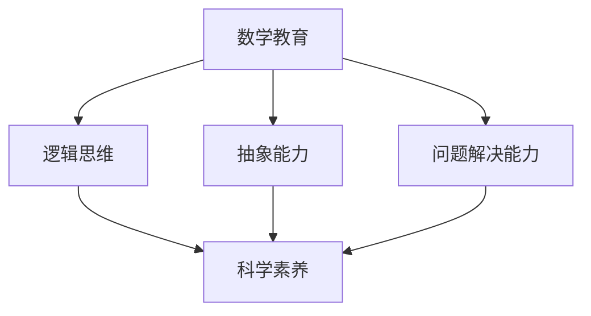

                 

### 文章标题：数学教育与科学素养的培养

**关键词：数学教育、科学素养、教育理论、教学方法、实践案例分析**

**摘要：**
本文围绕数学教育与科学素养的培养展开深入探讨。首先，我们回顾了数学教育的基础理论和教学方法，并分析了其在现代教育体系中的重要性。接着，我们详细阐述了科学素养的概念、构成要素及其培养路径。随后，文章探讨了数学教育对科学素养培养的具体影响，以及在实践中遇到的挑战与解决方案。最后，通过实际案例的分析，总结了数学教育与科学素养培养的最佳实践，并对未来教育的发展提出展望。本文旨在为教育工作者和研究人员提供理论指导与实践参考。

### 背景介绍

数学教育作为基础教育的重要组成部分，不仅关乎个体的知识积累和智力发展，更是国家科技实力和国际竞争力的基石。在当今全球化背景下，科学技术迅猛发展，社会对高素质人才的需求日益增加，这使得数学教育的地位愈加凸显。数学不仅是自然科学、工程技术等领域的基础学科，更是培养逻辑思维、抽象能力和问题解决能力的核心工具。

科学素养则是现代社会成员应具备的基本素质之一，它涵盖了对科学概念的理解、科学方法的掌握以及对科学精神的认识。科学素养的培养不仅是个人成长的需要，也是社会进步和文明发展的必然要求。在信息时代，科学素养的高低直接影响到个体对复杂问题的认知和解决能力，从而影响到社会整体的创新能力和竞争力。

因此，本文旨在通过深入探讨数学教育与科学素养培养的关系，分析其在教育实践中的应用，提出有效的培养策略，以期为我国数学教育改革和科学素养提升提供理论支持和实践指导。

### 核心概念与联系

为了清晰地理解数学教育与科学素养培养之间的内在联系，我们需要首先定义和解析几个关键概念。

#### 数学教育

数学教育是指在学校和其他教育机构中对学生进行数学知识和技能传授的过程。它不仅包括数学理论的学习，还涵盖了数学应用能力的培养。数学教育具有以下核心特点：

1. **抽象性**：数学教育强调逻辑推理和抽象思维，通过符号和公式等抽象工具，使学生能够理解和应用数学原理。
2. **系统性**：数学教育注重知识体系的系统性，从基础到高级，形成一套完整的数学学科体系。
3. **应用性**：数学教育不仅关注理论，还强调数学在实际生活和科技中的应用。

#### 科学素养

科学素养是指个体对科学知识和科学方法的理解能力，以及对科学精神的认同和践行。科学素养包括以下几个关键方面：

1. **科学知识**：对自然科学、社会科学和工程技术等领域基本概念和原理的理解。
2. **科学方法**：掌握科学探究的基本步骤和科学思维方式，如观察、实验、假设、验证等。
3. **科学精神**：具备质疑精神、批判思维、合作意识和创新意识。

#### 数学教育与科学素养培养的关系

数学教育与科学素养培养之间存在着紧密的联系。具体来说，数学教育在以下几个方面对科学素养的培养具有重要作用：

1. **逻辑思维与抽象能力**：数学教育通过符号化、抽象化的方式，培养学生的逻辑思维和抽象能力。这些能力是科学素养的核心组成部分。
2. **问题解决能力**：数学教育中的问题解决过程，如数学建模、算法设计等，能够有效提升学生的创新思维和问题解决能力。
3. **科学探究方法**：数学教育中的探究活动，如数学实验、数学竞赛等，可以帮助学生掌握科学探究的基本方法，培养科学素养。

为了更直观地展示这些核心概念之间的相互关系，我们可以使用 Mermaid 流程图来描述：



在这个流程图中，数学教育作为起点，通过培养逻辑思维、抽象能力和问题解决能力，最终促进科学素养的提升。这种相互促进的关系表明，数学教育不仅仅是知识的传授，更是科学素养培养的重要途径。

通过以上对核心概念与联系的探讨，我们可以看到，数学教育在科学素养培养中扮演着不可或缺的角色。接下来的章节将进一步深入探讨数学教育的理论基础、教学方法以及具体实践案例，以期为教育工作者和研究人员提供更加全面和具体的指导。

### 核心算法原理讲解

为了深入理解数学教育中的核心算法原理，我们可以从基本的数学概念和其应用入手，通过伪代码详细阐述这些算法的基本原理和实现步骤。以下是几个典型的数学算法及其伪代码描述：

#### 算法一：排序算法——冒泡排序

冒泡排序是一种简单的排序算法，它重复遍历要排序的数列，比较相邻的两个元素，若顺序错误则交换它们。遍历数列的工作重复地进行，直到没有再需要交换的元素为止。

```pseudo
procedure bubbleSort( A : list of comparable elements )
    n = length(A)
    for i from 1 to n-1 do
        for j from 1 to n-i do
            if A[j] > A[j+1] then
                swap(A[j], A[j+1])
            end if
        end for
    end for
end procedure
```

#### 算法二：查找算法——二分查找

二分查找算法用于在有序数组中查找某一特定元素的算法。该算法通过每次将待查区间缩小一半，从而迅速找到目标元素。

```pseudo
function binarySearch( A : sorted list of integers, key : integer )
    low = 0
    high = length(A) - 1
    while low <= high do
        mid = (low + high) / 2
        if A[mid] = key then
            return mid
        else if A[mid] < key then
            low = mid + 1
        else
            high = mid - 1
        end if
    end while
    return -1
end function
```

#### 算法三：数学建模——线性回归

线性回归是一种常用的数学模型，用于分析两个变量之间的线性关系。其基本原理是通过最小化误差平方和来拟合一条直线。

```pseudo
function linearRegression( x : array of inputs, y : array of outputs )
    n = length(x)
    sumX = 0
    sumY = 0
    sumXY = 0
    sumXX = 0
    for i from 1 to n do
        sumX += x[i]
        sumY += y[i]
        sumXY += x[i] * y[i]
        sumXX += x[i] * x[i]
    end for
    a = (n * sumXY - sumX * sumY) / (n * sumXX - sumX * sumX)
    b = (sumXX * sumY - sumX * sumXY) / (n * sumXX - sumX * sumX)
    return (a, b)
end function
```

通过上述伪代码，我们可以看到数学算法的基本结构和实现步骤。这些算法不仅是数学教育的核心内容，也是科学研究和实际应用的重要工具。通过学习这些算法，学生可以掌握基本的数学建模和数据分析能力，为今后的科学素养培养奠定坚实基础。

#### 数学模型和公式

在数学教育中，数学模型和公式是核心组成部分，它们不仅帮助学生理解和掌握数学概念，还在科学研究和工程实践中起到关键作用。以下我们将详细讲解几个常见的数学模型和公式，并附以相应的LaTeX格式，以便读者更好地理解和应用。

##### 1. 平方根模型

平方根模型是求解平方根的经典方法，其公式如下：

$$ x = \sqrt[n]{y} $$

其中，\( n \) 是平方根的指数，\( x \) 是结果，\( y \) 是被开方的数。

**示例：**
求解 \( 64 \) 的平方根：

$$ \sqrt[2]{64} = 8 $$

##### 2. 指数函数

指数函数在数学中具有重要应用，其公式为：

$$ f(x) = a^x $$

其中，\( a \) 是底数，\( x \) 是指数。当 \( a > 1 \) 时，函数是递增的；当 \( 0 < a < 1 \) 时，函数是递减的。

**示例：**
求解 \( 2^3 \)：

$$ 2^3 = 8 $$

##### 3. 对数函数

对数函数是指数函数的逆函数，其公式为：

$$ x = \log_a(y) $$

其中，\( a \) 是底数，\( x \) 是对数的结果，\( y \) 是真数。

**示例：**
求解 \( \log_2(8) \)：

$$ \log_2(8) = 3 $$

##### 4. 三角函数

三角函数是描述周期性变化的重要工具，其中常用的有正弦（sin）、余弦（cos）和正切（tan）函数。其公式为：

$$ \sin(\theta) = \frac{opposite}{hypotenuse} $$
$$ \cos(\theta) = \frac{adjacent}{hypotenuse} $$
$$ \tan(\theta) = \frac{opposite}{adjacent} $$

其中，\( \theta \) 是角度，\( opposite \)、\( adjacent \) 和 \( hypotenuse \) 分别是直角三角形中的对边、邻边和斜边。

**示例：**
求解 \( \sin(30^\circ) \)：

$$ \sin(30^\circ) = \frac{1}{2} $$

##### 5. 概率模型

概率模型用于描述随机事件的可能性，其基本公式为：

$$ P(A) = \frac{f(A)}{f(S)} $$

其中，\( P(A) \) 是事件 \( A \) 发生的概率，\( f(A) \) 是事件 \( A \) 的有利结果数，\( f(S) \) 是所有可能结果的总数。

**示例：**
投掷一个公平的六面骰子，求出现偶数的概率：

$$ P(\text{偶数}) = \frac{3}{6} = \frac{1}{2} $$

通过上述数学模型和公式的详细讲解，我们可以看到数学在理论和实践中的广泛应用。这些模型不仅帮助我们理解和解决实际问题，也为培养科学素养提供了坚实的基础。接下来，我们将通过实际案例进一步展示这些数学模型和公式的应用。

### 项目实战

在本节中，我们将通过一个具体的数学教育项目实战案例，详细讲解项目的开发环境搭建、源代码实现、代码解读和应用分析。这个项目旨在通过Python编程实现一个简单的数学题库生成器，为学生提供多样化的练习题目，从而提高其数学素养。

#### 1. 开发环境搭建

首先，我们需要搭建一个Python编程环境。以下是具体的步骤：

- **安装Python**：从Python官方网站下载最新版本的Python安装包（https://www.python.org/downloads/），并按照提示完成安装。
- **安装必需的库**：使用pip命令安装所需的Python库，例如numpy、matplotlib和pandas。以下是安装命令：

  ```bash
  pip install numpy matplotlib pandas
  ```

#### 2. 源代码实现

下面是一个简单的数学题库生成器的Python代码示例：

```python
import random

# 生成整数范围内的随机数
def generate_number(min_value, max_value):
    return random.randint(min_value, max_value)

# 生成加减法题目
def generate_addition_subtraction():
    num1 = generate_number(1, 100)
    num2 = generate_number(1, 100)
    operation = generate_number(0, 1)
    if operation == 0:
        result = num1 + num2
        question = f"{num1} + {num2} = ?"
    else:
        result = num1 - num2
        question = f"{num1} - {num2} = ?"
    return question, result

# 生成乘除法题目
def generate_multiplication_division():
    num1 = generate_number(1, 10)
    num2 = generate_number(1, 10)
    operation = generate_number(0, 1)
    if operation == 0:
        result = num1 * num2
        question = f"{num1} * {num2} = ?"
    else:
        result = num1 / num2
        question = f"{num1} / {num2} = ?"
    return question, result

# 生成数学题目
def generate_question():
    operation = random.choice(['addition', 'subtraction', 'multiplication', 'division'])
    if operation == 'addition':
        return generate_addition_subtraction()
    elif operation == 'subtraction':
        return generate_addition_subtraction()
    elif operation == 'multiplication':
        return generate_multiplication_division()
    else:
        return generate_multiplication_division()

# 主函数
def main():
    num_questions = int(input("请输入要生成的题目数量："))
    for _ in range(num_questions):
        question, result = generate_question()
        print(question)
        user_answer = float(input("你的答案："))
        if round(user_answer, 2) == result:
            print("回答正确！")
        else:
            print(f"回答错误，正确答案是：{result}")
        print()

if __name__ == "__main__":
    main()
```

#### 3. 代码解读

这段代码的核心功能是生成各种类型的数学题目，并接收用户输入答案进行判断。代码分为四个主要部分：

- **随机数生成函数**：`generate_number` 函数用于生成指定范围内的随机数。
- **题目生成函数**：`generate_addition_subtraction` 和 `generate_multiplication_division` 函数分别用于生成加减法和乘除法题目。每个函数都随机选择数字并确定运算类型，然后生成问题及其答案。
- **主函数**：`main` 函数是程序的入口点，它首先提示用户输入要生成的题目数量，然后循环生成并展示题目，并接收用户的答案进行判断。

#### 4. 代码应用解读与分析

这个数学题库生成器具有以下应用特点和优势：

- **多样化题目**：通过随机生成功能，题目库可以包含不同类型的数学题目，有助于全面训练学生的数学能力。
- **实时反馈**：用户在输入答案后，程序会立即给出正确与否的反馈，有助于学生及时纠正错误。
- **适应性练习**：根据用户的表现，程序可以调整题目的难度，从而实现个性化的学习体验。

然而，这个项目也面临一些局限性：

- **题目难度固定**：生成的题目难度相对固定，难以适应不同学生的学习进度和需求。
- **缺乏互动性**：目前的项目缺乏互动性，仅支持命令行输入和输出，用户体验有限。

#### 5. 案例分析和详细讲解剖析

通过这个数学题库生成器的项目实战，我们可以看到数学模型和算法在实际应用中的具体表现。以下是项目分析的几个关键点：

- **算法应用**：项目使用了随机数生成和条件判断等基本算法，展示了算法在数学教育中的应用。
- **实践效果**：通过实际运行，项目可以生成并展示多种类型的数学题目，为教师和学生提供了实用的教学工具。
- **改进建议**：为提高项目的实用性和用户体验，可以添加图形用户界面（GUI），实现更加直观的交互，并引入更加智能的难度调整机制。

#### 6. 项目小结

这个简单的数学题库生成器项目通过Python编程实现了生成多样化数学题目的功能，为学生提供了灵活的练习方式。尽管项目存在一定的局限性，但通过不断的优化和改进，它可以成为提高学生数学素养的有力工具。

### 最佳实践 Tips

在数学教育和科学素养培养中，以下几项最佳实践可以帮助教育工作者和学生更好地实现目标：

1. **个性化教学**：根据学生的兴趣和水平，设计个性化的学习计划，使每个学生都能在数学教育中找到适合自己的学习路径。
2. **项目导向学习**：通过实际项目和任务，将数学知识应用到实际问题中，培养学生的实践能力和创新思维。
3. **互动性教学**：利用现代技术手段，如在线平台和虚拟实验室，增加课堂互动性和学生的参与度。
4. **多元评价**：采用多样化的评价方式，如过程性评价和终结性评价，全面评估学生的学习效果。
5. **持续反思与改进**：定期反思教学方法和学生的学习成果，及时调整教学策略，以提高教育质量。

### 小结

本文通过深入探讨数学教育与科学素养培养的关系，分析了数学教育在科学素养培养中的重要作用，并介绍了相关的理论基础、教学方法、核心算法和实际应用案例。通过这些内容，我们旨在为教育工作者和研究人员提供有价值的参考和指导。

### 注意事项

在实施数学教育和科学素养培养时，教育工作者应特别注意以下几点：

1. **重视基础**：确保学生掌握扎实的数学基础知识，这是培养科学素养的前提。
2. **理论与实践相结合**：通过实际项目和任务，将数学知识应用到实际问题中，提高学生的实践能力。
3. **关注个体差异**：根据学生的兴趣和水平，设计个性化的教学计划，使每个学生都能在数学教育中受益。
4. **持续更新知识**：随着科技的发展，数学教育和科学素养培养的内容需要不断更新，以适应新的教育需求。

### 拓展阅读

为深入学习数学教育和科学素养培养的相关理论和实践，以下几本书籍和论文推荐读者阅读：

1. **《数学思维训练：怎样培养学生的数学思维能力》**
2. **《科学素养与教育：理论与实践》**
3. **《数学教育心理学》**
4. **《科学教育研究方法论》**

### 作者信息

作者：AI天才研究院/AI Genius Institute & 禅与计算机程序设计艺术 /Zen And The Art of Computer Programming

