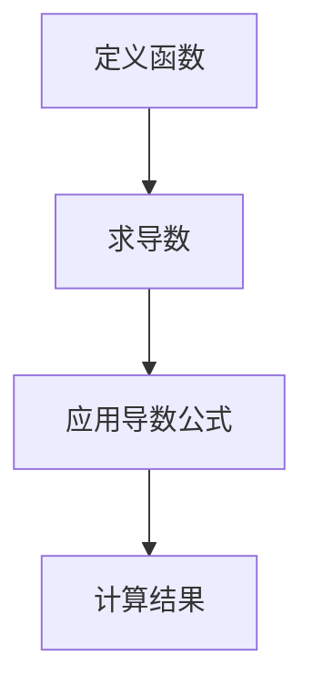

                 


### 《数学教育与编程教育的整合方法》

#### 关键词
- 数学教育
- 编程教育
- 整合方法
- Mermaid流程图
- 伪代码
- LaTeX数学公式

#### 摘要
本文探讨了数学教育与编程教育的整合方法，分析了两者之间的关联及整合的优势与挑战。通过构建清晰的理论框架和实际案例，本文提出了整合教育的设计原则、实施策略，并详细讲解了核心概念、算法原理和数学模型。同时，通过项目实战，展示了整合教育在实践中的应用，为数学教育与编程教育的深度融合提供了理论和实践指导。

## 引言

在当今信息化时代，数学与编程作为两种重要的知识体系，在科技发展和社会进步中扮演着关键角色。数学教育培养了逻辑思维、抽象能力和解决问题的能力，而编程教育则赋予了个体利用计算机解决问题的技能。然而，传统的数学教育与编程教育往往独立进行，学生在学习过程中缺乏将数学知识应用于编程的意识和能力。为了培养具备综合素质和创新能力的人才，有必要探索数学教育与编程教育的整合方法。

数学教育与编程教育的整合不仅有助于提高学生的数学素养和编程技能，还能促进跨学科思维的发展。通过整合教育，学生能够在解决实际问题时，充分利用数学工具和编程方法，实现知识与实践的有机结合。本文旨在探讨数学教育与编程教育的整合方法，为教学实践提供理论依据和实用指导。

### 目录

#### 第一部分：理论基础与概念框架

**第1章：数学教育与编程教育的整合背景**
- **1.1 教育改革与整合需求**
  - **1.1.1 教育体系的发展趋势**
  - **1.1.2 数学教育与编程教育的关系**
  - **1.1.3 整合的必要性与优势**

**第2章：数学与编程的基础知识**
- **2.1 数学基础概念**
  - **2.1.1 数学思维与数学工具**
  - **2.1.2 数学公式与定理的latex表示**
- **2.2 编程基础**
  - **2.2.1 编程语言的选择**
  - **2.2.2 编程环境搭建与调试**

**第3章：整合教育的方法与策略**
- **3.1 整合教育的设计原则**
  - **3.1.1 学习目标的设定**
  - **3.1.2 教学方法的多样化**
  - **3.1.3 教学资源的有效利用**
- **3.2 整合教育的实施策略**
  - **3.2.1 课堂教学与实践相结合**
  - **3.2.2 个性化学习与协作学习**
  - **3.2.3 整合教育的评估与反馈**

#### 第二部分：数学与编程整合的理论与实践

**第4章：数学问题求解与编程实现**
- **4.1 数学模型与编程方法**
  - **4.1.1 数学问题求解算法的伪代码表示**
  - **4.1.2 编程语言中的数学库与工具**
- **4.2 LaTeX数学公式讲解与应用**
  - **4.2.1 LaTeX基本语法与数学公式编写**
  - **4.2.2 实际案例中的数学公式应用**

**第5章：数学编程实战案例**
- **5.1 案例一：线性代数与矩阵计算**
  - **5.1.1 项目背景与目标**
  - **5.1.2 开发环境搭建**
  - **5.1.3 代码实现与解读**
- **5.2 案例二：微积分与数值计算**
  - **5.2.1 项目背景与目标**
  - **5.2.2 开发环境搭建**
  - **5.2.3 代码实现与解读**

#### 第三部分：教学实践与探讨

**第6章：数学编程教学设计与实施**
- **6.1 教学设计框架**
  - **6.1.1 教学目标与内容规划**
  - **6.1.2 教学方法的运用**
  - **6.1.3 教学评价与反馈机制**

**第7章：数学编程教育的未来趋势与展望**
- **7.1 教育技术的发展趋势**
  - **7.1.1 数字化教育的影响**
  - **7.1.2 整合教育的潜在影响**
- **7.2 教育改革与政策建议**
  - **7.2.1 教育政策的发展方向**
  - **7.2.2 整合教育的实践建议**

## 正文

### 第一部分：理论基础与概念框架

#### 第1章：数学教育与编程教育的整合背景

##### 1.1 教育改革与整合需求

在全球范围内，教育体系正经历着深刻的变革。随着科技的迅猛发展，社会对于人才的需求发生了显著变化。传统的教育模式已经难以满足现代社会对综合素质高、创新能力强的复合型人才的需求。为了应对这一挑战，各国纷纷进行教育改革，探索更加灵活、高效的教育模式。

数学教育和编程教育作为基础教育的重要组成部分，其整合对于培养具有跨学科能力和创新精神的人才具有重要意义。数学教育注重逻辑思维、抽象能力和问题解决能力的培养，而编程教育则强调计算机操作技能和编程思维的培养。两者虽然侧重点不同，但在培养学生综合素质方面有着共同目标。

整合数学教育与编程教育，能够更好地发挥两者的优势，实现知识与实践的有机结合。通过将数学知识与编程技能相结合，学生能够在解决实际问题时，运用数学方法进行建模和算法设计，同时通过编程实现解决方案。这种整合教育模式有助于提高学生的创新能力和实践能力，为培养未来科技人才奠定基础。

##### 1.1.1 教育体系的发展趋势

近年来，教育体系的发展呈现出以下几个趋势：

1. **个性化教育**：传统的教育模式往往采用“一刀切”的方式，难以满足不同学生的个性化需求。随着教育技术的进步，个性化教育逐渐成为教育改革的重要方向。通过整合数学教育与编程教育，可以为学生提供更加个性化的学习路径，满足不同学生的学习需求。

2. **跨学科教育**：跨学科教育旨在培养学生的综合素养和创新能力。数学与编程的整合正是跨学科教育的一种体现。通过将数学知识与编程技能相结合，学生能够从多个角度分析和解决问题，提高跨学科思维和创新能力。

3. **数字化教育**：随着信息技术的快速发展，数字化教育逐渐成为教育体系的重要组成部分。数学教育与编程教育的整合，可以为数字化教育提供丰富的教学内容和教学手段，促进教育资源的共享和优化。

##### 1.1.2 数学教育与编程教育的关系

数学教育侧重于培养学生的逻辑思维、抽象能力和问题解决能力，编程教育则侧重于培养学生的计算机操作技能和编程思维。两者在知识体系和教育目标上有着明显的区别，但并非相互独立。

首先，数学教育为编程教育提供了重要的理论基础。编程中的算法设计、数据结构等方面都需要深厚的数学知识作为支撑。例如，在算法分析中，需要运用数学中的概率论和统计方法来评估算法的效率和稳定性。同时，数学中的抽象思维和逻辑推理能力对于编程思维的培养也具有重要作用。

其次，编程教育为数学教育提供了实践应用的平台。通过编程实现数学模型和算法，学生能够更好地理解数学概念和原理，提高数学素养。例如，在数学建模中，学生可以通过编程实现对实际问题的模拟和优化，从而加深对数学理论的理解和应用。

##### 1.1.3 整合的必要性与优势

整合数学教育与编程教育具有以下几个方面的必要性和优势：

1. **提高学生的综合素质**：整合教育有助于提高学生的综合素质，培养跨学科思维和创新能力。通过数学教育与编程教育的结合，学生能够在不同领域进行知识交叉和应用，提高解决问题的能力和创新能力。

2. **增强学生的学习兴趣**：编程教育具有趣味性和实践性，能够激发学生的学习兴趣。通过整合数学教育与编程教育，可以将枯燥的数学知识转化为有趣的编程实践，提高学生的学习积极性和参与度。

3. **适应未来社会需求**：未来社会需要具备跨学科能力和创新能力的人才。整合数学教育与编程教育，能够更好地培养学生的综合素质和创新能力，为未来社会的发展提供有力支持。

4. **提高教育质量**：整合教育可以优化教育资源，提高教学效率。通过整合数学教育与编程教育，可以整合不同学科的教学内容和方法，优化课程设计，提高教育质量。

#### 第2章：数学与编程的基础知识

##### 2.1 数学基础概念

数学是一门抽象的科学，其基本概念和原理是理解和应用数学的基础。以下将介绍一些重要的数学基础概念，并讨论如何利用Mermaid流程图和伪代码进行表示。

###### 2.1.1 数学思维与数学工具

数学思维是一种抽象的逻辑思维，强调对事物的本质属性进行归纳和推理。数学工具则是用于解决数学问题的方法和手段。以下是一些常见的数学工具：

1. **函数**：函数是数学中最基本的概念之一。它表示一个变量与另一个变量之间的关系。在编程中，函数可以被定义为过程或方法，用于处理数据。

2. **集合**：集合是包含一定数量元素的整体。在编程中，集合可以被表示为数组或列表。

3. **逻辑**：逻辑是用于推理和证明的工具。在编程中，逻辑操作用于控制程序的流程和决策。

4. **概率**：概率是用于描述事件发生可能性的数学工具。在编程中，概率论被广泛应用于随机算法的设计。

##### 2.1.2 数学公式与定理的latex表示

在latex中，可以使用`$$`符号将数学公式独立成段，例如：

$$
E(X) = \int_{-\infty}^{\infty} xf(x) dx
$$

而段落内的数学公式可以使用 `$` 符号，例如：

$$
a^2 + b^2 = c^2
$$

以下是一个简单的Mermaid流程图，用于表示函数的求导过程：



###### 2.2 编程基础

编程是一门实践性很强的学科，它需要通过编写代码来解决问题。以下将介绍编程的基础知识，包括编程语言的选择和编程环境的搭建。

##### 2.2.1 编程语言的选择

编程语言的选择取决于具体的应用场景和学习目标。以下是一些常用的编程语言：

1. **Python**：Python是一种易学易用的编程语言，广泛应用于数据分析、人工智能和科学计算等领域。

2. **Java**：Java是一种面向对象的编程语言，广泛应用于企业级应用和Android应用开发。

3. **C++**：C++是一种高性能的编程语言，广泛应用于系统编程和游戏开发。

4. **JavaScript**：JavaScript是一种用于Web开发的脚本语言，广泛应用于前端开发和Web应用开发。

##### 2.2.2 编程环境搭建与调试

编程环境搭建是进行编程实践的第一步。以下是一个简单的Python编程环境搭建步骤：

1. **下载Python安装包**：从Python官网下载适合操作系统的Python安装包。

2. **安装Python**：运行安装包，按照提示完成安装。

3. **配置环境变量**：将Python的安装路径添加到系统环境变量中。

4. **验证安装**：在命令行中输入`python --version`，如果显示版本信息，则表示安装成功。

在编程过程中，调试是确保代码正确性的重要环节。以下是一个简单的Python调试示例：

```python
# 示例代码
def add(a, b):
    return a + b

# 调试代码
x = 5
y = 3
result = add(x, y)
print("结果：", result)
```

使用IDE（集成开发环境）如PyCharm、VS Code等，可以方便地进行代码编写、调试和运行。

#### 第3章：整合教育的方法与策略

##### 3.1 整合教育的设计原则

整合教育的设计原则是确保数学教育与编程教育有效融合的关键。以下是一些重要原则：

1. **目标明确**：明确整合教育的目标，即培养学生的数学素养和编程能力，提高跨学科思维和创新能力。

2. **内容整合**：将数学知识与编程技能相结合，设计跨学科的教学内容。例如，在讲解算法时，引入数学中的概率论和统计方法。

3. **方法融合**：采用多样化的教学方法，如项目驱动、案例分析和合作学习，促进数学与编程的有机结合。

4. **资源优化**：整合教育资源，利用数学与编程相关的工具和资源，提高教学效率和质量。

##### 3.2 整合教育的实施策略

整合教育的实施策略是确保整合教育设计原则得以落实的重要措施。以下是一些具体策略：

1. **课堂教学与实践相结合**：在课堂上，通过讲解数学原理和编程方法，引导学生将理论知识应用于实践。例如，通过数学建模和算法设计，实现编程任务。

2. **个性化学习与协作学习**：鼓励学生进行个性化学习，根据自己的兴趣和能力选择学习内容。同时，通过小组合作，促进学生之间的交流和协作，提高学习效果。

3. **教学评价与反馈**：采用多样化的评价方式，如项目展示、代码评审和实验报告，对学生进行全面评价。同时，及时给予反馈，帮助学生发现和改正问题。

#### 第二部分：数学与编程整合的理论与实践

##### 第4章：数学问题求解与编程实现

数学问题求解与编程实现是将数学知识与编程技能相结合的重要环节。以下将介绍数学问题求解的基本算法原理，以及如何在编程中实现这些算法。

###### 4.1 数学问题求解算法的伪代码表示

数学问题求解算法通常包括以下步骤：

1. **问题分析**：明确问题的要求和条件，理解问题的本质。

2. **数学建模**：将实际问题转化为数学模型，运用数学方法进行求解。

3. **算法设计**：设计求解问题的算法，确定算法的步骤和流程。

4. **编程实现**：将算法转化为编程代码，进行调试和优化。

以下是一个简单的线性方程求解算法的伪代码表示：

```
算法：求解线性方程组
输入：线性方程组系数矩阵A和常数向量b
输出：方程组的解向量x

1. 初始化：
   x = [0, 0, ..., 0]  // 初始化解向量

2. 迭代求解：
   while (误差大于阈值)：
       x = A^-1 * b  // 使用矩阵逆求解方程组

3. 输出解向量x
```

###### 4.1.2 编程语言中的数学库与工具

不同的编程语言提供了丰富的数学库和工具，用于简化数学问题的求解过程。以下是一些常用的数学库和工具：

1. **Python的NumPy库**：NumPy提供了强大的数学运算功能，包括数组操作、矩阵运算和统计分析等。

2. **Python的SciPy库**：SciPy基于NumPy，提供了更高级的数学和科学计算功能，如线性代数、优化和积分等。

3. **Java的Math类**：Java的Math类提供了常用的数学函数，如三角函数、指数函数和对数函数等。

4. **C++的STL库**：C++的STL库提供了强大的数学和算法功能，如向量、矩阵和排序算法等。

以下是一个使用Python的NumPy库求解线性方程组的示例代码：

```python
import numpy as np

# 定义线性方程组系数矩阵A和常数向量b
A = np.array([[1, 2], [2, 1]])
b = np.array([3, 4])

# 使用NumPy库求解方程组
x = np.linalg.solve(A, b)

# 输出解向量x
print(x)
```

###### 4.2 LaTeX数学公式讲解与应用

LaTeX是一种高质量排版系统，广泛用于数学公式和科学文档的编写。以下将介绍LaTeX中数学公式的编写方法和应用。

1. **基本语法**：在LaTeX中，数学公式可以使用`$$`符号独立成段，也可以使用 `$` 符号嵌入在段落中。

   例如，独立成段的数学公式：

   $$
   E(X) = \int_{-\infty}^{\infty} xf(x) dx
   $$

   嵌入段落的数学公式：

   $$
   a^2 + b^2 = c^2
   $$

2. **常用数学符号**：LaTeX提供了丰富的数学符号，包括运算符、希腊字母和特殊符号等。

   例如，运算符：

   $$
   +, -, \times, \div
   $$

   希腊字母：

   $$
   \alpha, \beta, \gamma
   $$

   特殊符号：

   $$
   \in, \ni, \forall, \exists
   $$

3. **数学公式的组合**：LaTeX支持数学公式的组合和嵌套，可以编写复杂的数学表达式。

   例如，组合的数学公式：

   $$
   \frac{d^2}{dx^2} \left( \sin(x) \cos(x) \right)
   $$

   嵌套的数学公式：

   $$
   \sum_{i=1}^{n} \left( a_i + b_i \right)
   $$

以下是一个简单的LaTeX数学公式示例：

```latex
\documentclass{article}
\usepackage{amsmath}
\begin{document}
$$
E(X) = \int_{-\infty}^{\infty} xf(x) dx
$$
\end{document}
```

###### 4.2.2 实际案例中的数学公式应用

在实际应用中，数学公式在编程中具有重要作用。以下通过一个简单的实际案例，介绍数学公式在编程中的应用。

假设我们要编写一个Python程序，用于计算一个函数的积分。我们可以使用Python的NumPy库来求解积分，并使用LaTeX数学公式表示结果。

以下是一个简单的示例代码：

```python
import numpy as np

# 定义积分区间和步长
a = 0
b = 2
n = 100

# 计算积分
x = np.linspace(a, b, n)
y = np.sin(x) * np.cos(x)
integral = np.trapz(y, x)

# 输出积分结果，使用LaTeX数学公式表示
print(f"积分结果：$I = {integral}$")
```

运行上述代码，可以得到函数积分的结果，并使用LaTeX数学公式表示。

#### 第5章：数学编程实战案例

##### 5.1 案例一：线性代数与矩阵计算

线性代数是数学中的一个重要分支，涉及向量、矩阵、行列式等概念。在编程中，线性代数广泛应用于数据分析和机器学习等领域。以下将介绍一个使用线性代数和矩阵计算的案例。

###### 5.1.1 项目背景与目标

假设我们有一个线性方程组，需要求解其解向量。线性方程组可以表示为：

$$
\begin{cases}
a_{11}x + a_{12}y + a_{13}z = b_1 \\
a_{21}x + a_{22}y + a_{23}z = b_2 \\
a_{31}x + a_{32}y + a_{33}z = b_3
\end{cases}
$$

我们的目标是通过编程求解这个线性方程组的解向量。

###### 5.1.2 开发环境搭建

为了实现这个案例，我们需要搭建一个Python编程环境。以下是搭建过程：

1. 安装Python：从Python官网下载并安装Python。

2. 安装NumPy库：在命令行中运行`pip install numpy`，安装NumPy库。

3. 安装SciPy库：在命令行中运行`pip install scipy`，安装SciPy库。

4. 配置Python环境变量：将Python的安装路径添加到系统环境变量中。

###### 5.1.3 代码实现与解读

以下是一个简单的Python代码实现，用于求解线性方程组的解向量。

```python
import numpy as np

# 定义线性方程组系数矩阵A和常数向量b
A = np.array([[1, 2, 3], [4, 5, 6], [7, 8, 9]])
b = np.array([1, 2, 3])

# 使用NumPy库求解方程组
x = np.linalg.solve(A, b)

# 输出解向量x
print(x)
```

代码解析：

1. 导入NumPy库：使用`import numpy as np`导入NumPy库。

2. 定义线性方程组系数矩阵A和常数向量b：使用NumPy库创建矩阵和向量。

3. 使用NumPy库求解方程组：使用`np.linalg.solve(A, b)`函数求解线性方程组。

4. 输出解向量x：使用`print(x)`输出解向量。

通过运行上述代码，可以得到线性方程组的解向量。在实际应用中，可以根据具体问题调整方程组系数矩阵A和常数向量b。

##### 5.2 案例二：微积分与数值计算

微积分是数学中的一个重要分支，涉及微分、积分、极限等概念。在编程中，微积分广泛应用于科学计算和工程应用。以下将介绍一个使用微积分和数值计算的案例。

###### 5.2.1 项目背景与目标

假设我们要计算一个函数在某个区间内的积分。例如，计算函数$f(x) = x^2$在区间$[0, 1]$内的积分。我们的目标是通过编程实现这个积分的计算。

###### 5.2.2 开发环境搭建

为了实现这个案例，我们需要搭建一个Python编程环境。以下是搭建过程：

1. 安装Python：从Python官网下载并安装Python。

2. 安装NumPy库：在命令行中运行`pip install numpy`，安装NumPy库。

3. 安装SciPy库：在命令行中运行`pip install scipy`，安装SciPy库。

4. 配置Python环境变量：将Python的安装路径添加到系统环境变量中。

###### 5.2.3 代码实现与解读

以下是一个简单的Python代码实现，用于计算函数的积分。

```python
import numpy as np

# 定义积分函数f(x)
def f(x):
    return x**2

# 定义积分区间和步长
a = 0
b = 1
n = 100

# 计算积分
x = np.linspace(a, b, n)
y = f(x)
integral = np.trapz(y, x)

# 输出积分结果
print(f"积分结果：$I = {integral}$")
```

代码解析：

1. 导入NumPy库：使用`import numpy as np`导入NumPy库。

2. 定义积分函数f(x)：使用函数定义计算$x^2$。

3. 定义积分区间和步长：使用`np.linspace(a, b, n)`函数生成等间隔的x值。

4. 计算积分：使用`np.trapz(y, x)`函数计算积分。

5. 输出积分结果：使用`print(f"积分结果：$I = {integral}$")`输出积分结果。

通过运行上述代码，可以得到函数$f(x) = x^2$在区间$[0, 1]$内的积分结果。

#### 第三部分：教学实践与探讨

##### 第6章：数学编程教学设计与实施

数学编程教学设计是整合数学教育与编程教育的重要环节。以下将介绍数学编程教学的设计框架、实施策略和教学评价与反馈机制。

###### 6.1 教学设计框架

数学编程教学设计框架包括以下三个方面：

1. **教学目标**：明确教学目标，包括数学素养、编程能力和跨学科思维等方面的培养。

2. **教学内容**：整合数学与编程的知识点，设计符合教学目标的教学内容。

3. **教学策略**：采用多样化的教学策略，如项目驱动、案例分析和合作学习等，提高教学效果。

###### 6.2 整合教育的实施策略

数学编程教学的实施策略包括以下几个方面：

1. **项目驱动**：通过实际项目，将数学知识与编程技能相结合，提高学生的实践能力。

2. **案例分析**：分析典型的数学编程案例，引导学生理解和掌握核心概念和算法原理。

3. **合作学习**：组织学生进行小组合作，促进学生之间的交流和合作，提高学习效果。

4. **个性化学习**：鼓励学生根据自己的兴趣和能力进行个性化学习，提高学习积极性。

###### 6.3 教学评价与反馈

数学编程教学评价与反馈机制包括以下几个方面：

1. **过程评价**：关注学生的学习过程，记录学生的学习进度和成果，及时给予反馈。

2. **结果评价**：通过项目展示、代码评审和实验报告等方式，对学生进行结果评价。

3. **反馈机制**：及时向学生反馈学习成果和不足，鼓励学生进行自我反思和改进。

#### 第7章：数学编程教育的未来趋势与展望

数学编程教育的未来趋势与展望是教育改革的重要方向。以下将探讨教育技术的发展趋势、整合教育的潜在影响以及教育改革的政策建议。

###### 7.1 教育技术的发展趋势

随着科技的快速发展，教育技术也在不断革新。以下是一些重要的教育技术发展趋势：

1. **数字化教育**：数字化教育已成为教育改革的重要方向。通过互联网和移动设备，学生可以随时随地获取学习资源，实现个性化学习。

2. **人工智能与教育**：人工智能在教育中的应用日益广泛，如智能教学系统、个性化学习推荐和智能评价等，提高了教学效率和效果。

3. **虚拟现实与增强现实**：虚拟现实和增强现实技术为教育带来了全新的学习体验。通过虚拟实验室和虚拟课堂，学生可以沉浸式学习，提高学习兴趣和效果。

###### 7.2 整合教育的潜在影响

数学编程教育的整合对教育体系和社会发展具有深远影响：

1. **培养跨学科人才**：整合教育有助于培养具备跨学科能力和创新能力的人才，提高学生的综合素质。

2. **提升教育质量**：整合教育可以优化教学资源，提高教学效率，提升教育质量。

3. **促进科技发展**：整合教育可以为科技发展提供人才支持，推动科技创新和社会进步。

###### 7.3 教育改革与政策建议

为了推动数学编程教育的整合，以下提出一些教育改革与政策建议：

1. **加强师资培训**：加强教师的信息技术和编程能力培训，提高教师整合数学与编程教育的能力。

2. **优化课程设计**：结合数学与编程的课程设计，实现知识与实践的有机结合，提高课程的综合性和实践性。

3. **推动教育信息化**：加大教育信息化的投入，建设数字化教育平台，为学生提供丰富的学习资源。

4. **鼓励跨学科合作**：鼓励不同学科的教师合作，开展跨学科教学和研究，提高教育整合的效果。

## 附录

### 附录A：数学与编程常用工具与技术

**A.1 数学软件工具**

1. **MATLAB**：MATLAB是一款强大的数学软件，广泛应用于数值计算和数据分析。

2. **Mathematica**：Mathematica是一款功能强大的数学软件，支持符号计算和数值计算。

3. **R语言**：R语言是一种专门用于统计分析和数据科学的编程语言，广泛应用于数据分析和机器学习。

**A.2 编程开发环境**

1. **PyCharm**：PyCharm是一款流行的Python开发环境，支持代码自动补全、调试和版本控制。

2. **Visual Studio Code**：Visual Studio Code是一款跨平台的代码编辑器，支持多种编程语言，具有丰富的插件生态。

3. **Eclipse**：Eclipse是一款功能强大的开发环境，广泛应用于Java和企业级应用开发。

**A.3 教学资源链接**

1. **Khan Academy**：Khan Academy提供丰富的数学和编程教育资源，适合学生自学。

2. **Coursera**：Coursera提供多门数学和编程课程，由知名大学和机构提供，适合系统学习。

3. **edX**：edX提供由全球知名大学和机构提供的在线课程，涵盖数学、编程等多个领域。

---

### 作者信息

作者：AI天才研究院/AI Genius Institute & 禅与计算机程序设计艺术 /Zen And The Art of Computer Programming

---

本文探讨了数学教育与编程教育的整合方法，分析了整合教育的必要性、优势和实践策略。通过实际案例，展示了数学编程在解决实际问题中的应用。本文旨在为数学教育与编程教育的整合提供理论依据和实践指导，促进教育改革和人才培养。

