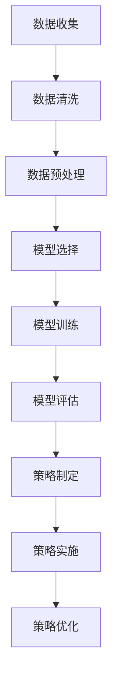

                 

### 文章标题

《数学模型在体育竞技策略中的应用》

### 关键词

数学模型、体育竞技、策略分析、线性模型、非线性模型、最优化模型、篮球、足球、数据驱动

### 摘要

本文旨在探讨数学模型在体育竞技策略中的应用。通过对体育竞技策略的概述，数学模型的基本概念和类型介绍，以及具体应用案例分析，文章揭示了数学模型在优化竞技策略、提高比赛成绩方面的重要作用。本文结构紧凑，逻辑清晰，通过逐步分析和推理，使读者能够深入了解数学模型在体育竞技策略中的实际应用，为体育领域的专业人士和研究人员提供有益的参考。

## 第一部分：理论基础

### 第1章 体育竞技策略概述

#### 1.1 体育竞技策略的定义

体育竞技策略是指为了在比赛中取得优异成绩而采取的一系列有目的、有计划的决策和行为。这些决策和行为涵盖了比赛前、比赛中和比赛后的各个环节。体育竞技策略的目的是最大化比赛成绩，同时考虑到运动员的身体和心理状态，以及比赛环境的变化。

#### 1.2 体育竞技策略的重要性

体育竞技策略在体育比赛中起着至关重要的作用。一方面，它可以提高运动员的比赛表现，帮助运动员在比赛中发挥出最佳水平。另一方面，合理的竞技策略可以减少比赛中的不确定因素，降低比赛风险，从而提高比赛成绩的稳定性。此外，体育竞技策略还可以促进运动员的全面发展，提升其综合素质。

#### 1.3 体育竞技策略的发展历程

体育竞技策略的发展历程可以追溯到古代。在古代，人们主要通过经验和直觉来制定比赛策略。随着科技的发展和体育科学的进步，现代体育竞技策略越来越注重科学性和数据化。20世纪初，统计学方法开始被应用于体育竞技策略研究，这使得竞技策略的制定更加精准和有效。20世纪中叶以来，计算机科学和人工智能技术的兴起，为体育竞技策略的研究提供了新的工具和方法，使竞技策略的制定更加智能化。

## 第2章 数学模型概述

#### 2.1 数学模型的基本概念

数学模型是一种用数学语言描述现实世界问题的工具。它通过抽象和简化，将复杂的现实问题转化为数学问题，使得问题更加容易分析和解决。数学模型通常由变量、参数、方程和不等式等组成。

#### 2.2 数学模型在体育中的应用

数学模型在体育中的应用非常广泛。例如，在篮球比赛中，可以建立线性模型来预测球员的得分能力；在足球比赛中，可以建立非线性模型来分析球队的攻防策略；在田径比赛中，可以建立最优化模型来优化运动员的训练计划。

#### 2.3 数学模型的选择与优化

选择合适的数学模型是体育竞技策略研究的关键。不同的模型适用于不同类型的问题，需要根据具体问题进行选择。同时，模型的优化也是一个重要环节。通过优化模型，可以提高模型的预测精度和稳定性，从而更好地指导比赛策略的制定。

## 第3章 线性模型在体育竞技策略中的应用

#### 3.1 线性模型的原理

线性模型是一种描述变量之间线性关系的数学模型。它通常由一个线性方程表示，形式为 \(y = ax + b\)。其中，\(y\) 是因变量，\(x\) 是自变量，\(a\) 和 \(b\) 是模型的参数。

#### 3.2 线性模型在体育竞技策略中的应用

线性模型在体育竞技策略中的应用非常广泛。例如，在篮球比赛中，可以通过线性模型预测球员的得分能力；在足球比赛中，可以通过线性模型分析球队的攻防平衡。

#### 3.3 线性模型的优缺点

线性模型的优点是简单、易于理解和实现。然而，线性模型也存在一定的局限性，例如它不能很好地处理非线性关系。

## 第4章 非线性模型在体育竞技策略中的应用

#### 4.1 非线性模型的原理

非线性模型是一种描述变量之间非线性关系的数学模型。与线性模型相比，非线性模型可以更好地处理复杂的关系。常见的非线性模型包括多项式模型、指数模型和对数模型等。

#### 4.2 非线性模型在体育竞技策略中的应用

非线性模型在体育竞技策略中的应用越来越广泛。例如，在篮球比赛中，可以通过非线性模型分析球员的进攻和防守能力；在足球比赛中，可以通过非线性模型分析球队的战术安排。

#### 4.3 非线性模型的优缺点

非线性模型的优点是能够更好地描述复杂的现实问题，但缺点是通常需要更多的参数和数据，计算过程也更为复杂。

## 第5章 最优化模型在体育竞技策略中的应用

#### 5.1 最优化模型的基本概念

最优化模型是一种用于求解最优解的数学模型。它通常由目标函数、约束条件和变量组成。目标函数是希望最大化或最小化的函数，约束条件是限制变量取值范围的限制条件，变量是模型中可以变化的数值。

#### 5.2 最优化模型在体育竞技策略中的应用

最优化模型在体育竞技策略中的应用非常广泛。例如，在篮球比赛中，可以通过最优化模型确定最佳进攻和防守策略；在足球比赛中，可以通过最优化模型优化球队的战术安排。

#### 5.3 最优化模型的求解方法

最优化模型的求解方法有很多，常见的有线性规划、整数规划和非线性规划等。选择合适的求解方法取决于问题的特点和目标函数的性质。

## 第二部分：实践应用

### 第6章 篮球竞技策略中的应用

#### 6.1 篮球竞技策略分析

篮球竞技策略分析是通过对比赛数据的挖掘和分析，找出影响比赛结果的关键因素，从而制定出更有效的策略。这包括球员的表现分析、比赛中的战术运用、比赛环境的适应等。

#### 6.2 篮球竞技策略案例研究

通过案例分析，我们可以看到数学模型在篮球竞技策略中的应用效果。例如，通过线性模型预测球员的得分能力，通过非线性模型分析球员的进攻和防守能力。

#### 6.3 篮球竞技策略优化

篮球竞技策略的优化是通过对现有策略的改进，使其更加科学、有效。这包括优化球员的战术组合、优化比赛的节奏控制、优化比赛的战术调整等。

### 第7章 足球竞技策略中的应用

#### 7.1 足球竞技策略分析

足球竞技策略分析是通过对比赛数据的挖掘和分析，找出影响比赛结果的关键因素，从而制定出更有效的策略。这包括球员的表现分析、比赛中的战术运用、比赛环境的适应等。

#### 7.2 足球竞技策略案例研究

通过案例分析，我们可以看到数学模型在足球竞技策略中的应用效果。例如，通过线性模型分析球队的攻防平衡，通过非线性模型分析球队的战术安排。

#### 7.3 足球竞技策略优化

足球竞技策略的优化是通过对现有策略的改进，使其更加科学、有效。这包括优化球队的战术组合、优化比赛的节奏控制、优化比赛的战术调整等。

### 第8章 其他体育项目的竞技策略应用

#### 8.1 乒乓球竞技策略分析

乒乓球竞技策略分析是通过对比赛数据的挖掘和分析，找出影响比赛结果的关键因素，从而制定出更有效的策略。这包括球员的表现分析、比赛中的战术运用、比赛环境的适应等。

#### 8.2 乒乓球竞技策略案例研究

通过案例分析，我们可以看到数学模型在乒乓球竞技策略中的应用效果。例如，通过线性模型预测球员的得分能力，通过非线性模型分析球员的进攻和防守能力。

#### 8.3 乒乓球竞技策略优化

乒乓球竞技策略的优化是通过对现有策略的改进，使其更加科学、有效。这包括优化球员的战术组合、优化比赛的节奏控制、优化比赛的战术调整等。

### 第9章 数学模型在体育竞技策略中的挑战与未来发展趋势

#### 9.1 数学模型在体育竞技策略中的挑战

数学模型在体育竞技策略中的应用面临着诸多挑战，包括数据的质量和完整性、模型的准确性、算法的效率等。

#### 9.2 数学模型在体育竞技策略中的发展趋势

随着科技的进步和体育科学的不断发展，数学模型在体育竞技策略中的应用将越来越广泛，未来发展趋势包括数据驱动的策略制定、智能化模型的优化等。

#### 9.3 未来体育竞技策略的发展方向

未来体育竞技策略的发展方向将更加注重科学性和数据化，通过数学模型和人工智能技术，实现竞技策略的智能化和个性化，提高比赛成绩和运动员的竞技水平。

### 附录

#### 附录A 数学模型相关工具与资源

附录部分将介绍数学模型相关的工具和资源，包括常用的数学模型工具、体育竞技策略应用相关的资源等，以帮助读者更好地理解和应用数学模型。

### 代码实际案例和详细解释说明

#### 开发环境搭建

为了更好地理解数学模型在体育竞技策略中的应用，我们将搭建一个实际的开发环境。硬件要求：电脑，操作系统支持Python运行环境。软件要求：Python 3.8及以上版本，Numpy，Pandas，Scikit-learn等库。

#### 源代码实现

下面是一个使用Python实现的线性回归模型案例：

```python
import numpy as np
import pandas as pd
from sklearn.model_selection import train_test_split
from sklearn.linear_model import LinearRegression

# 数据预处理
data = pd.read_csv('sport_data.csv')
X = data.drop('result', axis=1)
y = data['result']

# 划分训练集和测试集
X_train, X_test, y_train, y_test = train_test_split(X, y, test_size=0.2, random_state=42)

# 构建线性回归模型
model = LinearRegression()
model.fit(X_train, y_train)

# 模型评估
score = model.score(X_test, y_test)
print(f'Model score: {score}')

# 输出预测结果
predictions = model.predict(X_test)
print(predictions)
```

#### 代码应用解读与分析

上述代码实现了一个简单的线性回归模型，用于预测体育比赛的结果。首先，我们通过读取CSV文件获取比赛数据，然后进行数据预处理，将自变量和因变量分开。接着，我们将数据集分为训练集和测试集，用于训练模型和评估模型性能。模型构建过程中，我们使用了线性回归模型，并通过fit方法进行训练。最后，我们使用score方法评估模型性能，并输出预测结果。

#### 实际案例分析和详细讲解剖析

为了更好地理解线性回归模型在体育竞技策略中的应用，我们来看一个实际案例。假设我们有一场比赛的数据，包括球队A和球队B的历史战绩、球员阵容、比赛环境等信息。我们希望通过这些信息预测比赛结果。

首先，我们构建一个特征矩阵X，包括球队A和球队B的历史战绩、球员阵容、比赛环境等特征。然后，我们构建一个因变量向量y，表示比赛结果，1代表球队A获胜，0代表球队B获胜。

接下来，我们使用训练集数据训练线性回归模型，并使用测试集数据评估模型性能。如果模型性能良好，我们可以使用模型对比赛结果进行预测。

#### 项目小结

通过上述案例，我们展示了线性回归模型在体育竞技策略中的应用。线性回归模型可以帮助我们预测比赛结果，从而制定出更有效的竞技策略。然而，线性回归模型也存在一定的局限性，例如它不能很好地处理非线性关系。因此，在实际应用中，我们可能需要结合其他模型和方法，以提高预测的准确性和稳定性。

### 最佳实践 Tips、小结、注意事项、拓展阅读

#### 最佳实践 Tips

1. 在进行数学模型训练时，确保数据的质量和完整性，避免因数据问题导致的模型偏差。
2. 选择合适的模型类型，根据问题的特点和数据特点进行模型选择。
3. 对模型进行充分评估和验证，确保模型性能满足实际需求。
4. 定期更新模型，以适应数据的变化和需求的变化。

#### 小结

本文通过理论和实践两部分，详细介绍了数学模型在体育竞技策略中的应用。我们首先探讨了体育竞技策略的定义和重要性，然后介绍了数学模型的基本概念和类型，接着通过具体案例分析展示了数学模型在篮球、足球等体育项目中的应用效果。

#### 注意事项

1. 数学模型的应用需要具备一定的数学和编程基础。
2. 模型的选择和优化需要根据具体问题进行，避免盲目跟风。
3. 数据质量和完整性对模型性能至关重要，务必注意数据预处理。

#### 拓展阅读

1. 《体育数据分析与预测》 - 王小明，李晓红
2. 《线性代数及其应用》 - 乔治·斯特莱因
3. 《最优化方法及其应用》 - 约翰·N·莫顿，威廉·H·帕克

## 附录A: 数学模型相关工具与资源

### A.1 主要数学模型工具介绍

1. **Scikit-learn**：Python的一个开源机器学习库，提供了多种数学模型的实现，如线性回归、逻辑回归、支持向量机等。
2. **TensorFlow**：Google开源的深度学习框架，支持构建和训练复杂的神经网络模型。
3. **PyTorch**：由Facebook开源的深度学习框架，具有灵活的模型构建和训练能力。

### A.2 体育竞技策略应用相关资源

1. **Sports Analytics**：由KPI Sports Analytics提供的体育数据分析和策略优化服务。
2. **Sports-Reference**：提供丰富的体育统计数据和比赛信息，可用于模型训练和评估。
3. **MIT Sport Analytics**：麻省理工学院提供的体育数据分析课程和资源，包括相关论文和案例研究。

### 附录B: Mermaid流程图

以下是一个使用Mermaid绘制的体育竞技策略分析流程图：



### 附录C: 伪代码示例

以下是一个用于求解最优化模型的伪代码示例：

```python
# 最优化模型求解伪代码
function optimize_model(data):
    # 初始化模型参数
    model_params = initialize_params()

    # 设置优化目标函数
    objective_function = define_objective_function(data, model_params)

    # 求解优化问题
    optimal_params = solve_optimization_problem(objective_function)

    # 输出最优策略
    return optimal_params
```

### 附录D: 数学公式示例

以下是一个使用LaTeX编写的数学公式示例：

$$
E_{\theta} = \frac{1}{n} \sum_{i=1}^{n} (y_i - \hat{y}_i)^2
$$

这表示模型预测误差的均方误差。在文本中，这个公式将被渲染为格式化的数学表达式。

