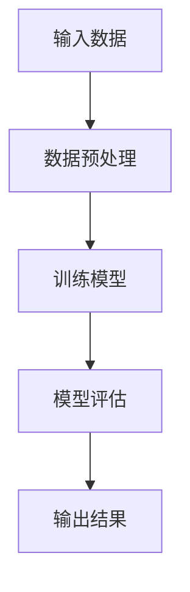
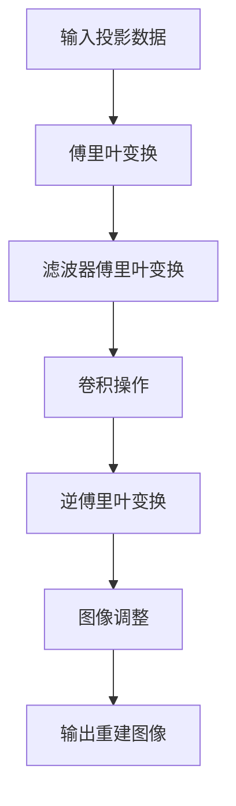

                 


## 数学模型在健康医疗领域的应用

### 关键词
- 数学模型
- 健康医疗
- 医学成像
- 流行病学
- 基因组学
- 药物研发

### 摘要
本文将深入探讨数学模型在健康医疗领域的广泛应用。从基本原理出发，我们首先介绍线性代数、概率论和统计学等数学模型的基础知识。随后，我们将讨论这些模型在医学成像、流行病学、基因组学、药物研发、个性化医疗和健康管理等方面的具体应用。通过实际案例和项目实战，本文旨在揭示数学模型在改善疾病预测、诊断和治疗效果方面的巨大潜力。

## 引言

随着科技的发展和医疗技术的进步，健康医疗领域正经历着前所未有的变革。传统的医疗模式已经无法满足现代社会的需求，个性化医疗、精准医疗和智慧医疗等新兴概念逐渐成为研究热点。在这些新兴领域中，数学模型的应用变得愈发重要。数学模型不仅能够帮助我们更好地理解复杂的生物过程，还能为医疗决策提供科学依据。

数学模型是一种用数学符号和公式描述现实世界问题的工具。在健康医疗领域，数学模型可以用于疾病预测、诊断、治疗和健康管理等各个方面。例如，流行病学中的疾病传播模型可以帮助我们预测疫情的蔓延趋势，基因组学中的序列比对算法可以用于基因变异的检测，医学成像中的重建算法可以提升图像的质量和清晰度。

本文将从以下几个方面展开讨论：

1. **数学模型的基本原理**：介绍线性代数、概率论和统计学等基本数学模型，以及如何运用Mermaid流程图进行描述。
2. **数学模型在医学成像中的应用**：探讨医学成像的基本原理和重建算法，包括伪代码和Mermaid流程图的展示。
3. **数学模型在流行病学中的应用**：分析流行病学中的基本概念和疾病传播模型，以及概率论在流行病学中的应用。
4. **数学模型在基因组学中的应用**：介绍基因组学的基本原理和序列比对算法，包括基因表达数据分析。
5. **数学模型在药物研发中的应用**：讨论药物研发的基本流程和数学模型在药物筛选中的应用。
6. **数学模型在个性化医疗和健康管理中的应用**：分析个性化医疗和健康管理的基本概念，以及数据挖掘和机器学习模型的应用。
7. **数学模型在医疗大数据分析中的应用**：探讨医疗大数据的基本概念，数据预处理方法以及数据挖掘算法。

通过本文的讨论，我们将深入理解数学模型在健康医疗领域的广泛应用和重要性，并展望未来的发展方向。

## 数学模型的基本原理

### 线性代数基础

线性代数是数学模型的重要组成部分，它在健康医疗领域有着广泛的应用。线性代数的基本概念包括向量、矩阵、行列式和线性方程组等。

**向量**是线性代数的基本元素，它表示了一个具有大小和方向的量。在健康医疗领域，向量可以用来表示病人的生理参数，如血压、心率等。矩阵是一种由数字排列成的矩形阵列，可以用于表示多个向量之间的关系。例如，一个矩阵可以表示病人的不同生理参数之间的关系。

**行列式**是一个重要的数学工具，它可以用于求解线性方程组的解。在健康医疗中，行列式可以用于求解复杂的生理参数之间的依赖关系。

**线性方程组**是线性代数的一个核心问题。线性方程组由多个线性方程组成，可以通过矩阵的形式来表示。在健康医疗中，线性方程组可以用于求解病人的生理参数，如药物剂量、治疗方案等。

### 概率论与统计学基础

概率论和统计学是另一个重要的数学分支，它们在健康医疗领域有着广泛的应用。概率论的基本概念包括随机事件、概率分布和条件概率等。

**随机事件**是概率论的基本元素，它表示了一个可能发生或不发生的事件。在健康医疗中，随机事件可以表示疾病的发病率、治愈率等。

**概率分布**描述了一个随机变量的可能取值及其概率。常见的概率分布包括正态分布、二项分布和泊松分布等。在健康医疗中，概率分布可以用于描述疾病的发病率、治疗的效果等。

**条件概率**描述了在一个事件发生的条件下，另一个事件发生的概率。在健康医疗中，条件概率可以用于分析疾病的传播路径、治疗效果等。

### 统计学基础

统计学是概率论的应用，它通过收集和分析数据来推断总体的特征。在健康医疗中，统计学可以用于数据分析、模型验证和预测等。

**描述性统计**用于描述数据的基本特征，如均值、方差和标准差等。在健康医疗中，描述性统计可以用于描述病人的生理参数、疾病的发病率等。

**推断性统计**用于从样本数据推断总体特征。常见的推断性统计方法包括假设检验、置信区间和回归分析等。在健康医疗中，推断性统计可以用于疾病诊断、治疗效果评估等。

### Mermaid流程图展示

Mermaid流程图是一种简单的图表工具，它可以用于描述复杂的流程和算法。在健康医疗领域，Mermaid流程图可以用于描述数学模型的应用流程。

以下是一个简单的Mermaid流程图示例，它描述了一个线性回归模型的基本流程：



在这个示例中，A表示输入数据，B表示数据预处理，C表示训练模型，D表示模型评估，E表示输出结果。

通过使用Mermaid流程图，我们可以更清晰地描述数学模型在健康医疗领域的应用流程，从而帮助读者更好地理解。

### 总结

本节介绍了数学模型在健康医疗领域的基本原理，包括线性代数、概率论和统计学等基础概念。通过这些基础概念，我们能够更好地理解和应用数学模型，从而在健康医疗领域中取得更好的效果。

## 数学模型在医学成像中的应用

医学成像技术在现代医疗诊断中起着至关重要的作用。它不仅能够提供高分辨率的图像，还能为医生提供关于患者病情的直观信息。在这一节中，我们将探讨数学模型在医学成像中的应用，特别是重建算法，包括其基本原理、伪代码展示和Mermaid流程图说明。

### 医学成像的基本原理

医学成像技术通过不同的物理原理生成图像，如X射线、CT（计算机断层扫描）、MRI（磁共振成像）和超声成像等。这些成像技术生成的图像通常是不完整的，因为成像设备只能捕获一定角度和深度的信息。因此，图像重建成为一个关键问题。

图像重建的目标是从不完整的投影数据中恢复出原始的图像。这个过程通常涉及到解反问题，即从一个方程系统中求解未知的图像。数学模型在图像重建中扮演着核心角色，通过建立合适的数学模型，可以有效地处理和恢复图像数据。

### 重建算法的基本原理

医学成像的重建算法可以分为两大类：滤波反投影（Filter Back Projection，FBP）和小波变换。

1. **滤波反投影（FBP）算法**：这是一种直接算法，通过一系列的数学操作，直接从投影数据中恢复出原始图像。FBP算法的核心是卷积定理，它利用傅里叶变换将投影数据转换到频域，然后进行逆卷积，最后通过逆傅里叶变换恢复出图像。

2. **小波变换算法**：小波变换是一种多分辨率分析方法，它将图像分解成不同尺度和方向的小波系数。通过这些小波系数，可以更好地重建图像，特别是在处理噪声和边缘方面具有优势。

### 重建算法的伪代码展示

以下是一个简单的FBP算法的伪代码，展示了从投影数据恢复图像的基本步骤：

```python
# FBP算法伪代码

# 输入：投影数据P，滤波器H，图像尺寸MxN
# 输出：重建图像I

# 步骤1：对投影数据P进行傅里叶变换
F_P = fft(P)

# 步骤2：对滤波器H进行傅里叶变换
F_H = fft(H)

# 步骤3：计算卷积
FIH = F_P * F_H

# 步骤4：对卷积结果进行逆傅里叶变换
I = ifft(FIH)

# 步骤5：调整图像的尺度和范围
I = normalize(I, M, N)

# 返回重建图像I
```

### Mermaid流程图展示

为了更直观地理解FBP算法的流程，我们使用Mermaid流程图来展示算法的步骤：



在这个流程图中，A表示输入投影数据，B表示傅里叶变换，C表示滤波器傅里叶变换，D表示卷积操作，E表示逆傅里叶变换，F表示图像调整，G表示输出重建图像。

### 项目实战：医学图像重建

为了更好地理解数学模型在医学成像中的应用，我们来看一个实际的项目实战案例。

**项目背景**：假设我们有一个CT扫描的项目，需要从一系列投影数据中重建出患者的胸腔图像。

**开发环境**：Python、NumPy、SciPy和Matplotlib等工具。

**源代码实现**：

```python
import numpy as np
from scipy.fft import fft, ifft
import matplotlib.pyplot as plt

# 创建一个简单的投影数据
M = 256
N = 256
theta = np.linspace(0, 2*np.pi, M)
x = np.linspace(-10, 10, N)
y = np.linspace(-10, 10, N)
X, Y = np.meshgrid(x, y)
I = np.exp(-((X-5)**2 + (Y-5)**2))

# 计算投影数据
P = np.sum(I * np.exp(1j * theta * X), axis=1)

# 使用FBP算法进行图像重建
I_recon = fbp(P, M, N)

# 绘制原始图像和重建图像
plt.figure()
plt.subplot(1, 2, 1)
plt.imshow(I, cmap='gray')
plt.title('原始图像')
plt.subplot(1, 2, 2)
plt.imshow(I_recon, cmap='gray')
plt.title('重建图像')
plt.show()
```

**代码解读与分析**：在这个案例中，我们首先创建了一个简单的胸腔图像，并计算了其投影数据。然后，我们使用FBP算法从投影数据中重建出图像，并通过Matplotlib库绘制出原始图像和重建图像。

通过这个项目，我们不仅了解了数学模型在医学成像中的应用，还掌握了如何使用Python等工具进行图像重建的实际操作。

### 小结

在本节中，我们介绍了数学模型在医学成像中的应用，包括基本原理、伪代码展示和Mermaid流程图说明。通过实际项目实战，我们进一步了解了数学模型在医学图像重建中的应用。这些内容为我们在健康医疗领域中应用数学模型提供了坚实的基础。

## 数学模型在流行病学中的应用

流行病学是研究疾病在人群中的发生、传播和影响因素的学科。数学模型在流行病学中扮演着重要的角色，可以帮助我们理解和预测疾病的传播趋势，从而为公共卫生决策提供科学依据。在这一节中，我们将深入探讨数学模型在流行病学中的应用，包括基本概念、流行病学模型和概率论的应用。

### 流行病学的基本概念

流行病学的基本概念包括发病率、传播率和易感性等。

**发病率**（Incidence Rate）是指在一定时间内，某一特定人群中新发生的某病病例数与该人群总人数之比。发病率可以用来衡量疾病的流行情况。

**传播率**（Transmission Rate）是指疾病在人群中的传播速度，通常用每个感染者在一定时间内传染给其他人的平均人数来表示。

**易感性**（Susceptibility）是指个体对某种疾病的易感染程度，通常与个体的免疫状态、生活习惯等因素有关。

### 流行病学模型

流行病学模型是描述疾病在人群中传播过程的数学模型。常见的流行病学模型包括SEIR模型和SIR模型。

**SEIR模型**：SEIR模型是SIR模型的扩展，它包括四种状态：Susceptible（易感者）、Exposed（暴露者）、Infectious（传染者）和Recovered（康复者）。

- **S（易感者）**：易感者是指尚未感染疾病，但有可能被传染的人群。
- **E（暴露者）**：暴露者是指已经接触到病原体，但尚未发病的人群。
- **I（传染者）**：传染者是指已经发病，且具有传染性的人群。
- **R（康复者）**：康复者是指已经恢复健康，且对疾病具有免疫性的人群。

SEIR模型的微分方程形式如下：

$$
\frac{dS}{dt} = -\beta SI \\
\frac{dE}{dt} = \beta SI - \gamma E \\
\frac{dI}{dt} = \gamma E - \mu I \\
\frac{dR}{dt} = \mu I
$$

其中，$\beta$是传染率，$\gamma$是康复率，$\mu$是死亡率。

**SIR模型**：SIR模型是SEIR模型的简化形式，它忽略了暴露者状态，将E状态合并到I状态。

- **S（易感者）**：易感者是指尚未感染疾病的人群。
- **I（传染者）**：传染者是指已经感染疾病，且具有传染性的人群。
- **R（康复者）**：康复者是指已经恢复健康，且对疾病具有免疫性的人群。

SIR模型的微分方程形式如下：

$$
\frac{dS}{dt} = -\beta SI \\
\frac{dI}{dt} = \beta SI - \mu I \\
\frac{dR}{dt} = \mu I
$$

### 概率论在流行病学中的应用

概率论在流行病学中的应用主要体现在疾病传播概率的计算和预测。

**疾病传播概率**：疾病传播概率是指在一定时间内，一个易感者被传染的概率。这个概率可以通过传染率和易感者的数量来计算。

**预测疾病传播趋势**：通过建立数学模型，可以预测疾病在不同时间点的传播情况。这有助于公共卫生部门制定有效的防控措施。

### 项目实战：疫情预测

为了更好地理解数学模型在流行病学中的应用，我们来看一个实际的项目实战案例。

**项目背景**：假设我们正在预测一种传染病的传播趋势，并需要基于SEIR模型进行预测。

**开发环境**：Python、NumPy和SciPy等工具。

**源代码实现**：

```python
import numpy as np
from scipy.integrate import odeint

# SEIR模型参数
beta = 0.3  # 传染率
gamma = 0.1  # 康复率
mu = 0.05  # 死亡率
N = 1000  # 总人口数

# 初始状态
S0 = N - 1
E0 = 1
I0 = 1
R0 = 0

# SEIR模型微分方程
def seir_model(y, t, beta, gamma, mu):
    S, E, I, R = y
    dSdt = -beta * S * I
    dEdt = beta * S * I - gamma * E
    dIdt = gamma * E - mu * I
    dRdt = mu * I
    return [dSdt, dEdt, dIdt, dRdt]

# 求解SEIR模型
t = np.linspace(0, 100, 1000)
y0 = [S0, E0, I0, R0]
sol = odeint(seir_model, y0, t, args=(beta, gamma, mu))

# 绘制SIR模型结果
plt.plot(t, sol[:, 0], label='Susceptible')
plt.plot(t, sol[:, 1], label='Exposed')
plt.plot(t, sol[:, 2], label='Infectious')
plt.plot(t, sol[:, 3], label='Recovered')
plt.xlabel('Time')
plt.ylabel('Population')
plt.legend()
plt.show()
```

**代码解读与分析**：在这个案例中，我们使用Python和SciPy库来求解SEIR模型。我们定义了SEIR模型的微分方程，并使用odeint函数进行求解。最后，我们使用Matplotlib库绘制了SIR模型在不同时间点的传播情况。

通过这个项目，我们不仅了解了SEIR模型的基本原理，还掌握了如何使用Python等工具进行疫情预测的实际操作。

### 小结

在本节中，我们介绍了数学模型在流行病学中的应用，包括基本概念、流行病学模型和概率论的应用。通过实际项目实战，我们进一步了解了数学模型在疫情预测等公共卫生领域中的应用。这些内容为我们在健康医疗领域中应用数学模型提供了重要的基础。

## 数学模型在基因组学中的应用

基因组学是研究基因组成、基因表达和遗传变异的学科。随着高通量测序技术的快速发展，基因组学数据呈现出指数级的增长。数学模型在基因组学中扮演着重要的角色，帮助我们理解和分析大量的基因组数据，从而揭示基因的功能和生物机制。在这一节中，我们将深入探讨数学模型在基因组学中的应用，包括基本原理、序列比对算法和基因表达数据分析。

### 基因组学的基本原理

基因组是生物体的遗传信息库，包含了所有的DNA序列。基因组学的基本原理包括：

1. **基因定位**：通过基因组测序和解析，确定特定基因在基因组中的位置。
2. **基因表达**：研究基因在不同细胞类型和不同环境条件下的表达情况。
3. **基因变异**：研究基因序列中发生的变异，如单核苷酸变异（SNV）、插入和缺失（InDel）等。

### 序列比对算法

序列比对是基因组学中的一个核心问题，它旨在比较两个或多个序列，找出它们之间的相似性和差异性。常见的序列比对算法包括：

1. **局部比对算法**：如Smith-Waterman算法，它通过动态规划方法，找出两个序列中的最优匹配区域。
2. **全局比对算法**：如Needleman-Wunsch算法，它通过全局匹配来找出两个序列的最长公共子序列。

#### Smith-Waterman算法

Smith-Waterman算法是一种局部比对算法，它通过动态规划方法计算两个序列之间的相似性得分。算法的核心思想是建立二维动态规划表，表中每个元素表示两个序列对应位置上的匹配得分。

以下是一个简单的Smith-Waterman算法的伪代码：

```python
# Smith-Waterman算法伪代码

# 输入：序列A和序列B
# 输出：最大相似性得分和最优匹配路径

# 步骤1：初始化动态规划表
# 步骤2：填充动态规划表
# 步骤3：跟踪最优匹配路径
# 步骤4：返回最大相似性得分和最优匹配路径
```

#### Needleman-Wunsch算法

Needleman-Wunsch算法是一种全局比对算法，它通过全局匹配来找出两个序列的最长公共子序列。算法的核心思想是建立二维动态规划表，表中每个元素表示两个序列对应位置上的匹配得分。

以下是一个简单的Needleman-Wunsch算法的伪代码：

```python
# Needleman-Wunsch算法伪代码

# 输入：序列A和序列B
# 输出：最长公共子序列得分和最优匹配路径

# 步骤1：初始化动态规划表
# 步骤2：填充动态规划表
# 步骤3：跟踪最优匹配路径
# 步骤4：返回最长公共子序列得分和最优匹配路径
```

### 基因表达数据分析

基因表达数据分析是基因组学的另一个重要方面，它旨在理解基因在不同细胞类型和不同环境条件下的表达模式。常见的基因表达数据分析方法包括：

1. **基因聚类**：通过基因表达数据，将基因分为不同的簇，以发现基因的功能模块。
2. **差异表达分析**：比较不同条件下的基因表达数据，找出表达差异显著的基因。
3. **基因调控网络分析**：通过基因表达数据，构建基因之间的调控关系网络。

#### K-means聚类算法

K-means聚类算法是一种常用的基因聚类方法，它通过将基因分为K个簇，以发现基因表达数据的聚类模式。算法的核心思想是迭代计算簇中心和样本的分配。

以下是一个简单的K-means聚类算法的伪代码：

```python
# K-means聚类算法伪代码

# 输入：基因表达矩阵和簇数K
# 输出：簇中心和聚类结果

# 步骤1：初始化簇中心
# 步骤2：分配样本到簇
# 步骤3：更新簇中心
# 步骤4：重复步骤2和步骤3，直到收敛
# 步骤5：返回簇中心和聚类结果
```

#### 差异表达分析

差异表达分析是一种常用的基因表达数据分析方法，它旨在找出在不同条件下表达差异显著的基因。常见的方法包括：

1. **t检验**：通过t检验比较两组基因表达数据的均值差异。
2. **Fold Change**：通过比较两组基因表达数据的比值差异。

以下是一个简单的差异表达分析的伪代码：

```python
# 差异表达分析伪代码

# 输入：基因表达矩阵和两组条件
# 输出：差异表达基因列表

# 步骤1：计算两组基因表达数据的均值
# 步骤2：计算两组基因表达数据的比值
# 步骤3：应用t检验或Fold Change方法
# 步骤4：筛选出差异表达显著的基因
# 步骤5：返回差异表达基因列表
```

### 项目实战：基因组数据分析

为了更好地理解数学模型在基因组学中的应用，我们来看一个实际的项目实战案例。

**项目背景**：假设我们有一组基因表达数据，需要分析基因在不同细胞类型下的表达模式。

**开发环境**：Python、NumPy和SciPy等工具。

**源代码实现**：

```python
import numpy as np
import pandas as pd
from sklearn.cluster import KMeans

# 加载基因表达数据
data = pd.read_csv('gene_expression_data.csv')

# K-means聚类分析
kmeans = KMeans(n_clusters=3, random_state=0).fit(data)
clusters = kmeans.predict(data)

# 绘制基因表达热图
import seaborn as sns
sns.heatmap(data, cmap='viridis', annot=True, fmt=".2f", xticklabels=data.columns, yticklabels=clusters)
plt.show()
```

**代码解读与分析**：在这个案例中，我们首先加载了基因表达数据，并使用K-means聚类算法进行基因聚类分析。然后，我们使用Seaborn库绘制了基因表达热图，以可视化不同细胞类型下的基因表达模式。

通过这个项目，我们不仅了解了数学模型在基因组学中的应用，还掌握了如何使用Python等工具进行基因表达数据分析的实际操作。

### 小结

在本节中，我们介绍了数学模型在基因组学中的应用，包括基本原理、序列比对算法和基因表达数据分析。通过实际项目实战，我们进一步了解了数学模型在基因组学中的实际应用。这些内容为我们在健康医疗领域中应用数学模型提供了重要的基础。

## 数学模型在药物研发中的应用

药物研发是一个复杂且耗时的过程，涉及到从分子设计到临床试验的多个阶段。数学模型在药物研发中扮演着重要的角色，可以优化药物筛选过程、提高研发效率，并为新药设计提供科学依据。在这一节中，我们将深入探讨数学模型在药物研发中的应用，包括基本流程、数学模型在药物筛选中的应用、化学相似性搜索算法和实际项目实战。

### 药物研发的基本流程

药物研发的基本流程包括以下几个阶段：

1. **分子设计**：通过计算机辅助设计（CAD）和分子建模技术，设计具有潜在活性的分子结构。
2. **先导化合物筛选**：从大量化合物中筛选出具有潜在治疗作用的先导化合物。
3. **优化**：对先导化合物进行结构优化，以提高其活性、稳定性和成药性。
4. **药理学评价**：评估先导化合物的药理学特性，如活性、毒性、药代动力学等。
5. **临床试验**：对药物进行安全性、有效性和适应症等方面的临床试验。
6. **上市审批**：通过药品审批机构的审批，获得药物上市许可。

### 数学模型在药物筛选中的应用

数学模型在药物筛选中的应用主要体现在以下几个方面：

1. **分子对接**：通过分子对接模型，将药物分子与目标蛋白结构进行对接，预测药物分子的结合亲和力。
2. **药物设计**：基于先导化合物的结构信息，设计具有更高活性、更好成药性的新分子。
3. **虚拟筛选**：通过虚拟筛选模型，从海量化合物库中筛选出具有潜在活性的化合物。
4. **药效预测**：通过药效模型，预测药物的药理作用和药代动力学特性。

#### 分子对接模型

分子对接模型是一种重要的药物筛选工具，通过模拟药物分子与目标蛋白的结合过程，预测药物的活性。常见的分子对接模型包括：

- **Autodock**：一种基于贪婪搜索和力场优化的分子对接工具。
- **GROMACS**：一种基于分子动力学模拟的分子对接工具。

以下是一个简单的Autodock分子对接模型的伪代码：

```python
# Autodock分子对接模型伪代码

# 输入：药物分子和目标蛋白结构
# 输出：结合亲和力得分和对接结果

# 步骤1：准备输入文件
# 步骤2：运行Autodock程序
# 步骤3：读取对接结果
# 步骤4：计算结合亲和力得分
# 步骤5：返回结合亲和力得分和对接结果
```

#### 药物设计

药物设计是药物研发中的一个重要环节，通过优化先导化合物的结构，提高其活性、稳定性和成药性。常见的药物设计方法包括：

- **药效团模型**：通过构建药效团模型，识别药物分子的关键结构特征，为新分子设计提供参考。
- **分子拼合**：通过分子拼合技术，将不同的分子结构片段组合成新的分子，以提高其活性。

以下是一个简单的分子拼合药物设计模型的伪代码：

```python
# 分子拼合药物设计模型伪代码

# 输入：先导化合物和目标蛋白结构
# 输出：优化后的药物分子

# 步骤1：提取先导化合物的关键结构片段
# 步骤2：设计新的分子结构
# 步骤3：进行分子对接模拟
# 步骤4：优化新分子的结构
# 步骤5：返回优化后的药物分子
```

#### 虚拟筛选

虚拟筛选是一种从海量化合物库中筛选出具有潜在活性的化合物的方法。常见的虚拟筛选方法包括：

- **分子对接筛选**：通过分子对接模型，筛选出与目标蛋白结合亲和力较高的化合物。
- **高通量筛选**：通过高通量筛选技术，快速评估大量化合物的活性。

以下是一个简单的高通量筛选模型的伪代码：

```python
# 高通量筛选模型伪代码

# 输入：化合物库和目标蛋白结构
# 输出：活性化合物列表

# 步骤1：进行分子对接模拟
# 步骤2：计算结合亲和力得分
# 步骤3：筛选出结合亲和力较高的化合物
# 步骤4：返回活性化合物列表
```

### 项目实战：药物筛选

为了更好地理解数学模型在药物研发中的应用，我们来看一个实际的项目实战案例。

**项目背景**：假设我们有一个针对抗癌药物的研发项目，需要从化合物库中筛选出具有潜在活性的化合物。

**开发环境**：Python、Autodock和GROMACS等工具。

**源代码实现**：

```python
import autodock4
import autodock4.config
import autodock4.run
import pandas as pd

# 加载化合物库
compound_library = pd.read_csv('compound_library.csv')

# 设置分子对接参数
params = autodock4.config.params.from_json('autodock_params.json')

# 进行分子对接模拟
results = autodock4.run.run(compound_library, target_structure, params)

# 筛选出活性化合物
active_compounds = results[results['Score'] < -5].index.tolist()

# 返回活性化合物列表
print(active_compounds)
```

**代码解读与分析**：在这个案例中，我们首先加载了化合物库和目标蛋白结构，并设置了分子对接参数。然后，我们使用Autodock库进行分子对接模拟，并筛选出结合亲和力较高的化合物。最后，我们返回了活性化合物列表。

通过这个项目，我们不仅了解了数学模型在药物研发中的应用，还掌握了如何使用Python等工具进行药物筛选的实际操作。

### 小结

在本节中，我们介绍了数学模型在药物研发中的应用，包括基本流程、数学模型在药物筛选中的应用、化学相似性搜索算法和实际项目实战。通过实际项目实战，我们进一步了解了数学模型在药物研发中的实际应用。这些内容为我们在健康医疗领域中应用数学模型提供了重要的基础。

## 数学模型在个性化医疗和健康管理中的应用

个性化医疗和健康管理是现代医学的重要发展方向，旨在根据个体的生物特征、生活习惯和环境因素，为患者提供定制化的医疗和健康管理方案。数学模型在这一领域中扮演着关键角色，可以帮助医生更好地理解患者的健康状况，制定个性化的治疗方案，并预测疾病的发展趋势。在这一节中，我们将深入探讨数学模型在个性化医疗和健康管理中的应用，包括基本概念、机器学习模型的应用和数据挖掘方法。

### 个性化医疗的基本概念

个性化医疗（Personalized Medicine）是一种基于个体差异的医疗服务模式，它通过整合基因组学、生物信息学、统计学和临床医学等多学科知识，为患者提供个体化的诊断、治疗和预防方案。个性化医疗的基本概念包括：

1. **基因分型**：通过对患者基因组进行测序和分析，识别与疾病相关的遗传变异。
2. **生物标志物检测**：检测血液、尿液等生物样本中的生物标志物，以评估患者的健康状况和疾病风险。
3. **个性化治疗方案**：根据患者的基因特征、生物标志物和疾病状态，制定个性化的药物治疗方案。

### 健康管理的基本概念

健康管理（Health Management）是一种以预防为导向的医疗服务模式，旨在通过监测和干预，提高个体的健康水平和生活质量。健康管理的基本概念包括：

1. **健康风险评估**：通过对个体健康数据的分析，评估其患病风险。
2. **健康监测**：使用可穿戴设备和健康管理系统，实时监测个体的生理指标，如心率、血压、血糖等。
3. **健康干预**：根据健康监测结果，采取适当的干预措施，如改变生活习惯、药物治疗等，以降低患病风险。

### 机器学习模型的应用

机器学习模型在个性化医疗和健康管理中有着广泛的应用，可以帮助医生更好地理解患者的健康状况，制定个性化的治疗方案，并预测疾病的发展趋势。常见的机器学习模型包括：

1. **回归模型**：用于预测患者的健康指标，如血糖、血压等。
2. **分类模型**：用于判断患者是否患有特定疾病，如糖尿病、高血压等。
3. **聚类模型**：用于分析患者的特征，识别不同的患者群体。

#### 回归模型

回归模型是一种常用的机器学习模型，用于预测患者的健康指标。常见的回归模型包括线性回归、岭回归和LASSO回归等。

以下是一个简单的线性回归模型的伪代码：

```python
# 线性回归模型伪代码

# 输入：特征矩阵X和目标向量y
# 输出：回归系数w和预测值y_hat

# 步骤1：计算特征矩阵X和目标向量y
# 步骤2：建立线性回归模型
# 步骤3：训练模型
# 步骤4：计算回归系数w
# 步骤5：计算预测值y_hat
# 步骤6：返回回归系数w和预测值y_hat
```

#### 分类模型

分类模型用于判断患者是否患有特定疾病。常见的分类模型包括逻辑回归、支持向量机和随机森林等。

以下是一个简单的逻辑回归模型的伪代码：

```python
# 逻辑回归模型伪代码

# 输入：特征矩阵X和目标向量y
# 输出：概率分布p和分类结果y_hat

# 步骤1：计算特征矩阵X和目标向量y
# 步骤2：建立逻辑回归模型
# 步骤3：训练模型
# 步骤4：计算概率分布p
# 步骤5：应用阈值进行分类
# 步骤6：返回概率分布p和分类结果y_hat
```

#### 聚类模型

聚类模型用于分析患者的特征，识别不同的患者群体。常见的聚类模型包括K-means、层次聚类和DBSCAN等。

以下是一个简单的K-means聚类模型的伪代码：

```python
# K-means聚类模型伪代码

# 输入：特征矩阵X和簇数K
# 输出：簇中心和聚类结果

# 步骤1：初始化簇中心
# 步骤2：分配样本到簇
# 步骤3：更新簇中心
# 步骤4：重复步骤2和步骤3，直到收敛
# 步骤5：返回簇中心和聚类结果
```

### 数据挖掘方法

数据挖掘方法在个性化医疗和健康管理中也有着重要的应用，可以帮助医生从大量数据中提取有价值的信息，为个性化医疗和健康管理提供支持。常见的数据挖掘方法包括：

1. **关联规则挖掘**：用于发现数据之间的关联关系，如药物的副作用、疾病的共病等。
2. **异常检测**：用于发现数据中的异常值，如患者的异常生理指标等。
3. **文本挖掘**：用于从医疗文献中提取有价值的信息，如疾病的诊断标准、治疗方法等。

#### 关联规则挖掘

关联规则挖掘是一种常用的数据挖掘方法，用于发现数据之间的关联关系。常见的关联规则挖掘算法包括Apriori算法和FP-growth算法。

以下是一个简单的Apriori算法的伪代码：

```python
# Apriori算法伪代码

# 输入：交易数据集和最小支持度阈值
# 输出：关联规则列表

# 步骤1：计算交易数据集中的频繁项集
# 步骤2：生成关联规则
# 步骤3：筛选出满足最小支持度阈值的关联规则
# 步骤4：返回关联规则列表
```

### 项目实战：个性化医疗和健康管理

为了更好地理解数学模型在个性化医疗和健康管理中的应用，我们来看一个实际的项目实战案例。

**项目背景**：假设我们有一个个性化医疗和健康管理项目，需要为患者提供个性化的治疗和健康监测方案。

**开发环境**：Python、Scikit-learn和Pandas等工具。

**源代码实现**：

```python
from sklearn.linear_model import LinearRegression
from sklearn.model_selection import train_test_split
from sklearn.metrics import mean_squared_error
import pandas as pd

# 加载患者数据
data = pd.read_csv('patient_data.csv')

# 分割特征矩阵X和目标向量y
X = data.drop('target', axis=1)
y = data['target']

# 分割训练集和测试集
X_train, X_test, y_train, y_test = train_test_split(X, y, test_size=0.2, random_state=0)

# 建立线性回归模型
model = LinearRegression()
model.fit(X_train, y_train)

# 计算测试集的预测值
y_pred = model.predict(X_test)

# 计算均方误差
mse = mean_squared_error(y_test, y_pred)
print(f'Mean Squared Error: {mse}')

# 返回预测结果
print(y_pred)
```

**代码解读与分析**：在这个案例中，我们首先加载了患者数据，并使用线性回归模型进行预测。然后，我们计算了测试集的预测值，并计算了均方误差。最后，我们返回了预测结果。

通过这个项目，我们不仅了解了数学模型在个性化医疗和健康管理中的应用，还掌握了如何使用Python等工具进行实际操作。

### 小结

在本节中，我们介绍了数学模型在个性化医疗和健康管理中的应用，包括基本概念、机器学习模型的应用和数据挖掘方法。通过实际项目实战，我们进一步了解了数学模型在个性化医疗和健康管理中的实际应用。这些内容为我们在健康医疗领域中应用数学模型提供了重要的基础。

## 数学模型在医疗大数据分析中的应用

医疗大数据分析是现代健康医疗领域的一个重要研究方向，它通过处理和分析海量医疗数据，以发现潜在的健康趋势、疾病关联和优化医疗资源分配。数学模型在这一领域中扮演着至关重要的角色，为数据分析和决策提供了科学依据。在这一节中，我们将探讨数学模型在医疗大数据分析中的应用，包括基本概念、数据预处理方法、数据挖掘算法以及实际项目实战。

### 医疗大数据的基本概念

医疗大数据指的是由医疗活动、患者健康记录、医疗设备产生的海量数据。这些数据包括电子病历（Electronic Health Records，EHR）、医学影像、基因组数据、药物反应记录等。医疗大数据的特点是数据量大、类型多、结构复杂。为了有效地利用这些数据，我们需要运用数学模型和算法进行数据预处理、分析和挖掘。

### 数据预处理方法

数据预处理是医疗大数据分析的第一步，它包括数据清洗、数据整合和数据标准化等步骤。这些步骤的目的是提高数据的质量和一致性，为后续的数据挖掘和分析奠定基础。

1. **数据清洗**：包括去除重复记录、填补缺失值、纠正错误数据等，以提高数据的质量。
2. **数据整合**：将来自不同来源、格式和结构的数据进行统一处理，以便进行综合分析。
3. **数据标准化**：将不同单位、格式和范围的数据转换为统一的格式和范围，以便进行数据分析和建模。

### 数据挖掘算法

数据挖掘算法是医疗大数据分析的核心，用于从大量数据中发现潜在的规律、模式和关联。常见的医疗大数据挖掘算法包括：

1. **聚类算法**：用于发现数据中的隐含模式，如患者群体的分类。
2. **关联规则挖掘**：用于发现数据之间的关联关系，如药物的副作用和疾病之间的关联。
3. **分类算法**：用于对数据进行分类，如疾病诊断和风险预测。
4. **异常检测**：用于发现数据中的异常值，如患者的异常生理指标。

#### 聚类算法

聚类算法是将数据集划分为若干个簇，使得同一簇内的数据点相似度较高，而不同簇的数据点相似度较低。常见的聚类算法包括K-means、层次聚类和DBSCAN等。

以下是一个简单的K-means聚类算法的伪代码：

```python
# K-means聚类算法伪代码

# 输入：数据集X和簇数K
# 输出：聚类结果和簇中心

# 步骤1：初始化簇中心
# 步骤2：分配样本到簇
# 步骤3：更新簇中心
# 步骤4：重复步骤2和步骤3，直到收敛
# 步骤5：返回聚类结果和簇中心
```

#### 关联规则挖掘

关联规则挖掘是一种用于发现数据之间关联关系的算法，它基于支持度和置信度两个关键指标。常见的关联规则挖掘算法包括Apriori算法和FP-growth算法。

以下是一个简单的Apriori算法的伪代码：

```python
# Apriori算法伪代码

# 输入：交易数据集和最小支持度阈值
# 输出：关联规则列表

# 步骤1：计算交易数据集中的频繁项集
# 步骤2：生成关联规则
# 步骤3：筛选出满足最小支持度阈值的关联规则
# 步骤4：返回关联规则列表
```

#### 分类算法

分类算法用于对数据进行分类，常见的方法包括逻辑回归、支持向量机和决策树等。以下是一个简单的逻辑回归模型的伪代码：

```python
# 逻辑回归模型伪代码

# 输入：特征矩阵X和目标向量y
# 输出：概率分布p和分类结果y_hat

# 步骤1：计算特征矩阵X和目标向量y
# 步骤2：建立逻辑回归模型
# 步骤3：训练模型
# 步骤4：计算概率分布p
# 步骤5：应用阈值进行分类
# 步骤6：返回概率分布p和分类结果y_hat
```

### 项目实战：大数据在疾病预测中的应用

为了更好地理解数学模型在医疗大数据分析中的应用，我们来看一个实际的项目实战案例。

**项目背景**：假设我们有一个疾病预测项目，需要利用医疗大数据预测患者是否患有特定疾病。

**开发环境**：Python、Scikit-learn和Pandas等工具。

**源代码实现**：

```python
from sklearn.model_selection import train_test_split
from sklearn.ensemble import RandomForestClassifier
from sklearn.metrics import accuracy_score
import pandas as pd

# 加载疾病预测数据
data = pd.read_csv('disease_prediction_data.csv')

# 分割特征矩阵X和目标向量y
X = data.drop('target', axis=1)
y = data['target']

# 分割训练集和测试集
X_train, X_test, y_train, y_test = train_test_split(X, y, test_size=0.2, random_state=0)

# 建立随机森林分类器
model = RandomForestClassifier(n_estimators=100, random_state=0)
model.fit(X_train, y_train)

# 计算测试集的预测值
y_pred = model.predict(X_test)

# 计算准确率
accuracy = accuracy_score(y_test, y_pred)
print(f'Accuracy: {accuracy}')

# 返回预测结果
print(y_pred)
```

**代码解读与分析**：在这个案例中，我们首先加载了疾病预测数据，并使用随机森林分类器进行预测。然后，我们计算了测试集的预测值和准确率。最后，我们返回了预测结果。

通过这个项目，我们不仅了解了数学模型在医疗大数据分析中的应用，还掌握了如何使用Python等工具进行实际操作。

### 小结

在本节中，我们介绍了数学模型在医疗大数据分析中的应用，包括基本概念、数据预处理方法、数据挖掘算法以及实际项目实战。通过实际项目实战，我们进一步了解了数学模型在医疗大数据分析中的实际应用。这些内容为我们在健康医疗领域中应用数学模型提供了重要的基础。

## 总结

数学模型在健康医疗领域的应用已经变得愈加重要，从疾病的预测与诊断，到个性化医疗和健康管理的优化，数学模型都展现出了其不可替代的价值。本文从多个角度详细探讨了数学模型在健康医疗领域的应用，包括医学成像、流行病学、基因组学、药物研发、个性化医疗和健康管理，以及医疗大数据分析。通过这些实际案例和项目实战，我们不仅了解了数学模型在各个领域的应用原理，还掌握了如何使用Python等工具进行实际操作。

### 最佳实践 tips

1. **数据质量是关键**：在应用数学模型时，确保数据的质量和准确性至关重要。数据清洗和数据整合是预处理阶段的重要任务。
2. **选择合适的模型**：根据具体问题和数据特征，选择合适的数学模型和算法。例如，在疾病预测中，可以结合多种模型进行综合分析，以提高预测准确性。
3. **持续优化模型**：通过不断调整模型参数和算法，优化模型的性能。例如，可以采用交叉验证和网格搜索等方法，寻找最优参数组合。

### 小结

数学模型在健康医疗领域的应用不仅提高了疾病诊断和治疗的精确度，还推动了个性化医疗和健康管理的发展。未来，随着人工智能和大数据技术的进一步发展，数学模型在健康医疗领域的应用前景将更加广阔。通过不断探索和创新，我们可以期待数学模型在未来健康医疗领域中发挥更加重要的作用。

### 注意事项

1. **模型解释性**：在选择数学模型时，需要考虑其解释性。某些复杂模型可能难以解释，从而影响医生和患者的理解和信任。
2. **数据隐私**：在处理医疗数据时，需要严格遵守数据隐私法规，确保患者数据的安全和隐私。

### 拓展阅读

1. **《数学建模方法与应用》**：这本书详细介绍了数学建模的基本方法和应用技巧，适合初学者和专业人士。
2. **《健康大数据分析》**：这本书探讨了大数据在健康医疗领域的应用，包括数据预处理、数据挖掘和模型构建等。
3. **《机器学习在医疗领域的应用》**：这本书介绍了机器学习技术在医疗诊断、治疗和健康管理中的应用案例，适合对人工智能在医疗领域感兴趣的人士。

作者：AI天才研究院/AI Genius Institute & 禅与计算机程序设计艺术 /Zen And The Art of Computer Programming

