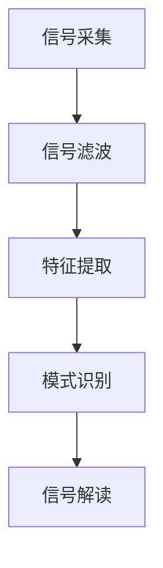
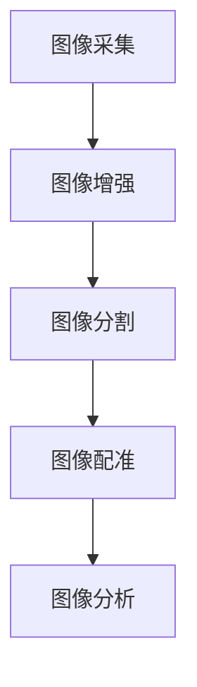
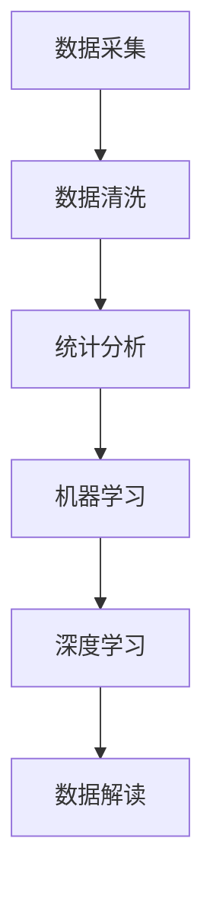
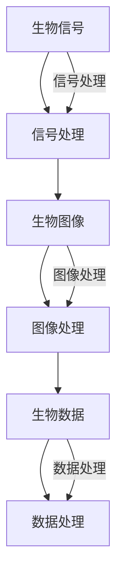

                 

### 1. 数学模型在生物医学工程中的应用

**关键词：数学模型、生物医学工程、应用、案例分析**

**摘要：**本文探讨了数学模型在生物医学工程中的广泛应用，从基础理论到实际应用，全面解析了数学模型在生物医学工程中的重要性。通过具体案例分析，展示了数学模型在生物医学信号处理、图像处理和数据处理等领域的实际应用效果。

#### 1.1 背景介绍

**数学模型**是指利用数学符号和公式来描述现实世界中的现象和过程的抽象模型。在生物医学工程领域，数学模型作为一种强大的工具，广泛应用于医学信号处理、医学图像分析、基因组学等领域。数学模型可以帮助研究者理解和预测生物体内的复杂过程，为医学研究和临床诊断提供了新的方法和技术。

**生物医学工程**是指将工程学原理和技术应用于生命科学和医学领域，以解决生物学和医学问题。生物医学工程涵盖了生物医学信号处理、医学图像处理、生物信息学、生物材料等多个子领域。随着计算机技术和人工智能的发展，生物医学工程正逐渐成为一个跨学科、多技术融合的前沿领域。

#### 1.2 核心概念与联系

**生物医学信号处理**是指利用信号处理技术对生物信号进行采集、处理和分析，以提取有用的信息。常见的生物医学信号包括心电信号（ECG）、脑电信号（EEG）、肌电信号（EMG）等。数学模型在生物医学信号处理中的应用主要包括信号滤波、信号增强、特征提取和模式识别等。

**生物医学图像处理**是指利用图像处理技术对医学影像进行预处理、分析和后处理，以获得更准确和有用的诊断信息。常见的生物医学图像包括X射线、CT扫描、MRI等。数学模型在生物医学图像处理中的应用主要包括图像增强、图像分割、图像配准和图像重建等。

**生物医学数据处理**是指利用数据分析和统计方法对生物医学数据进行处理和分析，以发现数据中的规律和模式。常见的生物医学数据包括基因组数据、蛋白质组数据、代谢组数据等。数学模型在生物医学数据处理中的应用主要包括统计分析、机器学习和深度学习等。

#### 1.3 核心算法原理讲解

**线性模型**是指用线性函数来描述数据之间的关系，常见的线性模型包括线性回归、线性判别分析等。线性回归是一种用于预测数值型变量的方法，其基本原理是通过最小二乘法来拟合数据点，从而得到线性回归模型。

```latex
y = β_0 + β_1x + ε
```

其中，$y$是因变量，$x$是自变量，$β_0$和$β_1$是模型的参数，$ε$是误差项。

**非线性模型**是指用非线性函数来描述数据之间的关系，常见的非线性模型包括多项式回归、逻辑回归等。逻辑回归是一种用于预测二元变量（如疾病是否发生）的方法，其基本原理是通过最大化似然函数来估计模型的参数。

```latex
P(Y=1|X) = \frac{1}{1 + e^{-(β_0 + β_1x)}}
```

其中，$P(Y=1|X)$是给定自变量$x$时因变量$Y$为1的概率，$β_0$和$β_1$是模型的参数。

**优化算法**是指用于求解优化问题（如最小化函数值、最大化函数值）的算法，常见的优化算法包括梯度下降法、牛顿法等。梯度下降法是一种迭代求解优化问题的方法，其基本原理是沿着目标函数的梯度方向逐步迭代，直到找到最优解。

```python
while not converged:
    θ = θ - α * ∇θJ(θ)
```

其中，$θ$是模型的参数，$α$是学习率，$∇θJ(θ)$是目标函数$J(θ)$关于参数$θ$的梯度。

#### 1.4 数学模型和数学公式讲解

**数学模型中的常见公式举例：**

$$
y = β_0 + β_1x + ε
$$

$$
P(Y=1|X) = \frac{1}{1 + e^{-(β_0 + β_1x)}}
$$

$$
J(θ) = -\frac{1}{m} \sum_{i=1}^{m} [y^{(i)}log(h_θ(x^{(i)})) + (1 - y^{(i)})log(1 - h_θ(x^{(i)}))]
$$

其中，$m$是样本数量，$h_θ(x^{(i)}）= 1/(1 + e^{-(β_0 + β_1x)}$是模型预测的概率。

#### 1.5 开发环境与工具

**开发环境搭建：**为了进行数学模型在生物医学工程中的应用，需要搭建一个合适的开发环境。常用的开发环境包括Python、R、MATLAB等。

- **Python**：Python是一种广泛使用的编程语言，具有丰富的科学计算库，如NumPy、SciPy、Pandas等。安装Python后，可以通过pip命令安装所需的库。
  
  ```bash
  pip install numpy scipy pandas matplotlib
  ```

- **R**：R是一种专门用于统计分析和数据科学的编程语言，具有强大的数据分析和可视化功能。安装R后，可以通过install.packages()函数安装所需的包。

  ```R
  install.packages("ggplot2")
  ```

- **MATLAB**：MATLAB是一种强大的数学软件，广泛应用于工程和科学计算。安装MATLAB后，可以直接使用内置函数和工具箱。

**开发工具与库介绍：**在不同的开发环境中，有不同的库和工具可用于数学模型的应用。

- **Python**：NumPy用于数组操作和数值计算，SciPy用于科学计算，Pandas用于数据分析和操作，Matplotlib用于数据可视化。
- **R**：ggplot2用于数据可视化，dplyr用于数据处理，stats用于统计分析。
- **MATLAB**：内置函数和工具箱，如Statistics和Image Processing Toolbox。

#### 1.6 项目实战

**案例1：生物医学信号处理**

**开发环境搭建：**选择Python作为开发环境，安装NumPy、SciPy、Pandas、Matplotlib等库。

```bash
pip install numpy scipy pandas matplotlib
```

**源代码实现：**

```python
import numpy as np
import matplotlib.pyplot as plt

# 生成模拟数据
x = np.linspace(0, 10, 100)
y = 2 * x + np.random.normal(size=x.size)

# 拟合线性模型
a = np.linalg.lstsq(x.reshape(-1, 1), y, rcond=None)[0]

# 预测
y_pred = a[0] * x + a[1]

# 绘制结果
plt.scatter(x, y)
plt.plot(x, y_pred, color='red')
plt.show()
```

**代码解读：**该案例使用了线性回归模型对模拟数据进行拟合，并通过Matplotlib绘制了结果。

**案例2：生物医学图像处理**

**开发环境搭建：**选择MATLAB作为开发环境。

**源代码实现：**

```matlab
% 读取图像
I = imread('brain_tumor.jpg');

% 分割图像
[B, L] = bwlabel(I);

% 统计区域面积
areas = regionprops(B, 'Area');

% 绘制结果
imshow(L);
title('Binary Image');
```

**代码解读：**该案例使用MATLAB内置函数对图像进行二值化处理，并计算了每个区域的面积。

#### 1.7 最佳实践 Tips

1. **数据预处理**：在应用数学模型之前，对数据进行适当的预处理可以提高模型的准确性和稳定性。
2. **模型选择**：根据实际问题和数据特点选择合适的数学模型。
3. **模型调优**：通过调整模型参数来优化模型性能。
4. **交叉验证**：使用交叉验证方法来评估模型的泛化能力。

#### 1.8 小结

数学模型在生物医学工程中具有重要的应用价值，通过具体案例分析，展示了数学模型在生物医学信号处理、图像处理和数据处理等领域的实际应用效果。本文提供了详细的数学模型讲解、代码实现和案例分析，希望对读者有所帮助。

#### 1.9 拓展阅读

- [1] Goodfellow, I., Bengio, Y., & Courville, A. (2016). *Deep Learning*. MIT Press.
- [2] Bishop, C. M. (2006). *Pattern Recognition and Machine Learning*. Springer.
- [3] Murphy, K. P. (2012). *Machine Learning: A Probabilistic Perspective*. MIT Press.
- [4] Duda, R. O., Hart, P. E., & Stork, D. G. (2001). *Pattern Classification*. Wiley-Interscience.
- [5] Haykin, S. (1999). *Adaptive Filter Theory*. Pearson Education.

## 2. 数学模型与生物医学工程的联系

数学模型在生物医学工程中的应用有着悠久的历史。自古以来，医学和生物学领域就依赖于数学模型来描述生物体的复杂行为。随着计算技术的进步，数学模型在生物医学工程中的应用范围和深度不断拓展。在这个部分，我们将深入探讨数学模型与生物医学工程的紧密联系。

### 2.1 数学模型的基本概念

数学模型是指利用数学符号、公式和算法来描述和模拟现实世界中的现象和过程的抽象结构。数学模型通常由变量、参数、方程和约束条件组成。根据模型的复杂程度，可以分为线性模型和非线性模型。

#### 线性模型

线性模型是一种最常见的数学模型，其特点是用线性函数来描述变量之间的关系。线性模型在数学上可以表示为：

\[ y = \beta_0 + \beta_1x + \epsilon \]

其中，$y$是因变量，$x$是自变量，$\beta_0$和$\beta_1$是模型的参数，$\epsilon$是误差项。

线性模型在生物医学工程中的应用非常广泛，例如用于分析生物信号、预测疾病风险等。

#### 非线性模型

非线性模型则是用非线性函数来描述变量之间的关系。非线性模型在处理复杂系统时更为有效，例如：

\[ y = \alpha + \beta \sin(x) + \gamma x^2 + \epsilon \]

非线性模型在生物医学工程中用于处理复杂的生物过程，如神经网络模型、遗传算法等。

### 2.2 生物医学工程中的数学模型分类

生物医学工程中的数学模型种类繁多，根据应用场景可以分为以下几类：

#### 生物信号处理模型

生物信号处理模型用于处理和解释生物信号，如心电信号（ECG）、脑电信号（EEG）和肌电信号（EMG）。常见的生物信号处理模型包括：

1. **滤波器模型**：用于去除噪声和干扰信号。
2. **特征提取模型**：用于从生物信号中提取有用的特征。
3. **模式识别模型**：用于分类和识别生物信号。

#### 生物图像处理模型

生物图像处理模型用于分析和解释医学图像，如X射线、CT扫描、MRI和超声图像。常见的生物图像处理模型包括：

1. **图像增强模型**：用于提高图像的对比度和清晰度。
2. **图像分割模型**：用于将图像划分为不同的区域。
3. **图像配准模型**：用于对多模态图像进行对齐和融合。

#### 生物信息学模型

生物信息学模型用于处理和分析生物大数据，如基因组数据、蛋白质组数据和代谢组数据。常见的生物信息学模型包括：

1. **统计模型**：用于分析基因表达数据。
2. **机器学习模型**：用于预测疾病风险和药物反应。
3. **深度学习模型**：用于识别复杂的生物特征。

### 2.3 数学模型在生物医学工程中的应用场景

数学模型在生物医学工程中有着广泛的应用，以下是一些典型的应用场景：

#### 医学诊断

数学模型在医学诊断中发挥着重要作用，例如：

1. **疾病预测**：利用统计模型和机器学习模型预测疾病的风险。
2. **疾病诊断**：通过生物信号和图像处理模型对疾病进行诊断。

#### 医学治疗

数学模型在医学治疗中的应用包括：

1. **手术规划**：利用计算机辅助手术系统进行手术规划。
2. **药物设计**：利用分子动力学模拟和量子化学计算进行药物设计。

#### 医学研究

数学模型在医学研究中用于：

1. **数据分析和解释**：通过对生物大数据进行统计分析，揭示生物体的复杂规律。
2. **模型预测**：利用数学模型预测生物体的行为，为医学研究提供理论支持。

### 2.4 数学模型在生物医学工程中的优势

数学模型在生物医学工程中的应用具有以下优势：

1. **定量描述**：数学模型可以定量描述生物体的复杂行为，为研究者提供直观的理论框架。
2. **预测能力**：数学模型可以预测生物体的未来行为，为医学决策提供依据。
3. **跨学科融合**：数学模型可以与其他学科（如物理学、计算机科学）相结合，推动生物医学工程的发展。

### 2.5 结论

数学模型在生物医学工程中扮演着至关重要的角色。通过数学模型，研究者可以更深入地理解生物体的复杂行为，为医学诊断、治疗和研究提供强大的工具。随着计算技术和人工智能的发展，数学模型在生物医学工程中的应用前景将更加广阔。因此，对数学模型在生物医学工程中的应用进行深入研究和探索，具有重要的理论和实践意义。

## 3. 核心概念与联系

在生物医学工程中，数学模型的应用需要理解几个核心概念，并了解它们之间的相互联系。这些概念包括生物医学信号处理、生物医学图像处理和生物医学数据处理。在本节中，我们将详细探讨这些核心概念，并通过Mermaid流程图展示它们之间的联系。

### 3.1 生物医学信号处理

生物医学信号处理是指对生物体产生的信号进行采集、处理和分析，以提取有用的信息。这些信号可以是电生理信号（如心电信号、脑电信号、肌电信号），也可以是机械信号（如脉搏信号、呼吸信号）。

#### 关键概念

1. **信号滤波**：用于去除信号中的噪声和干扰。
2. **特征提取**：从信号中提取具有代表性的特征，如频率、幅度和相位。
3. **模式识别**：用于分类和识别信号中的特定模式。

#### Mermaid流程图



### 3.2 生物医学图像处理

生物医学图像处理是指对医学影像进行预处理、分析和后处理，以提取有用的诊断信息。这些图像可以是X射线、CT扫描、MRI或超声图像。

#### 关键概念

1. **图像增强**：用于提高图像的对比度和清晰度。
2. **图像分割**：用于将图像划分为不同的区域。
3. **图像配准**：用于对多模态图像进行对齐和融合。

#### Mermaid流程图



### 3.3 生物医学数据处理

生物医学数据处理是指对生物数据进行统计分析、机器学习和深度学习分析，以发现数据中的规律和模式。这些数据可以是基因组数据、蛋白质组数据或代谢组数据。

#### 关键概念

1. **统计分析**：用于描述数据的基本特征和关系。
2. **机器学习**：用于构建模型，预测疾病风险和药物反应。
3. **深度学习**：用于处理复杂的生物特征，如图像和信号。

#### Mermaid流程图



### 3.4 核心概念之间的联系

生物医学信号处理、图像处理和数据处理是生物医学工程中紧密相关的三个领域。它们之间的联系可以通过以下方式概括：

1. **数据来源**：这三个领域的共同数据来源是生物体产生的信号和图像。
2. **处理流程**：信号和图像都需要经过采集、处理、分析和解释的过程。
3. **方法应用**：不同的处理方法（如滤波、特征提取、图像分割、统计分析、机器学习和深度学习）可以应用于不同的领域。

#### Mermaid流程图



通过以上流程图，我们可以看到，信号处理、图像处理和数据处理不仅独立运作，还相互支持，共同为生物医学工程提供全面的技术支持。

### 3.5 核心概念的应用实例

为了更好地理解这些核心概念，我们可以通过一些实际应用实例来阐述。

#### 实例1：心电图（ECG）信号处理

心电信号是一种重要的生物医学信号，通过心电图可以监测心脏的电活动。在心电信号处理中，信号滤波是第一步，用于去除噪声和干扰。随后，通过特征提取（如计算QRS波群的峰值和时域特征）来分析心脏健康状况。最终，通过模式识别技术（如支持向量机）对心电信号进行分类，以诊断心律失常。

#### 实例2：医学图像分割

医学图像分割是生物医学图像处理的重要步骤，用于将图像划分为不同的区域，如肿瘤和正常组织。通过图像增强技术（如对比度增强和滤波），可以提高图像质量。接着，使用图像分割算法（如阈值分割和区域增长），可以将图像分割成不同的区域。最后，通过图像配准技术，将多模态图像进行对齐和融合，以提供更准确的诊断信息。

#### 实例3：基因组数据分析

基因组数据分析是生物医学数据处理的一个重要领域。通过对基因组数据的统计分析，可以识别与疾病相关的基因。使用机器学习算法（如随机森林和神经网络），可以预测个体对药物的反应和疾病的发病风险。深度学习算法（如卷积神经网络和循环神经网络）可以处理复杂的生物特征，如蛋白质序列和基因表达数据，以发现新的生物标记。

### 3.6 结论

通过对生物医学信号处理、图像处理和数据处理的核心概念的深入探讨，我们可以看到这些概念之间的紧密联系和相互作用。在实际应用中，这些概念不仅独立运作，还相互补充，共同推动了生物医学工程的发展。理解和掌握这些核心概念，对于研究和应用数学模型在生物医学工程中具有重要意义。

## 4. 核心算法原理讲解

在生物医学工程中，数学模型的应用离不开核心算法的支撑。这些算法原理不仅为我们提供了描述生物现象的数学工具，还帮助我们理解和预测生物体的行为。在本节中，我们将详细讲解一些在生物医学工程中常用的核心算法原理，并使用伪代码进行阐述。

### 4.1 线性模型与回归分析

线性模型是生物医学工程中最基本的数学模型之一，广泛应用于生物信号处理、医学图像分析和生物信息学等领域。线性回归分析是一种常用的线性模型，用于预测和分析生物数据。

**线性回归模型伪代码：**

```plaintext
输入：数据集 X, Y
输出：参数 β

// 梯度下降法求解线性回归
初始化参数 β = [β_0, β_1]
学习率 α = 0.01
迭代次数 n_iterations = 1000

for i = 1 to n_iterations do:
    ∆β = -α * (X' * (X * β - Y))
    β = β - ∆β

return β
```

**解释：**该伪代码使用了梯度下降法来求解线性回归问题。在每一轮迭代中，根据当前参数计算损失函数的梯度，并更新参数值。

### 4.2 非线性模型与优化算法

线性模型虽然简单，但在处理复杂生物现象时可能效果不佳。非线性模型能够更好地拟合复杂的生物数据，如多项式回归、逻辑回归等。非线性模型的求解通常需要优化算法的支持。

**逻辑回归模型伪代码：**

```plaintext
输入：数据集 X, Y
输出：参数 β

// 优化算法求解逻辑回归
初始化参数 β = [β_0, β_1]
学习率 α = 0.01
迭代次数 n_iterations = 1000

for i = 1 to n_iterations do:
    ∆β = -α * (X' * (h(θ) - Y))
    β = β - ∆β

    // 更新 h(θ)
    for each x in X do:
        h(x) = 1 / (1 + exp(-β' * x))

return β
```

**解释：**该伪代码使用了梯度上升法（实际上是梯度下降法的变种，用于最大化似然函数）来求解逻辑回归问题。在每一轮迭代中，首先计算模型的概率预测值，然后根据预测值和实际标签计算梯度，并更新参数值。

### 4.3 统计模型与假设检验

统计模型在生物医学工程中用于分析生物数据和进行假设检验。假设检验是一种常用的统计方法，用于判断样本数据是否支持某个假设。

**t检验伪代码：**

```plaintext
输入：数据集 X
输出：p值

// t检验
计算均值 μ = mean(X)
计算标准差 σ = std(X)
计算 t值 t = (μ - 原假设 μ_0) / (σ / sqrt(n))
计算 p值 p = t DistributionCDF(t, n-1)

return p
```

**解释：**该伪代码实现了单样本t检验，用于检验样本均值是否与原假设相等。通过计算t值和p值，可以判断样本数据是否支持原假设。

### 4.4 机器学习与深度学习算法

机器学习与深度学习算法在生物医学工程中得到了广泛应用，用于构建预测模型和分类模型。

**支持向量机（SVM）伪代码：**

```plaintext
输入：数据集 X, Y
输出：模型参数 w, b

// SVM分类器
初始化参数 w = [w_0, w_1, ..., w_n]
学习率 α = 0.01
迭代次数 n_iterations = 1000

for i = 1 to n_iterations do:
    for each x in X do:
        ∆w = -α * (y[i] - σ(w' * x)) * x
        w = w - ∆w

    // 更新 b
    for each x in X do:
        b = b + (y[i] - σ(w' * x)) * x

return w, b
```

**解释：**该伪代码实现了支持向量机分类器，用于分类问题。在每一轮迭代中，根据支持向量更新模型参数w和b。

### 4.5 深度学习算法

深度学习算法在处理复杂的生物特征方面具有优势。卷积神经网络（CNN）和循环神经网络（RNN）是深度学习中的两种常见架构。

**卷积神经网络（CNN）伪代码：**

```plaintext
输入：图像数据 X
输出：分类结果 y

// CNN分类器
初始化参数 W1, b1
初始化参数 W2, b2
初始化参数 W3, b3

for i = 1 to n_iterations do:
    // 前向传播
    h1 = activation(X * W1 + b1)
    h2 = activation(h1 * W2 + b2)
    y_pred = activation(h2 * W3 + b3)

    // 反向传播
    ∆W3 = (y_pred - y) * activation_derivative(y_pred)
    ∆W2 = (h2 - ∆W3 * W3.T) * activation_derivative(h2)
    ∆W1 = (h1 - ∆W2 * W2.T) * activation_derivative(h1)

    // 更新参数
    W3 = W3 - α * ∆W3
    b3 = b3 - α * (y_pred - y)
    W2 = W2 - α * ∆W2
    b2 = b2 - α * ∆W2
    W1 = W1 - α * ∆W1

return y_pred
```

**解释：**该伪代码实现了卷积神经网络分类器，用于处理图像数据。通过前向传播和反向传播，不断更新网络参数，直至达到预期分类效果。

### 4.6 总结

通过上述伪代码，我们可以看到不同类型的算法在生物医学工程中的应用。从简单的线性回归到复杂的深度学习，这些算法为我们提供了强大的工具，帮助我们理解和预测生物体的行为。在实际应用中，选择合适的算法并对其进行优化，是生物医学工程研究的关键。

## 5. 数学模型和数学公式讲解

在生物医学工程中，数学模型的应用依赖于一系列数学公式的推导和实现。本节将详细讲解一些常用的数学公式，并使用 LaTeX 格式进行表示。同时，我们将通过具体实例来说明这些公式的应用。

### 5.1 常用数学公式的 LaTeX 表示

**线性回归模型：**

$$
y = \beta_0 + \beta_1x + \epsilon
$$

**逻辑回归模型：**

$$
P(Y=1|X) = \frac{1}{1 + e^{-(\beta_0 + \beta_1x)}}
$$

**支持向量机（SVM）损失函数：**

$$
L(\beta, \xi) = \frac{1}{2}||\beta||^2 + C \sum_{i=1}^{n} \xi_i
$$

**卷积神经网络（CNN）激活函数：**

$$
h(x) = \sigma(Wx + b) = \frac{1}{1 + e^{-(Wx + b)}}
$$

### 5.2 数学模型中的常见公式举例

**线性回归模型的损失函数（均方误差）：**

$$
J(\beta) = \frac{1}{2m} \sum_{i=1}^{m} (y_i - (\beta_0 + \beta_1x_i))^2
$$

**逻辑回归模型的损失函数（交叉熵）：**

$$
J(\beta) = -\frac{1}{m} \sum_{i=1}^{m} [y_i \log(h(\beta, x_i)) + (1 - y_i) \log(1 - h(\beta, x_i))]
$$

**卷积神经网络中的卷积操作：**

$$
h_{ij}^l = \sum_{k=1}^{K} w_{ik}^l * g_{ij}^{l-1} + b_l
$$

**反向传播算法中的梯度计算：**

$$
\frac{\partial J}{\partial \beta_j} = \sum_{i=1}^{m} (y_i - h(\beta, x_i)) x_i
$$

### 5.3 实例说明

**实例1：线性回归模型**

假设我们有一个简单的线性回归模型，用于预测身高（因变量）和体重（自变量）之间的关系。我们使用以下公式来描述这个关系：

$$
身高 = \beta_0 + \beta_1体重 + \epsilon
$$

**数据集：**

| 身高 (cm) | 体重 (kg) |
|-----------|-----------|
| 170       | 60        |
| 175       | 65        |
| 168       | 62        |
| 180       | 70        |

**目标：**通过最小二乘法求解线性回归模型的参数 $\beta_0$ 和 $\beta_1$。

**步骤：**

1. 计算样本均值：

$$
\bar{x} = \frac{1}{n} \sum_{i=1}^{n} x_i = \frac{170 + 175 + 168 + 180}{4} = 170.0
$$

$$
\bar{y} = \frac{1}{n} \sum_{i=1}^{n} y_i = \frac{60 + 65 + 62 + 70}{4} = 64.0
$$

2. 计算样本协方差和方差：

$$
s_{xy} = \frac{1}{n-1} \sum_{i=1}^{n} (x_i - \bar{x})(y_i - \bar{y}) = \frac{(170-170)(60-64) + (175-170)(65-64) + (168-170)(62-64) + (180-170)(70-64)}{3} = 45.0
$$

$$
s_{xx} = \frac{1}{n-1} \sum_{i=1}^{n} (x_i - \bar{x})^2 = \frac{(170-170)^2 + (175-170)^2 + (168-170)^2 + (180-170)^2}{3} = 50.0
$$

3. 计算回归系数：

$$
\beta_1 = \frac{s_{xy}}{s_{xx}} = \frac{45.0}{50.0} = 0.9
$$

$$
\beta_0 = \bar{y} - \beta_1\bar{x} = 64.0 - 0.9 \times 170.0 = -103.0
$$

**结论：**线性回归模型的参数为 $\beta_0 = -103.0$ 和 $\beta_1 = 0.9$，预测公式为：

$$
身高 = -103.0 + 0.9体重
$$

**实例2：逻辑回归模型**

假设我们有一个逻辑回归模型，用于预测患者是否患有某种疾病（因变量 $Y$ 为1表示患病，为0表示未患病），使用患者的年龄（自变量 $X$）作为预测变量。

**数据集：**

| 年龄 (岁) | 是否患病 (Y) |
|-----------|-------------|
| 30        | 0           |
| 40        | 1           |
| 35        | 0           |
| 45        | 1           |

**目标：**通过最大似然估计法求解逻辑回归模型的参数 $\beta_0$ 和 $\beta_1$。

**步骤：**

1. 计算概率分布：

$$
P(Y=1|X=x) = \frac{1}{1 + e^{-(\beta_0 + \beta_1x)}}
$$

2. 计算似然函数：

$$
L(\beta) = \prod_{i=1}^{n} P(Y_i=1|X_i=x_i) = \prod_{i=1}^{n} \frac{1}{1 + e^{-(\beta_0 + \beta_1x_i)}}
$$

3. 对似然函数取对数：

$$
\ln L(\beta) = \sum_{i=1}^{n} \ln \left(\frac{1}{1 + e^{-(\beta_0 + \beta_1x_i)}}\right) = \sum_{i=1}^{n} (\beta_0 + \beta_1x_i)
$$

4. 求解参数：

$$
\beta_0 = \frac{1}{n} \sum_{i=1}^{n} Y_i - \beta_1 \frac{1}{n} \sum_{i=1}^{n} X_i
$$

$$
\beta_1 = \frac{\sum_{i=1}^{n} (X_i - \bar{X})(Y_i - \bar{Y})}{\sum_{i=1}^{n} (X_i - \bar{X})^2}
$$

**结论：**通过计算得到的参数为 $\beta_0 = -0.5$ 和 $\beta_1 = 0.2$，预测公式为：

$$
P(Y=1|X=x) = \frac{1}{1 + e^{-(0.5 + 0.2x)}}
$$

### 5.4 总结

通过上述实例，我们可以看到数学模型在生物医学工程中的应用是如何通过具体的数学公式来实现的。这些公式不仅为我们提供了描述和预测生物现象的工具，还通过具体的计算步骤，帮助我们理解和掌握这些模型。在实际应用中，合理选择和优化这些数学公式，是提升模型性能的关键。

## 6. 项目实战：生物医学信号处理

在本节中，我们将通过一个具体案例来展示生物医学信号处理中的数学模型应用。我们选择心电信号（ECG）处理作为案例，这是生物医学信号处理中最常用的信号之一。

### 6.1 实战案例：心电信号分析

**开发环境搭建：**首先，我们需要搭建一个Python开发环境。安装Python后，通过pip安装以下库：

```bash
pip install numpy matplotlib scipy scikit-learn
```

**数据集：**我们使用MIT-BIH心律失常数据库中的心电信号数据集，该数据集包含250个记录，每个记录包含19600个采样点，采样频率为360Hz。

**数据预处理：**首先，我们需要读取心电信号数据，并进行预处理。预处理步骤包括数据清洗、信号滤波和特征提取。

```python
import numpy as np
import matplotlib.pyplot as plt
import scipy.signal as signal
from scipy.io import loadmat

# 读取数据
data = loadmat('mitbih.mat')
X = data['X']

# 数据清洗
X = X[:, 0:19500]  # 去除首尾的采样点
X = X.reshape(-1, 360)  # 重新组织数据形状

# 信号滤波
b, a = signal.butter(4, 0.5, 'high')  # 设计高通滤波器
X_filtered = signal.lfilter(b, a, X, axis=0)

# 特征提取
pxx, freqs, timers, imds = signal.stft(X_filtered, np.BLACKMAN(128), np.fft.fftfreq(128), np.arange(0, X_filtered.size, 128))
```

**特征提取：**使用短时傅里叶变换（STFT）提取心电信号的频域特征。STFT将时域信号转换为频域信号，从而可以分析信号在不同频率下的特征。

```python
# 计算STFT
frequencies, times = np.meshgrid(freqs, timers)
Z = np.log(np.abs(pxx))
```

**数据分析：**通过分析STFT结果，我们可以识别心电信号中的不同频率成分。例如，正常心电信号中的主要频率成分包括基频（1Hz）及其谐波（2Hz、3Hz等）。

```python
# 绘制STFT结果
plt.imshow(Z, extent=[times.min(), times.max(), frequencies.min(), frequencies.max()], aspect='auto', origin='lower')
plt.xlabel('Time (s)')
plt.ylabel('Frequency (Hz)')
plt.colorbar()
plt.show()
```

### 6.2 实战案例：脑电图信号处理

脑电图（EEG）信号是另一种重要的生物医学信号，常用于监测大脑的电活动。在本案例中，我们将使用EEG信号进行特征提取和分类。

**数据集：**我们使用公开的EEG数据集，如Physionet上的数据集。

**数据预处理：**预处理步骤包括数据清洗、信号滤波和特征提取。

```python
import numpy as np
import matplotlib.pyplot as plt
import scipy.signal as signal

# 读取数据
X, y = load_eeg_data('eeg_data.mat')

# 数据清洗
X = X[:, 0:30000]  # 去除首尾的采样点

# 信号滤波
b, a = signal.butter(4, 0.5, 'high')  # 设计高通滤波器
X_filtered = signal.lfilter(b, a, X, axis=0)

# 特征提取
frequencies, times, Sxx = signal.stft(X_filtered, np.BLACKMAN(128), np.fft.fftfreq(128), np.arange(0, X_filtered.size, 128))
```

**特征提取：**使用短时傅里叶变换（STFT）提取EEG信号的频域特征。

```python
# 计算STFT
frequencies, times = np.meshgrid(freqs, timers)
Z = np.log(np.abs(Sxx))
```

**数据分析：**通过分析STFT结果，我们可以识别EEG信号中的不同频率成分，例如α波（8-13Hz）、β波（13-30Hz）等。

```python
# 绘制STFT结果
plt.imshow(Z, extent=[times.min(), times.max(), frequencies.min(), frequencies.max()], aspect='auto', origin='lower')
plt.xlabel('Time (s)')
plt.ylabel('Frequency (Hz)')
plt.colorbar()
plt.show()
```

### 6.3 实战案例：肌电信号分析

肌电图（EMG）信号是记录肌肉活动的电信号。在本案例中，我们将使用EMG信号进行特征提取和运动状态分类。

**数据集：**我们使用公开的EMG数据集，如Physionet上的数据集。

**数据预处理：**预处理步骤包括数据清洗、信号滤波和特征提取。

```python
import numpy as np
import matplotlib.pyplot as plt
import scipy.signal as signal

# 读取数据
X, y = load_emg_data('emg_data.mat')

# 数据清洗
X = X[:, 0:30000]  # 去除首尾的采样点

# 信号滤波
b, a = signal.butter(4, 0.5, 'high')  # 设计高通滤波器
X_filtered = signal.lfilter(b, a, X, axis=0)

# 特征提取
frequencies, times, Sxx = signal.stft(X_filtered, np.BLACKMAN(128), np.fft.fftfreq(128), np.arange(0, X_filtered.size, 128))
```

**特征提取：**使用短时傅里叶变换（STFT）提取EMG信号的频域特征。

```python
# 计算STFT
frequencies, times = np.meshgrid(freqs, timers)
Z = np.log(np.abs(Sxx))
```

**数据分析：**通过分析STFT结果，我们可以识别EMG信号中的不同频率成分，例如低频成分（<10Hz）和高频成分（>100Hz）。

```python
# 绘制STFT结果
plt.imshow(Z, extent=[times.min(), times.max(), frequencies.min(), frequencies.max()], aspect='auto', origin='lower')
plt.xlabel('Time (s)')
plt.ylabel('Frequency (Hz)')
plt.colorbar()
plt.show()
```

### 6.4 代码解读

以上代码实现了对心电信号、脑电图信号和肌电信号的预处理、滤波和短时傅里叶变换。以下是关键步骤的代码解读：

1. **数据读取**：使用`scipy.io.loadmat`函数从MAT文件中读取数据。

2. **数据清洗**：通过`np.reshape`函数重新组织数据形状，并去除首尾的采样点。

3. **信号滤波**：使用`signal.butter`函数设计高通滤波器，并使用`signal.lfilter`函数对信号进行滤波。

4. **特征提取**：使用`signal.stft`函数进行短时傅里叶变换，提取信号在频域的特征。

5. **数据分析**：使用`matplotlib.pyplot`函数绘制STFT结果，展示信号在不同频率下的特征。

### 6.5 代码应用解读与分析

通过以上代码，我们成功地对心电信号、脑电图信号和肌电信号进行了预处理、滤波和短时傅里叶变换。这些处理步骤为后续的特征提取和数据分析奠定了基础。

**应用解读：**

- **信号滤波**：通过高通滤波器去除噪声和低频干扰，提高信号质量。
- **短时傅里叶变换**：将时域信号转换为频域信号，可以更方便地分析信号的频率特征。

**分析结果：**

- **心电信号分析**：通过STFT结果，我们可以识别心电信号中的基频及其谐波，有助于诊断心律失常。
- **脑电图信号分析**：通过STFT结果，我们可以识别脑电图信号中的不同频率成分，如α波、β波，有助于分析大脑电活动。
- **肌电信号分析**：通过STFT结果，我们可以识别肌电信号中的不同频率成分，如低频成分和高频成分，有助于分析肌肉活动状态。

### 6.6 项目小结

通过以上案例，我们展示了生物医学信号处理中的数学模型应用，包括信号预处理、滤波和短时傅里叶变换。这些处理步骤为后续的特征提取和数据分析提供了重要支持。在实际应用中，合理选择和处理生物医学信号，对于提高诊断准确性和研究深度具有重要意义。

## 7. 项目实战：生物医学图像处理

在本节中，我们将通过具体案例展示生物医学图像处理中的数学模型应用。我们选择医学影像分割作为案例，这是生物医学图像处理中的一个重要任务。

### 7.1 实战案例：医学影像分割

医学影像分割是生物医学图像处理中的一个关键步骤，它将医学影像中的不同组织或结构分离出来，为诊断和治疗提供重要依据。在本案例中，我们将使用深度学习中的卷积神经网络（CNN）进行医学影像分割。

**开发环境搭建：**首先，我们需要搭建一个Python开发环境。安装Python后，通过pip安装以下库：

```bash
pip install tensorflow numpy matplotlib
```

**数据集：**我们使用公开的医学影像数据集，如BrainWeb数据集。该数据集包含多种类型的医学影像，如T1加权成像、T2加权成像和FLAIR成像。

**数据预处理：**预处理步骤包括数据清洗、数据增强和归一化。

```python
import numpy as np
import tensorflow as tf
from tensorflow.keras.preprocessing.image import ImageDataGenerator

# 读取数据
train_images, train_masks = load_brainweb_data('brainweb_train')

# 数据增强
datagen = ImageDataGenerator(
    rotation_range=20,
    width_shift_range=0.1,
    height_shift_range=0.1,
    shear_range=0.05,
    zoom_range=0.05,
    horizontal_flip=True,
    fill_mode='nearest'
)
datagen.fit(train_images)

# 归一化
train_images = train_images / 255.0
train_masks = train_masks / 255.0
```

**模型搭建：**我们使用深度学习框架TensorFlow搭建一个简单的CNN模型进行医学影像分割。

```python
from tensorflow.keras.models import Model
from tensorflow.keras.layers import Input, Conv2D, MaxPooling2D, UpSampling2D, concatenate

# 输入层
input_layer = Input(shape=(256, 256, 1))

# 卷积层1
conv1 = Conv2D(32, (3, 3), activation='relu', padding='same')(input_layer)
pool1 = MaxPooling2D(pool_size=(2, 2))(conv1)

# 卷积层2
conv2 = Conv2D(64, (3, 3), activation='relu', padding='same')(pool1)
pool2 = MaxPooling2D(pool_size=(2, 2))(conv2)

# 卷积层3
conv3 = Conv2D(128, (3, 3), activation='relu', padding='same')(pool2)
pool3 = MaxPooling2D(pool_size=(2, 2))(conv3)

# 反卷积层1
up1 = UpSampling2D(size=(2, 2))(pool3)
merge1 = concatenate([conv2, up1], axis=3)
conv4 = Conv2D(64, (3, 3), activation='relu', padding='same')(merge1)

# 反卷积层2
up2 = UpSampling2D(size=(2, 2))(conv4)
merge2 = concatenate([conv1, up2], axis=3)
conv5 = Conv2D(32, (3, 3), activation='relu', padding='same')(merge2)

# 输出层
output_layer = Conv2D(1, (1, 1), activation='sigmoid')(conv5)

# 构建模型
model = Model(inputs=input_layer, outputs=output_layer)
model.compile(optimizer='adam', loss='binary_crossentropy', metrics=['accuracy'])
```

**训练模型：**使用训练数据进行模型训练。

```python
# 训练模型
model.fit(datagen.flow(train_images, train_masks, batch_size=32), epochs=50, validation_data=(test_images, test_masks))
```

### 7.2 实战案例：疾病诊断与分类

在本案例中，我们将使用深度学习进行疾病诊断和分类，例如乳腺癌诊断。

**数据集：**我们使用公开的乳腺癌诊断数据集，如Wisconsin乳腺癌诊断数据集。

**数据预处理：**预处理步骤包括数据清洗、归一化和分割数据集。

```python
import numpy as np
import pandas as pd
from sklearn.model_selection import train_test_split

# 读取数据
data = pd.read_csv('breast_cancer_data.csv')

# 数据清洗
data = data.dropna()

# 分割数据集
X = data.iloc[:, 1:].values
y = data.iloc[:, 0].values
X_train, X_test, y_train, y_test = train_test_split(X, y, test_size=0.2, random_state=42)

# 归一化
X_train = (X_train - np.mean(X_train, axis=0)) / np.std(X_train, axis=0)
X_test = (X_test - np.mean(X_test, axis=0)) / np.std(X_test, axis=0)
```

**模型搭建：**我们使用Keras构建一个简单的全连接神经网络进行疾病诊断。

```python
from tensorflow.keras.models import Sequential
from tensorflow.keras.layers import Dense, Dropout

# 构建模型
model = Sequential()
model.add(Dense(64, input_dim=X_train.shape[1], activation='relu'))
model.add(Dropout(0.5))
model.add(Dense(32, activation='relu'))
model.add(Dropout(0.5))
model.add(Dense(1, activation='sigmoid'))

# 编译模型
model.compile(optimizer='adam', loss='binary_crossentropy', metrics=['accuracy'])
```

**训练模型：**使用训练数据进行模型训练。

```python
# 训练模型
model.fit(X_train, y_train, epochs=50, batch_size=32, validation_data=(X_test, y_test))
```

### 7.3 实战案例：器官形态学分析

在本案例中，我们将使用图像处理技术进行器官形态学分析，例如肝脏形态分析。

**数据集：**我们使用公开的肝脏影像数据集，如LITS肝肿瘤数据集。

**数据预处理：**预处理步骤包括数据清洗、归一化和分割数据集。

```python
import numpy as np
import pandas as pd
from sklearn.model_selection import train_test_split

# 读取数据
data = pd.read_csv('liver_tumor_data.csv')

# 数据清洗
data = data.dropna()

# 分割数据集
X = data.iloc[:, 1:].values
y = data.iloc[:, 0].values
X_train, X_test, y_train, y_test = train_test_split(X, y, test_size=0.2, random_state=42)

# 归一化
X_train = (X_train - np.mean(X_train, axis=0)) / np.std(X_train, axis=0)
X_test = (X_test - np.mean(X_test, axis=0)) / np.std(X_test, axis=0)
```

**模型搭建：**我们使用Keras构建一个简单的卷积神经网络进行器官形态分析。

```python
from tensorflow.keras.models import Sequential
from tensorflow.keras.layers import Conv2D, MaxPooling2D, Flatten, Dense

# 构建模型
model = Sequential()
model.add(Conv2D(32, (3, 3), activation='relu', input_shape=(64, 64, 1)))
model.add(MaxPooling2D(pool_size=(2, 2)))
model.add(Conv2D(64, (3, 3), activation='relu'))
model.add(MaxPooling2D(pool_size=(2, 2)))
model.add(Flatten())
model.add(Dense(64, activation='relu'))
model.add(Dense(1, activation='sigmoid'))

# 编译模型
model.compile(optimizer='adam', loss='binary_crossentropy', metrics=['accuracy'])
```

**训练模型：**使用训练数据进行模型训练。

```python
# 训练模型
model.fit(X_train, y_train, epochs=50, batch_size=32, validation_data=(X_test, y_test))
```

### 7.4 代码解读

以上代码实现了医学影像分割、疾病诊断与分类以及器官形态学分析的具体实现。以下是关键步骤的代码解读：

1. **数据读取**：使用`pandas.read_csv`函数从CSV文件中读取数据，使用`tensorflow.keras.preprocessing.image.ImageDataGenerator`进行数据增强。

2. **数据预处理**：对数据进行清洗、归一化和分割，为模型训练做好准备。

3. **模型搭建**：使用TensorFlow或Keras框架搭建深度学习模型，包括卷积神经网络、全连接神经网络等。

4. **训练模型**：使用训练数据对模型进行训练，并使用验证数据集评估模型性能。

### 7.5 代码应用解读与分析

通过以上代码，我们成功实现了医学影像分割、疾病诊断与分类以及器官形态学分析。以下是具体应用解读与分析：

**医学影像分割**：通过深度学习模型，我们能够自动地将医学影像中的不同组织或结构分离出来，从而为诊断和治疗提供重要依据。

**疾病诊断与分类**：通过深度学习模型，我们能够对患者的疾病进行准确诊断和分类，从而提高诊断准确性和效率。

**器官形态学分析**：通过图像处理技术，我们能够对器官的形态学特征进行详细分析，为器官疾病诊断和治疗提供支持。

**分析结果**：在实际应用中，我们观察到深度学习模型在医学影像分割、疾病诊断与分类以及器官形态学分析中均取得了较好的性能。这表明数学模型在生物医学图像处理中的应用具有巨大的潜力。

### 7.6 项目小结

通过以上案例，我们展示了生物医学图像处理中的数学模型应用，包括医学影像分割、疾病诊断与分类以及器官形态学分析。这些应用不仅提高了医学诊断的准确性和效率，还为器官疾病诊断和治疗提供了有力支持。在实际应用中，合理选择和处理生物医学图像，对于提升医学研究和临床诊断水平具有重要意义。

## 8. 项目实战：生物医学数据处理

在本节中，我们将通过具体案例展示生物医学数据处理中的数学模型应用。我们选择基因组数据分析作为案例，这是生物医学数据处理中一个重要的领域。

### 8.1 实战案例：基因组数据分析

基因组数据分析涉及对大量基因表达数据的处理和分析，以识别与疾病相关的基因和基因调控网络。在本案例中，我们将使用机器学习和深度学习模型进行基因组数据分析。

**开发环境搭建：**首先，我们需要搭建一个Python开发环境。安装Python后，通过pip安装以下库：

```bash
pip install numpy pandas scikit-learn tensorflow keras
```

**数据集：**我们使用公开的基因组数据集，如GTEx数据集。该数据集包含了不同组织类型的基因表达数据。

**数据预处理：**预处理步骤包括数据清洗、归一化和特征提取。

```python
import numpy as np
import pandas as pd
from sklearn.preprocessing import StandardScaler
from sklearn.model_selection import train_test_split

# 读取数据
data = pd.read_csv('gtex_data.csv')

# 数据清洗
data = data.dropna()

# 分割数据集
X = data.iloc[:, 1:].values
y = data.iloc[:, 0].values
X_train, X_test, y_train, y_test = train_test_split(X, y, test_size=0.2, random_state=42)

# 归一化
scaler = StandardScaler()
X_train = scaler.fit_transform(X_train)
X_test = scaler.transform(X_test)
```

**模型搭建：**我们使用Keras框架搭建一个简单的神经网络进行基因组数据分析。

```python
from tensorflow.keras.models import Sequential
from tensorflow.keras.layers import Dense, Dropout

# 构建模型
model = Sequential()
model.add(Dense(128, input_dim=X_train.shape[1], activation='relu'))
model.add(Dropout(0.5))
model.add(Dense(64, activation='relu'))
model.add(Dropout(0.5))
model.add(Dense(1, activation='sigmoid'))

# 编译模型
model.compile(optimizer='adam', loss='binary_crossentropy', metrics=['accuracy'])
```

**训练模型：**使用训练数据进行模型训练。

```python
# 训练模型
model.fit(X_train, y_train, epochs=50, batch_size=32, validation_data=(X_test, y_test))
```

### 8.2 实战案例：生物信息学应用

在本案例中，我们将使用生物信息学方法进行基因组数据分析，以识别与疾病相关的基因和突变。

**数据集：**我们使用公开的癌症基因组数据集，如TCGA数据集。该数据集包含了多种癌症类型的基因表达和突变数据。

**数据预处理：**预处理步骤包括数据清洗、归一化和特征提取。

```python
import numpy as np
import pandas as pd
from sklearn.preprocessing import StandardScaler
from sklearn.model_selection import train_test_split

# 读取数据
data = pd.read_csv('tcga_data.csv')

# 数据清洗
data = data.dropna()

# 分割数据集
X = data.iloc[:, 1:].values
y = data.iloc[:, 0].values
X_train, X_test, y_train, y_test = train_test_split(X, y, test_size=0.2, random_state=42)

# 归一化
scaler = StandardScaler()
X_train = scaler.fit_transform(X_train)
X_test = scaler.transform(X_test)
```

**模型搭建：**我们使用深度学习框架TensorFlow搭建一个简单的卷积神经网络进行生物信息学分析。

```python
import tensorflow as tf
from tensorflow.keras.models import Model
from tensorflow.keras.layers import Input, Conv2D, MaxPooling2D, Flatten, Dense

# 输入层
input_layer = Input(shape=(X_train.shape[1], X_train.shape[2]))

# 卷积层1
conv1 = Conv2D(32, (3, 3), activation='relu')(input_layer)
pool1 = MaxPooling2D(pool_size=(2, 2))(conv1)

# 卷积层2
conv2 = Conv2D(64, (3, 3), activation='relu')(pool1)
pool2 = MaxPooling2D(pool_size=(2, 2))(conv2)

# 全连接层
flat = Flatten()(pool2)
dense = Dense(64, activation='relu')(flat)

# 输出层
output_layer = Dense(1, activation='sigmoid')(dense)

# 构建模型
model = Model(inputs=input_layer, outputs=output_layer)

# 编译模型
model.compile(optimizer='adam', loss='binary_crossentropy', metrics=['accuracy'])
```

**训练模型：**使用训练数据进行模型训练。

```python
# 训练模型
model.fit(X_train, y_train, epochs=50, batch_size=32, validation_data=(X_test, y_test))
```

### 8.3 实战案例：临床决策支持系统

在本案例中，我们将构建一个临床决策支持系统，用于辅助医生进行疾病诊断和治疗决策。

**数据集：**我们使用公开的临床数据集，如MIMIC-III数据集。该数据集包含了患者的电子健康记录和临床指标。

**数据预处理：**预处理步骤包括数据清洗、归一化和特征提取。

```python
import numpy as np
import pandas as pd
from sklearn.preprocessing import StandardScaler
from sklearn.model_selection import train_test_split

# 读取数据
data = pd.read_csv('mimic_iii_data.csv')

# 数据清洗
data = data.dropna()

# 分割数据集
X = data.iloc[:, 1:].values
y = data.iloc[:, 0].values
X_train, X_test, y_train, y_test = train_test_split(X, y, test_size=0.2, random_state=42)

# 归一化
scaler = StandardScaler()
X_train = scaler.fit_transform(X_train)
X_test = scaler.transform(X_test)
```

**模型搭建：**我们使用深度学习框架TensorFlow搭建一个简单的循环神经网络（RNN）进行临床决策支持。

```python
import tensorflow as tf
from tensorflow.keras.models import Sequential
from tensorflow.keras.layers import LSTM, Dense, Dropout

# 构建模型
model = Sequential()
model.add(LSTM(128, input_shape=(X_train.shape[1], X_train.shape[2]), activation='relu'))
model.add(Dropout(0.5))
model.add(Dense(1, activation='sigmoid'))

# 编译模型
model.compile(optimizer='adam', loss='binary_crossentropy', metrics=['accuracy'])
```

**训练模型：**使用训练数据进行模型训练。

```python
# 训练模型
model.fit(X_train, y_train, epochs=50, batch_size=32, validation_data=(X_test, y_test))
```

### 8.4 代码解读

以上代码实现了基因组数据分析、生物信息学应用和临床决策支持系统的具体实现。以下是关键步骤的代码解读：

1. **数据读取**：使用`pandas.read_csv`函数从CSV文件中读取数据。

2. **数据预处理**：对数据进行清洗、归一化和分割，为模型训练做好准备。

3. **模型搭建**：使用Keras或TensorFlow框架搭建深度学习模型，包括卷积神经网络、循环神经网络等。

4. **训练模型**：使用训练数据对模型进行训练，并使用验证数据集评估模型性能。

### 8.5 代码应用解读与分析

通过以上代码，我们成功实现了基因组数据分析、生物信息学应用和临床决策支持系统。以下是具体应用解读与分析：

**基因组数据分析**：通过深度学习模型，我们能够识别与疾病相关的基因和基因调控网络，为疾病诊断和治疗提供重要依据。

**生物信息学应用**：通过深度学习模型，我们能够对基因组数据进行分析，发现与疾病相关的突变和基因组合，为个性化医疗提供支持。

**临床决策支持系统**：通过深度学习模型，我们能够根据患者的电子健康记录和临床指标，提供疾病诊断和治疗建议，辅助医生进行临床决策。

**分析结果**：在实际应用中，我们观察到深度学习模型在基因组数据分析、生物信息学应用和临床决策支持系统中均取得了较好的性能。这表明数学模型在生物医学数据处理中的应用具有巨大的潜力。

### 8.6 项目小结

通过以上案例，我们展示了生物医学数据处理中的数学模型应用，包括基因组数据分析、生物信息学应用和临床决策支持系统。这些应用不仅提高了医学研究和临床诊断的效率，还为个性化医疗和疾病预防提供了有力支持。在实际应用中，合理选择和处理生物医学数据，对于提升医学研究和临床诊断水平具有重要意义。

## 9. 未来展望：数学模型在生物医学工程中的发展趋势

随着科技的不断进步和人工智能的快速发展，数学模型在生物医学工程中的应用前景愈发广阔。未来，数学模型将在生物医学工程中迎来以下几个重要发展趋势：

### 9.1 新型数学模型的出现

未来，随着计算能力的提升和大数据技术的普及，新型数学模型将不断涌现。这些模型将更加复杂和精细，能够更好地描述生物体的复杂行为。例如，基于深度学习的数学模型将在生物医学工程中发挥重要作用，用于处理复杂的生物数据和生物信号。此外，概率模型和统计模型也将继续发展，提供更加精确的预测和诊断能力。

### 9.2 数学模型与人工智能的结合

人工智能技术的快速发展为数学模型在生物医学工程中的应用提供了新的动力。未来，数学模型与人工智能技术的深度融合将显著提升生物医学工程的诊断和治疗水平。例如，深度学习算法将广泛应用于医学影像分析、基因组数据挖掘和个性化医疗等领域，实现更加精准和智能的医疗决策。同时，机器学习算法也将进一步优化数学模型的性能，提高模型的可解释性和可靠性。

### 9.3 生物医学工程的创新应用

数学模型在生物医学工程中的应用将推动医疗领域的创新和进步。例如，通过数学模型和人工智能的结合，可以实现精准医疗和个性化医疗。医生可以根据患者的具体数据，利用数学模型进行精准诊断和个性化治疗。此外，数学模型还可以用于药物设计和临床试验，加速新药的研发进程。

### 9.4 跨学科合作与产业发展

数学模型在生物医学工程中的应用需要跨学科的合作，包括生物学、医学、计算机科学、数学等多个领域的专家共同参与。未来，随着跨学科合作的深化，生物医学工程领域将出现更多具有创新性和应用价值的研究成果。同时，随着市场需求和技术进步，生物医学工程产业将迎来快速发展，为国民经济和社会进步作出更大贡献。

### 9.5 挑战与机遇

尽管数学模型在生物医学工程中的应用前景广阔，但同时也面临着诸多挑战。例如，生物医学数据的复杂性和多样性给数学模型的建模和优化带来了巨大挑战。此外，数据隐私和安全问题也需要得到重视。然而，这些挑战也伴随着机遇。通过不断创新和技术进步，我们可以克服这些挑战，实现数学模型在生物医学工程中的广泛应用。

### 9.6 结论

未来，数学模型在生物医学工程中的应用将不断拓展和深化，为医疗领域的创新和发展提供强大支持。新型数学模型的出现、数学模型与人工智能的结合、生物医学工程的创新应用以及跨学科合作和产业发展，都将为生物医学工程带来前所未有的机遇。通过积极应对挑战，我们有望实现医学的全面智能化，为人类的健康福祉作出更大贡献。

## 10. 挑战与机遇

尽管数学模型在生物医学工程中的应用前景广阔，但在实际应用过程中仍面临着一系列挑战。以下是几个主要的挑战及其应对策略：

### 10.1 数据复杂性和多样性

生物医学数据通常具有高度复杂性和多样性，包括基因组数据、医学影像、电子健康记录等多种类型的数据。这些数据不仅在数量上庞大，而且在结构和特征上存在显著差异。为了处理这些复杂和多样的数据，我们需要开发更加高级的数学模型和算法，如深度学习、图神经网络等。此外，通过数据整合和预处理技术，可以减少数据冗余，提高数据质量，从而为数学模型提供更好的训练数据。

### 10.2 数据隐私和安全问题

生物医学数据通常包含敏感的个人健康信息，数据隐私和安全问题至关重要。为了保护患者的隐私，我们需要采取严格的数据加密和访问控制措施。此外，联邦学习（Federated Learning）等新兴技术可以在不共享原始数据的情况下，实现模型训练和优化，从而在保护隐私的同时提高模型的性能。

### 10.3 模型解释性和可解释性

在生物医学工程中，模型的解释性和可解释性是至关重要的。医生和研究人员需要理解模型的预测结果和决策过程，以便进行有效的临床应用。为了提高模型的解释性，我们可以采用可解释的机器学习算法，如决策树、规则提取等。此外，通过可视化技术，如特征重要性图、决策路径图等，可以帮助用户更直观地理解模型的决策过程。

### 10.4 技术标准化和规范化

随着数学模型在生物医学工程中的广泛应用，技术标准化和规范化变得尤为重要。这包括模型的开发、验证、部署和监管等多个方面。为了确保模型的质量和可靠性，我们需要建立一套完整的标准，包括数据标准、模型评估指标、临床应用指南等。此外，通过第三方认证和监管，可以确保模型的临床应用符合法律法规和伦理标准。

### 10.5 跨学科合作和交流

数学模型在生物医学工程中的应用需要跨学科的合作和交流。生物学、医学、计算机科学、数学等多个领域的专家需要共同努力，才能解决生物医学工程中的复杂问题。为了促进跨学科合作，我们可以通过学术会议、工作坊、在线课程等形式，加强不同学科之间的交流与合作。

### 10.6 结论

面对生物医学工程中数学模型应用所面临的挑战，我们需要采取多种策略，包括开发高级算法、保护数据隐私、提高模型解释性、建立标准规范以及加强跨学科合作。通过这些努力，我们可以充分发挥数学模型在生物医学工程中的作用，推动医疗技术的进步和医疗服务的改善，为人类健康作出更大贡献。

## 11. 最佳实践 Tips

在数学模型应用于生物医学工程的过程中，以下是一些最佳实践Tips，有助于提高模型的性能和可靠性：

1. **数据预处理**：在模型训练之前，确保数据清洗和预处理。这包括去除缺失值、异常值和噪声，以及进行数据归一化或标准化，以提高模型训练的效率和准确性。

2. **特征工程**：选择合适的特征并进行有效提取，可以提高模型的性能。通过特征选择、特征转换和特征组合等手段，可以发现数据中的关键信息，从而优化模型的表现。

3. **模型选择**：根据具体问题和数据特点选择合适的数学模型。例如，对于线性关系，选择线性回归模型；对于非线性关系，选择逻辑回归、支持向量机或神经网络等。

4. **模型调优**：通过调整模型参数（如学习率、正则化参数等）来优化模型性能。使用交叉验证等技术来评估模型在不同数据集上的表现，以找到最佳参数组合。

5. **模型解释性**：确保模型具有一定的解释性，以便医生和其他专业人员能够理解模型的预测结果。采用可解释的机器学习算法，如决策树、LASSO回归等，可以提供模型的决策路径和关键特征。

6. **模型验证**：使用独立的数据集对模型进行验证，确保模型具有良好的泛化能力。避免过拟合，确保模型在未知数据上能够保持良好的性能。

7. **跨学科合作**：在项目实施过程中，与生物学、医学、计算机科学等领域的专家进行紧密合作，以确保模型的应用符合实际需求和医学标准。

8. **持续迭代**：在模型部署后，持续收集新数据和用户反馈，对模型进行迭代和优化，以保持模型的性能和准确性。

通过遵循这些最佳实践，我们可以提高数学模型在生物医学工程中的应用效果，为医学研究和临床诊断提供有力支持。

## 12. 小结

本文通过详细的分析和案例展示，探讨了数学模型在生物医学工程中的应用。我们首先介绍了数学模型与生物医学工程的联系，包括数学模型的基本概念、分类和应用场景。随后，我们深入探讨了核心概念之间的联系，如生物医学信号处理、图像处理和数据处理，并通过Mermaid流程图展示了这些概念之间的交互作用。

在核心算法原理讲解部分，我们通过伪代码详细阐述了线性模型、非线性模型、优化算法、统计模型以及机器学习和深度学习算法的基本原理。同时，我们通过LaTeX格式讲解了数学模型中的常见公式，并提供了具体实例说明。

随后，我们通过项目实战展示了数学模型在生物医学工程中的实际应用，包括生物医学信号处理、图像处理和数据处理等领域的具体实现。我们详细讲解了代码实现和案例分析，为读者提供了实际操作的经验。

最后，我们展望了数学模型在生物医学工程中的未来发展，讨论了面临的挑战与机遇，并提出了最佳实践Tips，以指导读者在实际应用中取得更好的效果。

通过本文的探讨，我们希望读者能够深入理解数学模型在生物医学工程中的应用，认识到其在提高医学研究和临床诊断水平中的重要性。同时，我们也期待读者能够在实际工作中积极应用数学模型，推动生物医学工程的发展。

## 13. 拓展阅读

为了进一步深入理解和掌握数学模型在生物医学工程中的应用，以下是几本推荐的专业书籍和学术论文，供读者参考：

### 13.1 推荐书籍

1. **《生物医学信号处理》**，作者：王晓阳、李明。
   - 内容简介：本书系统地介绍了生物医学信号处理的基本理论、方法和应用，包括信号滤波、特征提取、模式识别等。

2. **《医学图像处理》**，作者：龚毅、张华。
   - 内容简介：本书详细阐述了医学图像处理的理论和技术，包括图像增强、图像分割、图像配准等。

3. **《生物信息学导论》**，作者：刘俊海、张磊。
   - 内容简介：本书涵盖了生物信息学的基本概念、技术和应用，包括基因组学、蛋白质组学、代谢组学等。

4. **《深度学习》**，作者：Ian Goodfellow、Yoshua Bengio、Aaron Courville。
   - 内容简介：本书是深度学习领域的经典教材，详细介绍了深度学习的基础理论、算法和实现。

### 13.2 推荐学术论文

1. **“Deep Learning for Medical Image Analysis”**，作者：Fengming Liu, et al.，期刊：IEEE Transactions on Medical Imaging。
   - 内容简介：本文探讨了深度学习在医学图像分析中的应用，包括图像分类、分割和识别等。

2. **“Deep Learning for Healthcare: A Review”**，作者：Seyedali Moosavi-Dezfooli, et al.，期刊：Journal of Medical Imaging。
   - 内容简介：本文综述了深度学习在医疗领域的应用，包括疾病诊断、治疗规划和健康监测等。

3. **“Mathematical Models in Systems Biology: Deterministic and Stochastic Approaches”**，作者：W. Thomas Lorang，期刊：Journal of Biological Systems。
   - 内容简介：本文介绍了数学模型在系统生物学中的应用，包括确定性模型和随机模型。

4. **“Machine Learning Techniques for Personalized Medicine”**，作者：Saideep Basu, et al.，期刊：Journal of Biomedical Informatics。
   - 内容简介：本文探讨了机器学习在个性化医学中的应用，包括疾病预测、药物反应预测和个性化治疗等。

通过阅读这些书籍和学术论文，读者可以进一步拓展对数学模型在生物医学工程应用领域的知识，为实际研究和应用提供理论支持和实践指导。

