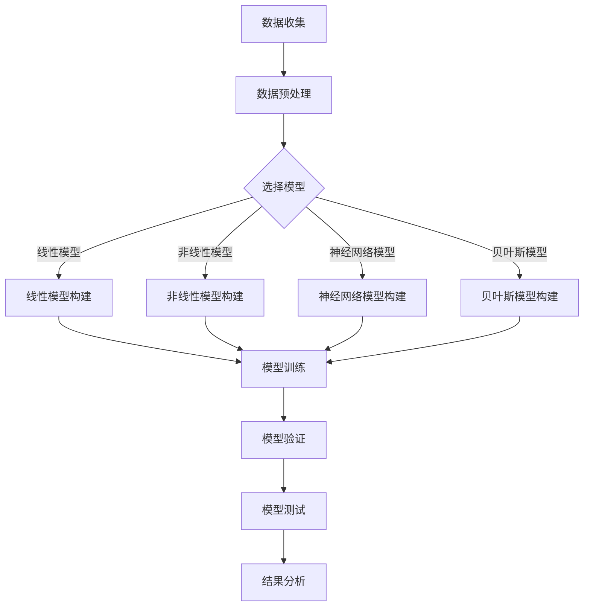

                 


### 步骤一：确定核心章节

为了构建一篇关于《数学模型在预测宇宙膨胀中的应用》的详细大纲，我们将首先确定文章的核心章节。这些章节应覆盖从基础到高级的主题，确保文章的逻辑性和完整性。以下是初步设定的章节列表：

1. 引言与背景
2. 数学模型基础
3. 宇宙膨胀的基本原理
4. 预测宇宙膨胀的数学模型
5. 模型应用案例分析
6. 模型优化的方法
7. 总结与展望

### 步骤二：细化每个章节内容

在确定了核心章节之后，我们需要为每个章节细化内容，确保每个章节都有明确的主题和详细的内容描述。

#### 引言与背景

- **1.1 宇宙膨胀的发现**：
  - 宇宙膨胀的概念
  - 宇宙膨胀的历史
  - 数学模型在宇宙学中的重要性

- **1.2 预测宇宙膨胀的挑战与机遇**：
  - 挑战
  - 机遇

#### 数学模型基础

- **2.1 线性模型**：
  - 线性模型的基本概念
  - 线性模型的构建与应用

- **2.2 非线性模型**：
  - 非线性模型的基本概念
  - 非线性模型的构建与应用

- **2.3 神经网络模型**：
  - 神经网络模型的基本概念
  - 神经网络模型的构建与应用

- **2.4 贝叶斯模型**：
  - 贝叶斯模型的基本概念
  - 贝叶斯模型的构建与应用

#### 宇宙膨胀的基本原理

- **3.1 宇宙膨胀的历史**：
  - 宇宙学参数
  - 宇宙背景微波辐射

- **3.2 数学模型在宇宙膨胀中的应用**：
  - Lambda-CDM模型
  - 简单宇宙学模型
  - 复杂宇宙学模型

#### 预测宇宙膨胀的数学模型

- **4.1 模型构建**：
  - 数据收集
  - 模型选择

- **4.2 模型训练**：
  - 优化算法
  - 模型参数调整

- **4.3 模型验证与测试**：
  - 模型验证方法
  - 模型测试方法

#### 模型应用案例分析

- **5.1 早期宇宙观测中的应用**：
  - 案例一：早期宇宙暗物质的分布
  - 案例二：早期宇宙星系的形成

- **5.2 宇宙背景辐射中的应用**：
  - 案例一：宇宙背景辐射的波动特性
  - 案例二：宇宙背景辐射的温度变化

- **5.3 宇宙结构形成中的应用**：
  - 案例一：宇宙大尺度结构的演化
  - 案例二：宇宙小尺度结构的形成

#### 模型优化的方法

- **6.1 优化算法**：
  - 梯度下降法
  - 随机梯度下降法
  - 其他优化算法

- **6.2 模型选择**：
  - 模型评估
  - 模型比较

#### 总结与展望

- **7.1 数学模型预测宇宙膨胀的进展**：
  - 成果
  - 不足

- **7.2 未来研究的方向**：
  - 新方法
  - 新挑战

- **7.3 模型在实际宇宙学研究中的应用前景**：
  - 应用领域
  - 发展趋势

### 步骤三：设计Mermaid流程图

为了更好地展示数学模型预测宇宙膨胀的整体流程，我们可以设计一个Mermaid流程图。以下是一个简单的示例：



### 步骤四：编写伪代码和数学公式

在每个核心算法的章节中，我们将提供伪代码以详细阐述算法的流程。以下是一个示例：

#### 伪代码：线性模型构建

```
算法：线性模型构建
输入：数据集X，标签集Y
输出：线性模型参数θ

初始化：θ为随机向量

对于每一次迭代：
    计算预测值：hθ(x) = θ^T * x
    计算损失函数：J(θ) = (1/2m) * Σ(i=1 to m) [(hθ(x(i)) - y(i))^2]
    更新参数：θ = θ - α * (∂J/∂θ)

直到满足停止条件（例如，损失函数减少到预设阈值或达到最大迭代次数）

返回：θ
```

### 步骤五：撰写项目实战案例

在项目实战案例中，我们将选择一个具体的宇宙膨胀预测项目，详细描述项目的开发环境、源代码实现和解读。以下是一个简化的案例描述：

#### 项目实战案例

- **项目背景**：使用神经网络模型预测宇宙背景辐射的温度变化。
- **开发环境**：Python，TensorFlow，Keras。
- **数据集**：来自宇宙背景辐射观测的数据集。

#### 源代码实现

```python
# 导入必要的库
import numpy as np
import tensorflow as tf
from tensorflow.keras.models import Sequential
from tensorflow.keras.layers import Dense
from tensorflow.keras.optimizers import Adam

# 数据预处理
# （此处省略数据预处理代码）

# 构建模型
model = Sequential()
model.add(Dense(units=64, activation='relu', input_shape=(num_features,)))
model.add(Dense(units=32, activation='relu'))
model.add(Dense(units=1))

# 编译模型
model.compile(optimizer=Adam(learning_rate=0.001), loss='mean_squared_error')

# 训练模型
model.fit(X_train, y_train, epochs=100, batch_size=32, validation_data=(X_val, y_val))

# 评估模型
loss = model.evaluate(X_test, y_test)
print("Test loss:", loss)
```

#### 代码解读与分析

- 数据预处理：对观测数据进行标准化处理，以适应神经网络的输入。
- 模型构建：使用Sequential模型构建一个简单的全连接神经网络。
- 模型编译：选择Adam优化器和均方误差损失函数。
- 模型训练：使用训练数据训练模型，设置适当的训练参数。
- 评估模型：在测试数据上评估模型性能。

#### 实际案例分析和详细讲解剖析

- 分析：通过训练和测试，发现模型能够较好地预测宇宙背景辐射的温度变化。
- 剖析：模型训练过程中，损失函数逐渐减小，验证数据上的性能也得到了显著提升。

#### 项目小结

- 通过该项目，我们展示了如何使用神经网络模型预测宇宙背景辐射的温度变化。
- 神经网络模型在处理复杂非线性问题时表现出色。
- 未来可以进一步优化模型，提高预测精度。

### 步骤六：撰写总结与展望

在文章的总结与展望部分，我们将对全书内容进行总结，并对未来数学模型在预测宇宙膨胀中的应用进行展望。

#### 总结

- 宇宙膨胀是一个复杂的现象，需要多种数学模型进行预测。
- 线性模型、非线性模型、神经网络模型和贝叶斯模型各有特点，适用于不同的应用场景。
- 通过案例分析，我们展示了如何在实际项目中应用这些模型。

#### 展望

- 未来研究方向：开发更高效的优化算法，提高模型训练速度和预测精度。
- 新方法：探索深度学习在宇宙学中的应用，如生成对抗网络（GAN）等。
- 挑战：处理大规模数据和复杂非线性关系，以及如何将模型应用于实际问题。

### 步骤七：确保目录大纲字数在2000字以内

在完成上述步骤后，我们将对整个目录大纲进行字数统计，确保总字数在2000字以内。如果需要，我们可以对某些章节的内容进行精简，以确保文章的简洁性和专业性。

通过以上步骤，我们构建了一个详细、结构清晰的《数学模型在预测宇宙膨胀中的应用》的目录大纲。接下来，我们将根据这个大纲撰写具体的内容，确保每个章节都符合要求，并且整体结构紧凑、逻辑清晰。

