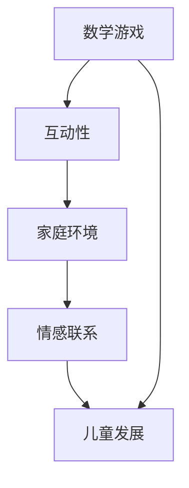

                 

## 引言

数学游戏与家庭亲子互动的结合，不仅能够为孩子们带来无尽的乐趣，更能够激发他们的数学思维，促进智力发展。在这个信息爆炸的时代，家庭亲子互动的形式和内容不断丰富，而数学游戏作为一种独特的教育手段，正逐渐被更多家长和教育工作者所重视。

### 书籍背景与目的

《数学游戏与家庭亲子互动的意义》这本书旨在探讨数学游戏在家庭亲子互动中的应用价值，通过一系列的实践案例和理论分析，帮助家长和教育者更好地理解和运用数学游戏，达到提升儿童数学素养和亲子关系的目的。

本书的主要内容包括数学游戏的基础知识、家庭亲子互动的重要性、数学游戏对儿童发展的作用、设计数学游戏的技巧、家庭亲子互动中的数学游戏实践以及案例分析等。通过这些内容的详细阐述，读者可以全面了解数学游戏与家庭亲子互动的深层次关系，并掌握如何将数学游戏融入日常家庭生活中。

### 数学游戏与家庭亲子互动的关系

数学游戏不仅仅是一种娱乐活动，更是一种教育工具。它通过游戏的形式，将数学知识融入其中，使孩子们在快乐的游戏过程中不知不觉地掌握数学概念和技巧。家庭亲子互动则是家长与孩子之间的情感交流和学习互动，它能够促进孩子的全面发展。将数学游戏与家庭亲子互动相结合，不仅能够激发孩子的数学兴趣，提高他们的数学能力，还能够增强亲子之间的情感联系，构建和谐的家庭氛围。

### 本书结构

本书共分为八个主要章节，每个章节都有其独特的主题和内容：

1. **引言**：介绍书籍的背景和目的，阐述数学游戏与家庭亲子互动的关系。
2. **数学游戏基础**：介绍数学游戏的概念、分类和起源与发展。
3. **家庭亲子互动概述**：阐述家庭亲子互动的重要性、基本原则和类型。
4. **数学游戏在儿童发展中的作用**：探讨数学游戏对儿童认知、情感和社交发展的益处。
5. **数学游戏设计技巧**：讲解设计数学游戏的步骤、选择合适的数学游戏和创造互动性环境。
6. **家庭亲子互动中的数学游戏实践**：提供具体的数学游戏实践案例，包括数字接龙、数学迷宫和数学拼图等。
7. **案例分析**：分析数学游戏在家庭中的实际应用，以及如何通过数学游戏改善亲子关系。
8. **结论与展望**：总结书籍的主要观点，展望数学游戏与家庭亲子互动的未来发展。

通过以上结构，本书将为读者提供全面而深入的指导，帮助他们在家庭中有效地运用数学游戏，提升孩子的数学素养和亲子关系。

### 核心概念与联系

为了更好地理解数学游戏与家庭亲子互动的意义，我们需要探讨几个核心概念之间的关系。首先是数学游戏，它是一种将数学知识和技能融入游戏中的活动，旨在通过互动和挑战激发学生的学习兴趣和思维能力。其次是家庭亲子互动，它是指家长与孩子在家庭环境中进行的各种形式的学习、交流和互动活动，目的是促进孩子的全面发展。

在本书中，数学游戏与家庭亲子互动的关系可以通过一个简单的Mermaid流程图来表示：

这个流程图展示了数学游戏如何通过互动性、家庭环境、情感联系和儿童发展等环节，实现其教育价值和亲子互动的意义。

### 数学游戏对儿童发展的作用

数学游戏不仅能够提供乐趣，还能在多个方面促进儿童的发展。以下是数学游戏对儿童认知、情感和社交发展的具体益处：

#### 认知发展的益处

1. **提高数学思维能力**：数学游戏通过设置不同的数学问题和挑战，帮助孩子们逐步掌握基本的数学概念和运算技巧，提高他们的数学思维能力。
2. **增强逻辑推理能力**：数学游戏往往需要孩子们进行逻辑推理，解决问题，这有助于培养他们的逻辑思维和解决问题的能力。
3. **提升空间认知能力**：许多数学游戏，如拼图、迷宫等，都涉及空间认知，这有助于孩子们理解和运用空间概念。

#### 情感发展的益处

1. **培养耐心和专注力**：数学游戏往往需要一定的耐心和专注力，通过持续的游戏过程，孩子们能够逐步培养这些重要的心理素质。
2. **增强自信心**：在游戏中取得成就，能够增强孩子们的自信心，让他们相信自己有能力克服困难，实现目标。
3. **缓解压力**：数学游戏作为一种放松的方式，可以帮助孩子们缓解学业压力，保持良好的心理状态。

#### 社交发展的益处

1. **促进合作与交流**：许多数学游戏需要孩子们与家长或其他孩子合作完成，这有助于培养他们的合作精神和交流能力。
2. **培养同理心**：通过观察和参与其他孩子的游戏，孩子们能够更好地理解他人的想法和情感，培养同理心。
3. **增强社交技能**：在游戏过程中，孩子们需要学会如何与人沟通、协作和解决问题，这有助于提高他们的社交技能。

通过数学游戏，家长可以与孩子共同参与，不仅能够提高孩子的数学能力，还能促进他们的全面发展。这些游戏不仅丰富了家庭亲子互动的形式，也为孩子们的成长提供了有益的支持。

### 数学游戏设计技巧

设计有效的数学游戏是提升家庭亲子互动质量的关键。以下是一些设计数学游戏的步骤和技巧：

#### 步骤一：明确游戏目标

首先，明确游戏的目标。游戏目标可以是培养孩子的数学技能、提高逻辑推理能力、增强合作精神等。明确目标有助于设计出更具针对性和教育性的游戏。

#### 步骤二：选择合适的数学游戏

选择合适的数学游戏是设计过程中的重要一环。以下是一些常见的数学游戏类型：

1. **拼图游戏**：如数独、拼图等，这些游戏有助于提高空间认知能力和逻辑推理能力。
2. **数字游戏**：如数字接龙、数学记忆游戏等，这些游戏有助于提高数学运算和记忆力。
3. **策略游戏**：如数学迷宫、棋类游戏等，这些游戏有助于培养策略思维和解决问题的能力。

#### 步骤三：创造互动性的游戏环境

创造互动性的游戏环境能够增强游戏的趣味性和参与度。以下是一些建议：

1. **设定规则**：清晰的游戏规则能够帮助孩子更好地理解游戏过程，提高游戏的公平性和可操作性。
2. **提供反馈**：及时的反馈能够帮助孩子了解自己的表现，从而进行调整和改进。
3. **创造竞争性**：适当的竞争能够激发孩子的学习兴趣和积极性，但要避免过度竞争，以免给孩子带来压力。

#### 步骤四：设计多样化的游戏形式

多样化的游戏形式能够保持游戏的趣味性和挑战性，从而吸引孩子持续参与。以下是一些设计多样化的游戏形式的方法：

1. **游戏变体**：对基础游戏进行变化，增加难度或规则，以适应不同年龄段和能力的孩子。
2. **主题游戏**：结合孩子的兴趣和喜好，设计特定的主题游戏，如科学探索、角色扮演等。
3. **合作游戏**：设计需要多个人合作完成的游戏，培养孩子的团队合作精神。

通过以上步骤和技巧，家长可以设计出富有创意和教育意义的数学游戏，从而提升家庭亲子互动的质量，促进孩子的全面发展。

### 家庭亲子互动中的数学游戏实践

在家庭亲子互动中，数学游戏不仅可以作为娱乐工具，更是一种有效的教育手段。以下将介绍几个具体的数学游戏实践案例，这些游戏旨在通过趣味性和互动性，帮助孩子更好地理解和掌握数学知识。

#### 实践案例一：数字接龙

**游戏规则**：
- 家长与孩子轮流报数，每次报数时必须比前一个数字大1。
- 如果一方报错或无法继续，则另一方获胜。

**游戏益处**：
- 增强数学运算能力，帮助孩子熟悉基本的加减法。
- 培养反应速度和逻辑思维。

**拓展玩法**：
- 引入负数和分数，增加游戏难度和趣味性。

#### 实践案例二：数学迷宫

**游戏规则**：
- 家长或孩子画出或购买一个数学迷宫，按照迷宫中的提示数字顺序前进。
- 每个房间或区域设置一个数学问题，解决后方可进入下一个房间。

**游戏益处**：
- 提高空间认知能力，增强解决问题的能力。
- 培养对数学问题的兴趣和解决数学问题的技巧。

**拓展玩法**：
- 设置隐藏的难题或谜题，增加游戏的挑战性。

#### 实践案例三：数学拼图

**游戏规则**：
- 使用数学相关的拼图，如数学符号、几何图形等。
- 将拼图打乱，然后进行拼合。

**游戏益处**：
- 增强观察力和空间认知能力。
- 培养耐心和专注力。

**拓展玩法**：
- 结合数学知识，设计特定主题的拼图，如数学公式、数学难题等。

通过这些具体的数学游戏实践案例，家长可以在家庭中轻松地融入数学教育，让孩子们在愉快的氛围中学习和成长。这些游戏不仅能够提高孩子的数学能力，还能增进亲子之间的情感交流，构建和谐的家庭环境。

### 案例分析

为了更好地理解数学游戏在家庭中的实际应用和效果，我们选择了以下三个具体案例进行详细分析。

#### 案例一：数字接龙的家庭实践

在一个典型的周末晚上，张先生和他的女儿小婷一起玩数字接龙游戏。起初，小婷对数字接龙感到有些困惑，但在张先生的耐心指导下，她逐渐掌握了游戏的基本规则。在游戏中，张先生发现小婷的数学运算能力有了明显的提高，她能够快速地报出接下来的数字，甚至能够独立解决一些简单的加减问题。此外，小婷在游戏过程中表现得非常积极和兴奋，这让她对数学产生了浓厚的兴趣。

**效果评估**：
- **数学能力提升**：通过数字接龙，小婷的数学运算能力得到了显著提高，她能够更加熟练地应用加减法。
- **学习兴趣增加**：数字接龙游戏的形式有趣且富有挑战性，小婷在游戏中体验到了数学的乐趣，从而增加了她对数学学习的兴趣。
- **亲子关系改善**：张先生和小婷在游戏中共同参与，互动频繁，这有助于增进他们之间的亲子关系。

#### 案例二：数学迷宫的亲子互动

李女士是一位小学教师，她在家庭中经常与孩子玩数学迷宫游戏。每次游戏开始前，李女士会根据孩子的年龄和数学水平设计不同的迷宫，并设置一些简单的数学问题作为游戏过程中的挑战。例如，在一个特定的房间中，孩子需要解决一个简单的乘法问题后才能继续前进。通过这种方式，李女士不仅提高了孩子的数学能力，还培养了她的空间认知和解决问题的能力。

**效果评估**：
- **数学能力提升**：孩子在数学迷宫游戏中通过解决各种数学问题，逐步提高了对数学知识的理解和应用能力。
- **空间认知能力增强**：数学迷宫游戏需要孩子在三维空间中寻找路径，这有助于培养他们的空间认知能力。
- **解决问题的能力提高**：在游戏过程中，孩子需要不断思考并解决各种难题，这有助于提高他们的逻辑思维和问题解决能力。

#### 案例三：数学拼图的亲子时光

王先生是一名程序员，他喜欢用编程的方式设计数学拼图游戏。每次与孩子一起玩游戏时，王先生会根据孩子的兴趣设计特定的主题，如数学公式、几何图形等。在拼图过程中，孩子需要仔细观察和思考，这有助于提高他们的观察力和耐心。此外，王先生还会与孩子一起讨论拼图中的数学知识，如几何图形的性质和计算方法。

**效果评估**：
- **观察力增强**：孩子在拼图过程中需要仔细观察图形的细节，这有助于提高他们的观察力。
- **耐心和专注力提升**：拼图游戏往往需要一定的时间和耐心，这有助于培养孩子的耐心和专注力。
- **数学知识掌握更加牢固**：通过实际操作和讨论，孩子能够更加深入地理解数学知识，从而提高他们的数学素养。

### 结论与反思

通过以上案例分析，我们可以看到数学游戏在家庭中的实际应用是非常有效的。这些游戏不仅能够提高孩子的数学能力，还能促进他们的全面发展。同时，这些游戏也为家长提供了与孩子互动和沟通的机会，有助于增进亲子关系。

为了更好地实现数学游戏的家庭实践效果，我们提出以下建议：

1. **设计个性化的游戏**：根据孩子的年龄、兴趣和数学水平，设计个性化的数学游戏，确保游戏内容与孩子的需求相匹配。
2. **注重过程而非结果**：在游戏过程中，家长应注重孩子的学习过程和体验，而不是只关注结果。这有助于培养孩子的自信心和兴趣。
3. **创造积极的游戏氛围**：家庭中的游戏氛围应积极、轻松，避免给孩子带来压力。家长应以鼓励和支持为主，让孩子在快乐中学习和成长。

通过合理运用数学游戏，家长可以在家庭中实现高效的教育，帮助孩子全面发展，同时增进亲子关系。

### 结论与展望

数学游戏与家庭亲子互动的结合，不仅在教育领域具有重要意义，更在家庭生活中发挥了不可替代的作用。通过本书的探讨，我们可以看到数学游戏在提升儿童数学能力、促进情感发展和增强社交技能方面的显著效果。同时，家庭亲子互动作为一种重要的教育手段，能够为孩子的全面发展提供有力支持。

在未来的发展中，数学游戏与家庭亲子互动的结合将继续深化。随着技术的进步和教育理念的更新，我们可以预见到更多创新性的数学游戏将被开发出来，以适应不同年龄段和兴趣爱好的孩子。同时，家长和教育工作者也将更加重视家庭亲子互动的作用，通过多种形式的互动，为孩子提供更加丰富和多样的学习体验。

展望未来，数学游戏与家庭亲子互动的结合有望实现以下几方面的发展：

1. **个性化教育**：利用人工智能和大数据分析技术，为每个孩子提供个性化的数学游戏和教育建议，确保游戏和学习内容与孩子的需求高度匹配。
2. **多元化互动**：通过引入虚拟现实（VR）和增强现实（AR）技术，创造更加生动和互动的数学游戏体验，激发孩子的学习兴趣。
3. **跨学科融合**：将数学与其他学科如艺术、科学等相结合，设计跨学科的综合数学游戏，促进孩子的全面发展。
4. **家庭教育与学校教育的有机结合**：家庭与学校共同协作，通过家庭亲子互动与学校教育的有机结合，形成更加完整和系统的教育体系。

总之，数学游戏与家庭亲子互动的结合，不仅有助于提升孩子的数学能力和综合素质，还能够增进亲子关系，营造和谐的家庭氛围。在未来的发展中，我们期待看到更多创新性的数学游戏和教育模式的诞生，为孩子的全面发展提供更多可能。

### 附录

#### 数学游戏资源推荐

1. **数学游戏网站**：
   - **Math Playground**：提供各种数学游戏，适合不同年龄段的学生。
   - **Khan Academy**：涵盖广泛的数学主题，提供互动性的学习和游戏资源。

2. **数学游戏书籍**：
   - 《数学游戏大全》：收录了多种数学游戏，适合家庭亲子互动。
   - 《数学益智游戏》：介绍了各种有趣的数学游戏，有助于提高数学思维。

3. **数学游戏应用**：
   - **Math Blaster**：一款数学射击游戏，适合小学和初中学生。
   - **DragonBox**：通过互动式教学，帮助学生掌握数学概念。

#### 家庭亲子互动技巧指南

1. **建立规律**：确保每天有固定的亲子互动时间，建立良好的家庭学习习惯。
2. **注重沟通**：与孩子进行开放、真诚的沟通，了解他们的兴趣和需求。
3. **鼓励参与**：让孩子参与游戏设计和规则制定，增强他们的参与感和主动性。
4. **创造乐趣**：游戏过程中，注重趣味性和挑战性，让孩子在快乐中学习和成长。

### 拓展阅读

1. **相关研究论文**：
   - “The Impact of Mathematical Games on Children’s Cognitive Development”  
   - “Families as Educators: The Role of Mathematical Games in Early Childhood Education”

2. **专家建议**：
   - **玛丽·阿诺德（Mary Arnold）**：知名数学教育家，著有《数学游戏与家庭学习》。
   - **乔恩·博格斯（Jon Boggs）**：儿童发展专家，提出了“游戏化学习”的理念。

通过以上资源和建议，家长和教育工作者可以更好地运用数学游戏，提升家庭亲子互动的质量，促进孩子的全面发展。

