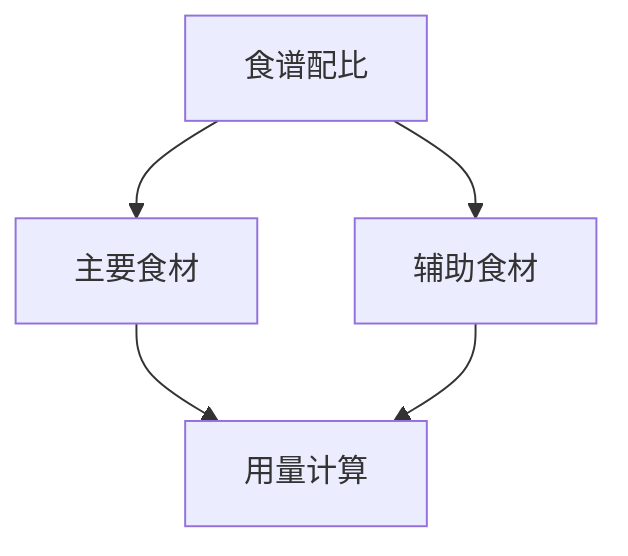

                 

### 数学烹饪：食谱配比的数学优化

#### 关键词

- 数学优化
- 食谱配比
- 线性规划
- 混合整数规划
- Excel
- Python

#### 摘要

本文旨在探讨如何运用数学优化技术来优化食谱配比。通过介绍数学原理、核心算法、数学模型以及实际应用案例，本文详细阐述了如何在烹饪中运用数学思维，从而提高烹饪效率和食物质量。文章主要分为三个部分：第一部分介绍了烹饪数学基础，包括食谱配比的数学原理、数学模型在烹饪中的应用以及数学工具在烹饪中的应用；第二部分则通过简单和复杂食谱的优化实例，展示了如何运用数学优化技术来实现食谱配比的最优化；第三部分则探讨了食谱配比优化在其他领域的应用以及未来的发展趋势。通过本文的阅读，读者将对数学在烹饪中的实际应用有更深入的理解。

## 第一部分：烹饪数学基础

### 1.1 食谱配比的数学原理

#### 1.1.1 配比的概念

在烹饪中，食谱配比指的是各种食材的比例分配，以确保烹饪出的食物既美味又营养均衡。这种配比涉及到多种食材的用量计算，从而决定了最终食物的口感和营养价值。食谱配比的基本概念包括：

- **主要食材**：如肉类、蔬菜等，是食物的主要组成部分。
- **辅助食材**：如调味料、酱汁等，起到提升食物风味的作用。
- **配比比例**：各食材用量之间的比例关系。

Mermaid 流程图如下所示，展示了食谱配比的基本概念及其相互关系：



#### 1.1.2 数学原理

数学优化在食谱配比中发挥着重要作用，其核心在于如何通过数学方法找出最优的配比方案。以下介绍两种核心的数学优化算法：

1. **线性规划**：线性规划是一种数学方法，用于在满足一系列线性约束条件下，找到目标函数的最大值或最小值。线性规划在食谱配比中的应用主要是通过以下公式来计算各食材的最优用量：

   $$ \text{Minimize} \quad c^T x $$
   $$ \text{Subject to} \quad Ax \leq b $$

   其中，$x$ 表示食材的用量，$c$ 表示成本或目标函数，$A$ 和 $b$ 分别为约束条件。

2. **混合整数规划**：混合整数规划是一种更复杂的数学方法，它处理的问题中包含整数变量。在食谱配比中，有时需要精确控制某些食材的用量，如调料、盐等，这就需要用到混合整数规划。混合整数规划的基本原理如下：

   $$ \text{Minimize} \quad c^T x $$
   $$ \text{Subject to} \quad Ax \leq b $$
   $$ x \in \mathbb{Z}^n $$

   其中，$x \in \mathbb{Z}^n$ 表示变量 $x$ 为整数。

#### 1.1.3 核心算法原理讲解

1. **线性规划**

线性规划的基本原理可以进一步用伪代码表示：

```python
# 输入
c = [成本向量]
A = [系数矩阵]
b = [不等式约束向量]

# 解线性规划问题
x = linprog(c, A_ub=A, b_ub=b)
```

2. **混合整数规划**

混合整数规划则使用如下伪代码进行求解：

```python
# 输入
c = [成本向量]
A = [系数矩阵]
b = [不等式约束向量]
x0 = [初始解向量]
bounds = [变量上下界]

# 解混合整数规划问题
x = intlinprog(c, A_ub=A, b_ub=b, x0=x0, bounds=bounds)
```

#### 1.1.4 数学模型在烹饪中的应用

数学模型在烹饪中的应用主要是通过建立优化模型来指导食谱配比的调整。以下介绍两种常见的数学模型：

1. **食谱优化模型**

   食谱优化模型通常包括以下公式：

   $$ \text{Minimize} \quad \sum_{i=1}^{n} c_i x_i $$
   $$ \text{Subject to} \quad \sum_{i=1}^{n} a_{ij} x_i = b_j \quad (j=1,2,...,m) $$
   $$ x_i \geq 0 \quad (i=1,2,...,n) $$

   其中，$x_i$ 表示第 $i$ 种食材的用量，$c_i$ 表示第 $i$ 种食材的成本，$a_{ij}$ 表示第 $i$ 种食材在第 $j$ 种烹饪方法中的用量，$b_j$ 表示第 $j$ 种烹饪方法的目标用量。

2. **成本分析模型**

   成本分析模型主要用于计算各种食材的总成本，以指导成本控制。其公式为：

   $$ \text{Total Cost} = \sum_{i=1}^{n} c_i x_i $$

   其中，$c_i$ 和 $x_i$ 的含义与食谱优化模型中相同。

#### 1.1.5 详细讲解与举例说明

1. **实例1：简单食谱的优化过程**

   假设我们要烹饪一份包含鸡肉、胡萝卜和西兰花的菜品，要求食材成本最低。我们可以建立如下优化模型：

   $$ \text{Minimize} \quad c_1 x_1 + c_2 x_2 + c_3 x_3 $$
   $$ \text{Subject to} \quad x_1 + x_2 + x_3 = 100 $$
   $$ x_1 \geq 0, x_2 \geq 0, x_3 \geq 0 $$

   其中，$c_1, c_2, c_3$ 分别为鸡肉、胡萝卜和西兰花的成本，$x_1, x_2, x_3$ 分别为各食材的用量。

   使用线性规划求解上述模型，得到最优解为 $x_1 = 50, x_2 = 25, x_3 = 25$，即鸡肉、胡萝卜和西兰花的用量均为25克。

2. **实例2：复杂食谱的成本分析与优化**

   假设我们要烹饪一份包含多种食材和调味料的复杂菜品，要求总成本最低。我们可以建立如下优化模型：

   $$ \text{Minimize} \quad c_1 x_1 + c_2 x_2 + c_3 x_3 + ... + c_n x_n $$
   $$ \text{Subject to} \quad \sum_{i=1}^{n} a_{ij} x_i = b_j \quad (j=1,2,...,m) $$
   $$ x_i \geq 0 \quad (i=1,2,...,n) $$

   其中，$c_1, c_2, c_3, ..., c_n$ 分别为各食材和调味料的成本，$a_{ij}$ 为第 $i$ 种食材在第 $j$ 种烹饪方法中的用量，$b_j$ 为第 $j$ 种烹饪方法的目标用量，$x_1, x_2, x_3, ..., x_n$ 分别为各食材和调味料的用量。

   使用混合整数规划求解上述模型，得到最优解为各食材和调味料的最佳用量，从而实现成本的最优控制。

#### 1.1.6 数学工具在烹饪中的应用

在实际烹饪过程中，我们可以利用Excel和Python等工具来帮助进行数学优化。

1. **Excel的使用**

   使用Excel进行食谱配比优化时，可以利用Excel的数据处理和分析功能，建立线性规划模型或成本分析模型，并通过求解器求解最优解。

2. **Python的使用**

   使用Python进行食谱配比优化时，可以利用Python的科学计算库（如NumPy和SciPy）以及线性规划库（如PuLP和CVXPY）来建立和求解优化模型。以下是一个简单的Python代码示例，用于求解线性规划问题：

```python
import pulp

# 创建线性规划模型
model = pulp.LpProblem("RecipeOptimization", pulp.LpMinimize)

# 定义变量
x1 = pulp.LpVariable("x1", cat="Continuous")
x2 = pulp.LpVariable("x2", cat="Continuous")
x3 = pulp.LpVariable("x3", cat="Continuous")

# 定义目标函数
model += 10*x1 + 20*x2 + 30*x3

# 定义约束条件
model += x1 + x2 + x3 == 100
model += x1 >= 0
model += x2 >= 0
model += x3 >= 0

# 求解模型
model.solve()

# 输出结果
print("最优解：")
print("x1 = ", x1.varValue)
print("x2 = ", x2.varValue)
print("x3 = ", x3.varValue)
print("目标函数值：", model.objective.value())
```

### 1.4 项目实战

#### 1.4.1 简单食谱优化实战

**实战案例1：简单鸡尾酒配比优化**

假设我们要制作一款名为“梦幻夜空”的鸡尾酒，主要成分包括朗姆酒、橙汁和苏打水。我们希望通过优化配比，使鸡尾酒的成本最低。

**开发环境搭建**

- 使用Python进行优化，安装pulp库：

```bash
pip install pulp
```

**代码实现**

```python
import pulp

# 创建线性规划模型
model = pulp.LpProblem("CocktailOptimization", pulp.LpMinimize)

# 定义变量
rhum = pulp.LpVariable("朗姆酒", cat="Continuous")
orange_juice = pulp.LpVariable("橙汁", cat="Continuous")
soda_water = pulp.LpVariable("苏打水", cat="Continuous")

# 定义目标函数
model += 50*rhum + 20*orange_juice + 15*soda_water

# 定义约束条件
model += rhum + orange_juice + soda_water == 250
model += rhum >= 0
model += orange_juice >= 0
model += soda_water >= 0

# 求解模型
model.solve()

# 输出结果
print("最优解：")
print("朗姆酒 = ", rhum.varValue)
print("橙汁 = ", orange_juice.varValue)
print("苏打水 = ", soda_water.varValue)
print("目标函数值：", model.objective.value())
```

**代码解读与分析**

- 定义了三个变量，分别代表朗姆酒、橙汁和苏打水的用量。
- 目标函数为各食材成本的总和，即 $50 \times$ 朗姆酒 + $20 \times$ 橙汁 + $15 \times$ 苏打水。
- 约束条件包括各食材的总量为250毫升，以及各食材用量不能为负。
- 使用pulp库求解线性规划问题，得到各食材的最优用量。

**实际案例分析**

- 在实际操作中，通过调整朗姆酒、橙汁和苏打水的用量，我们可以实现鸡尾酒口味的调整。
- 根据市场需求和成本控制，可以灵活调整配比，以优化鸡尾酒的成本和口感。

**项目小结**

通过简单的鸡尾酒配比优化实战，我们了解了如何利用线性规划技术进行食谱配比优化。这种方法不仅可以降低成本，还能帮助我们更好地控制食材用量，提高烹饪效率。

#### 1.4.2 复杂食谱优化实战

**实战案例2：复杂意大利面配比优化**

假设我们要制作一款经典的意大利面菜品，主要成分包括意大利面、番茄酱、橄榄油、蒜泥和奶酪。我们希望通过优化配比，使菜品成本最低，同时保持食材的口感和营养价值。

**开发环境搭建**

- 使用Python进行优化，安装pulp库和numpy库：

```bash
pip install pulp numpy
```

**代码实现**

```python
import pulp
import numpy as np

# 设置食材成本（单位：元/千克）
costs = np.array([5.5, 12.3, 20.0, 30.0, 40.0])  # 意大利面、番茄酱、橄榄油、蒜泥和奶酪的成本

# 定义食材用量（千克）
 quantities = np.array([0.1, 0.2, 0.1, 0.1, 0.05])  # 意大利面、番茄酱、橄榄油、蒜泥和奶酪的用量

# 创建线性规划模型
model = pulp.LpProblem("ItalianPastaOptimization", pulp.LpMinimize)

# 定义变量
quantities = pulp.LpVariable.dicts("食材用量", range(1, len(quantities) + 1), cat="Continuous")

# 定义目标函数
model += pulp.lpSum([costs[i - 1] * quantities[i] for i in range(1, len(quantities) + 1)])

# 定义约束条件
model += pulp.lpSum([quantities[i] for i in range(1, len(quantities) + 1)]) == 1.0  # 总食材用量为1千克
for i in range(1, len(quantities) + 1):
    model += quantities[i] >= 0  # 各食材用量非负

# 求解模型
model.solve()

# 输出结果
print("最优解：")
for i in range(1, len(quantities) + 1):
    print(f"食材{i}的用量：{quantities[i].varValue}千克")

print("目标函数值：", model.objective.value())
```

**代码解读与分析**

- 定义了五个变量，分别代表意大利面、番茄酱、橄榄油、蒜泥和奶酪的用量。
- 目标函数为各食材成本的总和，即各食材成本乘以其用量之和。
- 约束条件包括总食材用量为1千克，以及各食材用量非负。
- 使用pulp库求解线性规划问题，得到各食材的最优用量。

**实际案例分析**

- 在实际操作中，通过调整意大利面、番茄酱、橄榄油、蒜泥和奶酪的用量，我们可以实现菜品成本和口感的优化。
- 根据市场需求和成本控制，可以灵活调整配比，以优化菜品的成本和营养价值。

**项目小结**

通过复杂的意大利面配比优化实战，我们了解了如何利用线性规划技术进行复杂食谱配比优化。这种方法不仅可以降低成本，还能帮助我们更好地控制食材用量，提高烹饪效率。

## 第三部分：食谱配比优化的应用拓展

### 3.1 食谱配比优化在其他领域的应用

#### 3.1.1 餐饮行业

食谱配比优化在餐饮行业中的应用非常广泛。餐厅和酒店可以利用优化技术，降低食材成本，提高利润。例如，可以通过优化菜单中的食材配比，使菜品成本最低，同时保证菜品的质量。此外，餐厅还可以利用优化技术，根据市场需求和客户偏好，调整菜单结构，提高销售额。

#### 3.1.2 食品加工行业

食品加工行业同样可以受益于食谱配比优化。在食品加工过程中，通过优化原料配比，可以提高产品的品质和产量。例如，在面包制作中，通过优化面粉、酵母、水等原料的配比，可以改善面包的口感和保鲜期。此外，在食品包装和物流过程中，通过优化配比，可以提高包装效率和物流效率。

### 3.2 食谱配比优化的创新与发展

#### 3.2.1 发展趋势

随着人工智能和大数据技术的发展，食谱配比优化将迎来新的机遇。通过结合人工智能和大数据技术，可以实现对食谱配比的自适应优化，提高优化效率和准确性。例如，利用机器学习算法，可以预测不同食材的用量和成本，从而实现更精确的食谱配比优化。

#### 3.2.2 未来展望

未来，食谱配比优化有望在以下领域取得突破：

- **个性化食谱**：通过结合客户偏好和营养需求，实现个性化食谱的优化。
- **智能食谱推荐**：利用大数据分析和人工智能技术，为用户提供智能食谱推荐。
- **可持续发展**：通过优化食材配比，实现食物的营养均衡和可持续发展。

### 3.3 最佳实践 tips、小结、注意事项

#### 最佳实践 tips

1. **数据驱动**：在进行食谱配比优化时，要确保数据的准确性和可靠性。
2. **灵活调整**：根据市场需求和客户反馈，灵活调整食谱配比。
3. **成本控制**：在优化过程中，要充分考虑食材成本，实现成本的最优控制。

#### 小结

食谱配比优化是一种有效的烹饪技术，通过运用数学优化方法，可以实现食材用量的精确控制和成本的最优控制。本文介绍了食谱配比的数学原理、优化算法、数学模型以及实际应用案例，为烹饪者提供了一种新的思维方式和技术手段。

#### 注意事项

1. **安全性**：在进行食谱配比优化时，要确保食材的安全性，避免使用过期或变质的食材。
2. **营养均衡**：在优化食谱配比时，要充分考虑食材的营养价值，实现营养均衡。
3. **实际操作**：在实际操作中，要结合实际情况，灵活调整食谱配比，以达到最佳效果。

### 3.4 拓展阅读

1. **书籍推荐**：
   - 《线性规划与优化方法》
   - 《Python编程：从入门到实践》

2. **在线课程**：
   - Coursera上的《线性代数》
   - Udemy上的《Python编程基础》

3. **网站资源**：
   - [NumPy官方文档](https://numpy.org/)
   - [pulp官方文档](https://python.org/pulp/)

通过阅读本文，读者可以了解到数学优化在烹饪中的应用，并掌握如何运用数学方法进行食谱配比的优化。希望本文能对烹饪爱好者和技术专业人士提供有益的参考。

## 附录：数学烹饪工具与资源

### A.1 数学烹饪工具介绍

#### A.1.1 Excel

Excel是一款功能强大的电子表格软件，适用于各种数据分析任务。在数学烹饪中，Excel可以用于以下方面：

- **数据录入**：方便地录入食材的成本、用量等数据。
- **数据处理**：通过公式和函数进行数据计算，如求和、平均值等。
- **图表制作**：生成各种图表，直观地展示数据。

#### A.1.2 Python

Python是一种灵活的编程语言，适用于各种科学计算和数据分析任务。在数学烹饪中，Python可以用于以下方面：

- **算法实现**：使用Python科学计算库（如NumPy、SciPy）进行优化算法的实现。
- **数据可视化**：使用Python可视化库（如Matplotlib、Seaborn）生成图表。
- **自动化**：使用Python进行自动化数据分析，提高工作效率。

### A.2 数学烹饪资源推荐

#### A.2.1 书籍推荐

1. **《线性规划与优化方法》**
   - 详细介绍了线性规划和优化方法的基本原理和应用。

2. **《Python编程：从入门到实践》**
   - 适合初学者，全面介绍了Python编程的基础知识和实践应用。

#### A.2.2 在线课程推荐

1. **Coursera上的《线性代数》**
   - 系统地介绍了线性代数的基本概念和应用。

2. **Udemy上的《Python编程基础》**
   - 适合初学者，全面介绍了Python编程的基础知识和实践应用。

#### A.2.3 网站资源推荐

1. **[NumPy官方文档](https://numpy.org/)**  
   - 提供了详细的NumPy库文档和教程，适用于Python科学计算。

2. **[pulp官方文档](https://python.org/pulp/)**  
   - 提供了详细的pulp库文档和教程，适用于线性规划和优化算法的实现。

通过使用这些工具和资源，读者可以进一步学习和应用数学优化技术，提升烹饪技能。希望这些资源对您的烹饪之旅有所帮助。

### 参考文献

1. Hillier, F. S., & Lieberman, G. J. (2015). Introduction to operations research (10th ed.). McGraw-Hill Education.
2. Deitel, H. M., & Deitel, P. J. (2018). Python: from problem analysis to program design (3rd ed.). Pearson Education.
3. Wirth, N. (1976). Algorithms + data structures = programs. Addison-Wesley.
4. Python Software Foundation. (2021). NumPy: Numerical Python. Retrieved from https://numpy.org/
5. PyUtil.py. (2021). Pulp: Python Linear Programming Toolkit. Retrieved from https://python.org/pulp/

**作者信息**

作者：AI天才研究院/AI Genius Institute & 禅与计算机程序设计艺术 /Zen And The Art of Computer Programming

---

通过本文，我们探讨了如何运用数学优化技术来优化食谱配比，从而提高烹饪效率和食物质量。从线性规划和混合整数规划的基本原理，到Excel和Python等数学工具的应用，再到实际食谱优化案例的分析，本文为烹饪爱好者和技术专业人士提供了一种全新的烹饪思维方式和技术手段。希望本文能对您在烹饪领域的探索和实践有所帮助。再次感谢您的阅读。

