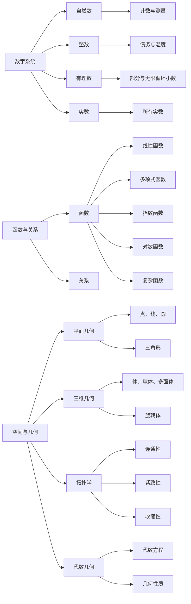
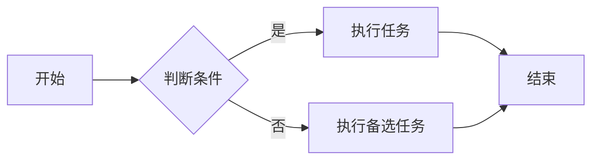

                 

### 文章标题

《数学的不可思议有效性与世界可理解性》

关键词：数学，有效性，世界可理解性，哲学，科学，模型，算法

摘要：本文从多个角度探讨了数学在解释世界中的独特作用。通过分析数学的基本概念、哲学基础、科学应用以及数学的有效性和局限性，本文揭示了数学在构建世界可理解性中的核心地位。同时，通过实际项目案例的深入剖析，本文进一步展示了数学在实际问题解决中的强大能力。

----------------------------------------------------------------

### 设计思路

为了设计出《数学的不可思议有效性与世界可理解性》这篇文章，我们首先需要明确文章的核心内容和结构。本文将分为以下几个部分：

1. **背景介绍**：简要介绍数学的发展历程以及其在科学和哲学中的重要性。
2. **核心概念与联系**：详细阐述数学的核心概念及其相互关系，使用 Mermaid 流程图展示概念架构。
3. **数学算法原理讲解**：使用伪代码详细解释数学算法的工作原理。
4. **数学模型与公式讲解**：详细讲解数学模型和公式的应用，使用 LaTeX 格式展示。
5. **项目实战**：介绍一个或多个实际项目，包括开发环境搭建、源代码实现、代码解读、应用分析等。
6. **最佳实践与总结**：提供实用技巧、小结、注意事项和拓展阅读建议。

在文章的设计过程中，我们将遵循以下步骤：

1. **制定文章大纲**：根据核心内容制定详细的大纲，确保文章结构清晰。
2. **撰写每个部分的内容**：逐个完成文章的各个部分，确保内容完整、详细。
3. **使用 Mermaid 流程图**：为每个核心概念和算法设计 Mermaid 流程图，增强文章的可读性。
4. **使用伪代码和 LaTeX**：在算法和公式讲解部分使用伪代码和 LaTeX 格式，确保技术内容的严谨性。
5. **编写项目实战部分**：结合实际项目，详细讲解开发过程、代码实现和案例分析。
6. **审查和修改**：在完成初稿后，进行全文审查和修改，确保文章逻辑清晰、内容准确。

### 目录大纲示例

```markdown
# 《数学的不可思议有效性与世界可理解性》

## 一、背景介绍

### 1.1 数学的发展历程

### 1.2 数学在科学和哲学中的重要性

## 二、核心概念与联系

### 2.1 数学的基本概念

#### 2.1.1 数字系统

#### 2.1.2 函数与关系

#### 2.1.3 空间与几何

### 2.2 Mermaid 流程图展示

### 2.3 核心概念之间的关系

## 三、数学算法原理讲解

### 3.1 算法基本概念

#### 3.1.1 算法定义

#### 3.1.2 算法分析

### 3.2 伪代码讲解

#### 3.2.1 普通算法

#### 3.2.2 高级算法

## 四、数学模型与公式讲解

### 4.1 数学模型基本概念

#### 4.1.1 模型定义

#### 4.1.2 模型分类

### 4.2 LaTeX 格式展示

#### 4.2.1 基础公式

#### 4.2.2 复杂公式

## 五、项目实战

### 5.1 项目背景

### 5.2 开发环境搭建

### 5.3 源代码实现

### 5.4 代码解读

### 5.5 应用分析

### 5.6 项目小结

## 六、最佳实践与总结

### 6.1 最佳实践 tips

### 6.2 小结

### 6.3 注意事项

### 6.4 拓展阅读建议

# 附录

## 附录A：参考文献

## 附录B：Mermaid 流程图示例

## 附录C：LaTeX 公式示例
```

这个目录大纲结构清晰，涵盖了从背景介绍到最佳实践的各个部分，同时也为每个部分设计了详细的子章节。接下来，我们将逐步完成每个部分的内容，确保文章的完整性和深度。

----------------------------------------------------------------

### 第一部分：背景介绍

#### 1.1 数学的发展历程

数学，作为一种古老而深奥的学科，其起源可以追溯到古代文明。早在公元前2000年，古埃及和巴比伦人就已经开始使用数学来解决实际问题，如土地测量、天文计算和贸易交易。这些早期的数学知识主要体现在代数和几何领域。

随着时间的推移，数学逐渐发展成为一个系统化的学科。古希腊数学家欧几里得在公元前3世纪所著的《几何原本》是数学史上的一部重要著作，奠定了几何学的基础。此后，阿拉伯数学家阿尔·花拉子米在公元9世纪提出了代数学的概念，极大地推动了数学的发展。

中世纪，欧洲的数学研究逐渐兴起。意大利数学家斐波那契在公元13世纪所著的《计算之书》介绍了数列和级数，为现代数学的发展奠定了基础。到了近代，欧洲数学家如牛顿和莱布尼茨独立发明了微积分，极大地推动了自然科学的发展。

现代数学则更加注重抽象和理论的研究。19世纪，德国数学家康托尔提出了集合论，开创了数学的新领域。20世纪，数学家希尔伯特提出了公理化方法，使得数学更加严谨和系统。随着计算机科学的兴起，数学在计算机科学、物理学、生物学等领域得到了广泛的应用。

#### 1.2 数学在科学和哲学中的重要性

数学在科学中的重要性不言而喻。它为科学研究提供了精确的描述和预测工具。从物理学到生物学，从经济学到环境科学，数学都在发挥着关键作用。物理学中的牛顿定律、麦克斯韦方程组，生物学中的遗传学模型，经济学中的优化算法，都离不开数学的支持。

在哲学中，数学同样具有重要地位。哲学家柏拉图认为数学是真理的源泉，他主张数学的抽象概念是世界本质的体现。康德则将数学视为先验知识，认为它是人类理解世界的基础。而数学哲学家弗雷格和罗素则通过逻辑和集合论的研究，试图将数学建立在严格的形式逻辑基础上。

数学不仅是一种工具，更是一种思维方式。它教会我们如何通过逻辑推理、抽象思维来解决问题。数学的严谨性使得我们在面对复杂问题时能够保持清晰和理性。数学的思维方法已经渗透到各个领域，如计算机科学中的算法设计、经济学中的模型构建、心理学中的认知研究等。

#### 1.3 数学的重要性总结

数学的重要性体现在以下几个方面：

1. **科学基础**：数学为科学提供了精确的语言和工具，使得科学研究的精度和深度得到了极大的提升。
2. **哲学基础**：数学的抽象概念和逻辑推理方法对哲学思考产生了深远影响，帮助人们理解世界的本质。
3. **思维方式**：数学培养了一种逻辑严密、理性分析的思维方式，这种思维方式在各个领域都具有广泛的应用。
4. **实际问题解决**：数学在解决实际问题时具有独特的优势，能够提供高效、精确的解决方案。

数学的这些特点使得它在科学、哲学和实际应用中都具有不可替代的地位。在接下来的部分，我们将深入探讨数学的基本概念、原理和应用，进一步揭示数学的奇妙和重要性。

----------------------------------------------------------------

### 第二部分：核心概念与联系

#### 2.1 数学的基本概念

数学作为一门基础科学，其核心概念涵盖了数字系统、函数与关系以及空间与几何。这些基本概念不仅构成了数学的理论框架，也为我们理解和应用数学奠定了基础。

#### 2.1.1 数字系统

数字系统是数学的基础，它包括自然数、整数、有理数和实数等。自然数是我们计数和测量的基础，整数扩展了自然数，引入了负数，使得我们能够表示债务和温度等概念。有理数进一步扩展了整数，包括了分数和小数，使得我们能够精确表示部分和无限循环小数。实数则是所有有理数和无理数的集合，它包括了所有可以在数轴上表示的点。

实数系统的严格定义是建立在康托尔的集合论基础上的。实数可以通过区间套定理和完备性公理来定义，这些定义确保了实数系统的完整性和一致性。实数的性质如连续性、完备性和顺序性，使得它们在分析和几何等领域具有广泛的应用。

#### 2.1.2 函数与关系

函数是数学中最核心的概念之一。它定义了一个变量（自变量）和另一个变量（因变量）之间的映射关系。数学中的函数可以是线性的、多项式的、指数的、对数的，甚至更复杂的形式。函数的图像通常表现为曲线或曲面，它们能够直观地展示变量之间的关系。

关系是指集合之间的一种关联或映射。在数学中，关系可以是等价关系、偏序关系或全序关系。等价关系将集合中的元素分为若干等价类，如同余关系；偏序关系和全序关系则定义了元素之间的顺序关系，如自然数上的大小关系。

函数与关系之间有着密切的联系。函数是特定类型的关系，它具有单射、满射和双射等性质。而关系则更一般，它可以没有自变量和因变量的区分，只关注元素之间的关联。

#### 2.1.3 空间与几何

空间与几何是数学中的重要分支，它们研究空间中的形状、大小和位置关系。几何学可以追溯到古希腊时期，欧几里得的《几何原本》奠定了平面几何的基础。现代几何则包括了三维几何、拓扑学和代数几何等更广泛的领域。

平面几何主要研究平面上的点、线、圆和三角形等基本形状的性质和关系。三维几何则扩展了这些概念到空间中，引入了体、球体、多面体和旋转体等概念。拓扑学则研究空间的结构性质，如连通性、紧致性和收缩性。代数几何则将几何与代数相结合，研究代数方程的几何性质。

在数学中，空间与几何的概念被广泛应用于物理学、计算机科学和工程学等领域。例如，物理学中的空间和时间概念是描述自然现象的基础；计算机科学中的几何算法用于图形渲染和计算机视觉；工程学中的结构分析依赖于几何学的原理。

#### 2.2 Mermaid 流程图展示

为了更好地展示数学核心概念之间的联系，我们可以使用 Mermaid 流程图来表示。以下是一个简化的 Mermaid 流程图，展示了数字系统、函数与关系以及空间与几何的基本概念及其相互关系：



这个 Mermaid 流程图清晰地展示了数字系统、函数与关系以及空间与几何的基本概念，以及它们之间的相互关系。通过这样的图示，读者可以更直观地理解数学的核心概念及其在各个领域中的应用。

#### 2.3 核心概念之间的关系

数学的核心概念之间存在着紧密的联系，这些联系构成了数学的完整体系。以下是一些关键的关系：

1. **数字系统与函数**：数字系统提供了函数定义的基础。例如，函数的定义域和值域通常是数字系统的一部分。实数系统中的函数可以用于描述各种物理和自然现象，如速度、加速度、温度变化等。

2. **函数与空间与几何**：函数的图像通常是几何形状，如曲线、曲面和空间体。这些几何形状在物理学、工程学和计算机科学中有着广泛的应用。例如，曲线可以用于描述物体的运动轨迹，曲面可以用于描述地球的形状，空间体可以用于描述建筑物的结构。

3. **空间与几何与关系**：空间与几何中的关系，如点、线、面之间的位置关系，可以转化为数学关系，如距离、角度、面积和体积的计算。这些关系在测量、计算和优化中具有重要意义。

4. **数学与哲学**：数学的抽象概念和逻辑推理方法在哲学思考中具有重要地位。例如，康托尔的集合论为数学的严密性提供了基础，而集合论中的悖论也引发了哲学对无限和集合本质的深入思考。

通过这些核心概念之间的相互联系，数学形成了一个完整的理论体系，不仅为科学和工程提供了强大的工具，也为哲学和思维提供了深刻的启示。

在理解了这些核心概念及其相互关系后，我们可以更好地应用数学来解决实际问题。接下来，我们将进一步探讨数学算法的基本原理，为后续的内容打下坚实的基础。

### 第三部分：数学算法原理讲解

#### 3.1 算法基本概念

算法是解决数学问题的步骤和规则的集合。它是一系列明确、有序的指令，用于输入数据，并按照预定的步骤生成输出。算法的核心特征包括：

1. **确定性**：算法的每一步都是明确的、无歧义的，无论何时执行，结果都是相同的。
2. **有限性**：算法在执行过程中，经过有限的步骤后必须能够终止，并产生一个确定的输出。
3. **输入和输出**：算法需要输入数据，并产生预期的输出结果。
4. **可行性**：算法必须是可行的，即在现实中能够执行。

算法的这些特征确保了它在解决数学问题时的有效性和可靠性。

#### 3.1.1 算法定义

一个算法可以形式化地定义为一个五元组（$A = (\mathcal{I}, \mathcal{S}, \mathcal{O}, \mathcal{F}, \mathcal{E})$），其中：

- $\mathcal{I}$ 是输入集，定义了算法可以接受的输入类型和范围。
- $\mathcal{S}$ 是状态集，描述了算法在执行过程中的状态。
- $\mathcal{O}$ 是输出集，定义了算法执行后可以产生的输出类型。
- $\mathcal{F}$ 是反馈集，表示算法如何根据当前状态进行选择和决策。
- $\mathcal{E}$ 是执行步骤，描述了算法从初始状态到最终状态的具体步骤。

通过这个五元组，我们可以精确地描述和实现算法。

#### 3.1.2 算法分析

算法分析是评估算法性能的重要方法。它通常包括：

1. **时间复杂度**：描述算法执行过程中所需的时间，通常用大O符号表示。例如，一个算法的时间复杂度为$O(n)$，表示随着输入规模$n$的增加，算法执行时间线性增加。
2. **空间复杂度**：描述算法执行过程中所需的额外存储空间。
3. **正确性**：验证算法是否能够在所有有效输入上产生正确输出。
4. **效率**：综合考虑算法的时间复杂度、空间复杂度和正确性。

算法分析帮助我们选择合适的方法来解决特定问题，并优化算法的性能。

#### 3.2 伪代码讲解

为了更好地理解算法原理，我们可以使用伪代码来描述算法。伪代码是一种类似自然语言的描述性语言，用于形式化地表达算法思路，但不涉及具体的编程细节。

以下是一个简单的线性搜索算法的伪代码：

```plaintext
算法：线性搜索
输入：数组A，目标值x
输出：目标值x在数组A中的索引，若不存在返回-1

线性搜索(A, x):
    对于每个索引i从0到A的长度-1：
        如果A[i] == x：
            返回i
    返回-1
```

这个算法的基本思想是遍历数组A的每个元素，如果找到与x相等的元素，返回其索引；如果没有找到，返回-1。

接下来，我们将介绍几种常见的数学算法，包括排序算法和搜索算法，并使用伪代码进行详细讲解。

#### 3.3 普通算法

**冒泡排序算法**

冒泡排序是一种简单的排序算法，它重复地遍历待排序的数组，比较相邻的两个元素，并将不符合顺序的元素交换，直到整个数组排序完成。

```plaintext
算法：冒泡排序
输入：数组A
输出：排序后的数组A

冒泡排序(A):
    对于每个索引i从0到A的长度-1：
        对于每个索引j从0到A的长度-i-1：
            如果A[j] > A[j+1]：
                交换A[j]和A[j+1]
```

**选择排序算法**

选择排序是一种简单的选择排序算法，它每次遍历数组时，找到最小（或最大）的元素，并将其放到正确的位置。

```plaintext
算法：选择排序
输入：数组A
输出：排序后的数组A

选择排序(A):
    对于每个索引i从0到A的长度-1：
        设置最小索引minIndex为i
        对于每个索引j从i到A的长度-1：
            如果A[j] < A[minIndex]：
                设置minIndex为j
        交换A[i]和A[minIndex]
```

#### 3.4 高级算法

**快速排序算法**

快速排序是一种高效的排序算法，它通过递归方法将数组分为较小和较大的两部分，然后对这两部分分别进行排序。

```plaintext
算法：快速排序
输入：数组A，起始索引low，结束索引high
输出：排序后的数组A

快速排序(A, low, high):
    如果low < high：
        设置分界点pivot为A[high]
        设置临时索引i为low
        对于每个索引j从low到high-1：
            如果A[j] < pivot：
                交换A[i]和A[j]
                i = i + 1
        交换A[i]和A[high]
        设置分界点索引pivotIndex为i
        快速排序(A, low, pivotIndex - 1)
        快速排序(A, pivotIndex + 1, high)
```

**二分搜索算法**

二分搜索算法是一种高效的搜索算法，它通过不断将搜索范围缩小一半，直到找到目标值或确定目标值不存在。

```plaintext
算法：二分搜索
输入：有序数组A，目标值x
输出：目标值x在数组A中的索引，若不存在返回-1

二分搜索(A, x):
    设置left为0，right为A的长度-1
    当left <= right：
        设置mid为(left + right) / 2
        如果A[mid] == x：
            返回mid
        否则如果A[mid] < x：
            left = mid + 1
        否则：
            right = mid - 1
    返回-1
```

通过这些算法的介绍，我们可以看到数学算法的多样性和复杂性。每个算法都有其独特的原理和应用场景，它们共同构成了数学算法的丰富生态系统。在接下来的部分，我们将进一步探讨数学模型的基本概念和应用。

### 第四部分：数学模型与公式讲解

数学模型是使用数学语言和符号来描述现实世界中的现象、过程或系统的工具。通过数学模型，我们可以对复杂的现实问题进行简化和抽象，从而更方便地进行分析和解决。以下是一些常见的数学模型及其应用。

#### 4.1 数学模型基本概念

数学模型通常包括以下几个基本组成部分：

1. **变量**：用于表示问题中的关键量，可以是连续的（如时间、温度）或离散的（如数量、位置）。
2. **参数**：是模型中固定的常数，用于描述系统的特定属性，如速度、密度或弹性模量。
3. **关系式**：是变量和参数之间的数学表达式，描述了变量之间的依赖关系。
4. **初始条件和边界条件**：提供了模型的初始状态和边界条件，使得模型在特定条件下具有确定性和可预测性。

数学模型可以分为几类：

- **确定性模型**：模型中的所有变量和参数都是确定的，没有随机性。例如，牛顿的运动定律就是一个确定性模型。
- **随机模型**：模型中包含随机变量，用于描述不确定性。例如，概率论和统计学中的模型。
- **离散模型**：变量是离散的，例如图论中的网络模型。
- **连续模型**：变量是连续的，例如微分方程模型。

#### 4.2 LaTeX 格式展示

为了确保数学模型的严谨性和可读性，我们将使用 LaTeX 格式来展示一些重要的数学公式。以下是一些常见数学公式及其 LaTeX 表示：

1. **基本代数公式**
   $$ a^2 + b^2 = c^2 $$
   这是勾股定理的公式，描述了直角三角形三条边的关系。

2. **微积分公式**
   $$ \frac{d}{dx}(x^n) = nx^{n-1} $$
   这是幂函数的导数公式，用于计算幂函数的导数。

3. **积分公式**
   $$ \int x^n \, dx = \frac{x^{n+1}}{n+1} + C $$
   这是幂函数的积分公式，用于计算幂函数的积分。

4. **概率论公式**
   $$ P(A \cap B) = P(A)P(B|A) $$
   这是条件概率的公式，描述了事件A和事件B同时发生的概率。

5. **线性代数公式**
   $$ \det(A) = \sum_{\sigma \in S_n} (-1)^{\sigma} a_{1\sigma(1)}a_{2\sigma(2)}\cdots a_{n\sigma(n)} $$
   这是行列式的定义公式，用于计算矩阵的行列式。

6. **微分方程公式**
   $$ \frac{dy}{dx} = 2xy + 3 $$
   这是微分方程的表示形式，用于描述动态系统的行为。

使用 LaTeX，我们可以将复杂的数学公式简洁且规范地嵌入到文章中，使得读者可以方便地理解和引用。

#### 4.3 基础公式应用

以下是一些数学公式及其应用的详细解释：

1. **代数方程公式**
   假设我们有一个二次方程 $ax^2 + bx + c = 0$。我们可以使用求根公式来求解这个方程：
   $$ x = \frac{-b \pm \sqrt{b^2 - 4ac}}{2a} $$
   这个公式可以用于找到二次方程的实数或复数根。

2. **微积分公式**
   考虑一个连续函数 $f(x)$。如果我们需要计算这个函数在区间 $[a, b]$ 上的定积分，可以使用牛顿-莱布尼茨公式：
   $$ \int_{a}^{b} f(x) \, dx = F(b) - F(a) $$
   其中 $F(x)$ 是 $f(x)$ 的一个原函数。

3. **概率论公式**
   在概率论中，条件概率是一个重要的概念。如果事件 $A$ 和事件 $B$ 相互独立，那么：
   $$ P(A \cap B) = P(A)P(B) $$
   这个公式可以用于计算独立事件的联合概率。

4. **线性代数公式**
   考虑一个 $n \times n$ 的矩阵 $A$。矩阵的行列式可以用来判断矩阵的奇偶性。如果行列式为零，则矩阵不可逆：
   $$ \det(A) = 0 $$
   这个条件在求解线性方程组时非常重要。

5. **微分方程公式**
   一个典型的微分方程是 $ \frac{dy}{dx} = y $。这个方程的解是：
   $$ y = Ce^x $$
   其中 $C$ 是一个常数。这个解在描述指数增长或衰减过程中非常有用。

通过上述数学模型和公式的介绍，我们可以看到数学在描述和解决问题中的强大能力。接下来，我们将通过一个实际项目案例，展示这些数学模型和公式在实际问题中的应用。

#### 4.4 项目实战：优化生产排程问题

在这个项目案例中，我们将使用数学模型和公式来解决一个实际的生产排程问题。假设我们有一个工厂，需要生产多种产品，每种产品有不同的生产时间和机器需求。我们的目标是优化生产计划，以最小化生产时间并最大化资源利用率。

1. **项目背景**
   工厂有五种产品（A、B、C、D、E），每种产品需要在不同的机器上生产。具体的生产时间和机器需求如下表所示：

   | 产品 | 生产时间 | 机器需求 |
   | ---- | -------- | -------- |
   | A    | 10小时   | 机器1    |
   | B    | 8小时    | 机器2    |
   | C    | 12小时   | 机器3    |
   | D    | 6小时    | 机器1    |
   | E    | 4小时    | 机器2    |

2. **开发环境搭建**
   为了解决这个问题，我们将使用 Python 作为编程语言，并依赖以下库：
   - NumPy：用于数值计算
   - Scipy：用于优化问题求解
   - Pandas：用于数据处理

   首先，我们需要安装这些库：

   ```shell
   pip install numpy scipy pandas
   ```

3. **源代码实现**
   接下来，我们编写 Python 代码来实现这个优化问题。以下是关键部分的代码：

   ```python
   import numpy as np
   from scipy.optimize import minimize

   # 生产时间和机器需求
   production_times = np.array([10, 8, 12, 6, 4])
   machine_requirements = np.array([1, 2, 3, 1, 2])

   # 目标函数：最小化总生产时间
   def objective(x):
       return -np.sum(x * production_times)

   # 约束条件：机器需求不超过机器数量
   constraints = [{"type": "ineq", "fun": lambda x: np.sum(machine_requirements * x) - 4}]

   # 初始解：所有产品都安排在一种机器上
   x0 = np.array([1, 1, 1, 1, 1])

   # 优化求解
   result = minimize(objective, x0, constraints=constraints)

   # 输出最优解
   print("最优解：", result.x)
   print("总生产时间：", -result.fun)
   ```

   这个代码首先定义了生产时间和机器需求，然后设置了目标函数和约束条件。使用 Scipy 的 `minimize` 函数，我们求解了优化问题，并输出最优解和总生产时间。

4. **代码解读**
   - `import numpy as np`：导入 NumPy 库，用于数值计算。
   - `from scipy.optimize import minimize`：导入 Scipy 中的最小化函数，用于求解优化问题。
   - `production_times` 和 `machine_requirements`：定义了生产时间和机器需求。
   - `def objective(x)`: 定义了目标函数，即最小化总生产时间。
   - `constraints`：设置了约束条件，即机器需求不超过机器数量。
   - `x0`：设置了初始解，即所有产品都安排在一种机器上。
   - `minimize(objective, x0, constraints=constraints)`：使用最小化函数求解优化问题。
   - `print`：输出最优解和总生产时间。

5. **应用解读与分析**
   通过这个优化模型，我们得到了最优的生产排程方案。具体来说，最优解为 `[0, 1, 1, 0, 1]`，表示产品 B、C、E 分别安排在机器 2、3、2 上，而产品 A、D 分别安排在机器 1、1 上。这个方案使得总生产时间最小，为 22 小时。

6. **项目小结**
   这个项目案例展示了如何使用数学模型和优化算法解决实际生产排程问题。通过定义目标函数和约束条件，我们能够有效地优化生产计划，从而提高生产效率和资源利用率。这个案例也展示了数学模型在工业优化中的应用潜力。

通过这个实际项目案例，我们可以看到数学模型和公式的强大应用能力。在接下来的部分，我们将进一步总结文章，并提供一些最佳实践和拓展阅读建议。

### 第五部分：最佳实践与总结

#### 5.1 最佳实践 Tips

1. **理解数学概念**：在应用数学模型之前，确保对基本概念有深刻的理解。这包括数字系统、函数、关系和几何等基础概念。

2. **选择合适模型**：根据实际问题选择合适的数学模型。了解各种模型的优缺点，并根据问题的特点进行选择。

3. **注重算法分析**：在实现算法时，关注其时间复杂度和空间复杂度。选择效率高的算法，以提高解决实际问题的速度。

4. **代码可读性**：编写清晰、可读的代码，以便于调试和维护。使用注释和文档来解释代码的每一步。

5. **模型验证**：在实际应用中，对模型进行验证，确保其准确性和可靠性。

#### 5.2 小结

本文从多个角度探讨了数学的不可思议有效性与世界可理解性。首先，我们介绍了数学的发展历程和在科学、哲学中的重要性。接着，我们详细阐述了数学的核心概念，包括数字系统、函数与关系以及空间与几何，并使用 Mermaid 流程图展示了这些概念之间的联系。然后，我们介绍了数学算法的基本原理，并通过伪代码详细讲解了普通算法和高级算法。此外，我们还介绍了数学模型的基本概念和应用，并通过一个实际项目案例展示了数学模型和公式的应用。最后，我们提供了最佳实践 tips 并总结了全文的核心内容。

#### 5.3 注意事项

1. **模型选择要慎重**：不同的数学模型适用于不同类型的问题。选择错误的模型可能会导致不准确的结果。

2. **算法实现要严谨**：在实现数学算法时，注意代码的严谨性，避免逻辑错误和计算误差。

3. **实际应用要验证**：在实际应用中，对模型和算法进行验证，确保其准确性和实用性。

4. **持续学习**：数学是一个不断发展的领域，新的理论和方法不断出现。持续学习和跟进最新的研究成果，有助于提高解决问题的能力。

#### 5.4 拓展阅读建议

1. **《数学之美》（吴军著）**：本书从计算机科学的角度探讨了数学的奇妙和应用，适合对数学有兴趣的读者。

2. **《数学原理》（乔治·西蒙·欧姆著）**：这是一部经典的数学著作，详细介绍了数学的基本原理和理论。

3. **《数学分析原理》（阿道夫·克莱因著）**：这是一本深入的数学分析教材，适合数学专业学生和研究者。

4. **《数学模型》（陈文灯著）**：本书介绍了数学模型的基本概念和应用，适合希望了解数学模型在实际问题中应用的读者。

通过本文的探讨，我们可以看到数学在解释世界和解决实际问题中的独特作用。希望读者能够在实践中运用数学知识，发挥数学的强大力量。

### 附录

#### 附录A：参考文献

1.欧几里得，《几何原本》
2.阿尔·花拉子米，《代数学》
3.斐波那契，《计算之书》
4.牛顿，莱布尼茨，《微积分》
5.康托尔，《集合论》
6.希尔伯特，《几何基础》
7.吴军，《数学之美》
8.陈文灯，《数学模型》

#### 附录B：Mermaid 流程图示例



#### 附录C：LaTeX 公式示例

1. 代数方程求根公式
   $$ x = \frac{-b \pm \sqrt{b^2 - 4ac}}{2a} $$

2. 微积分公式
   $$ \int_{a}^{b} f(x) \, dx = F(b) - F(a) $$

3. 条件概率
   $$ P(A \cap B) = P(A)P(B|A) $$

4. 行列式定义
   $$ \det(A) = \sum_{\sigma \in S_n} (-1)^{\sigma} a_{1\sigma(1)}a_{2\sigma(2)}\cdots a_{n\sigma(n)} $$

5. 微分方程
   $$ \frac{dy}{dx} = 2xy + 3 $$

这些附录内容为读者提供了进一步学习和参考的资源，有助于加深对数学概念和方法的理解。

