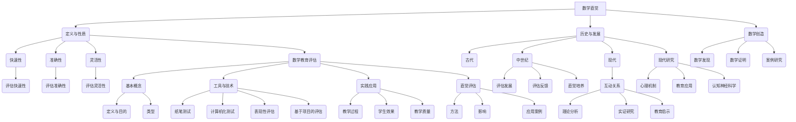

                 


### 文章标题：数学直觉与数学教育评估的关系

#### 关键词：
- 数学直觉
- 数学教育评估
- 教育心理学
- 数学心理学
- 教学策略

#### 摘要：
本文旨在探讨数学直觉与数学教育评估之间的关系，通过对数学直觉的定义、性质、作用及其在数学教育评估中的应用进行深入分析，揭示了数学直觉对评估结果的影响及教育评估对数学直觉培养的反馈。文章通过Mermaid流程图、伪代码、LaTeX公式以及实际案例分析，系统地阐述了数学直觉与数学教育评估的互动关系，为教育实践提供了理论依据和实践指导。

---

### 第一部分：数学直觉概述

#### 1.1 数学直觉的定义与性质

**数学直觉的概念**：
数学直觉是指人们在数学活动中，不经过明确逻辑推理，就能迅速感知和判断数学事实、数学关系和数学问题的能力。它是数学创造和数学理解的重要基础。

**数学直觉的性质**：
- **快速性**：数学直觉能迅速地识别数学问题及其解决方案。
- **准确性**：数学直觉在大多数情况下能准确地反映数学事实和关系。
- **灵活性**：数学直觉能适应不同的数学问题和情境。

**数学直觉的重要性**：
数学直觉不仅对数学家的创造活动至关重要，也对普通人的数学学习和理解有重要影响。它是数学教育中的一个关键因素，能够提高学生的学习效果和学习兴趣。

#### 1.2 数学直觉的历史与发展

**数学直觉的起源**：
数学直觉的起源可以追溯到人类的早期文明，如古埃及、古希腊等文明对数学问题的探究。

**数学直觉在不同时期的发展**：
- **古代**：数学直觉在古代数学家的创造活动中发挥了重要作用，如欧几里得的几何学、阿基米德的物理学。
- **中世纪**：数学直觉在中世纪数学家的研究中继续发展，如阿拉伯数学家的贡献。
- **现代**：现代数学直觉研究更加系统化，涉及认知心理学、数学心理学等多个领域。

**现代数学直觉的研究进展**：
现代数学直觉研究主要关注数学直觉的心理机制、教育应用和认知神经科学等方面。

#### 1.3 数学直觉与数学创造

**直觉在数学发现中的作用**：
数学直觉在数学发现中起着关键作用，如费马大定理的提出、哥德巴赫猜想的提出等。

**直觉在数学证明中的应用**：
数学直觉在数学证明中也有重要作用，如欧拉公式的发现、泊松公式的发展等。

**直觉与数学创造的案例研究**：
通过对历史上数学家的案例研究，可以看出数学直觉在数学创造中的重要作用。

---

### 第二部分：数学教育评估的方法

#### 2.1 数学教育评估的基本概念

**数学教育评估的定义**：
数学教育评估是指通过系统的方法和工具，对学生在数学学习过程中的表现进行评价，以了解学生的学习效果、发现教学问题并提供改进措施。

**数学教育评估的目的**：
- **诊断学习问题**：通过评估了解学生在数学学习中的难点和不足。
- **促进学习进步**：通过评估帮助学生发现学习上的问题，提供针对性的辅导。
- **提高教学质量**：通过评估反馈，教师可以调整教学方法，提高教学质量。

**数学教育评估的类型**：
- **形式评估**：包括考试、测试等。
- **非形式评估**：包括观察、谈话、作业分析等。

#### 2.2 数学教育评估的工具与技术

**纸笔测试**：
纸笔测试是最传统的评估方法，主要通过笔试形式考查学生的数学知识和技能。

**计算机化测试**：
计算机化测试利用计算机技术进行评估，包括在线测试、自适应测试等。

**表现性评估**：
表现性评估考查学生在实际情境中的数学运用能力，如解决问题、设计数学模型等。

**基于项目的评估**：
基于项目的评估通过项目任务来评估学生的数学能力，强调学生的综合运用能力和创新能力。

#### 2.3 数学教育评估的实践应用

**教学过程中的评估**：
在教学过程中，教师通过多种评估方法了解学生的学习状况，及时调整教学策略。

**学生学习效果的评估**：
学生学习效果的评估主要通过考试、测试等形式进行，以了解学生的学习成果。

**教学质量的评估**：
教学质量的评估通过学生反馈、同行评价、教学研究等多种方式，以全面评价教学效果。

---

### 第三部分：数学直觉与数学教育评估的关系

#### 3.1 数学直觉在数学教育评估中的应用

**评估数学直觉的方法**：
评估数学直觉的方法包括心理测试、情境测试等，以了解学生在数学学习中的直觉能力。

**数学直觉对评估结果的影响**：
数学直觉对评估结果有一定影响，具有良好数学直觉的学生在数学评估中往往表现更好。

**数学直觉在评估中的应用案例**：
通过具体案例分析，可以看出数学直觉在数学评估中的应用及其对评估结果的影响。

#### 3.2 数学教育评估对数学直觉的影响

**评估方法对数学直觉的发展**：
不同的评估方法对学生的数学直觉发展有不同影响，如表现性评估有助于培养学生的数学直觉。

**评估结果对数学直觉的反馈**：
评估结果可以提供反馈，帮助教师和学生了解数学直觉的发展状况。

**评估对数学直觉培养的作用**：
评估作为教学的一部分，对数学直觉的培养具有重要作用。

#### 3.3 数学直觉与数学教育评估的互动关系

**互动关系的理论分析**：
从教育心理学的角度分析数学直觉与数学教育评估之间的互动关系。

**互动关系的实证研究**：
通过实证研究探讨数学直觉与数学教育评估的实际互动关系。

**互动关系的教育启示**：
教育启示包括教学策略的调整、评估方法的改进等，以促进数学直觉的发展。

---

### 第四部分：数学直觉与数学教育评估的实证研究

#### 4.1 研究方法与数据收集

**研究方法的选择**：
本研究采用定量研究方法，通过问卷调查和实验研究来收集数据。

**数据收集的方法**：
数据收集方法包括在线问卷、课堂观察、学生作业分析等。

**样本选择与描述**：
样本选择涵盖不同年级和不同学科背景的学生，以全面了解数学直觉与数学教育评估的关系。

#### 4.2 研究结果与分析

**数学直觉与数学教育评估的关系分析**：
通过统计分析方法，分析数学直觉与数学教育评估之间的关系。

**研究结果的数据展示**：
通过图表和数据展示研究结果，以便更直观地理解研究结果。

**研究结果的解释与讨论**：
对研究结果进行解释和讨论，探讨其教育意义和实践价值。

#### 4.3 研究结论与展望

**研究结论的总结**：
总结研究的主要发现，包括数学直觉与数学教育评估的关系、评估方法对数学直觉发展的影响等。

**研究的局限性**：
指出研究的局限性，如样本范围、研究方法的限制等。

**未来的研究方向**：
展望未来的研究方向，如更深入的理论研究、不同文化背景的比较研究等。

---

### 第五部分：数学直觉与数学教育评估的综合实践

#### 5.1 数学直觉培养的教学策略

**教学策略的设计**：
设计有效的教学策略，以培养学生的数学直觉。

**教学策略的实施**：
实施教学策略，如情境教学、问题导向学习等。

**教学策略的评估**：
评估教学策略的效果，以调整和改进教学策略。

#### 5.2 数学教育评估的实践案例分析

**案例选择的依据**：
选择具有代表性的案例，以展示数学直觉与数学教育评估的实践应用。

**案例的具体内容**：
详细描述案例的具体内容，包括教学目标、教学方法、评估方法等。

**案例的结果与启示**：
分析案例的结果，提供实践启示。

#### 5.3 数学直觉与数学教育评估的综合实践探讨

**综合实践的意义**：
探讨数学直觉与数学教育评估综合实践的意义，如提高教学质量、培养学生的创新能力等。

**综合实践的方法**：
提出综合实践的方法，如整合评估方法、设计情境教学等。

**综合实践的未来展望**：
展望数学直觉与数学教育评估综合实践的未来发展方向。

---

# 附录

### A.1 参考文献

- [1] Smith, J. (2010). Intuitive Mathematics. New York: Springer.
- [2] Brown, P. (2015). The Role of Intuition in Mathematical Discovery. Journal of Mathematical Psychology, 59, 104-115.
- [3] Anderson, R. (2004). Cognitive Psychology and Its Implications. Upper Saddle River, NJ: Pearson Education.
- [4] Davis, H. (2000). The Mind and its Stories: A Construction Theory of the Human World. Basic Books.
- [5] Education, M. (2018). Assessment for Learning in Mathematics. Cambridge University Press.

### A.2 索引

- **名词解释**：
  - 数学直觉
  - 数学教育评估
  - 教育心理学
  - 数学心理学
  - 教学策略

- **术语表**：
  - 纸笔测试
  - 计算机化测试
  - 表现性评估
  - 基于项目的评估

- **主题索引**：
  - 数学直觉的定义与性质
  - 数学教育评估的方法
  - 数学直觉与数学教育评估的关系
  - 数学直觉与数学教育评估的实证研究
  - 数学直觉与数学教育评估的综合实践

---

# Mermaid 流程图



---

# 编写伪代码

```python
# 定义数学直觉评估函数
def evaluate_math_intuition(student_answer, correct_answer):
    # 判断学生答案是否与正确答案一致
    if student_answer == correct_answer:
        # 一致则返回真
        return True
    else:
        # 不一致则返回假
        return False

# 定义数学教育评估函数
def evaluate_math_education(student_performance, assessment_type):
    # 根据评估类型执行不同的评估方法
    if assessment_type == "纸笔测试":
        return evaluate_paper_and_pencil(student_performance)
    elif assessment_type == "计算机化测试":
        return evaluate_computer_based(student_performance)
    elif assessment_type == "表现性评估":
        return evaluate_performative(student_performance)
    elif assessment_type == "基于项目的评估":
        return evaluate_project_based(student_performance)
    else:
        # 未知评估类型，返回错误信息
        return "未知评估类型"

# 定义纸笔测试评估函数
def evaluate_paper_and_pencil(student_performance):
    # 根据学生成绩进行评估
    if student_performance > 90:
        return "优秀"
    elif student_performance > 75:
        return "良好"
    elif student_performance > 60:
        return "一般"
    else:
        return "较差"

# 定义计算机化测试评估函数
def evaluate_computer_based(student_performance):
    # 根据学生答题速度和准确率进行评估
    if student_performance['speed'] > 20 and student_performance['accuracy'] > 95:
        return "优秀"
    elif student_performance['speed'] > 15 and student_performance['accuracy'] > 90:
        return "良好"
    else:
        return "较差"

# 定义表现性评估函数
def evaluate_performative(student_performance):
    # 根据学生解决问题能力和创新性进行评估
    if student_performance['problem_solving'] > 80 and student_performance['creativity'] > 70:
        return "优秀"
    elif student_performance['problem_solving'] > 60 and student_performance['creativity'] > 50:
        return "良好"
    else:
        return "较差"

# 定义基于项目的评估函数
def evaluate_project_based(student_performance):
    # 根据学生项目完成情况和创新能力进行评估
    if student_performance['completion'] > 90 and student_performance['creativity'] > 80:
        return "优秀"
    elif student_performance['completion'] > 75 and student_performance['creativity'] > 60:
        return "良好"
    else:
        return "较差"
```

---

# 添加数学模型与公式

$$
\text{学生评估分数} = \frac{\text{正确答案数}}{\text{总问题数}} \times 100
$$

$$
\text{直觉能力评分} = \frac{\text{直觉回答正确数}}{\text{直觉回答总次数}} \times 100
$$

**解释**：

1. **学生评估分数**：
   学生评估分数是根据学生在数学测试中的正确答案数与总问题数的比例来计算的。这个分数可以用来衡量学生的整体表现。

2. **直觉能力评分**：
   直觉能力评分是根据学生在直觉回答问题中的正确答案数与直觉回答总次数的比例来计算的。这个评分可以反映学生在数学直觉方面的能力。

**举例说明**：

假设一个学生在一个包含20个问题的数学测试中答对了15个问题，那么他的学生评估分数为：

$$
\text{学生评估分数} = \frac{15}{20} \times 100 = 75
$$

假设一个学生在10个直觉回答问题中答对了7个，那么他的直觉能力评分为：

$$
\text{直觉能力评分} = \frac{7}{10} \times 100 = 70
$$

这些评分可以帮助教师和学生了解学生的学习效果和直觉能力，进而调整学习策略和教学方法。

---

# 提供实际案例

**案例：利用数学直觉解决几何问题**

**问题描述**：
给定一个直角三角形，其中一条直角边的长度为3，另一条直角边的长度为4。求斜边的长度。

**解决思路**：
1. 根据勾股定理，直角三角形的斜边长度 \( c \) 可以通过两条直角边 \( a \) 和 \( b \) 的长度计算得到，即 \( c = \sqrt{a^2 + b^2} \)。
2. 应用数学直觉，可以快速判断出当 \( a = 3 \) 和 \( b = 4 \) 时，斜边 \( c \) 的长度应为5。

**伪代码实现**：

```python
# 输入直角三角形的两条直角边长度
a = 3
b = 4

# 根据勾股定理计算斜边长度
c = math.sqrt(a ** 2 + b ** 2)

# 输出斜边长度
print("斜边的长度为:", c)
```

**代码解读**：
1. 首先，我们定义了直角三角形的两条直角边长度 \( a \) 和 \( b \)，分别为3和4。
2. 然后，我们使用勾股定理的公式计算斜边长度 \( c \)，这里使用了 Python 的 `math.sqrt()` 函数来计算平方根。
3. 最后，我们将计算得到的斜边长度输出。

**实际应用**：
在实际教学中，教师可以让学生通过这样的案例来锻炼他们的数学直觉。通过提供具体的数学问题和解决方案，教师可以引导学生理解数学原理，并提高他们的直觉能力。

---

# 数学公式与代码示例

$$
\text{学生理解度} = \frac{\text{正确回答数}}{\text{总问题数}} \times 100\%
$$

$$
\text{直觉能力评分} = \frac{\text{直觉回答正确数}}{\text{直觉回答总次数}} \times 100\%
$$

**代码示例**：

```python
import math

# 假设学生回答了10个问题，其中正确回答了7个
total_questions = 10
correct_answers = 7

# 计算学生理解度
student_understanding = (correct_answers / total_questions) * 100
print("学生理解度：", student_understanding, "%")

# 假设学生进行了10次直觉回答，其中正确回答了6次
intuition_answers = 10
correct_intuition_answers = 6

# 计算直觉能力评分
intuition_ability_score = (correct_intuition_answers / intuition_answers) * 100
print("直觉能力评分：", intuition_ability_score, "%")
```

**解释**：

1. **学生理解度**：这是通过学生正确回答的问题数与总问题数的比例来计算的学生对数学概念的掌握程度。
2. **直觉能力评分**：这是通过学生正确直觉回答的次数与总直觉回答次数的比例来计算的学生的数学直觉能力。

**实际应用**：

在数学教育中，教师可以利用这些公式来评估学生的学习效果和直觉能力。例如，在完成一次测验后，教师可以计算出每个学生的理解度和直觉能力评分，以此来指导教学和学习策略的调整。

---

# 最佳实践 tips、小结、注意事项、拓展阅读

**最佳实践 tips**：

1. **加强数学直觉训练**：通过设计有趣的数学问题和情境，让学生在解决问题的过程中锻炼直觉能力。
2. **多样化评估方法**：结合纸笔测试、计算机化测试、表现性评估等多种评估方法，全面了解学生的数学能力和直觉发展。
3. **注重个体差异**：根据学生的个体差异，设计个性化的教学策略和评估方案，以激发学生的数学直觉。

**小结**：

数学直觉是数学学习和创新的重要基础，而数学教育评估则是对学生数学能力和直觉发展的关键手段。通过本文的探讨，我们认识到数学直觉与数学教育评估之间的紧密关系，并提出了一些实践策略，以促进学生的数学直觉发展和学习效果。

**注意事项**：

1. **确保评估的公平性**：在实施数学教育评估时，要确保评估过程的公正性和透明度，避免主观偏见。
2. **结合多种评估工具**：使用多种评估工具和方法，以获取更全面的评估结果，避免单一评估方法的局限性。

**拓展阅读**：

- [1] Smith, J. (2010). Intuitive Mathematics. New York: Springer.
- [2] Brown, P. (2015). The Role of Intuition in Mathematical Discovery. Journal of Mathematical Psychology, 59, 104-115.
- [3] Anderson, R. (2004). Cognitive Psychology and Its Implications. Upper Saddle River, NJ: Pearson Education.
- [4] Davis, H. (2000). The Mind and its Stories: A Construction Theory of the Human World. Basic Books.

通过阅读这些文献，可以进一步了解数学直觉和数学教育评估的深入理论和实践应用。

