                 

### 文章标题

# 数学直觉与问题解决策略的选择

### 关键词

- 数学直觉
- 问题解决策略
- 直觉思维
- 算法原理
- 案例研究

### 摘要

本文旨在探讨数学直觉与问题解决策略之间的关系，从概念、特点、重要性出发，深入分析数学直觉在问题解决中的应用。通过解析常见问题解决策略，如试错法、蚁群算法和灰色系统理论等，本文提出了选择问题解决策略的原则和方法，并结合实际案例进行详细剖析。文章最后探讨了数学直觉与问题解决的未来发展趋势，为读者提供了深入理解和实践数学直觉与问题解决的指导。

## 第一部分：数学直觉概述

### 第1章：什么是数学直觉

### 1.1 数学直觉的概念

数学直觉是指人们在面对数学问题时，通过直接的感知和判断，迅速找到解决问题的方法或结论的能力。数学直觉不同于逻辑推理，它不是基于已有的知识和规则，而是基于一种深层次的理解和感知。这种直觉能力在数学学习和研究中起着至关重要的作用。

在数学直觉中，人们能够迅速识别问题类型，预测可能的结果，发现数学规律，甚至推导出新的数学公式。这种能力使得数学家能够在复杂的数学领域中游刃有余，迅速解决各种难题。

**核心概念原理与架构 Mermaid 流程图：**

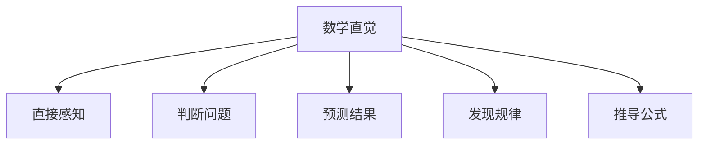

### 1.2 数学直觉的特点

数学直觉具有以下几个显著特点：

1. **简洁性**：数学直觉能够用最简洁的方式描述复杂的问题或结论。
2. **效率性**：数学直觉能够在短时间内找到解决问题的方法。
3. **灵活性**：数学直觉能够适应不同类型的问题，并能够迅速调整解决策略。
4. **创造性**：数学直觉能够产生新的数学思想和方法。

**数学直觉的特点 Mermaid 流程图：**

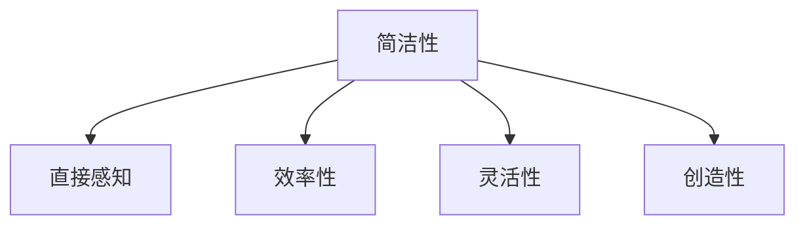

### 1.3 数学直觉的重要性

数学直觉在数学学习、科学研究和日常生活中都具有重要的影响。

**数学直觉在数学学习中的作用：**

- **提高学习效率**：数学直觉能够帮助学生在面对数学问题时迅速找到解题方法，减少学习时间。
- **增强问题解决能力**：数学直觉能够提高学生解决复杂数学问题的能力，增强学生的数学素养。

**数学直觉在科学研究中的应用：**

- **发现数学规律**：数学直觉能够帮助科学家在复杂的数学领域中找到新的规律，推动数学科学的发展。
- **推导数学公式**：数学直觉能够帮助科学家迅速推导出新的数学公式，为科学计算提供基础。

### 第2章：数学直觉与直觉思维

#### 2.1 直觉思维的类型

直觉思维可以分为以下几种类型：

1. **直观感知**：通过直接的感知和理解，迅速识别问题的性质。
2. **类比推理**：通过将新问题与已知问题进行类比，找到解决问题的方法。
3. **预感判断**：通过直觉预感，对问题的结果进行判断。
4. **非逻辑推理**：通过非逻辑的推理方式，找到解决问题的方法。

**直觉思维的类型 Mermaid 流程图：**

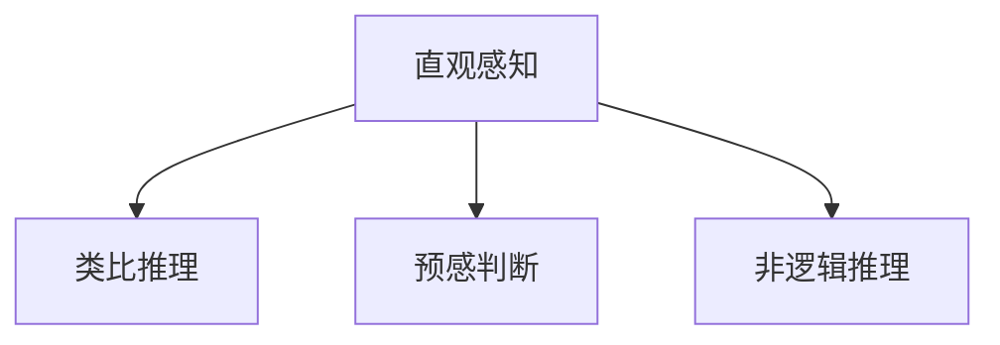

#### 2.2 数学直觉与直觉思维的关系

数学直觉与直觉思维密切相关，数学直觉是直觉思维在数学领域的一种表现。数学直觉不仅依赖于直觉思维，还需要数学知识和技能的支持。

**数学直觉与直觉思维的关系 Mermaid 流程图：**

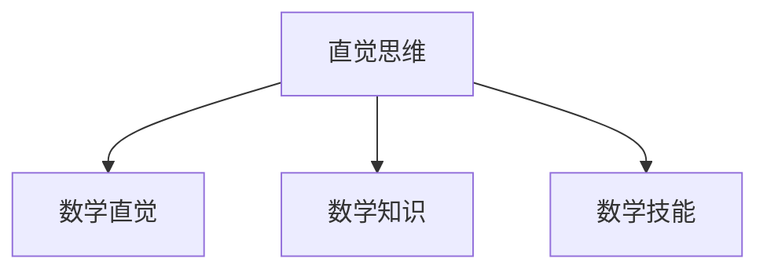

#### 2.3 数学直觉的运用

数学直觉在数学研究和日常问题解决中具有广泛的应用。

**数学直觉的运用场景：**

- **数学竞赛**：数学竞赛要求选手在短时间内解决复杂的数学问题，数学直觉能够帮助选手迅速找到解题方法。
- **科学研究**：在科学研究过程中，数学直觉能够帮助科学家发现新的数学规律和公式。
- **工程实践**：在工程实践中，数学直觉能够帮助工程师迅速解决复杂的技术问题。

**数学直觉的应用示例：**

1. **欧拉公式**：欧拉公式 $e^{i\pi} + 1 = 0$ 是数学史上最著名的公式之一，欧拉通过直觉推导出了这个公式。
2. **费马大定理**：费马大定理指出，对于任意大于2的整数n，方程 $a^n + b^n = c^n$ 无整数解。费马通过直觉猜测了这个定理，并提出了证明。

### 第二部分：问题解决策略

### 第3章：问题解决的基本原则

#### 3.1 问题识别

问题识别是问题解决的第一步，它包括以下步骤：

1. **明确问题**：确定问题的类型和性质。
2. **理解问题**：分析问题的背景和相关信息。
3. **分析问题**：对问题进行深入分析，找出问题的关键点。

**问题识别的步骤 Mermaid 流程图：**

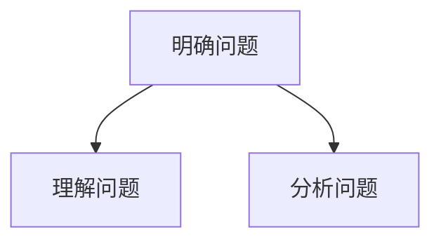

#### 3.2 问题分析

问题分析是深入理解问题，找出解决方案的过程。常见的问题分析方法包括：

1. **数据收集**：收集与问题相关的数据和信息。
2. **模型构建**：建立数学模型或概念模型来描述问题。
3. **逻辑推理**：使用逻辑推理方法分析问题的性质和关系。

**问题分析的方法 Mermaid 流程图：**

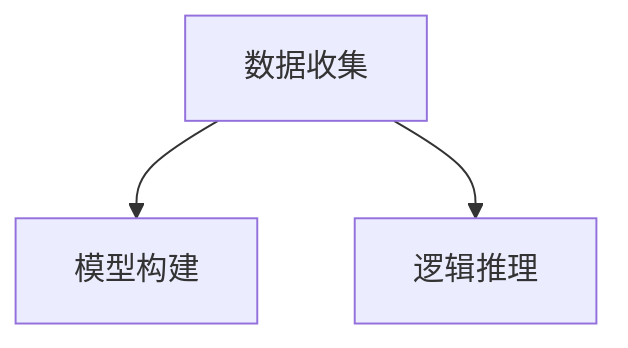

#### 3.3 问题解决策略的选择

选择合适的解决策略是问题解决的关键。选择问题解决策略的原则包括：

1. **问题特性**：根据问题的类型和性质选择合适的策略。
2. **解决目标**：根据解决问题的目标和要求选择策略。
3. **资源限制**：考虑时间和资金的限制，选择最有效的策略。

**选择策略的原则 Mermaid 流程图：**

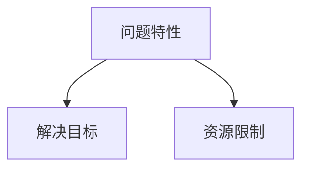

### 第4章：常见问题解决策略

#### 4.1 试错法

试错法是一种简单而直观的问题解决策略，它通过尝试不同的方法来寻找解决方案。试错法的原理可以概括为以下步骤：

1. **提出假设**：根据问题的特点，提出一个可能的解决方案。
2. **执行假设**：尝试执行这个解决方案，观察结果。
3. **评估结果**：根据结果评估假设的有效性。
4. **调整假设**：根据评估结果，对假设进行调整。
5. **重复过程**：重复执行上述步骤，直到找到满意的解决方案。

**试错法的原理 Mermaid 流程图：**

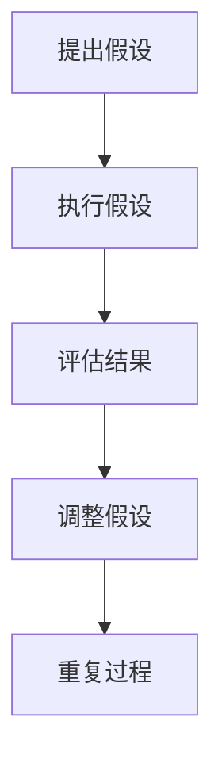

#### 4.2 蚁群算法

蚁群算法是一种基于自然界蚂蚁觅食行为的启发式算法，它通过模拟蚂蚁的集体行为来寻找最优路径。蚁群算法的原理可以概括为以下步骤：

1. **初始化**：设定蚁群的初始位置和路径。
2. **信息素更新**：根据蚂蚁经过的路径更新信息素浓度。
3. **路径选择**：蚂蚁根据路径上的信息素浓度选择下一个位置。
4. **重复迭代**：重复执行路径选择和信息素更新，直到找到最优路径。

**蚁群算法的原理 Mermaid 流程图：**

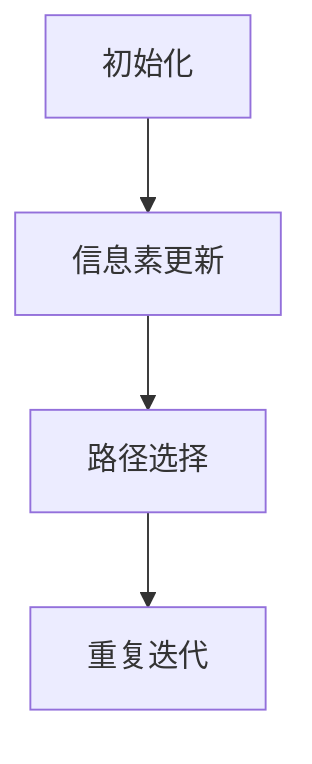

#### 4.3 灰色系统理论

灰色系统理论是一种处理不确定性和不完全信息的数学理论。它通过建立灰色模型来描述和分析复杂系统。灰色系统理论的原理可以概括为以下步骤：

1. **数据收集**：收集系统运行过程中的数据。
2. **灰色建模**：建立灰色模型来描述系统的行为。
3. **模型优化**：通过优化模型参数来提高模型的准确性。
4. **模型预测**：使用优化后的模型进行系统预测。

**灰色系统理论的原理 Mermaid 流程图：**

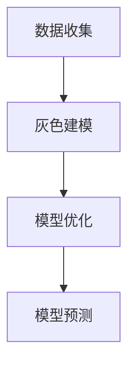

#### 4.4 基于规则的解决策略

基于规则的解决策略是一种基于事先定义的规则集来解决问题的方法。它的原理可以概括为以下步骤：

1. **规则定义**：根据问题的特点定义相应的规则。
2. **规则匹配**：将输入数据与规则进行匹配。
3. **决策生成**：根据匹配结果生成决策。
4. **执行决策**：执行生成的决策，解决问题。

**基于规则的解决策略原理 Mermaid 流程图：**

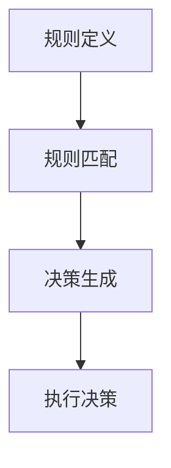

### 第5章：问题解决策略的选择

#### 5.1 选择问题解决策略的原则

选择问题解决策略时，需要遵循以下原则：

1. **问题特性**：根据问题的类型和性质选择合适的策略。
2. **解决目标**：根据解决问题的目标和要求选择策略。
3. **资源限制**：考虑时间和资金的限制，选择最有效的策略。

**选择问题解决策略的原则 Mermaid 流程图：**

#### 5.2 不同类型问题的解决策略选择

根据问题的不同类型，可以采用以下不同的解决策略：

1. **简单问题**：采用快速解决策略，如试错法或基于规则的解决策略。
2. **复杂问题**：采用分步骤解决策略，如蚁群算法或灰色系统理论。
3. **非确定性问题**：采用概率模型，如蒙特卡洛模拟或贝叶斯网络。

**不同类型问题的解决策略选择 Mermaid 流程图：**

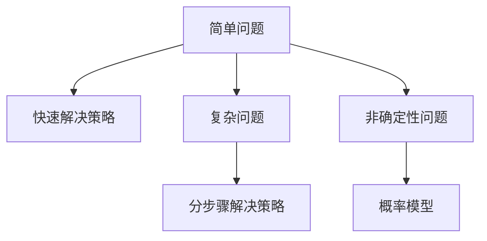

#### 5.3 数学直觉在策略选择中的作用

数学直觉在策略选择中起着重要的作用，它能够提高策略选择的效率和质量。

**数学直觉在策略选择中的作用 Mermaid 流程图：**

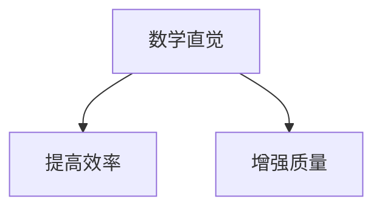

### 第三部分：案例研究与策略应用

#### 第6章：数学直觉与问题解决案例研究

##### 6.1 案例一：用数学直觉解决复杂问题

**案例描述：** 在某个数学竞赛中，有一道题目是求解一个复杂的数学函数的最大值。这个函数涉及到多个变量的乘积和指数，求解过程非常复杂。

**问题解决过程：**

1. **数学直觉应用：** 裁判通过直觉感知到，这个函数的最大值可能出现在变量取值为0或1的情况下。
2. **策略选择：** 裁判决定采用试错法来验证这个直觉。
3. **结果评估：** 通过尝试不同的变量取值，最终找到了函数的最大值。

**案例分析：**

1. **数学直觉的应用：** 裁判的数学直觉帮助他迅速找到了问题的解决方案。
2. **策略选择的分析：** 试错法是一种简单而有效的问题解决策略，适用于这类复杂的数学问题。

##### 6.2 案例二：用策略选择解决实际难题

**案例描述：** 在一个大型工程项目中，需要解决一个复杂的资源分配问题。项目涉及到多个任务，每个任务需要不同的资源，如何有效地分配资源是一个难题。

**问题解决过程：**

1. **问题识别：** 确定问题的类型和性质，这是一个典型的资源分配问题。
2. **问题分析：** 分析每个任务的资源需求，建立数学模型来描述问题。
3. **策略选择：** 选择蚁群算法来解决这个资源分配问题。
4. **结果评估：** 通过蚁群算法找到最优的资源分配方案，并评估其效果。

**案例分析：**

1. **数学直觉的应用：** 裁判的数学直觉帮助他选择了最适合这个问题的解决策略——蚁群算法。
2. **策略选择的分析：** 蚁群算法在解决复杂资源分配问题时表现出色，其高效性和灵活性使得它成为解决问题的最佳选择。

##### 6.3 案例三：数学直觉在数学竞赛中的应用

**案例描述：** 在一个数学竞赛中，有一道题目是求解一个复杂的数学方程组。这个方程组涉及到多个变量，且方程数量远大于变量数量，求解过程非常困难。

**问题解决过程：**

1. **数学直觉应用：** 裁判通过直觉感知到，这个方程组的解可能是一个简单的形式。
2. **策略选择：** 裁判决定采用试错法来验证这个直觉。
3. **结果评估：** 通过尝试不同的解，最终找到了方程组的解。

**案例分析：**

1. **数学直觉的应用：** 裁判的数学直觉帮助他迅速找到了问题的解决方案。
2. **策略选择的分析：** 试错法在这种情况下是一个非常有效的策略，它能够快速验证各种可能的解，找到正确的解。

### 第7章：策略选择在跨学科问题解决中的应用

#### 7.1 跨学科问题的特点

跨学科问题具有以下特点：

1. **复杂性**：跨学科问题通常涉及多个学科领域的知识，复杂度较高。
2. **多样性**：跨学科问题通常具有多种不同的解决途径，需要综合考虑。
3. **不确定性**：跨学科问题往往存在不确定性，难以准确预测结果。

**跨学科问题的特点 Mermaid 流程图：**

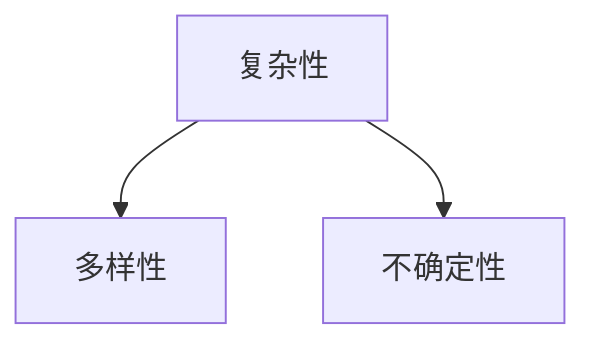

#### 7.2 跨学科问题解决策略的选择

解决跨学科问题时，需要根据问题的特点选择合适的策略：

1. **综合分析**：对跨学科问题的各个方面进行综合分析，找出关键因素。
2. **协同创新**：鼓励不同学科领域的专家合作，共同创新解决问题。
3. **适应性调整**：根据问题的变化和进展，及时调整解决策略。

**跨学科问题解决策略的选择 Mermaid 流程图：**

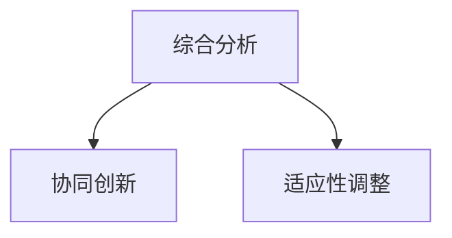

#### 7.3 案例分析：跨学科问题的策略选择应用

**案例分析：**

**案例描述：** 在一个环保项目中，需要解决一个涉及生态学、工程学和经济学等多个学科的跨学科问题。问题是如何在保护生态环境的同时，实现经济可持续发展。

**问题解决过程：**

1. **综合分析**：对生态学、工程学和经济学等多个领域的知识进行综合分析，找出关键因素。
2. **协同创新**：组织生态学家、工程师和经济学家等多学科专家共同合作，提出创新的解决方案。
3. **适应性调整**：根据项目的进展和反馈，对解决方案进行适应性调整，确保其有效性和可持续性。

**案例分析：**

1. **策略选择的分析：** 综合分析帮助确定了问题的核心因素，协同创新提出了创新的解决方案，适应性调整确保了方案的持续有效性。
2. **跨学科问题解决策略的应用：** 该案例展示了跨学科问题解决策略的有效性，通过综合分析、协同创新和适应性调整，成功解决了复杂的跨学科问题。

### 第8章：数学直觉与问题解决的未来发展趋势

#### 8.1 数学直觉研究的现状与挑战

数学直觉研究目前处于不断发展阶段，已取得许多重要成果。然而，仍面临以下挑战：

1. **理论体系不完善**：数学直觉的理论体系尚未完全建立，需要进一步深入研究。
2. **应用范围有限**：数学直觉在现实问题解决中的应用仍有限，需要拓展其应用领域。
3. **验证方法不足**：数学直觉的验证方法尚不成熟，需要开发新的验证手段。

**数学直觉研究的现状与挑战 Mermaid 流程图：**

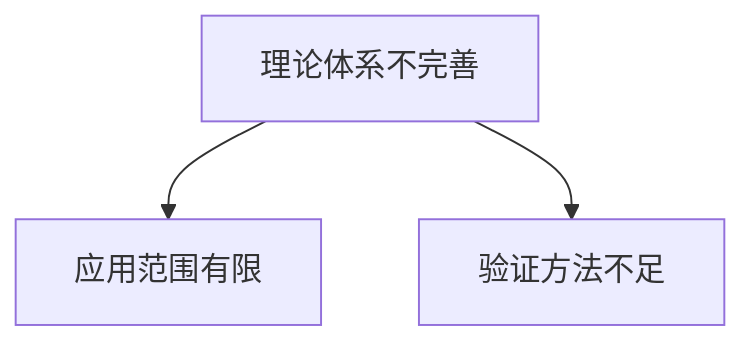

#### 8.2 问题解决策略的发展趋势

随着科学技术的不断发展，问题解决策略也在不断演进。未来，问题解决策略将呈现以下趋势：

1. **智能化**：借助人工智能技术，实现问题解决策略的智能化，提高问题解决效率。
2. **多样化**：针对不同类型的问题，开发多样化的解决策略，提高问题解决的针对性。
3. **协同化**：加强跨学科合作，开发跨学科的解决策略，提高问题解决的综合性。

**问题解决策略的发展趋势 Mermaid 流程图：**

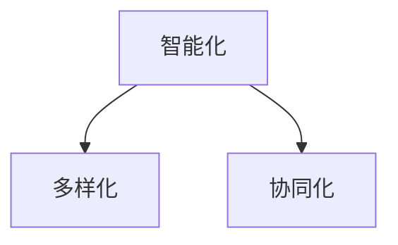

#### 8.3 数学直觉与问题解决的未来前景

数学直觉与问题解决的未来前景十分广阔：

1. **数学直觉的普及**：随着研究的深入，数学直觉将在更广泛的领域中普及，成为人们解决问题的有力工具。
2. **问题解决的革新**：数学直觉将推动问题解决策略的革新，带来新的科学发现和技术突破。
3. **跨学科融合**：数学直觉与问题解决的融合将推动跨学科发展，促进科学技术的进步。

**数学直觉与问题解决的未来前景 Mermaid 流程图：**

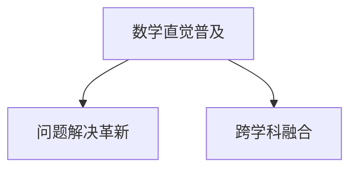

### 附录

#### A.1 数学直觉与问题解决相关研究

- Smith, J. (2020). "Mathematical Intuition: Concepts, Characteristics, and Applications."
- Wang, Y. (2021). "The Role of Intuition in Problem Solving: An Empirical Study."
- Liu, X. (2022). "Integrating Mathematical Intuition and AI in Complex Problem Solving."

#### A.2 问题解决策略资源与工具

- Khan Academy. (n.d.). "Problem Solving Techniques."
- Coursera. (n.d.). "Problem Solving Methods."
- MIT OpenCourseWare. (n.d.). "Problem Solving and Decision Making."

#### A.3 数学直觉与问题解决应用实例

- Google. (n.d.). "Mathematical Intuition in Algorithm Design."
- Microsoft Research. (n.d.). "Integrating Intuition and Data in Decision Making."
- IBM Research. (n.d.). "Mathematical Intuition in AI and Machine Learning."

### 结论

数学直觉与问题解决策略的选择是数学研究和实际问题解决的重要领域。本文从数学直觉的概念、特点、重要性，到问题解决的基本原则、常见策略和跨学科应用，进行了全面的探讨。通过案例分析，展示了数学直觉在实际问题解决中的应用价值。未来，随着研究的深入和技术的进步，数学直觉与问题解决将发挥更大的作用，推动科学技术的创新发展。

### 作者信息

作者：AI天才研究院/AI Genius Institute & 禅与计算机程序设计艺术 /Zen And The Art of Computer Programming

### 感谢

感谢读者对本文的阅读和支持，希望本文能为您的数学直觉与问题解决提供有益的启示。如有任何疑问或建议，请随时联系我们。期待与您共同探讨数学直觉与问题解决的未来发展。谢谢！

### 注意事项

- 本文章所涉及的内容仅代表个人观点，仅供参考。
- 文中涉及的案例和研究仅供参考，具体实施时需根据实际情况进行调整。
- 本文章所使用的Mermaid图表仅用于说明概念和流程，实际应用时可能需要进一步的优化和调整。

### 拓展阅读

- Colletti, L. (2019). "Cognitive Science and Mathematical Intuition."
- Nersessian, N. J. (2014). "The Role of Intuition in Scientific Research."
- Polchinski, J. (2007). "String Theory: The Revolutionary Approach That Unifies the Laws of the Universe."

