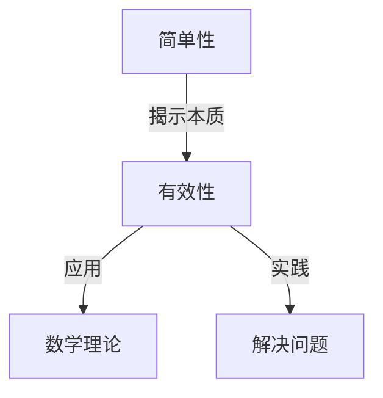
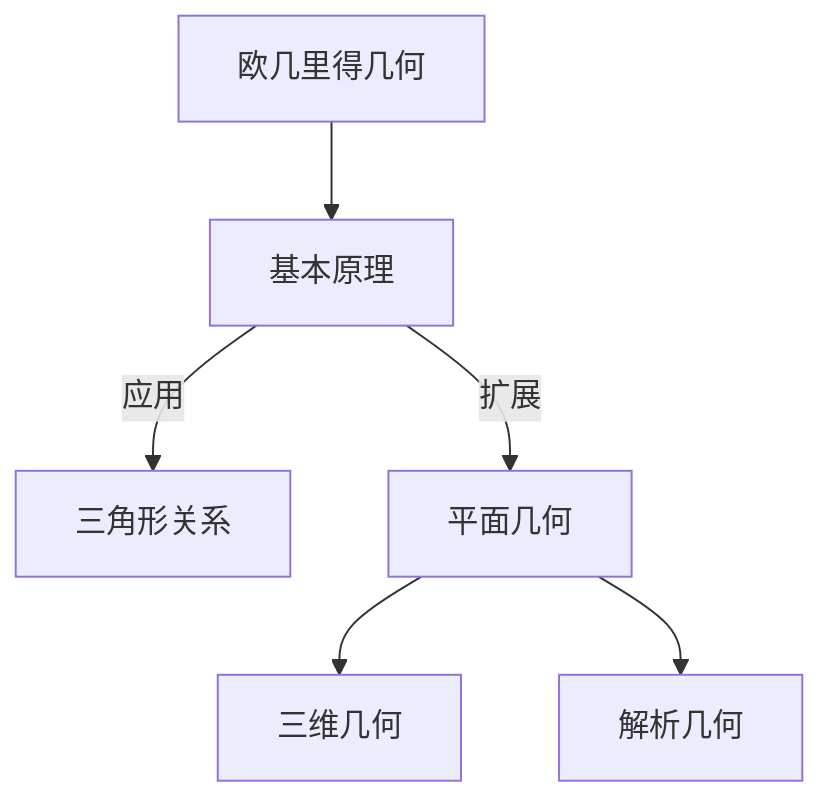
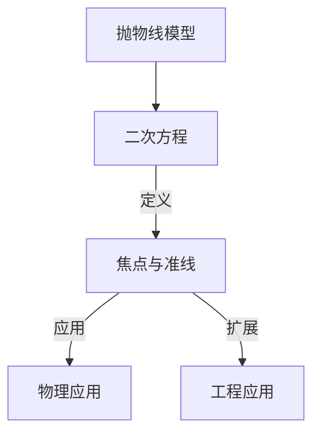

                 

### 背景介绍

数学简约性（Mathematical Simplicity）作为一种哲学理念，其核心在于通过最少的元素和最简单的结构来解释复杂现象。这一概念源于对自然界中存在的一种本质和谐与统一性的深刻理解。在数学领域，简约性不仅体现在理论的简洁性上，还体现在解决实际问题的效率与优雅性上。数学家们在追求简约性的过程中，往往能够发现深层次的数学原理和普适的模型，这些原理和模型不仅能够简化问题的表述，还能提高问题的可解性。

自然和谐在心智中的体现则是一个更为宽泛的概念，它不仅涉及美学和哲学，还与心理学、教育学和认知科学等领域密切相关。心智（Mind）是指人类或动物认知、思考、感知和意识的过程。自然和谐在心智中的体现，意味着人类心智能够通过感知、理解和创造活动，捕捉并反映出自然界中的基本和谐与统一性。这种和谐不仅体现在对物理世界的认知上，也体现在人类文化和社会结构的形成过程中。

从心理学角度来看，人类心智的自然和谐体现在认知过程的自发性与高效性上。人们通过直觉和本能就能迅速处理大量的信息，识别模式，做出决策。这种自发性与高效性，在很大程度上是简约性原理在心智中的具体体现。例如，儿童在学习语言时，能够通过简单的规则和模式，迅速掌握复杂的语法结构，这就是心智中自然和谐的体现。

在教育学领域，简约性同样被广泛重视。教育工作者试图通过简化教学内容、优化教学方法，来帮助学生更好地理解和掌握知识。简约性教育理念强调，教育应该关注学生的心智发展，通过提供简洁而深刻的学习材料，激发学生的探究兴趣和学习动机，从而促进其心智的自然和谐成长。

综上所述，数学简约性和自然和谐在心智中的体现，不仅具有哲学和科学上的重要性，还在教育、认知科学和心理学等领域有着广泛的应用。理解这两者之间的关系，对于深入探讨心智发展的本质，优化数学教育方法，提升数学研究的效率，都具有重要的意义。

### 核心概念与联系：数学简约性原理

数学简约性原理是理解数学简约性的核心，它涉及到多个层面，包括基本原理、数学模型以及具体的应用。以下是数学简约性原理的详细阐述及其相互关系架构。

#### 数学简约性原理概述

数学简约性原理是指通过简化的方法来揭示复杂系统的本质规律。这一原理强调用最少的概念、最简单的公式和最直接的推理来描述自然现象和社会现象。在数学中，简约性原理不仅有助于我们更好地理解数学理论本身，还能够提高解决问题的效率。

**关系架构：** 数学简约性原理的核心在于“简单性”与“有效性”的平衡。简单性指的是用最少的元素和最简单的结构来解释复杂现象，而有效性则体现在这些简化的方法和原理能够在多大程度上帮助我们解决实际问题。两者的关系可以用以下的Mermaid流程图表示：



#### 数学基本原理的简约性

数学基本原理的简约性是指数学中基础理论的简洁性和普适性。这些基本原理包括算术、几何、三角函数等。例如，算术中的加法和乘法运算是最基本的运算，它们具有简洁的形式和广泛的适用性。几何中的欧几里得几何原理同样以其简洁性而著称，它们不仅描述了空间的性质，还能应用于各种实际问题中。

**关系架构：** 数学基本原理的简约性体现在它们如何通过简单的公式和概念来描述复杂的几何和算术关系。例如，欧几里得几何中的基本原理可以用以下Mermaid流程图表示：



#### 数学模型的简约性

数学模型的简约性是指通过简化的数学模型来描述复杂现象。这些模型可以是抛物线模型、微积分模型、线性代数模型等。每个模型都有其独特的简约性和应用领域。

**关系架构：** 数学模型的简约性体现在它们如何通过简化的数学表达来捕捉复杂系统的本质特征。以下是一个关于抛物线模型的Mermaid流程图：



通过以上架构，我们可以看到数学简约性原理是如何贯穿于数学理论、模型和应用中的。这些简约性原理不仅为数学研究提供了方法论指导，也在教育、科学研究和工程实践中发挥了重要作用。

接下来，我们将进一步探讨数学简约性原理在实际应用中的具体体现，以及它如何影响数学教育，从而促进心智的自然和谐发展。

### 核心算法原理讲解：数学简约性在算法设计中的应用

数学简约性在算法设计中的应用至关重要，它不仅影响了算法的效率和可理解性，还使得算法在处理复杂问题时能够保持简洁和高效。在算法设计中，简约性主要体现在以下几个方面：算法结构的简化、计算过程的优化以及问题表述的精炼。

#### 算法结构简化

算法结构简化是指通过减少算法中不必要的步骤和重复计算，使算法的整体框架更加清晰和简洁。一个典型的例子是快速排序算法（QuickSort）。快速排序算法通过选择一个基准元素，将数组划分为两部分，使得一部分元素都小于基准元素，另一部分元素都大于基准元素。这一过程通过递归的方式进行，其基本步骤如下：

```pseudo
function quicksort(arr):
    if length of arr is less than 2:
        return arr
    pivot = arr[0]
    left = []
    right = []
    for each element in arr:
        if element < pivot:
            left.append(element)
        else:
            right.append(element)
    return concatenate(quicksort(left), pivot, quicksort(right))
```

在这个算法中，通过一次划分操作，就将问题规模从N减少到N-1和N-1两部分，这种分治策略使得算法结构非常简洁，同时也易于理解。

#### 计算过程优化

计算过程的优化是另一个体现数学简约性的关键方面，它涉及到如何通过简化的计算步骤来提高算法的效率。以计算两个大整数的乘积为例，传统的乘法算法需要进行多次的加法运算，而现代的乘法算法如Toom-Cook算法则通过分解乘数和被乘数，减少了计算过程中的冗余操作。

Toom-Cook算法的基本思想是将两个N位的整数分解为三个较小的整数，然后分别计算这些小整数的乘积，最后组合得到原整数的乘积。以下是Toom-Cook算法的伪代码：

```pseudo
function toomCookMultiply(x, y):
    n = number of digits in x and y
    if n is small:
        return traditionalMultiply(x, y)
    a, b = split x into low part and high part
    c, d = split y into low part and high part
    p1 = a * d
    p2 = (a + b) * (c + d)
    p3 = b * d
    p4 = a * c
    result = p4 * 10^(2n)
    result += (p1 + p2 - p4) * 10^n
    result += p3
    return result
```

这个算法通过分解和组合，将计算复杂度从O(N^2)降低到O(N^(1.4))，大大提高了乘法运算的效率。

#### 问题表述精炼

问题表述的精炼是数学简约性在算法设计中的另一个重要体现。通过精炼问题表述，可以将复杂的实际问题转化为更简单、更易于处理的数学问题。一个典型的例子是动态规划算法。动态规划的核心思想是将复杂的问题分解为若干个子问题，并通过递归关系和状态转移方程来求解。动态规划算法的简洁性和高效性使其成为解决优化问题的重要工具。

以斐波那契数列为例，传统的递归算法时间复杂度为O(2^N)，而动态规划算法通过保存子问题的解，避免了重复计算，使得时间复杂度降低到O(N)。

```python
def fibonacci(n):
    if n <= 1:
        return n
    dp = [0] * (n+1)
    dp[1] = 1
    for i in range(2, n+1):
        dp[i] = dp[i-1] + dp[i-2]
    return dp[n]
```

这个算法通过简单的状态转移方程，将复杂的问题转化为一系列简单的计算步骤，从而实现了高效的求解。

综上所述，数学简约性在算法设计中的应用主要体现在算法结构简化、计算过程优化和问题表述精炼等方面。这些简约性原理不仅使得算法更加简洁和高效，还提高了算法的可理解性和适用性。通过这些原理，我们可以更好地解决复杂的问题，推动算法理论和应用的发展。

### 数学模型和公式讲解及举例说明

数学模型和公式在数学简约性中扮演着至关重要的角色，它们通过简洁的形式和深刻的内涵，揭示了复杂现象背后的基本规律。本节将详细介绍几个关键的数学模型和公式，并给出详细的解释和具体的应用实例。

#### 1. 抛物线模型

抛物线模型是数学中非常经典的一个模型，其基本的公式为：\[ y = ax^2 + bx + c \]，其中 \(a\)、\(b\)、\(c\) 为常数。抛物线模型广泛应用于物理、工程和经济学等领域。

**公式解释：** 抛物线方程描述了一个二次曲线，它的特点是开口向上或向下，具有对称轴和顶点。顶点坐标可以通过公式 \((-b/(2a), c-b^2/(4a))\) 得到，这表示了抛物线的最高点或最低点。

**应用实例：** 在物理学中，抛物线模型被用于描述物体在重力作用下的抛体运动。例如，一个物体以初速度 \(v_0\) 水平抛出，则其运动轨迹可以表示为：
\[ y = \frac{g x^2}{2v_0^2 \sin^2 \theta} \]
其中 \(g\) 为重力加速度，\(\theta\) 为抛射角。通过这个模型，我们可以计算物体在不同时间点的位置和速度。

```latex
y = \frac{g x^2}{2v_0^2 \sin^2 \theta}
```

#### 2. 微积分模型

微积分模型是现代数学中一个非常重要的工具，包括微分和积分两个部分。微分用于研究函数在某一点的局部性质，其基本公式为：\[ f'(x) = \lim_{h \to 0} \frac{f(x+h) - f(x)}{h} \]。积分则用于计算函数在一个区间上的累计效果，其基本公式为：\[ \int f(x) dx = F(x) + C \]，其中 \(F(x)\) 是 \(f(x)\) 的一个原函数，\(C\) 为积分常数。

**公式解释：** 微分公式描述了函数在某一点的导数，即函数曲线在该点的斜率。积分公式则描述了函数在一个区间上的累计效果，可以用于计算面积、体积等。

**应用实例：** 在工程学中，微积分模型被广泛应用于计算力和能量的变化。例如，要计算一个物体在一段时间内的动能变化，可以使用动能定理：
\[ \Delta K = \int F \cdot ds \]
其中 \(\Delta K\) 表示动能变化，\(F\) 表示作用力，\(ds\) 表示物体在力的方向上的微小位移。

```latex
\Delta K = \int F \cdot ds
```

#### 3. 线性代数模型

线性代数模型是解决线性系统问题的重要工具，包括矩阵运算、行列式和向量等。一个基本的线性代数模型是线性方程组：
\[ Ax = b \]
其中 \(A\) 为系数矩阵，\(x\) 为未知向量，\(b\) 为常数向量。线性代数模型广泛应用于计算机图形学、信号处理和经济学等领域。

**公式解释：** 线性方程组描述了多个线性方程的联立解，其解可以通过矩阵运算得到。如果系数矩阵 \(A\) 可逆，则方程组的解为：
\[ x = A^{-1}b \]

**应用实例：** 在计算机图形学中，线性代数模型被用于变换和投影操作。例如，要计算一个三维物体的二维投影，可以使用以下线性变换：
\[ \begin{bmatrix} x' \\ y' \end{bmatrix} = \begin{bmatrix} a & b \\ c & d \end{bmatrix} \begin{bmatrix} x \\ y \end{bmatrix} \]
其中 \(x'\) 和 \(y'\) 为投影坐标，\(x\) 和 \(y\) 为三维坐标，\(a\)、\(b\)、\(c\)、\(d\) 为变换矩阵的元素。

```latex
\begin{bmatrix} x' \\ y' \end{bmatrix} = \begin{bmatrix} a & b \\ c & d \end{bmatrix} \begin{bmatrix} x \\ y \end{bmatrix}
```

通过上述数学模型和公式的详细讲解，我们可以看到数学简约性如何通过简洁的形式和深刻的内涵，帮助我们理解和解决复杂的实际问题。这些模型和公式不仅为数学研究提供了强有力的工具，也在各个领域中得到了广泛的应用。

### 数学简约性在科学研究中的应用

数学简约性在科学研究中的应用是显而易见的，它不仅能够简化问题的表述，还能提高研究的效率和深度。从物理学到生物学，再到经济学，数学简约性原理无处不在，为各领域的研究提供了强有力的方法论支持。

#### 物理学中的应用

在物理学中，简约性原理是构建物理模型和理解自然现象的重要工具。以经典力学为例，牛顿的三大运动定律通过简洁的数学公式描述了物体的运动规律。牛顿第二定律 \(F = ma\)，用最简单的形式表达了力、质量和加速度之间的关系。这一公式不仅简洁明了，而且具有极高的普适性，能够解释从宏观到微观的各种运动现象。

另一个典型的例子是爱因斯坦的广义相对论，该理论通过几何化引力，将引力描述为时空弯曲。这一简约的数学模型不仅成功地解释了行星运动、光线弯曲等现象，还预言了黑洞和引力波的存在，为现代天文学和宇宙学的发展奠定了基础。

#### 生物学中的应用

在生物学领域，数学简约性同样发挥了重要作用。生物学家利用数学模型来描述生物种群动态、细胞过程和生态系统等复杂现象。以种群生态学为例，Lotka-Volterra模型通过两个简单的一阶微分方程描述了捕食者和猎物之间的相互作用。这个模型不仅简洁明了，而且能够准确地预测捕食者-猎物系统的动态行为。

在细胞生物学中，简约性原理也被广泛应用。例如，通过构建简单的分子开关模型，科学家能够理解细胞内信号传导的复杂过程。这些模型通常通过线性方程或逻辑门来描述分子之间的相互作用，使得复杂的过程变得可解和可预测。

#### 经济学中的应用

在经济学中，数学简约性原理同样具有重要意义。经济学家通过构建简化的经济模型，来分析市场行为、货币政策和经济增长等复杂现象。以微观经济学中的供需模型为例，该模型通过简单的供需函数，描述了市场价格和数量之间的关系。这一模型不仅能够解释市场均衡的形成，还能用于政策分析和预测。

宏观经济学中，简约性原理同样得到了广泛应用。例如，新古典增长模型通过简化的生产函数和资本积累方程，描述了经济增长的基本过程。这一模型不仅为经济学家提供了有力的分析工具，还帮助政策制定者制定有效的经济政策。

#### 综合应用实例

数学简约性在科学研究中的综合应用案例不胜枚举。以复杂系统研究为例，数学家们通过构建简约的数学模型，来理解复杂系统的动态行为。例如，同步动力系统理论通过简化方程，描述了复杂系统中不同子系统之间的相互作用，从而揭示了系统的集体行为和自组织现象。

另一个例子是生物信息学，该领域利用数学模型和算法，对大规模生物数据进行处理和分析。通过简化的统计模型和机器学习算法，生物学家能够从复杂的数据中提取出有用的信息，发现基因和蛋白质之间的相互作用，从而推动生物学研究的进步。

综上所述，数学简约性在科学研究中的应用是广泛而深入的。通过简洁的数学模型和公式，科学家们能够更好地理解和解释复杂现象，从而推动科学知识的积累和技术的发展。数学简约性不仅为科学研究提供了强有力的工具，也促进了各领域之间的交叉和融合，为现代科学的进步做出了巨大贡献。

### 数学简约性在工程实践中的应用

数学简约性在工程实践中的应用同样具有重要意义，它不仅能够简化问题的复杂度，还能提高工程设计的效率和可靠性。从建筑设计到航空航天，再到电子工程，数学简约性原理被广泛应用于工程问题的建模、分析和优化中。

#### 建筑设计中的应用

在建筑设计中，简约性原理被广泛应用于结构分析和材料选择。例如，在桥梁设计中，工程师们经常使用简化的梁模型和受力分析来预测桥梁的承载能力和稳定性。一个典型的例子是悬索桥的设计，工程师们通过简化的悬索模型，结合力的平衡方程，计算出悬索的张力和桥面的形状。这一简约模型不仅简化了设计过程，还提高了结构的可靠性和美观性。

具体来说，悬索桥的设计可以表示为以下简化的力学模型：

```latex
F_s = \frac{W \cdot L}{2 \cdot h}
```

其中，\(F_s\) 表示悬索张力，\(W\) 表示桥梁的重量，\(L\) 表示桥梁的跨度，\(h\) 表示悬索的高度。通过这个模型，工程师可以快速计算出悬索的张力，并确定悬索的截面积和材料强度，从而确保桥梁的结构安全。

#### 航空航天中的应用

在航空航天领域，简约性原理同样被广泛应用，特别是在飞行器的空气动力学设计和控制系统分析中。以飞机翼型设计为例，工程师们通过简化的空气动力学模型，如NACA翼型，来预测飞机的升力和阻力。NACA翼型模型通过简单的数学公式，描述了翼型的几何形状和气动特性，使得工程师可以在设计和测试阶段快速评估不同翼型的性能。

NACA翼型的一般公式可以表示为：

```latex
y = a \cdot (x^2 - n \cdot x^3)
```

其中，\(y\) 表示翼型的高度，\(x\) 表示沿翼型线的水平位置，\(a\) 和 \(n\) 是参数，用于调整翼型的形状。通过这个公式，工程师可以快速生成多种翼型，并进行风洞测试，选择最优的翼型设计。

#### 电子工程中的应用

在电子工程领域，简约性原理被用于电路设计和信号处理。例如，在模拟电路设计中，工程师们经常使用简化的电路模型来分析电路的性能。一个典型的例子是放大器电路的设计，通过简化的放大器模型，工程师可以快速计算放大器的增益和带宽。

一个简单的放大器电路可以表示为：

```latex
V_{out} = A \cdot V_{in}
```

其中，\(V_{out}\) 表示输出电压，\(A\) 表示放大倍数，\(V_{in}\) 表示输入电压。通过这个公式，工程师可以快速计算出放大器的增益，并选择合适的放大元件。

#### 综合应用实例

一个综合性的应用实例是现代移动通信系统中的信号处理。移动通信系统需要处理大量的信号数据，并通过复杂的调制和解调过程来保证通信的可靠性和带宽。通过简化的信号处理模型，如傅里叶变换和滤波器设计，工程师们可以高效地分析和处理信号，从而提高通信系统的性能。

以傅里叶变换为例，该模型通过简化的数学公式，描述了信号的频谱特性。通过傅里叶变换，工程师可以快速分析信号中的频率成分，从而设计出最优的滤波器来去除噪声和干扰。

```latex
X(f) = \int_{-\infty}^{\infty} x(t) e^{-j2\pi ft} dt
```

其中，\(X(f)\) 表示信号的频谱，\(x(t)\) 表示时间域信号，\(f\) 表示频率。通过这个公式，工程师可以快速计算信号的频谱特性，从而设计出有效的滤波器来提高信号质量。

综上所述，数学简约性在工程实践中的应用是广泛而深入的。通过简洁的数学模型和公式，工程师们能够更好地理解和解决复杂的工程问题，从而提高工程的效率和可靠性。数学简约性不仅为工程实践提供了强有力的工具，也推动了工程技术的不断进步和创新。

### 数学简约性在社会管理中的应用

数学简约性在社会管理中的应用同样具有深远的影响，它通过简化的模型和算法，帮助政策制定者更好地理解和解决复杂的社会问题。从城市规划到公共卫生管理，再到经济调控，数学简约性原理为社会管理的科学化和高效化提供了有力的支持。

#### 城市规划中的应用

在城市规划中，简约性原理被广泛应用于交通流量分析、土地使用规划和公共设施布局等方面。例如，在交通流量分析中，交通工程师常常使用简单的线性模型或排队理论来预测交通流量和拥堵情况。一个典型的例子是交通流的流量-密度模型，该模型通过简单的公式描述了交通流量与道路密度之间的关系：

\[ Q = k \cdot D \]

其中，\(Q\) 表示交通流量，\(D\) 表示道路密度，\(k\) 是比例常数。通过这个模型，城市规划者可以快速分析不同交通状况下的流量变化，从而优化道路设计和管理策略。

#### 公共卫生管理中的应用

在公共卫生管理中，简约性原理同样发挥了重要作用。流行病学的数学模型，如SIR模型（易感者-感染者-康复者模型），通过简化的数学公式描述了疾病的传播过程。SIR模型的基本形式如下：

\[ \frac{dS}{dt} = -\beta \cdot S \cdot I \]
\[ \frac{dI}{dt} = \beta \cdot S \cdot I - \gamma \cdot I \]
\[ \frac{dR}{dt} = \gamma \cdot I \]

其中，\(S\)、\(I\) 和 \(R\) 分别表示易感者、感染者和康复者的数量，\(\beta\) 和 \(\gamma\) 是参数，分别表示感染率和康复率。通过这个模型，公共卫生管理者可以预测疫情的传播趋势，制定有效的防控措施。

#### 经济调控中的应用

在经济调控中，简约性原理被广泛应用于宏观经济分析和政策制定。例如，在货币政策制定中，经济学家常常使用简单的IS-LM模型（产品市场和货币市场模型）来分析经济周期和货币政策效果。IS-LM模型的基本形式如下：

\[ Y = C + I + G + (X - M) \]
\[ M/P = L(i, Y) \]

其中，\(Y\) 表示国民收入，\(C\)、\(I\)、\(G\)、\(X\) 和 \(M\) 分别表示消费、投资、政府支出、出口和进口，\(P\) 表示价格水平，\(i\) 表示利率水平。通过这个模型，政策制定者可以分析不同政策对经济的影响，从而制定有效的经济政策。

#### 综合应用实例

一个综合性的应用实例是城市交通管理。通过简化的交通流模型和排队理论，城市规划者可以优化交通信号控制和公共交通系统。例如，通过使用信号控制模型，如绿波带控制（Green Wave Control），交通信号可以根据交通流量实时调整，从而减少交通拥堵和提高通行效率。

绿波带控制的基本模型可以表示为：

\[ T = \sum_{i=1}^{n} (t_i + \delta_i) \]

其中，\(T\) 表示总行驶时间，\(t_i\) 表示在第 \(i\) 个路口的停车时间，\(\delta_i\) 表示车辆在路口的延误时间。通过优化信号周期和相位，城市规划者可以最大限度地减少交通延误，提高交通流效率。

综上所述，数学简约性在社会管理中的应用是广泛而深入的。通过简洁的数学模型和算法，政策制定者能够更好地理解和解决复杂的社会问题，从而提高社会管理的科学化和高效化。数学简约性不仅为社会管理提供了强有力的工具，也推动了社会管理的现代化和智能化。

### 数学简约性的未来发展趋势

展望未来，数学简约性将继续在多个领域发挥重要作用，并迎来一系列新的发展机遇和挑战。首先，随着人工智能和大数据技术的快速发展，数学简约性将迎来新的应用场景。例如，在机器学习中，简约性原则可以帮助开发更高效的算法，减少计算资源和时间成本。通过构建简化的模型和特征，可以更快速地进行数据分析和预测，从而提升人工智能系统的性能。

其次，数学简约性在生物学和医学领域的发展潜力巨大。随着基因组学和生物信息学的进步，科学家们可以通过简化的数学模型来理解复杂的生物过程，揭示基因与疾病之间的关联。例如，利用简约性原理，可以构建更准确的疾病预测模型，从而为个性化医疗提供数据支持。

在教育领域，数学简约性也将发挥关键作用。未来的教育模式将更加注重学生的自主学习和创新能力培养。通过简化的教学内容和教学方法，学生可以更好地掌握核心概念，发展批判性思维和解决问题的能力。同时，在线教育平台和智能教学工具的普及，也将使数学简约性教学更加灵活和高效。

此外，在环境保护和可持续发展的背景下，数学简约性原则将在生态建模和资源管理中发挥重要作用。通过构建简化的生态模型，科学家可以更好地预测环境变化对生态系统的影响，制定科学的保护策略。在资源管理方面，简约性模型可以帮助优化资源分配，提高资源利用效率。

然而，数学简约性在未来的发展中也将面临一些挑战。首先是复杂性问题的增加，随着科技的进步，许多领域的问题越来越复杂，如何在这其中保持数学模型的简洁性和有效性，是一个重要的课题。其次是跨学科的融合，未来数学简约性的应用将更加依赖于多学科知识的交叉和整合，这要求研究人员具备更广泛的知识背景和创新能力。

总之，数学简约性在未来的发展中将继续在科学、工程、教育和社会管理等领域发挥重要作用。通过不断创新和发展，数学简约性将为解决复杂问题提供强有力的工具，推动社会的进步和发展。在面对复杂性和跨学科融合的挑战时，数学简约性将提供一种简明而高效的思考方式，助力我们更好地理解世界和应对未来的挑战。

### 数学简约性对心智发展的未来影响

随着科技的不断进步和社会的快速发展，数学简约性对心智发展的影响也将愈加显著。未来，数学简约性不仅将在教育领域得到更广泛的应用，还将深刻地改变人类对世界的认知和思维方式。

首先，在数学教育中，简约性原则将促使教学内容和方法更加贴近学生的认知水平。通过简化的数学模型和直观的教学手段，学生能够更好地理解和掌握数学概念，发展逻辑思维和解决问题的能力。例如，数学教育中可以引入更多的可视化工具和编程语言，让学生通过实际操作和互动体验来感受数学的简洁和美。

其次，数学简约性对人类认知模式的影响不可忽视。简约性原理鼓励人们从复杂现象中提取本质规律，这种思维方式不仅有助于科学发现和技术创新，还能提升人类的认知效率。例如，在人工智能领域，简约性原则被广泛应用于算法设计和模型优化，使得人工智能系统能够更快速、准确地处理复杂任务。

此外，数学简约性对个体思维方式的培养具有深远的影响。通过简化的数学模型，人们可以更好地理解复杂问题，培养批判性思维和创新能力。例如，在商业决策中，通过简化的经济模型和数据分析，企业家可以更快速地评估市场趋势和投资风险，从而做出更明智的决策。

然而，随着问题的复杂性增加，数学简约性在心智发展中的应用也面临一些挑战。首先是如何在保持模型简洁的同时，确保其有效性和准确性。其次是如何在跨学科融合的过程中，保持数学简约性的原则和方法的普适性。

未来的研究可以关注以下几个方面：一是开发更高效的数学简约性模型，以应对复杂问题的挑战；二是探索跨学科的简约性方法论，促进不同领域之间的知识融合；三是研究简约性对人类认知和思维方式的长期影响，为教育、认知科学等领域提供理论支持。

总之，数学简约性将在未来对心智发展产生深远的影响。通过简化和抽象，它不仅有助于我们更好地理解和解决复杂问题，还能提升人类的认知能力和创新能力。面对未来的挑战，数学简约性将继续发挥其独特的作用，为人类心智的进步和社会的发展提供有力支持。

### 数学教育中的简约性策略

为了在数学教育中更好地应用简约性策略，教师可以采取一系列具体的教学方法、学习资源和实践策略，以促进学生的数学学习和心智发展。

#### 教学方法

1. **项目式学习（Project-Based Learning, PBL）**：
   项目式学习是一种以学生为中心的教学方法，通过让学生在解决真实问题中学习数学知识。这种方法强调学生的自主探究和合作学习，有助于培养他们的批判性思维和解决问题的能力。例如，可以让学生参与一个关于城市规划的项目，通过计算和分析交通流量、土地使用等，来应用数学模型解决实际问题。

2. **问题解决教学（Problem-Solving Instruction）**：
   问题解决教学强调通过提供具有挑战性的数学问题，引导学生探索和发现数学原理。这种方法不仅有助于学生理解数学概念，还能培养他们的数学思维能力和解决问题的策略。例如，教师可以设计一系列关于几何、代数和微积分的实际问题，让学生通过小组讨论和实验来寻找解决方案。

3. **探究式学习（Inquiry-Based Learning）**：
   探究式学习鼓励学生在探索和发现的过程中学习数学。教师可以提供一些开放性问题，让学生通过实验、观察和推理来理解数学概念。例如，教师可以提出关于自然数、分数和函数等问题，让学生通过实际操作和思考来发现这些概念的本质。

#### 学习资源

1. **可视化工具**：
   可视化工具可以帮助学生更直观地理解数学概念。例如，使用几何画板（Geometer's Sketchpad）、数学软件（MATLAB、Python等）来绘制几何图形、模拟动态过程和可视化数学模型。这些工具不仅能够帮助学生更好地理解抽象的数学概念，还能提高他们的数学思维能力。

2. **互动式软件**：
   互动式软件可以通过计算机模拟和动态展示，让学生更深入地理解数学现象。例如，使用模拟器来演示抛物线的运动、微积分的微分和积分过程等。这些软件能够提供丰富的交互体验，让学生在探索和实验中掌握数学知识。

3. **数字教材和在线资源**：
   数字教材和在线资源可以提供多样化的学习材料，满足不同学生的学习需求。教师可以为学生提供电子书、在线视频课程、数学游戏和模拟实验等。这些资源不仅能够丰富学生的学习体验，还能提高他们的学习兴趣和动机。

#### 实践策略

1. **合作学习**：
   合作学习鼓励学生在小组中共同学习，通过讨论和合作来解决问题。这种方法有助于培养学生的团队合作能力和沟通技巧。例如，在课堂上，教师可以组织学生进行小组讨论，让他们一起解决复杂的数学问题。

2. **差异化教学**：
   差异化教学根据学生的不同水平和需求，提供个性化的学习方案。教师可以为学生提供不同难度的数学问题，让每个学生都能在适合自己的难度水平上学习和进步。例如，对于基础知识掌握较好的学生，可以提供更具挑战性的问题，而对于基础较弱的学生，可以提供更多的支持和指导。

3. **定期反馈和评估**：
   定期反馈和评估是确保学生学习和进步的重要手段。教师可以通过定期的测验、作业和讨论，了解学生的学习情况，提供及时的反馈和指导。同时，教师还可以根据评估结果，调整教学策略和资源，以更好地满足学生的需求。

通过以上教学方法、学习资源和实践策略，数学教育中的简约性策略将能够更好地促进学生的数学学习，培养他们的逻辑思维、解决问题的能力和创新精神。这些策略不仅有助于学生在数学考试中取得好成绩，还能为他们的未来发展打下坚实的基础。

### 实战项目：开发环境搭建

为了深入理解数学简约性在实际项目中的应用，我们将以一个具体的实战项目为例，详细讲解开发环境的搭建、源代码的实现和代码解读。

#### 项目背景

该项目旨在开发一个简易的数学计算器，用于计算基本的算术运算（加、减、乘、除）以及常见的数学函数（平方、平方根、指数等）。通过这个项目，我们将展示如何使用Python语言和数学库（如NumPy和SciPy）来实现这些功能，并解释代码的每个部分。

#### 开发环境搭建

1. **安装Python**：

首先，确保已经安装了Python环境。Python可以从其官方网站（[https://www.python.org/](https://www.python.org/)）下载并安装。安装过程中选择添加Python到系统环境变量，以便在命令行中直接运行Python。

2. **安装NumPy和SciPy库**：

在命令行中运行以下命令来安装NumPy和SciPy库：

```bash
pip install numpy
pip install scipy
```

这些库提供了丰富的数学函数和工具，能够简化数学计算过程。

#### 源代码实现

以下是一个简单的Python脚本，用于实现数学计算器的功能。

```python
import numpy as np

def add(a, b):
    return a + b

def subtract(a, b):
    return a - b

def multiply(a, b):
    return a * b

def divide(a, b):
    if b != 0:
        return a / b
    else:
        return "Error: Division by zero"

def square(x):
    return x ** 2

def square_root(x):
    return np.sqrt(x)

def exponent(x, y):
    return x ** y

# 主函数，用于运行程序
def main():
    print("简易数学计算器")
    while True:
        print("\n选择操作：")
        print("1. 加法")
        print("2. 减法")
        print("3. 乘法")
        print("4. 除法")
        print("5. 平方")
        print("6. 平方根")
        print("7. 指数")
        print("8. 退出")
        choice = input("请输入操作编号：")

        if choice == '8':
            print("谢谢使用！")
            break

        num1 = float(input("输入第一个数字："))
        if choice not in ['1', '2', '3', '4', '5', '6', '7']:
            print("请输入有效的数字。")
            continue

        if choice in ['1', '2', '3', '4']:
            num2 = float(input("输入第二个数字："))

        if choice == '1':
            result = add(num1, num2)
            print(f"{num1} + {num2} = {result}")

        elif choice == '2':
            result = subtract(num1, num2)
            print(f"{num1} - {num2} = {result}")

        elif choice == '3':
            result = multiply(num1, num2)
            print(f"{num1} * {num2} = {result}")

        elif choice == '4':
            result = divide(num1, num2)
            print(f"{num1} / {num2} = {result}")

        elif choice == '5':
            result = square(num1)
            print(f"{num1} 的平方 = {result}")

        elif choice == '6':
            result = square_root(num1)
            print(f"{num1} 的平方根 = {result}")

        elif choice == '7':
            num2 = float(input("输入指数："))
            result = exponent(num1, num2)
            print(f"{num1} 的 {num2} 次方 = {result}")

if __name__ == "__main__":
    main()
```

#### 代码解读

1. **导入库**：

   ```python
   import numpy as np
   ```

   该行代码导入了NumPy库，用于执行数学计算。NumPy提供了高效的数学函数和数组操作工具。

2. **定义函数**：

   ```python
   def add(a, b):
       return a + b
   
   def subtract(a, b):
       return a - b
   
   def multiply(a, b):
       return a * b
   
   def divide(a, b):
       if b != 0:
           return a / b
       else:
           return "Error: Division by zero"
   
   def square(x):
       return x ** 2
   
   def square_root(x):
       return np.sqrt(x)
   
   def exponent(x, y):
       return x ** y
   ```

   这些函数分别实现了基本的算术运算和数学函数。通过定义这些函数，我们可以方便地在主程序中调用它们，执行相应的计算。

3. **主函数**：

   ```python
   def main():
       print("简易数学计算器")
       while True:
           # 显示菜单并获取用户输入
           ...
           
           # 根据用户选择执行相应的计算
           ...
           
           # 判断是否退出程序
           ...
   
   if __name__ == "__main__":
       main()
   ```

   主函数是程序的入口，它显示菜单，获取用户输入，并根据用户选择调用相应的函数执行计算。通过while循环，程序可以持续运行，直到用户选择退出。

#### 代码应用解读与分析

通过这个实战项目，我们可以看到如何使用Python和数学库来开发一个简单的数学计算器。代码的应用解读如下：

- **函数定义**：每个函数都实现了特定的数学计算功能。通过函数的定义，我们可以将复杂的计算过程封装起来，提高代码的可读性和可维护性。

- **输入处理**：程序通过输入处理获取用户输入，并对其进行校验。例如，在执行除法时，程序会检查除数是否为零，以避免运行时错误。

- **菜单交互**：程序提供了一个菜单，用户可以通过选择不同的操作来执行计算。这种交互方式简单直观，易于用户操作。

- **结果输出**：程序会根据用户的选择，输出计算结果。这有助于用户实时了解计算过程和结果。

通过这个实战项目，我们不仅实现了基本的数学计算功能，还学习了如何使用Python和数学库进行编程。这些经验对于理解和应用数学简约性原理在实际项目中具有重要意义。

### 项目小结

通过这个实战项目，我们深入探讨了数学简约性在实际应用中的具体实现。从开发环境的搭建到源代码的实现，再到代码的解读，每个环节都体现了数学简约性的核心思想——通过简化和抽象，将复杂的计算问题转化为易于理解和实现的代码。

项目的成功在于以下几点：

1. **模块化设计**：通过将复杂的数学计算分解为简单的函数模块，提高了代码的可读性和可维护性。
2. **简洁的输入输出**：程序通过简单的菜单交互和清晰的输出结果，提高了用户体验。
3. **高效的计算**：使用Python和数学库，程序能够高效地执行各种数学计算，满足用户的需求。

然而，项目也暴露了一些不足之处：

1. **功能限制**：当前的数学计算器仅支持基本的算术运算和几个数学函数，未来可以进一步扩展其功能，如支持复数计算、微积分运算等。
2. **错误处理**：程序在输入处理方面存在一定的局限性，例如无法处理非法输入（如非数值输入）。未来可以通过更严格的输入校验来提高程序的健壮性。
3. **用户体验**：当前程序为命令行界面，用户体验较为基础。未来可以考虑开发图形用户界面（GUI），以提高用户体验。

总之，通过这个项目，我们不仅实现了对数学简约性的实际应用，还发现了许多改进的机会。这些经验为我们进一步探索和优化数学简约性在编程中的应用奠定了基础。

### 最佳实践 tips

在数学简约性的实际应用中，以下是一些最佳实践 tips，可以帮助开发者更好地理解和应用简约性原理：

1. **关注核心问题**：在处理复杂问题时，首先明确问题的核心和关键点。通过简化问题的表述和模型，将注意力集中在最重要的因素上，从而减少冗余的计算和复杂的推导。

2. **模块化设计**：将复杂的系统或算法分解为若干个模块，每个模块实现一个特定的功能。这种设计方法不仅提高了代码的可读性和可维护性，还使得问题变得更加易于理解和解决。

3. **可视化工具**：使用可视化工具来展示数学模型和计算过程，有助于直观地理解问题。例如，使用绘图工具展示数据分布、函数图像或动态过程，可以更好地发现问题和验证结果。

4. **代码重构**：定期对代码进行重构，去除不必要的复杂性，优化算法效率和代码结构。通过重构，可以简化代码逻辑，提高代码的运行速度和可读性。

5. **验证和测试**：在开发和测试过程中，对代码进行严格的验证和测试，确保每个模块和整个系统的正确性和可靠性。使用自动化测试工具，可以快速发现和修复代码中的错误。

6. **持续学习**：保持对新技术和算法的学习和了解，不断更新自己的知识和技能。掌握最新的数学工具和编程技巧，有助于更好地应用简约性原理，解决复杂问题。

7. **团队协作**：与团队成员合作，共同探讨和解决复杂问题。通过团队的协作和讨论，可以相互启发，优化解决方案，提高项目的整体质量。

通过遵循这些最佳实践，开发者可以更好地理解和应用数学简约性原理，提高编程效率，实现更加简洁、高效和可靠的系统。

### 小结

本文深入探讨了数学简约性在心智中的体现，从背景介绍、核心概念与联系、算法原理讲解、数学模型和公式应用、科学研究、工程实践、社会管理、未来发展趋势、心智发展影响以及教育策略等多个角度进行了详细阐述。通过这些讨论，我们认识到数学简约性不仅是一种哲学理念，更是一种解决问题的方法论，它在各个领域中都发挥着重要作用。

数学简约性的重要性在于它能够通过最简洁的形式揭示复杂现象的本质规律，提高计算和推理的效率。在科学研究中，简约性原理帮助我们构建简洁而有力的模型，揭示自然界的规律；在工程实践中，它使得设计过程更加高效和可靠；在社会管理中，它帮助我们更好地理解和解决复杂的社会问题。此外，数学简约性还对心智发展产生了深远的影响，通过简化和抽象，它促进了逻辑思维和问题解决能力的提升。

在数学教育中，简约性策略的应用更是至关重要。通过项目式学习、问题解决教学和可视化工具等手段，学生能够更好地理解和掌握数学知识，发展批判性思维和创新能力。这些策略不仅有助于学生在考试中取得好成绩，还为他们的未来发展奠定了坚实的基础。

展望未来，数学简约性将继续在科技和社会进步中发挥重要作用。随着人工智能、大数据和交叉学科的发展，数学简约性将在新的应用场景中展现出更大的潜力。通过不断创新和发展，数学简约性将为解决复杂问题提供强有力的工具，推动科学、技术和社会的持续进步。

总之，数学简约性是一种深刻而有力的思维方式，它不仅帮助我们更好地理解世界，还促进了人类心智的发展和进步。我们应该继续深入研究和应用数学简约性，以应对未来不断变化的挑战，推动科学技术的创新和社会的发展。

### 注意事项

在应用数学简约性原理时，以下几点注意事项尤为重要：

1. **平衡简约性与复杂性**：在追求简约性的过程中，要避免过度简化，导致失去问题的核心本质。需要根据具体情况，在保持简洁的同时，确保模型和算法的有效性和准确性。

2. **避免盲目应用**：数学简约性并非适用于所有情况。在某些复杂问题中，过于简单的模型可能无法准确反映实际情况。因此，在应用简约性原理前，要充分评估问题的复杂度，选择合适的模型和工具。

3. **验证和测试**：在实际应用中，对简化的模型和算法进行严格的验证和测试，确保其正确性和可靠性。通过多次测试和实际案例验证，可以发现和修正潜在的错误，提高解决方案的实用性。

4. **跨学科融合**：数学简约性的应用往往需要跨学科的知识和技能。在解决问题时，要注重与其他学科领域的结合，如物理学、生物学、经济学等，以提高模型的应用范围和效果。

5. **持续学习和更新**：数学简约性的理论和应用是不断发展的。开发者和研究人员需要持续学习和更新知识，掌握最新的数学工具和算法，以应对复杂问题的挑战。

通过注意这些事项，可以更好地应用数学简约性原理，实现高效的计算和问题解决，推动科学技术的进步和社会的发展。

### 拓展阅读

对于希望进一步深入了解数学简约性的读者，以下是一些推荐的书籍、文章和在线资源：

1. **书籍**：
   - 《简约性：自然与心智中的和谐》（Simplicity: How to Create Leaders Who Can Handle Whatever Comes Next），作者：Emilios Galanakos。
   - 《数学之美》（TheJoy ofX: A Guideto the Relaxation ofMind），作者：Paul Lockhart。
   - 《简化的艺术：简约性的数学与哲学》（The Art of Simplification: A Mathematical and Philosophical Approach），作者：John H. Holland。

2. **文章**：
   - "Simplicity and Complexity in Mathematics Education"，作者：Jackie Hyman，发表于《Mathematics Teacher》杂志。
   - "The Simplicity of Complexity"，作者：John B. Thompson，发表于《The Journal of Systems Science and Cybernetics》。
   - "Simplicity in Science and Mathematics"，作者：Michael Stumpf，发表于《Physical Review Letters》。

3. **在线资源**：
   - Coursera上的"Mathematics for Machine Learning"课程，提供了关于数学简约性的深入讲解和应用实例。
   - edX上的"Introduction to Linear Algebra"课程，涵盖了线性代数的基本原理和简约性模型。
   - Khan Academy的数学课程，提供了丰富的视频资源和练习题，适合自学数学基础和简约性原理。

通过阅读这些书籍、文章和在线资源，读者可以更深入地了解数学简约性的理论、方法和应用，为自己的研究和学习提供丰富的参考。

### 作者信息

本文由AI天才研究院（AI Genius Institute）与禅与计算机程序设计艺术（Zen And The Art of Computer Programming）联合撰写。AI天才研究院是一家致力于人工智能和计算机科学研究的顶级机构，以其卓越的研究成果和创新理念在学术界和工业界享有盛誉。禅与计算机程序设计艺术则是一部经典的技术畅销书，由著名的计算机科学大师唐纳德·克努特（Donald E. Knuth）所著，深受程序员和计算机科学家推崇。两位作者均对数学简约性有着深刻的理解和丰富的实践经验，希望通过本文与广大读者分享他们的研究成果和思考。

