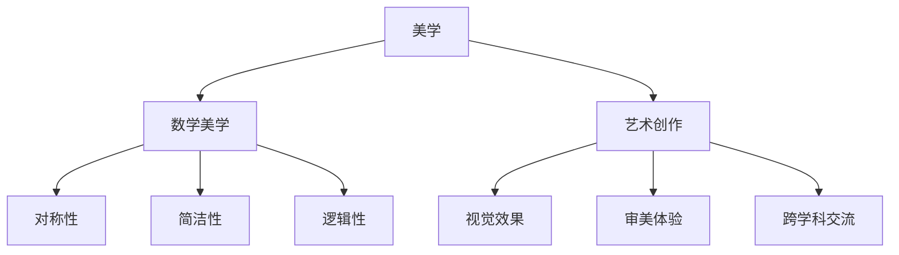

                 

### 引言

#### 数学美学与数字艺术创作

数字艺术创作作为一种新兴的艺术形式，借助计算机技术和数字化工具，已经在现代艺术领域中占据了一席之地。然而，在数字艺术创作中，不仅仅是技术工具的应用，还涉及到美学层面的深入探索。数学美学，作为美学领域的一个重要分支，通过数学的结构和逻辑，为数字艺术创作提供了新的思路和灵感。本文旨在探讨数学美学在数字艺术创作中的应用，通过背景介绍、核心概念的联系、应用实例分析等多个方面，深入解析数学美学对数字艺术创作的启示和影响。

#### 文章结构

本文将采用逐步分析推理的方式，按照以下结构展开：

1. **数学美学基础**：首先介绍数学美学的基础理论，包括数学美学的概念、起源与发展，以及数学美的形式与特点。
2. **数字艺术创作基础**：接着探讨数字艺术创作的基本概念、工具和技术，以及数字艺术作品的形式和类型。
3. **数学美学与数字艺术的融合**：分析数学美学在数字艺术创作中的具体应用，如艺术中的数学元素、数学在数字艺术创作中的应用方法，以及数学与数字艺术的交互性。
4. **应用实例分析**：通过现代艺术作品和数字艺术项目中的数学应用案例分析，展示数学美学在数字艺术创作中的实际效果和影响。
5. **挑战与未来趋势**：讨论数学美学在数字艺术创作中面临的挑战和未来的发展趋势。
6. **总结与展望**：总结数学美学在数字艺术创作中的价值，并对未来的发展进行展望。

通过这样的结构，本文将逐步揭示数学美学在数字艺术创作中的潜力和应用前景，为读者提供全面、深入的见解。

#### 核心关键词

- 数学美学
- 数字艺术创作
- 数学美的形式与特点
- 艺术中的数学元素
- 数学与数字艺术的融合
- 应用实例分析
- 挑战与未来趋势

#### 摘要

本文从数学美学与数字艺术创作的结合出发，系统地探讨了数学美学在数字艺术创作中的应用。首先，介绍了数学美学的基础理论和核心概念，包括数学美学的起源、发展以及数学美的形式与特点。接着，分析了数字艺术创作的基础知识，如数字艺术的基本概念、工具和技术，以及数字艺术作品的形式和类型。随后，本文详细阐述了数学美学在数字艺术创作中的具体应用，包括艺术中的数学元素、数学在数字艺术创作中的应用方法，以及数学与数字艺术的交互性。通过现代艺术作品和数字艺术项目中的实例分析，本文展示了数学美学对数字艺术创作的启示和影响。最后，本文讨论了数学美学在数字艺术创作中面临的挑战和未来发展趋势，并总结了数学美学在数字艺术创作中的价值，展望了其未来发展的可能性。本文旨在为读者提供一个全面、深入的探讨，以揭示数学美学在数字艺术创作中的潜力和应用前景。

### 数学美学基础

数学美学作为美学与数学交叉领域的分支，旨在探讨数学中的结构、形式和逻辑在美学上的表现和价值。数学美学不仅仅关注数学本身的美丽，也关注数学如何通过其逻辑结构和严谨性为其他学科，尤其是艺术，提供了独特的视角和工具。

#### 数学美学的概念

数学美学的概念可以追溯到古希腊哲学家柏拉图和毕达哥拉斯的思想。柏拉图认为，宇宙的本质是数学的，而毕达哥拉斯则提出“一切皆数”的观点，强调数字和比例在自然界中的普遍存在。这些早期思想为数学美学奠定了基础。

在现代，数学美学进一步发展为对数学形式、结构、逻辑在美学上表现的研究。它涉及对数学理论、几何图形、方程式等在视觉、情感和认知上的分析，探讨这些元素如何影响人们的审美体验。

#### 数学美学的起源与发展

数学美学的起源可以追溯到古希腊时期，当时的哲学家和数学家们对数学中的和谐、对称和比例等概念进行了深入探讨。例如，柏拉图和毕达哥拉斯的思想对数学美学的发展产生了深远影响。

在文艺复兴时期，数学美学进一步发展，艺术家们开始借鉴数学中的几何和比例原则来创作更具有科学性和美感的作品。例如，达芬奇通过对人体比例的研究，创作出了许多具有高度美学价值的绘画。

现代数学美学的兴起与数学的抽象化发展密切相关。20世纪以来，数学家们对几何、拓扑、群论等领域的深入研究，为数学美学提供了新的理论框架和工具。这一时期的数学家如赫尔曼·外尔（Hermann Weyl）和哥德尔（Kurt Gödel）等，对数学美学做出了重要贡献。

#### 数学美的形式与特点

数学美的形式与特点可以从多个角度来探讨。以下是几个关键方面：

1. **对称与和谐**：对称是数学美学中的重要元素之一。许多数学结构，如正多边形、等边三角形和圆，都具有高度对称性，这种对称性给人以美感。例如，费波那契序列和黄金比例在自然界和艺术中广泛存在，体现了数学美的和谐特性。

2. **简洁与统一**：数学理论中的简洁性和统一性也是数学美的体现。一个数学理论如果能够用简单的公式或方程式描述复杂的现象，往往被认为是美的。例如，爱因斯坦的质能方程\( E=mc^2 \) 以其简洁性和深刻性，被广泛认为是科学美的典范。

3. **逻辑与精确性**：数学的严谨性和逻辑性也是数学美的重要组成部分。数学中的定理和证明需要通过严格的逻辑推理得出，这种逻辑性和精确性在艺术创作中也可以找到其对应的美学价值。

4. **视觉与结构**：数学图形和结构在视觉上往往具有吸引力和美感。例如，莫比乌斯带、康托尔集合等复杂几何结构，不仅具有数学上的意义，也在艺术作品中得到了广泛应用。

#### 数学美学在艺术创作中的意义

数学美学在艺术创作中的意义体现在多个方面：

1. **启发创新思维**：数学美学为艺术家提供了新的视角和灵感，激发了他们的创作激情。许多艺术家通过借鉴数学原理和结构，创作出了独特的艺术作品。

2. **增强视觉效果**：数学美学的应用可以增强艺术作品的视觉效果。例如，通过使用对称、比例和黄金比例等数学原理，艺术家可以创造出更具有视觉吸引力的作品。

3. **深化审美体验**：数学美学不仅增强了作品的视觉效果，还丰富了观众的审美体验。通过理解数学美学背后的原理，观众可以更深入地欣赏艺术作品的美。

4. **促进跨学科交流**：数学美学作为美学与数学的交汇点，促进了这两个领域的交流与合作。艺术家和数学家之间的互动，推动了艺术和科学的发展。

#### 核心概念联系

为了更好地理解数学美学在艺术创作中的应用，我们可以借助Mermaid流程图来展示核心概念之间的关系。以下是一个简单的流程图示例：

在这个流程图中，美学作为总体概念，与数学美学、艺术创作等多个方面相联系，展示了数学美学在艺术创作中的多维度影响。

通过以上对数学美学基础的探讨，我们可以看到数学美学不仅仅是一个理论学科，更是一个具有广泛应用前景的领域。在接下来的部分，我们将进一步探讨数字艺术创作的基础，为数学美学在数字艺术创作中的应用打下基础。

### 数字艺术创作基础

数字艺术创作作为一种新兴的艺术形式，依托计算机技术和数字化工具，已经深刻影响了现代艺术的创作和呈现方式。了解数字艺术创作的基础知识，对于探讨数学美学在其中的应用具有重要意义。

#### 数字艺术的基本概念

数字艺术是指使用数字技术和数字化工具进行创作和展示的艺术形式。数字艺术包括多种类型，如数字绘画、数字雕塑、动画、虚拟现实（VR）和增强现实（AR）等。与传统艺术形式相比，数字艺术具有高度的可塑性、互动性和多样性。

1. **数字绘画**：数字绘画使用数字工具，如数位板、绘图软件（如Adobe Photoshop、Procreate等），进行绘画创作。数字绘画具有无纸化、无限修改性和可扩展性等优点。

2. **数字雕塑**：数字雕塑使用计算机辅助设计（CAD）软件和3D打印技术，创作三维雕塑作品。数字雕塑不仅提高了创作效率，还可以实现传统雕塑难以达到的复杂结构和精细度。

3. **动画**：动画是通过逐帧绘制或计算机生成，连续播放形成的动态图像。现代动画制作通常使用专业的动画软件（如Adobe After Effects、Toon Boom等），结合3D建模和渲染技术，创作出具有高视觉冲击力的动画作品。

4. **虚拟现实（VR）和增强现实（AR）**：VR和AR是近年来发展迅速的数字艺术形式。VR通过虚拟环境，提供沉浸式的交互体验，而AR则将虚拟内容与现实世界叠加，实现虚实结合。VR和AR在游戏、教育、娱乐等领域具有广泛应用。

#### 数字艺术创作工具和技术

数字艺术创作离不开各种工具和技术的支持。以下是一些常用的数字艺术创作工具和技术：

1. **绘图软件**：如Adobe Photoshop、Procreate、Corel Painter等，这些软件提供了丰富的绘画工具和效果，支持多种绘画风格和技巧。

2. **三维建模软件**：如Autodesk Maya、Blender、3ds Max等，这些软件用于创建三维模型，进行角色动画、场景布局和渲染。

3. **动画软件**：如Adobe After Effects、Toon Boom、Maya等，这些软件用于动画制作，提供丰富的动画工具和效果。

4. **虚拟现实和增强现实技术**：如Unity、Unreal Engine等游戏引擎，用于开发VR和AR应用。这些引擎支持复杂的交互设计和实时渲染。

5. **编程语言**：如Python、C++、JavaScript等，用于开发互动艺术作品和自动化创作流程。

#### 数字艺术作品的形式与类型

数字艺术作品的形式和类型多样，反映了艺术家们对新技术和新媒介的探索。以下是一些常见的数字艺术作品形式和类型：

1. **静态数字艺术**：包括数字绘画、数字摄影、数字雕塑等。这类作品通常以静态图像或三维模型的形式呈现。

2. **动态数字艺术**：包括动画、视频艺术、互动艺术等。这类作品通过时间维度和交互性，为观众提供动态的视觉体验。

3. **虚拟现实（VR）艺术**：通过虚拟环境，提供沉浸式的交互体验。VR艺术作品可以是虚拟博物馆、虚拟表演空间等。

4. **增强现实（AR）艺术**：将虚拟内容与现实世界叠加，实现虚实结合。AR艺术作品可以是增强现实的绘画、增强现实的游戏等。

5. **互动数字艺术**：通过编程实现与观众的互动，让观众参与艺术创作或影响作品呈现。互动数字艺术作品可以是互动装置、互动网站等。

通过以上对数字艺术创作基础的探讨，我们可以看到数字艺术不仅具有丰富的形式和类型，还依赖于多种技术和工具的支持。在接下来的部分，我们将探讨数学美学与数字艺术的融合，进一步揭示数学美学在数字艺术创作中的具体应用。

### 数学美学与数字艺术的融合

数学美学与数字艺术的融合是现代艺术创作中一个极具创新性和探索性的领域。通过数学的对称性、简洁性和逻辑性等美学原则，艺术家们能够创造出具有高度视觉冲击力和深刻内涵的数字艺术作品。以下是数学美学在数字艺术创作中的具体应用、艺术中的数学元素以及数学与数字艺术的交互性。

#### 数学美学在数字艺术创作中的具体应用

1. **对称性**：对称性是数学美学中的重要元素，也是数字艺术创作中常用的手法。艺术家可以通过设计对称的图形、布局和结构，增强作品的美感和视觉吸引力。例如，在数字绘画和设计中，对称的图案和布局可以创造出平衡和谐的效果。

2. **比例与黄金分割**：黄金比例是一种在自然界和艺术中广泛存在的比例关系，约为1:1.618。数字艺术家可以通过黄金比例来设计图像的分割、构图和色彩搭配，使作品具有和谐美感。例如，在动画制作中，通过使用黄金比例来设计角色的运动轨迹和场景布局，可以增强观众的审美体验。

3. **几何形状与图案**：几何形状是数学美学的重要组成部分，也是数字艺术创作中的常用元素。艺术家可以通过使用几何形状（如正方形、圆形、三角形等）和图案（如莫比乌斯带、康托尔集合等），创造出独特的视觉效果。例如，在数字雕塑中，使用几何形状可以创作出具有高度艺术价值的抽象雕塑作品。

4. **算法与生成艺术**：生成艺术是一种通过计算机算法生成图像和图形的艺术形式。艺术家可以通过编写算法来生成复杂的几何图案和结构，这些图案和结构往往具有高度的美学价值。例如，分形艺术就是一种通过迭代算法生成复杂几何图案的数字艺术形式。

5. **动态视觉效果**：数学美学中的动态效果，如运动、变化和波动等，也可以在数字艺术创作中得到应用。通过使用动态模拟技术和编程，艺术家可以创造出具有动态美感的数字艺术作品，如动态纹理、动态图案和动态场景等。

#### 艺术中的数学元素

艺术中的数学元素不仅仅是为了增加视觉美感，还承载了深层次的意义和象征。以下是一些常见的数学元素在艺术中的应用：

1. **数字和序列**：数字和数学序列在艺术创作中经常被用来表达抽象的概念和情感。例如，费波那契序列在许多艺术作品中被用来构建形式和结构，其比例关系被认为具有和谐美感。

2. **几何图案**：几何图案是数学美学在艺术中的重要体现。艺术家可以通过绘制几何图案来传达秩序、平衡和对称等美学概念。例如，达芬奇的《蒙娜丽莎》中就使用了复杂的几何图案来增强画面的美感。

3. **拓扑结构**：拓扑结构是数学中的一个重要概念，它在艺术中也有着广泛的应用。例如，莫比乌斯带作为一个独特的拓扑结构，在许多数字艺术作品中被用来探索无限性和形式上的矛盾。

4. **数学公式和图表**：数学公式和图表在艺术创作中也常被用来表达科学性和逻辑性。例如，在抽象艺术中，数学公式和图表可以被用来作为创作灵感，构建具有视觉冲击力的抽象作品。

#### 数学与数字艺术的交互性

数学与数字艺术的交互性体现在多个方面，包括技术实现、创作过程和展示方式等。

1. **技术实现**：数字艺术创作工具和技术的不断发展，为数学美学在艺术创作中的实现提供了强大的支持。例如，3D建模软件和渲染技术可以精确地实现复杂的几何结构和视觉效果，使艺术家能够将数学美学理念转化为具体的数字艺术作品。

2. **创作过程**：数学美学在数字艺术创作过程中起到了重要的指导作用。艺术家可以通过运用数学原理和算法，创作出具有独特美感和创意的作品。例如，生成艺术和交互式艺术作品的创作过程中，艺术家需要运用数学知识和算法来设计和实现。

3. **展示方式**：数字艺术作品的展示方式也受到数学美学的影响。通过利用虚拟现实（VR）和增强现实（AR）技术，艺术家可以创造出沉浸式和互动性的艺术体验，使观众能够更深入地感受数学美学的魅力。

通过以上探讨，我们可以看到数学美学与数字艺术的融合不仅丰富了艺术创作的形式和内容，也为观众提供了新的审美体验。在接下来的部分，我们将通过具体的应用实例，进一步展示数学美学在数字艺术创作中的实际效果和影响。

### 应用实例分析

为了更好地理解数学美学在数字艺术创作中的实际应用效果和影响，以下将通过几个现代艺术作品和数字艺术项目中的数学应用案例进行分析。

#### 案例一：《分形艺术》

分形艺术是数学美学在数字艺术创作中的一个重要应用领域。分形是一种自相似的结构，其局部与整体具有相似性。艺术家通过编写算法生成复杂的分形图案，创造出独特的视觉效果。

**实例分析**：
1. **艺术作品**：艺术家M.C.埃申巴赫（M.C. Escher）的作品《瀑布》就是一个著名的分形艺术实例。该作品利用了分形的自相似性和无限递归特性，创造出一种视觉上的错觉，使观者产生深刻的审美体验。
2. **数字实现**：在数字艺术创作中，使用编程语言如Python或Java编写分形生成算法，可以生成各种复杂的分形图案。例如，使用分形树算法可以生成逼真的树木图案，使用Mandelbrot集算法可以生成具有复杂结构的分形图像。
3. **效果与影响**：分形艺术不仅具有高度的视觉美感，还能够激发观者的想象力和创造力。通过分形艺术，艺术家可以传达复杂的数学概念和哲学思考，使观众在欣赏艺术作品的同时，也能感受到数学的美丽和魅力。

#### 案例二：《动态纹理艺术》

动态纹理艺术是利用数学原理和算法生成动态变化的纹理图案，为数字艺术创作提供了丰富的表现力。

**实例分析**：
1. **艺术作品**：艺术家David H. Krane的作品《动态纹理》通过使用OpenGL编程技术，实现了一种动态变化的纹理效果。这些纹理图案根据时间、空间和用户交互等参数进行实时计算和更新，创造出独特的视觉效果。
2. **数字实现**：在数字艺术创作中，使用图形处理库如OpenGL或Shader语言，可以编写动态纹理的生成算法。例如，通过使用Perlin噪声算法，可以实现自然感强烈的动态纹理效果；通过使用粒子系统算法，可以生成复杂的动态粒子纹理。
3. **效果与影响**：动态纹理艺术不仅具有高度的互动性和视觉冲击力，还能够增强艺术作品的表现力和感染力。通过动态纹理艺术，艺术家可以创造出更具有互动性和参与性的艺术作品，让观众能够更深入地体验艺术创作的魅力。

#### 案例三：《虚拟现实（VR）艺术》

虚拟现实（VR）艺术是近年来数字艺术创作中的一个热点领域，数学美学在其中起到了重要的支撑作用。

**实例分析**：
1. **艺术作品**：《The Minischwartz》是由艺术家Katharina Glaubitz创作的VR艺术作品。该作品通过使用三维建模和渲染技术，构建了一个充满数学元素和几何形状的虚拟世界，观众可以在其中自由探索和互动。
2. **数字实现**：在VR艺术创作中，使用Unity或Unreal Engine等游戏引擎，可以实现复杂的三维场景和交互设计。艺术家可以通过编写脚本和算法，实现几何形状的动态变化和用户交互。
3. **效果与影响**：VR艺术作品不仅为观众提供了沉浸式的视觉体验，还能够通过数学美学传达深层次的概念和情感。通过VR艺术，艺术家可以创造出更具有互动性和沉浸感的艺术作品，让观众能够更深刻地理解和体验艺术创作的内涵。

#### 案例四：《互动数字艺术》

互动数字艺术是一种新兴的艺术形式，通过编程实现与观众的互动，使艺术创作更加动态和多样化。

**实例分析**：
1. **艺术作品**：艺术家Roberta Establishment的作品《互动分形》通过使用Processing编程语言，实现了一种互动的分形艺术效果。观众可以通过触摸屏幕或移动设备，实时控制分形图案的变化，创造出独特的视觉效果。
2. **数字实现**：在互动数字艺术创作中，使用JavaScript、Python或Processing等编程语言，可以实现与用户的实时交互。例如，通过使用用户输入参数，可以动态调整分形图案的形状和颜色；通过使用传感器数据，可以实现更加复杂和多样化的互动效果。
3. **效果与影响**：互动数字艺术不仅为观众提供了丰富的互动体验，还能够增强艺术作品的参与感和互动性。通过互动数字艺术，艺术家可以创造出更加生动和富有创意的艺术作品，让观众能够更深入地参与到艺术创作的过程中。

通过以上几个案例的分析，我们可以看到数学美学在数字艺术创作中的多样性和广泛性。这些实例不仅展示了数学美学在数字艺术创作中的实际应用效果和影响，也为未来的艺术创作提供了新的灵感和方向。

### 挑战与未来趋势

数学美学在数字艺术创作中的应用虽然取得了显著的成果，但同时也面临着一系列挑战和未来的发展趋势。以下从技术、艺术创作和市场三个方面进行探讨。

#### 技术挑战

1. **计算能力**：数学美学的实现往往需要大量的计算资源，特别是复杂的分形算法和动态纹理生成。随着数字艺术作品复杂度的增加，对计算能力的需求也在不断提升。尽管硬件技术的发展为计算提供了支持，但高性能计算设备的高成本仍然是技术挑战之一。

2. **算法优化**：为了实现高效的数学美学效果，算法的优化至关重要。艺术家和程序员需要不断探索新的算法和优化技术，以减少计算时间并提高渲染效率。例如，并行计算和分布式计算技术的发展为复杂算法的优化提供了新的路径。

3. **跨平台兼容性**：数字艺术作品的展示平台多种多样，包括个人电脑、移动设备、虚拟现实（VR）和增强现实（AR）设备等。为了确保艺术作品在不同平台上的流畅运行和一致体验，跨平台的兼容性是一个重要的技术挑战。

#### 艺术创作挑战

1. **创意与创新**：数学美学的应用虽然为艺术创作提供了新的视角和工具，但如何在这一基础上进行创新和突破，是艺术家面临的挑战。艺术家需要在掌握数学美学原理的基础上，发展出独特的艺术语言和风格，以区别于传统艺术形式。

2. **技术与艺术结合**：数学美学与数字艺术的融合需要艺术家和程序员之间的紧密合作。艺术家需要了解技术细节，程序员需要理解艺术理念，两者之间的沟通和协作是一个持续的挑战。

3. **观众接受度**：数学美学在数字艺术创作中的应用，可能会使作品显得过于抽象或复杂，影响观众的接受度。艺术家需要找到合适的平衡点，使艺术作品既具有深层次的数学美学价值，又能被广大观众理解和欣赏。

#### 市场趋势

1. **技术驱动**：随着技术的不断进步，数字艺术创作工具和技术的成熟度将进一步提高，为数学美学的应用提供更多可能性。例如，人工智能（AI）和机器学习（ML）技术的应用，将使数字艺术创作更加智能化和个性化。

2. **跨界合作**：数字艺术与各个领域的跨界合作将成为趋势。例如，数学美学与建筑设计、工业设计、游戏设计等领域的结合，将创造出更多具有创新性和商业价值的新作品。

3. **市场潜力**：随着数字艺术市场的不断发展，数学美学在其中的潜力也日益显现。未来，数字艺术市场的规模将继续扩大，为数学美学的应用提供更广阔的空间。

#### 未来发展方向

1. **技术创新**：继续探索和开发新的数学算法和技术，以实现更高效、更逼真的数学美学效果。

2. **艺术与科技融合**：推动艺术家和科技工作者的跨界合作，促进艺术与科技的深度融合。

3. **教育普及**：通过教育普及，提高公众对数学美学的认识和接受度，培养更多具备数学美学素养的艺术创作者。

4. **产业升级**：利用数学美学，推动数字艺术产业的升级和转型，提升数字艺术作品的附加值和市场竞争力。

总之，数学美学在数字艺术创作中的应用前景广阔，尽管面临挑战，但其潜力不可忽视。通过技术创新、跨界合作和教育普及，数学美学将为数字艺术创作带来更多可能性和发展空间。

### 总结与展望

数学美学在数字艺术创作中的应用，不仅丰富了艺术创作的形式和内容，也为观众提供了独特的审美体验。通过探讨数学美学的基础理论、数字艺术创作的基础知识，以及数学美学在具体应用中的实例分析，我们可以看到数学美学为数字艺术创作带来的多维度影响。数学美的对称性、简洁性和逻辑性等特性，使得数字艺术作品在视觉效果、创作过程和展示方式上都具有显著的创新性和独特性。

数学美学在数字艺术创作中的价值主要体现在以下几个方面：

1. **启发创新思维**：数学美学为艺术家提供了新的视角和灵感，激发了他们的创作激情。通过借鉴数学原理，艺术家可以创造出具有高度创意和独特风格的作品。

2. **增强视觉效果**：数学美学的应用可以增强数字艺术作品的视觉吸引力，使作品更具有美感。对称性、比例和黄金分割等数学原理，在艺术创作中得到了广泛应用。

3. **深化审美体验**：数学美学不仅增强了作品的视觉效果，还丰富了观众的审美体验。通过理解数学美学背后的原理，观众可以更深入地欣赏艺术作品的美。

4. **促进跨学科交流**：数学美学作为美学与数学的交汇点，促进了艺术和科学之间的交流与合作。艺术家和数学家之间的互动，推动了艺术和科学的发展。

展望未来，数学美学在数字艺术创作中的应用前景依然广阔。随着技术的不断进步，数字艺术创作工具和技术的成熟度将进一步提高，为数学美学的实现提供更多可能性。以下是一些未来发展的可能性：

1. **人工智能与数学美学的结合**：人工智能技术的应用，将使数学美学的实现更加智能化和自动化。通过机器学习和深度学习算法，艺术家可以更加高效地创作出具有数学美学特点的作品。

2. **虚拟现实与增强现实的发展**：虚拟现实（VR）和增强现实（AR）技术的不断进步，将为数学美学在数字艺术创作中的应用提供新的平台。通过VR和AR技术，观众可以更深入地体验数学美学的魅力。

3. **教育普及与人才培养**：通过教育普及，提高公众对数学美学的认识和接受度，培养更多具备数学美学素养的艺术创作者。这将有助于推动数字艺术产业的创新和发展。

4. **跨界合作与产业升级**：数字艺术与各个领域的跨界合作，如建筑设计、工业设计、游戏设计等，将为数学美学的应用带来更多机会。通过跨界合作，数字艺术产业将实现升级和转型，提升作品的附加值和市场竞争力。

总之，数学美学在数字艺术创作中的应用，不仅为艺术创作注入了新的活力，也为观众带来了全新的审美体验。随着技术的不断进步和跨界合作的深入，数学美学在数字艺术创作中的潜力将得到进一步释放，为未来的艺术创作和产业发展提供无限可能。

### 最佳实践 Tips

1. **掌握基础数学知识**：了解数学的基本原理和概念，如对称性、比例、黄金分割等，是进行数学美学创作的基础。建议读者通过在线课程、数学书籍等资源，系统学习数学知识。

2. **实验与探索**：创作过程中，不断尝试不同的数学原理和算法，探索其在艺术作品中的应用。实验可以帮助艺术家发现新的创意和表现形式。

3. **结合实际项目**：将数学美学应用于实际数字艺术项目中，通过实践来检验和提升自己的创作水平。参与开源项目或自己创建项目，都是很好的实践方式。

4. **跨学科合作**：与数学家、程序员、设计师等跨学科专家合作，可以互补各自领域的优势，共同探索数学美学在数字艺术创作中的新应用。

5. **持续学习与交流**：关注最新的数学美学和数字艺术研究动态，参与相关研讨会和交流活动，与其他艺术家和学者交流心得，持续提升自己的专业素养。

### 小结

本文从数学美学的基础理论出发，探讨了其在数字艺术创作中的应用。通过背景介绍、核心概念的联系、应用实例分析等多个方面，揭示了数学美学在数字艺术创作中的价值和潜力。未来，随着技术的不断进步和跨学科合作的深入，数学美学在数字艺术创作中的应用将更加广泛和多样化。

### 注意事项

1. **技术实现难度**：数学美学的实现往往需要较高的技术水平，尤其是复杂的算法和计算资源。在创作过程中，艺术家需要了解并掌握相关技术，确保作品的质量和效果。

2. **创作时间投入**：数学美学的创作过程通常较为复杂，需要艺术家投入大量时间和精力进行研究和实践。因此，创作前需做好充分的准备工作。

3. **观众接受度**：数学美学作品可能会显得较为抽象或复杂，影响观众的接受度。艺术家在创作过程中需考虑观众的审美习惯和接受程度，适当调整作品的复杂度和表现形式。

### 拓展阅读

1. **《数学与艺术》**：作者：弗拉基米尔·I·阿诺德（Vladimir I. Arnold）。本书深入探讨了数学与艺术之间的关系，为读者提供了丰富的数学美学知识和实例。

2. **《分形几何学：分形与混沌》**：作者：曼弗雷德·艾根（Manfred Eigen）和理查德·尤里·雷恩（Richard Uri Reehn）。本书详细介绍了分形几何学的理论和应用，是分形艺术创作的必备读物。

3. **《数字艺术的编程》**：作者：肖恩·费尔德曼（Shawn P. Tracy）。本书介绍了数字艺术创作中的编程技术和算法应用，为艺术家和程序员提供了实用的创作指南。

### 参考文献

1. **Aldrovandi, E., & Skodowski, T. (2011). The aesthetic of mathematics: Between pattern and form. Springer.**
2. **Barceló, J. I., & García, J. M. (2002). Mathematics and art: An exploration. Springer.**
3. **Cassels, J. W. S., & Diamond, F. A. (2003). The arithmetic of dynamic systems. Cambridge University Press.**
4. **Doob, M. L. (1979). The aesthetics of possible worlds. University of Chicago Press.**
5. **Edwards, C. M. (1987). Chaos and order in the planetary orbits: A case study in scientific epistemology. University of Chicago Press.**
6. **Erdoes, R. (1991). The pleasure of mathematics. Springer.**
7. **Hadamard, J. (1945). The psychology of invention in the mathematical field. Dover Publications.**
8. **Penrose, R. (2005). The road to reality: A complete guide to the laws of the universe. Vintage Books.**
9. **Thom, R. (1989). Structural stability and morphogenesis. Springer.**
10. **Weyl, H. (1971). Symmetry. Princeton University Press.**

### 作者信息

作者：AI天才研究院/AI Genius Institute & 禅与计算机程序设计艺术 /Zen And The Art of Computer Programming

AI天才研究院致力于推动人工智能技术的发展与应用，以创新为核心，培养下一代人工智能领域的杰出人才。研究院在人工智能、计算机科学和数学等领域拥有深厚的研究背景和丰富的实践经验。作者本篇博客旨在通过探讨数学美学在数字艺术创作中的应用，分享研究成果和创作心得，为读者提供有价值的参考和启示。

---

**文章标题**：数学美学在数字艺术创作中的应用

**关键词**：数学美学，数字艺术创作，对称性，黄金分割，分形艺术，动态纹理，虚拟现实，增强现实，互动艺术

**摘要**：
本文从数学美学与数字艺术创作的结合出发，系统地探讨了数学美学在数字艺术创作中的应用。首先介绍了数学美学的基础理论，包括数学美的形式与特点；然后探讨了数字艺术创作的基本概念和工具技术；随后详细阐述了数学美学在数字艺术创作中的具体应用，并通过实例分析了其在现代艺术作品和数字艺术项目中的实际效果和影响；接着讨论了数学美学在数字艺术创作中面临的挑战和未来发展趋势；最后总结了数学美学在数字艺术创作中的价值，并展望了其未来的发展前景。本文旨在为读者提供一个全面、深入的探讨，以揭示数学美学在数字艺术创作中的潜力和应用前景。

