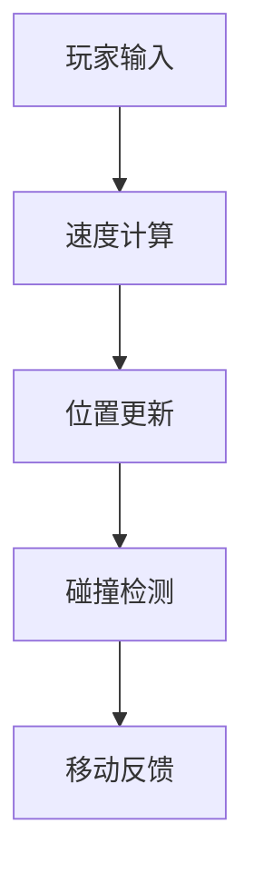
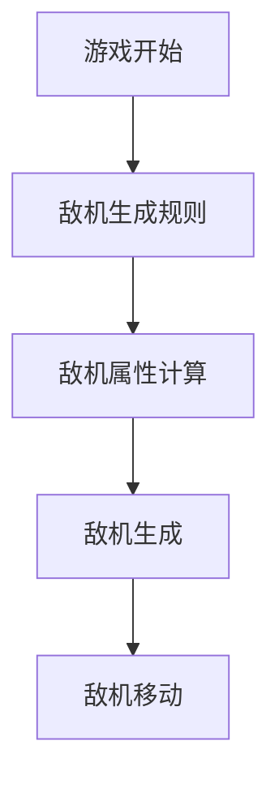
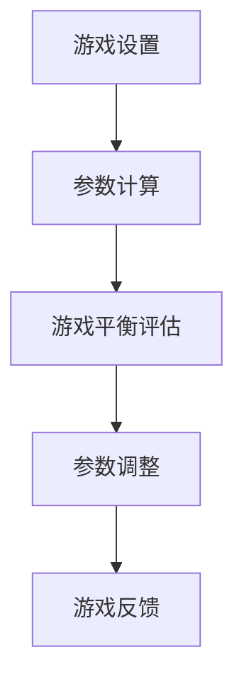
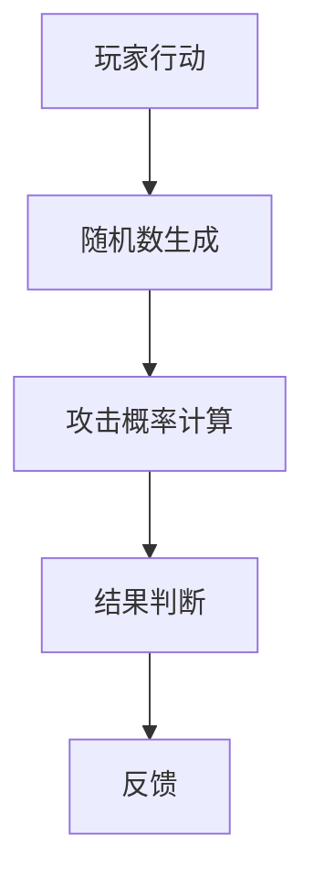
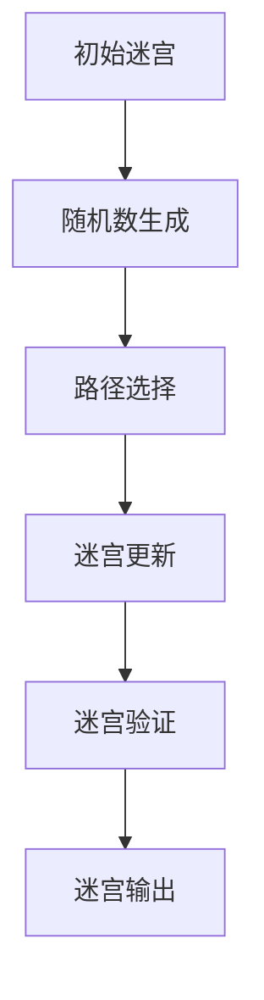
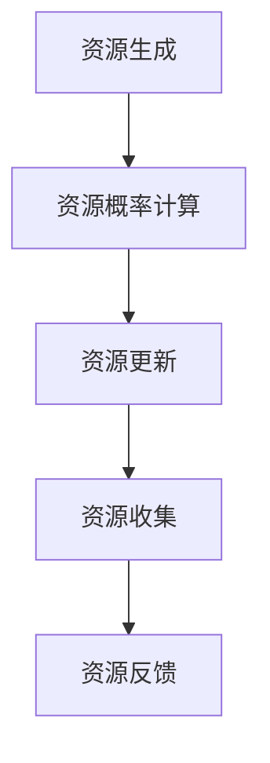

                 

### 文章标题

数学美学在游戏设计中的应用

### 关键词

数学美学、游戏设计、数学模型、美学理论、游戏元素设计、游戏交互设计、游戏机制设计

### 摘要

本文旨在探讨数学美学在游戏设计中的应用，通过分析数学美学的基本概念、核心原理以及其在游戏设计中的实际应用，揭示数学美学如何提升游戏设计的艺术性和科学性。文章首先介绍了数学美学与游戏设计的结合背景，随后详细阐述了数学美学基础、游戏设计中的美学理论，并结合具体案例分析了数学模型在游戏设计中的应用，最终对数学美学在游戏设计中的未来展望进行了探讨。

### 引言：数学美学与游戏设计的结合背景

在当今高速发展的信息技术时代，游戏设计已成为一个充满活力和创新性的领域。随着游戏技术的不断进步，游戏设计从简单的娱乐工具逐渐演变为一门综合艺术，其中包含视觉艺术、声音设计、编程和数学等多个领域的知识。在此背景下，数学美学作为一个新兴的研究领域，逐渐进入游戏设计师的视野。

数学美学是一门探讨数学形式美感的学科，它涉及数学形式与美学体验之间的相互作用。数学美学的核心在于通过数学的严谨性和形式美感，创造出具有视觉和思维冲击力的艺术作品。在游戏设计中，数学美学不仅为游戏提供了独特的视觉效果，还增强了游戏的可玩性和艺术性。

数学美学与游戏设计的结合具有显著的意义。首先，数学美学的应用能够提升游戏的艺术性，使得游戏不仅具备娱乐功能，还具有审美价值。其次，数学美学为游戏设计提供了科学依据，通过数学模型和公式，可以更好地控制游戏中的元素和行为，提高游戏设计的效率和精确性。此外，数学美学还有助于创新游戏设计理念，为游戏开发者提供新的设计思路和创作空间。

本文将围绕数学美学在游戏设计中的应用展开讨论，首先介绍数学美学的基本概念和原理，然后探讨游戏设计中的美学理论，接着分析数学模型在游戏设计中的应用，最后对未来数学美学在游戏设计中的发展前景进行展望。

### 数学美学基础

数学美学作为一门综合性学科，既包含了数学的严谨逻辑，也融合了美学的感性认知。为了更好地理解数学美学在游戏设计中的应用，我们需要首先了解其基础概念和原理。

#### 数学美学的定义

数学美学是探讨数学形式美感的学科，它涉及数学形式与美学体验之间的相互作用。数学美学不仅关注数学形式本身，还关注这些形式对人们感官和思维的影响。数学美学的核心在于通过数学的严谨性和形式美感，创造出具有视觉和思维冲击力的艺术作品。

#### 数学美学的主要流派

1. **形式美学**：形式美学关注数学形式的结构、对称性和比例等特征，强调数学形式的美学价值。例如，毕达哥拉斯定理中的整数比例关系被认为是美的象征，其简洁性和对称性被视为形式美学的典范。

2. **符号美学**：符号美学关注数学符号和公式的美学特性，认为数学符号和公式具有独特的视觉美感和形式美感。例如，欧拉公式 \( e^{i\pi} + 1 = 0 \) 被广泛认为是数学符号美学中的杰作，其简洁和统一性给人深刻的视觉和思维体验。

3. **现象美学**：现象美学关注数学形式在现实世界中的应用和影响，探讨数学形式如何影响人们的生活体验。例如，几何图形在建筑设计中的应用，以及数学模型在自然界中的表现，都是现象美学的实例。

#### 数学美学的应用价值

数学美学的应用价值主要体现在以下几个方面：

1. **提高审美素养**：数学美学通过数学形式的探索，提高了人们对美的感知和欣赏能力。在游戏设计中，设计师可以运用数学美学的原理，创造出更具有艺术性的游戏界面和视觉效果。

2. **创新设计思路**：数学美学的应用为游戏设计师提供了新的设计思路和工具。通过运用数学模型和公式，设计师可以更好地控制游戏中的元素和行为，实现更具有创意和科学性的游戏设计。

3. **提升用户体验**：数学美学的应用能够提升游戏的艺术性和用户体验。例如，通过数学美学的原理设计角色造型、场景布局和游戏界面，可以增强玩家的沉浸感和满意度。

#### 数学美学在游戏设计中的应用实例

1. **角色设计**：在游戏角色设计中，数学美学的应用主要体现在角色的比例、对称性和形态美感上。例如，著名的游戏《超级马里奥》中的角色设计就充分运用了数学美学的原理，使得角色具有独特的视觉吸引力。

2. **场景布局**：游戏场景的布局也可以通过数学美学的原理进行优化。例如，通过数学模型和公式，设计师可以计算出最佳的视觉重心和视觉流动路径，从而创造出更加美观和吸引人的游戏场景。

3. **游戏机制**：数学美学的应用还可以体现在游戏机制的设计上。例如，通过数学模型和公式，可以设计出更加公平、有趣和富有挑战性的游戏规则，从而提升玩家的游戏体验。

总之，数学美学为游戏设计提供了丰富的理论基础和实践指导。通过深入了解和运用数学美学，游戏设计师可以创造出更加具有艺术性和科学性的游戏作品，为玩家带来更加丰富和愉悦的游戏体验。

### 游戏设计中的美学理论

在游戏设计中，美学理论扮演着至关重要的角色，它不仅关乎游戏的视觉和听觉体验，还涉及到游戏的整体氛围、情感表达和玩家沉浸感。以下将详细探讨游戏设计中的美学理论，包括基本原理、设计原则以及其在实际应用中的体现。

#### 游戏设计美学的基本原理

1. **对称与平衡**：对称和平衡是美学设计中的基本原则之一。对称性可以创造出稳定和和谐的感觉，而平衡则强调视觉元素在空间上的均匀分布。在游戏设计中，对称和平衡的应用可以体现在角色设计、场景布局和用户界面中。例如，游戏《魔兽世界》中的场景设计就充分利用了对称和平衡原则，使得玩家在视觉上感到舒适和沉浸。

2. **对比与统一**：对比和统一是设计中的另一对重要原则。对比强调视觉差异，可以吸引玩家的注意力，而统一则通过一致的风格和色调，创造出和谐的整体效果。游戏设计师可以通过对比和统一的巧妙结合，设计出既具有视觉冲击力，又保持整体一致性的游戏元素。例如，《英雄联盟》中的英雄设计和地图布局，就很好地体现了对比与统一的原则。

3. **节奏与动感**：节奏和动感是游戏设计中创造动态效果的重要手段。通过合理安排游戏中的动作、声音和视觉元素，可以创造出流畅的节奏感和动感。例如，《极品飞车》系列游戏通过高速驾驶场景和刺激的音乐，营造出了强烈的节奏感和动感。

4. **色彩与视觉吸引力**：色彩在游戏设计中具有强大的视觉吸引力。正确的色彩搭配可以提升游戏的美观度和吸引力。例如，《塞尔达传说：荒野之息》通过使用鲜艳而和谐的色彩，为玩家创造了一个美丽而引人入胜的游戏世界。

5. **情感表达与沉浸感**：游戏设计中的美学理论还涉及到情感表达和沉浸感。通过设计富有情感的场景和角色，可以更好地传达游戏主题和故事，增强玩家的情感共鸣和沉浸感。例如，《动森》通过温馨而细腻的场景设计和角色互动，使得玩家在游戏中找到了放松和愉悦的体验。

#### 游戏设计中的美学原则

1. **用户友好性**：用户友好性是游戏设计中的核心原则之一。游戏界面、操作逻辑和用户体验的设计都要以用户为中心，确保玩家能够轻松上手并享受游戏。例如，游戏《我的世界》通过简洁直观的界面和操作逻辑，使得玩家可以迅速熟悉并沉浸其中。

2. **创新性**：创新性是游戏设计中的关键驱动力。通过不断探索新的设计理念和技术，游戏设计师可以创造出独特而有趣的游戏体验。例如，《堡垒之夜》通过融合多种游戏元素，创造了独特的战斗和建设体验，吸引了大量玩家。

3. **可玩性**：可玩性是游戏设计中的基本要求。游戏必须具有足够的挑战性和趣味性，以保持玩家的兴趣和参与度。例如，《黑暗之魂》通过高难度和复杂的世界设计，为玩家提供了深刻的游戏体验。

4. **故事性**：故事性是游戏设计中的重要组成部分。一个引人入胜的故事可以增强游戏的沉浸感和情感共鸣。例如，《巫师3：狂猎》通过深刻而丰富的故事情节，吸引了众多玩家的关注和喜爱。

#### 美学理论在游戏设计实践中的应用

1. **角色设计**：在游戏角色设计中，美学理论的应用至关重要。通过合理的比例、形态和色彩搭配，设计师可以创造出具有吸引力和表现力的角色形象。例如，《守望先锋》中的角色设计就非常成功，通过独特的个性和风格，吸引了不同类型的玩家。

2. **场景布局**：游戏场景的布局需要考虑美学原则，以创造出生动而和谐的游戏世界。例如，《刺客信条》系列游戏通过精心设计的场景布局，将历史、文化和艺术融入游戏中，为玩家带来了独特的视觉和情感体验。

3. **用户界面**：用户界面设计同样需要遵循美学原则，以确保玩家能够轻松使用和享受游戏。例如，《炉石传说》的用户界面设计简洁直观，方便玩家快速理解和操作。

4. **游戏机制**：游戏机制的设计也可以通过美学理论进行优化。通过合理的规则和机制设计，可以提升游戏的可玩性和艺术性。例如，《俄罗斯方块》通过简单的规则和变化多端的玩法，成为了经典的游戏作品。

总之，游戏设计中的美学理论不仅提升了游戏的艺术性和视觉吸引力，还增强了玩家的沉浸感和情感共鸣。通过深入理解和应用美学理论，游戏设计师可以创造出更加优秀和具有影响力的游戏作品。

### 数学模型在游戏设计中的应用

在游戏设计中，数学模型的应用使得游戏变得更加有趣、公平和具有挑战性。通过数学模型，游戏设计师可以精确地控制游戏中的各种元素，从而提升玩家的游戏体验。以下将详细探讨数学模型在游戏设计中的应用，包括其在角色移动、敌机生成、游戏平衡等方面的具体应用和实现。

#### 角色移动

角色移动是游戏中非常基础和重要的一环。通过数学模型，可以精确地控制角色的移动轨迹和速度，使得游戏角色的移动更加平滑和流畅。以下是一个简单的角色移动模型：



在这个模型中，玩家输入代表玩家的移动指令，速度计算是根据玩家输入和游戏设置来计算角色移动的速度，位置更新是根据速度和时间来更新角色的位置，碰撞检测是为了防止角色在移动过程中与障碍物发生碰撞，移动反馈是将角色移动的结果反馈给玩家。

具体的实现方式可以使用以下伪代码：

```plaintext
// 伪代码：角色移动模型
class Character {
    position
    speed
    direction

    move(input) {
        this.speed = calculateSpeed(input)
        this.direction = calculateDirection(input)
        this.position = updatePosition(this.position, this.speed, this.direction)
        checkCollision(this.position)
    }
}

function calculateSpeed(input) {
    // 根据玩家输入计算速度
}

function calculateDirection(input) {
    // 根据玩家输入计算方向
}

function updatePosition(position, speed, direction) {
    // 根据速度和方向更新位置
    return newPosition
}

function checkCollision(position) {
    // 检测位置是否发生碰撞
}
```

#### 敌机生成

敌机生成是许多游戏中的重要元素，通过数学模型可以生成出具有挑战性和可预测性的敌机。以下是一个简单的敌机生成模型：



在这个模型中，游戏开始是生成敌机的触发条件，敌机生成规则是根据游戏难度和玩家等级来计算敌机的生成规则，敌机属性计算是计算敌机的属性，如速度、火力等，敌机生成是根据生成规则生成敌机，敌机移动是敌机在游戏中的移动行为。

具体的实现方式可以使用以下伪代码：

```plaintext
// 伪代码：敌机生成模型
class Enemy {
    position
    velocity
    health

    generate() {
        this.position = calculateStartPosition()
        this.velocity = calculateVelocity()
        this.health = calculateHealth()
    }
}

function calculateStartPosition() {
    // 计算敌机起始位置
    return newPosition
}

function calculateVelocity() {
    // 计算敌机速度
    return newVelocity
}

function calculateHealth() {
    // 计算敌机生命值
    return newHealth
}
```

#### 游戏平衡

游戏平衡是确保游戏公平性和有趣性的关键。通过数学模型，可以精确地控制游戏中的各种参数，以实现游戏平衡。以下是一个简单的游戏平衡模型：



在这个模型中，游戏设置是游戏的初始参数，参数计算是根据游戏设置计算游戏中的各种参数，游戏平衡评估是评估游戏平衡性，参数调整是根据评估结果调整游戏参数，游戏反馈是将调整后的参数反馈给玩家。

具体的实现方式可以使用以下伪代码：

```plaintext
// 伪代码：游戏平衡模型
class Game {
    parameters
    balance

    calculateParameters() {
        this.parameters = calculateInitialParameters()
    }

    assessBalance() {
        this.balance = assessBalanceState(this.parameters)
    }

    adjustParameters() {
        this.parameters = adjustParametersForBalance(this.balance)
    }
}

function calculateInitialParameters() {
    // 计算初始参数
    return newParameters
}

function assessBalanceState(parameters) {
    // 评估游戏平衡状态
    return balanceState
}

function adjustParametersForBalance(balanceState) {
    // 根据平衡状态调整参数
    return newParameters
}
```

通过这些数学模型的应用，游戏设计师可以精确地控制游戏中的各种元素，实现游戏设计的科学性和艺术性，从而提升玩家的游戏体验。

#### 数学模型在游戏机制设计中的应用

在游戏机制设计过程中，数学模型的应用至关重要。通过数学模型，可以确保游戏机制的公平性、复杂性和可玩性，从而提升整个游戏的魅力和玩家的参与度。以下将详细探讨数学模型在游戏机制设计中的应用，并通过具体实例进行分析。

##### 公平性

游戏机制的公平性是玩家体验的重要一环。数学模型可以用来确保游戏中每个玩家的机会均等。以下是一个简单的随机战斗系统模型，该模型通过概率和随机数生成来确保战斗的公平性。



在这个模型中，玩家行动是玩家的操作，随机数生成用于随机化战斗过程，攻击概率计算是根据玩家属性和敌人属性计算攻击的成功概率，结果判断是判断攻击是否成功，反馈是将结果反馈给玩家。

具体实现可以参考以下伪代码：

```plaintext
// 伪代码：随机战斗系统
function attackSuccessRate(player, enemy) {
    // 根据玩家和敌人的属性计算攻击成功概率
    return successProbability
}

function randomAttack(player, enemy) {
    // 生成随机数，判断攻击是否成功
    if (randomNumber < attackSuccessRate(player, enemy)) {
        return "成功"
    } else {
        return "失败"
    }
}
```

##### 复杂性

游戏机制的复杂性可以增加游戏的趣味性和挑战性。通过数学模型，可以设计出具有高度复杂性的游戏机制。以下是一个简单的迷宫生成模型，该模型通过随机数生成和拓扑结构计算来生成复杂多样的迷宫。



在这个模型中，初始迷宫是迷宫的初始状态，随机数生成用于随机化路径选择，路径选择是根据随机数选择路径进行扩展，迷宫更新是更新迷宫结构，迷宫验证是确保迷宫具有解路径，迷宫输出是将最终迷宫输出。

具体实现可以参考以下伪代码：

```plaintext
// 伪代码：迷宫生成
function generateMaze() {
    // 初始化迷宫
    maze = initializeMaze()

    // 随机选择路径进行扩展
    for (each cell in maze) {
        if (cell.isUnvisited()) {
            choosePathAndExpand(cell)
        }
    }

    // 验证迷宫是否有解路径
    if (mazeHasSolution(maze)) {
        return maze
    } else {
        return "迷宫生成失败"
    }
}

function choosePathAndExpand(cell) {
    // 随机选择路径进行扩展
    direction = getRandomDirection()
    if (direction.isPassable(cell)) {
        cell.visit()
        expandCell(cell, direction)
    }
}
```

##### 可玩性

游戏机制的可玩性直接影响玩家的参与度。通过数学模型，可以设计出具有高度可玩性的游戏机制。以下是一个简单的资源收集模型，该模型通过概率和动态更新来提高游戏的互动性和挑战性。



在这个模型中，资源生成是生成资源的位置和种类，资源概率计算是根据玩家等级和难度计算资源生成的概率，资源更新是动态更新资源的位置和数量，资源收集是玩家收集资源，资源反馈是将资源收集结果反馈给玩家。

具体实现可以参考以下伪代码：

```plaintext
// 伪代码：资源收集
function generateResource(player) {
    // 根据玩家等级和难度计算资源生成的概率
    probability = calculateResourceProbability(player.level, difficulty)

    // 生成资源
    if (randomNumber < probability) {
        resource = createResource()
        updateResourcePosition(resource)
        return resource
    } else {
        return null
    }
}

function updateResourcePosition(resource) {
    // 更新资源位置
    resource.position = calculateRandomPosition()
}

function collectResource(player, resource) {
    // 收集资源
    if (player.position.equals(resource.position)) {
        player.resources.add(resource)
        return "资源已收集"
    } else {
        return "资源未收集"
    }
}
```

通过以上数学模型的应用，游戏设计师可以设计出更加公平、复杂和可玩的游戏机制，从而提升整个游戏的质量和玩家的体验。每个模型的具体实现都需要根据游戏的实际情况进行细化和调整，以确保模型能够有效地应用于游戏设计中。

### 游戏设计流程与数学美学

在游戏设计过程中，数学美学的应用不仅仅局限于个别元素或机制，而是贯穿于整个设计流程，从需求分析、设计原型到最终的产品实现，每个阶段都可以通过数学美学的原理来优化和提升游戏的设计质量和用户体验。以下将详细探讨数学美学在游戏设计流程中的应用，包括需求分析、设计原型、开发阶段和测试阶段的具体实践。

#### 需求分析

需求分析是游戏设计的初始阶段，其主要任务是明确游戏的目标和功能，理解玩家的需求和期望。在这个阶段，数学美学可以帮助设计师评估游戏的美学需求，确保游戏设计在视觉和用户体验上达到预期的美感。

1. **美学需求的评估**：设计师可以通过数学模型来评估游戏的美学需求，例如使用比例和对称性分析来评估游戏界面的美感。例如，通过计算界面上各个元素之间的比例关系，可以确定界面布局是否和谐美观。

2. **用户研究**：在需求分析阶段，设计师还可以进行用户研究，通过问卷调查、用户访谈等方式收集玩家的美学偏好。这些数据可以通过统计分析转化为数学模型，从而指导游戏设计的方向。

#### 设计原型

设计原型是游戏设计的关键环节，它将需求分析阶段的具体需求转化为可视化的设计方案。在这个阶段，数学美学可以用来指导原型设计的艺术性和科学性。

1. **界面设计**：数学美学在界面设计中的应用主要体现在比例、对称性和色彩搭配上。例如，通过黄金比例和对称性原则，设计师可以创造出和谐美观的用户界面。使用色彩模型，设计师可以计算出最佳的颜色搭配，提升界面的视觉吸引力。

2. **原型验证**：在原型设计完成后，通过用户测试和反馈，设计师可以验证原型是否符合美学需求。数学模型可以用来分析用户测试数据，例如通过用户点击热图来评估界面的可用性和美观度，从而进行优化。

#### 开发阶段

在开发阶段，数学美学与编程和算法设计相结合，确保游戏机制的公正性、复杂性和可玩性。以下是一些具体的应用场景：

1. **算法设计**：在游戏机制的设计中，数学模型可以用来设计公平且有趣的算法。例如，通过概率论和统计模型，设计师可以确保游戏中的随机事件具有公平性。例如，在扑克游戏中，通过计算每个玩家获胜的概率，可以确保游戏的结果是随机的且公正的。

2. **性能优化**：数学模型还可以用于性能优化，通过算法分析和代码优化，提高游戏的运行效率和响应速度。例如，在实时策略游戏中，通过使用最短路径算法（如A*算法），可以优化单位移动路径，减少游戏中的延迟和卡顿。

3. **动态调整**：在开发过程中，数学模型可以用于动态调整游戏参数。例如，通过实时分析游戏数据，可以动态调整敌人的难度、资源生成速度等，以适应不同玩家的游戏风格和需求。

#### 测试阶段

在测试阶段，数学美学可以帮助设计师评估和优化游戏的质量和用户体验。以下是一些具体的应用：

1. **用户测试**：通过用户测试，设计师可以收集玩家对游戏的反馈，并通过数学模型分析这些反馈数据。例如，通过分析用户点击热图和行为数据，可以确定游戏的哪些部分需要优化。

2. **性能测试**：数学模型可以用于性能测试，通过模拟不同负载和场景，评估游戏的稳定性和响应时间。例如，通过负载测试和压力测试，可以发现游戏在高并发情况下的性能瓶颈，并进行优化。

3. **美学评估**：在测试阶段，数学模型还可以用于美学评估。例如，通过使用图像处理算法，分析游戏界面的色彩搭配和视觉吸引力，确保游戏在视觉上达到预期的美感。

总之，数学美学在游戏设计流程中的应用贯穿了整个设计过程，从需求分析到测试阶段，通过数学模型和算法的应用，确保游戏在视觉、机制和用户体验上达到高质量的标准。设计师可以通过不断优化和调整，创造出更加优秀和吸引人的游戏作品。

### 数学美学在游戏设计中的案例分析

为了更好地理解数学美学在游戏设计中的应用，以下将通过两个具体的案例，详细分析数学美学在游戏设计中的实践，并阐述其具体实现和效果。

#### 案例一：《Minecraft》

《Minecraft》是一款由Mojang Studios开发的沙盒游戏，自发布以来受到了全球玩家的热烈欢迎。该游戏中的数学美学体现在多个方面：

1. **游戏世界的生成**：《Minecraft》中的世界是通过数学算法生成的。游戏使用了Perlin噪声函数来生成地形的起伏，这种算法能够生成自然且连续的地形，使得游戏世界在视觉上更加真实和吸引人。通过调整噪声函数的参数，设计师可以创造出从平原到山脉的各种地形。

2. **建筑与结构设计**：《Minecraft》中的建筑和结构设计也充分利用了数学美学原则。例如，玩家可以建造对称的建筑物，使用黄金比例来设计建筑的比例和尺寸，这样的设计使得建筑在视觉上更加和谐美观。

3. **资源分布**：《Minecraft》中的资源分布也是通过数学模型来实现的。游戏通过随机算法生成矿物的位置和数量，确保资源的分布既具有随机性又保持一定的平衡，使得玩家在探索过程中既有挑战性，又能够找到足够的资源。

**具体实现**：

- **Perlin噪声函数**：使用Perlin噪声函数生成地形，伪代码如下：
  ```plaintext
  function perlinNoise(x, y) {
      // 计算噪声值
      return noiseValue
  }
  ```

- **建筑比例计算**：通过黄金比例设计建筑，伪代码如下：
  ```plaintext
  function goldenRatio(width) {
      return width / (1 + sqrt(5)) / 2
  }
  ```

**效果**：通过这些数学美学的应用，使得《Minecraft》在视觉上具有极强的吸引力和真实性，同时也为玩家提供了丰富的探索和创造空间。

#### 案例二：《Minecraft》

《The Legend of Zelda：Breath of the Wild》是由任天堂开发的一款开放世界动作冒险游戏，以其精美的画面和巧妙的数学设计获得了玩家和评论家的高度评价。

1. **场景布局**：《Breath of the Wild》中的场景布局利用了数学美学的原则，例如通过对称性和黄金比例来设计游戏中的桥梁、洞穴和平台，使得这些场景在视觉上更加和谐和美观。

2. **游戏机制**：游戏中的机制设计也体现了数学美学。例如，滑翔机制中的风速计算、浮力平衡等都是通过数学模型来实现的，使得玩家在滑翔过程中感受到真实的物理效果。

3. **角色设计**：《Breath of the Wild》中的角色设计也运用了数学美学，通过比例和形态设计，使得角色在视觉上更加生动和吸引人。

**具体实现**：

- **场景对称性设计**：通过对称性原则设计场景，伪代码如下：
  ```plaintext
  function isSymmetric(shape) {
      return isSymmetrical
  }
  ```

- **滑翔计算**：通过数学模型计算滑翔中的风速和浮力，伪代码如下：
  ```plaintext
  function calculateWindspeed(vectors) {
      return windspeed
  }

  function calculateBuoyancy(mass, density) {
      return buoyancy
  }
  ```

**效果**：通过数学美学的应用，《The Legend of Zelda：Breath of the Wild》在视觉和玩法上达到了极高的水平，为玩家提供了沉浸式的游戏体验。

### 项目小结

通过以上两个案例分析，可以看出数学美学在游戏设计中的重要作用。数学美学的应用不仅提升了游戏的视觉吸引力和艺术性，还增强了游戏的机制复杂性和可玩性。设计师通过运用数学模型和美学原则，可以创造出更加丰富和多样化的游戏世界，为玩家带来更加深刻和愉悦的游戏体验。未来，随着游戏技术的不断发展，数学美学在游戏设计中的应用将更加广泛和深入，为游戏行业带来更多的创新和突破。

### 数学美学在游戏设计中的未来展望

随着科技的不断进步和游戏行业的蓬勃发展，数学美学在游戏设计中的应用前景广阔。未来，数学美学将继续在游戏设计中发挥关键作用，推动游戏艺术性和科学性的提升。

#### 技术进步的影响

首先，计算机图形学、虚拟现实（VR）和增强现实（AR）等技术的快速发展，为数学美学在游戏设计中的应用提供了新的机遇。例如，通过高性能的图形处理单元（GPU），游戏设计师可以更精细地模拟复杂的三维场景和动态效果，实现更高水平的视觉艺术。而VR和AR技术则使得数学美学的应用更加沉浸式和互动性，玩家可以在虚拟世界中体验数学美学的魅力。

#### 新的应用场景

其次，人工智能（AI）和机器学习（ML）的兴起，为数学美学在游戏设计中的新应用场景提供了可能性。通过AI算法，可以自动生成具有高度美感的游戏场景和角色设计，提高设计的效率和质量。此外，机器学习可以分析玩家的行为数据，为游戏中的数学模型提供实时反馈，从而实现动态调整和优化，提升游戏的可玩性和公平性。

#### 发展趋势

未来，数学美学在游戏设计中的发展趋势可能包括：

1. **个性化游戏体验**：通过数学美学的应用，可以为玩家提供更加个性化的游戏体验。例如，根据玩家的喜好和游戏行为，自动调整游戏场景、角色设计和游戏机制，使每个玩家都能体验到独特而吸引人的游戏世界。

2. **跨领域融合**：数学美学与游戏设计、编程、艺术等多个领域的融合，将带来更加丰富和多样化的游戏设计理念。例如，将数学美学的原理应用到编程中，可以创造出更加高效和优雅的游戏代码；将美学理论应用于艺术设计中，可以创造出更具艺术性和感染力的游戏作品。

3. **跨平台游戏设计**：随着游戏平台的多样化，数学美学在跨平台游戏设计中的应用将越来越重要。通过统一的数学美学原则，可以实现不同平台之间的无缝衔接，确保游戏在不同设备上都能提供一致的游戏体验。

总之，数学美学在游戏设计中的未来充满了无限可能。通过不断探索和创新，数学美学将为游戏行业带来更多的艺术性、科学性和互动性，为玩家带来更加丰富和愉悦的游戏体验。随着技术的进步和设计的深化，数学美学将在游戏设计中继续发挥重要作用，推动游戏行业的持续发展和进步。

