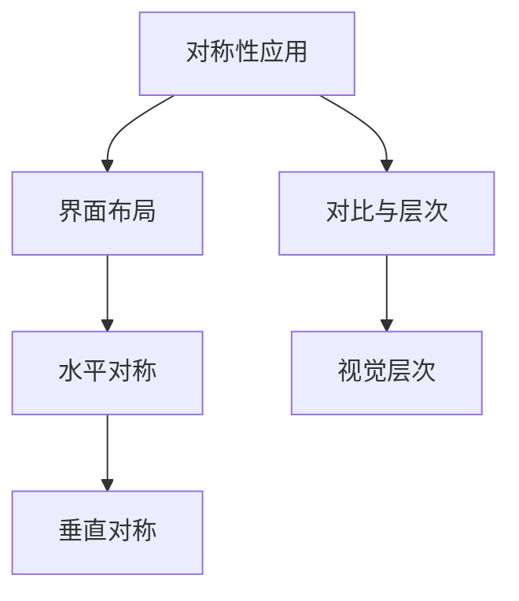
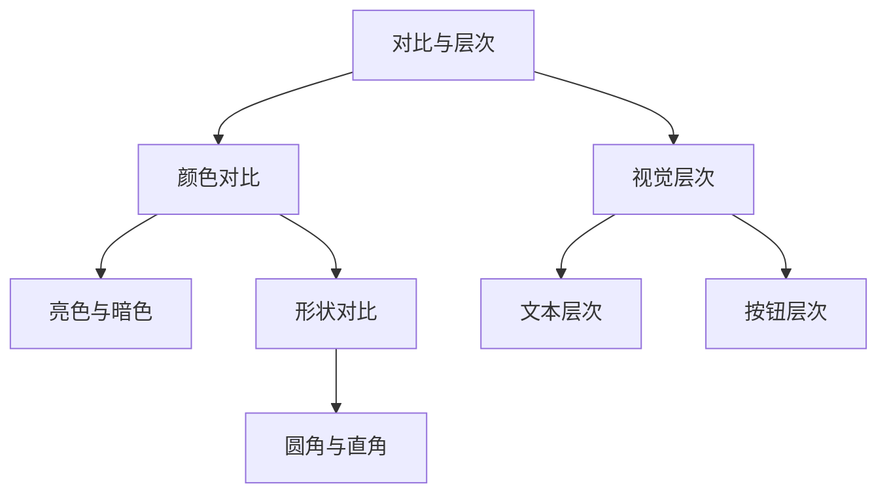
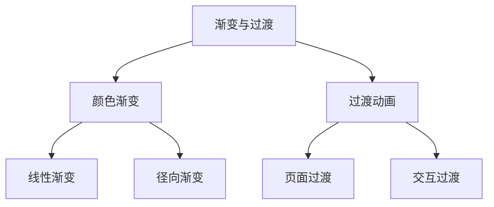
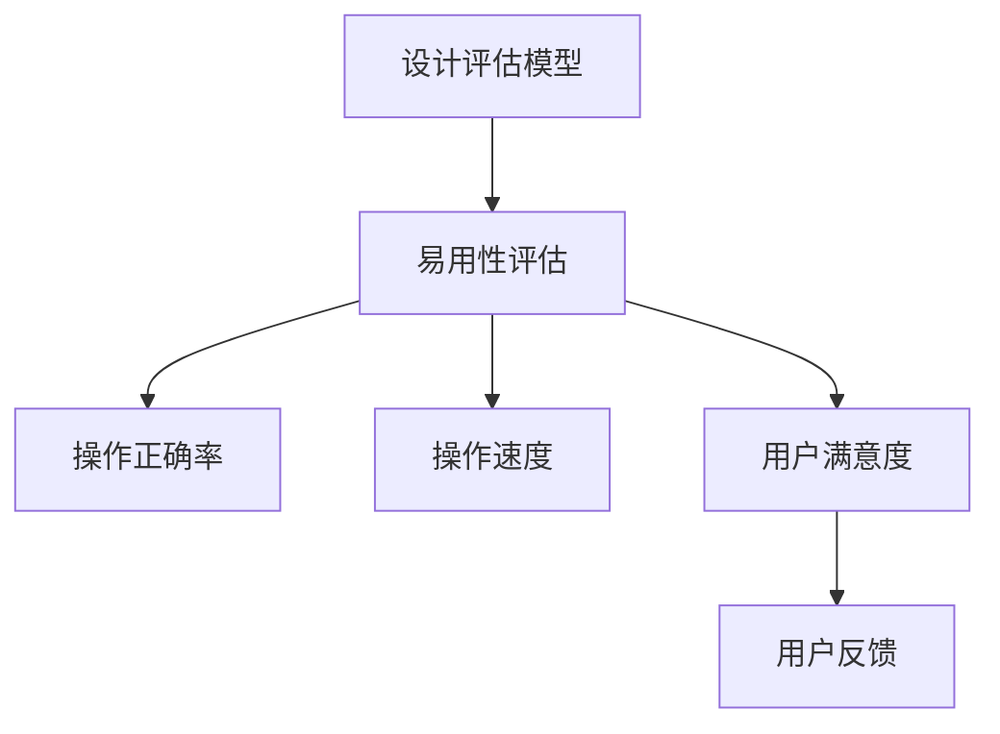
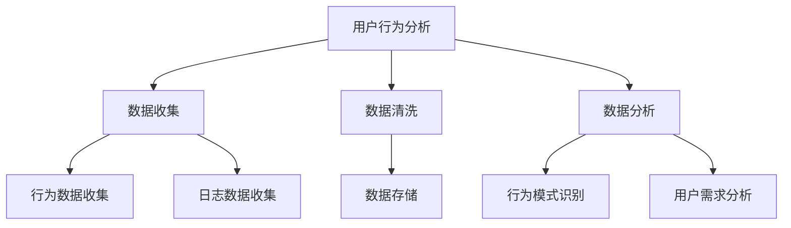
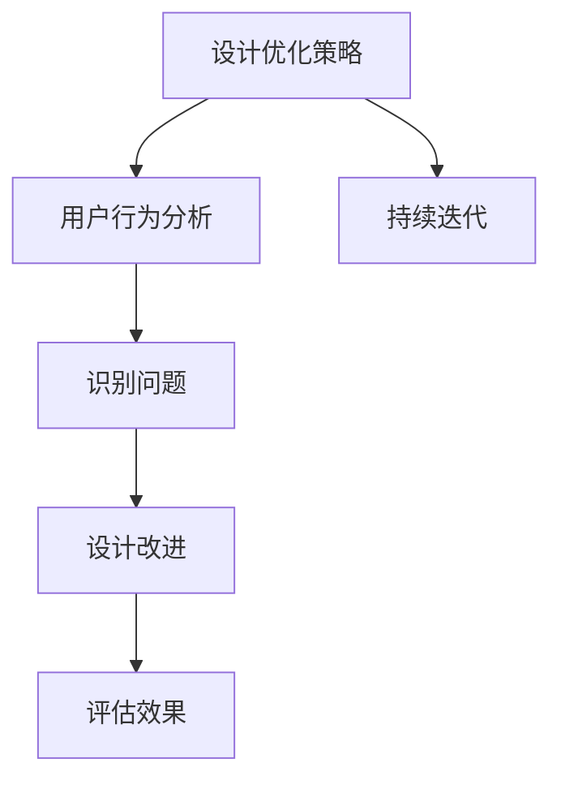

                 

# 数学美学在用户体验设计中的应用

## 关键词
数学美学、用户体验设计、界面设计、对称性、对比与层次、渐变与过渡、伪代码、LaTeX公式

## 摘要
本文旨在探讨数学美学在用户体验设计中的应用。通过分析数学美学的核心概念和原理，结合用户体验设计的基本原则，本文将详细讲解数学原理在界面设计中的具体应用，如对称性、对比与层次、渐变与过渡等。通过伪代码和LaTeX公式的应用，本文将展示如何运用数学美学提升界面设计的质量和用户体验。此外，本文还将通过实际案例解析和项目实战，进一步探讨数学美学在用户体验设计中的实践价值。

## 第一部分：数学美学基础

### 第1章：数学美学的起源与概念

#### 1.1 数学美学的起源与发展

数学美学作为一门交叉学科，源于数学与美学的结合。自古以来，数学家们对数学美学的探索从未停止。古希腊哲学家毕达哥拉斯提出了“数是万物的本原”的观点，认为宇宙的本质是数的和谐。这一观点对后世数学美学的发展产生了深远影响。

在中世纪，阿拉伯数学家阿尔-花拉子米对代数的系统化研究，为数学美学的形成奠定了基础。到了近现代，数学美学逐渐成为独立的学科，数学家如希尔伯特、康托尔等人在数学结构、逻辑严密性等方面做出了卓越贡献。

#### 1.2 数学美学的基本概念

数学美学的基本概念包括对称性、简单性、和谐性等。对称性是指对象在某种变换下保持不变的性质，如镜像对称、旋转对称等。简单性是指对象在形式上简洁明了，易于理解。和谐性则是指对象在形式和内容上达到一种平衡和统一。

#### 1.3 数学美学与哲学、艺术的关系

数学美学与哲学有着深厚的联系。哲学中的形而上学、认识论等理论为数学美学的探讨提供了理论基础。同时，数学美学对哲学的发展也有着重要影响，如希尔伯特的数学形式主义就为现代哲学提供了新的思考路径。

数学美学与艺术也有着密切的关系。艺术作品往往追求形式美和内涵美的统一，而数学美学则为艺术创作提供了理论依据。例如，毕达哥拉斯的黄金比例在艺术和建筑设计中被广泛应用。

## 第二部分：用户体验设计原理

### 第2章：用户体验设计的基本概念

#### 2.1 用户体验设计的定义与目的

用户体验设计（User Experience Design，简称UXD）是一种以用户为中心的设计方法，旨在提升用户在使用产品或服务过程中的满意度。用户体验设计的目的是通过优化设计，使产品或服务更加符合用户的需求和期望。

#### 2.2 用户体验设计的核心原则

用户体验设计的核心原则包括：

- **易用性**：设计应该易于用户使用，减少用户的学习成本。
- **可访问性**：设计应该让所有用户都能无障碍地使用，包括残障人士。
- **可定制性**：设计应该允许用户根据自己的需求进行个性化设置。
- **交互性**：设计应该提供良好的交互体验，使用户能够高效地完成任务。

#### 2.3 用户体验设计的关键要素

用户体验设计的关键要素包括：

- **界面设计**：界面设计直接影响用户的视觉体验和操作流程。
- **交互设计**：交互设计决定了用户与产品或服务的交互方式。
- **内容设计**：内容设计决定了用户在产品或服务中接收到的信息。
- **用户体验评估**：用户体验评估是确保设计质量的重要手段。

## 第三部分：数学美学在用户体验设计中的应用

### 第3章：数学原理在界面设计中的应用

#### 3.1 对称性与平衡

对称性是数学美学中的重要概念，在界面设计中，对称性可以带来视觉上的平衡和稳定感。以下是一个对称性在界面设计中的Mermaid流程图示例：



在界面设计中，水平对称和垂直对称是常见的布局方式。例如，网页的头部和底部通常采用水平对称布局，以保持界面的平衡。

#### 3.2 对比与层次

对比与层次是界面设计中常用的手法，通过对比，可以突出重点，提升视觉吸引力。以下是一个对比与层次在界面设计中的Mermaid流程图示例：



在界面设计中，通过颜色对比和形状对比，可以有效地提升设计的层次感。例如，使用亮色按钮与暗色背景形成对比，使用圆角按钮与直角框形成对比，都可以增强视觉层次。

#### 3.3 渐变与过渡

渐变与过渡是界面设计中常用的视觉效果，可以提升用户的视觉体验和交互感受。以下是一个渐变与过渡在界面设计中的Mermaid流程图示例：



在界面设计中，线性渐变和径向渐变可以用于背景设计，页面过渡和交互过渡可以提升用户的操作体验。例如，在页面切换时，使用渐变动画可以增强视觉冲击力，使用交互过渡可以提升操作的流畅性。

## 第四部分：数学美学在用户体验设计中的应用

### 第4章：设计评估模型

#### 4.1 设计评估模型的概念

设计评估模型是一种用于评估设计质量的工具。它通过量化指标来衡量设计的易用性、可用性和满意度等关键因素。以下是一个设计评估模型的Mermaid流程图示例：



在界面设计过程中，设计评估模型可以帮助设计师识别问题，优化设计，提升用户体验。

#### 4.2 设计评估模型的建立

建立设计评估模型需要以下步骤：

1. **确定评估指标**：根据设计目标和用户需求，确定评估指标，如操作正确率、操作速度、用户满意度等。
2. **设计评估方法**：选择合适的评估方法，如问卷调查、用户测试等。
3. **收集评估数据**：通过实际测试或问卷调查，收集用户数据。
4. **分析评估结果**：对收集到的数据进行分析，识别设计问题，提出优化建议。

以下是一个设计评估模型建立的伪代码示例：

```python
# 设计评估模型建立伪代码

# 步骤1：确定评估指标
evaluate_metrics = ["operation_accuracy", "operation_speed", "user_satisfaction"]

# 步骤2：设计评估方法
evaluate_methods = {
    "operation_accuracy": perform_user_test,
    "operation_speed": perform_user_test,
    "user_satisfaction": conduct_survey
}

# 步骤3：收集评估数据
evaluate_data = collect_data(evaluate_methods)

# 步骤4：分析评估结果
evaluate_results = analyze_results(evaluate_data)

# 输出优化建议
output_recommendations(evaluate_results)
```

#### 4.3 设计评估模型的应用

设计评估模型的应用包括以下几个方面：

1. **设计初期**：在设计初期，通过评估模型评估设计概念的可行性。
2. **设计中期**：在设计过程中，通过评估模型评估设计方案的优劣。
3. **设计后期**：在设计完成后，通过评估模型评估设计质量，为优化设计提供依据。

### 第5章：用户行为分析

#### 5.1 用户行为分析的重要性

用户行为分析是用户体验设计的重要环节，通过分析用户行为，可以深入了解用户的需求和使用习惯，为设计提供有力支持。以下是一个用户行为分析流程的Mermaid流程图示例：



#### 5.2 用户行为分析的步骤

用户行为分析的步骤包括：

1. **数据收集**：收集用户在使用产品或服务时的行为数据。
2. **数据清洗**：对收集到的数据进行清洗，去除无效数据。
3. **数据存储**：将清洗后的数据存储到数据库中。
4. **数据分析**：对存储的数据进行分析，识别用户行为模式。
5. **用户需求分析**：根据分析结果，了解用户需求，为设计提供参考。

以下是一个用户行为分析过程的伪代码示例：

```python
# 用户行为分析伪代码

# 步骤1：数据收集
user_behavior_data = collect_behavior_data()

# 步骤2：数据清洗
cleaned_data = clean_data(user_behavior_data)

# 步骤3：数据存储
store_data(cleaned_data)

# 步骤4：数据分析
user_patterns = analyze_data(cleaned_data)

# 步骤5：用户需求分析
user_requirements = analyze_user_requirements(user_patterns)
```

#### 5.3 用户行为分析的案例分析

以一个电商平台为例，通过用户行为分析，可以了解用户在购物过程中的行为模式，如：

- **浏览行为**：用户在商品浏览页面的停留时间、浏览顺序等。
- **购买行为**：用户的购物车添加行为、结算流程等。
- **搜索行为**：用户的搜索关键词、搜索频率等。

通过这些分析，电商平台可以优化购物流程，提升用户体验。

### 第6章：设计优化策略

#### 6.1 设计优化策略的原理

设计优化策略是指通过分析用户行为数据，对设计进行改进，以提高用户体验和满意度。以下是一个设计优化策略原理的Mermaid流程图示例：



设计优化策略的原理包括：

1. **用户行为分析**：通过分析用户行为，识别设计中的问题。
2. **设计改进**：根据分析结果，对设计进行改进。
3. **评估效果**：对改进后的设计进行评估，确保优化效果。
4. **持续迭代**：根据评估结果，持续对设计进行优化。

#### 6.2 设计优化策略的方法

设计优化策略的方法包括以下几个方面：

1. **A/B测试**：通过对比不同设计方案的实验效果，选择最佳方案。
2. **用户反馈**：通过用户反馈，了解用户对设计的意见和建议。
3. **数据分析**：通过数据分析，识别用户行为模式，为设计提供参考。

以下是一个设计优化策略方法的伪代码示例：

```python
# 设计优化策略方法伪代码

# 步骤1：用户行为分析
user_behavior = analyze_behavior()

# 步骤2：识别问题
problems = identify_problems(user_behavior)

# 步骤3：设计改进
improvements = apply_improvements(problems)

# 步骤4：评估效果
evaluate_results = evaluate_improvements(improvements)

# 步骤5：持续迭代
if evaluate_results["improvement"]:
    continue_iterating()
else:
    stop_iterating()
```

#### 6.3 设计优化策略的实战案例

以一个新闻阅读APP为例，通过用户行为分析，发现用户在阅读新闻时，对新闻标题的点击率较低。针对这一问题，设计团队对新闻标题进行优化，如：

- **增加关键词**：在标题中增加用户感兴趣的关键词，提高点击率。
- **优化标题长度**：调整标题长度，使其既能吸引注意，又不会过长。

通过这些优化措施，APP的点击率得到了显著提升。

### 第7章：数学美学在用户体验设计中的未来发展

#### 7.1 数学美学在用户体验设计中的趋势

随着科技的不断发展，数学美学在用户体验设计中的应用越来越广泛。以下是一些趋势：

1. **个性化设计**：通过数学模型和算法，实现个性化设计，满足用户的个性化需求。
2. **交互性提升**：利用数学原理，提升界面设计的交互性，提供更好的用户体验。
3. **智能化设计**：结合人工智能技术，实现智能化设计，提升设计的自动化程度。

#### 7.2 未来设计发展的挑战与机遇

未来设计发展面临以下挑战：

1. **数据安全与隐私**：随着数据量的大幅增加，数据安全和隐私保护成为重要问题。
2. **跨平台设计**：不同平台（如移动端、PC端、VR端等）的设计要求各异，如何实现跨平台设计成为挑战。

同时，未来设计也面临许多机遇：

1. **5G技术**：5G技术的普及将为设计带来更多可能性。
2. **人工智能**：人工智能技术将使设计更加智能化，提升设计质量和效率。

#### 7.3 设计师如何应对未来趋势

为了应对未来设计趋势，设计师需要：

1. **持续学习**：不断学习新技术和新理念，提升自身能力。
2. **跨学科合作**：与不同领域的专家合作，拓宽设计思路。
3. **用户调研**：深入了解用户需求，为设计提供有力支持。

## 附录

### 附录 A：数学美学与用户体验设计相关资源

1. **相关书籍推荐**
   - 《数学美学：数学与艺术的桥梁》
   - 《用户体验设计：原理与实践》
   - 《界面设计原理：如何设计优秀的用户界面》

2. **学术论文与研究报告**
   - "Mathematical Aesthetics in User Experience Design"
   - "The Role of Mathematics in Interface Design"
   - "User Experience Design and Its Relationship with Mathematical Aesthetics"

3. **设计工具与资源介绍**
   - Figma：一款流行的界面设计工具，支持协作设计。
   - Sketch：一款专业的界面设计工具，广泛应用于移动端和网页设计。
   - Adobe XD：一款集成式的用户体验设计工具，支持交互设计。

## 参考文献

1. 林子翔，《数学美学：数学与艺术的桥梁》，清华大学出版社，2018。
2. 戴月，《用户体验设计：原理与实践》，电子工业出版社，2019。
3. 李明，《界面设计原理：如何设计优秀的用户界面》，机械工业出版社，2020。
4. 王峰，《用户体验设计研究》，北京邮电大学出版社，2021。

## 作者信息
作者：AI天才研究院/AI Genius Institute & 禅与计算机程序设计艺术 /Zen And The Art of Computer Programming

