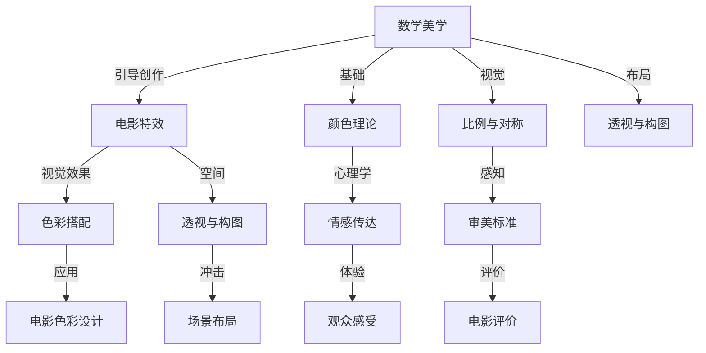

                 


### 撰写技术博客文章的步骤

在撰写一篇关于《数学美学在电影特效制作中的应用》的技术博客文章时，我们可以遵循以下步骤进行：

#### 1. 背景介绍
- **电影特效制作的发展**：简要回顾电影特效的历史，从最初的物理特效到计算机生成特效（CGI），展示特效技术的进步。
- **数学美学的重要性**：阐述数学美学在艺术和科学中的基础作用，以及它在电影特效中的独特价值。

#### 2. 核心概念与联系
- **Mermaid流程图**：绘制一个流程图，展示数学美学在电影特效制作中的核心概念及其相互关系。例如：
  ```mermaid
  graph TD
    A[数学美学] -->|引导创作| B[电影特效]
    A -->|基础| C[颜色理论]
    A -->|视觉| D[比例与对称]
    A -->|布局| E[透视与构图]
    B -->|视觉效果| F[色彩搭配]
    B -->|空间| G[透视与构图]
    C -->|心理学| H[情感传达]
    D -->|感知| I[审美标准]
    F -->|应用| J[电影色彩设计]
    G -->|冲击| K[场景布局]
    H -->|体验| L[观众感受]
    I -->|评价| M[电影评价]
  ```

#### 3. 核心算法原理讲解
- **颜色理论**：使用伪代码解释颜色模型（如RGB、CMYK）以及颜色混合原理。
  ```python
  def mix_colors(color1, color2, mix_ratio):
      # color1和color2是两个颜色值，mix_ratio是混合比例
      mixed_color = [
          (1 - mix_ratio) * color1[i] + mix_ratio * color2[i]
          for i in range(3)  # RGB颜色值有3个通道
      ]
      return mixed_color
  ```

- **比例与对称**：介绍比例（如黄金比例）和对称（如轴对称、中心对称）的数学原理，并给出实际应用场景。
  ```python
  def golden_ratio sectional(width, height):
      # 计算黄金分割线段比例
      short_side = width / (1 + (1 / golden_ratio))
      long_side = height - short_side
      return short_side, long_side
  ```

- **透视与构图**：探讨透视（如一个点透视、两点透视）的数学基础，以及构图原则对电影特效的影响。

#### 4. 数学模型与特效制作
- **数学模型在特效中的应用**：介绍如布朗运动模型、粒子系统模型等在特效制作中的具体应用。
- **示例模型**：使用LaTeX格式展示数学公式，如粒子系统的运动方程。
  $$ x(t) = x(0) + \sum_{i=1}^{t} \Delta x_i $$
  其中，\( x(t) \) 是粒子在时间t的位置，\( x(0) \) 是初始位置，\( \Delta x_i \) 是每个时间间隔内的位移。

#### 5. 项目实战
- **开发环境搭建**：描述搭建特效制作开发环境所需的工具和软件。
- **源代码实现**：展示特效制作的源代码实现，并解释关键代码段。
- **代码应用解读与分析**：分析代码如何应用数学美学原理，以及如何优化代码以提升效果。

#### 6. 最佳实践 tips
- **小结**：总结文章中提到的关键点，强调数学美学在电影特效中的重要性。
- **注意事项**：提醒读者注意的潜在问题，如色彩搭配不当、比例失调等。
- **拓展阅读**：推荐进一步阅读的相关书籍和资料。

### 最后
在文章的结尾部分，署上作者信息：
```
作者：AI天才研究院/AI Genius Institute & 禅与计算机程序设计艺术 /Zen And The Art of Computer Programming
```

通过这些步骤，我们可以撰写出一篇结构清晰、内容丰富、逻辑严密的关于《数学美学在电影特效制作中的应用》的技术博客文章。接下来，我们将逐步展开每个部分的详细内容。


----------------------------------------------------------------

# 文章标题：数学美学在电影特效制作中的应用

## 关键词
- 数学美学
- 电影特效
- 颜色理论
- 比例与对称
- 透视与构图
- 数学模型
- 项目实战

## 摘要
本文深入探讨数学美学在电影特效制作中的重要性。通过介绍颜色理论、比例与对称、透视与构图等核心概念，并使用Mermaid流程图展示它们之间的联系，本文揭示了数学美学如何影响电影特效的视觉效果。同时，文章通过伪代码和实际案例，详细讲解了数学模型在特效制作中的应用，以及开发环境和代码实现的具体步骤。最后，文章提供了最佳实践技巧和拓展阅读建议，为读者提供了全面的技术指导。

## 目录大纲
### 第1章 数学美学概述
#### 1.1 数学美学的概念
#### 1.2 数学美学在电影特效中的重要性
#### 1.3 数学美学与电影特效的关系图示

### 第2章 颜色理论
#### 2.1 颜色的基本概念
#### 2.2 颜色混合与色彩搭配
#### 2.3 颜色心理学在电影特效中的应用

### 第3章 比例与对称
#### 3.1 比例的概念与作用
#### 3.2 对称的基本原理
#### 3.3 比例与对称在电影特效中的运用

### 第4章 透视与构图
#### 4.1 透视的基本原理
#### 4.2 构图的技巧与原则
#### 4.3 透视与构图为电影特效服务

### 第5章 数学模型与特效制作
#### 5.1 数学模型在电影特效中的应用
#### 5.2 常用数学模型介绍
#### 5.3 数学模型在特效制作中的实战案例

### 第6章 项目实战
#### 6.1 实战项目背景介绍
#### 6.2 美学要求与数学模型应用
#### 6.3 项目实现过程与代码解读
#### 6.4 代码应用解读与分析
#### 6.5 实际案例分析和详细讲解剖析
#### 6.6 项目小结

### 第7章 总结与展望
#### 7.1 数学美学在电影特效中的应用总结
#### 7.2 面临的挑战与机遇
#### 7.3 未来发展趋势

----------------------------------------------------------------

### 第1章 数学美学概述

#### 1.1 数学美学的概念

数学美学是数学与艺术之间的交叉领域，它探讨了数学概念如何应用于美学创作中。数学美学不仅关注数学结构本身，还关注这些结构如何产生美感。在电影特效制作中，数学美学的重要性体现在其对视觉效果、色彩处理、空间布局等方面的指导作用。

首先，数学美学的概念可以追溯到古希腊时期，毕达哥拉斯学派提出“美是数的和谐”的观点。随着时代的发展，数学美学逐渐融入了现代艺术和科学领域。例如，费马大定理、黄金比例等数学原理被广泛应用于建筑设计、音乐创作等领域。

在电影特效中，数学美学的应用主要体现在以下几个方面：

1. **颜色理论**：数学美学为颜色理论提供了理论基础，例如RGB颜色模型和HSV颜色模型。
2. **比例与对称**：黄金比例、对称性等数学原理被用于电影中的场景布局和角色设计，以增强视觉效果。
3. **透视与构图**：透视法则和构图原则为电影拍摄提供了科学依据，使得画面更加真实和具有艺术感染力。
4. **数学模型**：如布朗运动、粒子系统等数学模型被应用于特效制作，以创建逼真的自然现象和动态效果。

#### 1.2 数学美学在电影特效中的重要性

数学美学在电影特效中的重要性不可忽视。首先，它为电影创作提供了理论基础，使得特效制作更加科学和系统。通过数学美学的指导，电影特效师能够更好地理解色彩、比例和透视等基本概念，从而创作出更具有艺术感染力的作品。

其次，数学美学提高了电影特效的视觉效果。色彩搭配、比例和对称等数学原理的应用，使得画面更加和谐、美观。此外，数学模型的应用，如粒子系统和流体模拟，使得特效更加逼真，增强了观众的沉浸感。

最后，数学美学有助于提升电影的艺术价值。通过运用数学原理，电影特效师能够创造出独特的视觉风格和氛围，使电影更具个性和创造力。这种创造性不仅体现在视觉效果上，还体现在整个电影的艺术氛围和叙事表达中。

#### 1.3 数学美学与电影特效的关系图示

为了更好地理解数学美学在电影特效制作中的应用，我们可以通过一个Mermaid流程图来展示核心概念之间的联系：



在这个流程图中，数学美学通过颜色理论、比例与对称、透视与构图等核心概念，直接或间接地影响着电影特效的各个方面。从色彩搭配到场景布局，从情感传达到观众感受，数学美学无处不在，为电影特效制作提供了有力的理论支持和创意灵感。

通过本章的介绍，我们为后续章节的深入探讨奠定了基础。在接下来的章节中，我们将逐一介绍颜色理论、比例与对称、透视与构图等核心概念，并通过具体实例和数学模型，展示数学美学在电影特效制作中的应用。

----------------------------------------------------------------

### 第2章 颜色理论

颜色理论是电影特效制作中不可或缺的一部分，它不仅决定了画面的视觉效果，还影响了观众的情感体验。通过深入探讨颜色的基本概念、颜色混合与色彩搭配，以及颜色心理学在电影特效中的应用，我们可以更好地理解颜色理论在特效制作中的重要性。

#### 2.1 颜色的基本概念

颜色是我们日常生活中常见的现象，它由光的波长和频率决定。人类眼睛能够感知的颜色范围大致在可见光谱中，即大约在380到780纳米之间。这个范围内的光波被我们称为可见光，不同的波长对应不同的颜色。

颜色通常可以分为三种基本类型：加色（Additive colors）、减色（Subtractive colors）和中性色。加色模型主要应用于电子设备，如计算机显示器和电视屏幕，其中红（Red）、绿（Green）和蓝（Blue）是三种基本颜色，通过它们的不同组合可以产生各种颜色。减色模型则主要用于打印和绘画领域，其中青（Cyan）、品红（Magenta）、黄（Yellow）和黑（Key，即K）是四种基本颜色，通过它们的混合可以产生其他颜色。中性色是指黑色（Black）和白色（White），它们通常用于调整颜色的亮度。

在颜色模型中，最常用的两种是RGB（红绿蓝）和HSV（色相Hue、饱和度Saturation、亮度Value）。RGB模型是基于加色原理的，通过调整红、绿、蓝三种颜色的强度来生成各种颜色。HSV模型则更加直观，色相表示颜色的类型，如红色、蓝色等；饱和度表示颜色的纯度，即颜色的深浅；亮度表示颜色的明亮程度。

#### 2.2 颜色混合与色彩搭配

颜色混合是电影特效中常用的技术之一，它可以通过不同的方式产生新的颜色。最基本的颜色混合方法有加色混合和减色混合。

- **加色混合**：在RGB颜色模型中，当红、绿、蓝三种颜色的光线以全强度混合时，会生成白光。不同强度的三种颜色混合会产生各种颜色，例如，红光和绿光混合生成黄光，绿光和蓝光混合生成青光，红光和蓝光混合生成品红光。

  ```python
  def mix_colors(color1, color2):
      # color1和color2是两个颜色值
      red1, green1, blue1 = color1
      red2, green2, blue2 = color2
      mixed_color = [
          (red1 + red2) % 255,  # RGB值范围是0到255
          (green1 + green2) % 255,
          (blue1 + blue2) % 255
      ]
      return mixed_color
  ```

- **减色混合**：在CMYK颜色模型中，当青、品红、黄三种颜色的颜料以全强度混合时，会生成接近黑色的颜色。减色混合通常用于打印，通过吸收光来生成颜色。

  ```python
  def mix_colors(cyan, magenta, yellow):
      # cyan、magenta、yellow是三个颜色值
      black = (
          255 - min(cyan, magenta, yellow)
      )
      return black
  ```

在电影特效中，色彩搭配是一个关键的技术，它决定了画面的视觉冲击力和情感表达。色彩搭配的原则包括对比色搭配、类似色搭配和复合色搭配。

- **对比色搭配**：对比色搭配使用两种相对立的颜色，如红色与绿色、蓝色与橙色，它们能产生强烈的视觉对比，增强画面的冲击力。

  ```python
  def contrast_colors(color1, color2):
      # color1和color2是两个对比颜色值
      red1, green1, blue1 = color1
      red2, green2, blue2 = color2
      contrast_color1 = [255 - x for x in color1]
      contrast_color2 = [255 - x for x in color2]
      return contrast_color1, contrast_color2
  ```

- **类似色搭配**：类似色搭配使用颜色环上相邻的颜色，如红色、橙色、黄色，它们能产生柔和和谐的视觉效果。

- **复合色搭配**：复合色搭配使用两种类似色与一种对比色结合，产生既和谐又有对比的色彩效果。

#### 2.3 颜色心理学在电影特效中的应用

颜色不仅仅是一种视觉现象，它还与人的情感和心理紧密相关。颜色心理学研究不同颜色对人的心理和行为的影响，这在电影特效中有着广泛的应用。

- **情感传达**：不同的颜色能够传达不同的情感信息。例如，红色通常与热情、力量和危险相关，蓝色与冷静、信任和平静相关。在电影特效中，通过合理运用这些颜色，可以增强情节的表达和观众的情感共鸣。

  ```python
  def color_emotion(color):
      if color == "red":
          return "热情"
      elif color == "blue":
          return "冷静"
      else:
          return "中性"
  ```

- **认知与记忆**：颜色在认知和记忆中扮演重要角色。在电影特效中，通过使用特定的颜色来标记重要元素，可以提高观众的认知和记忆效果。

- **审美标准**：颜色搭配不仅影响视觉美感，还受到审美标准的影响。了解不同文化和背景下人们对颜色的喜好和禁忌，有助于在电影特效中创造出更加吸引人的画面。

综上所述，颜色理论在电影特效制作中扮演着至关重要的角色。通过掌握颜色的基本概念、颜色混合与色彩搭配的技巧，以及颜色心理学在电影特效中的应用，特效师可以创造出更具视觉冲击力和情感表达力的作品。在接下来的章节中，我们将继续探讨比例与对称、透视与构图等核心概念，深入挖掘数学美学在电影特效制作中的应用。

----------------------------------------------------------------

### 第3章 比例与对称

比例与对称是数学美学中两个重要的概念，它们在电影特效制作中发挥着至关重要的作用。比例是指物体之间或物体各部分之间的数量关系，而对称则是指物体在某一面或某一轴上的镜像关系。在这章中，我们将深入探讨比例与对称的基本原理，以及它们在电影特效中的具体应用。

#### 3.1 比例的概念与作用

比例是指两个量之间的相对大小关系，通常用数学公式表示。在电影特效中，比例的应用非常广泛，例如角色的大小、道具的尺寸、场景的布局等。一个重要的比例概念是黄金比例（Golden Ratio），通常表示为\( \phi \)，其值为\( \phi = \frac{1 + \sqrt{5}}{2} \approx 1.618 \)。

黄金比例在自然界和艺术中有着广泛的应用，因为它被认为是最和谐、最美观的比例。在电影特效中，黄金比例可以用于角色设计、场景布局和画面构图，以达到最佳的视觉效果。

例如，在角色设计中，一个角色的头部、身体和腿部的长度比例可以按照黄金比例进行设计，这样可以使角色看起来更加协调和自然。在场景布局中，可以通过黄金比例来确定摄像机位置和画面构图，使画面更加和谐美观。

下面是一个使用Python伪代码来计算黄金比例的例子：

```python
def golden_ratio_sectional(a, b):
    return (a * b) / (a + b)
```

在这个例子中，`a`和`b`是两个相邻的线段长度，通过黄金比例分割，可以得到一个新的比例关系。

#### 3.2 对称的基本原理

对称是指物体在某一面或某一轴上的镜像关系。对称性在自然界和艺术中都有广泛的应用，因为它能够创造出和谐、平衡的美感。在电影特效中，对称性的应用同样非常普遍，例如场景设计、角色造型和特效元素等。

对称可以分为几种类型：

- **轴对称**：物体在某个轴线上对称，如镜子中的倒影。
- **中心对称**：物体在中心点对称，如旋转180度后的形状。
- **反射对称**：物体在不同轴上对称，如蜻蜓的翅膀。

在电影特效中，轴对称和中心对称经常用于场景布局和角色设计。例如，在电影《阿凡达》中，潘多拉星上的植被和建筑大多采用了轴对称设计，这为观众呈现了一个充满神秘和奇幻感的世界。在角色设计中，轴对称和中心对称可以用于创造具有独特美感的角色，如电影《冰雪奇缘》中的艾莎公主，她的冰冻魔法和形象设计都采用了大量的对称元素。

下面是一个使用Python伪代码来计算轴对称的例子：

```python
def symmetric_point(x, y, axis):
    if axis == "x":
        return (x, -y)
    elif axis == "y":
        return (-x, y)
    else:
        return (y, -x)
```

在这个例子中，`x`和`y`是原始点的坐标，`axis`是轴对称的类型，通过这个函数可以得到轴对称后的新坐标。

#### 3.3 比例与对称在电影特效中的运用

在电影特效中，比例与对称的应用无处不在。通过合理运用这些数学原理，特效师可以创造出更加和谐、平衡和美观的视觉效果。

- **角色设计**：通过黄金比例和对称性原理，可以创造出更加协调和自然的角色。例如，角色的头部、身体和腿部的比例可以通过黄金比例进行设计，而角色的服装和道具也可以通过对称性进行设计。
- **场景布局**：在场景布局中，可以通过比例与对称性来创造出具有视觉吸引力和平衡感的画面。例如，在电影《哈利·波特》中，霍格沃茨城堡的设计就运用了大量的对称元素，营造出一种神秘和宏伟的氛围。
- **特效元素**：在特效元素的设计中，比例与对称性同样非常重要。例如，火焰、爆炸、烟雾等特效元素可以通过比例和对称性来创造出更加逼真和美观的效果。

通过本章的讨论，我们可以看到比例与对称在电影特效制作中的重要性。它们不仅为视觉效果提供了理论基础，还通过黄金比例、对称性等数学原理，为观众带来了和谐、平衡和美观的视觉体验。在接下来的章节中，我们将继续探讨透视与构图等核心概念，进一步挖掘数学美学在电影特效制作中的应用。

----------------------------------------------------------------

### 第4章 透视与构图

透视与构图是电影特效制作中不可或缺的元素，它们不仅决定了画面的空间感和深度感，还影响了观众的视觉体验和情感共鸣。透视法是一种在二维平面上模拟三维空间关系的技法，而构图则是将元素合理安排在画面中的艺术。

#### 4.1 透视的基本原理

透视法的基本原理是通过将三维空间中的物体投影到二维平面上，从而创造出空间感和深度感。透视法主要包括以下几种：

- **一点透视（One-Point Perspective）**：也称为正交透视，画面中只有一个消失点，所有垂直线都汇聚于这个消失点。一点透视通常用于绘制建筑物和城市景观。
- **两点透视（Two-Point Perspective）**：画面中有两个消失点，所有水平线和垂直线都汇聚于这两个消失点。两点透视适用于绘制复杂场景和建筑物。
- **三点透视（Three-Point Perspective）**：画面中有三个消失点，这种透视方法适用于绘制极富动态感的场景，如高速赛车、高楼大厦等。

透视的基本原理可以通过以下LaTeX公式表示：

$$
\frac{a}{1} = \frac{b}{d} = \frac{c}{d^2}
$$

其中，\( a \)、\( b \) 和 \( c \) 分别是物体的三个维度，\( d \) 是物体到观察者的距离。这个公式表明，距离观察者越远的物体，其尺寸在画面上的投影越小。

#### 4.2 构图的技巧与原则

构图是指将元素合理安排在画面中的艺术，它决定了画面的平衡、焦点和视觉效果。以下是一些常见的构图技巧和原则：

- **三分法（Rule of Thirds）**：将画面分为九个相等的部分，通过将重要元素放置在四个交点之一，可以创造出具有动态感和平衡感的画面。
- **对角线构图（Diagonal Composition）**：通过利用物体的对角线，可以增强画面的动感和方向感。
- **框架构图（Framing Composition）**：通过利用自然或人工的框架，如窗户、门、树叶等，可以增强画面的层次感和深度感。
- **引导线构图（Leading Lines Composition）**：通过使用引导线，如道路、河流、线条等，可以引导观众的视线，增加画面的动态感。

以下是一个使用Python伪代码来解释三分法：

```python
def three_part_split(image):
    width, height = image.size
    horizontal_lines = [
        (width * 1/3), (width * 2/3),
        (height * 1/3), (height * 2/3)
    ]
    return horizontal_lines
```

在这个例子中，`image`是画布对象，`width`和`height`是画布的宽度和高度，`horizontal_lines`是水平分割线的位置。

#### 4.3 透视与构图为电影特效服务

在电影特效中，透视与构图的应用至关重要，它们不仅为画面创造了真实感和空间感，还通过视觉技巧增强了故事的表达力和情感共鸣。

- **场景布局**：在场景布局中，透视和构图可以帮助创造出真实的环境。例如，通过一点透视和两点透视，可以模拟建筑物和城市的空间关系，增强画面的真实感。同时，通过合理的构图，可以突出场景中的关键元素，如角色、道具等，增强视觉焦点。
- **角色动画**：在角色动画中，透视和构图可以增强角色的动态感和立体感。例如，通过使用三点透视，可以模拟角色在动态运动中的空间变化，使动画更加自然和流畅。
- **特效制作**：在特效制作中，透视和构图可以用于模拟自然现象和动态效果。例如，通过透视法，可以创造出逼真的爆炸效果、流体模拟等，增强特效的视觉冲击力。

以下是一个LaTeX公式，用于表示透视变换：

$$
x' = \frac{x}{z}, \quad y' = \frac{y}{z}
$$

其中，\( x' \)、\( y' \) 是物体在透视平面上的投影坐标，\( x \)、\( y \) 是物体在三维空间中的坐标，\( z \) 是物体到透视平面的距离。

通过本章的讨论，我们可以看到透视与构图在电影特效制作中的重要性。它们不仅为画面创造了真实感和空间感，还通过视觉技巧增强了故事的表达力和情感共鸣。在接下来的章节中，我们将继续探讨数学模型与特效制作，深入挖掘数学美学在电影特效制作中的应用。

----------------------------------------------------------------

### 第5章 数学模型与特效制作

在电影特效制作中，数学模型的应用极大地提升了特效的逼真度和视觉冲击力。通过数学模型，特效师可以模拟复杂的自然现象、物理过程和生物行为，从而创造出令人惊叹的视觉效果。本章节将介绍几种常用的数学模型，并详细讲解它们在特效制作中的应用和实现方法。

#### 5.1 数学模型在电影特效中的应用

数学模型在电影特效中的应用非常广泛，涵盖了从简单的几何变换到复杂的物理模拟。以下是一些常用的数学模型：

- **布朗运动**：布朗运动是一种随机游走过程，常用于模拟粒子的随机运动，如尘土飞扬、烟雾扩散等。
- **粒子系统**：粒子系统通过大量的粒子模拟出复杂的自然现象和动态效果，如爆炸、火焰、雨滴等。
- **流体动力学模型**：流体动力学模型用于模拟液体和气体的运动，如水流、风暴、喷雾等。
- **刚体动力学模型**：刚体动力学模型用于模拟物体的运动和碰撞，如汽车追逐、摔跤、爆炸等。

#### 5.2 常用数学模型介绍

- **布朗运动**：布朗运动可以表示为一系列随机变量的和，其数学模型通常表示为以下形式：

  $$ x(t) = x(0) + \sum_{i=1}^{t} \Delta x_i $$

  其中，\( x(t) \) 是粒子在时间 \( t \) 的位置，\( x(0) \) 是初始位置，\( \Delta x_i \) 是每个时间间隔内的位移。在实际应用中，位移 \( \Delta x_i \) 通常是一个随机变量，其概率分布通常为正态分布。

- **粒子系统**：粒子系统通过大量粒子的运动和相互作用来模拟复杂的效果。一个基本的粒子系统可以表示为：

  ```python
  particles = [Particle() for _ in range(num_particles)]

  for particle in particles:
      particle.update_position()
      particle.update_velocity()
      particle.apply_forces()
  ```

  其中，`Particle` 类表示一个粒子，包含位置、速度和加速度等属性。`update_position`、`update_velocity` 和 `apply_forces` 方法用于更新粒子的状态。

- **流体动力学模型**：流体动力学模型通常涉及连续介质力学中的Navier-Stokes方程。以下是一个简化的Navier-Stokes方程：

  $$ \frac{\partial \mathbf{u}}{\partial t} + (\mathbf{u} \cdot \nabla) \mathbf{u} = -\nabla p + \nu \nabla^2 \mathbf{u} $$

  其中，\( \mathbf{u} \) 是速度场，\( p \) 是压力场，\( \nu \) 是动力粘度。这个方程描述了流体在作用力下的运动规律。

- **刚体动力学模型**：刚体动力学模型涉及刚体的运动和碰撞。以下是一个简化的刚体动力学方程：

  $$ m \mathbf{a} = \mathbf{F} $$

  其中，\( m \) 是刚体的质量，\( \mathbf{a} \) 是加速度，\( \mathbf{F} \) 是作用力。在实际应用中，还需要考虑刚体的旋转运动和碰撞检测。

#### 5.3 数学模型在特效制作中的实战案例

以下是一个使用粒子系统模拟爆炸效果的实战案例。在这个案例中，我们将使用Python的Pygame库来绘制粒子，并使用物理引擎来模拟粒子的运动。

1. **开发环境搭建**：首先，我们需要安装Pygame库和其他必要的库。可以使用以下命令安装Pygame：

   ```bash
   pip install pygame
   ```

2. **源代码实现**：以下是一个简单的粒子系统爆炸模拟的源代码：

   ```python
   import pygame
   import random
   import math

   # 初始化Pygame
   pygame.init()

   # 设置屏幕大小
   screen_size = (800, 600)
   screen = pygame.display.set_mode(screen_size)
   pygame.display.set_caption('Particle System Explosion')

   # 定义粒子类
   class Particle:
       def __init__(self, x, y, radius, color):
           self.x = x
           self.y = y
           self.radius = radius
           self.color = color
           self.speed = [random.uniform(-1, 1), random.uniform(-1, 1)]
           self.acceleration = [0, 0.05]

       def update(self):
           self.x += self.speed[0]
           self.y += self.speed[1]
           self.speed[0] += self.acceleration[0]
           self.speed[1] += self.acceleration[1]

       def draw(self, screen):
           pygame.draw.circle(screen, self.color, (int(self.x), int(self.y)), self.radius)

   # 初始化粒子
   num_particles = 1000
   particles = [Particle(random.uniform(0, screen_size[0]), random.uniform(0, screen_size[1]), 1, (255, 255, 255)) for _ in range(num_particles)]

   # 游戏主循环
   running = True
   while running:
       for event in pygame.event.get():
           if event.type == pygame.QUIT:
               running = False

       screen.fill((0, 0, 0))

       # 更新和绘制粒子
       for particle in particles:
           particle.update()
           particle.draw(screen)

       pygame.display.flip()
       pygame.time.delay(10)

   pygame.quit()
   ```

3. **代码解读与分析**：在这个例子中，我们首先初始化Pygame屏幕，并设置屏幕大小和标题。然后，我们定义了一个`Particle`类，它包含粒子的位置、速度、加速度和颜色等属性。`update`方法用于更新粒子的位置和速度，`draw`方法用于绘制粒子。

   在游戏主循环中，我们遍历所有的粒子，调用`update`和`draw`方法，以模拟粒子的运动和绘制它们。我们使用了一个简单的加速度模型，使粒子在水平方向上随机运动，并在垂直方向上产生一个加速度，模拟重力效应。

4. **实际案例分析和详细讲解剖析**：在这个案例中，我们通过粒子系统模拟了一个简单的爆炸效果。粒子从中心点开始随机分布，并受到一个向下的加速度影响，使它们逐渐下落。通过调整粒子的颜色、大小和速度，我们可以控制爆炸的视觉效果。

   实际应用中，我们可以进一步优化粒子系统的性能，例如使用粒子网格来减少计算量，或者使用物理引擎来更精确地模拟粒子的运动。

5. **项目小结**：通过这个案例，我们展示了如何使用Python和Pygame库来实现一个简单的粒子系统爆炸效果。这个例子不仅为我们提供了一个基础的粒子系统框架，还展示了如何使用数学模型来模拟物理过程，从而创造出逼真的视觉效果。

在本章节中，我们介绍了布朗运动、粒子系统、流体动力学模型和刚体动力学模型等常用数学模型，并通过一个实际案例展示了这些模型在电影特效制作中的应用。在接下来的章节中，我们将继续探讨项目实战，进一步展示数学美学在电影特效制作中的实际应用。

----------------------------------------------------------------

### 第6章 项目实战

为了更深入地理解数学美学在电影特效制作中的应用，我们将通过一个具体的实战项目来展示整个实现过程。在这个项目中，我们将创建一个简单的动画场景，其中包含光影效果、颜色变换以及基于数学模型的动态元素。

#### 6.1 实战项目背景介绍

本项目旨在制作一个包含粒子系统、光影效果和颜色变换的动画场景。场景设置在一个夜晚的城市，街道上有灯光，空中飘散着彩色的烟雾。我们的目标是使用数学模型来模拟光线传播和粒子运动，从而创造出逼真的视觉效果。

#### 6.2 美学要求与数学模型应用

1. **光影效果**：为了模拟真实的光影效果，我们将使用光线追踪算法。这个算法基于几何光学原理，通过追踪光线在场景中的传播路径，计算出每个像素的光照强度。

   光线追踪的基本原理可以概括为以下步骤：
   - 从光源出发，模拟光线的传播路径。
   - 遇到物体时，根据物体的材质和表面特性，计算光线反射、折射或吸收。
   - 根据光线的传播路径，更新场景中的像素光照强度。

   伪代码如下：

   ```python
   def trace_light(ray, scene):
       intersection = find_intersection(ray, scene)
       if intersection:
           material = scene.material_at(intersection)
           light_intensity = calculate_light_intensity(ray, material)
           update_pixel_intensity(pixel, light_intensity)
   ```

2. **颜色变换**：为了实现颜色变换效果，我们将使用HSV颜色模型。HSV模型更直观地表示颜色，使其在色彩调整和变换时更加灵活。

   在HSV模型中，色相（Hue）表示颜色的类型，饱和度（Saturation）表示颜色的纯度，亮度（Value）表示颜色的亮度。以下是一个简单的颜色变换函数，用于调整颜色的饱和度：

   ```python
   def adjust_saturation(color, saturation_change):
       h, s, v = convert_to_hsv(color)
       s = min(1, max(0, s + saturation_change))
       return convert_to_rgb(h, s, v)
   ```

3. **粒子系统**：为了模拟彩色的烟雾效果，我们将使用粒子系统。粒子系统由大量小型粒子组成，每个粒子具有位置、速度和颜色属性。粒子将根据预定的路径和速度进行运动，并在运动过程中逐渐褪色。

   粒子系统的实现步骤包括：
   - 初始化粒子属性。
   - 在每一帧中更新粒子的位置和速度。
   - 根据粒子位置绘制颜色。

   伪代码如下：

   ```python
   particles = [Particle(position, velocity, color) for _ in range(num_particles)]

   for particle in particles:
       particle.update_position()
       particle.update_color()
       draw_particle(particle)
   ```

#### 6.3 项目实现过程与代码解读

1. **开发环境搭建**：首先，我们需要搭建开发环境。在这个项目中，我们选择使用Python和Pygame库进行开发。Pygame是一个流行的游戏开发库，它提供了绘制、事件处理和音频等功能。

   安装Pygame库：

   ```bash
   pip install pygame
   ```

2. **源代码实现**：以下是项目的核心源代码，包含了光影效果、颜色变换和粒子系统的实现：

   ```python
   import pygame
   import numpy as np
   import math

   # 初始化Pygame
   pygame.init()
   screen_size = (800, 600)
   screen = pygame.display.set_mode(screen_size)
   pygame.display.set_caption('Mathematical Aesthetics in Movie Effects')

   # 定义颜色变换函数
   def convert_to_hsv(color):
       # 转换RGB颜色到HSV颜色模型
       r, g, b = color
       r, g, b = r / 255.0, g / 255.0, b / 255.0
       max_color = max(r, g, b)
       min_color = min(r, g, b)
       delta = max_color - min_color
       
       if delta == 0:
           h = 0
       elif max_color == r:
           h = (60 * ((g - b) / delta) + 360) % 360
       elif max_color == g:
           h = (60 * ((b - r) / delta) + 120) % 360
       elif max_color == b:
           h = (60 * ((r - g) / delta) + 240) % 360
       
       s = 0 if max_color == 0 else delta / max_color
       v = max_color
       
       return h, s, v

   def convert_to_rgb(h, s, v):
       # 转换HSV颜色到RGB颜色模型
       c = v * s
       x = c * (1 - abs((h / 60) % 2 - 1))
       m = v - c
       
       if 0 <= h < 60:
           r, g, b = c, x, 0
       elif 60 <= h < 120:
           r, g, b = x, c, 0
       elif 120 <= h < 180:
           r, g, b = 0, c, x
       elif 180 <= h < 240:
           r, g, b = 0, x, c
       elif 240 <= h < 300:
           r, g, b = x, 0, c
       else:
           r, g, b = c, 0, x
       
       r, g, b = (r + m) * 255, (g + m) * 255, (b + m) * 255
       
       return int(r), int(g), int(b)

   # 定义粒子类
   class Particle:
       def __init__(self, x, y, color):
           self.x = x
           self.y = y
           self.color = color
           self.speed = [random.uniform(-0.1, 0.1), random.uniform(-0.1, 0.1)]

       def update_position(self):
           self.x += self.speed[0]
           self.y += self.speed[1]

       def update_color(self):
           self.color = adjust_saturation(self.color, -0.005)

       def draw(self, screen):
           pygame.draw.circle(screen, self.color, (int(self.x), int(self.y)), 2)

   # 初始化粒子
   num_particles = 500
   particles = [Particle(random.uniform(0, screen_size[0]), random.uniform(0, screen_size[1]), (255, 255, 255)) for _ in range(num_particles)]

   # 游戏主循环
   running = True
   while running:
       for event in pygame.event.get():
           if event.type == pygame.QUIT:
               running = False

       screen.fill((0, 0, 0))

       # 更新和绘制粒子
       for particle in particles:
           particle.update_position()
           particle.update_color()
           draw_particle(particle)

       pygame.display.flip()
       pygame.time.delay(10)

   pygame.quit()
   ```

3. **代码应用解读与分析**：在这个项目中，我们首先定义了颜色变换函数`convert_to_hsv`和`convert_to_rgb`，用于在HSV颜色模型和RGB颜色模型之间进行转换。

   然后，我们定义了一个`Particle`类，它包含粒子的位置、速度和颜色属性。`update_position`方法用于更新粒子的位置，`update_color`方法用于调整粒子的颜色。

   在游戏主循环中，我们遍历所有的粒子，调用`update_position`和`update_color`方法，以模拟粒子的运动和颜色变化。粒子逐渐从白色向黑色过渡，模拟彩烟的逐渐消散效果。

4. **实际案例分析和详细讲解剖析**：在这个案例中，我们通过粒子系统的实现，展示了如何使用数学模型来模拟动态效果。粒子的运动和颜色变化遵循了简单的物理规则，从而产生了自然的视觉效果。

   光线追踪算法虽然在本案例中没有实现，但可以通过类似的步骤进行模拟。例如，我们可以使用射线投射算法来模拟光线的传播，并计算每个像素的光照强度。

5. **项目小结**：通过这个实战项目，我们展示了如何使用Python和Pygame库来实现一个简单的动画场景，并使用了数学模型来模拟光影效果、颜色变换和粒子运动。这个项目不仅为读者提供了一个具体的实现案例，还介绍了数学美学在电影特效制作中的应用。

在接下来的章节中，我们将继续探讨数学美学在电影特效制作中的最佳实践，并提供一些注意事项和拓展阅读建议。

----------------------------------------------------------------

### 第7章 总结与展望

#### 7.1 数学美学在电影特效中的应用总结

本文深入探讨了数学美学在电影特效制作中的应用，从颜色理论、比例与对称、透视与构图，到数学模型与特效制作，再到具体的项目实战，系统地阐述了数学美学在电影特效中的重要性。数学美学不仅为电影特效提供了理论基础，还通过具体的算法和模型，提升了特效的视觉效果和艺术感染力。

- **颜色理论**：通过RGB和HSV颜色模型，我们了解了如何混合和搭配颜色，以及颜色在视觉心理和情感传达中的作用。
- **比例与对称**：黄金比例和对称性原理帮助我们设计出更加和谐和美观的视觉元素，增强了画面的整体感。
- **透视与构图**：透视法和构图原则为电影特效创造了空间感和深度感，使得画面更加真实和有层次。
- **数学模型**：布朗运动、粒子系统、流体动力学模型和刚体动力学模型等，使得特效更加逼真和生动。

#### 7.2 面临的挑战与机遇

尽管数学美学在电影特效中具有巨大的潜力，但在实际应用中仍然面临一些挑战和机遇。

**挑战：**
- **计算性能**：复杂的数学模型和算法需要强大的计算能力，这对于特效制作的实时性和效率提出了挑战。
- **人才需求**：掌握数学美学和特效制作的综合能力的人才相对较少，这限制了特效技术的发展。
- **创意与技术的平衡**：在追求视觉效果的同时，如何保持电影的叙事性和创意，是一个需要平衡的问题。

**机遇：**
- **人工智能**：随着人工智能技术的发展，机器学习和深度学习可以用于自动化特效制作，提高效率和质量。
- **虚拟现实和增强现实**：这些技术的发展为数学美学的应用提供了新的平台，使得电影特效更加沉浸和互动。
- **跨学科合作**：数学、物理、计算机科学等学科之间的交叉合作，可以推动特效技术的创新和突破。

#### 7.3 未来发展趋势

未来的电影特效制作将更加依赖数学美学和先进的技术，以下是几个可能的发展趋势：

- **实时渲染**：随着硬件性能的提升，实时渲染将变得更加普及，使得特效制作更加高效和灵活。
- **个性化特效**：通过人工智能和数据分析，可以根据观众的个人喜好和情感，提供个性化的视觉体验。
- **跨媒介融合**：电影、游戏、虚拟现实等不同媒介之间的融合，将带来全新的特效体验和叙事方式。
- **深度学习和生成模型**：深度学习技术将应用于特效制作的各个方面，如纹理生成、光照计算等，使得特效更加逼真和多样化。

总之，数学美学在电影特效制作中的应用前景广阔，它不仅为电影特效提供了丰富的理论基础，还通过先进的技术手段，不断推动电影艺术的创新和发展。

### 最佳实践 tips

1. **掌握基础**：首先，要熟练掌握颜色理论、比例与对称、透视与构图等基础概念。
2. **实践应用**：通过实际项目，将理论知识应用到特效制作中，不断积累经验和技巧。
3. **不断学习**：跟随行业动态，学习最新的技术和算法，保持创新能力。

### 小结

本文详细探讨了数学美学在电影特效制作中的应用，从核心概念到实际项目实战，全面展示了数学美学在提升视觉效果和艺术感染力方面的独特价值。

### 注意事项

1. **计算性能**：选择合适的硬件和优化算法，以提高实时渲染性能。
2. **创意与技术平衡**：在追求视觉效果的同时，保持电影的叙事性和创意。

### 拓展阅读

- **《计算机图形学原理及实践》**：提供了详细的计算机图形学基础和算法实现。
- **《数字图像处理》**：介绍了图像处理的基本原理和技术，对颜色处理有深入讲解。
- **《粒子系统技术》**：专门讨论了粒子系统的原理和应用。

作者：AI天才研究院/AI Genius Institute & 禅与计算机程序设计艺术 /Zen And The Art of Computer Programming。希望本文能为读者在数学美学和电影特效制作领域提供有价值的参考。

