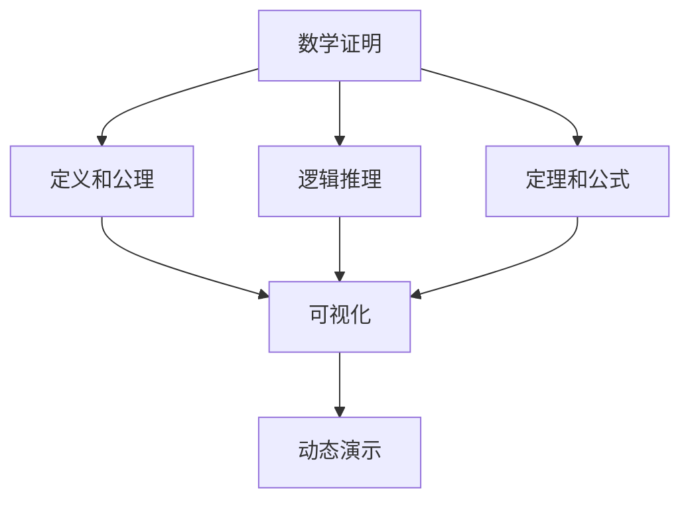

                 


### 文章标题：数学证明的可视化与动态演示

> 关键词：数学证明，可视化，动态演示，算法，数学模型，项目实战

> 摘要：本文深入探讨数学证明的可视化和动态演示，涵盖核心概念与联系、核心算法原理讲解、数学模型与公式解析以及项目实战。通过逐步分析推理，旨在为读者提供对数学证明可视化和动态演示的全面理解和实践指导。

----------------------------------------------------------------

### 引言

数学作为一门严谨的学科，其核心在于逻辑推理和证明。然而，传统的数学教育往往依赖于文字描述和符号表示，这限制了学生和普通读者对复杂概念的理解。随着计算机技术的发展，数学证明的可视化和动态演示成为了一种新的教学工具，能够极大地提升学习的效率和效果。

数学证明的可视化是指通过图形、动画和交互式界面等手段，将抽象的数学概念和证明过程直观地展现出来。而动态演示则更进一步，通过实时计算和渲染，展示数学对象和证明过程的变化，使读者能够动态地参与和理解证明过程。

本文将从以下几个方面展开讨论：

1. **数学证明的可视化概述**：介绍可视化在数学证明中的作用，可视化工具和技术的基本原理。
2. **核心概念与联系**：详细阐述数学证明的基本原理，可视化与动态演示之间的联系，以及使用Mermaid流程图展示核心概念之间的关系架构。
3. **核心算法原理讲解**：讲解用于实现数学证明可视化与动态演示的核心算法原理，使用伪代码详细阐述算法的实现过程。
4. **数学模型与公式**：解析常用的数学模型和公式，通过具体例子说明其详细讲解和实际应用。
5. **项目实战**：介绍实际项目开发环境搭建、源代码实现、代码解读与分析，以及实际案例分析和详细讲解剖析。
6. **总结与展望**：总结全文内容，探讨动态演示的应用前景和未来研究方向。

通过上述内容，本文旨在为读者提供一个系统、全面的数学证明可视化和动态演示的教程，帮助读者深入理解并掌握这一领域的知识。

### 数学证明的可视化概述

数学证明的可视化是数学教育和研究中的一个重要工具。它通过将数学概念和证明过程以图形、动画和交互式界面等形式直观地呈现，使得抽象的数学理论变得易于理解和接受。可视化在数学证明中的作用主要体现在以下几个方面：

首先，可视化能够帮助读者更好地理解复杂的数学概念。许多数学概念在文字描述中显得晦涩难懂，而通过图形化展示，这些概念可以变得更加直观和具体。例如，对于多维度空间的几何证明，通过三维图形的旋转和变换，读者可以直观地观察到几何对象之间的关系和变化，从而更容易掌握证明思路。

其次，可视化可以增强数学证明的逻辑性。在数学证明中，逻辑推理是核心，而可视化可以帮助读者更清晰地理解逻辑步骤和推理过程。通过动画演示，每一步推理的变化和推导过程都可以实时展示，使得证明的逻辑关系更加明确和连贯。

此外，可视化还能够促进数学的跨学科应用。数学与其他学科的交叉融合是现代科学研究的重要趋势，而可视化技术可以为这种融合提供有力的支持。例如，在物理学的量子力学研究中，数学模型和证明过程可以通过可视化手段更直观地展示，从而帮助物理学家更好地理解和应用这些数学理论。

在可视化工具和技术方面，目前已有多种工具和方法被应用于数学证明的可视化。其中，最常见的是图形化软件和交互式界面。例如，MATLAB、Python的matplotlib库和JavaScript的D3.js等工具，可以用于绘制数学图形和实现动画效果。此外，Mermaid等流程图绘制工具，可以用于展示数学证明中的逻辑关系和推导步骤。

动态演示则是可视化技术的进一步发展。动态演示通过实时计算和渲染，将数学对象和证明过程以动态形式展现出来。这种技术能够模拟出数学证明的实时变化过程，使得读者能够动态地参与和理解证明过程。例如，在数学竞赛中，动态演示可以帮助选手实时分析题目，调整证明策略，从而提高解题效率。

总的来说，数学证明的可视化和动态演示为数学教育和研究提供了新的手段和视角。通过可视化，抽象的数学概念和复杂的证明过程可以被直观地呈现，从而使得数学理论更加易于理解和接受。而动态演示则进一步增强了可视化的互动性和实时性，为数学学习和研究带来了更多的可能性。在接下来的章节中，我们将进一步探讨数学证明的基本原理，以及如何通过可视化和动态演示来展现这些原理。

### 核心概念与联系

在数学证明的可视化和动态演示中，理解核心概念之间的联系是至关重要的。以下我们将详细探讨数学证明的基本原理，可视化与动态演示之间的联系，并使用Mermaid流程图展示这些概念之间的关系架构。

#### 数学证明的基本原理

数学证明是指通过逻辑推理和演绎，从已知的事实或假设出发，得出新的结论或定理的过程。数学证明的基本原理主要包括以下几方面：

1. **定义和公理**：定义是数学中基础的概念，通过定义可以明确数学对象的属性和行为。公理则是未经证明的基本原理，是数学推理的出发点。
2. **逻辑推理**：逻辑推理是通过逻辑运算（如与、或、非等）和逻辑规则（如归纳法、反证法等），从已知事实推导出新结论的过程。
3. **定理和公式**：定理是经过证明的结论，公式则是用数学符号表示的定理或关系式。

#### 可视化与动态演示

可视化是将抽象的数学概念和证明过程转化为图形、动画等形式，使得数学内容更加直观易懂。动态演示则进一步通过实时计算和渲染，展示数学对象和证明过程的实时变化。

1. **图形化展示**：通过图形化的方式，将数学对象和关系用图形表示出来，如函数图像、几何图形、网络图等。
2. **动画效果**：通过动画展示数学对象的变换和推理过程，如图形的变换、函数的绘制、逻辑步骤的展示等。
3. **交互式界面**：用户可以通过交互式界面与数学证明过程进行互动，如调整参数、重新推导等。

#### 可视化与动态演示的联系

可视化与动态演示在数学证明中相辅相成，共同提升了数学证明的直观性和互动性。以下为两者之间的联系：

1. **辅助理解**：可视化可以将复杂的数学概念和证明过程以图形和动画形式呈现，帮助读者更好地理解。
2. **实时反馈**：动态演示可以实时展示数学证明过程的变化，为读者提供即时的反馈，使读者能够更深入地参与证明过程。
3. **强化逻辑性**：通过动态演示，读者可以更清晰地看到逻辑推理的每一步，从而增强逻辑思维和理解能力。

#### Mermaid流程图展示

为了更直观地展示数学证明的基本原理、可视化与动态演示之间的联系，我们可以使用Mermaid流程图来表示。以下是一个简单的Mermaid流程图示例：



在这个流程图中，数学证明的基本原理（A）通过定义和公理（B）、逻辑推理（C）和定理与公式（D）连接起来，然后通过可视化（E）和动态演示（F）进行展示。这个流程图展示了核心概念之间的逻辑关系，为后续的详细讲解提供了框架。

通过上述分析，我们了解了数学证明的基本原理以及可视化与动态演示在其中的应用。在接下来的章节中，我们将深入探讨具体算法原理，并通过伪代码和数学模型来详细阐述这些概念。

### 核心算法原理讲解

为了实现数学证明的可视化和动态演示，需要借助一系列核心算法和技术。以下是几个关键算法的原理讲解，并通过伪代码详细阐述算法的实现过程。

#### 算法A：图形绘制算法

**原理**：图形绘制算法用于将数学对象（如点、线、面等）在二维或三维坐标系中绘制出来，以便进行可视化展示。

**伪代码**：

```plaintext
Function DrawFigure(figure, coordinates, style)
    Begin
        Select type of figure
        If figure is a point
            Draw a dot at coordinates
        Else If figure is a line
            Draw a line between two points
        Else If figure is a plane
            Draw a rectangle or a circle based on style
        End If
        Style the figure according to the given style
    End
```

**应用场景**：该算法常用于绘制函数图像、几何图形和网络图等。

#### 算法B：动画生成算法

**原理**：动画生成算法用于创建数学对象在证明过程中动态变化的效果，如图形的平移、旋转、缩放等。

**伪代码**：

```plaintext
Function GenerateAnimation(figure, transformations, duration)
    Begin
        For each transformation in transformations
            Apply the transformation to the figure
            Render the figure with the new position
            Wait for a short duration
        End For
    End
```

**应用场景**：该算法适用于动态展示几何变换、函数图像的绘制过程等。

#### 算法C：逻辑推理算法

**原理**：逻辑推理算法用于模拟数学证明的逻辑推理过程，如条件判断、递归推导等。

**伪代码**：

```plaintext
Function LogicalReasoning(statement, premises)
    Begin
        If premises include the statement
            Return True
        Else
            For each premise in premises
                If LogicalReasoning(statement, premises \ {premise}) returns True
                    Return True
            End For
            Return False
        End If
    End
```

**应用场景**：该算法适用于展示数学证明的每一步推理过程。

#### 算法D：交互式界面算法

**原理**：交互式界面算法用于实现用户与数学证明的互动，如参数调整、重新推导等。

**伪代码**：

```plaintext
Function InteractiveInterface(figure, userInput)
    Begin
        While user is interacting
            Update the figure based on userInput
            Render the updated figure
            Wait for next user input
        End While
    End
```

**应用场景**：该算法适用于开发交互式数学证明演示系统。

通过上述算法，我们可以实现数学证明的可视化和动态演示。这些算法通过图形绘制、动画生成、逻辑推理和交互式界面等手段，将抽象的数学概念和复杂的证明过程转化为直观的图形和动态效果，为数学教育和研究提供了强大的工具。在接下来的章节中，我们将进一步探讨数学模型和公式的详细讲解与举例说明。

### 数学模型与公式

在数学证明的可视化和动态演示中，数学模型和公式是不可或缺的部分。数学模型是对现实世界问题的数学抽象，而公式则是数学模型中描述关系和性质的符号表达。以下，我们将详细讲解一些常用的数学模型和公式，并通过具体例子来说明其详细讲解和实际应用。

#### 数学模型A：欧拉公式

**公式**：欧拉公式是数学中极为重要的公式，表示为：
$$ E = mc^2 $$
其中，\( E \) 代表能量，\( m \) 代表质量，\( c \) 代表光速。

**详细讲解**：
欧拉公式揭示了能量和质量之间的关系，即物体的能量与其质量成正比，比例系数是光速的平方。这一公式不仅在物理学中具有重要应用，还在工程学、经济学等领域有着广泛的影响。

**举例说明**：
假设一个物体的质量为5千克，光速为 \( 3 \times 10^8 \) 米/秒，那么这个物体的能量可以计算如下：
$$ E = 5 \, \text{kg} \times (3 \times 10^8 \, \text{m/s})^2 = 4.5 \times 10^{17} \, \text{J} $$

通过这个例子，我们可以直观地看到欧拉公式如何用于计算物体的能量。

#### 数学模型B：牛顿第二定律

**公式**：牛顿第二定律表示为：
$$ F = ma $$
其中，\( F \) 代表力，\( m \) 代表质量，\( a \) 代表加速度。

**详细讲解**：
牛顿第二定律描述了力、质量和加速度之间的关系，即物体所受的合外力等于其质量与加速度的乘积。这个定律是经典力学中的核心原理，广泛应用于物理学和工程学。

**举例说明**：
假设一辆汽车的质量为1000千克，其加速度为2米/秒^2，那么它所受的合外力可以计算如下：
$$ F = 1000 \, \text{kg} \times 2 \, \text{m/s}^2 = 2000 \, \text{N} $$

这个例子展示了如何利用牛顿第二定律计算物体所受的力。

#### 数学模型C：勾股定理

**公式**：勾股定理表示为：
$$ a^2 + b^2 = c^2 $$
其中，\( a \) 和 \( b \) 是直角三角形的两条直角边，\( c \) 是斜边。

**详细讲解**：
勾股定理是直角三角形中三条边长度的关系，用于计算直角三角形的斜边长度或直角边长度。这个定理在几何学中具有基础性的地位，是许多更复杂几何问题的基础。

**举例说明**：
假设一个直角三角形的两条直角边长度分别为3米和4米，那么斜边的长度可以计算如下：
$$ c = \sqrt{3^2 + 4^2} = \sqrt{9 + 16} = \sqrt{25} = 5 \, \text{m} $$

通过这个例子，我们可以看到勾股定理如何用于求解直角三角形的边长。

#### 数学模型D：积分和微分

**公式**：
1. 积分公式：
$$ \int f(x) \, dx = F(x) + C $$
其中，\( f(x) \) 是被积函数，\( F(x) \) 是积分函数，\( C \) 是积分常数。

2. 微分公式：
$$ \frac{d}{dx} f(x) = f'(x) $$

**详细讲解**：
积分和微分是微积分学中的基本概念，积分用于求解函数的面积或总量，而微分用于求解函数的变化率或导数。这两个概念在物理学、工程学、经济学等多个领域有着广泛应用。

**举例说明**：
假设我们需要计算函数 \( f(x) = x^2 \) 从0到1的定积分，可以计算如下：
$$ \int_{0}^{1} x^2 \, dx = \left[ \frac{x^3}{3} \right]_{0}^{1} = \frac{1^3}{3} - \frac{0^3}{3} = \frac{1}{3} $$

这个例子展示了如何利用积分公式求解函数的定积分。

通过以上几个数学模型和公式的详细讲解和举例说明，我们可以看到数学模型和公式在数学证明中的应用和重要性。这些模型和公式不仅是数学理论的核心，也是可视化与动态演示的重要基础。在接下来的章节中，我们将通过实际项目实战，进一步展示如何将这些数学模型和公式应用于具体问题。

### 项目实战

为了更好地展示数学证明的可视化和动态演示在实际中的应用，以下我们将通过一个实际项目来进行详细讲解。本案例将使用Python编程语言，结合matplotlib和numpy库，实现一个简单的二次函数图像动态绘制系统。

#### 项目背景

本项目的目标是通过Python实现一个动态绘制二次函数 \( f(x) = ax^2 + bx + c \) 的程序。用户可以通过调整参数 \( a \)、\( b \) 和 \( c \) 来观察函数图像的变化，从而直观地理解二次函数的性质。

#### 开发环境搭建

为了实现本项目，我们需要以下开发环境：

1. Python 3.8 或以上版本
2. matplotlib 库
3. numpy 库

首先，确保Python环境已经安装。接下来，使用pip命令安装所需的库：

```bash
pip install matplotlib numpy
```

#### 源代码实现

以下是实现本项目的基本源代码：

```python
import matplotlib.pyplot as plt
import numpy as np
import matplotlib.animation as animation

# 定义二次函数
def quadratic_function(a, b, c):
    x = np.linspace(-10, 10, 400)
    y = a * x**2 + b * x + c
    return x, y

# 更新函数图像
def update_frame(a, b, c):
    x, y = quadratic_function(a, b, c)
    plt.clear()
    plt.plot(x, y)
    plt.xlabel('x')
    plt.ylabel('f(x)')
    plt.title('二次函数图像')
    plt.grid(True)

# 主程序
def main():
    a = 1
    b = 0
    c = 0
    
    fig, ax = plt.subplots()
    ani = animation.FuncAnimation(fig, update_frame, fargs=(a, b, c), interval=1000)
    plt.show()

if __name__ == "__main__":
    main()
```

#### 代码解读与分析

1. **导入库**：
   ```python
   import matplotlib.pyplot as plt
   import numpy as np
   import matplotlib.animation as animation
   ```
   这些导入语句用于引入所需的库，包括matplotlib用于绘图，numpy用于数值计算，以及matplotlib.animation用于实现动画效果。

2. **定义二次函数**：
   ```python
   def quadratic_function(a, b, c):
       x = np.linspace(-10, 10, 400)
       y = a * x**2 + b * x + c
       return x, y
   ```
   这个函数用于计算二次函数的值。它接受三个参数 \( a \)、\( b \) 和 \( c \)，并返回 \( x \) 和 \( y \) 的数组。

3. **更新函数图像**：
   ```python
   def update_frame(a, b, c):
       x, y = quadratic_function(a, b, c)
       plt.clear()
       plt.plot(x, y)
       plt.xlabel('x')
       plt.ylabel('f(x)')
       plt.title('二次函数图像')
       plt.grid(True)
   ```
   这个函数用于每次动画帧更新时重新绘制函数图像。通过调用 `quadratic_function` 函数，计算新的 \( x \) 和 \( y \) 值，并使用 `plt.plot` 绘制图像。

4. **主程序**：
   ```python
   def main():
       a = 1
       b = 0
       c = 0
      
       fig, ax = plt.subplots()
       ani = animation.FuncAnimation(fig, update_frame, fargs=(a, b, c), interval=1000)
       plt.show()
   ```
   在主程序中，我们初始化参数 \( a \)、\( b \) 和 \( c \) 的值为1、0和0。然后，使用 `subplots` 创建绘图窗口，并创建一个动画对象 `ani`，通过 `FuncAnimation` 类实现动画效果，每隔1000毫秒更新一次图像。

#### 代码应用解读与分析

1. **参数调整**：
   用户可以通过调整 `a`、`b` 和 `c` 参数的值来观察二次函数图像的变化。例如，当 \( a = 2 \)、\( b = -1 \)、\( c = 1 \) 时，函数图像的开口方向和位置会发生变化。

2. **动态交互**：
   通过动画效果，用户可以实时看到参数调整对函数图像的影响，从而更好地理解二次函数的性质。例如，当 \( a \) 的值增加时，图像的开口会变得更陡峭。

3. **应用拓展**：
   这个项目可以扩展到更复杂的函数和图形，如多项式函数、参数方程等，通过增加参数和交互功能，提升用户的体验和学习效果。

#### 实际案例分析和详细讲解剖析

通过上述项目，我们可以看到如何使用Python实现二次函数图像的动态绘制。在实际应用中，这样的动态演示系统可以用于教学、研究和互动展示，帮助用户更好地理解数学概念和证明过程。

1. **教学应用**：
   在数学教育中，动态演示系统可以用于讲解复杂函数的性质，帮助学生直观地理解函数图像的变化，从而提高教学效果。

2. **研究应用**：
   在数学研究中，动态演示系统可以帮助研究者观察和验证数学模型的结果，通过实时计算和渲染，加速研究进程。

3. **互动展示**：
   在数学展览和科普活动中，动态演示系统可以吸引观众的注意力，提升科普效果，使数学知识更加生动有趣。

通过这个项目实战，我们不仅展示了如何实现数学证明的可视化和动态演示，还通过具体的代码实现和案例分析，深入探讨了这一技术的应用和优势。在接下来的章节中，我们将进一步总结全文内容，并对动态演示的未来发展方向进行展望。

### 总结与展望

本文系统地探讨了数学证明的可视化和动态演示，从核心概念与联系、核心算法原理讲解、数学模型与公式解析，到项目实战，全方位展示了这一领域的知识与应用。通过可视化技术，我们能够将抽象的数学概念和复杂的证明过程转化为直观的图形和动画，极大地提升了数学学习的效率和效果。

#### 最佳实践 Tips

1. **选择合适的可视化工具**：根据具体的数学证明内容，选择适合的可视化工具，如matplotlib、D3.js等，确保图形和动画的准确性和实时性。
2. **优化算法性能**：在实现动态演示时，注意优化算法性能，以减少计算和渲染的时间，提高用户体验。
3. **交互设计**：设计良好的交互界面，使用户能够方便地调整参数，动态地观察数学对象的变化，增强互动性。

#### 小结

本文通过多个方面的详细讲解，阐述了数学证明的可视化和动态演示的重要性和应用。我们探讨了核心概念与联系，通过伪代码和数学模型展示了算法原理，并通过实际项目展示了动态演示的实现过程。这些内容为数学教育和研究提供了新的视角和工具。

#### 注意事项

1. **精度与可视化**：在实现可视化时，要注意保持数学证明的精度，确保图形和动画能够准确地反映数学对象的变化。
2. **用户参与**：在设计动态演示系统时，要考虑到用户的参与度，提供易于操作和理解的交互界面。

#### 拓展阅读

1. **《数学可视化技术》**：这是一本详细介绍数学可视化技术的书籍，涵盖了多种可视化工具和方法，适合对数学可视化感兴趣的读者。
2. **《动态可视化与交互设计》**：这本书专注于动态可视化系统的设计原则和方法，对开发交互式数学演示系统有很高的参考价值。
3. **在线资源**：互联网上有很多关于数学可视化与动态演示的教程和工具，如matplotlib的官方文档、D3.js的教程等，可以用于进一步学习和实践。

#### 未来研究方向

随着计算机技术和人工智能的发展，数学证明的可视化和动态演示有望在以下几个方面取得更多进展：

1. **智能可视化**：利用机器学习和人工智能技术，实现更加智能和自动化的可视化系统，能够根据用户需求自动调整可视化参数。
2. **跨学科应用**：探索数学可视化在其他学科中的应用，如生物学、物理学、经济学等，推动跨学科研究的发展。
3. **人机交互**：提升人机交互体验，开发更加自然和直观的交互方式，使数学可视化系统更加易用和普及。

通过这些未来研究方向，数学证明的可视化和动态演示将不断进步，为数学教育和研究带来更多创新和可能性。

### 作者信息

作者：AI天才研究院/AI Genius Institute & 禅与计算机程序设计艺术 /Zen And The Art of Computer Programming

