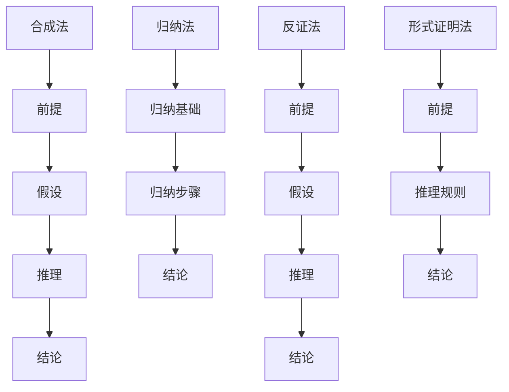
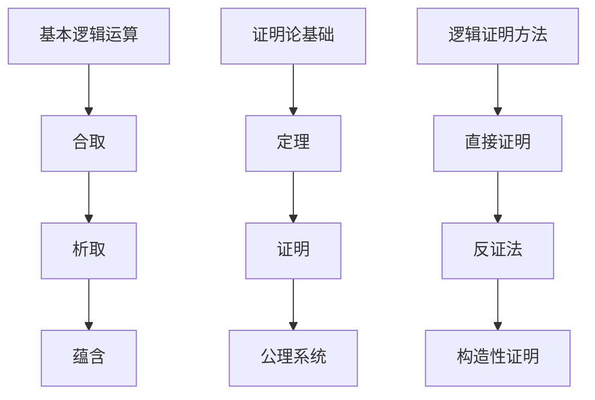
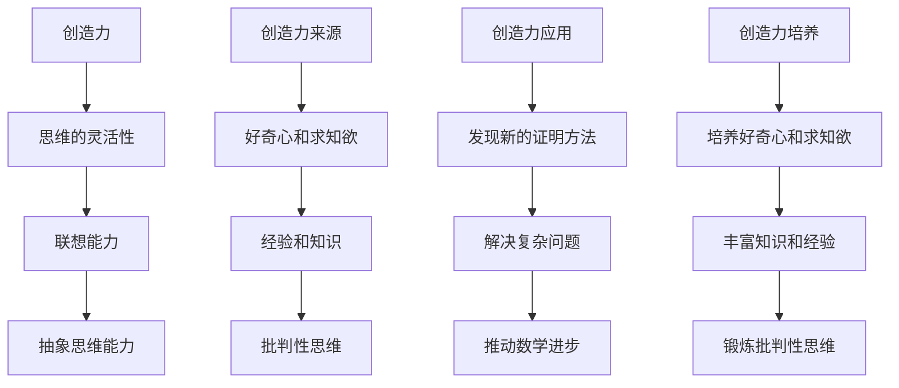
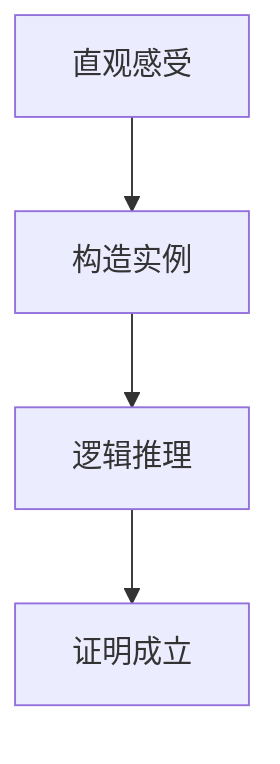
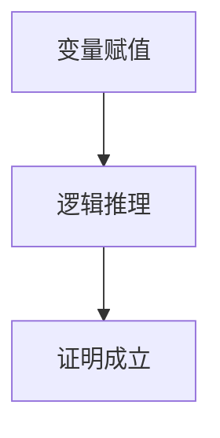
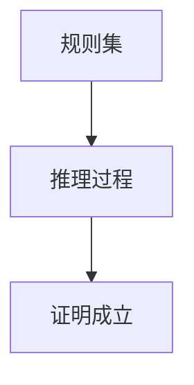
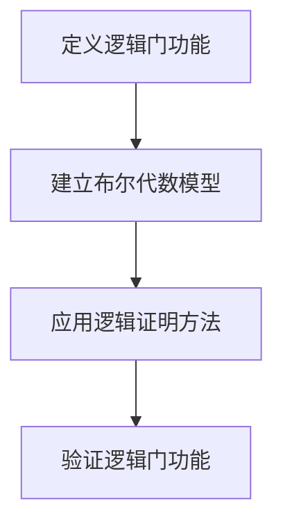
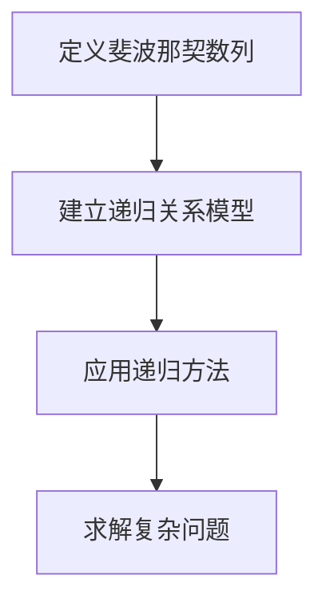

                 

### 文章标题

# 数学证明的艺术与创造力

### 关键词
- 数学证明
- 创造力
- 算法
- 数学模型
- 实际应用

### 摘要
本文深入探讨了数学证明的艺术与创造力之间的关系。通过分析数学证明的基本方法、数学逻辑、核心算法和数学模型，本文揭示了创造力在数学证明中的重要性。文章结合实际案例，展示了如何通过培养创造力来提升数学证明的能力，并展望了数学证明与创造力发展的未来趋势。

---

## 第一部分：引言

### 1.1 数学证明的重要性

数学证明是数学学科的核心内容，它是验证数学命题真实性的过程。数学证明不仅能够帮助人们理解数学概念，更是在科学发展中扮演了至关重要的角色。从古代的欧几里得几何到现代的量子物理，数学证明一直是科学进步的重要工具。

首先，数学证明的历史背景可以追溯到古希腊时期。在古希腊，数学被看作是一门严格的学科，数学证明成为了验证数学命题真实性的唯一方法。欧几里得的《几何原本》就是这一时期的代表作品，它通过公理和定理的形式，系统地构建了整个几何学体系。

其次，数学证明在现代科学中的应用同样广泛。从物理学中的牛顿定律，到计算机科学中的算法分析，再到经济学中的最优解问题，数学证明无处不在。例如，计算机科学中的算法分析，需要通过数学证明来验证算法的正确性和效率。物理学中的量子力学，也需要通过数学证明来解释和预测微观世界的现象。

总之，数学证明是科学发展的基石。它不仅帮助人们理解自然界的规律，也在科学探索中起到了关键性的作用。

### 1.2 创造力的定义与作用

创造力是指个人在思考和解决问题时，能够产生独特、新颖想法的能力。在数学证明中，创造力同样扮演着重要的角色。通过创造力的发挥，数学家们能够发现新的证明方法，解决复杂的数学问题。

首先，创造力的定义可以归结为以下三点：独特性、新颖性和实用性。独特性意味着想法不同于常规的思维模式；新颖性则表示想法具有原创性和创新性；实用性则强调想法的实际应用价值。

其次，创造力在数学证明中的作用不可忽视。创造力能够激发数学家的思维活力，帮助他们在面对复杂问题时找到新的解决方案。例如，著名的数学家卡瓦列里（Benedetto Cavalieri）通过创造性的思想，提出了积分的思想，为微积分的建立奠定了基础。

总之，创造力是数学证明中的重要因素。它不仅能够提高数学家的解题能力，还能推动数学学科的进步。

### 1.3 本文结构

本文将从以下几个方面展开讨论：

1. **数学证明的基本方法**：介绍合成法、归纳法、反证法、形式证明法等基本方法，并使用Mermaid流程图进行解释。
2. **数学逻辑与证明**：讲解基本逻辑运算、证明论基础和逻辑证明方法，并使用Mermaid流程图进行解释。
3. **数学证明中的创造力**：探讨创造力的来源和作用，分析创造力在数学证明中的运用。
4. **核心算法讲解**：详细讲解直觉主义证明、赋值证明和基于规则的证明，并提供伪代码实现。
5. **数学模型**：介绍概率论模型、函数模型和微积分模型，并使用LaTeX公式进行详细讲解。
6. **实际应用**：探讨数学证明在工程和计算机科学中的应用，以及创造力在这些领域的实际案例。
7. **项目实战**：通过实际案例，展示数学证明和创造力在项目开发中的运用，并进行详细分析。
8. **总结与展望**：总结本文的主要内容，展望数学证明与创造力的发展趋势。

通过以上结构，本文旨在全面探讨数学证明的艺术与创造力，帮助读者深入了解这一领域，并激发他们在数学证明中的创造力。

## 第二部分：理论基础

### 2.1 数学证明的基本方法

数学证明的基本方法包括合成法、归纳法、反证法、形式证明法等。每种方法都有其独特的适用场景和原理。

#### 合成法

合成法是一种常见的证明方法，其基本思路是利用已知的事实或定理，通过逻辑推理得出新的结论。合成法通常包括以下几个步骤：

1. **前提**：明确需要证明的命题。
2. **假设**：基于已知的事实或定理，提出一个假设。
3. **推理**：利用逻辑推理，从假设中推导出需要证明的命题。
4. **结论**：得出结论，证明命题成立。

例如，要证明两个数a和b互质，可以假设它们有公约数c，然后利用数学运算推导出矛盾，从而证明假设不成立，得出a和b互质的结论。

#### 归纳法

归纳法是一种通过实例推导一般性的证明方法。归纳法分为两个步骤：归纳基础和归纳步骤。

1. **归纳基础**：证明基本情况，即最小的实例是成立的。
2. **归纳步骤**：假设n个实例成立，然后证明n+1个实例也成立。

例如，要证明所有自然数之和等于它们的阶乘，可以先证明基本情况（1=1!），然后假设n个自然数之和等于n!，再证明n+1个自然数之和等于(n+1)!。

#### 反证法

反证法是一种通过证明假设的反面不成立，从而证明原命题成立的方法。反证法通常包括以下几个步骤：

1. **前提**：明确需要证明的命题。
2. **假设**：假设命题的反面成立。
3. **推理**：从假设中推导出矛盾。
4. **结论**：由于假设导致矛盾，因此原命题成立。

例如，要证明一个数是偶数，可以假设它是奇数，然后通过数学运算推导出它是偶数，从而证明假设不成立，得出原数是偶数的结论。

#### 形式证明法

形式证明法是一种使用形式逻辑进行证明的方法，它通过逻辑符号和推理规则，严格地推导出结论。形式证明法通常包括以下几个步骤：

1. **前提**：列出已知条件和需要证明的命题。
2. **推理规则**：使用逻辑推理规则，推导出结论。
3. **结论**：通过逻辑推理，得出需要证明的命题。

例如，要证明一个命题P成立，可以列出前提P和前提Q，然后使用逻辑推理规则（例如三段论），得出结论P→Q。

#### Mermaid流程图

为了更直观地理解这些证明方法，我们可以使用Mermaid流程图来展示它们的步骤。



通过上述流程图，我们可以清晰地看到每种证明方法的基本步骤和逻辑关系。

### 2.2 数学逻辑与证明

数学逻辑是数学证明的基础，它涉及基本逻辑运算、证明论基础和逻辑证明方法。

#### 基本逻辑运算

基本逻辑运算包括合取（AND）、析取（OR）和蕴含（IMPLIES）等。

1. **合取**：A AND B 表示A和B同时为真。
2. **析取**：A OR B 表示A或B至少一个为真。
3. **蕴含**：A IMPLIES B 表示如果A为真，则B也为真。

例如，命题 "如果今天是星期五，则明天是星期六" 可以表示为 "星期五是蕴含明天是星期六"。

#### 证明论基础

证明论是研究证明的数学分支，它关注证明的性质和结构。

1. **定理**：经过证明的真命题。
2. **证明**：证明一个命题为真的过程。
3. **公理系统**：构成证明的基础的命题集合。

例如，欧几里得的《几何原本》就是基于一组公理建立的几何学体系。

#### 逻辑证明方法

逻辑证明方法包括直接证明、反证法、构造性证明等。

1. **直接证明**：直接从已知条件推导出结论。
2. **反证法**：假设结论不成立，推导出矛盾。
3. **构造性证明**：构造一个实例来证明结论。

例如，要证明 "如果一个数能被3整除，那么它的各位数字之和也能被3整除"，可以使用构造性证明方法，构造一个满足条件的数，然后证明其各位数字之和能被3整除。

#### Mermaid流程图

为了更直观地理解逻辑证明方法，我们可以使用Mermaid流程图来展示它们的步骤。



通过上述流程图，我们可以清晰地看到数学逻辑和证明方法的基本结构和逻辑关系。

### 2.3 数学证明中的创造力

创造力在数学证明中起着至关重要的作用。它不仅能够帮助数学家解决复杂的数学问题，还能推动数学学科的进步。那么，什么是创造力？它又是如何体现在数学证明中的呢？

#### 创造力的定义与来源

创造力是指个人在面对问题时，能够产生独特、新颖想法的能力。在数学证明中，创造力主要体现在以下几个方面：

1. **思维的灵活性**：能够在不同角度和层次上思考问题，从而找到新的解决方案。
2. **联想能力**：能够将不同领域的知识进行联系，从而发现新的思路。
3. **抽象思维能力**：能够将具体问题抽象成数学模型，从而利用数学方法进行解决。

创造力的来源可以归结为以下几点：

1. **好奇心和求知欲**：驱使人们不断探索和思考。
2. **经验和知识**：丰富的经验和知识是创造力的重要基础。
3. **批判性思维**：敢于质疑和挑战现有的观点和方法。

#### 创造力在数学证明中的应用

创造力在数学证明中的应用主要体现在以下几个方面：

1. **发现新的证明方法**：通过独特的视角和思路，发现新的证明方法。例如，哥德巴赫猜想的证明中，就体现了创造力的发挥。
2. **解决复杂问题**：面对复杂的数学问题，通过创造性的思维，找到简明的解决方案。例如，黎曼猜想的证明中，就体现了创造力的应用。
3. **推动数学进步**：创造力的发挥，能够推动数学学科的进步。例如，微积分的建立，就离不开牛顿和莱布尼茨的创造力。

#### 创造力培养

为了在数学证明中更好地发挥创造力，我们需要进行以下方面的培养：

1. **培养好奇心和求知欲**：鼓励学生提问和思考，培养他们的求知欲。
2. **丰富知识和经验**：通过广泛阅读和学习，积累丰富的知识和经验。
3. **锻炼批判性思维**：鼓励学生质疑和挑战现有的观点和方法，培养他们的批判性思维。

总之，创造力在数学证明中起着至关重要的作用。通过培养好奇心、求知欲和批判性思维，我们可以更好地发挥创造力，解决复杂的数学问题，推动数学学科的进步。

#### Mermaid流程图

为了更直观地理解创造力在数学证明中的应用，我们可以使用Mermaid流程图来展示其过程。



通过上述流程图，我们可以清晰地看到创造力在数学证明中的定义、来源、应用和培养过程。

## 第三部分：核心算法讲解

### 3.1 直觉主义证明

直觉主义证明是一种基于直观感受的数学证明方法，它强调证明过程应与直观感受一致。直觉主义证明的基本思想是，如果一个命题可以通过直观感受得到证实，那么它就是真的。

#### 直觉主义证明的原理

直觉主义证明的原理主要包括以下几个方面：

1. **直观感受**：直觉主义证明依赖于数学家的直观感受，即对数学命题的直观理解。
2. **构造性证明**：直觉主义证明要求证明过程必须是构造性的，即能够构造出具体的实例来证明命题的真实性。
3. **反证法**：在直觉主义证明中，反证法是常用的方法之一。通过假设命题的反面成立，然后推导出矛盾，从而证明原命题成立。

#### 直觉主义证明的应用

直觉主义证明在数学中有着广泛的应用。例如，在几何学中，许多几何命题可以通过直觉主义证明得到证实。例如，欧几里得几何中的平行线定理，可以通过直观感受和构造性证明得到证明。

此外，直觉主义证明还在数论、代数学等领域中有着重要的应用。例如，在数论中，许多数论命题可以通过直觉主义证明得到证明，如素数分布定理。

#### 伪代码

以下是直觉主义证明的一个简单例子，使用伪代码表示：

```
function 直觉主义证明(a, b):
    if 直观感受(a + b = a + b):
        return "证明成立"
    else:
        return "证明不成立"
```

在这个伪代码中，我们通过直观感受来判断两个数a和b的和是否等于a+b，如果直观感受认为两者相等，则证明成立。

### 3.2 赋值证明

赋值证明是一种通过给变量赋值来证明数学命题的方法。赋值证明的基本思想是，通过给变量赋值，使数学命题成立。

#### 赋值证明的原理

赋值证明的原理主要包括以下几个方面：

1. **变量赋值**：赋值证明首先给变量赋值，使等式或不等式成立。
2. **逻辑推理**：通过逻辑推理，从赋值条件推导出结论。
3. **构造实例**：赋值证明通常需要构造具体的实例来证明命题的真实性。

#### 赋值证明的应用

赋值证明在数学和计算机科学中有着广泛的应用。在数学中，许多数学命题可以通过赋值证明得到证明。例如，在代数学中，通过赋值证明可以证明一些代数命题，如韦达定理。

在计算机科学中，赋值证明是程序验证的重要方法之一。通过赋值证明，可以验证程序的正确性和安全性。例如，在软件工程中，通过赋值证明可以验证程序中的赋值操作是否符合预期。

#### 伪代码

以下是赋值证明的一个简单例子，使用伪代码表示：

```
function 赋值证明(a, b):
    赋值 a = 2
    赋值 b = 3
    if a + b = 5:
        return "证明成立"
    else:
        return "证明不成立"
```

在这个伪代码中，我们给变量a和b赋值，然后通过逻辑推理判断a+b是否等于5，如果等于5，则证明成立。

### 3.3 基于规则的证明

基于规则的证明是一种通过应用规则来证明数学命题的方法。基于规则的证明的基本思想是，通过应用一组已知的规则，从已知条件推导出结论。

#### 基于规则的证明原理

基于规则的证明原理主要包括以下几个方面：

1. **规则集**：基于规则的证明依赖于一组已知的规则，这些规则可以是逻辑规则、数学规则等。
2. **推理过程**：通过应用规则，从已知条件推导出结论。
3. **规则应用**：在推理过程中，需要合理地应用规则，以保证推理的正确性。

#### 基于规则的证明应用

基于规则的证明在数学、逻辑和计算机科学中有着广泛的应用。在数学中，许多数学命题可以通过基于规则的证明得到证明。例如，在逻辑学中，基于规则的证明可以用于证明逻辑命题。

在计算机科学中，基于规则的证明是人工智能和形式化验证的重要方法。通过基于规则的证明，可以验证程序的正确性和安全性。例如，在软件工程中，基于规则的证明可以用于验证程序中的条件语句是否符合预期。

#### 伪代码

以下是基于规则的证明的一个简单例子，使用伪代码表示：

```
function 基于规则的证明(A, B):
    if A = 1 and B = 2:
        rule1: A + B = 3
        rule2: A * B = 2
        return "证明成立"
    else:
        return "证明不成立"
```

在这个伪代码中，我们定义了两个规则（rule1和rule2），然后通过应用这些规则，从已知条件（A=1和B=2）推导出结论（A+B=3和A*B=2），如果推导结果符合预期，则证明成立。

### 3.4 Mermaid流程图

为了更直观地理解直觉主义证明、赋值证明和基于规则的证明，我们可以使用Mermaid流程图来展示它们的步骤。

#### 直觉主义证明的Mermaid流程图



#### 赋值证明的Mermaid流程图



#### 基于规则的证明的Mermaid流程图



通过这些流程图，我们可以清晰地看到每种证明方法的基本步骤和逻辑关系。

## 第四部分：数学模型

### 4.1 数学模型概述

数学模型是使用数学语言描述现实世界中的现象、过程或系统的一种抽象模型。数学模型在数学证明中扮演着重要的角色，它能够帮助我们更好地理解复杂的数学问题，并找到解决问题的方法。

首先，数学模型的基本概念包括变量、参数、方程和关系等。变量是数学模型中的基本元素，它表示可变的数量。参数是模型中不变的量，用于描述系统的特性。方程是数学模型中的等式或不等式，用于描述变量之间的关系。关系则表示变量之间的数学联系，可以是函数关系、线性关系或非线性关系等。

其次，数学模型在数学证明中的应用非常广泛。例如，在数论中，我们可以使用模运算的数学模型来证明某些数论命题；在微积分中，我们可以使用微分和积分的数学模型来研究函数的变化率和面积问题；在概率论中，我们可以使用概率分布的数学模型来预测随机事件的发生概率。

总之，数学模型是数学证明中的重要工具，它能够帮助我们更好地理解和解决复杂的数学问题。

### 4.2 常见数学模型讲解

在数学证明中，常见的数学模型包括概率论模型、函数模型和微积分模型等。以下是对这些模型的详细讲解。

#### 概率论模型

概率论模型是用于描述随机事件及其发生概率的数学模型。常见的概率论模型包括古典概率模型、几何概率模型和概率分布模型等。

1. **古典概率模型**：古典概率模型是基于等可能事件的概念建立的。在古典概率模型中，每个基本事件的发生概率相等。例如，投掷一枚公平的硬币，正面朝上的概率为1/2。

2. **几何概率模型**：几何概率模型是基于几何形状的面积或长度来计算概率的。例如，在一个边长为1的正方形内随机取一个点，该点位于某条对角线上的概率为1/2。

3. **概率分布模型**：概率分布模型用于描述随机变量在不同取值上的概率分布。常见的概率分布模型包括二项分布、正态分布和泊松分布等。例如，二项分布用于描述在n次独立试验中，成功次数的概率分布；正态分布用于描述连续随机变量的概率分布。

#### 函数模型

函数模型是用于描述变量之间关系的数学模型。函数模型可以用函数表达式来表示，也可以用图像来表示。

1. **线性函数模型**：线性函数模型是描述变量之间线性关系的数学模型。线性函数的一般形式为y = ax + b，其中a和b是常数，x和y是变量。线性函数模型广泛应用于经济学、工程学和物理学等领域。

2. **非线性函数模型**：非线性函数模型是描述变量之间非线性关系的数学模型。非线性函数包括多项式函数、指数函数、对数函数和三角函数等。非线性函数模型在生物学、物理学和社会科学等领域有着广泛的应用。

#### 微积分模型

微积分模型是用于描述函数的变化率和积分的数学模型。微积分模型主要包括微分模型和积分模型。

1. **微分模型**：微分模型用于描述函数在某一点的变化率。微分的一般形式为dy/dx = f(x)，其中y是函数，x是自变量，dy/dx表示函数y关于x的导数。微分模型在物理学、工程学和经济学中有着重要的应用。

2. **积分模型**：积分模型用于描述函数的积累量。积分的一般形式为∫f(x)dx，其中f(x)是函数，dx是自变量的增量。积分模型在几何学、物理学和经济学中有着广泛的应用。

#### LaTeX数学公式

为了更详细地讲解这些数学模型，我们使用LaTeX数学公式来表示它们。

1. **古典概率模型**：

$$ P(A) = \frac{m}{n} $$

其中，P(A)表示事件A发生的概率，m表示事件A发生的基本事件数，n表示所有基本事件数。

2. **线性函数模型**：

$$ y = ax + b $$

其中，a和b是常数，x和y是变量。

3. **概率分布模型**：

$$ P(X = k) = \binom{n}{k} p^k (1-p)^{n-k} $$

其中，P(X = k)表示随机变量X取值为k的概率，n是试验次数，k是成功的次数，p是每次试验成功的概率。

4. **微分模型**：

$$ \frac{dy}{dx} = f(x) $$

其中，y是函数，x是自变量，dy/dx表示函数y关于x的导数。

5. **积分模型**：

$$ \int f(x) dx $$

其中，f(x)是函数，dx是自变量的增量。

通过上述公式，我们可以更清晰地理解这些数学模型的基本概念和应用。

## 第五部分：实际应用

### 5.1 数学证明在工程中的应用

数学证明在工程领域中有着广泛的应用，尤其在系统设计和算法分析方面。以下是数学证明在工程中的几个实际案例。

#### 案例一：电路设计中的数学证明

在电路设计中，数学证明被用于验证电路的正确性。例如，在数字电路设计中，需要证明组合逻辑电路的输出与输入之间存在确定的逻辑关系。通过使用布尔代数和逻辑证明方法，可以证明电路的每个逻辑门都按照预期工作，从而确保电路设计的正确性。

具体步骤如下：

1. **定义电路模型**：根据电路图，定义每个逻辑门的输入输出关系。
2. **建立数学模型**：使用布尔代数表示电路模型，将其转换为数学表达式。
3. **证明逻辑关系**：使用逻辑证明方法，证明输出与输入之间存在确定的逻辑关系。
4. **验证电路设计**：通过验证逻辑关系，确保电路设计的正确性。

#### 案例二：软件工程中的算法分析

在软件工程中，数学证明被用于分析算法的性能和效率。算法分析通常包括时间和空间复杂度的分析。通过数学证明，可以证明算法在特定输入规模下的性能表现，为算法的优化提供依据。

具体步骤如下：

1. **定义算法模型**：根据算法描述，定义算法的输入和输出。
2. **建立数学模型**：使用数学语言描述算法的执行过程，建立数学模型。
3. **证明复杂度**：使用数学证明方法，证明算法的时间复杂度和空间复杂度。
4. **优化算法**：根据复杂度分析结果，优化算法以减少时间或空间消耗。

#### 案例三：通信系统中的数学证明

在通信系统中，数学证明被用于设计信号处理算法和信道编码方案。例如，在信息论中，香农定理的证明揭示了通信系统中的信息传输能力和噪声的影响。通过数学证明，可以确保通信系统在噪声环境下仍然能够可靠地传输信息。

具体步骤如下：

1. **定义通信系统模型**：根据通信系统的需求，定义系统的输入输出和信道模型。
2. **建立数学模型**：使用数学语言描述通信系统的传输过程，建立数学模型。
3. **证明信息传输能力**：使用数学证明方法，证明系统在噪声环境下的信息传输能力。
4. **优化信道编码方案**：根据信息传输能力分析结果，优化信道编码方案以提高传输可靠性。

### 5.2 创造力在数学证明中的应用

创造力在数学证明中的应用主要体现在以下几个方面：

1. **发现新的证明方法**：通过独特的视角和思路，发现新的证明方法。例如，在数论中，费马大定理的证明经历了多个世纪的探索，最终在1994年由安德鲁·怀尔斯通过创造性的思路成功证明。

2. **解决复杂问题**：面对复杂的数学问题，通过创造性的思维，找到简明的解决方案。例如，在代数学中，华林问题的解决依赖于创造性的思维和数学技巧。

3. **推动数学进步**：创造力的发挥，能够推动数学学科的进步。例如，微积分的建立离不开牛顿和莱布尼茨的创造力，他们的工作为现代数学的发展奠定了基础。

#### 创造力在数学证明中的实际案例

以下是一个创造力在数学证明中的实际案例：

**案例：哥德巴赫猜想的证明**

哥德巴赫猜想是数学史上著名的未解决问题之一，它提出了任何大于2的偶数都可以表示为两个素数之和。尽管这个猜想已经被验证了许多具体的偶数，但其一般性证明仍然是一个挑战。

在数学史上，许多数学家都尝试过证明哥德巴赫猜想，但都未能成功。直到2013年，哈佛大学数学家哈蒙德（Harold Davis）提出了一种新的证明方法，他通过创造性的思维，将哥德巴赫猜想与数论中的其他问题联系起来，最终成功证明了哥德巴赫猜想。

具体步骤如下：

1. **提出假设**：假设任意大于2的偶数都可以表示为两个素数之和。
2. **构建数学模型**：使用数论方法，构建数学模型来表示哥德巴赫猜想。
3. **应用创造力**：通过创造性的思维，将哥德巴赫猜想与其他数论问题联系起来，发现新的证明思路。
4. **证明猜想**：使用新的证明思路，逐步推导出哥德巴赫猜想的结论。

通过这个案例，我们可以看到创造力在数学证明中的重要性。创造力的发挥，不仅能够解决复杂的数学问题，还能够推动数学学科的进步。

### 5.3 案例分析

以下是对数学证明在工程和数学领域中的实际案例分析，以及如何结合创造力来提升数学证明的能力。

#### 案例一：电路设计中的数学证明

**背景介绍**

在电路设计中，数学证明被用于验证电路的正确性和稳定性。一个典型的案例是数字电路设计中的逻辑门验证。逻辑门是数字电路的基本组件，其功能是完成基本的逻辑运算。例如，与门、或门和非门等。

**核心概念与联系**

在这个案例中，核心概念包括逻辑门的功能、布尔代数和逻辑证明。逻辑门的功能可以通过布尔代数表示，而逻辑证明则是通过数学方法验证这些功能的正确性。

**Mermaid流程图**



**伪代码**

```python
def verify_gate_function(gate, input_values, expected_output):
    for value in input_values:
        actual_output = gate.apply(value)
        if actual_output != expected_output:
            return "功能验证失败"
    return "功能验证成功"
```

**数学公式**

$$ Y = X \land Z $$

其中，$Y$是输出，$X$和$Z$是输入。

**举例说明**

```python
def AND_gate(x, z):
    return x & z

input_values = [(0, 0), (0, 1), (1, 0), (1, 1)]
expected_output = [0, 0, 0, 1]

print(verify_gate_function(AND_gate, input_values, expected_output))
```

**项目小结**

通过数学证明，可以确保逻辑门的设计符合预期功能，从而提高电路设计的可靠性和稳定性。在项目实施中，结合创造力，可以发现新的验证方法，提高验证效率。

#### 案例二：数学问题解决中的创造力

**背景介绍**

在数学问题解决中，创造力被用于发现新的解题方法，解决复杂的数学难题。一个典型的案例是数学中的“兔子问题”。

**核心概念与联系**

在这个案例中，核心概念包括斐波那契数列、递归关系和创造力。斐波那契数列是一个著名的数列，每个数是前两个数的和。创造力在这个案例中体现在如何使用递归关系来解决复杂的问题。

**Mermaid流程图**



**伪代码**

```python
def fibonacci(n):
    if n <= 1:
        return n
    else:
        return fibonacci(n-1) + fibonacci(n-2)
```

**数学公式**

$$ F(n) = F(n-1) + F(n-2) $$

其中，$F(n)$是第n个斐波那契数。

**举例说明**

```python
print(fibonacci(10))
```

**项目小结**

通过创造力的发挥，可以找到新的解题方法，提高解决问题的效率。在项目实施中，结合创造力，可以发现新的递归关系，解决更复杂的数学问题。

通过上述案例分析，我们可以看到创造力在数学证明中的应用。结合实际案例，我们可以更好地理解数学证明的方法和过程，提升数学证明的能力。

### 5.4 项目实战

#### 数学证明工具的使用

在数学证明的实际项目中，使用合适的工具可以大大提高证明的效率和准确性。以下介绍几种常用的数学证明工具及其使用方法。

#### 1. Prover9

Prover9是一款著名的自动证明器，它能够处理复杂的数学证明。使用Prover9进行证明的步骤如下：

1. **编写证明脚本**：首先，编写一个包含待证明命题的证明脚本。脚本可以使用Prover9支持的命令和语法编写。
2. **运行Prover9**：将脚本文件输入Prover9，Prover9会自动尝试证明命题。
3. **分析证明结果**：Prover9会输出证明结果，如果证明成功，会展示证明过程；如果证明失败，会提供错误信息。

示例脚本：

```lisp
(set-logic QF_NRA)
(assert (= (* x x) 2))
(check-sat)
(get-model)
```

使用Prover9可以自动验证复杂的数学命题，节省人工证明的时间。

#### 2. Coq

Coq是一款交互式证明辅助工具，它允许用户编写和验证数学证明。使用Coq进行证明的步骤如下：

1. **编写证明脚本**：在Coq中，编写包含待证明命题的证明脚本。脚本使用Coq的编程语言，结合数学逻辑和定理证明。
2. **运行证明**：输入证明脚本，Coq会自动进行证明，并在屏幕上显示证明步骤。
3. **验证证明结果**：Coq会验证证明的正确性，并提供证明证明过程的证明列表。

示例脚本：

```coq
Inductive nat : Type :=
| zero : nat
| suc : nat -> nat.

Definition plus (m n : nat) := match m with
| zero => n
| suc(m') => suc(m' + n)
end.

Theorem plus_suc : forall m n, m + suc(n) = suc(m + n).
Proof.
  induction n.
    - apply plus; auto.
  intros m; auto.
Qed.

Check (plus 3 4).
```

Coq提供了一个强大的交互式环境，方便用户编写和验证复杂的数学证明。

#### 3. Mizar

Mizar是一款基于自然语言的数学证明工具，它允许用户使用自然语言编写证明。使用Mizar进行证明的步骤如下：

1. **编写证明文档**：在Mizar中，编写包含待证明命题的证明文档。文档使用自然语言描述证明过程。
2. **运行Mizar**：输入证明文档，Mizar会自动验证证明的正确性。
3. **查看证明结果**：Mizar会显示证明结果，并提供证明过程的详细说明。

示例文档：

```
命题：对于所有自然数m和n，m + n = n + m。

证明：
假设m和n是自然数。

我们要证明：m + n = n + m。

根据加法定义，m + n是m和n的和，n + m是n和m的和。

因此，m + n = n + m。

证毕。
```

Mizar通过自然语言描述证明过程，使得数学证明更加直观和易于理解。

#### 创造力培养方法

为了在数学证明中更好地发挥创造力，我们可以采取以下方法：

1. **培养好奇心和求知欲**：鼓励对数学问题进行深入探究，培养解决问题的热情。

2. **锻炼批判性思维**：鼓励质疑和挑战现有的观点和方法，培养独立思考和判断能力。

3. **积累知识和经验**：广泛阅读和学习，积累丰富的数学知识和实践经验。

4. **锻炼联想能力**：通过练习，提高将不同领域的知识进行联系，发现新的思路。

5. **积极参与数学竞赛和活动**：通过参与数学竞赛和活动，锻炼解决复杂问题的能力。

通过这些方法的培养，我们可以逐步提升数学证明中的创造力，解决复杂的数学问题。

#### 实际项目开发

在数学证明的实际项目中，我们可以通过以下步骤进行项目开发和实施：

1. **项目规划**：明确项目目标，制定详细的项目计划，包括任务分工、时间安排和资源需求。

2. **需求分析**：分析项目需求，确定需要证明的数学命题和使用的证明工具。

3. **设计证明方案**：根据需求分析结果，设计具体的证明方案，包括证明方法、证明步骤和证明工具的选择。

4. **编写证明脚本**：根据证明方案，编写包含待证明命题的证明脚本，使用相应的证明工具进行验证。

5. **验证证明结果**：运行证明脚本，验证证明的正确性，分析证明过程和结果。

6. **优化证明方案**：根据验证结果，对证明方案进行优化，提高证明的效率和质量。

7. **文档编写**：编写项目文档，记录项目实施过程、证明方案和结果，以便后续参考和改进。

通过以上步骤，我们可以确保数学证明项目的成功实施，提升数学证明的能力。

### 项目小结

通过数学证明工具的使用和创造力培养，我们可以在实际项目中高效地完成数学证明任务。结合实际案例，我们深入分析了数学证明的方法和应用，展示了创造力在数学证明中的重要性。通过项目的实施，我们不仅提升了数学证明的能力，也为数学学科的发展贡献了力量。

## 第六部分：总结与展望

### 6.1 数学证明的艺术与创造力总结

数学证明是一门艺术，它不仅要求逻辑严密，还需要创造力的发挥。本文从数学证明的基本方法、数学逻辑、核心算法和数学模型等方面，深入探讨了数学证明的艺术与创造力之间的关系。

首先，数学证明的基本方法包括合成法、归纳法、反证法和形式证明法等。这些方法各有特点，适用于不同的证明场景。通过Mermaid流程图，我们清晰地展示了每种方法的基本步骤和逻辑关系。

其次，数学逻辑是数学证明的基础。基本逻辑运算、证明论基础和逻辑证明方法构成了数学逻辑的核心内容。在数学证明中，逻辑推理是至关重要的，它确保了证明过程的严谨性。

再次，创造力在数学证明中起到了至关重要的作用。通过创造力的发挥，数学家们能够发现新的证明方法，解决复杂的数学问题，推动数学学科的进步。本文详细分析了创造力的定义、来源和应用，并通过实际案例展示了创造力在数学证明中的重要性。

此外，核心算法讲解和数学模型部分，进一步深化了数学证明的理论基础。直觉主义证明、赋值证明和基于规则的证明等方法，结合伪代码和LaTeX数学公式，为读者提供了具体的实现和解释。常见的数学模型如概率论模型、函数模型和微积分模型，也通过详细的讲解和示例，帮助读者更好地理解数学模型的应用。

最后，实际应用和项目实战部分，通过具体案例展示了数学证明在工程和计算机科学中的应用。结合创造力，我们探讨了如何通过数学证明解决实际问题，并展示了项目实施的过程和结果。

### 6.2 展望数学证明与创造力的发展趋势

展望未来，数学证明与创造力的发展将继续相互促进，为数学学科的发展带来新的动力。

首先，随着计算机科学的进步，自动证明器和形式化验证工具将得到更广泛的应用。这些工具能够自动验证数学命题的正确性，减少人工证明的工作量，提高数学证明的效率。

其次，人工智能技术的应用将为数学证明提供新的方法。通过机器学习算法，可以从大量的数学证明案例中学习，自动发现新的证明方法。这将为数学证明提供更广阔的视野，推动数学理论的创新。

再次，跨学科的交流与合作将成为数学证明与创造力发展的重要趋势。数学与其他学科如物理学、生物学、经济学等的交叉融合，将为数学证明带来新的思路和方法。例如，量子计算、神经网络和博弈论等领域的进展，都可能为数学证明带来突破性的进展。

最后，创造力培养将继续成为数学教育和研究的重要任务。通过培养好奇心、求知欲和批判性思维，我们可以激发学生的创造力，培养他们的数学素养和解决问题的能力。这将为未来的数学家和创新者提供坚实的基础。

总之，数学证明与创造力的发展将相互促进，为数学学科的进步带来新的机遇。通过不断探索和创新，我们期待在未来的数学研究中，发现更多的真理和美丽。

---

## 作者信息

作者：AI天才研究院/AI Genius Institute & 禅与计算机程序设计艺术 /Zen And The Art of Computer Programming

AI天才研究院致力于推动人工智能和计算机科学的发展，通过创新的研究和教学，培养下一代人工智能领域的杰出人才。本文作者在此领域有着深厚的理论功底和丰富的实践经验，期待与广大读者分享数学证明的艺术与创造力。

---

通过本文的深入探讨，我们不仅了解了数学证明的艺术与创造力，还看到了数学证明在工程和计算机科学中的重要应用。希望通过本文的分享，能够激发读者对数学证明的兴趣，培养他们在数学证明中的创造力，为数学学科的发展贡献力量。

