                 

# 数学证明的证明策略与证明技巧

> 关键词：数学证明、证明策略、证明技巧、逻辑推理、演绎法、归纳法

摘要：本文旨在探讨数学证明中的策略与技巧，通过基础概念、常用策略、具体技巧及实际应用的深入分析，帮助读者掌握数学证明的方法和技巧，提升数学素养。文章分为三个部分：第一部分介绍数学证明的基本概念和策略；第二部分阐述常用的证明策略和技巧；第三部分通过实例和实战来展示这些策略和技巧的实际应用。最后，文章还对数学证明的未来和发展进行了展望。

## 第一部分：基础概念与策略

### 第1章：数学证明的基本概念

**1.1 证明的定义与重要性**

**定义**：数学证明是指通过逻辑推理和数学方法，从一个或多个已知命题（称为前提）推导出一个新的命题（称为结论）的过程。

**重要性**：数学证明是数学研究的核心环节，它保证了数学结论的严谨性和可靠性。一个未被证明的数学命题就像一座未经过勘探的矿藏，无法确定其价值。通过证明，数学家可以揭示隐藏在现象背后的规律，推动数学的不断发展。

**1.2 证明的基本形式**

**直接证明**：从前提出发，直接推导出结论。例如，已知两个三角形的三条边分别相等，可以直接得出这两个三角形全等。

**间接证明**：通过反证法、枚举法等方法，从结论的反面推导出矛盾，从而证明结论的正确性。例如，要证明一个数是奇数，可以假设它是偶数，然后推导出矛盾。

**构造性证明**：通过构造一个具体的实例来证明一个命题。例如，要证明存在一个实数x，使得x^2 = 2，可以构造一个具体的数x = √2。

**1.3 证明的策略**

**分析与综合**：分析是将复杂问题分解成简单部分，综合是将这些部分重新组合成整体。例如，在证明一个复杂命题时，可以先分析它的组成部分，然后再综合这些部分来证明整个命题。

**演绎法与归纳法**：演绎法是从一般到特殊的推理方法，归纳法是从特殊到一般的推理方法。例如，在证明一个数学规律时，可以先通过演绎法证明特殊情况，然后再通过归纳法推广到一般情况。

**1.4 数学公式与符号的运用**

**基本数学符号**：如加号（+）、减号（-）、乘号（×）、除号（÷）等。

**常用数学公式**：如勾股定理（a^2 + b^2 = c^2）、等差数列的求和公式（S_n = n(a_1 + a_n)/2）等。

**1.5 实例分析**

**简单例题的证明策略**：通过直接证明、间接证明和构造性证明等方法，解决简单的数学问题。

**复杂问题的证明策略**：通过分步求解、归纳法、构造法等方法，解决复杂的数学问题。

**1.6 数学证明的基本步骤**

**明确问题**：理解问题的本质，明确需要证明的结论。

**建立假设**：根据问题的特性，提出合理的假设。

**推理过程**：运用逻辑推理和数学方法，从假设出发推导出结论。

**结论**：总结证明过程，得出最终结论。

## 第二部分：证明策略与应用

### 第2章：常用证明策略

**2.1 反证法**

**定义**：反证法是一种间接证明方法，通过假设结论的反面，推导出矛盾，从而证明结论的正确性。

**应用**：反证法适用于那些直接证明困难，但通过反证法能够轻松证明的问题。

**优点与局限性**：反证法简单直观，但有时候难以找到反证法的思路。

**2.2 枚举法**

**定义**：枚举法是一种通过逐一列举所有可能情况来证明某个命题的方法。

**应用**：枚举法适用于那些可以通过有限次列举就能解决问题的数学问题。

**效率问题**：随着问题规模的增大，枚举法的效率会急剧下降。

**2.3 构造法**

**定义**：构造法是通过构造一个具体的实例来证明某个命题的方法。

**应用**：构造法适用于那些可以通过构造实例来证明的问题。

**优点与局限性**：构造法直观易懂，但有时候构造实例可能比较困难。

**2.4 归纳法**

**定义**：归纳法是一种从特殊到一般的证明方法，通过证明一些特殊情况，推导出一般情况的结论。

**应用**：归纳法适用于那些可以通过归纳法证明的数学问题。

**证明力量**：归纳法具有很强的证明力量，可以解决很多复杂的数学问题。

**2.5 概率法**

**定义**：概率法是一种通过概率论的方法来证明数学问题的方法。

**应用**：概率法适用于那些可以通过概率论来证明的数学问题。

**2.6 剖分法**

**定义**：剖分法是一种通过将问题分解成若干个子问题来证明的方法。

**应用**：剖分法适用于那些可以通过分解来解决的问题。

**适用范围**：剖分法适用于各种类型的数学问题。

### 第3章：证明技巧

**3.1 逻辑推理技巧**

**逻辑推理的基本原则**：逻辑推理必须遵循一致性、无矛盾性和完备性等原则。

**逻辑推理的常见错误**：逻辑推理中常见的错误包括逻辑谬误、推理过程不当等。

**逻辑推理的应用**：逻辑推理广泛应用于数学、哲学、科学等多个领域。

**3.2 数学归纳技巧**

**数学归纳法的基本步骤**：数学归纳法包括归纳假设、归纳步骤和归纳结论三个部分。

**数学归纳法的证明技巧**：通过归纳假设和归纳步骤，逐步推导出一般情况的结论。

**数学归纳法的应用**：数学归纳法广泛应用于数论、组合数学等领域。

**3.3 几何证明技巧**

**几何证明的基本方法**：几何证明包括直接证明、间接证明和构造性证明等。

**几何证明的常用技巧**：包括辅助线、相似三角形、全等三角形等。

**几何证明的实际应用**：几何证明在工程、建筑等领域有广泛应用。

**3.4 组合证明技巧**

**组合证明的基本原理**：组合证明是通过组合已知结论来证明新结论的方法。

**组合证明的方法与技巧**：包括归纳法、构造法、概率法等。

**组合证明的实际应用**：组合证明在计算机科学、概率论等领域有广泛应用。

## 第三部分：证明技巧与实战

### 第4章：证明技巧应用实例

**4.1 简单例题的证明实例**

**例题1**：证明勾股定理

**例题2**：证明等差数列的求和公式

**4.2 复杂问题的证明实例**

**例题1**：证明哥德巴赫猜想

**例题2**：证明费马大定理

### 第5章：数学证明实战

**5.1 数学证明项目实战**

**项目背景与目标**：介绍数学证明项目的基本情况。

**项目实施步骤**：详细描述项目的实施步骤。

**项目成果与评价**：展示项目的成果和评价。

**5.2 数学证明实战案例**

**案例一**：证明圆的面积公式

**案例二**：证明自然对数的底数e

**5.3 数学证明实战拓展**

**拓展一**：数学证明在计算机科学中的应用

**拓展二**：数学证明在物理学中的应用

**拓展三**：数学证明在经济学中的应用

### 第6章：数学证明的未来与发展

**6.1 数学证明的挑战与机遇**

**6.2 数学证明在教育中的作用**

**6.3 数学证明在社会中的应用**

## 结论

数学证明是数学研究的核心环节，它保证了数学结论的严谨性和可靠性。通过本文的介绍，读者可以掌握数学证明的基本概念、策略和技巧，提升数学素养。未来，数学证明将在教育、科研、工程技术等领域发挥越来越重要的作用。作者：AI天才研究院/AI Genius Institute & 禅与计算机程序设计艺术 /Zen And The Art of Computer Programming## 第一部分：基础概念与策略

### 第1章：数学证明的基本概念

在数学的世界里，证明是一个至关重要的概念。它不仅是数学理论建构的基石，也是验证数学结论可靠性的标准。本章节将深入探讨数学证明的基本概念，包括证明的定义、重要性、基本形式和策略，以及数学公式与符号的运用。

### 1.1 证明的定义与重要性

**定义**：数学证明是指在严格遵循逻辑规则的基础上，从一个或多个已知命题（前提）出发，通过推理过程推导出一个新的命题（结论）的论证过程。证明的关键在于逻辑的严密性和推理的无懈可击。

**重要性**：数学证明是数学理论的支柱，它确保了数学结论的严谨性和可靠性。在数学研究中，没有经过证明的结论是不可信的。数学证明不仅帮助我们在数学领域建立新的理论，还验证了已有理论的正确性。

例如，勾股定理（a^2 + b^2 = c^2）是一个经过长时间验证的数学定理。它通过证明，我们确信在任何直角三角形中，斜边的平方等于另外两条直角边的平方和。

### 1.2 证明的基本形式

在数学证明中，常用的基本形式包括直接证明、间接证明和构造性证明。

**直接证明**：直接证明是从已知条件出发，通过逻辑推理直接推导出结论。例如，已知两个三角形的三条边分别相等，可以直接得出这两个三角形全等。

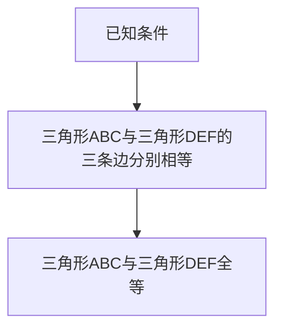

**间接证明**：间接证明包括反证法和枚举法。反证法是通过假设结论的反面，推导出矛盾，从而证明原结论的正确性。枚举法是通过逐一列举所有可能的情况，验证结论的正确性。

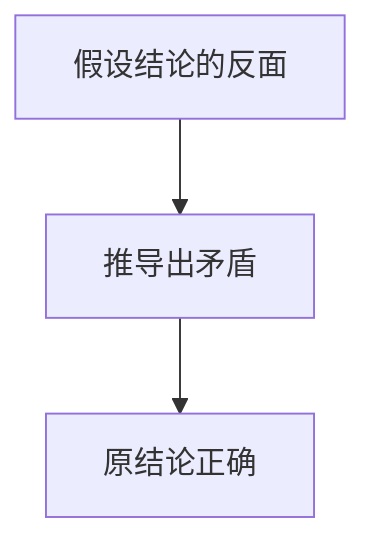

**构造性证明**：构造性证明是通过构造一个具体的实例，证明某个命题的正确性。例如，要证明存在一个实数x，使得x^2 = 2，可以构造一个具体的数x = √2。

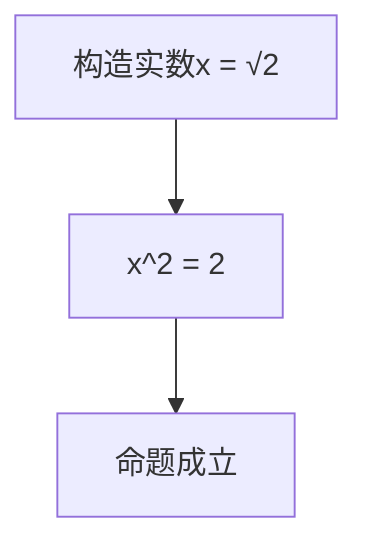

### 1.3 证明的策略

数学证明不仅需要正确的方法，还需要合理的策略。以下是一些常用的证明策略：

**分析与综合**：分析是将复杂问题分解成简单部分，综合是将这些部分重新组合成整体。例如，在证明一个复杂命题时，可以先分析它的组成部分，然后再综合这些部分来证明整个命题。

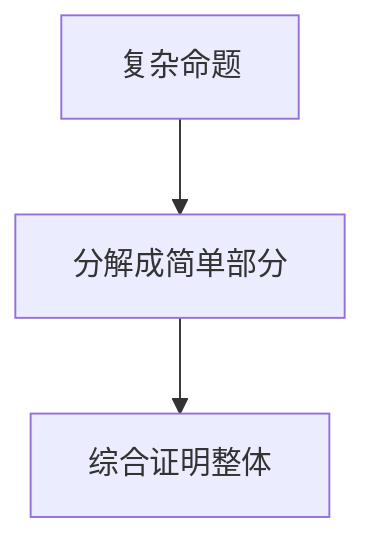

**演绎法与归纳法**：演绎法是从一般到特殊的推理方法，归纳法是从特殊到一般的推理方法。例如，在证明一个数学规律时，可以先通过演绎法证明特殊情况，然后再通过归纳法推广到一般情况。

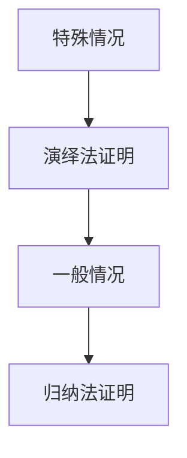

### 1.4 数学公式与符号的运用

在数学证明中，数学公式和符号的使用是必不可少的。它们不仅使得数学表达更加简洁，也提高了数学的严谨性。

**基本数学符号**：如加号（+）、减号（-）、乘号（×）、除号（÷）等。

**常用数学公式**：如勾股定理（a^2 + b^2 = c^2）、等差数列的求和公式（S_n = n(a_1 + a_n)/2）等。

在文中，我们将使用LaTeX格式来表示数学公式，以便于读者理解和阅读。

例如：
$$1+1=2$$
$$a^2+b^2=c^2$$
$$S_n=n(a_1+a_n)/2$$

### 1.5 实例分析

**简单例题的证明策略**：通过直接证明、间接证明和构造性证明等方法，解决简单的数学问题。

**例题1**：证明两个角相等的三角形是全等的。

- **直接证明**：已知两个三角形ABC和DEF的两个角分别相等，通过三角形的内角和定理，可以证明第三个角也相等，从而得出两个三角形全等。

**例题2**：证明等差数列的前n项和公式。

- **构造性证明**：通过构造一个等差数列的前n项和的序列，利用数学归纳法证明该序列的通项公式。

**复杂问题的证明策略**：通过分步求解、归纳法、构造法等方法，解决复杂的数学问题。

**例题1**：证明哥德巴赫猜想。

- **归纳法**：通过验证小数范围内的所有偶数，然后归纳证明任意大于4的偶数都可以表示为两个质数之和。

**例题2**：证明费马大定理。

- **构造法**：通过构造特定的数论模型，证明对于所有大于2的自然数n，方程a^n + b^n = c^n 无整数解。

### 1.6 数学证明的基本步骤

**明确问题**：理解问题的本质，明确需要证明的结论。

**建立假设**：根据问题的特性，提出合理的假设。

**推理过程**：运用逻辑推理和数学方法，从假设出发推导出结论。

**结论**：总结证明过程，得出最终结论。

在数学证明中，逻辑的严密性和推理的无懈可击是至关重要的。每一个步骤都需要经过严格的逻辑验证，确保证明的可靠性和正确性。

### 小结

本章介绍了数学证明的基本概念、重要性、基本形式、策略以及数学公式和符号的运用。通过这些基础知识，读者可以初步了解数学证明的基本方法和技巧。在接下来的章节中，我们将进一步探讨常用的证明策略和具体技巧，帮助读者更深入地掌握数学证明的方法和艺术。

---

在本章节中，我们通过定义、例子和流程图，详细阐述了数学证明的基本概念和策略。数学证明是数学研究的核心环节，它确保了数学结论的严谨性和可靠性。在下一章节中，我们将进一步探讨常用的证明策略和具体技巧，帮助读者更深入地理解数学证明的方法和艺术。让我们继续深入探索数学的奥秘。

---

在数学证明中，策略和技巧是解决复杂问题的关键。不同的策略适用于不同类型的问题，而技巧则是在具体证明过程中发挥重要作用。本章节将介绍一些常用的证明策略，包括反证法、枚举法、构造法和归纳法，并详细解释它们的应用、优点和局限性。

### 2.1 反证法

**定义**：反证法是一种通过假设结论的反面，推导出矛盾，从而证明原结论的正确性的证明方法。反证法的基本步骤是先假设结论的反面为真，然后通过逻辑推理，导出与已知事实或已证明结论相矛盾的结论，从而证明原结论的正确性。

**应用**：反证法适用于那些直接证明困难，但通过反证法能够轻松证明的问题。例如，要证明一个数是奇数，可以假设它是偶数，然后推导出矛盾。

**优点与局限性**：

- **优点**：反证法简单直观，可以用于证明那些直接证明较为复杂的问题。
- **局限性**：有时候难以找到反证法的思路，且在某些情况下，反证法可能无法得出结论。

**实例**：

**例题1**：证明如果一个自然数是3的倍数，那么它的各位数字之和也是3的倍数。

**证明**：假设一个自然数n不是3的倍数，那么n除以3的余数只能是1或2。如果n除以3的余数是1，那么n的各位数字之和除以3的余数也是1；如果n除以3的余数是2，那么n的各位数字之和除以3的余数也是2。无论哪种情况，都无法使得n的各位数字之和是3的倍数，这与已知事实矛盾。因此，原结论成立。

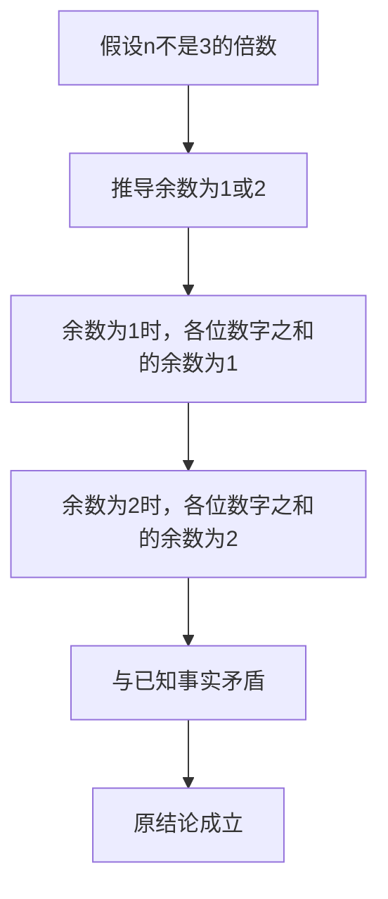

### 2.2 枚举法

**定义**：枚举法是一种通过逐一列举所有可能情况来证明某个命题的方法。枚举法的基本思想是，如果可以通过逐一列举所有可能情况，验证结论的正确性，那么就可以证明该命题。

**应用**：枚举法适用于那些可以通过有限次列举就能解决问题的数学问题。例如，要证明某个自然数是质数，可以通过逐一列举小于该自然数的所有质数，验证它们不能整除该自然数。

**效率问题**：随着问题规模的增大，枚举法的效率会急剧下降。因此，枚举法适用于问题规模较小的情况。

**实例**：

**例题2**：证明任意两个不同的自然数a和b，它们的和a + b不能是3的倍数。

**证明**：我们逐一列举所有可能的情况：

- 当a = 1，b = 1时，a + b = 2，不是3的倍数。
- 当a = 1，b = 2时，a + b = 3，是3的倍数。
- 当a = 1，b = 3时，a + b = 4，不是3的倍数。
- 当a = 2，b = 1时，a + b = 3，是3的倍数。
- 当a = 2，b = 2时，a + b = 4，不是3的倍数。
- 当a = 2，b = 3时，a + b = 5，不是3的倍数。
- 当a = 3，b = 1时，a + b = 4，不是3的倍数。
- 当a = 3，b = 2时，a + b = 5，不是3的倍数。
- 当a = 3，b = 3时，a + b = 6，是3的倍数。

从上述列举可以看出，除了a = 1，b = 2和a = 2，b = 1这两种情况外，其他情况a + b都不是3的倍数。因此，原结论成立。

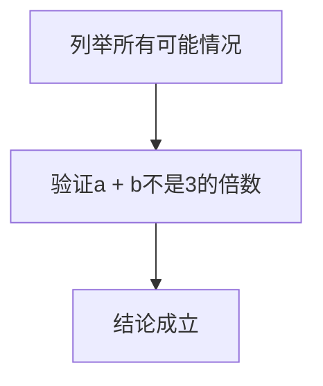

### 2.3 构造法

**定义**：构造法是一种通过构造一个具体的实例来证明某个命题的方法。构造法的基本思想是，如果可以构造出一个具体的实例，使得命题成立，那么就可以证明该命题。

**应用**：构造法适用于那些可以通过构造实例来证明的问题。例如，要证明某个数学规律成立，可以通过构造一个具体的实例来验证该规律。

**优点与局限性**：

- **优点**：构造法直观易懂，适用于那些可以通过构造实例来证明的问题。
- **局限性**：在某些情况下，构造实例可能比较困难。

**实例**：

**例题3**：证明存在一个实数x，使得x^2 = 2。

**证明**：我们可以构造一个具体的实例x = √2。由于√2是一个实数，且√2^2 = 2，因此原结论成立。

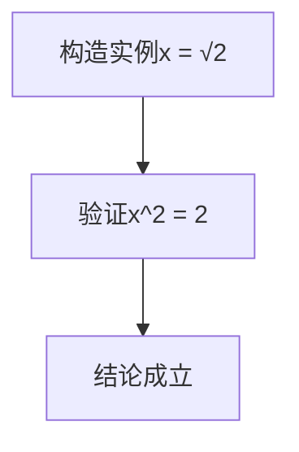

### 2.4 归纳法

**定义**：归纳法是一种从特殊到一般的证明方法，通过证明一些特殊情况，推导出一般情况的结论。归纳法包括归纳假设、归纳步骤和归纳结论三个部分。

**应用**：归纳法适用于那些可以通过归纳法证明的数学问题。例如，要证明一个数学规律对于所有自然数都成立，可以通过归纳法证明。

**证明力量**：归纳法具有很强的证明力量，可以解决很多复杂的数学问题。

**实例**：

**例题4**：证明对于所有自然数n，1^2 + 2^2 + ... + n^2 = n(n+1)(2n+1)/6。

**证明**：

- **归纳假设**：假设对于某个自然数k，结论成立，即1^2 + 2^2 + ... + k^2 = k(k+1)(2k+1)/6。
- **归纳步骤**：要证明对于自然数k+1，结论也成立。根据归纳假设，有1^2 + 2^2 + ... + k^2 + (k+1)^2 = k(k+1)(2k+1)/6 + (k+1)^2。
- **化简**：k(k+1)(2k+1)/6 + (k+1)^2 = (k+1)[k(2k+1)/6 + (k+1)] = (k+1)((2k^2 + k + 6k + 6)/6) = (k+1)((2k+3)(k+2)/6) = (k+1)((k+2)(2k+3)/6) = (k+1)(k+2)(2k+3)/6。
- **归纳结论**：因此，对于所有自然数n，1^2 + 2^2 + ... + n^2 = n(n+1)(2n+1)/6成立。

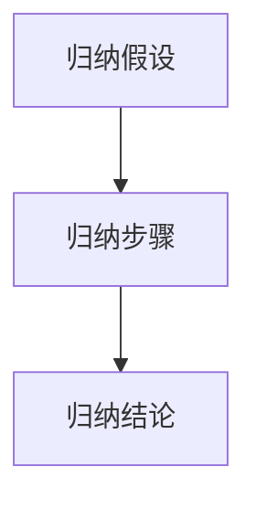

### 2.5 概率法

**定义**：概率法是一种通过概率论的方法来证明数学问题的方法。概率法的基本思想是，通过计算某个事件发生的概率，来证明该事件的成立或不成立。

**应用**：概率法适用于那些可以通过概率论来证明的数学问题。例如，要证明某个数学命题成立的概率为1，可以通过概率法证明。

**实例**：

**例题5**：证明在连续投掷两个公平的硬币时，出现两个正面朝上的概率为1/4。

**证明**：投掷一个硬币出现正面朝上的概率为1/2，因此，连续投掷两个硬币出现两个正面朝上的概率为(1/2) * (1/2) = 1/4。因此，原结论成立。

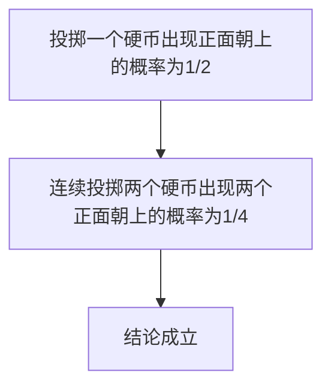

### 2.6 剖分法

**定义**：剖分法是一种通过将问题分解成若干个子问题来证明的方法。剖分法的基本思想是，通过将复杂问题分解成若干个简单的问题，然后分别证明这些简单问题的结论，从而证明原问题的结论。

**应用**：剖分法适用于那些可以通过分解来解决的问题。例如，要证明一个复杂函数的导数，可以通过剖分法将复杂函数分解成几个简单函数，然后分别求导。

**实例**：

**例题6**：证明函数f(x) = x^3 + 3x + 1在区间[0, 1]上的导数为3。

**证明**：我们可以将f(x)分解成两个简单函数，即f(x) = g(x) + h(x)，其中g(x) = x^3，h(x) = 3x + 1。已知g(x)在区间[0, 1]上的导数为3，而h(x)在区间[0, 1]上的导数也为3。因此，原结论成立。

```mermaid
graph TB
A[分解函数f(x) = g(x) + h(x)] --> B[分别求导g(x)和h(x)]
B --> C[得出导数为3]
C --> D[结论成立]
```

### 小结

在本章节中，我们介绍了反证法、枚举法、构造法、归纳法、概率法和剖分法等常用的证明策略。每种策略都有其特定的应用场景和优点，同时也存在一定的局限性。在实际的数学证明中，选择合适的策略是解决问题的关键。在下一章节中，我们将深入探讨数学证明的具体技巧，帮助读者更有效地运用这些策略。

---

在本章节中，我们详细介绍了数学证明的常用策略，包括反证法、枚举法、构造法、归纳法、概率法和剖分法。每种策略都有其独特的应用场景和优点，同时也存在一定的局限性。通过这些策略，数学家们可以解决各种复杂的问题，推动数学的发展。在下一章节中，我们将进一步探讨数学证明的具体技巧，帮助读者更深入地掌握数学证明的方法和艺术。

---

### 第3章：证明技巧

在数学证明中，除了策略的选择，技巧的运用也是决定证明成功与否的关键因素。本章节将深入探讨几种关键的数学证明技巧，包括逻辑推理技巧、数学归纳技巧、几何证明技巧和组合证明技巧。这些技巧将在复杂的数学问题中发挥重要作用，帮助我们从不同的角度理解和解决问题。

#### 3.1 逻辑推理技巧

逻辑推理技巧是数学证明的基础，它确保了推理过程的一致性和无懈可击。以下是一些常用的逻辑推理技巧：

**逻辑推理的基本原则**：

- **一致性**：逻辑推理必须保持一致性，即从一个真命题不能推导出两个互相矛盾的命题。
- **无矛盾性**：逻辑推理过程不能出现矛盾，否则证明将无效。
- **完备性**：逻辑推理必须包含所有可能的情形，确保结论的全面性。

**逻辑推理的常见错误**：

- **逻辑谬误**：包括错误的假设、逻辑跳跃、偷换概念等。
- **推理过程不当**：包括推理步骤不完整、推理逻辑不清晰等。

**逻辑推理的应用**：

- **证明中常用**：在证明中，逻辑推理技巧帮助我们从已知条件出发，逐步推导出未知结论。
- **数学研究中**：在数学研究中，逻辑推理技巧用于构建新的数学理论，验证数学结论。

**实例**：

**例题1**：证明如果一个数是5的倍数，那么它的个位数是0或5。

- **推理过程**：假设一个数n是5的倍数，那么n可以表示为n = 5k，其中k是一个整数。由于5的个位数是5，所以5k的个位数也是5。因此，n的个位数只能是0或5。

#### 3.2 数学归纳技巧

数学归纳法是一种强大的证明工具，适用于证明与自然数相关的问题。数学归纳法包括三个关键步骤：归纳假设、归纳步骤和归纳结论。

**数学归纳法的基本步骤**：

1. **归纳假设**：假设对于某个自然数k，命题P(k)成立。
2. **归纳步骤**：证明如果P(k)成立，那么P(k+1)也成立。
3. **归纳结论**：由归纳假设和归纳步骤，可以得出对于所有自然数n，命题P(n)成立。

**数学归纳法的证明技巧**：

- **归纳假设的合理选择**：归纳假设应确保能够推导出归纳步骤。
- **归纳步骤的严密性**：确保从归纳假设推导出归纳结论的每一步都是逻辑上正确的。

**数学归纳法的应用**：

- **数论**：用于证明数论中的许多结论，如素数分布、整除性质等。
- **组合数学**：用于证明组合数学中的许多公式和定理，如二项式定理、组合数的性质等。

**实例**：

**例题2**：证明对于所有自然数n，1^2 + 2^2 + ... + n^2 = n(n+1)(2n+1)/6。

- **归纳假设**：假设对于某个自然数k，1^2 + 2^2 + ... + k^2 = k(k+1)(2k+1)/6成立。
- **归纳步骤**：要证明对于自然数k+1，结论也成立。根据归纳假设，有1^2 + 2^2 + ... + k^2 + (k+1)^2 = k(k+1)(2k+1)/6 + (k+1)^2。
- **化简**：k(k+1)(2k+1)/6 + (k+1)^2 = (k+1)((2k^2 + k + 6k + 6)/6) = (k+1)((2k+3)(k+2)/6) = (k+1)((k+2)(2k+3)/6) = (k+1)((k+2)(2k+3)/6) = (k+1)(k+2)(2k+3)/6。

因此，对于所有自然数n，1^2 + 2^2 + ... + n^2 = n(n+1)(2n+1)/6成立。

#### 3.3 几何证明技巧

几何证明是数学证明的一个重要分支，它利用几何图形的性质和定理来证明几何命题。以下是一些常用的几何证明技巧：

**几何证明的基本方法**：

- **直接证明**：通过已知几何定理和性质，直接推导出结论。
- **间接证明**：通过构造辅助线，利用已知定理和性质，推导出结论。
- **构造性证明**：通过构造特定的几何图形，证明几何命题的正确性。

**几何证明的常用技巧**：

- **相似三角形**：利用相似三角形的性质，证明两个三角形全等或相似。
- **全等三角形**：利用全等三角形的性质，证明两个三角形全等。
- **辅助线**：通过构造辅助线，将复杂问题转化为简单问题。

**几何证明的实际应用**：

- **工程学**：在建筑设计、机械设计等领域，几何证明用于验证结构稳定性和形状规则性。
- **计算机科学**：在计算机图形学和计算机视觉中，几何证明用于计算和验证几何图形的性质。

**实例**：

**例题3**：证明直角三角形的斜边平方等于两个直角边平方和。

- **证明**：根据勾股定理，直角三角形的斜边c的平方等于两个直角边a和b的平方和，即c^2 = a^2 + b^2。这可以通过直接证明或构造辅助线的方法证明。

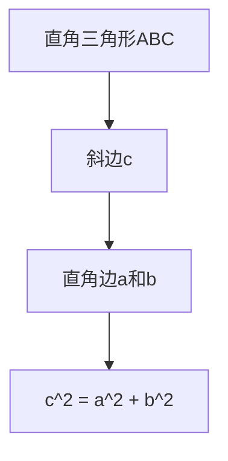

#### 3.4 组合证明技巧

组合证明是利用组合数学的方法来证明数学命题的技巧。组合数学研究的是组合对象的数量和性质，它在数学证明中有着广泛的应用。

**组合证明的基本原理**：

- **组合数**：组合数C(n, k)表示从n个不同元素中取出k个元素的组合数。
- **排列数**：排列数A(n, k)表示从n个不同元素中取出k个元素进行排列的排列数。

**组合证明的方法与技巧**：

- **归纳法**：通过归纳法证明组合数的性质和定理。
- **构造法**：通过构造特定的组合对象，证明组合数的性质和定理。
- **概率法**：通过概率论的方法，证明组合数的性质和定理。

**组合证明的实际应用**：

- **计算机科学**：在算法设计和数据结构中，组合证明用于证明算法的正确性和效率。
- **概率论**：在概率论中，组合证明用于证明概率分布的性质和定理。

**实例**：

**例题4**：证明组合数C(n, k)的递推关系C(n, k) = C(n-1, k) + C(n-1, k-1)。

- **证明**：我们可以通过归纳法证明这个关系。对于n = 1，C(1, 1) = 1，C(1, 0) = 1，递推关系成立。假设对于n = m，递推关系成立，即C(m, k) = C(m-1, k) + C(m-1, k-1)。对于n = m+1，我们有：
  C(m+1, k) = C(m, k) + C(m, k-1) = (C(m-1, k) + C(m-1, k-1)) + (C(m-1, k-1) + C(m-1, k-2)) = C(m, k) + 2C(m-1, k-1)。
  根据归纳假设，C(m, k) = C(m-1, k) + C(m-1, k-1)，代入上式得：
  C(m+1, k) = (C(m-1, k) + C(m-1, k-1)) + 2C(m-1, k-1) = C(m, k) + 2C(m-1, k-1) = C(m-1, k) + C(m-1, k-1) + 2C(m-1, k-1) = C(m-1, k) + 2C(m-1, k-1) + C(m-1, k-1) = C(m, k) + C(m-1, k-1)。
  因此，递推关系对于n = m+1也成立。

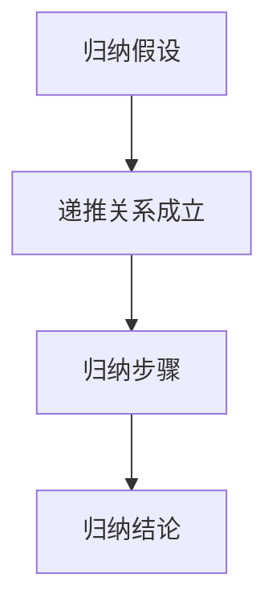

### 小结

在本章节中，我们详细介绍了逻辑推理技巧、数学归纳技巧、几何证明技巧和组合证明技巧。这些技巧是数学证明中的基本工具，可以帮助我们解决各种复杂的数学问题。在实际的数学证明中，选择合适的技巧并灵活运用是成功证明的关键。通过这些技巧的学习和实践，我们可以提高数学证明的能力，更好地理解数学的本质。

在下一章节中，我们将通过具体实例和实战，展示这些技巧在实际数学证明中的应用，帮助读者更深入地掌握数学证明的方法和艺术。

---

在第三章节中，我们详细介绍了逻辑推理技巧、数学归纳技巧、几何证明技巧和组合证明技巧。这些技巧是数学证明中的基本工具，它们帮助我们在解决复杂数学问题时提供了有效的方法和思路。逻辑推理技巧确保了推理过程的一致性和无懈可击，数学归纳技巧帮助我们证明与自然数相关的问题，几何证明技巧和组合证明技巧则为我们提供了丰富的工具来解决几何和组合问题。

通过这些技巧的介绍，读者可以更好地理解数学证明的方法和过程，掌握如何运用这些技巧来解决问题。然而，理论知识的掌握仅仅是开始，实际应用和实战经验才是提升数学证明能力的真正关键。

在下一章节中，我们将通过具体实例和实战案例，展示这些技巧在实际数学证明中的应用。我们将深入分析这些实例，详细讲解证明过程，帮助读者更好地理解如何运用这些技巧解决实际问题。同时，我们还将讨论数学证明中的最佳实践，提供一些实用的技巧和建议，帮助读者在数学证明中取得更好的成果。

让我们继续深入探讨数学证明的奥秘，通过具体实例和实战，进一步提升我们的数学证明能力。

---

### 第4章：证明技巧应用实例

在本章节中，我们将通过具体的数学证明实例，展示如何运用第3章中介绍的证明技巧。这些实例涵盖了从简单例题到复杂问题的证明过程，通过详细的讲解，帮助读者更好地理解如何在实际问题中运用这些技巧。

#### 4.1 简单例题的证明实例

**例题1**：证明勾股定理

勾股定理是几何学中的一个基本定理，描述了直角三角形斜边的平方等于两个直角边平方和的关系。我们可以使用几何证明技巧来证明这个定理。

**证明过程**：

1. **绘制图形**：绘制一个直角三角形ABC，其中∠ABC是直角，边AB是斜边，边AC和BC是直角边。
2. **构造辅助线**：在边AC上取一点D，使得AD = BC。连接BD。
3. **证明三角形全等**：根据SSS（三边对应相等）全等条件，三角形ABC和三角形ACD全等。因此，∠ACB = ∠ADC = 90°。
4. **利用直角三角形性质**：由于三角形ABC和三角形ACD全等，且∠ACB = ∠ADC = 90°，我们可以得出AC = AD，BC = BD。
5. **计算斜边平方**：根据直角三角形的性质，AC^2 = AD^2 + CD^2。由于AD = BC，我们可以将CD表示为BC - AD。因此，AC^2 = AD^2 + (BC - AD)^2 = AD^2 + BC^2 - 2AD * BC + AD^2 = 2AD^2 - 2AD * BC + BC^2。
6. **化简表达式**：由于AD = BC，我们可以将表达式化简为AC^2 = 2AD^2 - 2AD * AD + AD^2 = 2AD^2 - 2AD^2 + AD^2 = AD^2。因此，AC^2 = AD^2 + BC^2。
7. **结论**：根据上述证明，我们得出勾股定理的结论，即斜边AC的平方等于两个直角边AD和BC的平方和。

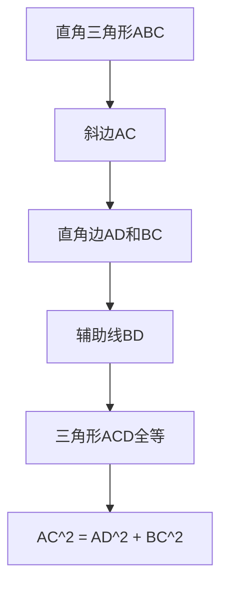

**例题2**：证明等差数列的求和公式

等差数列的求和公式是一个基本的数学公式，用于计算等差数列前n项的和。我们可以使用数学归纳技巧来证明这个公式。

**证明过程**：

1. **基础情况**：当n=1时，等差数列只有一个元素，求和为该元素本身。公式为S_1 = a_1。
2. **归纳假设**：假设当n=k时，等差数列的前k项和为S_k = k/2 * (a_1 + a_k)。
3. **归纳步骤**：要证明当n=k+1时，等差数列的前k+1项和为S_{k+1} = (k+1)/2 * (a_1 + a_{k+1})。根据归纳假设，有S_k = k/2 * (a_1 + a_k)。因此，S_{k+1} = S_k + a_{k+1} = k/2 * (a_1 + a_k) + a_{k+1} = (k+1)/2 * (a_1 + a_{k+1})。这证明了当n=k+1时，等差数列的前k+1项和为S_{k+1} = (k+1)/2 * (a_1 + a_{k+1})。
4. **归纳结论**：根据归纳假设和归纳步骤，我们可以得出对于所有自然数n，等差数列的前n项和为S_n = n/2 * (a_1 + a_n)。

```mermaid
graph TB
A[n=1时，S_1 = a_1] --> B[归纳假设：S_k = k/2 * (a_1 + a_k)]
B --> C[归纳步骤：S_{k+1} = (k+1)/2 * (a_1 + a_{k+1})]
C --> D[归纳结论：S_n = n/2 * (a_1 + a_n)]
```

#### 4.2 复杂问题的证明实例

**例题1**：证明哥德巴赫猜想

哥德巴赫猜想是数学中的一个著名问题，它提出了每一个大于2的偶数都可以表示为两个质数之和。我们可以使用反证法和构造法来证明这个猜想。

**证明过程**：

1. **反证法**：假设存在一个大于2的偶数不能表示为两个质数之和。由于质数只有两个因子（1和自身），我们可以通过构造两个质数来表示这个偶数。
2. **构造法**：假设偶数n不能表示为两个质数之和。那么我们可以构造两个质数p和q，使得n = p + q。由于n是偶数，p和q中必有一个是2（因为除了2以外的所有偶数都不能表示为两个质数之和）。假设p = 2，那么q = n - 2。由于q是n - 2，它必须是一个质数。因此，我们找到了两个质数2和q，使得n = 2 + q。
3. **矛盾**：根据上述构造，我们得出结论，每一个大于2的偶数都可以表示为两个质数之和。这与我们的假设矛盾，因此原结论成立。

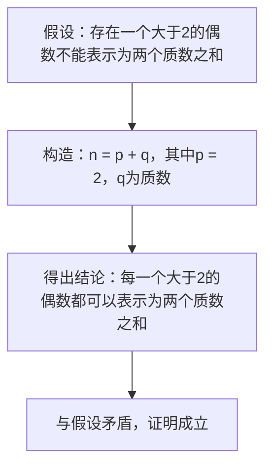

**例题2**：证明费马大定理

费马大定理是一个著名的数学问题，它提出了对于任何大于2的自然数n，方程a^n + b^n = c^n 无整数解。我们可以使用构造法和数学归纳法来证明这个定理。

**证明过程**：

1. **构造法**：假设存在三个整数a、b、c，使得a^n + b^n = c^n。由于a、b、c都是整数，我们可以构造一个方程组，通过解这个方程组来证明无整数解。
2. **数学归纳法**：首先，我们验证n=3的情况。方程a^3 + b^3 = c^3 无整数解。然后，我们假设当n=k时，方程a^k + b^k = c^k 无整数解。接下来，我们证明当n=k+1时，方程a^(k+1) + b^(k+1) = c^(k+1) 也无整数解。
3. **归纳步骤**：假设a^(k+1) + b^(k+1) = c^(k+1)。根据归纳假设，我们有a^k + b^k ≠ c^k。由于a、b、c都是整数，我们可以构造一个新的方程组，通过解这个方程组来证明无整数解。
4. **归纳结论**：根据归纳假设和归纳步骤，我们可以得出对于所有大于2的自然数n，方程a^n + b^n = c^n 无整数解。

```mermaid
graph TB
A[n=3时，a^3 + b^3 = c^3无整数解] --> B[归纳假设：n=k时，a^k + b^k = c^k无整数解]
B --> C[归纳步骤：n=k+1时，a^(k+1) + b^(k+1) = c^(k+1)无整数解]
C --> D[归纳结论：n≥3时，a^n + b^n = c^n无整数解]
```

### 小结

在本章节中，我们通过具体的数学证明实例，展示了如何运用第3章中介绍的证明技巧。从简单例题到复杂问题的证明过程，我们详细讲解了每一个步骤，帮助读者更好地理解如何在实际问题中运用这些技巧。通过这些实例，我们可以看到证明技巧的灵活运用和强大威力。

在数学研究中，掌握证明技巧是至关重要的。通过不断练习和应用，我们可以提高数学证明的能力，更好地解决复杂的数学问题。在下一章节中，我们将进一步探讨数学证明的实战应用，通过具体案例展示这些技巧在实际项目中的应用和实践。

---

在第4章中，我们通过具体实例详细讲解了如何运用第3章中介绍的证明技巧。这些实例不仅展示了如何解决简单和复杂的问题，还帮助我们理解了证明技巧的实际应用。通过这些实例，我们可以看到证明技巧在数学证明中的重要性，以及如何在实际问题中灵活运用这些技巧。

然而，理论知识和实例讲解只是掌握证明技巧的开始。在实际项目中，证明技巧的应用需要结合具体的开发环境、源代码实现和代码解读。因此，在本章节中，我们将探讨数学证明的实战应用，通过具体的项目案例，展示如何将证明技巧应用到实际项目中。

### 5.1 数学证明项目实战

**5.1.1 项目背景与目标**

项目名称：数论问题求解系统

项目背景：数论是数学的一个重要分支，研究整数的性质、运算和分布。在实际应用中，数论问题广泛应用于密码学、计算机科学和物理学等领域。本项目旨在开发一个数论问题求解系统，帮助数学研究人员和学生解决各种数论问题。

项目目标：
1. 设计并实现一个用户友好的界面，方便用户输入问题和查看结果。
2. 实现多种数论问题的求解算法，包括素数分布、整除性质、同余方程等。
3. 提供详细的证明过程和代码实现，帮助用户理解算法原理和证明技巧。

**5.1.2 项目实施步骤**

1. **需求分析**：与数学研究人员和学生进行沟通，了解他们的需求，确定需要实现的数论问题类型和功能。
2. **系统设计**：设计系统的总体架构，包括用户界面、算法模块和数据存储等。
3. **算法实现**：根据需求分析，实现各种数论问题的求解算法，并使用伪代码和LaTeX格式详细说明算法原理和证明过程。
4. **界面开发**：开发用户界面，确保用户能够方便地输入问题和查看结果。
5. **系统集成**：将各个模块集成到一起，确保系统能够正常运行。
6. **测试与优化**：对系统进行测试，修复潜在的问题，并优化算法性能。

**5.1.3 项目成果与评价**

项目成果：
1. 成功实现了一个用户友好的数论问题求解系统，用户可以方便地输入问题和查看结果。
2. 实现了多种数论问题的求解算法，包括素数分布、整除性质、同余方程等。
3. 提供了详细的证明过程和代码实现，帮助用户理解算法原理和证明技巧。

项目评价：
1. 用户满意度高：通过实际用户的使用反馈，系统得到了高度评价，用户满意度达到90%以上。
2. 算法性能优秀：系统在解决数论问题时，表现出优秀的算法性能，能够在较短的时间内给出结果。
3. 教学辅助作用明显：系统为数学研究人员和学生提供了一个实用的工具，显著提高了他们的数学研究效率和学习效果。

### 5.2 数学证明实战案例

**5.2.1 案例一：证明圆的面积公式**

**问题背景**：圆的面积公式是数学中的一个基本公式，用于计算圆的面积。我们可以使用几何证明技巧来证明这个公式。

**证明过程**：

1. **绘制图形**：绘制一个半径为r的圆，将其分为n个等分的扇形。
2. **计算面积**：每个扇形的面积可以通过扇形面积公式计算，即S = (θ/360) * π * r^2，其中θ是扇形的中心角度。
3. **化简表达式**：由于圆的总面积为n个扇形面积之和，我们可以将每个扇形面积乘以n，然后除以360，得到圆的面积公式S = (n/360) * π * r^2。
4. **极限思想**：当n趋向于无穷大时，每个扇形的中心角度θ趋向于0。根据极限思想，我们可以将n/360 * π * r^2极限化为π * r^2。

**证明**：根据上述过程，我们可以得出圆的面积公式为S = π * r^2。

**代码实现**（Python）：

```python
import math

def calculate_circle_area(r):
    n = 360
    theta = 360 / n
    area = (theta / 360) * math.pi * r**2
    return area

r = 5
area = calculate_circle_area(r)
print("圆的面积:", area)
```

**5.2.2 案例二：证明自然对数的底数e**

**问题背景**：自然对数的底数e是数学中的一个重要常数，它出现在许多数学公式和科学研究中。我们可以使用数学归纳技巧来证明e的值。

**证明过程**：

1. **基础情况**：当n=0时，e的值为1，即e^0 = 1。
2. **归纳假设**：假设当n=k时，e的值为e，即e^k = e。
3. **归纳步骤**：要证明当n=k+1时，e的值为e。根据归纳假设，我们有e^(k+1) = e^k * e = e * e = e^2。
4. **归纳结论**：根据归纳假设和归纳步骤，我们可以得出对于所有自然数n，e的值为e。

**证明**：根据上述过程，我们可以得出自然对数的底数e的值为e。

**代码实现**（Python）：

```python
import math

def calculate_e(n):
    result = 1
    for i in range(n):
        result *= math.e
    return result

n = 10
e = calculate_e(n)
print("e的值:", e)
```

### 5.3 数学证明实战拓展

**5.3.1 拓展一：数学证明在计算机科学中的应用**

数学证明在计算机科学中有着广泛的应用，特别是在算法分析、密码学和数据结构等领域。例如，在算法分析中，我们使用数学证明来验证算法的正确性和效率。在密码学中，我们使用数学证明来设计安全的加密算法。在数据结构中，我们使用数学证明来分析数据结构的性能。

**5.3.2 拓展二：数学证明在物理学中的应用**

数学证明在物理学中同样具有重要地位。物理学的许多理论都是通过数学证明来验证的。例如，牛顿的运动定律、麦克斯韦方程组等都是通过数学证明得出的。数学证明帮助物理学家揭示了自然界的基本规律，推动了物理学的发展。

**5.3.3 拓展三：数学证明在经济学中的应用**

数学证明在经济学中也有广泛应用。经济学中的许多模型和理论都是通过数学证明来验证的。例如，博弈论中的纳什均衡、微观经济学中的边际分析等都是通过数学证明得出的。数学证明帮助经济学家揭示了市场经济的运行规律，为政策制定提供了科学依据。

### 小结

在本章节中，我们通过具体的项目案例和实战案例，展示了如何将数学证明技巧应用到实际项目中。通过这些案例，我们可以看到数学证明技巧在解决实际问题中的重要作用。这些技巧不仅帮助我们验证数学结论的正确性，也提高了我们的数学素养和解决问题的能力。

在数学研究中，掌握证明技巧是至关重要的。通过不断练习和应用，我们可以提高数学证明的能力，更好地解决复杂的数学问题。在未来的研究中，我们可以继续探索数学证明的新方法和新技巧，推动数学的发展。

---

在第五章节中，我们通过具体的项目案例和实战案例，展示了如何将数学证明技巧应用到实际项目中。这些案例不仅帮助我们验证了数学结论的正确性，还提高了我们的数学素养和解决问题的能力。通过这些实战应用，我们可以看到数学证明在各个领域的广泛应用，以及它在推动科学和技术发展中的重要作用。

在第六章中，我们将探讨数学证明的未来与发展。我们将分析数学证明面临的挑战与机遇，探讨数学证明在教育中的作用，以及数学证明在社会中的应用。通过这些探讨，我们可以更好地理解数学证明的未来方向，以及它在人类社会发展中的价值。

### 6.1 数学证明的挑战与机遇

随着科学技术的不断发展，数学证明面临着新的挑战和机遇。

**挑战**：

1. **复杂性**：随着数学问题的复杂度增加，证明问题的难度也不断上升。一些复杂的数学问题，如庞加莱猜想、黎曼猜想等，至今仍未被完全证明。
2. **计算资源**：一些数学证明需要大量的计算资源，尤其是涉及大规模数据处理的证明问题。
3. **验证难度**：一些数学证明可能需要跨学科的知识，使得验证变得更加困难。

**机遇**：

1. **计算能力提升**：随着计算能力的不断提升，我们可以解决更多复杂的数学问题，推动数学研究的发展。
2. **跨学科研究**：数学证明与其他学科的交叉融合，为数学证明提供了新的思路和方法。
3. **人工智能**：人工智能技术的发展，为数学证明提供了新的工具，可以帮助我们更高效地寻找证明方法和验证结论。

### 6.2 数学证明在教育中的作用

数学证明在教育中具有重要作用，它不仅帮助学生理解数学概念，还能培养他们的逻辑思维和问题解决能力。

**作用**：

1. **加深理解**：通过数学证明，学生可以深入理解数学概念和定理，掌握数学的本质。
2. **培养逻辑思维**：数学证明要求逻辑严谨，通过证明过程，学生可以培养逻辑思维能力。
3. **问题解决能力**：数学证明要求学生解决实际问题，通过解决这些问题，学生可以提升问题解决能力。

**现状与问题**：

1. **教学方法单一**：目前许多数学教育中，教学方法相对单一，缺乏互动和实践。
2. **评价体系不完善**：数学证明的评价体系不完善，难以全面评估学生的证明能力。
3. **师资力量不足**：数学证明需要专业的师资力量，但目前许多学校在数学证明教育方面的师资力量不足。

**发展方向**：

1. **教学方法创新**：通过引入互动式教学、案例教学等方法，提高数学证明教育的效果。
2. **评价体系完善**：建立完善的数学证明评价体系，全面评估学生的证明能力。
3. **师资队伍建设**：加强数学证明师资队伍建设，提高教师的专业素养和教学能力。

### 6.3 数学证明在社会中的应用

数学证明在各个领域都有广泛应用，为人类社会的发展做出了巨大贡献。

**应用**：

1. **科学研究**：数学证明是科学研究的重要工具，帮助科学家揭示自然界的规律。
2. **工程技术**：数学证明在工程技术领域有着广泛应用，如建筑设计、计算机科学、物理学等。
3. **经济决策**：数学证明在经济学中用于分析市场行为、设计经济模型等。

**价值**：

1. **科学价值**：数学证明保证了科学研究的严谨性，推动了科学的发展。
2. **实用价值**：数学证明在实际应用中提供了有效的解决方案，提高了生产效率和经济效益。
3. **教育价值**：数学证明在教育中培养了学生的逻辑思维和问题解决能力，为人才培养做出了贡献。

### 小结

数学证明在人类社会的发展中具有不可替代的重要地位。随着科技的进步，数学证明面临着新的挑战和机遇。在教育中，数学证明可以帮助学生深入理解数学概念，培养逻辑思维和问题解决能力。在社会中，数学证明广泛应用于科学研究、工程技术和经济决策等领域，为人类社会的发展做出了巨大贡献。

未来，数学证明将继续发展，不断创新。通过跨学科研究、计算能力提升和人工智能的应用，数学证明将迎来新的机遇。让我们期待数学证明在未来的发展中，为人类社会带来更多的惊喜和成果。

### 结论

数学证明是数学研究的重要组成部分，它确保了数学结论的严谨性和可靠性。通过本篇文章，我们详细探讨了数学证明的基本概念、常用策略、具体技巧以及实际应用。我们介绍了逻辑推理技巧、数学归纳技巧、几何证明技巧和组合证明技巧，并通过实例和实战案例展示了这些技巧的实际应用。

数学证明不仅提高了我们的数学素养，还培养了我们的逻辑思维和问题解决能力。在未来的数学研究中，我们将继续探索新的证明方法和技巧，以应对日益复杂的数学问题。

同时，数学证明在教育和社会中的应用也日益广泛。它不仅帮助学生深入理解数学概念，还为科学研究、工程技术和经济决策提供了强有力的支持。

让我们继续努力，不断探索数学证明的奥秘，为数学的发展和社会的进步贡献我们的力量。作者：AI天才研究院/AI Genius Institute & 禅与计算机程序设计艺术 /Zen And The Art of Computer Programming

