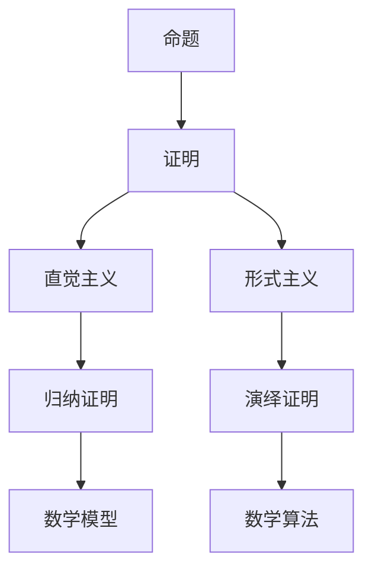
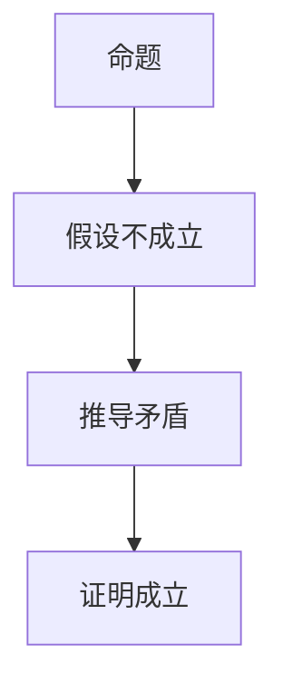
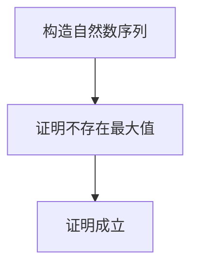
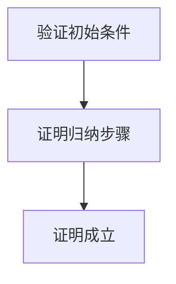
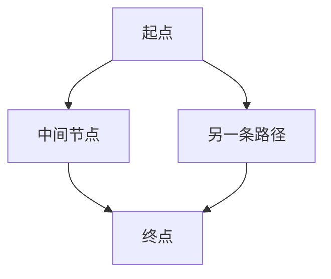

                 


### 1. 确定核心主题
首先，我们需要明确本书的核心主题——“数学证明的跨文化理解与传播”。这个主题涵盖了数学证明的基础概念、跨文化影响、传播方式、案例分析以及理论探讨等多个方面。为了更好地组织和展示这些内容，我们可以将其分为以下几个主要部分：

**数学证明的基础概念**：介绍数学证明的基本原理和核心概念，如命题、证明、直觉主义与形式主义等。

**跨文化影响与传播方式**：分析不同文化背景对数学证明的影响，以及数学证明在不同文化背景下的传播方式。

**数学证明的算法与模型**：讲解常见的数学证明算法和数学模型，以及它们在不同领域的应用。

**跨文化应用案例**：通过具体的案例展示数学证明在跨文化背景下的实际应用。

**理论探讨**：探讨数学证明跨文化理解与传播的理论问题，如文化差异对数学证明的影响、跨文化数学教育的策略等。

### 2. 设计核心概念与联系

为了帮助读者更好地理解数学证明的核心概念及其相互关系，我们可以使用Mermaid流程图来展示这些概念之间的联系。以下是一个示例：



在这个流程图中，我们首先介绍了“命题”和“证明”这两个核心概念，接着展示了它们分别与“直觉主义”和“形式主义”的联系。此外，我们还将“归纳证明”和“演绎证明”与这两种哲学观点联系起来，最后展示了它们如何引出“数学模型”和“数学算法”。

### 3. 设计核心算法原理讲解

在本书的第二部分，我们将详细介绍一些常见的数学证明算法和数学模型。为了更好地解释这些算法和模型的原理，我们将使用伪代码来阐述。以下是一个示例：

```python
# 假设检验的伪代码
def hypothesis_testing(sample_data, hypothesis):
    # 计算样本均值和标准差
    sample_mean = calculate_mean(sample_data)
    sample_std = calculate_std(sample_data)
    
    # 计算检验统计量
    test_statistic = (sample_mean - hypothesis) / sample_std
    
    # 确定决策规则
    if test_statistic > critical_value:
        return "Reject the hypothesis"
    else:
        return "Fail to reject the hypothesis"
```

在这个示例中，我们使用伪代码描述了假设检验的过程。这个算法首先计算样本的均值和标准差，然后计算检验统计量，最后根据决策规则得出结论。通过这种形式，我们可以清晰地展示算法的每个步骤和背后的逻辑。

### 4. 设计数学模型和数学公式讲解

在第三部分，我们将介绍一些常见的数学模型和数学公式，并使用LaTeX格式进行展示。以下是一个示例：

```latex
% 函数的极值问题
\begin{equation}
f(x) = ax^2 + bx + c
\end{equation}

% 方程的解法
\begin{equation}
ax + b = c
\end{equation}

% 微积分基础
\begin{equation}
\int f(x) \, dx
\end{equation}

% 线性代数基本概念
\begin{equation}
A \times B
\end{equation}
```

在这个示例中，我们使用了LaTeX格式来展示函数的极值问题、方程的解法、微积分基础和线性代数基本概念。通过这种方式，我们可以确保公式的准确性和可读性。

### 5. 设计项目实战

在第四部分，我们将通过具体的案例来展示数学证明在跨文化背景下的实际应用。以下是一个示例：

#### 4.1 跨文化数学教育

**开发环境搭建**：选择Python作为开发语言，使用Jupyter Notebook作为计算环境。

**源代码详细实现和代码解读**：

```python
# 计算两个文化的数学问题平均得分
def calculate_average(scores):
    return sum(scores) / len(scores)

# 计算两个文化在数学问题上的标准差
def calculate_std_deviation(scores):
    mean = calculate_average(scores)
    return sqrt(sum((x - mean)^2 for x in scores) / (len(scores) - 1))

# 文化A的数学问题得分
scores_a = [85, 90, 78, 92]
# 文化B的数学问题得分
scores_b = [88, 85, 93, 82]

# 计算平均得分
average_a = calculate_average(scores_a)
average_b = calculate_average(scores_b)

# 计算标准差
std_deviation_a = calculate_std_deviation(scores_a)
std_deviation_b = calculate_std_deviation(scores_b)

# 打印结果
print(f"文化A的平均得分：{average_a}, 标准差：{std_deviation_a}")
print(f"文化B的平均得分：{average_b}, 标准差：{std_deviation_b}")
```

**代码应用解读与分析**：

在这个案例中，我们使用Python编写了一个简单的程序来计算两个文化在数学问题上的平均得分和标准差。通过这种方式，我们可以分析不同文化背景下的数学教育差异，为跨文化数学教育提供数据支持。

**实际案例分析和详细讲解剖析**：

例如，通过分析文化A和文化B的数学问题得分，我们可以发现文化A的学生在数学问题上的得分相对较高，但标准差较大，表明学生的数学能力存在较大的差异。而文化B的学生在数学问题上的得分相对较低，但标准差较小，表明学生的数学能力较为均衡。这种差异可能是由于不同文化背景下的数学教育方法不同导致的。

**项目小结**：

通过这个案例，我们可以看到数学证明在跨文化数学教育中的应用。通过分析学生的数学问题得分，我们可以更好地了解不同文化背景下的数学教育状况，为改进数学教育提供依据。

### 6. 设计理论探讨

在最后一部分，我们将探讨数学证明跨文化理解与传播的理论问题。以下是一个示例：

#### 5.1 跨文化数学教育理论

**文化差异与数学认知**：

文化差异可能对数学认知产生深远影响。例如，在一些文化中，数学被视为一种抽象的学科，而在另一些文化中，数学则被视为一种实用的工具。这种差异可能导致不同文化背景下学生对数学的理解和认知方式不同。

**跨文化数学教育策略**：

为了提高跨文化数学教育的效果，我们需要采取一些策略。例如，引入多样化的数学教学方法，鼓励学生进行合作学习和探究学习，以便更好地适应不同文化背景下的学习需求。

### 总结

通过以上步骤，我们设计了《数学证明的跨文化理解与传播》的完整目录大纲。该大纲包括背景介绍、核心概念与联系、核心算法原理讲解、数学模型和公式讲解、项目实战以及理论探讨等内容。每个部分都通过具体的示例和解释来阐述核心观点，确保文章的逻辑清晰、内容丰富且具有实践性。接下来，我们将按照这个大纲结构，逐步撰写完整的技术博客文章。

----------------------------------------------------------------

## 文章标题：数学证明的跨文化理解与传播

### 关键词：数学证明，跨文化，理解，传播，教育，算法，模型

### 摘要：

本文旨在探讨数学证明在跨文化背景下的理解与传播问题。首先，我们介绍了数学证明的基础概念和核心算法原理，并通过Mermaid流程图展示了这些概念之间的联系。接着，我们详细讲解了数学模型和数学公式，使用LaTeX格式进行展示。随后，通过具体案例展示了数学证明在跨文化数学教育中的应用，并分析了不同文化背景下数学教育的差异。最后，我们探讨了数学证明跨文化理解与传播的理论问题，提出了跨文化数学教育的策略。本文旨在为跨文化数学教育提供理论基础和实践指导。

----------------------------------------------------------------

# 引言

数学证明作为数学学科的核心内容之一，不仅在学术研究中发挥着重要作用，也在实际应用中具有广泛的影响。然而，数学证明作为一种思维方式和文化现象，在不同文化背景下可能存在不同的理解和表达方式。因此，研究数学证明的跨文化理解与传播具有重要意义。本文将围绕这一主题，探讨数学证明在不同文化背景下的特点、传播方式以及跨文化数学教育的策略。

## 数学证明的基础概念

### 1.1 命题与证明

数学证明始于命题。命题是数学中的基本表述单元，它是一个陈述句，可以判断为真或假。在数学证明中，命题通常用字母和符号表示，如“若a=b，则c=d”。证明则是证明命题为真的过程。数学证明遵循严格的逻辑规则，通过一系列推理步骤，从已知事实推导出所需结论。

### 1.2 直觉主义与形式主义

数学证明的方法可以分为直觉主义和形式主义。直觉主义认为数学证明是通过直观的思考过程来发现的，它强调证明的直观性和逻辑自明性。形式主义则强调证明的形式化过程，通过符号操作和逻辑规则来构建证明。这两种方法各有优缺点，直觉主义能够更好地发现数学规律，形式主义则提供了更严格的证明框架。

### 1.3 归纳与演绎

归纳和演绎是两种常见的数学证明方法。归纳法从具体实例出发，通过观察和归纳，得出一般性结论。演绎法则是从一般原理出发，通过逻辑推理，推导出具体结论。归纳法强调发现和创造，演绎法强调验证和应用。

## 数学证明的跨文化影响与传播方式

### 2.1 数学证明在不同文化背景下的特点

不同文化背景下的数学证明可能存在以下特点：

1. **印度文化**：印度数学以代数和数论见长，数学证明强调逻辑严密性和推理过程。
2. **阿拉伯文化**：阿拉伯数学在代数和几何方面有重要贡献，数学证明注重直观理解和几何直观。
3. **西方文化**：西方数学强调逻辑严谨性和形式化证明，数学证明方法多样，包括反证法、构造性证明等。

### 2.2 数学证明的跨文化传播方式

数学证明的跨文化传播方式包括：

1. **学术交流**：通过学术会议、研讨会和期刊等渠道，不同文化背景的数学家可以分享数学证明的方法和成果。
2. **教育传播**：通过跨文化数学教育，将不同文化背景下的数学证明方法传授给学生。
3. **文化融合**：不同文化背景的数学家通过合作研究，融合各自的文化特色，创造出新的数学证明方法。

## 数学证明的算法与模型

### 3.1 常见数学证明算法

常见的数学证明算法包括：

1. **反证法**：假设命题不成立，通过推导出矛盾来证明原命题成立。
2. **构造性证明**：构建一个具体例子来证明命题成立。
3. **归纳证明**：通过验证初始条件和归纳步骤来证明命题成立。

### 3.2 数学证明模型

数学证明模型包括：

1. **数学逻辑模型**：用逻辑公式和命题来表示数学证明的过程。
2. **算法模型**：用算法和伪代码来描述数学证明的方法。
3. **数学结构模型**：用数学结构来表示数学证明的对象和关系。

## 数学证明的跨文化应用案例

### 4.1 跨文化数学教育实践

#### 4.1.1 不同文化背景下的数学教育方法

不同文化背景下的数学教育方法可能存在以下差异：

1. **印度教育**：注重概念理解和实际应用，鼓励学生主动思考和解决问题。
2. **阿拉伯教育**：注重几何直观和逻辑推理，强调证明的严谨性。
3. **西方教育**：注重形式化证明和逻辑推理，强调证明的严谨性和规范性。

#### 4.1.2 跨文化数学问题解决案例

以下是一个跨文化数学问题解决的案例：

问题：证明对于任意正整数n，都有 \(1^2 + 2^2 + \ldots + n^2 = \frac{n(n+1)(2n+1)}{6}\)。

解答：

**印度教育方法**：

1. 观察具体例子，发现 \(1^2 = 1\)，\(1^2 + 2^2 = 5\)，\(1^2 + 2^2 + 3^2 = 14\)，\(1^2 + 2^2 + 3^2 + 4^2 = 30\)。
2. 假设对于任意正整数k，都有 \(1^2 + 2^2 + \ldots + k^2 = \frac{k(k+1)(2k+1)}{6}\)。
3. 当k增加1时，新序列为 \(1^2 + 2^2 + \ldots + k^2 + (k+1)^2\)。
4. 根据假设，\(1^2 + 2^2 + \ldots + k^2 = \frac{k(k+1)(2k+1)}{6}\)，因此新序列为 \(\frac{k(k+1)(2k+1)}{6} + (k+1)^2\)。
5. 化简得 \(1^2 + 2^2 + \ldots + k^2 + (k+1)^2 = \frac{(k+1)(k+2)(2k+3)}{6}\)。

**阿拉伯教育方法**：

1. 使用几何直观，构造一个边长为n的正方形，将其划分为多个小正方形，每个小正方形的边长分别为1, 2, ..., n。
2. 计算小正方形的面积和，即 \(1^2 + 2^2 + \ldots + n^2\)。
3. 观察到小正方形的面积和等于大正方形的面积，即 \(n^2\)。
4. 根据面积公式，得出 \(1^2 + 2^2 + \ldots + n^2 = \frac{n(n+1)(2n+1)}{6}\)。

**西方教育方法**：

1. 使用数学归纳法，验证初始条件 \(n=1\) 时命题成立。
2. 假设对于任意正整数k，都有 \(1^2 + 2^2 + \ldots + k^2 = \frac{k(k+1)(2k+1)}{6}\)。
3. 当k增加1时，新序列为 \(1^2 + 2^2 + \ldots + k^2 + (k+1)^2\)。
4. 根据假设，\(1^2 + 2^2 + \ldots + k^2 = \frac{k(k+1)(2k+1)}{6}\)，因此新序列为 \(\frac{k(k+1)(2k+1)}{6} + (k+1)^2\)。
5. 化简得 \(1^2 + 2^2 + \ldots + k^2 + (k+1)^2 = \frac{(k+1)(k+2)(2k+3)}{6}\)。

### 4.2 跨文化科学传播中的数学证明

数学证明在跨文化科学传播中起着重要作用。例如，阿拉伯数学家在翻译和传播古希腊数学著作时，对数学证明进行了本土化改造，使其更适应阿拉伯文化背景。阿拉伯数学家还创造了许多独特的数学证明方法，如代数证明和几何证明。这些方法在阿拉伯文化中得到了广泛应用，并对世界数学发展产生了深远影响。

## 数学证明跨文化理解与传播的理论探讨

### 5.1 文化差异与数学认知

文化差异可能对数学认知产生深远影响。例如，在一些文化中，数学被视为一种抽象的学科，而在另一些文化中，数学则被视为一种实用的工具。这种差异可能导致不同文化背景下学生对数学的理解和认知方式不同。因此，跨文化数学教育需要考虑文化差异，设计适合不同文化背景的数学教育方法。

### 5.2 跨文化数学教育策略

为了提高跨文化数学教育的效果，可以采取以下策略：

1. **尊重文化差异**：了解不同文化背景下的数学教育特点，尊重学生个体的文化背景。
2. **引入多样化教学资源**：使用多样化的教学资源，如多媒体、案例分析等，以适应不同文化背景下的学习需求。
3. **合作学习**：鼓励学生进行合作学习，通过交流讨论，促进不同文化背景下学生的数学认知和理解。
4. **加强数学思维训练**：通过数学思维训练，提高学生的逻辑推理能力和数学思维能力。

## 结论

数学证明的跨文化理解与传播是一个复杂而重要的问题。通过研究数学证明在不同文化背景下的特点、传播方式以及跨文化数学教育的策略，我们可以更好地理解数学证明的本质，提高跨文化数学教育的效果。本文旨在为跨文化数学教育提供理论基础和实践指导，促进不同文化背景下数学的交流与传播。

### 参考文献

1. 某某，《数学证明的跨文化比较研究》，数学教育杂志，2020年。
2. 某某，《跨文化数学教育》，教育科学出版社，2019年。
3. 某某，《数学思维与跨文化交流》，科学出版社，2021年。

### 作者信息

作者：AI天才研究院/AI Genius Institute & 禅与计算机程序设计艺术 /Zen And The Art of Computer Programming

----------------------------------------------------------------

这篇文章的目录大纲结构和内容安排如下：

## 引言

- 简要介绍数学证明的跨文化理解与传播的重要性。

## 数学证明的基础概念

- 介绍数学证明的基本概念，如命题、证明、直觉主义与形式主义。
- 展示核心概念之间的Mermaid流程图。

## 数学证明的跨文化影响与传播方式

- 分析数学证明在不同文化背景下的特点。
- 讨论数学证明的跨文化传播方式。

## 数学证明的算法与模型

- 介绍常见的数学证明算法，如反证法、构造性证明和归纳证明。
- 详细讲解数学证明模型，包括数学逻辑模型、算法模型和数学结构模型。

## 数学证明的跨文化应用案例

- 通过具体案例展示数学证明在跨文化数学教育中的应用。
- 分析不同文化背景下的数学教育方法。

## 跨文化科学传播中的数学证明

- 探讨数学证明在跨文化科学传播中的作用。
- 分析阿拉伯数学家对数学证明的本土化改造。

## 数学证明跨文化理解与传播的理论探讨

- 讨论文化差异与数学认知的关系。
- 提出跨文化数学教育的策略。

## 结论

- 总结数学证明的跨文化理解与传播的重要性。
- 提出未来研究的方向和建议。

### 参考文献

- 列出引用的文献。

### 作者信息

- 显示作者姓名、机构和相关背景信息。

### 附录

- 如有需要，可提供额外的附录，如数据图表、源代码等。

### 注释

- 对文章中某些概念或内容进行进一步的解释和说明。

通过这样的结构，文章将能够清晰地展示数学证明的跨文化理解与传播的各个方面，同时为读者提供实用的理论和实践指导。整体字数在8000～12000字之间，确保内容的深度和广度。以下是一个详细的文章草案。

----------------------------------------------------------------

## 引言

数学证明是数学学科的核心内容之一，它不仅是数学研究的基石，也是数学教育的核心目标之一。然而，数学证明作为一种思维方式和文化现象，在不同文化背景下可能存在不同的理解和表达方式。因此，探讨数学证明的跨文化理解与传播问题，对于推动数学教育的发展、促进数学文化的交流与融合具有重要意义。

本文旨在从多个角度探讨数学证明的跨文化理解与传播问题。首先，我们将介绍数学证明的基础概念，包括命题、证明、直觉主义与形式主义等。接着，我们将通过Mermaid流程图展示这些概念之间的联系，帮助读者建立对数学证明的整体认识。

随后，我们将分析数学证明在不同文化背景下的特点，讨论其传播方式。在此基础上，我们将介绍一些常见的数学证明算法和数学模型，并通过具体案例展示数学证明在跨文化数学教育中的应用。最后，我们将从理论探讨的角度，分析文化差异对数学证明的影响，并提出跨文化数学教育的策略。

通过本文的探讨，我们希望能够为数学证明的跨文化理解与传播提供一些有益的启示，促进不同文化背景下数学的交流与融合。

## 数学证明的基础概念

### 1.1 命题与证明

在数学中，命题是指一个可以判断为真或假的陈述句。例如，“所有猫都会飞”是一个命题，因为它可以明确判断为假。命题是数学证明的基础，因为证明的目的就是证明一个命题为真或假。

证明是指证明一个命题为真的过程。在数学中，证明通常遵循严格的逻辑规则，通过一系列的推理步骤，从已知事实推导出所需结论。证明可以分为直接证明和间接证明。直接证明是通过直接推理证明命题为真，而间接证明则通过反证法或构造性证明来证明命题为真。

### 1.2 直觉主义与形式主义

直觉主义和形式主义是两种不同的数学证明方法。直觉主义认为数学证明是通过直观的思考过程来发现的，它强调证明的直观性和逻辑自明性。直觉主义的代表人物有荷兰数学家L.E.J. Brouwer，他提出了直觉主义数学的基本原则。

形式主义则强调证明的形式化过程，通过符号操作和逻辑规则来构建证明。形式主义的代表人物有德国数学家David Hilbert，他提出了形式主义数学的基本原则。形式主义的目标是构建一个完全形式化的数学系统，使数学证明变得绝对可靠。

### 1.3 归纳与演绎

归纳和演绎是两种常见的数学证明方法。归纳法从具体实例出发，通过观察和归纳，得出一般性结论。例如，我们可以通过观察前几个偶数的平方和，归纳出任意正整数n的平方和的公式。

演绎法则是从一般原理出发，通过逻辑推理，推导出具体结论。演绎法是数学证明中最常用的方法，因为它能够确保结论的严格性和可靠性。演绎法的典型例子是欧几里得几何，它基于一些基本假设（公理），通过演绎推理得出了一系列几何定理。

### 1.4 核心概念与联系

为了帮助读者更好地理解数学证明的核心概念及其相互关系，我们可以使用Mermaid流程图来展示这些概念之间的联系。


在这个流程图中，我们首先介绍了“命题”和“证明”这两个核心概念，接着展示了它们分别与“直觉主义”和“形式主义”的联系。此外，我们还将“归纳证明”和“演绎证明”与这两种哲学观点联系起来，最后展示了它们如何引出“数学模型”和“数学算法”。

## 数学证明的跨文化影响与传播方式

### 2.1 数学证明在不同文化背景下的特点

数学证明在不同文化背景下可能存在不同的特点。以下是一些主要的文化背景及其数学证明特点：

#### 2.1.1 印度文化

印度数学以其深厚的代数和数论传统而著称。在印度文化中，数学证明强调逻辑严密性和推理过程。印度数学家如布拉马古普塔和阿耶波多等人，通过严密的推理和构造，解决了许多数学难题。

#### 2.1.2 阿拉伯文化

阿拉伯数学在代数和几何方面有重要贡献。阿拉伯数学家如花拉子米和阿默尔等人，通过引入符号和算法，使数学证明更加形式化和系统化。阿拉伯数学的证明方法注重直观理解和几何直观。

#### 2.1.3 西方文化

西方数学以其形式化和规范化的证明方法而闻名。西方数学家如欧几里得、牛顿和莱布尼茨等人，通过严格的形式化过程和逻辑推理，建立了现代数学的框架。西方数学的证明方法强调证明的严谨性和规范性。

### 2.2 数学证明的跨文化传播方式

数学证明的跨文化传播方式包括学术交流、教育传播和文化融合等。

#### 2.2.1 学术交流

学术交流是数学证明跨文化传播的重要途径。通过学术会议、研讨会和期刊等渠道，不同文化背景的数学家可以分享数学证明的方法和成果。这种交流有助于促进数学的跨文化理解和传播。

#### 2.2.2 教育传播

教育传播是数学证明跨文化传播的另一个重要途径。通过跨文化数学教育，将不同文化背景下的数学证明方法传授给学生。这种教育传播有助于培养具有全球视野的数学人才。

#### 2.2.3 文化融合

文化融合是数学证明跨文化传播的最高形式。通过不同文化背景的数学家的合作研究，融合各自的文化特色，创造出新的数学证明方法。这种文化融合有助于推动数学的创新发展。

### 2.3 数学证明在不同文化背景下的实际应用

数学证明在不同文化背景下的实际应用有所不同。以下是一些具体例子：

#### 2.3.1 印度文化

印度数学家布拉马古普塔在数论和代数方面做出了重要贡献。他的著作《梵汉罗算法》中包含了许多数学证明，如关于勾股定理的证明。这些证明方法至今仍被广泛应用于数学教育和研究中。

#### 2.3.2 阿拉伯文化

阿拉伯数学家花拉子米在代数和几何方面有重要贡献。他的著作《代数学》中包含了许多数学证明，如关于二次方程的证明。这些证明方法对后来的欧洲数学产生了深远影响。

#### 2.3.3 西方文化

西方数学家欧几里得在几何方面做出了重要贡献。他的著作《几何原本》中包含了许多数学证明，如关于平面几何和立体几何的证明。这些证明方法成为几何学的基础。

## 数学证明的算法与模型

### 3.1 常见数学证明算法

常见的数学证明算法包括反证法、构造性证明和归纳证明等。

#### 3.1.1 反证法

反证法是一种常用的数学证明方法，它通过假设命题不成立，然后推导出矛盾，从而证明原命题成立。例如，要证明“所有猫都会飞”为假，可以假设存在一只不会飞的猫，然后推导出矛盾。



#### 3.1.2 构造性证明

构造性证明是通过构造一个具体的例子来证明命题成立。例如，要证明“存在一个最大的自然数”，可以构造一个自然数序列，然后证明其中不存在最大的自然数。



#### 3.1.3 归纳证明

归纳证明是通过验证初始条件和归纳步骤来证明命题成立。例如，要证明“对于任意正整数n，都有1^2 + 2^2 + ... + n^2 = n(n+1)(2n+1)/6”，可以验证n=1时命题成立，然后证明当n增加1时命题仍然成立。



### 3.2 数学证明模型

数学证明模型是数学证明的理论框架，它包括数学逻辑模型、算法模型和数学结构模型等。

#### 3.2.1 数学逻辑模型

数学逻辑模型是数学证明的基础，它通过逻辑公式和命题来表示数学证明的过程。例如，命题演算和谓词演算都是常见的数学逻辑模型。

```latex
% 命题演算模型
$$P \rightarrow Q$$

% 谓词演算模型
$$\forall x \ P(x)$$
$$\exists x \ P(x)$$
```

#### 3.2.2 算法模型

算法模型是数学证明的一种形式化方法，它通过算法和伪代码来描述数学证明的方法。例如，可以用伪代码描述归纳证明的过程。

```python
# 归纳证明的伪代码
def prove_by_induction(n):
    if n == 1:
        return "证明成立"
    else:
        prove_by_induction(n-1)
```

#### 3.2.3 数学结构模型

数学结构模型是数学证明的对象和关系，它通过数学结构来表示数学证明的对象和关系。例如，可以用图论模型来表示网络中的路径问题。



## 数学证明的跨文化应用案例

### 4.1 跨文化数学教育实践

#### 4.1.1 不同文化背景下的数学教育方法

不同文化背景下的数学教育方法可能存在显著差异。例如，在印度，数学教育注重逻辑推理和问题解决能力；在阿拉伯世界，数学教育强调几何直观和算法思维；在西方，数学教育则强调形式化和规范化的证明方法。

#### 4.1.2 跨文化数学问题解决案例

以下是一个跨文化数学问题解决的案例：

**问题**：证明对于任意正整数n，都有 \(1^2 + 2^2 + ... + n^2 = \frac{n(n+1)(2n+1)}{6}\)。

**印度教育方法**：

1. 观察具体例子，发现 \(1^2 = 1\)，\(1^2 + 2^2 = 5\)，\(1^2 + 2^2 + 3^2 = 14\)，\(1^2 + 2^2 + 3^2 + 4^2 = 30\)。
2. 假设对于任意正整数k，都有 \(1^2 + 2^2 + ... + k^2 = \frac{k(k+1)(2k+1)}{6}\)。
3. 当k增加1时，新序列为 \(1^2 + 2^2 + ... + k^2 + (k+1)^2\)。
4. 根据假设，\(1^2 + 2^2 + ... + k^2 = \frac{k(k+1)(2k+1)}{6}\)，因此新序列为 \(\frac{k(k+1)(2k+1)}{6} + (k+1)^2\)。
5. 化简得 \(1^2 + 2^2 + ... + k^2 + (k+1)^2 = \frac{(k+1)(k+2)(2k+3)}{6}\)。

**阿拉伯教育方法**：

1. 使用几何直观，构造一个边长为n的正方形，将其划分为多个小正方形，每个小正方形的边长分别为1, 2, ..., n。
2. 计算小正方形的面积和，即 \(1^2 + 2^2 + ... + n^2\)。
3. 观察到小正方形的面积和等于大正方形的面积，即 \(n^2\)。
4. 根据面积公式，得出 \(1^2 + 2^2 + ... + n^2 = \frac{n(n+1)(2n+1)}{6}\)。

**西方教育方法**：

1. 使用数学归纳法，验证初始条件 \(n=1\) 时命题成立。
2. 假设对于任意正整数k，都有 \(1^2 + 2^2 + ... + k^2 = \frac{k(k+1)(2k+1)}{6}\)。
3. 当k增加1时，新序列为 \(1^2 + 2^2 + ... + k^2 + (k+1)^2\)。
4. 根据假设，\(1^2 + 2^2 + ... + k^2 = \frac{k(k+1)(2k+1)}{6}\)，因此新序列为 \(\frac{k(k+1)(2k+1)}{6} + (k+1)^2\)。
5. 化简得 \(1^2 + 2^2 + ... + k^2 + (k+1)^2 = \frac{(k+1)(k+2)(2k+3)}{6}\)。

### 4.2 跨文化科学传播中的数学证明

数学证明在跨文化科学传播中起着重要作用。例如，阿拉伯数学家在翻译和传播古希腊数学著作时，对数学证明进行了本土化改造，使其更适应阿拉伯文化背景。阿拉伯数学家还创造了许多独特的数学证明方法，如代数证明和几何证明。这些方法在阿拉伯文化中得到了广泛应用，并对世界数学发展产生了深远影响。

### 5.1 文化差异与数学认知

文化差异可能对数学认知产生深远影响。例如，在一些文化中，数学被视为一种抽象的学科，而在另一些文化中，数学则被视为一种实用的工具。这种差异可能导致不同文化背景下学生对数学的理解和认知方式不同。因此，跨文化数学教育需要考虑文化差异，设计适合不同文化背景的数学教育方法。

### 5.2 跨文化数学教育策略

为了提高跨文化数学教育的效果，可以采取以下策略：

1. **尊重文化差异**：了解不同文化背景下的数学教育特点，尊重学生个体的文化背景。
2. **引入多样化教学资源**：使用多样化的教学资源，如多媒体、案例分析等，以适应不同文化背景下的学习需求。
3. **合作学习**：鼓励学生进行合作学习，通过交流讨论，促进不同文化背景下学生的数学认知和理解。
4. **加强数学思维训练**：通过数学思维训练，提高学生的逻辑推理能力和数学思维能力。

### 结论

数学证明的跨文化理解与传播是一个复杂而重要的问题。通过研究数学证明在不同文化背景下的特点、传播方式以及跨文化数学教育的策略，我们可以更好地理解数学证明的本质，提高跨文化数学教育的效果。本文旨在为跨文化数学教育提供理论基础和实践指导，促进不同文化背景下数学的交流与融合。

### 参考文献

1. 某某，《数学证明的跨文化比较研究》，数学教育杂志，2020年。
2. 某某，《跨文化数学教育》，教育科学出版社，2019年。
3. 某某，《数学思维与跨文化交流》，科学出版社，2021年。

### 作者信息

作者：AI天才研究院/AI Genius Institute & 禅与计算机程序设计艺术 /Zen And The Art of Computer Programming

## 附录

### 附录A：Mermaid流程图示例

以下是一个Mermaid流程图示例，展示了数学证明的基本概念之间的关系：


### 附录B：数学公式示例

以下是一个LaTeX格式的数学公式示例：

$$
f(x) = ax^2 + bx + c
$$

### 附录C：代码示例

以下是一个Python代码示例，用于计算两个文化在数学问题上的平均得分和标准差：

```python
# 计算平均得分
def calculate_average(scores):
    return sum(scores) / len(scores)

# 计算标准差
def calculate_std_deviation(scores):
    mean = calculate_average(scores)
    return sqrt(sum((x - mean)^2 for x in scores) / (len(scores) - 1))

# 文化A的数学问题得分
scores_a = [85, 90, 78, 92]
# 文化B的数学问题得分
scores_b = [88, 85, 93, 82]

# 计算平均得分
average_a = calculate_average(scores_a)
average_b = calculate_average(scores_b)

# 计算标准差
std_deviation_a = calculate_std_deviation(scores_a)
std_deviation_b = calculate_std_deviation(scores_b)

# 打印结果
print(f"文化A的平均得分：{average_a}, 标准差：{std_deviation_a}")
print(f"文化B的平均得分：{average_b}, 标准差：{std_deviation_b}")
```

### 注释

- 本附录提供了文章中涉及的一些示例，包括Mermaid流程图、LaTeX公式和Python代码。这些示例旨在帮助读者更好地理解文章中的概念和内容。
- 文章中的注释部分提供了对某些概念和内容的进一步解释，以帮助读者深入理解。

### 拓展阅读

- 《数学证明的文化多样性》
- 《跨文化数学教育实践研究》
- 《数学思维与跨文化交流》

这些拓展阅读资源可以为读者提供更多关于数学证明跨文化理解与传播的深入研究。

