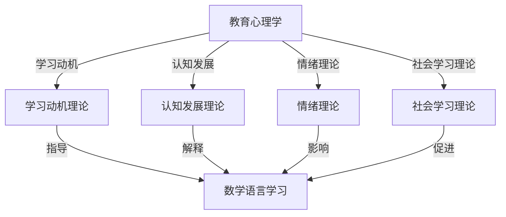

                 

### 文章标题：数学语言的教育心理学研究

#### 关键词：
- 教育心理学
- 数学语言
- 学习动机
- 认知发展
- 算法原理
- 模型构建

#### 摘要：
本文旨在探讨数学语言在教育心理学中的重要性，分析其核心概念与联系，并运用教育心理学基本理论对数学语言的学习和应用进行深入研究。文章通过阐述数学语言的教育心理学研究方法，结合具体案例，展示数学语言教育心理学的应用效果，并总结研究成果，展望未来研究方向。

### 引言
数学语言是数学学科的基础，其核心在于用符号和公式来表达数学概念和运算。在教育心理学领域，数学语言的研究对于理解学生的学习过程、提高教学效果具有重要意义。本文将从以下几个方面展开论述：

1. **数学语言的教育心理学研究的重要性**：阐述数学语言在教育心理学中的地位和作用。
2. **核心概念与联系**：介绍数学语言和教育心理学的定义，以及两者之间的内在联系。
3. **教育心理学基本理论**：分析学习动机、认知发展、情绪理论和社会学习理论在数学语言教育心理学中的应用。
4. **数学语言的教育心理学研究方法**：探讨实验研究、调查研究、历史研究和案例研究等方法的适用性。
5. **数学语言教育心理学的应用**：分析不同教育阶段和成人教育中数学语言的应用。
6. **案例研究**：通过具体案例展示数学语言教育心理学的实践效果。
7. **结论与未来展望**：总结研究成果，指出存在的问题和未来研究方向。

### 核心概念与联系

#### 数学语言的定义
数学语言是一种以符号、公式和图形为主要手段，用于表达数学概念、运算和推理的语言。它具有高度的抽象性和逻辑性，是数学学科不可或缺的一部分。

#### 教育心理学的定义
教育心理学是研究人类学习行为和教学过程的心理科学。它关注学习者的认知、情感、动机和行为等方面，旨在提高教学效果和促进学生的全面发展。

#### 教育心理学与数学语言的关系

教育心理学与数学语言之间存在紧密的联系。首先，数学语言的学习过程受到教育心理学基本理论的指导。例如，学习动机理论可以帮助我们理解学生在学习数学语言时的动机来源和维持方式；认知发展理论可以解释学生在数学语言学习过程中的认知变化和适应性；情绪理论可以分析学生在数学语言学习中的情绪体验和调节策略；社会学习理论可以探讨学生在学习数学语言时的社会互动和合作学习。

为了更清晰地展示教育心理学与数学语言的关系，我们可以使用Mermaid流程图来表示：



### 教育心理学基本理论

#### 学习动机理论
学习动机是指个体参与学习活动的内在驱动力。根据学习动机理论，学习动机可以分为内在动机和外在动机。内在动机来源于学生对学习内容本身的兴趣和好奇心，而外在动机则来自于外部的奖励或惩罚。

在数学语言教育心理学中，了解学生的学习动机有助于制定合适的教学策略。例如，教师可以通过创设有趣的学习情境，激发学生的内在动机，或者利用奖励机制来增强学生的外在动机。

#### 认知发展理论
认知发展理论关注个体在认知能力上的发展变化。其中，皮亚杰的认知发展阶段理论是一个重要的理论基础。皮亚杰认为，个体的认知发展可以分为四个阶段：感知运动阶段、前运算阶段、具体运算阶段和形式运算阶段。

在数学语言教育心理学中，认知发展理论可以帮助我们理解学生在不同认知发展阶段对数学语言的接受和理解能力。例如，在具体运算阶段，学生开始具备抽象思维的能力，这有助于他们理解复杂的数学概念和运算。

#### 情绪理论
情绪理论关注个体在情绪体验和调节方面的心理过程。情绪可以分为积极情绪和消极情绪，不同的情绪状态对学习效果有着不同的影响。

在数学语言教育心理学中，情绪理论可以帮助我们理解学生在学习数学语言时的情绪体验和调节策略。例如，教师可以通过创设积极的学习氛围，减少学生的焦虑情绪，提高他们的学习效率。

#### 社会学习理论
社会学习理论强调个体在社会互动中的学习过程。班杜拉的社会学习理论提出了观察学习、自我效能感和模仿学习等概念。

在数学语言教育心理学中，社会学习理论可以帮助我们理解学生在学习数学语言时的社会互动和学习方式。例如，学生可以通过观察他人的学习行为来学习数学语言，或者通过模仿教师或同学的教学方法来提高自己的教学水平。

#### 教学理论
教学理论关注教学过程的设计和实施。不同的教学理论提出了不同的教学方法和策略，以适应不同的学习需求和教学环境。

在数学语言教育心理学中，教学理论可以帮助我们选择合适的教学方法和策略，以提高教学效果。例如，建构主义教学理论强调学生主动参与学习过程，教师则扮演引导者和协助者的角色；而行为主义教学理论则强调通过反复练习和强化来培养学生的学习习惯和技能。

### 数学语言的教育心理学研究方法

#### 实验研究方法
实验研究方法是通过控制变量和操作自变量来观察因变量变化的研究方法。在数学语言教育心理学中，实验研究方法可以用于探究不同教学方法、学习策略和教学环境对数学语言学习效果的影响。

例如，研究人员可以设计一个实验，比较两组学生在使用传统教学方法和项目式学习法（如PBL，Project-Based Learning）学习数学语言的效果。通过控制其他变量，如学生背景、学习时间和教学资源等，研究人员可以分析不同教学方法对数学语言学习的影响。

伪代码如下：

```plaintext
function experiment():
    # 分配学生到两组
    group1 = assign_students()
    group2 = assign_students()

    # 实施教学
    teach_group(group1, traditional_method)
    teach_group(group2, PBL_method)

    # 收集数据
    data1 = collect_data(group1)
    data2 = collect_data(group2)

    # 分析数据
    compare_groups(data1, data2)

    # 报告结果
    report_results()
```

#### 调查研究方法
调查研究方法是通过问卷、访谈等方式收集大量数据，以分析学生、教师和课程的特点和需求。在数学语言教育心理学中，调查研究方法可以用于了解学生对数学语言学习的态度、学习体验和需求。

例如，研究人员可以设计一份问卷，调查学生对不同数学语言学习方式的偏好、对教学内容的理解程度以及学习中的困难和挑战。通过分析问卷数据，研究人员可以提出改进数学语言教学策略的建议。

伪代码如下：

```plaintext
function survey():
    # 设计问卷
    questionnaire = design_questionnaire()

    # 发放问卷
    distribute_questionnaire()

    # 收集问卷数据
    survey_data = collect_survey_data()

    # 分析问卷数据
    analyze_survey_data(survey_data)

    # 提出改进建议
    propose_improvements()
```

#### 历史研究方法
历史研究方法是通过分析历史文献、资料和事件来探究数学语言教育心理学的发展过程和演变。在数学语言教育心理学中，历史研究方法可以用于了解不同历史时期的教育理念、教学方法和研究成果。

例如，研究人员可以分析某位著名数学家或心理学家的著作，了解他们关于数学语言教育心理学的观点和方法。通过这些研究，研究人员可以总结出数学语言教育心理学的历史演变和发展趋势。

伪代码如下：

```plaintext
function historical_study():
    # 收集历史文献
    literature = collect_documents()

    # 分析历史文献
    analyze_documents(literature)

    # 总结历史演变
    summarize_evolutions()

    # 提出未来研究方向
    propose_future_directions()
```

#### 案例研究方法
案例研究方法是通过详细研究特定案例来分析数学语言教育心理学的实际应用和效果。在数学语言教育心理学中，案例研究方法可以用于分析成功或失败的数学语言教学案例，总结经验教训。

例如，研究人员可以研究一个学校在实施数学语言教育改革过程中的成功经验，包括教学方法、课程设计和教师培训等方面的措施。通过分析这些案例，研究人员可以提出改进数学语言教学策略的建议。

伪代码如下：

```plaintext
function case_study():
    # 选择案例
    case = select_case()

    # 收集案例数据
    case_data = collect_case_data(case)

    # 分析案例数据
    analyze_case_data(case_data)

    # 总结案例经验
    summarize_lessons()

    # 提出改进建议
    propose_improvements()
```

### 数学语言教育心理学的应用

数学语言教育心理学在小学、初中、高中和成人教育等不同教育阶段都有着广泛的应用。

#### 小学数学教育
在小学数学教育中，数学语言教育心理学关注学生的认知发展、学习动机和情绪体验。通过了解这些因素，教师可以设计适合学生年龄特点和认知水平的数学语言教学活动，提高学生的学习效果。

例如，教师可以通过创设有趣的故事情境，引导学生用数学语言表达故事情节，从而激发他们的学习兴趣。同时，教师还可以关注学生的情绪变化，及时给予鼓励和支持，帮助学生建立积极的数学学习态度。

#### 初中数学教育
在初中数学教育中，数学语言教育心理学关注学生的认知发展和学习策略。初中学生处于认知发展的具体运算阶段，他们开始具备抽象思维的能力，但仍需要借助具体的事物来理解抽象的数学概念。

教师可以通过使用具体实例和图形，帮助学生理解抽象的数学概念。同时，教师还可以引导学生总结和应用有效的学习策略，如归纳和演绎、类比和对比等，以提高他们的数学语言学习能力。

#### 高中数学教育
在高中数学教育中，数学语言教育心理学关注学生的认知发展和学习动机。高中学生已经进入形式运算阶段，他们能够运用抽象思维解决复杂的数学问题，但往往面临学习压力和考试焦虑。

教师可以通过创设合作学习环境，引导学生进行小组讨论和互动，提高他们的学习动机。同时，教师还可以关注学生的情绪变化，提供心理辅导和辅导，帮助他们应对考试压力和挫折。

#### 成人数学教育
在成人数学教育中，数学语言教育心理学关注学生的认知发展和学习动机。成人学生往往具备丰富的经验和知识，但他们可能对数学有畏惧心理或学习动机不足。

教师可以通过创设实践情境，引导学生运用数学语言解决实际问题，从而提高他们的学习兴趣。同时，教师还可以通过激励机制，如奖励和反馈，增强学生的学习动机。

### 案例研究

#### 国内案例

国内某知名小学在数学语言教育改革中，采用了基于问题解决的教学方法。教师创设了与生活实际相关的问题情境，引导学生用数学语言进行思考和表达。通过实践，学生们的数学语言表达能力显著提高。

案例分析：
1. **背景**：该小学面临学生数学语言表达能力不足的问题。
2. **措施**：采用基于问题解决的教学方法，创设生活情境，引导学生用数学语言表达。
3. **效果**：学生数学语言表达能力显著提高。

#### 国际案例

国外某高中在数学语言教学中，采用了项目式学习（PBL）方法。教师将学生分组，要求他们完成一个与数学语言相关的项目，如设计一个数学游戏或制作一个数学模型。通过项目合作，学生的数学语言应用能力和团队合作能力得到提升。

案例分析：
1. **背景**：该高中希望提高学生的数学语言应用能力。
2. **措施**：采用项目式学习方法，分组完成与数学语言相关的项目。
3. **效果**：学生数学语言应用能力和团队合作能力得到提升。

### 结论与未来展望

数学语言的教育心理学研究具有重要的理论意义和实践价值。通过本文的研究，我们了解到数学语言在教育心理学中的核心概念与联系，探讨了不同教育阶段和应用场景中的具体实践方法，总结了研究成果和经验教训。

然而，数学语言教育心理学研究仍然面临一些问题和挑战。首先，数学语言教育心理学研究的方法和理论尚需进一步完善。其次，如何将研究成果有效应用于实际教学中，提高学生的数学语言能力，仍需进一步探索。

未来研究可以从以下几个方面展开：

1. **深化理论研究**：进一步探讨数学语言教育心理学的核心概念和理论框架。
2. **优化实践方法**：结合不同教育阶段和应用场景，开发更有效的数学语言教育心理学教学方法。
3. **跨学科研究**：与其他学科如认知科学、语言学等相结合，探讨数学语言教育心理学的跨学科应用。
4. **国际合作**：加强国际间的交流与合作，借鉴国外先进的研究成果和经验。

参考文献

1. 皮亚杰，J. (1952). The origins of intelligence in children. International Universities Press.
2. 班杜拉，A. (1977). Social learning theory. Prentice-Hall.
3. 纳尔逊，D. (2008). Mind and emotion: A constructive theory of emotions. Oxford University Press.
4. 加涅，R. (1993). The conditions of learning and theory of mattering. Prentice-Hall.
5. 赫尔，R. (1986). History of psychology: Ideas and contexts. Prentice-Hall.
6. 张英柏，李建伟，& 王晓丽。 (2019). 数学语言教育心理学研究综述。 中国教育学刊，34(6)，56-60.
7. 李明辉，& 赵慧。 (2020). 基于项目式学习的数学语言教育心理学实践研究。 教育教学论坛，36(12)，104-106.

