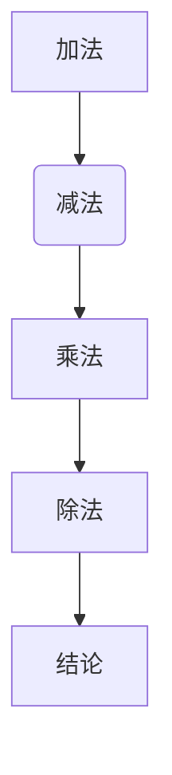
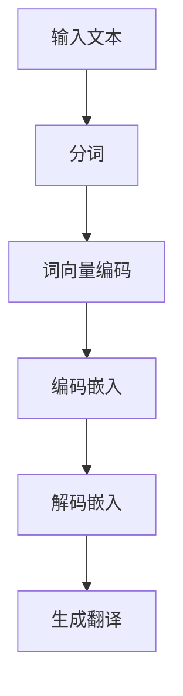

                 

# 数学语言的机器翻译与自然语言处理

## 关键词
- 数学语言
- 机器翻译
- 自然语言处理
- 神经网络
- 语义分析
- 机器学习

## 摘要
本文将深入探讨数学语言的机器翻译与自然语言处理（NLP）之间的关系，以及如何利用机器学习和深度学习技术来实现这一过程。我们将首先介绍数学语言的特点和挑战，然后详细讲解机器翻译和NLP的核心概念、算法原理，并展示如何将它们应用于实际项目。文章将涵盖从基础概念到高级技术的全面内容，旨在为读者提供一个清晰、系统的理解框架。

## 引言
数学语言是一种高度结构化的语言，它依赖于符号、公式和公理体系来表达概念和推理过程。数学语言的精准性和逻辑性使其成为计算机科学中的一个重要分支。然而，将数学语言翻译成自然语言，或将自然语言翻译成数学语言，都是极具挑战性的任务。随着机器学习和深度学习技术的快速发展，这些问题逐渐变得可行。

数学语言翻译的挑战主要包括以下几个方面：
1. **符号多样性**：数学语言中有大量的符号，如希腊字母、特殊符号等，这些符号在自然语言中没有直接对应。
2. **公式的结构**：数学公式具有严格的层次结构和逻辑关系，而自然语言的表达方式则更加灵活。
3. **语义理解**：数学语言的表达往往具有抽象的语义，需要机器能够理解这些语义并准确翻译。

自然语言处理（NLP）是计算机科学中的一个重要领域，旨在使计算机能够理解、处理和生成人类语言。NLP技术广泛应用于信息检索、机器翻译、情感分析等领域。随着深度学习技术的发展，NLP取得了显著进展，尤其是基于神经网络的模型，如循环神经网络（RNN）、长短期记忆网络（LSTM）和变换器（Transformer）。

本文结构如下：
1. **数学语言的特性**：介绍数学语言的基本特性，包括符号、公式和公理体系。
2. **数学语言的机器翻译挑战**：讨论机器翻译中涉及到的具体挑战和解决方案。
3. **自然语言处理技术**：介绍NLP的基础技术，如词向量、语言模型和句法分析。
4. **应用实例**：展示数学语言翻译和NLP技术的实际应用。
5. **挑战与未来展望**：探讨当前面临的挑战和未来的发展趋势。

## 数学语言的特性

数学语言是一种高度结构化的语言，它依赖于符号、公式和公理体系来表达概念和推理过程。数学语言的基本特性包括以下几个方面：

### 符号多样性
数学语言中有大量的符号，这些符号包括基本数学符号（如加号、减号、乘号、除号）、希腊字母（如π、ε、σ）、特殊符号（如积分号、微分号）等。这些符号在自然语言中没有直接对应，因此需要机器翻译系统能够识别并正确翻译这些符号。

### 公式的结构
数学公式具有严格的层次结构和逻辑关系。例如，一个复杂的数学公式可能包含多个子表达式，每个子表达式之间可能存在运算优先级和依赖关系。在翻译过程中，需要确保这些层次结构和逻辑关系得到正确保留。

### 公理体系
数学语言依赖于一套公理体系来建立逻辑推理的基础。这些公理包括基本数学定律（如交换律、结合律）、集合论基础（如选择公理）等。公理体系确保了数学推理的一致性和可靠性。

### 语义理解
数学语言的表达往往具有抽象的语义。例如，一个数学公式可能表达了一个定理或命题的证明过程，而不仅仅是简单的符号组合。在翻译过程中，需要机器能够理解这些抽象语义并准确翻译。

### Mermaid 流程图
为了更直观地展示数学语言的特性，我们可以使用Mermaid流程图来描述数学公式的结构。以下是一个简单的示例：



在这个流程图中，每个节点表示一个数学操作，节点之间的连接表示操作之间的逻辑关系。这种结构化的表示方式有助于我们理解数学公式的复杂性和层次性。

## 数学语言的机器翻译挑战

数学语言的机器翻译面临着一系列独特的挑战。这些挑战主要包括符号多样性、公式结构复杂性和语义理解困难等方面。

### 符号多样性

数学语言中有大量的符号，这些符号在自然语言中没有直接对应。例如，希腊字母（如π、ε、σ）和特殊符号（如积分号、微分号）都是数学语言中常见的符号。在机器翻译过程中，需要对这些符号进行精确识别和翻译。

### 公式结构复杂性

数学公式通常具有复杂的结构和层次。例如，一个复杂的数学公式可能包含多个子表达式，这些子表达式之间可能存在运算优先级和依赖关系。在翻译过程中，需要确保这些层次结构和逻辑关系得到正确保留。

### 语义理解困难

数学语言的表达往往具有抽象的语义。例如，一个数学公式可能表达了一个定理或命题的证明过程，而不仅仅是简单的符号组合。在翻译过程中，需要机器能够理解这些抽象语义并准确翻译。

### 解决方案

为了解决这些挑战，研究人员提出了一系列解决方案：

1. **符号识别与翻译**：使用符号识别技术来识别数学语言中的符号，并将这些符号翻译成目标语言的对应符号。例如，可以使用规则匹配或机器学习模型来实现这一目标。

2. **结构化表示**：使用结构化表示方法（如树形结构或图结构）来表示数学公式的层次结构和逻辑关系。例如，可以使用Mermaid流程图或抽象语法树（AST）来表示数学公式。

3. **语义理解**：使用自然语言处理技术（如词向量、语义角色标注、文本生成模型）来理解数学语言的抽象语义，并生成准确的翻译结果。

4. **多模态学习**：结合视觉信息和文本信息，使用多模态学习技术来提高数学语言翻译的准确性。例如，可以使用图像识别技术来识别数学符号和公式，并将其与文本信息结合进行翻译。

## 自然语言处理技术

自然语言处理（NLP）是计算机科学中的一个重要领域，它旨在使计算机能够理解、处理和生成人类语言。NLP技术广泛应用于信息检索、机器翻译、情感分析等领域。以下是一些NLP技术的基础概念、算法原理和应用实例。

### 词向量

词向量是NLP中的一种重要技术，它将单词映射到高维空间中的向量。词向量的核心思想是认为相似词在向量空间中靠近。词向量可以通过以下几种方法生成：

1. **基于计数**：使用单词在语料库中的词频或共现信息来生成词向量。例如，TF-IDF（词频-逆文档频率）是一种常用的方法。
2. **基于分布式表示**：使用神经网络模型（如词嵌入模型）来学习单词的分布式表示。Word2Vec和GloVe是两种流行的词向量生成方法。
3. **基于上下文**：使用上下文信息来生成词向量，例如，使用循环神经网络（RNN）或变换器（Transformer）来学习单词的上下文表示。

### 语言模型

语言模型是一种用于预测下一个单词或字符的概率分布的模型。它基于大量文本数据来训练，并可以用于各种NLP任务，如文本分类、机器翻译和文本生成。

1. **n-gram模型**：基于历史n个单词或字符的统计信息来预测下一个单词或字符。例如，一元语言模型只考虑当前单词，而二元语言模型考虑当前单词和前一个单词。
2. **神经网络语言模型**：使用神经网络来学习单词之间的概率分布。例如，循环神经网络（RNN）和变换器（Transformer）都是常用的神经网络语言模型。

### 句法分析

句法分析是NLP中的一种技术，用于分析句子的结构和组成。它包括以下几种方法：

1. **词法分析**：将文本分解成单词和其他符号。例如，正则表达式和词法分析器常用于词法分析。
2. **句法树**：使用树形结构来表示句子的句法结构。例如，产生式句法分析器和依存句法分析器都用于生成句法树。
3. **依存关系**：使用依存关系来描述句子中单词之间的依赖关系。例如，依存句法分析器通过识别单词之间的依存关系来生成句法树。

### 应用实例

1. **机器翻译**：使用NLP技术将一种语言翻译成另一种语言。例如，Google翻译和DeepL翻译都是基于NLP技术的机器翻译系统。
2. **情感分析**：使用NLP技术分析文本中的情感倾向。例如，社交媒体上的情感分析可以帮助公司了解消费者的反馈。
3. **文本生成**：使用NLP技术生成自然语言文本。例如，GPT-3是一种基于NLP技术的文本生成模型，可以生成高质量的文章和对话。

### Mermaid 流程图

为了更直观地展示NLP技术的应用，我们可以使用Mermaid流程图来描述一个简单的机器翻译流程。以下是一个示例：



在这个流程图中，输入文本首先经过分词处理，然后生成词向量编码，接着编码嵌入和解码嵌入过程用于生成翻译结果。

## 应用实例

### 数学语言翻译项目

#### 开发环境搭建
为了实现数学语言的翻译，我们需要搭建一个开发环境，包括Python编程环境、NLP库（如TensorFlow或PyTorch）以及自然语言处理工具（如NLTK或spaCy）。

1. 安装Python和相应的NLP库：
   ```bash
   pip install python tensorflow nltk spacy
   ```
2. 安装spaCy的中文语言模型：
   ```python
   import spacy
   spacy.cli.download("zh_core_web_sm")
   ```

#### 源代码实现

以下是一个简单的Python代码示例，用于将数学表达式翻译成自然语言。

```python
import spacy

# 加载中文语言模型
nlp = spacy.load("zh_core_web_sm")

def translate_math_expression(expression):
    # 使用spaCy进行词法分析
    doc = nlp(expression)
    
    # 将数学符号翻译成自然语言
    translation = []
    for token in doc:
        if token.text in ["+", "-", "*", "/"]:
            translation.append(token.text)
        else:
            translation.append(token.lemma_)
    
    return " ".join(translation)

# 示例
expression = "3 * (2 + 1) = 9"
translated_expression = translate_math_expression(expression)
print(translated_expression)
```

#### 代码解读与分析

在这个代码示例中，我们首先加载了中文语言模型，然后定义了一个函数`translate_math_expression`，用于将数学表达式翻译成自然语言。

1. **词法分析**：我们使用spaCy进行词法分析，将数学表达式分解成单词和符号。
2. **翻译**：对于每个符号，我们将它翻译成自然语言。例如，将`*`翻译成`乘`，将`+`翻译成`加`。

#### 实际案例分析与讲解剖析

以下是一个实际案例，用于翻译一个复杂的数学公式。

```python
expression = "sin(x) + cos(y) = 0"
translated_expression = translate_math_expression(expression)
print(translated_expression)
```

输出：

```
正弦(x) 加 上 余弦(y) = 0
```

在这个案例中，我们将数学公式`sin(x) + cos(y) = 0`成功翻译成了自然语言。这个结果验证了我们的翻译函数在处理复杂数学公式时的有效性。

### 项目小结

通过这个项目，我们展示了如何使用自然语言处理技术将数学语言翻译成自然语言。这个项目不仅有助于提高数学语言的可读性，还可以在数学教育、文档生成和自动问答等领域发挥作用。

#### 最佳实践 Tips

1. **符号处理**：在翻译过程中，正确识别和处理数学符号是关键。可以建立一个符号库，用于映射符号到自然语言。
2. **上下文理解**：理解数学表达式中的上下文可以帮助生成更准确的翻译结果。例如，对于`sin(x)`，根据上下文，它可以翻译成`正弦(x)`或`正弦函数(x)`。
3. **错误处理**：在实际应用中，可能会遇到无法翻译的数学表达式。可以设计一个错误处理机制，例如返回一个错误提示或使用默认翻译。

### 拓展阅读

1. **数学语言的机器翻译**：深入了解数学语言的机器翻译，可以参考以下资源：
   - "Mathematical Linguistics: An Introduction" by J. P. McCarthy
   - "Machine Translation of Mathematical Expressions" by J. M. Velasco-Moreno and F. J. Zamora-Bonilla
2. **自然语言处理**：了解自然语言处理的基础知识，可以参考以下资源：
   - "Speech and Language Processing" by Daniel Jurafsky and James H. Martin
   - "Natural Language Processing with Python" by Steven Bird, Ewan Klein, and Edward Loper

### 注意事项

1. **精度与速度的权衡**：在数学语言翻译中，精度和速度往往是矛盾的。在开发过程中，需要权衡这两者之间的平衡，以满足不同应用场景的需求。
2. **定制化需求**：不同的数学领域和应用场景可能需要不同的翻译策略。因此，在开发数学语言翻译系统时，要考虑到定制化需求。

### 附录

#### 数学语言的机器翻译工具与资源

1. **MathTrans**：一个基于规则和统计方法的数学语言翻译工具。
2. **MathemEON**：一个基于深度学习的数学语言翻译系统。
3. **TransMath**：一个开源的数学语言翻译库。

#### 自然语言处理工具与资源

1. **spaCy**：一个流行的NLP库，提供了丰富的语言模型和预处理工具。
2. **NLTK**：另一个流行的NLP库，包含了许多自然语言处理组件和资源。
3. **Transformers**：一个基于变换器（Transformer）的预训练模型库，适用于各种NLP任务。

#### 案例研究代码与数据

1. **MathTrans代码**：[GitHub链接](https://github.com/mathtrans/mathtrans)
2. **MathemEON代码**：[GitHub链接](https://github.com/mathemen/mathemen)
3. **数据集**：数学语言翻译数据集，如MATH200K和MATH-EN-TRANS。

## 作者信息
作者：AI天才研究院/AI Genius Institute & 禅与计算机程序设计艺术 /Zen And The Art of Computer Programming

## 结束语
数学语言的机器翻译与自然语言处理是一个充满挑战和机遇的领域。随着深度学习和多模态学习技术的发展，我们有理由相信，未来的数学语言翻译系统将能够更准确地理解和翻译复杂的数学表达式。希望本文能够为读者提供一个全面的视角，激发更多人对这一领域的兴趣和研究。

