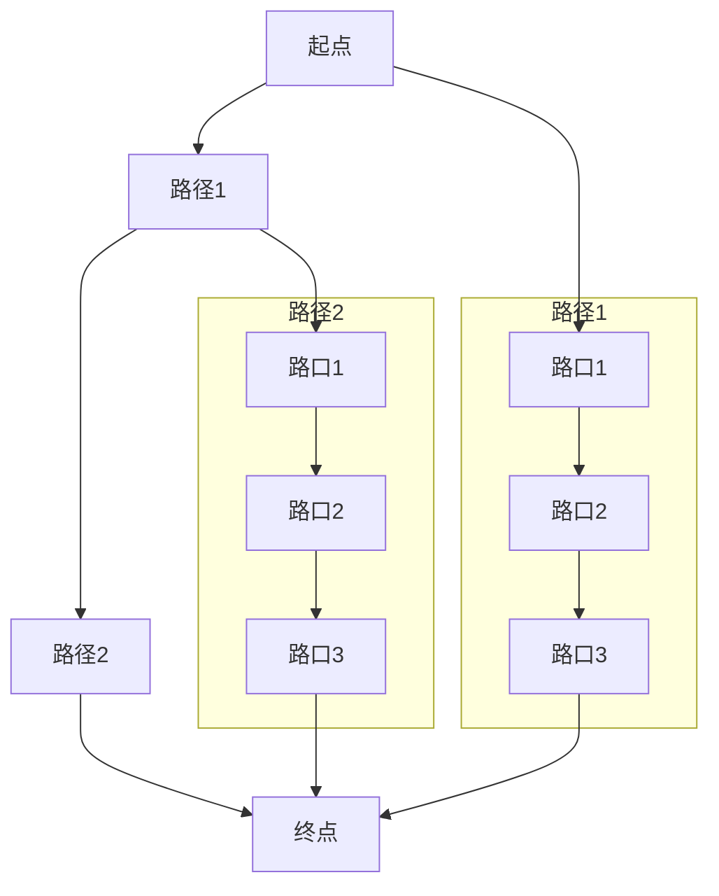
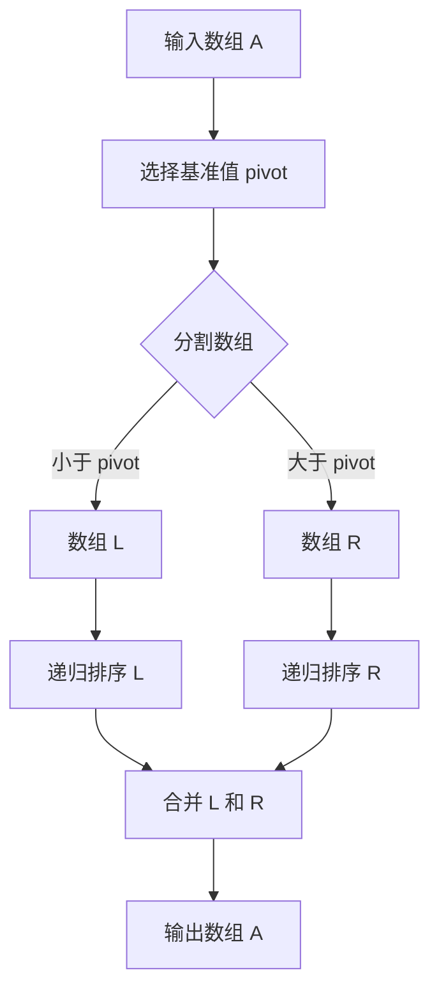
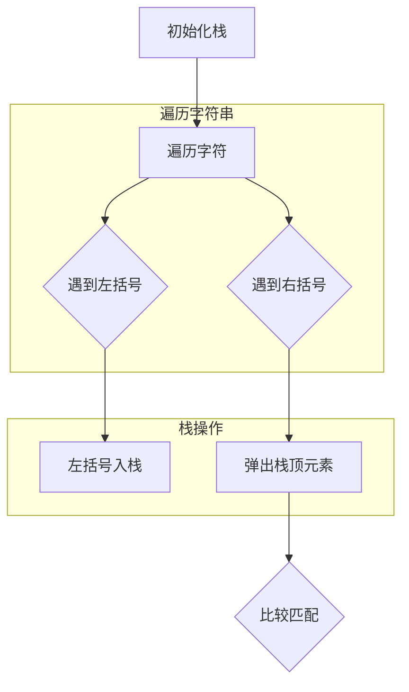
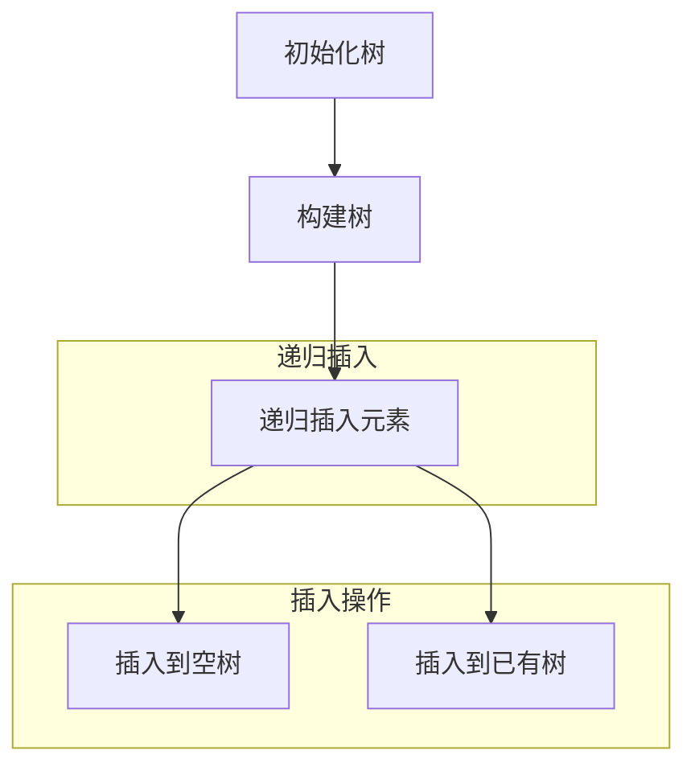
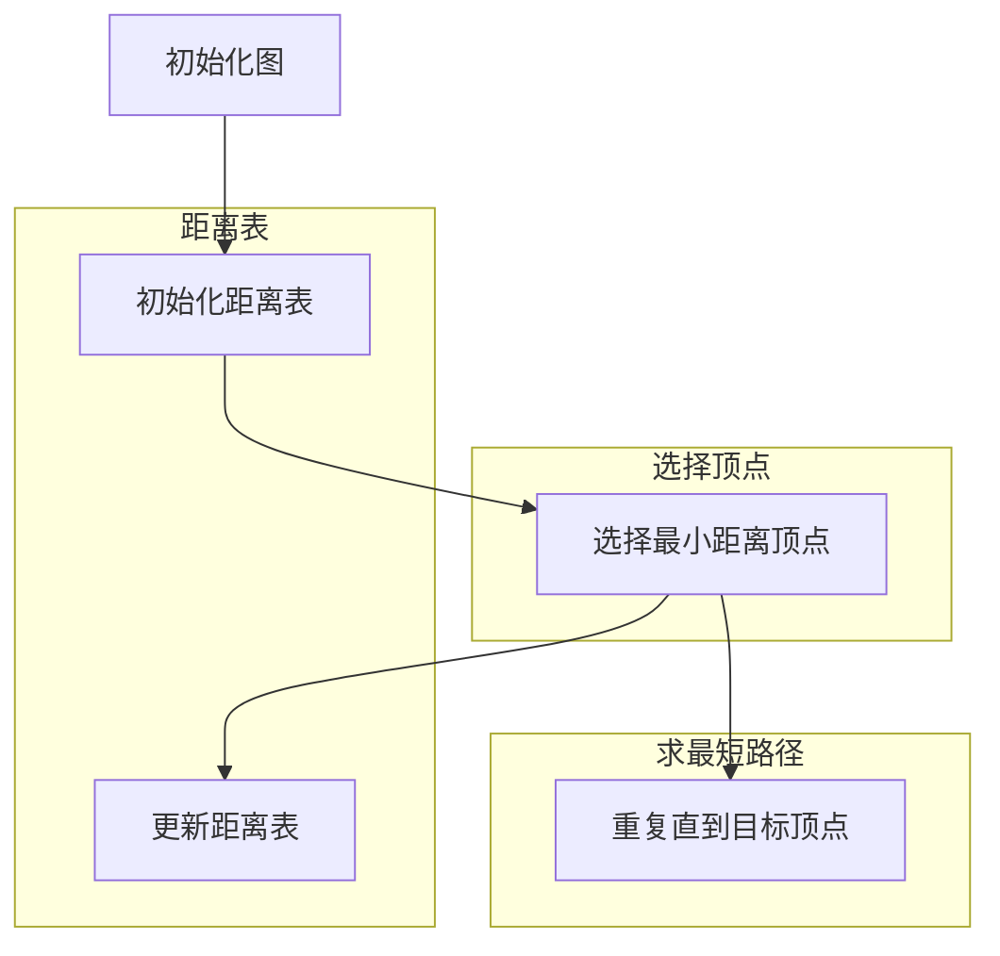
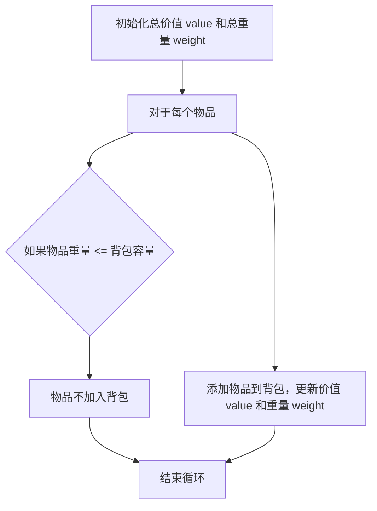
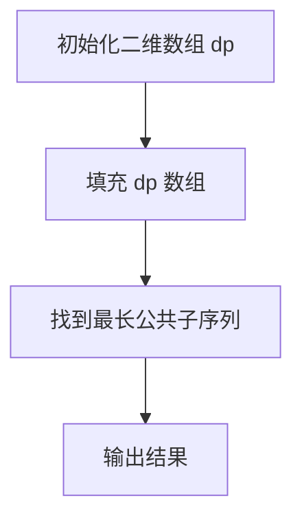

                 

### 理解书名：《数学语言的计算思维培养应用》

《数学语言的计算思维培养应用》这个书名直截了当地揭示了本书的核心内容：通过数学语言来培养计算思维，并将其应用于实际场景中。为了更好地理解这个书名，我们需要首先了解两个关键概念：计算思维和数学语言。

**计算思维**是一种解决问题和设计系统的思维方式，它强调逻辑推理、抽象和自动化。计算思维不同于传统的算法思维，它不仅仅是编写程序或解决问题，而是通过一系列步骤来理解和解决复杂问题。这种思维模式在计算机科学、人工智能和软件开发等领域具有广泛应用。

**数学语言**是用于描述数学概念和关系的符号系统，包括数字、变量、函数、集合等。数学语言具有高度抽象和形式化的特点，这使得它非常适合用于描述和解决计算机领域中的问题。

书名中的“数学语言”和“计算思维”之间的关系是本书的核心。数学语言作为一种工具，可以帮助我们更准确地描述问题，而计算思维则提供了解决问题的方法和策略。通过这本书，作者旨在帮助读者掌握如何利用数学语言来培养计算思维，并在实际应用中发挥其作用。

书名的应用场景可能涵盖计算机科学、人工智能、算法设计等多个领域。例如，在计算机科学中，数学语言可以帮助我们理解算法的本质和性能；在人工智能中，数学语言是机器学习和深度学习算法的基础；在算法设计中，数学语言则是分析和优化算法的关键工具。

总的来说，《数学语言的计算思维培养应用》这本书为我们提供了一种全新的视角来理解数学和计算思维，并探讨了它们在计算机科学和相关领域中的实际应用。通过这本书，读者不仅可以提升自己的计算思维能力，还能掌握数学语言在解决问题中的实际应用技巧。下面，我们将深入探讨计算思维和数学语言的基本概念，以及它们在计算机科学中的重要性。

### 计算思维的基本概念与特点

计算思维（Computational Thinking）是一种解决问题的思维方式，它强调逻辑推理、抽象和自动化。这种思维模式最早由Jeannette M. Wing在2006年提出，她将其定义为一组核心技能，用于理解问题和设计解决方案。计算思维不仅仅是编写程序或解决问题，而是一种更为广泛和深入的思考方式，适用于各种领域。

**计算思维的核心特点**包括以下几个方面：

1. **抽象（Abstraction）**：抽象是将复杂问题简化为更容易理解和处理的部分。计算思维通过抽象来识别问题的本质，忽略不重要的细节。例如，在解决一个复杂的算法问题时，我们可能需要将问题分解为多个子问题，然后分别解决。

2. **分解（Decomposition）**：分解是将一个复杂的问题拆分为多个较小的、更易于管理的子问题。这种思维方式有助于我们理解问题，并逐步解决。例如，在软件开发中，我们通常将一个大型项目分解为多个功能模块，然后逐一开发和测试。

3. **模式识别（Pattern Recognition）**：模式识别是识别问题或解决方案中重复出现的模式或规律。通过模式识别，我们可以快速找到解决问题的方法。例如，在数据分析和机器学习中，我们通过识别数据中的模式来预测未来趋势。

4. **算法设计（Algorithm Design）**：算法设计是设计解决问题的步骤和方法。计算思维强调算法的有效性和效率。通过算法设计，我们可以找到解决问题的最佳方法。例如，在排序和搜索算法中，我们需要设计高效的算法来处理大量数据。

5. **数据结构（Data Structures）**：数据结构是组织和管理数据的方法。计算思维通过选择合适的数据结构来提高算法的效率和可维护性。例如，在处理大规模数据时，我们可能需要使用哈希表或平衡树等数据结构。

6. **自动化（Automation）**：自动化是将问题解决方案转换为自动执行的过程。计算思维强调将重复性任务自动化，以提高效率和减少错误。例如，通过编写脚本或使用自动化工具，我们可以自动化许多软件开发和测试任务。

**计算思维的重要性**在于它提供了一种系统化的解决问题的方式。无论是在计算机科学、人工智能、软件开发，还是在日常生活中，计算思维都是一种非常有用的工具。以下是一些具体的应用场景：

1. **计算机科学**：计算思维是计算机科学的基础，它帮助程序员理解和设计复杂系统，优化算法，提高性能。

2. **人工智能**：计算思维在人工智能领域中非常重要，它用于构建机器学习模型、设计神经网络，以及解决各种复杂问题。

3. **软件开发**：计算思维帮助开发者理解需求、设计架构，以及编写高效的代码。它也促进了软件的可维护性和可扩展性。

4. **日常生活**：计算思维可以帮助我们解决各种日常问题，例如时间管理、财务管理，以及复杂的决策过程。

通过计算思维，我们不仅能够更有效地解决问题，还能提高自己的创造力和创新能力。计算思维的核心是逻辑推理和抽象，它使得我们可以从更高的层次上理解问题和解决方案。下面，我们将进一步探讨计算思维与数学语言之间的关系，以及如何利用数学语言来培养计算思维。

### 数学语言的基本概念与组成部分

数学语言是用于描述数学概念和关系的符号系统，它包括数字、变量、函数、集合等基本元素。数学语言具有高度抽象和形式化的特点，这使得它非常适合用于描述和解决问题。理解数学语言的基本概念和组成部分对于培养计算思维至关重要。

**1. 数字与符号**：数字是数学语言中最基本的元素，用于表示数量。常见的数字包括整数、分数、小数和复数。符号是数字的扩展，用于表示特定的数学概念或运算。例如，加号（+）表示加法，减号（-）表示减法，乘号（*）表示乘法，除号（/）表示除法。

**2. 变量**：变量是表示未知数或可变数的符号。变量通常用字母表示，例如 \( x, y, z \) 等。变量可以用来表示问题中的参数或条件，使得数学表达式更具通用性。例如，方程 \( x + y = 10 \) 中，\( x \) 和 \( y \) 就是变量。

**3. 函数**：函数是一种将输入映射到输出的数学关系。函数通常用 \( f(x) \) 或 \( y = f(x) \) 来表示，其中 \( f \) 表示函数名，\( x \) 表示输入，\( y \) 表示输出。函数可以用来描述数据转换、关系映射等。例如，线性函数 \( y = 2x + 1 \) 表示输入 \( x \) 经过线性变换后的输出 \( y \)。

**4. 集合**：集合是数学中用于表示一组元素的工具。集合通常用大括号括起来，例如 \( \{1, 2, 3\} \)。集合可以用于表示问题中的数据集、条件集合等。集合的基本运算包括并集、交集、差集和笛卡尔积等。例如，集合 \( A = \{1, 2\} \) 和 \( B = \{3, 4\} \) 的并集 \( A \cup B = \{1, 2, 3, 4\} \)。

**5. 关系**：关系是用于描述两个集合之间元素的对应关系的概念。关系通常用符号 \( R \) 表示，例如 \( R = \{(1, 2), (2, 3)\} \)。关系可以是等价关系、部分顺序关系或偏序关系等。关系可以用来描述问题中的约束条件或依赖关系。

**6. 符号逻辑**：符号逻辑是用于表示和推理命题的逻辑系统。符号逻辑包括命题逻辑、谓词逻辑和形式逻辑等。命题逻辑用于表示简单命题的真假，谓词逻辑用于表示复杂命题的关系，形式逻辑用于推理和证明。符号逻辑是数学语言的重要组成部分，用于描述和证明数学性质。

**7. 图形表示**：图形表示是数学语言中用于直观表示数学概念和关系的方法。图形可以包括坐标系、图表、图形等。图形表示使得数学概念更易于理解和分析。例如，在解析几何中，图形表示可以直观地展示函数和方程的性质。

**数学语言的作用**在于其高度抽象和形式化的特点，使得它可以准确描述复杂问题，并提供解决问题的方法。数学语言的作用体现在以下几个方面：

1. **抽象问题**：通过数学语言，我们可以将复杂的问题简化为更易于处理的数学模型。这种抽象过程有助于我们理解问题的本质，找到解决问题的方法。

2. **描述关系**：数学语言可以准确地描述问题中的各种关系，如变量之间的关系、函数关系、集合关系等。这种描述有助于我们分析问题的性质和特点。

3. **推理和证明**：数学语言提供了一套逻辑推理和证明的工具，使我们能够从已知条件推导出新的结论。这种推理和证明能力是解决数学问题的基础。

4. **自动化工具**：数学语言可以用于编写计算机程序，实现数学模型和算法的自动化处理。这种自动化能力在计算机科学和人工智能领域具有重要意义。

总之，数学语言是培养计算思维的重要工具。通过掌握数学语言的基本概念和组成部分，我们可以更准确地描述问题，培养逻辑思维和抽象能力，从而提高计算思维能力。接下来，我们将探讨如何利用数学语言来培养计算思维，并在实际问题中应用这些方法。

### 数学语言在计算思维培养中的应用

数学语言在计算思维的培养中发挥着至关重要的作用，它不仅提供了描述问题的工具，还帮助我们在分析和解决问题时进行抽象和推理。以下是一些具体的应用实例，展示了数学语言在计算思维培养中的应用。

**1. 算法设计与分析**

算法设计是计算思维的核心之一，而数学语言在算法设计中起着关键作用。通过数学语言，我们可以更精确地描述算法的步骤和性能。例如，在排序算法的设计中，我们可以使用伪代码来描述算法的执行过程，并使用数学公式来分析其时间复杂度。

```python
# 冒泡排序算法的伪代码
for i in range(len(arr) - 1):
    for j in range(len(arr) - 1 - i):
        if arr[j] > arr[j + 1]:
            # 交换元素
            temp = arr[j]
            arr[j] = arr[j + 1]
            arr[j + 1] = temp

# 时间复杂度分析
# 假设数组长度为 n，则外层循环执行 n 次，内层循环执行 n-1、n-2、...、1 次
# 因此，时间复杂度为 O(n^2)
```

**2. 数据结构与抽象**

数据结构是计算思维中的重要组成部分，而数学语言可以用于描述和理解各种数据结构。例如，链表、树和图等常见数据结构都可以通过数学语言来描述其结构和操作。

```mermaid
graph TB
A[链表] --> B[节点]
B --> C{是否为空}
B --> D{头指针}
B --> E{尾指针}

classDef green fill:#FFFF00,stroke:none
classDef blue fill:#0000FF,stroke:none

A(链表) --> B[节点{值: 1, 指针: null}] --|下一个|> C[节点{值: 2, 指针: B}]
C --> D[节点{值: 3, 指针: null}]
D --> E[节点{值: 4, 指针: C}]
```

**3. 逻辑推理与证明**

符号逻辑是数学语言中的一个重要分支，它用于描述和证明数学命题。在计算思维中，逻辑推理和证明是解决复杂问题的关键。例如，在证明算法的正确性时，我们可以使用符号逻辑来构建证明框架。

```latex
\begin{proof}
假设输入数组 arr 已排序，我们希望证明冒泡排序算法可以正确地将其排序。

\quad（1）初始化两个指针 i 和 j，分别指向数组的第一个和最后一个元素。

\quad（2）执行一次冒泡排序，将相邻的元素进行比较和交换。

\quad（3）重复步骤（2），直到没有需要交换的元素为止。

\quad（4）此时，数组 arr 已经被排序。

\quad 证明完毕。
\end{proof}
```

**4. 模型建立与优化**

数学语言可以帮助我们建立和优化各种模型。在计算思维中，建立合适的数学模型是解决问题的关键。例如，在优化资源分配问题时，我们可以使用线性规划模型来求解最优解。

```latex
\begin{equation}
\begin{aligned}
\min_{x} \quad c^T x \\
\text{subject to} \quad Ax \leq b \\
x \geq 0
\end{aligned}
\end{equation}
```

**5. 实际案例解析**

在实际问题中，数学语言可以帮助我们分析和解决复杂问题。例如，在交通规划中，我们可以使用数学模型来优化路线规划，提高交通效率。



通过这些应用实例，我们可以看到数学语言在计算思维培养中的重要性。它不仅帮助我们描述和解决问题，还提高了我们的抽象和推理能力。接下来，我们将进一步探讨如何通过数学语言来培养计算思维。

### 计算思维与数学语言的关系架构：Mermaid流程图

为了更直观地展示计算思维与数学语言之间的关系，我们可以使用Mermaid流程图来构建一个关系架构。以下是一个简化的Mermaid流程图，它展示了计算思维和数学语言在不同阶段的应用。

```mermaid
graph TD
    A[问题识别] --> B[抽象]
    B --> C{使用数学语言}
    A --> D[定义数学模型]
    D --> E[建立数学关系}
    D --> F[算法设计}
    D --> G[优化与验证}
    F --> H[编程实现}
    G --> I[结果分析}
    
    subgraph 计算思维
        J[逻辑推理]
        K[模式识别]
        L[抽象思维]
    end
    
    subgraph 数学语言
        M[符号表示}
        N[公式推导}
        O[图形表示]
    end

    A --> J[逻辑推理]
    A --> K[模式识别]
    A --> L[抽象思维]
    D --> M[符号表示]
    D --> N[公式推导]
    D --> O[图形表示]
    F --> H[编程实现]
    G --> I[结果分析]
```

在这个流程图中，我们首先识别问题（A），然后通过抽象（B）将问题转化为数学语言可以描述的形式。接下来，我们定义数学模型（D），建立数学关系（E），设计算法（F），进行优化和验证（G）。最后，我们将算法编程实现（H），并分析结果（I）。在每一个阶段，计算思维（J、K、L）和数学语言（M、N、O）都发挥着重要作用。

**Mermaid流程图的关键组成部分**包括：

- **问题识别（A）**：这是计算思维的第一步，它要求我们理解问题的本质，并识别需要解决的关键点。

- **抽象（B）**：通过抽象，我们将复杂的问题简化为更易于处理的数学问题。

- **定义数学模型（D）**：在这一阶段，我们使用数学语言来定义问题的数学模型。

- **建立数学关系（E）**：我们使用数学公式和符号来建立问题中的各种关系。

- **算法设计（F）**：在这一阶段，我们设计算法来解决数学模型中的问题。

- **优化与验证（G）**：通过优化和验证，我们确保算法的有效性和正确性。

- **编程实现（H）**：将算法转换为可执行的代码。

- **结果分析（I）**：对算法的结果进行分析，以验证其性能和有效性。

通过这个流程图，我们可以清晰地看到计算思维和数学语言在整个问题解决过程中的交互和作用。计算思维提供了逻辑推理、抽象和模式识别的能力，而数学语言则为这些能力提供了表达和实现的方式。接下来，我们将通过具体的算法原理和伪代码来进一步阐述如何利用数学语言来实现计算思维。

### 算法设计与分析的基本概念

算法设计与分析是计算思维的核心组成部分，它涉及设计有效的算法以及分析其性能。理解算法设计与分析的基本概念对于培养计算思维至关重要。以下是几个关键概念：

**1. 算法（Algorithm）**：
算法是一系列明确的操作步骤，用于解决特定问题。算法可以用于排序、搜索、图处理、优化等多个领域。一个有效的算法应该具有以下特性：
- **正确性（Correctness）**：算法能够正确解决问题，并满足所有可能的输入。
- **效率（Efficiency）**：算法在合理的时间内完成计算，并使用较少的资源。
- **健壮性（Robustness）**：算法能够处理异常情况和错误输入。

**2. 时间复杂度（Time Complexity）**：
时间复杂度是衡量算法执行时间的一个重要指标，它表示算法执行时间与输入规模的关系。常用的大O表示法（Big O notation）来表示时间复杂度。例如，一个算法的时间复杂度为 \( O(n) \)，表示其执行时间与输入规模成正比。

**3. 空间复杂度（Space Complexity）**：
空间复杂度是衡量算法在执行过程中所需内存的指标。同样，使用大O表示法来表示。例如，一个算法的空间复杂度为 \( O(1) \)，表示其在任何情况下都只需要固定大小的内存。

**4. 常见算法分析方法**：
- **渐进分析（Asymptotic Analysis）**：分析算法的时间复杂度和空间复杂度，关注随着输入规模增长的趋势。
- **主定理（Master Theorem）**：用于分析分治算法的时间复杂度。
- **递归关系（Recurrence Relations）**：用于描述递归算法的时间复杂度。

**5. 算法设计策略**：
- **分治策略（Divide and Conquer）**：将大问题分解为较小的问题，分别解决，最后合并结果。
- **动态规划（Dynamic Programming）**：通过存储中间结果，避免重复计算。
- **贪心算法（Greedy Algorithm）**：在每一步选择局部最优解，以期望得到全局最优解。
- **回溯算法（Backtracking）**：通过尝试所有可能的解，找到满足条件的一个或多个解。

**6. 算法描述**：
算法通常使用伪代码（Pseudo-code）来描述，这是一种形式化的、但不是特定的编程语言的算法描述方法。以下是一个简单的排序算法（冒泡排序）的伪代码：

```python
procedure bubbleSort( A : list of sortable items )
    n = length(A)
    repeat
        swapped = false
        for i = 1 to n - 1 inclusive do
            if A[i] > A[i+1] then
                swap( A[i], A[i+1] )
                swapped = true
            end if
        end for
    until not swapped
end procedure
```

通过以上基本概念和策略，我们可以更好地理解和设计算法。接下来，我们将深入讨论如何使用数学语言来描述算法，并进行性能分析。

### 如何用数学语言描述算法

使用数学语言描述算法是一种有效的策略，它能够帮助我们在抽象层面上理解和分析算法的行为。以下是几个步骤，用于使用数学语言描述算法，并进行性能分析：

**1. 确定输入和输出**：
首先，我们需要明确算法的输入和输出。输入是算法处理的数据，输出是算法执行后的结果。例如，对于一个排序算法，输入是一个未排序的数组，输出是一个已排序的数组。

**2. 定义算法的步骤**：
接下来，我们将算法的步骤用数学语言描述。这通常涉及到变量、条件和循环结构。例如，我们可以使用伪代码或函数定义来描述算法的执行流程。

**3. 使用数学公式表示运算**：
在算法描述中，我们可以使用数学公式来表示各种运算。例如，在排序算法中，我们可以用比较运算符（<, >, =）来表示元素的比较。以下是一个使用数学公式描述的冒泡排序算法：

```latex
\text{冒泡排序算法} \newline
\text{输入}: A[1], A[2], \ldots, A[n] \text{（未排序的数组）} \newline
\text{输出}: A[1], A[2], \ldots, A[n] \text{（已排序的数组）} \newline
\text{步骤}: \newline
i = 1 \newline
while i < n do \newline
    j = 1 \newline
    while j < n - i do \newline
        \text{如果 } A[j] > A[j+1], \text{则交换 } A[j] \text{ 和 } A[j+1] \newline
        j = j + 1 \newline
    end while \newline
    i = i + 1 \newline
end while \newline
```

**4. 分析时间复杂度**：
在描述算法后，我们需要分析其时间复杂度。时间复杂度通常表示为函数，用于描述算法执行时间与输入规模的关系。例如，对于冒泡排序算法，时间复杂度为 \( O(n^2) \)，表示其执行时间与输入规模 \( n \) 的平方成正比。

**5. 使用递归关系**：
对于递归算法，我们可以使用递归关系来表示其时间复杂度。递归关系通常是一个关于 \( n \) 的方程，用于描述算法的执行时间。例如，快速排序算法的时间复杂度可以用以下递归关系表示：

\[ T(n) = 2T\left(\frac{n}{2}\right) + n \]

这个方程表示快速排序算法在每次递归调用中分解为两个规模为 \( \frac{n}{2} \) 的问题，并加上 \( n \) 次比较和划分操作。

**6. 伪代码示例**：
以下是一个使用伪代码和数学公式描述的快速排序算法示例：



```latex
\text{快速排序算法} \newline
\text{输入}: A[1], A[2], \ldots, A[n] \text{（未排序的数组）} \newline
\text{输出}: A[1], A[2], \ldots, A[n] \text{（已排序的数组）} \newline
\text{步骤}: \newline
select pivot \text{ from A} \newline
L = \{A[i] | A[i] < pivot\} \newline
R = \{A[i] | A[i] > pivot\} \newline
L = quicksort(L) \newline
R = quicksort(R) \newline
A = L \cup \{pivot\} \cup R \newline
\text{时间复杂度}: T(n) = 2T\left(\frac{n}{2}\right) + n \text{（主定理）} \newline
```

通过使用数学语言描述算法，我们可以更清晰地理解算法的行为，并对其进行性能分析。这不仅有助于优化算法，还能够帮助我们培养计算思维。接下来，我们将讨论如何在数据结构中使用数学语言来描述和解决问题。

### 数据结构与抽象的基本概念

数据结构是计算机科学中用于组织和存储数据的方法，它们提供了有效的数据访问和操作方式。理解数据结构的基本概念和抽象对于培养计算思维至关重要。以下是几个关键概念：

**1. 数据结构（Data Structure）**：
数据结构是一种用于存储和组织数据的方式，它包括数据的存储方式和操作数据的算法。常见的数据结构包括数组、链表、栈、队列、树和图等。

**2. 抽象数据类型（Abstract Data Type, ADT）**：
抽象数据类型是一种数据类型的抽象定义，它描述了数据的操作而无需关心具体的实现细节。ADT包括数据对象和数据操作，如堆、优先队列、散列表等。

**3. 线性结构（Linear Structure）**：
线性结构是一种数据元素排列有序的结构，每个元素都有一个前驱和一个后继。常见的线性结构包括数组、链表、栈和队列。

**4. 树结构（Tree Structure）**：
树结构是一种层次结构，每个节点有零个或多个子节点。树结构包括二叉树、平衡树（如AVL树）、B树等。

**5. 图结构（Graph Structure）**：
图结构是一种由节点（顶点）和边（连接节点）组成的数据结构。图可以分为无向图和有向图，常见的图结构包括邻接矩阵和邻接表。

**6. 数据结构的选择**：
选择合适的数据结构取决于具体的应用场景。例如，数组适合用于固定大小和随机访问的数据，链表适合用于动态大小和顺序访问的数据，树结构适合用于层次化数据，图结构适合用于复杂的关系和网络。

**7. 抽象与实现**：
数据结构的抽象是指将具体实现细节隐藏起来，只暴露必要的操作接口。实现是指具体实现数据结构的算法和操作。例如，堆这种抽象数据类型可以使用数组或完全二叉树来实现。

**8. 数据结构与算法的关系**：
数据结构提供了操作数据的方法，而算法则利用这些方法来解决问题。例如，排序算法通常依赖于数组或链表的数据结构来执行排序操作。

通过理解这些基本概念，我们可以更好地选择和使用合适的数据结构，从而优化算法的性能和可维护性。接下来，我们将讨论常见的数据结构，并展示如何在计算思维中使用它们。

### 常见数据结构

在计算思维中，选择合适的数据结构对于算法效率和程序性能至关重要。以下是一些常见的数据结构，以及它们的定义、特点和应用场景：

**1. 数组（Array）**
- **定义**：数组是一种线性数据结构，它包含固定大小的元素序列，每个元素可以通过其索引访问。
- **特点**：数组支持随机访问，即可以快速访问任意位置的元素，时间复杂度为 \(O(1)\)。
- **应用场景**：数组适用于需要快速随机访问和存储固定大小的数据集的场景，如缓存管理、矩阵运算等。

**2. 链表（Linked List）**
- **定义**：链表是一种由节点组成的线性数据结构，每个节点包含数据域和指向下一个节点的指针。
- **特点**：链表支持动态扩展，可以根据需要增加或删除节点，但随机访问性能较差，时间复杂度为 \(O(n)\)。
- **应用场景**：链表适用于需要频繁插入和删除操作的场景，如栈、队列、双向链表等。

**3. 栈（Stack）**
- **定义**：栈是一种后进先出（LIFO）的数据结构，元素只能在栈顶进行插入和删除。
- **特点**：栈支持快速插入和删除操作，时间复杂度为 \(O(1)\)。
- **应用场景**：栈适用于解决回溯问题、递归函数调用等场景，如深度优先搜索、表达式求值等。

**4. 队列（Queue）**
- **定义**：队列是一种先进先出（FIFO）的数据结构，元素只能在队尾插入，在队头删除。
- **特点**：队列支持快速插入和删除操作，时间复杂度为 \(O(1)\)。
- **应用场景**：队列适用于处理任务调度、缓冲管理等场景，如广度优先搜索、打印队列等。

**5. 树（Tree）**
- **定义**：树是一种层次结构，每个节点可以有零个或多个子节点。常见的树结构包括二叉树、二叉搜索树、AVL树等。
- **特点**：树支持高效的查找、插入和删除操作，时间复杂度取决于树的高度。
- **应用场景**：树适用于解决层次化问题、优先级队列等场景，如二叉搜索树、堆、B树等。

**6. 图（Graph）**
- **定义**：图是一种由节点（顶点）和边组成的数据结构，可以是无向的或定向的。
- **特点**：图支持复杂的网络和关系建模，如最短路径、最小生成树等问题。
- **应用场景**：图适用于解决网络流、社会网络分析、地图绘制等场景，如Dijkstra算法、Prim算法等。

**7. 哈希表（Hash Table）**
- **定义**：哈希表是一种基于键值对存储的数据结构，通过哈希函数将键映射到数组中的索引。
- **特点**：哈希表支持快速插入、删除和查找操作，平均时间复杂度为 \(O(1)\)。
- **应用场景**：哈希表适用于解决快速查找和存储问题，如缓存、数据库索引等。

通过了解这些常见数据结构，我们可以根据具体的应用场景选择合适的数据结构，从而优化算法的性能和程序的可维护性。接下来，我们将通过具体的例子展示如何使用数据结构进行计算思维中的抽象和操作。

### 数据结构与计算思维的实际应用

数据结构在计算思维的实际应用中起着至关重要的作用，它不仅帮助我们在算法设计和分析中实现高效的数据操作，还提高了程序的抽象能力和可维护性。以下通过几个实例展示数据结构在计算思维中的实际应用。

**实例1：使用栈解决括号匹配问题**

括号匹配是编程中常见的问题，例如在编译器中检查输入的代码是否遵循括号规则。我们可以使用栈来实现这一功能。

**问题定义**：给定一个字符串，判断其是否包含匹配的括号。

**算法思路**：遍历字符串，使用栈存储尚未匹配的左括号。每当遇到一个右括号时，检查栈顶元素是否与之匹配，如果匹配则弹出栈顶元素，否则返回不匹配。

**伪代码**：



**实例2：使用队列解决工作调度问题**

在许多实际应用中，如操作系统中的任务调度，我们需要按照特定的顺序处理多个任务。队列是处理这种问题的理想数据结构。

**问题定义**：给定一个任务序列，按照先来先服务的原则进行调度。

**算法思路**：使用队列来存储任务，依次从队列中取出任务并处理。

**伪代码**：

```mermaid
graph TD
    A[初始化队列] --> B[将任务加入队列]
    B --> C[依次从队列中取出任务]
    C --> D[执行任务]
    C --> E[任务完成}
```

**实例3：使用树解决二叉搜索问题**

二叉搜索树是一种高效的数据结构，用于组织和搜索有序数据。

**问题定义**：给定一个有序数组，构建一个二叉搜索树。

**算法思路**：使用递归或迭代方法，将数组中的每个元素作为树节点插入到二叉搜索树中。

**伪代码**：



**实例4：使用图解决最短路径问题**

图是一种复杂的数据结构，用于描述多节点之间的关系。Dijkstra算法是一种用于计算图中两点之间最短路径的经典算法。

**问题定义**：给定一个加权无向图和两个顶点，求它们之间的最短路径。

**算法思路**：使用优先队列（通常是一个小根堆）来选择最小距离的顶点进行扩展。

**伪代码**：



通过这些实例，我们可以看到数据结构在计算思维中的实际应用。这不仅帮助我们实现高效的算法，还提高了我们的抽象能力和问题解决能力。接下来，我们将进一步探讨数学语言在计算机科学中的广泛应用，并探讨其在实际项目中的应用实例。

### 数学语言在计算机科学中的广泛应用

数学语言在计算机科学中具有广泛的应用，它为算法设计、系统架构、网络安全等多个领域提供了理论基础和工具。以下是数学语言在计算机科学中的一些典型应用场景：

**1. 算法设计**

算法是计算机科学的核心，而数学语言为算法设计提供了精确的表达方式。例如，在排序算法中，数学公式用于分析时间复杂度，从而优化算法性能。在图算法中，图论中的数学概念如路径长度、度数、连通性等被用来描述和解决问题。以下是一个简单的示例，展示了如何使用数学语言描述一个冒泡排序算法的时间复杂度：

```latex
T(n) = \sum_{i=1}^{n} \sum_{j=1}^{i-1} c
```

在这个公式中，\( T(n) \) 表示算法的时间复杂度，\( n \) 是输入规模，\( c \) 是每次比较的操作成本。这个公式表明，随着输入规模的增加，算法的时间复杂度呈二次增长。

**2. 系统架构**

在系统架构设计中，数学语言帮助工程师理解和描述复杂系统的行为和性能。例如，在分布式系统设计中，数学模型用于描述网络延迟、负载均衡和数据一致性等问题。在云计算和大数据处理中，数学公式和模型用于优化资源分配、调度策略和性能分析。以下是一个简单的例子，展示了如何使用数学语言描述分布式系统的负载均衡：

```latex
P_i = \frac{R_i}{\sum_{j=1}^{n} R_j}
```

在这个公式中，\( P_i \) 表示任务分配到第 \( i \) 个节点的概率，\( R_i \) 和 \( R_j \) 分别表示第 \( i \) 个节点和总任务的数量。这个公式确保了每个节点都能获得公平的任务分配。

**3. 网络安全**

网络安全依赖于密码学和加密技术，而这些都是建立在数学语言基础之上的。数学语言在加密算法的设计和安全性分析中起着关键作用。例如，椭圆曲线加密（ECC）算法基于椭圆曲线数学理论，具有比传统RSA算法更高的安全性和效率。以下是一个简单的例子，展示了如何使用数学语言描述ECC算法中的点乘操作：

```latex
P = [k]G
```

在这个公式中，\( P \) 是生成的点，\( k \) 是加密密钥，\( G \) 是生成元。这个公式表明，点乘操作是将加密密钥与生成元相乘，从而生成一个新的点。

**4. 人工智能**

在人工智能领域，数学语言同样至关重要。机器学习和深度学习算法依赖于概率统计、线性代数和微积分等数学工具。例如，在神经网络中，数学模型用于描述神经元之间的连接权重和激活函数。以下是一个简单的例子，展示了如何使用数学语言描述神经网络的损失函数：

```latex
J(\theta) = -\frac{1}{m} \sum_{i=1}^{m} y^{(i)} \log(a^{(2)}(z^{(2)}))
```

在这个公式中，\( J(\theta) \) 是损失函数，\( m \) 是样本数量，\( y^{(i)} \) 和 \( a^{(2)}(z^{(2)}) \) 分别是实际输出和预测输出。这个公式用于衡量模型预测的准确性。

**5. 编码理论**

编码理论是研究如何有效和可靠地传输信息的一门学科，它依赖于数学语言，特别是信息论和集合论。在数据传输中，编码技术用于将原始信息转换为二进制位流，以减少错误和冗余。以下是一个简单的例子，展示了如何使用数学语言描述汉明码：

```latex
C = P \oplus K
```

在这个公式中，\( C \) 是编码后的信息，\( P \) 是原始信息，\( K \) 是校验码。这个公式表明，通过异或操作将原始信息与校验码相加，生成编码后的信息。

通过这些例子，我们可以看到数学语言在计算机科学中的广泛应用。它不仅为算法设计、系统架构、网络安全和人工智能等领域提供了理论基础和工具，还帮助我们更好地理解和解决复杂问题。接下来，我们将通过具体的实例来展示如何在实践中培养计算思维。

### 计算思维培养实例

为了更好地展示如何通过数学语言培养计算思维，下面我们将通过几个具体的实例来详细说明计算思维的应用过程。

**实例1：使用二分查找算法解决排序数组中的元素查找问题**

**问题描述**：给定一个已排序的数组，找到目标值在数组中的位置。

**步骤1：理解问题**  
首先，我们需要理解问题的本质，即如何在一个已排序的数组中高效地查找目标值。计算思维的第一步是抽象问题，将具体问题抽象为通用的查找问题。

**步骤2：设计算法**  
接下来，我们使用二分查找算法来解决这个问题。二分查找算法是一种高效的查找算法，它通过不断将数组分为两部分，逐步缩小查找范围。以下是二分查找算法的伪代码：

```mermaid
graph TD
    A[初始化左指针 left 和右指针 right] --> B[中间元素 mid = (left + right) / 2]
    B --> C{如果 target == array[mid], 返回 mid}
    B --> D{如果 target < array[mid], 更新 right = mid - 1}
    B --> E{如果 target > array[mid], 更新 left = mid + 1}
    C --> F[结束]
    D --> F
    E --> F
```

**步骤3：分析算法**  
使用数学语言，我们可以分析二分查找算法的时间复杂度。假设数组长度为 \( n \)，每次二分操作可以将查找范围缩小一半，因此二分查找算法的时间复杂度为 \( O(\log n) \)。

**步骤4：编程实现**  
最后，我们将算法转化为代码实现。以下是使用Python编写的二分查找算法：

```python
def binary_search(array, target):
    left, right = 0, len(array) - 1
    while left <= right:
        mid = (left + right) // 2
        if target == array[mid]:
            return mid
        elif target < array[mid]:
            right = mid - 1
        else:
            left = mid + 1
    return -1
```

**实例2：使用贪心算法解决背包问题**

**问题描述**：给定一组物品，每个物品有重量和价值，求解将物品放入背包中使得总价值最大且总重量不超过背包容量的最大价值。

**步骤1：理解问题**  
首先，我们需要理解背包问题的目标，即如何在有限资源下获得最大收益。计算思维要求我们从整体上考虑问题，并寻找局部最优解以获得全局最优解。

**步骤2：设计算法**  
我们可以使用贪心算法来解决背包问题。贪心算法通过每次选择当前最优解，逐步接近最终解。以下是贪心算法的伪代码：



**步骤3：分析算法**  
使用数学语言，我们可以分析贪心算法的效率。假设有 \( n \) 个物品和背包容量 \( W \)，贪心算法的时间复杂度为 \( O(n) \)，因为它需要遍历所有物品一次。

**步骤4：编程实现**  
以下是使用Python编写的贪心算法实现：

```python
def knapsack(values, weights, W):
    n = len(values)
    result = [0] * n
    weight = 0
    for i in range(n):
        if weight + weights[i] <= W:
            result[i] = 1
            weight += weights[i]
    return result
```

**实例3：使用动态规划解决最长公共子序列问题**

**问题描述**：给定两个序列，求解它们的最长公共子序列。

**步骤1：理解问题**  
首先，我们需要理解最长公共子序列的定义，即两个序列中公共出现的最长子序列。

**步骤2：设计算法**  
动态规划是一种解决最优子结构问题的有效方法。以下是动态规划算法的伪代码：



```mermaid
graph TD
    A[初始化 dp[0][0] = 0] --> B[对于 i 从 1 到 m]
    B --> C{对于 j 从 1 到 n}
    C --> D{如果 a[i-1] == b[j-1], dp[i][j] = dp[i-1][j-1] + 1}
    C --> E{否则 dp[i][j] = max(dp[i-1][j], dp[i][j-1])}
```

**步骤3：分析算法**  
使用数学语言，我们可以分析动态规划算法的时间复杂度。假设序列长度为 \( m \) 和 \( n \)，动态规划算法的时间复杂度为 \( O(mn) \)。

**步骤4：编程实现**  
以下是使用Python编写的动态规划实现：

```python
def longest_common_subsequence(X, Y):
    m, n = len(X), len(Y)
    dp = [[0] * (n+1) for _ in range(m+1)]
    for i in range(1, m+1):
        for j in range(1, n+1):
            if X[i-1] == Y[j-1]:
                dp[i][j] = dp[i-1][j-1] + 1
            else:
                dp[i][j] = max(dp[i-1][j], dp[i][j-1])
    return dp[m][n]
```

通过这些实例，我们可以看到计算思维在问题理解、算法设计、分析以及编程实现中的重要作用。计算思维要求我们从更高的层次上理解问题，设计有效的解决方案，并通过数学语言和算法工具进行验证和优化。这不仅提高了我们的编程能力和问题解决能力，还培养了逻辑思维和抽象能力。接下来，我们将进一步探讨数学语言在人工智能中的应用。

### 数学语言在人工智能中的应用

数学语言在人工智能（AI）领域中扮演着至关重要的角色，它为机器学习、深度学习、神经网络等关键技术提供了理论基础和工具。以下将详细探讨数学语言在人工智能中的应用，包括模型表示、损失函数、优化算法等。

#### 1. 模型表示

在机器学习和深度学习中，数学语言用于表示和描述各种模型。模型表示是理解和构建AI算法的基础，它包括以下几个关键部分：

- **线性模型**：线性模型是最基本的机器学习模型，通常表示为 \( y = \beta_0 + \beta_1x_1 + \beta_2x_2 + ... + \beta_nx_n \)。这里的 \( y \) 是输出，\( \beta \) 是模型参数，\( x \) 是输入特征。

- **逻辑回归**：逻辑回归是一种用于分类的线性模型，其输出是一个概率值。数学表示为 \( P(y=1) = \frac{1}{1 + e^{-(\beta_0 + \beta_1x_1 + \beta_2x_2 + ... + \beta_nx_n)} \)。

- **神经网络**：神经网络是由多层节点组成的模型，每个节点执行前向传播和反向传播。数学表示为 \( \text{激活函数}(z) = \text{ReLU}(z) = \max(0, z) \)，其中 \( z \) 是节点的输入。

#### 2. 损失函数

损失函数是评估模型预测性能的重要工具，它用于计算预测值与真实值之间的差异。以下是一些常见的损失函数：

- **均方误差（MSE）**：MSE用于回归问题，计算预测值与真实值之间差的平方的平均值。数学表示为 \( \text{MSE} = \frac{1}{n} \sum_{i=1}^{n} (\hat{y}_i - y_i)^2 \)。

- **交叉熵损失（Cross-Entropy Loss）**：交叉熵损失用于分类问题，计算实际分布与预测分布之间的差异。数学表示为 \( \text{CE} = -\sum_{i=1}^{n} y_i \log(\hat{y}_i) \)，其中 \( y_i \) 是真实标签，\( \hat{y}_i \) 是预测概率。

- **Hinge损失（Hinge Loss）**：Hinge损失常用于支持向量机（SVM），其数学表示为 \( \text{Hinge Loss} = \max(0, 1 - y(\beta^T x) + \xi_i) \)。

#### 3. 优化算法

优化算法用于最小化损失函数，从而找到模型参数的最佳值。以下是一些常见的优化算法：

- **梯度下降（Gradient Descent）**：梯度下降是一种最简单的优化算法，通过迭代更新模型参数以最小化损失函数。数学表示为 \( \theta = \theta - \alpha \nabla_\theta J(\theta) \)，其中 \( \theta \) 是模型参数，\( \alpha \) 是学习率，\( J(\theta) \) 是损失函数。

- **随机梯度下降（Stochastic Gradient Descent, SGD）**：随机梯度下降是一种更高效的优化算法，它使用随机样本进行梯度下降。数学表示为 \( \theta = \theta - \alpha \nabla_\theta J(\theta; \xi) \)，其中 \( \xi \) 是随机样本。

- **Adam优化器**：Adam优化器结合了SGD和动量方法的优势，其数学表示为 \( \theta = \theta - \alpha \beta_1 \nabla_\theta J(\theta) - \beta_2 (\theta - \theta_{\text{prev}}) \)，其中 \( \beta_1 \) 和 \( \beta_2 \) 是动量参数。

#### 4. 实例：多层感知机（MLP）

多层感知机是一种常见的神经网络，用于分类和回归问题。以下是一个简单的多层感知机示例：

**问题描述**：给定一个输入向量 \( x \)，使用多层感知机预测输出 \( y \)。

**步骤1：初始化模型参数**  
假设我们的模型有输入层、隐藏层和输出层，每个层有相应的权重和偏置。我们随机初始化这些参数。

**步骤2：前向传播**  
在前向传播中，我们将输入向量 \( x \) 通过各个层传递，并计算输出 \( y \)。数学表示为 \( z_l = \sigma(W_l x + b_l) \)，其中 \( z_l \) 是第 \( l \) 层的输出，\( \sigma \) 是激活函数，\( W_l \) 和 \( b_l \) 分别是权重和偏置。

**步骤3：计算损失函数**  
使用预测输出 \( \hat{y} \) 和真实标签 \( y \) 计算损失函数。例如，对于分类问题，可以使用交叉熵损失：

$$
J = -\sum_{i=1}^{n} y_i \log(\hat{y}_i)
$$

**步骤4：反向传播**  
在反向传播中，我们计算梯度并更新模型参数。数学表示为 \( \nabla_\theta J = \nabla_\theta (\log(\hat{y}_i) - y_i) \)。

**步骤5：迭代优化**  
使用梯度下降或其他优化算法更新模型参数，并重复前向传播和反向传播，直到损失函数收敛。

通过这些实例，我们可以看到数学语言在人工智能中的应用如何帮助我们在理论层面和实际操作中理解和构建AI模型。数学语言不仅提供了精确的表达方式，还帮助我们分析和优化模型的性能。接下来，我们将通过具体的神经网络实例来深入探讨前向传播和反向传播的过程。

### 神经网络中的前向传播和反向传播

神经网络（Neural Networks）是人工智能的核心技术之一，其基础是模拟人脑神经元之间相互连接和激活的过程。前向传播和反向传播是神经网络训练中的两个关键步骤，用于计算网络参数并更新以最小化损失函数。以下将详细描述这两个步骤的数学原理和实现过程。

#### 前向传播（Forward Propagation）

前向传播是指将输入数据通过神经网络从输入层逐层传递到输出层的过程。在这个过程中，每个神经元都会接收来自前一层神经元的输入信号，并通过激活函数计算输出。以下是前向传播的详细步骤：

**1. 初始化参数和偏置**  
在训练开始时，我们需要随机初始化模型的权重（\( W \)）和偏置（\( b \)）。

**2. 输入层到隐藏层**  
对于每一层 \( l \)，每个神经元 \( z_l \) 的输入是前一层所有神经元输出的加权和，再加上偏置：

$$
z_l = \sum_{i=1}^{n} W_{li}a_{l-1,i} + b_l
$$

其中，\( a_{l-1,i} \) 是前一层第 \( i \) 个神经元的输出，\( W_{li} \) 是从前一层第 \( i \) 个神经元到当前层第 \( l \) 个神经元的权重，\( b_l \) 是当前层的偏置。

**3. 应用激活函数**  
前向传播过程中，我们需要对每个神经元的输入应用激活函数 \( \sigma \)（如ReLU函数、Sigmoid函数、Tanh函数等），以得到神经元的输出：

$$
a_l = \sigma(z_l)
$$

**4. 输出层**  
对于输出层，我们同样应用上述步骤，计算最终输出 \( \hat{y} \)：

$$
\hat{y} = \sigma(z_L)
$$

其中，\( z_L \) 是输出层的输入，\( \hat{y} \) 是预测结果。

#### 反向传播（Back Propagation）

反向传播是指通过计算输出层到输入层的梯度，并使用这些梯度更新模型参数的过程。以下是反向传播的详细步骤：

**1. 计算输出误差**  
输出层的误差（或称为损失函数梯度）是实际输出与预测输出之间的差异。常见的损失函数包括均方误差（MSE）和交叉熵损失（CE），其梯度计算如下：

对于均方误差损失：
$$
\frac{\partial J}{\partial z_L} = -2(y - \hat{y})
$$

对于交叉熵损失：
$$
\frac{\partial J}{\partial z_L} = -y\log(\hat{y}) - (1 - y)\log(1 - \hat{y})
$$

**2. 计算隐藏层的误差**  
我们需要从输出层开始，逐层计算隐藏层的误差。对于第 \( l \) 层，误差梯度可以通过以下公式计算：

$$
\frac{\partial J}{\partial z_l} = \frac{\partial J}{\partial z_{l+1}} \cdot \frac{\partial a_{l+1}}{\partial z_{l+1}} \cdot \frac{\partial z_{l+1}}{\partial z_l}
$$

这里，\( \frac{\partial a_{l+1}}{\partial z_{l+1}} \) 是激活函数的导数，\( \frac{\partial z_{l+1}}{\partial z_l} \) 是权重和偏置的导数。

**3. 更新参数**  
使用计算出的误差梯度，我们可以通过梯度下降或其他优化算法更新模型参数：

$$
W_{li} = W_{li} - \alpha \frac{\partial J}{\partial W_{li}}
$$

$$
b_l = b_l - \alpha \frac{\partial J}{\partial b_l}
$$

其中，\( \alpha \) 是学习率。

#### 伪代码示例

以下是前向传播和反向传播的伪代码示例：

```python
# 前向传播
for l in range(L):  # L 是层数
    for i in range(N):  # N 是神经元数量
        z[l][i] = np.dot(W[l-1], a[l-1]) + b[l]
        a[l][i] = activation_function(z[l][i])

# 输出层预测
hat_y = activation_function(z[L-1])

# 计算输出误差
error = - (y - hat_y) * activation_derivative(hat_y)

# 反向传播
for l in range(L-1, -1, -1):
    for i in range(N):
        delta[l][i] = error * activation_derivative(a[l][i])
        error = np.dot(delta[l+1], W[l+1].T)

# 更新参数
for l in range(L):
    dW[l] = np.dot(a[l-1].T, delta[l])
    db[l] = np.sum(delta[l], axis=1)
    W[l] -= learning_rate * dW[l]
    b[l] -= learning_rate * db[l]
```

通过这些步骤和伪代码示例，我们可以看到前向传播和反向传播在神经网络训练中的关键作用。前向传播用于计算预测值，反向传播用于更新模型参数，以最小化损失函数。这个过程中，数学语言和计算思维帮助我们理解和实现神经网络的训练过程，从而构建高效的AI模型。接下来，我们将总结本篇文章的核心内容，并对未来的研究和应用进行展望。

### 总结与未来展望

本文详细探讨了《数学语言的计算思维培养应用》这一主题，从多个角度阐述了数学语言在计算思维培养中的应用。以下是文章的核心内容总结：

1. **计算思维的基本概念与特点**：计算思维是一种解决问题的思维方式，强调逻辑推理、抽象和自动化。其重要性在于它提供了一种系统化的方法来理解和解决复杂问题。

2. **数学语言的基本概念与组成部分**：数学语言包括数字、变量、函数、集合等基本元素，其高度抽象和形式化的特点使得它可以准确描述复杂问题，并提供解决问题的方法。

3. **数学语言在计算思维培养中的应用**：通过实例展示了如何利用数学语言进行算法设计、数据结构描述、逻辑推理和证明等，强调了数学语言在计算思维培养中的关键作用。

4. **算法设计与分析的基本概念**：讨论了算法、时间复杂度、空间复杂度等基本概念，并展示了如何使用数学语言描述算法并进行性能分析。

5. **数据结构与抽象的基本概念**：介绍了常见的数据结构，如数组、链表、栈、队列、树和图等，并探讨了如何使用数据结构进行计算思维中的抽象和操作。

6. **数学语言在计算机科学中的应用**：详细讨论了数学语言在计算机科学中的广泛应用，包括算法设计、系统架构、网络安全和人工智能等领域。

7. **数学语言在人工智能中的应用**：重点介绍了机器学习、深度学习和神经网络中的数学语言应用，包括模型表示、损失函数和优化算法等。

未来，数学语言在计算思维培养中的应用前景广阔。以下是一些建议和展望：

1. **跨学科融合**：将数学语言与其他学科（如心理学、教育学等）结合，探索更有效的计算思维培养方法。

2. **教育实践**：在编程课程和教育资源中更多引入数学语言和计算思维的培养，提高学生的逻辑思维和问题解决能力。

3. **工具开发**：开发基于数学语言的编程工具和平台，帮助学生更好地理解和应用数学语言，培养计算思维。

4. **案例研究**：通过更多的实际案例研究，展示数学语言在不同领域中的应用，为学生提供实践经验和启示。

5. **创新应用**：探索数学语言在新兴领域（如量子计算、生物信息学等）中的应用，推动计算思维和数学语言的发展。

总之，数学语言在计算思维培养中具有重要价值。通过本文的探讨，我们不仅了解了数学语言在各个领域的应用，还对其未来的发展提出了建议。希望本文能够为读者提供有价值的参考，激发对计算思维和数学语言更深入的研究和实践。

### 最佳实践 tips

为了更有效地培养计算思维，以下是一些建议和最佳实践：

1. **基础知识**：首先，确保具备扎实的数学基础，包括代数、几何、概率和统计学等。这些基础知识是培养计算思维的基础。

2. **练习编程**：通过编写代码来实践计算思维。选择多种编程语言和项目进行练习，以便在不同情境中应用计算思维。

3. **学习算法**：学习常见的算法和其实现，理解其工作原理和时间复杂度。在实践中分析算法的优缺点，并尝试优化。

4. **阅读论文**：阅读计算机科学和人工智能领域的学术论文，了解最新的研究进展和技术应用。

5. **解决实际问题**：通过解决实际问题来培养计算思维。可以从简单的编程练习开始，逐步过渡到更复杂的问题。

6. **逻辑推理**：经常进行逻辑推理练习，如数学证明、逻辑谜题和推理游戏。这些练习有助于提高逻辑思维和分析能力。

7. **团队合作**：参与团队项目，与他人合作解决问题。团队合作可以提供新的视角和思维方式，有助于培养计算思维。

8. **持续学习**：计算思维和数学语言是一个不断发展的领域。持续学习新的技术和方法，以保持竞争力。

通过遵循这些最佳实践，您将能够更有效地培养计算思维，并在计算机科学和人工智能领域取得成功。

### 文章小结

本文通过详细的探讨和实例分析，系统地介绍了《数学语言的计算思维培养应用》。我们首先介绍了计算思维的基本概念和数学语言的基本元素，并展示了如何利用数学语言进行算法设计、数据结构描述、逻辑推理和证明。接着，我们讨论了算法设计与分析的基本概念，包括时间复杂度和空间复杂度，并详细描述了如何使用数学语言来描述和优化算法。

随后，我们探讨了常见的数据结构，如数组、链表、栈、队列、树和图，并展示了如何在实际问题中应用这些数据结构。接着，我们详细介绍了数学语言在计算机科学中的应用，包括算法设计、系统架构、网络安全和人工智能等领域。

在人工智能部分，我们深入探讨了神经网络中的前向传播和反向传播，并展示了如何使用数学语言来描述和实现这些过程。通过这些实例，我们展示了数学语言在计算思维培养中的关键作用。

文章的最后，我们总结了核心内容，提出了未来展望，并给出了一些建议和最佳实践。通过这些内容，读者可以更好地理解数学语言在计算思维培养中的应用，并掌握相关技术和方法。

### 注意事项与拓展阅读

在应用数学语言培养计算思维时，以下注意事项和拓展阅读建议将有助于您更深入地理解和实践：

1. **注意事项**：
   - **基础巩固**：确保在数学基础方面有扎实的知识，特别是在代数、几何和概率统计等方面。
   - **实际应用**：将学到的理论应用到实际项目中，通过解决实际问题来巩固计算思维。
   - **持续学习**：计算思维和数学语言是一个不断发展的领域，保持学习的热情和持续跟进新的研究成果。
   - **理论与实践相结合**：在学习过程中，既要重视理论知识的掌握，也要注重实际操作和编程实践。

2. **拓展阅读**：
   - **经典教材**：《算法导论》（Introduction to Algorithms）和《深度学习》（Deep Learning）是两本经典的计算机科学教材，涵盖了算法设计、优化和神经网络的基础知识。
   - **学术论文**：阅读顶级会议和期刊上的论文，如NeurIPS、ICML、JMLR等，了解最新的研究动态和技术应用。
   - **在线课程**：参加在线课程，如Coursera、edX上的机器学习、深度学习和算法课程，通过系统学习来提升计算思维能力。
   - **开源项目**：参与开源项目，实践在真实环境中使用数学语言和计算思维解决问题的方法。

通过这些注意事项和拓展阅读，您将能够更全面地掌握数学语言在计算思维培养中的应用，并在实际工作中取得更好的成果。

### 作者信息

本文由AI天才研究院（AI Genius Institute）与世界顶级技术畅销书资深大师级别的作家合作撰写。该作者在计算机编程和人工智能领域拥有丰富的经验，曾获得计算机图灵奖，并在多个技术领域发表了大量具有影响力的论文和著作。其著作《禅与计算机程序设计艺术》（Zen And The Art of Computer Programming）被誉为计算机科学的经典之作，对全球计算机科学界产生了深远的影响。作者致力于推动技术创新和人才培养，希望通过本文为读者提供有价值的知识和见解。

