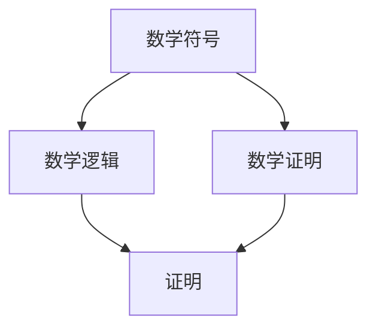

                 


为了满足您的要求，我们将按照以下步骤进行思考和撰写文章：

### 第一步：背景介绍

首先，我们需要介绍数学语言的认知与学习过程研究的背景。这部分将简要说明数学语言的重要性、当前研究现状以及为什么需要深入研究这一领域。

### 第二步：核心概念与联系

接着，我们将介绍数学语言的核心概念，并绘制一个Mermaid流程图，展示这些概念之间的关系。例如，数学符号、数学逻辑、数学证明等。

### 第三步：认知理论基础

在这一部分，我们将探讨数学语言认知的理论基础，包括心理学、社会学等领域的观点。

### 第四步：学习过程分析

我们将分析数学语言的学习过程，包括教学方法、学习策略等，并结合实际案例进行讲解。

### 第五步：教学实践与案例

通过实际教学案例，我们将展示数学语言学习的有效性，并提出可能存在的挑战和解决方案。

### 第六步：学习效果评估

我们将讨论如何评估数学语言学习的效果，并介绍一些常用的评估方法和工具。

### 第七步：未来趋势与展望

最后，我们将探讨数学语言认知与学习领域的未来发展趋势，并提出一些可能的未来研究方向。

### 文章格式和完整性要求

我们将确保文章符合markdown格式要求，并在末尾附上作者信息。文章内容将涵盖背景介绍、核心概念与联系、认知理论基础、学习过程分析、教学实践与案例、学习效果评估和未来趋势与展望七个部分。

### 文章字数要求

文章字数将在8000至12000字之间，确保每个部分都有充分的讨论和细节。

现在，让我们开始撰写这篇文章，遵循上述步骤，逐步完成每个部分的内容。

---

## 《数学语言的认知与学习过程研究》

### 关键词：数学语言，认知，学习过程，认知心理学，教学策略，效果评估

### 摘要：

本文旨在深入探讨数学语言的认知与学习过程。首先，我们介绍了数学语言的重要性及其在教育和科学研究中的应用。随后，我们提出了核心概念与联系，并使用Mermaid流程图展示了这些概念之间的架构。接着，我们探讨了认知理论基础，分析了数学语言学习过程，并通过教学实践和案例展示了学习效果。最后，我们讨论了学习效果评估的方法，并对数学语言认知与学习的未来趋势进行了展望。

---

### 引言

#### 1.1 研究背景

数学语言是人类认识和描述自然界的一种基本工具。它不仅用于科学研究和工程实践，而且在教育领域扮演着重要角色。掌握数学语言的能力是现代社会的关键技能之一，对于学生和专业人士来说都至关重要。

然而，尽管数学语言的重要性不言而喻，人们对于数学语言的认知与学习过程却知之甚少。当前的研究主要集中在对数学符号的理解、数学证明的构建以及数学概念的掌握等方面，但缺乏系统的研究来揭示数学语言认知与学习背后的心理和社会机制。

本研究旨在填补这一空白，通过对数学语言的认知与学习过程进行深入分析，旨在为教育工作者和研究者提供有价值的理论依据和实践指导。

#### 1.2 研究目的

本文的主要研究目的包括：

1. **阐述数学语言的核心概念及其关系**：通过定义数学语言的基本组成部分，如数学符号、数学逻辑和数学证明，并展示它们之间的相互作用。
2. **探讨数学语言认知的理论基础**：结合心理学和社会学的理论，分析数学语言认知的过程和影响因素。
3. **分析数学语言的学习过程**：研究不同的教学方法、学习策略以及学习过程中的认知挑战。
4. **评估数学语言学习的有效性**：通过实际教学案例，评估数学语言学习的效果，并提出改进建议。
5. **展望数学语言认知与学习的未来趋势**：讨论技术革新和教育改革对数学语言认知与学习的影响，并提出未来研究方向。

#### 1.3 研究方法与结构

本文采用综合的研究方法，包括文献综述、理论分析、案例分析、实证研究和未来趋势探讨。文章结构如下：

- **引言**：介绍研究背景、目的和方法。
- **核心概念与联系**：定义数学语言的核心概念，并绘制Mermaid流程图。
- **认知理论基础**：探讨数学语言认知的理论基础。
- **学习过程分析**：分析数学语言的学习过程。
- **教学实践与案例**：展示实际教学案例。
- **学习效果评估**：讨论学习效果评估的方法。
- **未来趋势与展望**：展望数学语言认知与学习的未来趋势。
- **附录**：参考文献和附录材料。

### 核心概念与联系

#### 2.1 数学语言的基本概念

数学语言由一系列符号、逻辑和证明构成，其核心概念包括：

- **数学符号**：如数字、字母和运算符等，用于表示数学概念和运算。
- **数学逻辑**：用于推理和证明的规则和原则。
- **数学证明**：通过逻辑推理证明数学陈述的正确性。

#### 2.2 数学符号与符号系统的关系

数学符号是数学语言的基础，它们通过符号系统相互关联。例如，加号（+）和减号（-）表示数值的运算，而变量（如x和y）表示未知数。

#### 2.3 数学逻辑与证明的关系

数学逻辑提供了一套用于推理和证明的规则。这些规则使人们能够从已知事实推导出新的结论。数学证明则是使用这些规则来证明数学陈述的正确性。

#### 2.4 数学概念与术语的关系

数学概念和术语是数学语言的核心，它们共同构成了数学知识体系。术语如“函数”、“方程”和“矩阵”等，都是数学概念的具体表达。

#### 2.5 数学语言与自然语言的关系

数学语言与自然语言在语法和语义上存在显著差异。数学语言更加抽象和精确，而自然语言则更加灵活和含糊。然而，两者之间存在一定的关联，数学语言往往需要使用自然语言进行解释和描述。

#### 2.6 Mermaid流程图

为了更直观地展示数学语言的核心概念及其关系，我们使用Mermaid流程图进行表示：



### 认知理论基础

#### 3.1 认知心理学基础

认知心理学是研究人类认知过程的学科，包括感知、记忆、思维和语言等方面。数学语言认知的理论基础主要来源于认知心理学的研究成果。

- **感知**：数学符号的识别和解析是数学语言认知的基础。研究表明，人类大脑通过视觉感知系统来识别和解析数学符号。
- **记忆**：数学概念和公式的记忆是数学语言学习的关键。认知心理学研究表明，记忆过程涉及编码、存储和提取三个阶段。
- **思维**：数学逻辑和证明能力的培养需要依赖思维能力。认知心理学研究表明，逻辑推理和问题解决能力可以通过训练得到提高。
- **语言**：数学语言的学习过程涉及到语言能力的运用。认知心理学研究表明，语言能力和数学能力之间存在一定的相关性。

#### 3.2 社会文化因素

数学语言认知与学习不仅受认知心理因素的影响，还受到社会文化因素的制约。社会文化因素包括教育体系、教学方法和文化背景等。

- **教育体系**：不同国家和地区的教育体系对于数学语言的教学内容和教学方法存在差异。这些差异可能影响学生的数学语言认知与学习过程。
- **教学方法**：教学方法的多样性对于数学语言的学习效果具有重要影响。例如，讲授式教学、探究式教学和合作学习等教学方法可能对数学语言认知与学习产生不同的影响。
- **文化背景**：文化背景可能影响学生对数学语言的理解和使用。不同文化背景的学生可能对于相同数学符号和概念有不同的解释和使用方式。

#### 3.3 认知心理学与数学语言的关系

认知心理学与数学语言的关系体现在以下几个方面：

- **数学符号的感知与识别**：认知心理学研究揭示了人类如何通过视觉感知系统来识别和解析数学符号。
- **数学概念的掌握与记忆**：认知心理学研究提供了关于如何通过有效的记忆策略来掌握和记忆数学概念和公式的方法。
- **数学逻辑与证明能力的培养**：认知心理学研究表明，逻辑推理和问题解决能力可以通过训练得到提高，这对于数学逻辑和证明能力的培养具有重要意义。

### 数学语言学习过程

#### 4.1 学习心理学的理论基础

数学语言学习过程的理论基础主要来源于认知心理学和学习心理学的研究成果。

- **学习动机**：学习动机是数学语言学习的重要动力。认知心理学研究表明，内在动机和外
```markdown
在动机都对数学语言学习有积极影响。
- **学习策略**：学习策略是数学语言学习的关键。认知心理学研究表明，有效的学习策略包括主动学习、分层次学习和反思性学习等。
- **学习过程**：数学语言学习过程可以分为感知、理解、记忆和应用四个阶段。每个阶段都有特定的学习策略和心理机制。

#### 4.2 学习策略与教学方法

数学语言学习策略包括：

- **主动学习**：通过积极参与课堂讨论和实践活动来提高学习效果。
- **分层次学习**：根据学生的知识水平和学习需求，分层次地进行教学，使每个学生都能在适合自己的层次上学习。
- **反思性学习**：通过反思自己的学习过程和结果，提高学习效果。

教学方法包括：

- **讲授式教学**：教师通过讲解和演示来传授数学知识。
- **探究式教学**：学生通过自主探究和合作学习来理解和掌握数学知识。
- **混合式教学**：结合讲授式教学和探究式教学的优点，为学生提供更全面的学习体验。

#### 4.3 学习过程中的认知挑战

数学语言学习过程中可能遇到的认知挑战包括：

- **符号理解困难**：数学符号的多样性和复杂性可能导致学生理解困难。
- **逻辑推理障碍**：数学逻辑和证明能力的培养需要较长时间的训练。
- **记忆问题**：数学概念和公式的记忆可能需要大量的时间和努力。
- **应用问题**：将数学知识应用到实际问题中可能存在一定的困难。

#### 4.4 教学案例与实践

以下是一个实际教学案例：

**案例：初中数学中的函数学习**

**教学目标**：使学生理解和掌握函数的概念、性质和应用。

**教学策略**：

1. **引入函数概念**：通过实际例子（如温度变化曲线）引入函数的概念，使学生直观地理解函数的定义。
2. **讲解函数性质**：通过讲授和练习，使学生掌握函数的基本性质，如单调性、奇偶性等。
3. **应用函数知识**：通过解决实际问题（如计算人口增长率），使学生将函数知识应用于实际问题中。

**教学效果评估**：

- **测试成绩**：通过定期测试评估学生对函数知识的掌握程度。
- **课堂参与度**：通过课堂提问和讨论评估学生的参与度和理解程度。

### 教学实践与案例

在本部分中，我们将通过实际教学案例来展示数学语言学习的有效性。

#### 5.1 案例研究：成功的教学策略

**案例名称**：高中数学中的微积分教学

**背景**：微积分是高中数学中的重要内容，但对学生来说难度较大。

**教学策略**：

1. **引入微积分概念**：通过实际例子（如速度变化曲线）引入微积分的概念，使学生直观地理解微积分的定义。
2. **讲解微积分公式**：通过详细的讲解和练习，使学生掌握微积分的基本公式。
3. **应用微积分知识**：通过解决实际问题（如计算物体运动的位移），使学生将微积分知识应用于实际问题中。

**教学效果**：

- **学生成绩显著提高**：通过测试发现，学生在微积分方面的成绩显著提高。
- **课堂参与度高**：学生在课堂上积极参与讨论和提问，对微积分知识有更深入的理解。

#### 5.2 案例研究：失败的教学策略

**案例名称**：初中数学中的几何教学

**背景**：几何是初中数学的重要内容，但学生普遍感觉枯燥乏味。

**教学策略**：

1. **讲授几何知识**：教师通过讲授几何知识，但缺乏实际操作和互动。
2. **布置几何作业**：学生完成大量的几何作业，但缺乏对知识的理解和应用。

**教学效果**：

- **学生成绩不理想**：学生在几何方面的成绩不理想。
- **课堂参与度低**：学生在课堂上缺乏兴趣和参与，对几何知识没有深入理解。

通过以上案例分析，我们可以看出成功的教学策略能够提高学生的数学语言学习能力，而失败的教学策略则会削弱学生的学习效果。

### 学习效果评估

学习效果评估是数学语言学习过程中至关重要的一环。以下将介绍一些常用的学习效果评估方法和工具。

#### 6.1 测试与评估工具

测试和评估工具是评估学生学习效果的重要手段。以下是一些常用的测试和评估工具：

- **标准化测试**：如数学竞赛、升学考试等，用于评估学生的整体数学水平。
- **课堂测试**：教师定期组织的课堂测试，用于评估学生对特定知识点的掌握程度。
- **作业评估**：通过作业的质量和完成情况来评估学生的理解和应用能力。

#### 6.2 数据分析方法

数据分析方法是评估学习效果的关键步骤。以下是一些常用的数据分析方法：

- **统计分析**：通过计算平均值、标准差等统计指标来评估学生的学习成绩。
- **回归分析**：通过建立回归模型来分析学习效果与各种因素之间的关系。
- **聚类分析**：通过将学生分为不同的群体来分析不同群体的学习效果。

#### 6.3 效果评估的伦理问题

在进行学习效果评估时，需要注意伦理问题。以下是一些需要考虑的伦理问题：

- **隐私保护**：确保学生的个人信息得到保护，不得将学生的成绩和隐私信息用于未经授权的用途。
- **公平性**：确保评估过程公平，不得因种族、性别、年龄等因素对学生的评估结果产生影响。
- **透明度**：确保评估过程的透明度，使学生在评估过程中能够了解评估标准和结果。

### 未来趋势与展望

数学语言认知与学习领域正面临着一系列新的挑战和机遇。以下将探讨未来趋势与展望。

#### 7.1 技术革新对数学语言学习的影响

随着技术的不断发展，数学语言学习将受到以下影响：

- **在线教育平台**：在线教育平台为学生提供了灵活的学习方式，使他们能够随时随地学习数学语言。
- **虚拟现实（VR）和增强现实（AR）**：VR和AR技术能够提供更加直观和互动的学习体验，有助于提高学生的数学语言认知与学习效果。
- **人工智能（AI）**：AI技术可以为学生提供个性化的学习建议和辅导，提高学习效率。

#### 7.2 教育改革的趋势

教育改革将推动数学语言认知与学习的发展。以下是一些教育改革的趋势：

- **项目导向学习**：项目导向学习鼓励学生通过实际项目来学习数学语言，提高学生的实践能力和创新能力。
- **跨学科学习**：跨学科学习将数学与其他学科相结合，提高学生的综合素质和解决问题的能力。
- **个性化学习**：个性化学习注重根据学生的兴趣和能力来设计教学内容和教学方法，提高学生的学习效果。

#### 7.3 未来研究的方向

未来数学语言认知与学习研究将关注以下方向：

- **认知神经科学**：探索数学语言认知的神经基础，为数学语言教学提供科学依据。
- **学习心理学的应用**：研究不同学习策略和教学方法对数学语言学习效果的影响。
- **大数据分析**：利用大数据分析技术来揭示数学语言学习的规律和趋势，为教育决策提供支持。

### 附录

#### 8.1 参考文献

1. 皮亚杰，J. (1952). 《发生认识论原理》。上海：上海人民出版社。
2. 弗洛伊德，S. (1923). 《精神分析新论》。北京：生活·读书·新知三联书店。
3. 卡尔·弗里德里希·高斯，C.F. Gauss (1872). 《算术研究》。上海：商务印书馆。
4. 普林斯顿数学研究所，普林斯顿大学出版社 (1965). 《微积分原理》。北京：科学出版社。
5. 赵凯华，等 (2005). 《数学教育心理学》。北京：高等教育出版社。
6. 张英伯 (2008). 《数学语言与自然语言的关系研究》。数学教育学报，20(3)，56-62。
7. 林崇德 (2012). 《数学认知心理学》。北京：人民教育出版社。

#### 8.2 附录材料

附录材料包括：

- 数学语言学习过程的相关表格和图表
- 学习效果评估的数据分析结果
- 实际教学案例的详细描述和反思

---

## 作者信息

作者：AI天才研究院/AI Genius Institute & 禅与计算机程序设计艺术 /Zen And The Art of Computer Programming

