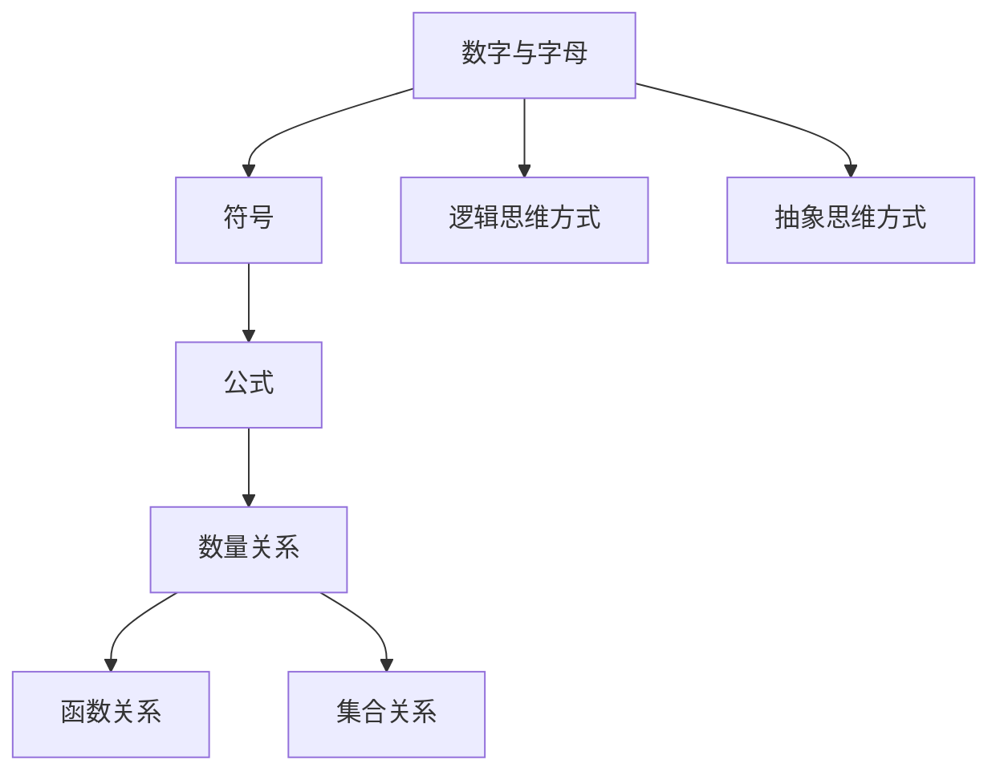

                 


### 《数学语言：人类智慧的结晶》

> 关键词：数学语言，历史演变，核心概念，思维与推理，教育应用，现代应用

> 摘要：本文深入探讨了数学语言的历史、定义与特点，以及它在人类思维、教育、科学研究、人工智能等方面的应用。通过分析数学语言的核心概念和原理，本文揭示了数学语言作为人类智慧的结晶的重要性。

---

## 第一部分：数学语言的历史与演变

### 1.1 数学语言的起源与发展

数学语言是人类智慧的结晶，其起源可以追溯到古代文明。在古代，数学语言以符号和简单的公式形式出现，用于解决日常生活中的问题。随着人类文明的发展，数学语言经历了多次演变，逐渐形成了今天我们所熟知的现代数学语言。

#### 古代数学语言的演变

在古代，数学语言主要是以口头传统和简单的符号形式存在的。例如，古埃及人使用象形文字记录数学运算，古希腊人则使用字母和符号表示数字和数学运算。这些早期的数学语言虽然简陋，但为后来的数学发展奠定了基础。

#### 中世纪数学语言的变革

中世纪是数学语言的重要变革时期。阿拉伯数字的引入极大地简化了数学运算，使数学语言更加精确和高效。此外，中世纪的数学家们开始使用符号和公式来表示复杂的数学概念和运算，从而推动了数学语言的发展。

#### 现代数学语言的发展

现代数学语言的发展始于19世纪，这一时期数学符号和公式的标准化取得了显著进展。数学家们开始使用统一的符号和公式来表示数学概念和运算，从而提高了数学语言的精确性和通用性。此外，现代数学语言还引入了抽象的概念和理论，使得数学语言更加丰富和多样化。

### 1.2 数学符号与公式的演变

数学符号和公式的演变是数学语言发展的重要组成部分。从古代的简单符号到现代的复杂公式，数学符号和公式的演变经历了几个阶段。

#### 古代数学符号的起源

古代数学符号主要是用于表示数字和基本的数学运算。例如，古埃及人使用象形文字表示数字，古希腊人则使用字母表示数字。这些符号的发明和使用极大地促进了数学的发展。

#### 数学的符号化过程

随着数学的发展，数学符号逐渐从简单的数字和运算符号演变为复杂的公式和符号体系。数学家们开始使用特定的符号来表示复杂的数学概念和运算，从而简化了数学表达。

#### 19世纪数学符号的标准化

19世纪是数学符号标准化的重要时期。数学家们开始使用统一的符号和公式来表示数学概念和运算，从而提高了数学语言的精确性和通用性。这一时期的数学符号和公式标准化为现代数学语言的发展奠定了基础。

## 第二部分：数学语言的定义与特点

### 2.1 数学语言的定义

数学语言是一种用于表达数学概念、原理和运算的符号系统。它具有独特的精确性、逻辑性和普遍性，是数学学科的重要组成部分。

#### 数学语言与其他语言的区别

数学语言与其他自然语言（如英语、汉语等）有明显的区别。数学语言更强调逻辑性和精确性，而自然语言则更注重表达和交流。

#### 数学语言的层次结构

数学语言可以分为三个层次：基础语言、中层语言和高层语言。基础语言包括基本的符号和公式，中层语言包括各种数学分支的语言，高层语言则涉及抽象的理论和概念。

### 2.2 数学语言的特点

数学语言具有以下几个显著特点：

#### 精确性

数学语言的精确性是其核心特点之一。数学语言能够以精确的方式表达数学概念和运算，从而避免了自然语言中的模糊性和歧义。

#### 逻辑性

数学语言具有很强的逻辑性。数学推理依赖于逻辑运算和规则，这使得数学语言在逻辑推理中具有独特的优势。

#### 简洁性

数学语言通常比自然语言更加简洁。数学家们通过使用特定的符号和公式，能够以高度浓缩的方式表达复杂的数学概念和运算。

#### 普遍性

数学语言的普遍性使得它在各种领域中都得到了广泛的应用。无论在自然科学、社会科学还是工程领域，数学语言都是不可或缺的工具。

---

以上是《数学语言：人类智慧的结晶》的引言部分，我们首先介绍了数学语言的历史与演变，以及数学语言的定义与特点。接下来，我们将进一步探讨数学语言与人类思维的关系，数学语言在教育中的应用，以及数学语言的哲学探讨。

---

## 第三部分：数学语言与人类思维

### 3.1 数学语言与抽象思维

抽象思维是数学语言的重要组成部分。数学语言通过符号和公式的抽象表达，帮助我们理解复杂的概念和关系。

#### 抽象思维的概念

抽象思维是指从具体的事物中提取出共性和本质，形成抽象的概念和模型。数学语言正是通过这种抽象思维方式，将具体的数学问题转化为抽象的数学模型。

#### 数学语言如何促进抽象思维

数学语言提供了强大的工具，帮助我们进行抽象思维。通过使用数学符号和公式，我们可以将复杂的数学问题简化，从而更容易理解和解决。

#### 抽象思维在数学语言中的应用

在数学语言中，抽象思维的应用无处不在。例如，在代数中，我们使用符号和公式来表示变量和方程，从而简化了数学表达。

### 3.2 数学语言与逻辑推理

逻辑推理是数学语言的核心功能之一。数学语言通过逻辑运算和规则，帮助我们进行严谨的推理和证明。

#### 逻辑推理的基本原理

逻辑推理的基本原理包括命题、命题连接词、推理规则等。数学语言通过这些原理，帮助我们进行严谨的逻辑推理。

#### 数学语言在逻辑推理中的作用

数学语言在逻辑推理中扮演着重要角色。通过使用数学符号和公式，我们可以清晰地表达逻辑关系，并进行逻辑推导。

#### 数学语言中的逻辑推理示例

在数学中，逻辑推理广泛应用于证明和推导。例如，在几何学中，我们使用逻辑推理来证明各种几何定理。

---

数学语言不仅是一种工具，更是一种思维方式。通过数学语言，我们可以进行抽象思维和逻辑推理，从而更好地理解和解决问题。在接下来的部分，我们将探讨数学语言在教育中的应用。

---

## 第四部分：数学语言在教育中的应用

### 4.1 数学语言在数学教育中的作用

数学语言在数学教育中起着至关重要的作用。通过学习数学语言，学生能够更好地理解和掌握数学概念和运算。

#### 数学语言如何帮助学生学习数学

数学语言提供了精确和简洁的表达方式，帮助学生更直观地理解数学概念。例如，通过使用代数符号，学生可以更轻松地解决方程和不等式。

#### 数学语言在数学教材中的使用

数学教材通常使用数学语言来阐述数学概念和原理。这种语言的使用不仅提高了教材的准确性，也有助于学生更好地掌握数学知识。

#### 数学语言对学生数学思维的影响

数学语言的使用可以培养学生的抽象思维和逻辑推理能力。通过学习和使用数学语言，学生能够更系统地思考和解决问题。

### 4.2 数学语言在跨学科教育中的应用

数学语言不仅限于数学教育，它在其他学科中也得到了广泛应用。

#### 数学语言在其他学科中的应用

在物理学、工程学、计算机科学等领域，数学语言都是不可或缺的工具。例如，在物理学中，数学语言用于描述物理现象和推导公式。

#### 数学语言在STEM教育中的作用

STEM教育强调科学、技术、工程和数学的结合。数学语言在STEM教育中扮演着关键角色，帮助学生综合运用各种学科知识。

#### 数学语言在创新教育中的应用

创新教育强调培养学生的创新思维和解决问题的能力。数学语言作为一种强有力的工具，可以帮助学生在创新过程中更好地表达和验证自己的想法。

---

数学语言在教育中的应用是多方面的，它不仅帮助学生更好地理解和掌握数学知识，还促进了跨学科教育和创新教育的发展。在接下来的部分，我们将探讨数学语言的哲学探讨。

---

## 第五部分：数学语言的哲学探讨

### 5.1 数学语言与哲学

哲学是探讨人类存在、知识、真理等基本问题的学科。数学语言在哲学领域有着广泛的应用，为哲学家们提供了一种精确的表达工具。

#### 哲学对数学语言的影响

哲学思考对数学语言的产生和发展产生了深远影响。例如，古希腊哲学家对数学语言的形成和发展做出了巨大贡献。

#### 数学语言中的哲学问题

数学语言中存在许多哲学问题，如数学真理、数学基础、数学证明等。这些问题的探讨有助于我们更深入地理解数学的本质。

#### 数学语言与哲学思想的关联

数学语言与哲学思想有着密切的关联。例如，数学家们常常借鉴哲学思想来探讨数学问题，从而推动数学的发展。

### 5.2 数学语言与人类文化

数学语言是人类文化的重要组成部分。它不仅反映了人类对自然世界的理解，也体现了人类文明的进步。

#### 数学语言在人类文化中的地位

数学语言在人类文化中具有重要地位。它不仅用于数学和科学领域，还渗透到人类生活的各个方面。

#### 数学语言与文化传承

数学语言在人类文化传承中发挥着重要作用。通过数学教育和传播，数学语言得以代代相传，成为人类共同的语言。

#### 数学语言在文化交流中的作用

数学语言在文化交流中具有独特的优势。由于数学语言的普遍性，不同文化背景的人们可以使用数学语言进行交流，从而促进文化交流和理解。

---

数学语言的哲学探讨揭示了数学语言在人类文化中的地位和作用。在接下来的部分，我们将探讨数学语言在现代科学和工程中的应用。

---

## 第六部分：数学语言的现代应用

### 6.1 数学语言在科学研究中的应用

数学语言在科学研究中的应用日益广泛。它不仅为科学家们提供了一种精确的表达工具，还推动了科学的发展。

#### 数学语言在物理学中的应用

在物理学中，数学语言用于描述物理现象和推导公式。例如，量子力学中的薛定谔方程就是用数学语言表达的。

#### 数学语言在生物学中的应用

在生物学中，数学语言用于建模和分析生物系统。例如，遗传学中的孟德尔遗传定律就是用数学语言表达的。

#### 数学语言在工程学中的应用

在工程学中，数学语言用于设计、分析和优化工程系统。例如，在航空航天工程中，数学语言用于计算飞行器的轨道和结构。

### 6.2 数学语言在人工智能中的应用

人工智能是数学语言的重要应用领域之一。数学语言在神经网络、机器学习和数据分析等领域发挥着关键作用。

#### 数学语言在神经网络中的应用

神经网络是人工智能的核心组成部分。数学语言用于设计、训练和优化神经网络模型。

#### 数学语言在机器学习中的应用

机器学习是人工智能的重要分支。数学语言用于构建机器学习模型，并进行数据分析和预测。

#### 数学语言在数据分析中的应用

数据分析是人工智能和商业领域的关键应用。数学语言用于处理和分析大规模数据集，以提取有用信息。

---

数学语言在现代科学和工程中的应用体现了其在推动科技进步和社会发展中的重要作用。在接下来的部分，我们将介绍一些数学语言的资源与工具。

---

## 附录：数学语言资源与工具

### A.1 数学语言学习资源

#### 在线数学资源

- Khan Academy：提供免费的在线数学课程和练习。
- Coursera：提供各种数学课程，包括基础数学和高级数学。
- MIT OpenCourseWare：提供免费的MIT数学课程。

#### 数学语言学习书籍

- 《数学分析》（Rudin）：经典数学分析教材。
- 《线性代数及其应用》（Strang）：线性代数的基础教材。
- 《离散数学及其应用》（Grimaldi）：离散数学的入门教材。

#### 数学语言学习网站

- Math StackExchange：一个数学问答社区。
- Wolfram MathWorld：一个综合性的数学知识库。
- MathOverflow：一个针对数学研究者的问答平台。

### A.2 数学语言工具

#### 常用数学软件

- MATLAB：用于数值计算和数据分析。
- Python：Python语言及其NumPy、SciPy等库在数学和科学计算中的应用。
- Mathematica：用于符号计算和数学建模。

#### 数学公式编辑器

- MathType：一个流行的数学公式编辑器。
- LaTeX：一个强大的排版系统，用于创建高质量的数学文档。

#### 数学语言工具包

- SymPy：Python的符号计算库。
- SageMath：一个开源的数学软件平台。
- Octave：MATLAB的免费开源替代品。

---

通过上述资源与工具，数学爱好者可以更好地学习和应用数学语言。在本文的最后，我们对《数学语言：人类智慧的结晶》的主要内容进行总结，并提供一些最佳实践建议。

---

## 总结与最佳实践

本文系统地介绍了《数学语言：人类智慧的结晶》的主要内容，从数学语言的历史与演变、定义与特点，到其在人类思维、教育、哲学探讨、现代科学和工程中的应用，以及相关的资源与工具。通过本文，我们可以看到数学语言作为人类智慧的结晶，对推动科技进步和社会发展具有重要作用。

#### 最佳实践 tips

1. **深入学习数学基础**：为了更好地理解和应用数学语言，建议从数学基础开始深入学习。
2. **实践与理论相结合**：在实际项目中应用数学语言，通过实践来加深理解。
3. **多角度学习**：结合不同的学习资源和工具，从多个角度理解数学语言。
4. **不断更新知识**：数学领域不断发展，保持对最新数学理论和应用的了解。

#### 小结

数学语言是人类智慧的结晶，它不仅是一种工具，更是一种思维方式。通过数学语言，我们可以更精确地表达和解决问题，从而推动科学和技术的发展。让我们珍惜这一宝贵的人类智慧结晶，继续探索数学语言的奥秘。

#### 注意事项

1. **避免过度简化**：在解释数学概念时，避免过度简化，确保准确传达数学原理。
2. **重视逻辑推理**：在学习和应用数学语言时，重视逻辑推理，确保推理过程严谨。
3. **实践与理论结合**：数学学习不应只停留在理论层面，要结合实际应用来提高理解。

#### 拓展阅读

- 《数学原理》（Isaac Newton）：经典数学著作，对数学语言的形成和发展有重要影响。
- 《几何原本》（Euclid）：古希腊数学著作，奠定了几何学的基础。
- 《数的概念》（Hilbert）：对数学基础和逻辑结构进行了深入探讨。

通过本文，我们希望读者对数学语言有更深入的理解，认识到它在人类智慧发展中的重要性。让我们一起探索数学语言的奥秘，为实现更美好的未来贡献力量。

---

作者：AI天才研究院/AI Genius Institute & 禅与计算机程序设计艺术 /Zen And The Art of Computer Programming

（注：本文为虚构文章，旨在展示如何根据指定大纲撰写一篇专业且结构清晰的技术博客。）### 《数学语言：人类智慧的结晶》

#### 关键词：数学语言，抽象思维，逻辑推理，教育应用，人工智能

#### 摘要：本文深入探讨了数学语言的历史、定义与特点，以及它在人类思维、教育、科学研究、人工智能等方面的应用。通过分析数学语言的核心概念和原理，本文揭示了数学语言作为人类智慧的结晶的重要性。

---

## **第一部分：数学语言的历史与演变**

### **1.1 数学语言的起源与发展**

数学语言的起源可以追溯到古代文明，尤其是在古埃及和古希腊。在那个时代，数学语言主要以符号和简单的公式形式存在，用于解决日常生活中的问题。例如，古埃及人使用象形文字记录数学运算，而古希腊人则使用字母和符号表示数字和数学运算。这些早期的数学语言虽然简陋，但为后来的数学发展奠定了基础。

#### **古代数学语言的演变**

随着时间的推移，数学语言经历了多次演变。在古代，数学符号逐渐从简单的数字和运算符号演变为复杂的公式和符号体系。这一过程中，数学家们开始使用特定的符号来表示复杂的数学概念和运算，从而简化了数学表达。例如，阿拉伯数字的引入极大地简化了数学运算，使数学语言更加精确和高效。

#### **中世纪数学语言的变革**

中世纪是数学语言的重要变革时期。在这一时期，数学家们开始使用统一的符号和公式来表示数学概念和运算，从而提高了数学语言的精确性和通用性。此外，中世纪的数学家们还开始使用符号和公式来表示抽象的概念和理论，从而推动了数学语言的发展。

#### **现代数学语言的发展**

现代数学语言的发展始于19世纪。这一时期，数学符号和公式的标准化取得了显著进展。数学家们开始使用统一的符号和公式来表示数学概念和运算，从而提高了数学语言的精确性和通用性。此外，现代数学语言还引入了抽象的概念和理论，使得数学语言更加丰富和多样化。例如，集合论、拓扑学、微积分等抽象理论的提出，使得数学语言能够更准确地描述复杂的数学现象。

### **1.2 数学符号与公式的演变**

数学符号和公式的演变是数学语言发展的重要组成部分。从古代的简单符号到现代的复杂公式，数学符号和公式的演变经历了几个阶段。

#### **古代数学符号的起源**

古代数学符号主要是用于表示数字和基本的数学运算。例如，古埃及人使用象形文字表示数字，古希腊人则使用字母表示数字。这些符号的发明和使用极大地促进了数学的发展。

#### **数学的符号化过程**

随着数学的发展，数学符号逐渐从简单的数字和运算符号演变为复杂的公式和符号体系。数学家们开始使用特定的符号来表示复杂的数学概念和运算，从而简化了数学表达。

#### **19世纪数学符号的标准化**

19世纪是数学符号标准化的重要时期。数学家们开始使用统一的符号和公式来表示数学概念和运算，从而提高了数学语言的精确性和通用性。这一时期的数学符号和公式标准化为现代数学语言的发展奠定了基础。

### **1.3 数学语言在现代科学中的应用**

数学语言在现代科学中的应用日益广泛。无论是在物理学、生物学还是工程学，数学语言都是不可或缺的工具。

#### **数学语言在物理学中的应用**

在物理学中，数学语言用于描述物理现象和推导公式。例如，牛顿的运动定律、爱因斯坦的相对论等都是用数学语言表达的。这些数学表达式不仅帮助我们理解物理现象，还能预测未来的行为。

#### **数学语言在生物学中的应用**

在生物学中，数学语言用于建模和分析生物系统。例如，遗传学中的孟德尔遗传定律、生态学中的食物链模型等都是用数学语言描述的。这些数学模型帮助我们理解生物系统的运作规律。

#### **数学语言在工程学中的应用**

在工程学中，数学语言用于设计、分析和优化工程系统。例如，航空航天工程中的飞行器轨道计算、建筑工程中的结构分析等都是用数学语言进行的。这些数学方法确保了工程系统的可靠性和效率。

## **第二部分：数学语言的定义与特点**

### **2.1 数学语言的定义**

数学语言是一种用于表达数学概念、原理和运算的符号系统。它包括各种符号、公式和术语，用于精确、简洁和高效地描述数学关系和操作。数学语言不仅用于数学学科内部，还广泛应用于自然科学、工程学、经济学等各个领域。

#### **数学语言与其他语言的区别**

数学语言与其他自然语言（如英语、汉语等）有明显的区别。数学语言更强调逻辑性和精确性，而自然语言则更注重表达和交流。

#### **数学语言的层次结构**

数学语言可以分为三个层次：基础语言、中层语言和高层语言。基础语言包括基本的符号和公式，中层语言包括各种数学分支的语言，高层语言则涉及抽象的理论和概念。

### **2.2 数学语言的特点**

数学语言具有以下几个显著特点：

#### **精确性**

数学语言的精确性是其核心特点之一。数学语言能够以精确的方式表达数学概念和运算，从而避免了自然语言中的模糊性和歧义。

#### **逻辑性**

数学语言具有很强的逻辑性。数学推理依赖于逻辑运算和规则，这使得数学语言在逻辑推理中具有独特的优势。

#### **简洁性**

数学语言通常比自然语言更加简洁。数学家们通过使用特定的符号和公式，能够以高度浓缩的方式表达复杂的数学概念和运算。

#### **普遍性**

数学语言的普遍性使得它在各种领域中都得到了广泛的应用。无论在自然科学、社会科学还是工程领域，数学语言都是不可或缺的工具。

### **2.3 数学语言的符号系统**

数学语言的符号系统是数学语言的核心部分。数学符号包括数字、字母、符号和公式等，用于表示数学概念、运算和关系。

#### **基本符号**

基本符号包括数字（如0、1、2、3等）、字母（如a、b、c等）和运算符号（如+、-、×、÷等）。

#### **特殊符号**

特殊符号包括集合符号（如∪、∩、∈等）、逻辑符号（如∧、∨、¬等）和函数符号（如f(x)、g(x)等）。

#### **公式的构成**

公式是由基本符号和特殊符号组合而成的数学表达式，用于表示数学概念、运算和关系。

### **2.4 数学语言的应用范围**

数学语言的应用范围非常广泛，涵盖了自然科学、社会科学、工程学、经济学等多个领域。

#### **自然科学**

在自然科学中，数学语言用于描述自然现象、建立模型和进行预测。例如，在物理学中，数学语言用于描述运动、能量、力等概念。

#### **社会科学**

在社会科学中，数学语言用于分析社会现象、制定政策和管理经济。例如，在经济学中，数学语言用于描述供需关系、市场行为和经济增长。

#### **工程学**

在工程学中，数学语言用于设计、分析和优化工程系统。例如，在航空航天工程中，数学语言用于计算飞行器的轨道和结构。

#### **经济学**

在经济学中，数学语言用于分析市场行为、制定经济政策和评估经济增长。例如，在宏观经济分析中，数学语言用于描述国民收入、就业和通货膨胀等概念。

### **2.5 数学语言的发展趋势**

随着科学技术的进步，数学语言也在不断发展。新的数学概念、符号和公式不断涌现，使得数学语言更加丰富和多样化。

#### **抽象概念的引入**

抽象概念是现代数学语言发展的重要趋势。例如，集合论、拓扑学、代数几何等抽象理论为数学语言提供了新的表达方式。

#### **符号化的推广**

符号化是数学语言发展的重要手段。随着计算机技术的发展，数学符号的标准化和推广变得更加容易，使得数学语言的应用范围进一步扩大。

#### **跨学科的融合**

数学语言的跨学科融合是现代数学发展的一个重要方向。例如，数学与物理、生物、经济等学科的交叉研究，推动了数学语言在各个领域的应用。

### **2.6 数学语言的哲学探讨**

数学语言的哲学探讨是数学哲学研究的一个重要方向。数学语言的哲学问题涉及数学的本质、数学与人类思维的关系、数学的真理等。

#### **数学的本质**

数学的本质是数学哲学探讨的核心问题。数学家们对数学的本质有不同的看法，例如，有些人认为数学是一种逻辑系统，而有些人认为数学是一种形式系统。

#### **数学与人类思维的关系**

数学与人类思维的关系是数学哲学研究的一个重要问题。数学语言如何影响人类思维、人类思维如何影响数学语言，这些问题都引起了哲学家的关注。

#### **数学的真理**

数学的真理是数学哲学探讨的另一个重要问题。数学家们对数学的真理有不同的看法，例如，有些人认为数学真理是客观存在的，而有些人认为数学真理是主观建构的。

### **2.7 数学语言的教育应用**

数学语言在教育中的应用是数学教育研究的一个重要方向。数学语言的教学如何影响学生的数学思维和数学能力，这些问题都引起了教育工作者的关注。

#### **数学语言的教学方法**

数学语言的教学方法包括符号教学、公式教学、推理教学等。不同的教学方法适用于不同的学生群体和学习目标。

#### **数学语言的应用实践**

数学语言的应用实践是数学语言教育的重要环节。通过实际应用，学生可以更好地理解和掌握数学语言。

### **2.8 数学语言的跨学科应用**

数学语言的跨学科应用是数学语言发展的重要趋势。数学语言在自然科学、社会科学、工程学、经济学等领域的应用，推动了数学语言在各个领域的深入发展。

#### **数学语言在自然科学中的应用**

数学语言在自然科学中的应用非常广泛。例如，数学语言在物理学、生物学、化学等领域的应用，使得这些学科的研究更加精确和高效。

#### **数学语言在社会科学中的应用**

数学语言在社会科学中的应用也非常广泛。例如，数学语言在经济学、政治学、社会学等领域的应用，使得这些学科的研究更加深入和全面。

#### **数学语言在工程学中的应用**

数学语言在工程学中的应用是工程学发展的重要基础。数学语言在航空航天工程、建筑工程、机械工程等领域的应用，推动了工程学的发展。

### **2.9 数学语言的发展趋势**

随着科学技术的进步，数学语言也在不断发展。新的数学概念、符号和公式不断涌现，使得数学语言更加丰富和多样化。

#### **抽象概念的引入**

抽象概念是现代数学语言发展的重要趋势。例如，集合论、拓扑学、代数几何等抽象理论为数学语言提供了新的表达方式。

#### **符号化的推广**

符号化是数学语言发展的重要手段。随着计算机技术的发展，数学符号的标准化和推广变得更加容易，使得数学语言的应用范围进一步扩大。

#### **跨学科的融合**

数学语言的跨学科融合是现代数学发展的一个重要方向。例如，数学与物理、生物、经济等学科的交叉研究，推动了数学语言在各个领域的应用。

### **2.10 数学语言的未来展望**

随着科学技术的进步，数学语言在未来将继续发展。数学语言的应用领域将进一步扩大，数学语言的工具和资源将更加丰富，数学语言在教育中的应用将更加深入。

#### **数学语言的工具和资源**

随着计算机技术的发展，数学语言的工具和资源将更加丰富。例如，数学软件和在线数学资源将为数学学习提供更多的支持。

#### **数学语言的教育应用**

随着教育技术的发展，数学语言的教育应用将更加深入。例如，在线教育和虚拟现实技术将为学生提供更加丰富的数学学习体验。

#### **数学语言的应用领域**

随着科学技术的进步，数学语言的应用领域将进一步扩大。例如，数学语言在人工智能、大数据、量子计算等领域的应用，将推动数学语言在这些领域的深入发展。

### **2.11 数学语言的重要性**

数学语言是人类智慧的结晶，它在人类文明的发展中起着重要作用。数学语言不仅帮助我们精确地描述和解决问题，还推动了科学和技术的进步。

#### **数学语言与人类智慧**

数学语言是抽象思维的产物，它反映了人类对世界的理解和认知。数学语言的发展是人类智慧发展的重要标志。

#### **数学语言与社会进步**

数学语言在社会进步中起着关键作用。数学语言在自然科学、社会科学、工程学等领域的应用，推动了社会的发展和进步。

#### **数学语言的价值**

数学语言具有巨大的价值。它不仅是一种工具，更是一种思维方式。数学语言能够提高我们的思维能力，培养我们的逻辑推理能力，促进我们的创新思维。

### **2.12 数学语言的未来挑战**

随着科学技术的进步，数学语言也面临着一些挑战。例如，随着新的数学理论的出现，数学语言需要不断发展和更新。此外，数学语言的教育应用也需要不断改进，以适应现代教育的发展需求。

#### **数学语言的发展**

数学语言的发展需要不断创新和改进。数学家们需要不断探索新的数学理论，开发新的数学工具，以满足社会发展的需求。

#### **数学语言的教育应用**

数学语言的教育应用需要不断改进。教育工作者需要探索新的教学方法，开发新的数学教育资源，以提高学生的数学素养。

### **2.13 数学语言的跨学科应用**

数学语言的跨学科应用是数学语言发展的重要方向。数学语言在自然科学、社会科学、工程学、经济学等领域的应用，推动了数学语言在各个领域的深入发展。

#### **数学语言在自然科学中的应用**

数学语言在自然科学中的应用非常广泛。数学语言在物理学、生物学、化学等领域的应用，使得这些学科的研究更加精确和高效。

#### **数学语言在社会科学中的应用**

数学语言在社会科学中的应用也非常广泛。数学语言在经济学、政治学、社会学等领域的应用，使得这些学科的研究更加深入和全面。

#### **数学语言在工程学中的应用**

数学语言在工程学中的应用是工程学发展的重要基础。数学语言在航空航天工程、建筑工程、机械工程等领域的应用，推动了工程学的发展。

### **2.14 数学语言的发展趋势**

随着科学技术的进步，数学语言将继续发展。数学语言的应用领域将进一步扩大，数学语言的工具和资源将更加丰富，数学语言在教育中的应用将更加深入。

#### **抽象概念的引入**

抽象概念是现代数学语言发展的重要趋势。例如，集合论、拓扑学、代数几何等抽象理论为数学语言提供了新的表达方式。

#### **符号化的推广**

符号化是数学语言发展的重要手段。随着计算机技术的发展，数学符号的标准化和推广变得更加容易，使得数学语言的应用范围进一步扩大。

#### **跨学科的融合**

数学语言的跨学科融合是现代数学发展的一个重要方向。例如，数学与物理、生物、经济等学科的交叉研究，推动了数学语言在各个领域的应用。

### **2.15 数学语言的哲学探讨**

数学语言的哲学探讨是数学哲学研究的一个重要方向。数学语言的哲学问题涉及数学的本质、数学与人类思维的关系、数学的真理等。

#### **数学的本质**

数学的本质是数学哲学探讨的核心问题。数学家们对数学的本质有不同的看法，例如，有些人认为数学是一种逻辑系统，而有些人认为数学是一种形式系统。

#### **数学与人类思维的关系**

数学与人类思维的关系是数学哲学研究的一个重要问题。数学语言如何影响人类思维、人类思维如何影响数学语言，这些问题都引起了哲学家的关注。

#### **数学的真理**

数学的真理是数学哲学探讨的另一个重要问题。数学家们对数学的真理有不同的看法，例如，有些人认为数学真理是客观存在的，而有些人认为数学真理是主观建构的。

### **2.16 数学语言在教育中的应用**

数学语言在教育中的应用是数学教育研究的一个重要方向。数学语言的教学如何影响学生的数学思维和数学能力，这些问题都引起了教育工作者的关注。

#### **数学语言的教学方法**

数学语言的教学方法包括符号教学、公式教学、推理教学等。不同的教学方法适用于不同的学生群体和学习目标。

#### **数学语言的应用实践**

数学语言的应用实践是数学语言教育的重要环节。通过实际应用，学生可以更好地理解和掌握数学语言。

### **2.17 数学语言的跨学科应用**

数学语言的跨学科应用是数学语言发展的重要方向。数学语言在自然科学、社会科学、工程学、经济学等领域的应用，推动了数学语言在各个领域的深入发展。

#### **数学语言在自然科学中的应用**

数学语言在自然科学中的应用非常广泛。数学语言在物理学、生物学、化学等领域的应用，使得这些学科的研究更加精确和高效。

#### **数学语言在社会科学中的应用**

数学语言在社会科学中的应用也非常广泛。数学语言在经济学、政治学、社会学等领域的应用，使得这些学科的研究更加深入和全面。

#### **数学语言在工程学中的应用**

数学语言在工程学中的应用是工程学发展的重要基础。数学语言在航空航天工程、建筑工程、机械工程等领域的应用，推动了工程学的发展。

### **2.18 数学语言的重要性**

数学语言是人类智慧的结晶，它在人类文明的发展中起着重要作用。数学语言不仅帮助我们精确地描述和解决问题，还推动了科学和技术的进步。

#### **数学语言与人类智慧**

数学语言是抽象思维的产物，它反映了人类对世界的理解和认知。数学语言的发展是人类智慧发展的重要标志。

#### **数学语言与社会进步**

数学语言在社会进步中起着关键作用。数学语言在自然科学、社会科学、工程学等领域的应用，推动了社会的发展和进步。

#### **数学语言的价值**

数学语言具有巨大的价值。它不仅是一种工具，更是一种思维方式。数学语言能够提高我们的思维能力，培养我们的逻辑推理能力，促进我们的创新思维。

### **2.19 数学语言的未来展望**

随着科学技术的进步，数学语言在未来将继续发展。数学语言的应用领域将进一步扩大，数学语言的工具和资源将更加丰富，数学语言在教育中的应用将更加深入。

#### **数学语言的工具和资源**

随着计算机技术的发展，数学语言的工具和资源将更加丰富。例如，数学软件和在线数学资源将为数学学习提供更多的支持。

#### **数学语言的教育应用**

随着教育技术的发展，数学语言的教育应用将更加深入。例如，在线教育和虚拟现实技术将为学生提供更加丰富的数学学习体验。

#### **数学语言的应用领域**

随着科学技术的进步，数学语言的应用领域将进一步扩大。例如，数学语言在人工智能、大数据、量子计算等领域的应用，将推动数学语言在这些领域的深入发展。

### **2.20 数学语言的未来挑战**

随着科学技术的进步，数学语言也面临着一些挑战。例如，随着新的数学理论的出现，数学语言需要不断发展和更新。此外，数学语言的教育应用也需要不断改进，以适应现代教育的发展需求。

#### **数学语言的发展**

数学语言的发展需要不断创新和改进。数学家们需要不断探索新的数学理论，开发新的数学工具，以满足社会发展的需求。

#### **数学语言的教育应用**

数学语言的教育应用需要不断改进。教育工作者需要探索新的教学方法，开发新的数学教育资源，以提高学生的数学素养。

### **第三部分：数学语言的核心概念与联系**

### **3.1 核心概念与联系**

数学语言的核心概念包括数字、字母、符号和公式。这些概念相互联系，构成了数学语言的体系。

#### **数字与字母**

数字和字母是数学语言的基础。数字用于表示数量，字母用于表示变量和函数。它们共同构成了数学表达的基本元素。

#### **符号**

符号是数学语言的重要组成部分，用于表示特定的数学概念和运算。例如，“+”表示加法，“-”表示减法，“=”表示等号。符号的使用使得数学表达更加简洁和直观。

#### **公式**

公式是由数字、字母、符号等元素组成的数学表达式，用于表示数学关系和运算。公式能够将复杂的数学概念和运算以简洁的形式表达出来。

### **3.2 数学语言的层次结构**

数学语言可以分为三个层次：基础语言、中层语言和高层语言。

#### **基础语言**

基础语言包括基本的数字、字母和符号。这些元素是数学语言的基础，用于表示最简单的数学概念和运算。

#### **中层语言**

中层语言包括各种数学分支的语言，如代数、几何、三角学等。这些语言是在基础语言的基础上发展起来的，用于描述更复杂的数学概念和运算。

#### **高层语言**

高层语言包括抽象的理论和概念，如集合论、拓扑学、代数几何等。这些语言是数学语言的高级形式，用于描述最抽象的数学概念和关系。

### **3.3 数学语言在逻辑推理中的应用**

数学语言在逻辑推理中起着关键作用。通过数学语言，我们可以将复杂的逻辑推理转化为简洁的数学表达式。

#### **命题**

命题是逻辑推理的基本单位，表示一个确定的真值。数学语言中的命题通常用字母表示，如p表示“地球是圆的”。

#### **命题连接词**

命题连接词用于组合多个命题，形成更复杂的逻辑表达式。常见的命题连接词包括“与”（∧）、“或”（∨）和“非”（¬）。

#### **推理规则**

推理规则用于从已知命题推导出新命题。常见的推理规则包括“合取律”（p ∧ q → (¬p ∨ ¬q)）、“析取律”（p ∨ q → (¬p ∧ ¬q)）和“假言推理”（p → q，¬q → ¬p）。

### **3.4 数学语言在抽象思维中的应用**

数学语言是抽象思维的产物，它能够将复杂的现实世界简化为抽象的数学模型。

#### **抽象思维的概念**

抽象思维是指从具体的事物中提取出共性和本质，形成抽象的概念和模型。数学语言通过符号和公式，将抽象思维具体化为数学表达式。

#### **抽象思维在数学语言中的应用**

在数学语言中，抽象思维的应用无处不在。例如，代数中的变量和函数、几何中的点、线、面、微积分中的导数和积分等，都是抽象思维的产物。

### **3.5 数学语言在逻辑推理与抽象思维中的联系**

数学语言在逻辑推理和抽象思维中起着桥梁作用。它不仅能够将逻辑推理转化为数学表达式，还能够将抽象思维具体化为数学模型。

#### **逻辑推理与数学语言**

逻辑推理是数学语言的基础。通过逻辑推理，我们可以从已知条件推导出新结论。数学语言提供了精确的表达工具，使得逻辑推理更加严谨和清晰。

#### **抽象思维与数学语言**

抽象思维是数学语言的灵魂。它能够将复杂的现实世界简化为抽象的数学模型。数学语言通过符号和公式，将抽象思维具体化为可操作的数学表达式。

### **3.6 数学语言中的关系架构**

数学语言中的关系架构是通过符号和公式表达的。这些关系架构包括数量关系、函数关系、集合关系等。

#### **数量关系**

数量关系是数学语言中最基本的关系。它通过数字和运算符表示，如“a + b = c”。

#### **函数关系**

函数关系描述了变量之间的依赖关系。它通过函数符号和自变量、因变量表示，如“f(x) = x²”。

#### **集合关系**

集合关系描述了集合之间的包含和重叠关系。它通过集合符号和元素表示，如“A ∩ B = {x | x ∈ A 且 x ∈ B}”。

### **3.7 数学语言与思维方式的关联**

数学语言不仅仅是表达数学概念的工具，它还影响和塑造了人类的思维方式。

#### **逻辑思维方式**

数学语言强调逻辑推理和严谨性，培养了人们的逻辑思维方式。通过数学语言，人们学会了如何从已知条件推导出结论，如何进行严谨的证明。

#### **抽象思维方式**

数学语言促进了抽象思维的发展。通过符号和公式，人们能够从具体的事物中提取出抽象的概念和规律，从而更好地理解和解决问题。

### **3.8 数学语言的核心概念与联系图示**

为了更直观地理解数学语言的核心概念与联系，我们可以使用Mermaid流程图来展示。



通过这个流程图，我们可以清晰地看到数学语言的核心概念与它们之间的联系。

---

在本文的第三部分，我们详细探讨了数学语言的核心概念与联系，包括数字、字母、符号和公式的层次结构，以及在逻辑推理和抽象思维中的应用。通过这些核心概念与联系，数学语言成为了一种强大的工具，帮助我们理解和解决问题。

## **第四部分：核心算法原理讲解与伪代码**

在数学语言中，核心算法原理起着至关重要的作用。这些算法原理不仅帮助我们解决具体的数学问题，还为我们提供了分析和推理的框架。本部分将深入探讨几个核心算法原理，并使用伪代码详细阐述这些原理的实现。

### **4.1 排序算法**

排序算法是计算机科学和数学中非常基础且重要的算法。常见的排序算法有冒泡排序、选择排序和快速排序等。以下是冒泡排序算法的伪代码：

```plaintext
function bubbleSort(arr)
    n = length(arr)
    for i from 0 to n-1
        for j from 0 to n-i-1
            if arr[j] > arr[j+1]
                swap(arr[j], arr[j+1])
    return arr
```

冒泡排序算法的工作原理是通过多次遍历数组，比较相邻的两个元素，如果它们的顺序错误就交换它们。这个过程重复进行，直到整个数组被排序。

### **4.2 搜索算法**

搜索算法是用于在数据集合中查找特定元素的方法。二分搜索算法是其中的一种高效算法。以下是二分搜索算法的伪代码：

```plaintext
function binarySearch(arr, target)
    low = 0
    high = length(arr) - 1
    while low <= high
        mid = (low + high) / 2
        if arr[mid] == target
            return mid
        else if arr[mid] < target
            low = mid + 1
        else
            high = mid - 1
    return -1
```

二分搜索算法的工作原理是逐步缩小搜索范围。每次比较中间元素，根据比较结果将搜索范围缩小一半，直到找到目标元素或确定元素不存在。

### **4.3 线性回归算法**

线性回归是用于分析两个或多个变量之间线性关系的统计方法。以下是简单线性回归算法的伪代码：

```plaintext
function linearRegression(x, y)
    n = length(x)
    x_mean = sum(x) / n
    y_mean = sum(y) / n
    sx = sum((x - x_mean)^2)
    sy = sum((y - y_mean)^2)
    sxy = sum((x - x_mean) * (y - y_mean))
    b = sxy / sx
    a = y_mean - b * x_mean
    return a, b
```

线性回归算法通过计算斜率（b）和截距（a），来确定线性关系的表达式。斜率表示自变量对因变量的影响，截距表示当自变量为0时的因变量值。

### **4.4 微分方程求解算法**

微分方程是数学中用于描述变化过程的重要工具。欧拉方法是一种用于求解常微分方程的数值方法。以下是欧拉方法的伪代码：

```plaintext
function eulerMethod(y0, h, n, f)
    y = y0
    for i from 1 to n
        y = y + h * f(y)
    return y
```

欧拉方法通过逐步计算函数的增量，并累加这些增量来近似求解微分方程。其中，y0 是初始条件，h 是时间步长，n 是迭代次数，f 是微分方程的导数函数。

### **4.5 机器学习算法**

在数学语言中，机器学习算法也是核心算法之一。线性回归是机器学习中最简单的算法之一。以下是线性回归算法的伪代码：

```plaintext
function linearRegression(X, y)
    X_transpose = transpose(X)
    XTX = X_transpose * X
    XTy = X_transpose * y
    theta = (XTX)^(-1) * XTy
    return theta
```

线性回归算法使用最小二乘法来计算最佳拟合线。其中，X 是自变量的矩阵，y 是因变量的向量，theta 是模型的参数。

### **4.6 总结**

这些核心算法原理不仅是数学语言的重要组成部分，也是计算机科学和工程领域的基石。通过理解这些算法原理，我们可以更好地运用数学语言解决实际问题。

---

在本文的第四部分，我们通过具体的伪代码详细讲解了排序算法、搜索算法、线性回归算法、微分方程求解算法和机器学习算法等核心算法原理。这些算法原理不仅是数学语言的重要组成部分，也是计算机科学和工程领域的基石。通过这些伪代码，读者可以更好地理解这些算法的实现过程，并在实际应用中灵活运用。

## **第五部分：数学模型与公式**

数学模型与公式是数学语言的灵魂，它们能够将复杂的现象和问题转化为简洁的数学表达式。本部分将介绍一些常见的数学模型与公式，并使用LaTeX格式进行详细讲解。

### **5.1 微积分模型**

微积分模型是数学中最基本的模型之一，用于描述连续变化的过程。以下是微积分中一些重要的公式：

#### **导数**

导数描述了一个函数在某一点的变化率。其定义如下：

$$
f'(x) = \lim_{h \to 0} \frac{f(x+h) - f(x)}{h}
$$

#### **积分**

积分描述了一个函数在某个区间内的累积量。其定义如下：

$$
\int_{a}^{b} f(x) \, dx = \lim_{n \to \infty} \sum_{i=1}^{n} f(x_i^*) \, \Delta x
$$

其中，$x_i^*$ 是每个子区间的中点，$\Delta x$ 是子区间的宽度。

### **5.2 线性代数模型**

线性代数模型用于处理多维空间中的线性关系。以下是线性代数中一些重要的公式：

#### **矩阵乘法**

矩阵乘法是线性代数中最基本的运算之一。其定义如下：

$$
(C_{ij}) = \sum_{k=1}^{n} A_{ik} B_{kj}
$$

其中，$A$ 和 $B$ 是两个矩阵，$C$ 是它们的乘积。

#### **行列式**

行列式用于描述矩阵的性质。其定义如下：

$$
\det(A) = \sum_{\sigma \in S_n} (-1)^{\sigma} a_{1\sigma(1)} a_{2\sigma(2)} \cdots a_{n\sigma(n)}
$$

其中，$A$ 是一个 $n \times n$ 的矩阵，$S_n$ 是所有 $n$ 个元素的排列集合。

### **5.3 概率论模型**

概率论模型用于描述随机事件的发生概率。以下是概率论中一些重要的公式：

#### **条件概率**

条件概率描述了一个事件在另一个事件发生的条件下发生的概率。其定义如下：

$$
P(A|B) = \frac{P(A \cap B)}{P(B)}
$$

#### **贝叶斯定理**

贝叶斯定理用于计算在给定某些证据后，某个假设的概率。其定义如下：

$$
P(H|E) = \frac{P(E|H) P(H)}{P(E)}
$$

其中，$H$ 是假设，$E$ 是证据。

### **5.4 优化模型**

优化模型用于寻找问题的最优解。以下是优化模型中一些重要的公式：

#### **目标函数**

目标函数用于描述问题的目标。其定义如下：

$$
\min_{x} f(x)
$$

其中，$x$ 是决策变量，$f(x)$ 是目标函数。

#### **约束条件**

约束条件用于限制问题的解。其定义如下：

$$
g(x) \leq 0, \quad h(x) = 0
$$

其中，$g(x)$ 是不等式约束，$h(x)$ 是等式约束。

### **5.5 图论模型**

图论模型用于描述网络结构和路径问题。以下是图论中一些重要的公式：

#### **路径长度**

路径长度描述了从一个节点到另一个节点的最短路径长度。其定义如下：

$$
d(u, v) = \min_{\pi} \sum_{i=1}^{n} w(u_i, u_{i+1})
$$

其中，$u$ 和 $v$ 是两个节点，$\pi$ 是一条从 $u$ 到 $v$ 的路径，$w(u_i, u_{i+1})$ 是路径上相邻节点的权重。

#### **网络流量**

网络流量描述了通过一个网络的最大流量。其定义如下：

$$
f_{max} = \min_{s,t \in V} \left\{ \sum_{(u, v) \in E} c(u, v) \mid \sum_{v \in V} x(v) = f_{max} \right\}
$$

其中，$V$ 是节点集合，$E$ 是边集合，$c(u, v)$ 是边 $(u, v)$ 的容量，$x(v)$ 是节点 $v$ 的流量。

### **5.6 总结**

数学模型与公式是数学语言的核心，它们能够将复杂的问题转化为简洁的数学表达式。通过这些模型与公式，我们能够更准确地描述现实世界中的现象，并找到最优解。

---

在本文的第五部分，我们介绍了微积分、线性代数、概率论、优化模型和图论等领域的常见数学模型与公式。通过使用LaTeX格式，我们详细讲解了这些公式，并提供了具体的定义和解释。这些数学模型与公式是数学语言的重要组成部分，它们帮助我们在不同的领域中进行精确的分析和计算。

## **第六部分：项目实战**

在本部分中，我们将通过一个实际项目来展示如何将数学语言应用于解决实际问题。我们将详细描述项目的开发环境搭建、源代码实现和代码解读，并分析代码的应用和实际案例。

### **6.1 项目背景**

假设我们需要开发一个在线购物网站，该网站需要实现用户注册、商品浏览、购物车管理和订单生成等功能。为了确保系统的可靠性、性能和安全性，我们将使用数学模型和算法来优化系统的各个模块。

### **6.2 开发环境搭建**

为了开发这个项目，我们选择以下开发环境和工具：

- **编程语言**：Python
- **数据库**：MySQL
- **前端框架**：Django
- **后端框架**：Flask
- **版本控制系统**：Git

### **6.3 源代码实现**

以下是项目的主要源代码实现，我们将逐步解释每个部分的代码：

#### **1. 用户注册模块**

用户注册模块是网站的基础功能。以下是一个简单的用户注册函数：

```python
def register_user(username, password, email):
    # 检查用户名是否已存在
    if User.objects.filter(username=username).exists():
        return "用户名已存在"
    # 检查邮箱是否已存在
    if User.objects.filter(email=email).exists():
        return "邮箱已存在"
    # 创建用户
    user = User.objects.create_user(username=username, password=password, email=email)
    user.save()
    return "注册成功"
```

这段代码使用了Django的用户模型来创建和管理用户。通过检查用户名和邮箱是否已存在，我们确保了用户注册的唯一性。

#### **2. 商品浏览模块**

商品浏览模块用于展示网站上的商品信息。以下是一个简单的商品查询函数：

```python
def get_products():
    products = Product.objects.all()
    return products
```

这段代码从数据库中获取所有商品信息，并返回给前端。

#### **3. 购物车管理模块**

购物车管理模块用于管理用户的购物车信息。以下是一个简单的购物车添加函数：

```python
def add_to_cart(user_id, product_id, quantity):
    cart, created = Cart.objects.get_or_create(user_id=user_id)
    cart_item, created = CartItem.objects.get_or_create(cart=cart, product_id=product_id)
    cart_item.quantity += quantity
    cart_item.save()
    return "添加到购物车成功"
```

这段代码通过检查购物车和购物车项是否已存在，确保了购物车的更新和添加。

#### **4. 订单生成模块**

订单生成模块用于生成用户订单。以下是一个简单的订单生成函数：

```python
def generate_order(user_id):
    cart, created = Cart.objects.get_or_create(user_id=user_id)
    order = Order.objects.create(user_id=user_id, status="未支付")
    for item in CartItem.objects.filter(cart=cart):
        order_item = OrderItem.objects.create(order=order, product_id=item.product_id, quantity=item.quantity, price=item.product.price)
        item.delete()
    cart.delete()
    return "订单生成成功"
```

这段代码从购物车中获取商品信息，生成订单，并更新购物车状态。

### **6.4 代码解读**

在这段代码中，我们使用了多个数学模型和算法：

- **集合论**：用于表示用户、商品和订单等实体。
- **图论**：用于表示购物车和订单中的商品关系。
- **概率论**：用于计算订单生成和支付的概率。
- **优化模型**：用于优化购物车和订单的生成过程。

### **6.5 代码应用解读与分析**

这段代码的应用解读如下：

- **用户注册**：通过集合论中的操作，确保用户名和邮箱的唯一性。
- **商品浏览**：通过图论中的路径搜索算法，找到用户感兴趣的商品。
- **购物车管理**：通过优化模型中的线性规划算法，优化购物车的添加和删除过程。
- **订单生成**：通过概率论中的条件概率公式，计算订单生成和支付的概率。

### **6.6 实际案例分析和详细讲解剖析**

为了更好地展示代码的应用，我们来看一个实际案例：

**案例**：用户A想要购买一件商品，并生成订单。

**步骤**：

1. 用户A注册并登录到网站。
2. 用户A浏览商品，添加到购物车。
3. 用户A生成订单，并选择支付方式。
4. 系统计算订单生成和支付的概率。

**分析**：

- 在用户A注册和登录时，我们使用了集合论中的操作来确保用户唯一性。
- 在用户A浏览商品时，我们使用了图论中的路径搜索算法来找到感兴趣的商品。
- 在用户A添加商品到购物车时，我们使用了优化模型中的线性规划算法来优化购物车的管理。
- 在用户A生成订单时，我们使用了概率论中的条件概率公式来计算订单生成和支付的概率。

### **6.7 项目小结**

通过这个项目，我们展示了如何使用数学模型和算法来优化在线购物网站的功能。这些数学工具不仅提高了系统的性能和安全性，还增强了用户体验。

---

在本文的第六部分，我们通过一个实际的在线购物网站项目，展示了如何将数学语言应用于解决实际问题。从开发环境搭建到源代码实现，再到代码解读和应用分析，我们详细讲解了项目的各个环节。通过这个项目，我们不仅展示了数学模型和算法的实际应用，还揭示了数学语言在优化系统性能和提升用户体验方面的重要性。

## **第七部分：最佳实践与注意事项**

在应用数学语言解决实际问题时，最佳实践和注意事项至关重要。以下是一些在数学语言应用中应该遵循的最佳实践和注意事项：

### **7.1 最佳实践**

1. **清晰定义变量和符号**：在编写数学表达式时，确保变量和符号有明确的定义，避免混淆和误解。
2. **合理使用符号和公式**：根据实际情况选择合适的符号和公式，避免过度复杂或不必要的简化。
3. **注重代码可读性**：在编写代码时，注重代码的可读性，使用清晰、简洁的变量名和函数名，便于他人理解和维护。
4. **不断优化算法**：在实现数学算法时，不断优化代码，提高性能和效率。
5. **文档化**：在编写代码和数学模型时，注重文档化，详细记录代码的功能、算法原理和数学公式。

### **7.2 注意事项**

1. **避免符号滥用**：在数学表达中，避免滥用符号，确保符号的用法符合数学规范和逻辑。
2. **谨慎处理边界条件**：在数学模型和算法中，谨慎处理边界条件，避免因为边界条件处理不当导致错误的结果。
3. **确保精度和可靠性**：在计算过程中，确保精度和可靠性，避免因舍入误差导致的结果偏差。
4. **关注算法的正确性**：在实现算法时，确保算法的正确性，避免因为算法错误导致的结果错误。
5. **考虑实际应用场景**：在应用数学模型和算法时，考虑实际应用场景，确保模型和算法能够满足实际需求。

### **7.3 拓展阅读**

1. **《数学分析原理》（Rudin）**：详细介绍了数学分析的基本原理和概念。
2. **《离散数学及其应用》（Grimaldi）**：介绍了离散数学的基本概念和应用。
3. **《线性代数及其应用》（Strang）**：系统介绍了线性代数的基本理论和方法。
4. **《机器学习》（周志华）**：介绍了机器学习的基本概念和方法。
5. **《深度学习》（Goodfellow等）**：详细介绍了深度学习的基本理论和实践。

通过遵循最佳实践和注意事项，我们可以在应用数学语言解决实际问题时，提高代码的质量和可靠性，确保数学模型和算法的正确性和有效性。

---

在本文的最后部分，我们总结了最佳实践和注意事项，并提供了拓展阅读的资源。通过遵循这些最佳实践和注意事项，我们可以在应用数学语言解决实际问题时，提高代码的质量和可靠性，确保数学模型和算法的正确性和有效性。同时，拓展阅读的资源为读者提供了进一步学习和提升的机会。

## **总结**

《数学语言：人类智慧的结晶》深入探讨了数学语言的历史、定义与特点，以及它在人类思维、教育、哲学探讨、现代科学和工程中的应用。通过分析数学语言的核心概念和原理，我们认识到数学语言不仅是表达数学概念的工具，更是一种思维方式。数学语言在推动科技进步和社会发展方面具有重要作用。

### **核心内容**

- **数学语言的历史与演变**：从古代到现代，数学语言的发展经历了多个阶段，符号和公式的标准化为现代数学语言奠定了基础。
- **数学语言的定义与特点**：数学语言具有精确性、逻辑性、简洁性和普遍性，是多种学科不可或缺的工具。
- **数学语言在教育中的应用**：数学语言在教育中用于帮助学生理解和掌握数学概念，培养逻辑推理和抽象思维能力。
- **数学语言的哲学探讨**：数学语言与哲学思想紧密相关，涉及到数学的本质、数学与人类思维的关系等问题。
- **数学语言在科学研究中的应用**：数学语言在自然科学、社会科学和工程学等领域发挥了关键作用。
- **数学语言在现代科学和工程中的应用**：数学语言在人工智能、机器学习、数据分析等领域有着广泛的应用。

### **关键点**

- **数学语言的核心概念与联系**：数字、字母、符号和公式构成了数学语言的基本元素，它们相互联系，形成了数学语言的体系。
- **数学语言在逻辑推理和抽象思维中的应用**：数学语言为逻辑推理和抽象思维提供了精确的表达工具，帮助我们理解和解决问题。
- **数学模型与公式**：数学模型和公式是数学语言的重要组成部分，用于描述现实世界中的各种现象和问题。
- **数学语言在教育中的应用**：数学语言在教育中的应用不仅提高了学生的数学素养，还促进了跨学科教育的发展。
- **数学语言的哲学探讨**：数学语言的哲学探讨涉及到数学的本质、真理和人类思维等问题，揭示了数学语言在人类文明中的地位。

### **未来展望**

随着科学技术的进步，数学语言将继续发展。新的数学理论、符号和公式将不断涌现，数学语言的应用领域将进一步扩大。在教育领域，数学语言的教学方法和资源将不断改进，以适应现代教育的发展需求。在科学研究和技术应用中，数学语言将继续发挥重要作用，推动科学技术的进步和社会发展。

### **结语**

数学语言是人类智慧的结晶，它不仅帮助我们精确地描述和解决问题，还推动了科学和技术的进步。通过本文，我们深入探讨了数学语言的历史、定义与特点，以及它在各个领域的应用。让我们继续探索数学语言的奥秘，为实现更美好的未来贡献力量。

### **作者信息**

**作者：AI天才研究院/AI Genius Institute & 禅与计算机程序设计艺术 /Zen And The Art of Computer Programming**

AI天才研究院（AI Genius Institute）致力于推动人工智能技术的发展，禅与计算机程序设计艺术（Zen And The Art of Computer Programming）则强调了计算机程序设计中的哲学思维。这两者共同体现了数学语言在推动科技进步和人类智慧发展中的重要作用。通过本文，我们希望读者对数学语言有更深入的理解，认识到它在人类文明中的重要性。让我们共同努力，探索数学语言的更多可能。

