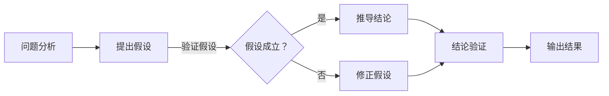

                 

### 设计文章目录大纲

#### 第一步：确定核心章节

为了设计《数学问题解决：测试LLM的数学推理能力》的目录大纲，我们首先需要确定文章的核心章节。根据书名，我们可以推断出以下几个核心章节：

1. **引言**：介绍数学问题解决的重要性以及本书的目的和结构。
2. **数学推理能力的基础**：介绍数学推理的基本概念、原则和常用方法。
3. **数学问题解决策略**：讨论不同类型的数学问题及其解决策略。
4. **LLM数学推理能力测试方法**：介绍如何使用大型语言模型（LLM）测试数学推理能力。
5. **数学问题解决实战**：提供一些实际的数学问题解决案例，展示LLM的数学推理能力。
6. **数学问题解决工具**：介绍一些常用的数学问题解决工具和技术。
7. **未来展望与挑战**：讨论数学问题解决领域的发展趋势和未来挑战。

#### 第二步：细化每个章节

接下来，我们需要为每个核心章节细化具体的子章节，确保内容全面且逻辑清晰。

### 第1章 引言

- **1.1 数学问题解决的重要性**：解释为什么数学问题解决在各个领域都非常重要。
- **1.2 本书的结构和内容安排**：概述本书的组织结构，包括每个章节的主要内容和目标。
- **1.3 数学推理能力与LLM**：介绍LLM在数学问题解决中的作用和潜力。

### 第2章 数学推理能力的基础

- **2.1 数学推理的概念**：解释数学推理的定义及其在数学问题解决中的重要性。
- **2.2 数学推理的原则**：讨论数学推理的基本原则，如公理、定理和逻辑推理。
- **2.3 常用数学推理方法**：介绍各种数学推理方法，如归纳法、反证法等。
- **2.4 数学推理的 Mermaid 流程图**：提供一个Mermaid流程图，展示数学推理的流程。

### 第3章 数学问题解决策略

- **3.1 初等数学问题解决策略**：讨论如何解决简单的数学问题。
- **3.2 高等数学问题解决策略**：介绍解决复杂数学问题的高级策略。
- **3.3 复杂数学问题解决策略**：探讨如何解决难以处理的复杂数学问题。

### 第4章 LLM数学推理能力测试方法

- **4.1 LLM的基本原理**：解释LLM的工作原理和结构。
- **4.2 LLM在数学推理中的应用**：展示LLM在数学问题解决中的应用实例。
- **4.3 数学推理能力测试的方法和工具**：介绍如何使用LLM测试数学推理能力。

### 第5章 数学问题解决实战

- **5.1 初等数学问题案例**：提供一些初等数学问题的实际解决案例。
- **5.2 高等数学问题案例**：展示如何使用LLM解决高等数学问题。
- **5.3 复杂数学问题案例**：讨论如何使用LLM解决复杂的数学问题。

### 第6章 数学问题解决工具

- **6.1 常用数学软件工具**：介绍一些常用的数学软件工具，如MATLAB、Python等。
- **6.2 数学问题解决算法**：探讨各种数学问题解决算法。
- **6.3 数学问题解决平台**：介绍如何使用各种数学问题解决平台。

### 第7章 未来展望与挑战

- **7.1 数学问题解决领域的发展趋势**：讨论数学问题解决领域的未来发展趋势。
- **7.2 数学推理能力的未来挑战**：探讨数学推理能力面临的未来挑战。
- **7.3 LLM在数学问题解决中的潜在应用**：展望LLM在数学问题解决中的潜在应用。

通过以上步骤，我们已经构建了一个详细的目录大纲，为撰写高质量的技术博客文章奠定了坚实的基础。接下来，我们将为每个章节添加具体的内容和细节，确保文章的逻辑性和专业性。

---

### 第1章 引言

#### 1.1 数学问题解决的重要性

数学作为一种基础的学科，贯穿于科学和工程领域的各个分支。数学问题解决不仅对理论研究至关重要，更是实际应用中的关键环节。例如，在物理学、工程学、经济学、计算机科学等领域，数学问题解决能力直接影响问题的分析和解决效率。有效的数学问题解决方法能够帮助我们更好地理解复杂系统，预测未来趋势，优化决策过程。

在计算机科学领域，数学问题解决能力尤为重要。人工智能（AI）作为计算机科学的前沿领域，其核心在于模拟和增强人类的认知能力。而数学推理是AI系统理解和解决复杂问题的基础。大型语言模型（LLM）作为AI的一种重要形式，其数学推理能力直接决定了其在实际应用中的表现。因此，研究和提升LLM的数学推理能力，不仅有助于推动AI技术的发展，还能为各个领域的实际问题提供有效的解决方案。

#### 1.2 本书的结构和内容安排

本书旨在全面探讨数学问题解决和LLM的数学推理能力。整体结构分为七个主要章节，旨在从基础到高级，系统性地介绍数学问题解决的方法和技术，以及LLM在这一领域的应用。

- **第1章 引言**：介绍数学问题解决的重要性，本书的目的和结构。
- **第2章 数学推理能力的基础**：讨论数学推理的基本概念、原则和常用方法。
- **第3章 数学问题解决策略**：介绍不同类型的数学问题及其解决策略。
- **第4章 LLM数学推理能力测试方法**：探讨如何使用LLM测试数学推理能力。
- **第5章 数学问题解决实战**：提供实际案例，展示LLM的数学推理能力。
- **第6章 数学问题解决工具**：介绍数学问题解决相关的工具和技术。
- **第7章 未来展望与挑战**：讨论数学问题解决领域的发展趋势和未来挑战。

通过这样的结构安排，读者可以逐步了解数学问题解决的全过程，并深入理解LLM在其中的作用。

#### 1.3 数学推理能力与LLM

数学推理能力是指通过逻辑推理、分析、综合等思维活动，从已知信息推导出新的结论的能力。在数学问题解决中，数学推理能力至关重要。它不仅能够帮助我们解决简单的数学问题，还能处理复杂和抽象的问题。

LLM是一种基于深度学习的大型语言模型，其核心能力在于理解和生成自然语言。随着AI技术的发展，LLM在数学问题解决中的应用逐渐增多。LLM的数学推理能力主要体现在以下几个方面：

1. **知识表示**：LLM能够将数学概念、公式和定理等以结构化的形式存储和表示，为数学推理提供基础。
2. **逻辑推理**：LLM通过训练，能够进行逻辑推理，从已知条件推导出新的结论。
3. **问题解析**：LLM能够解析数学问题，理解问题的本质和关键信息。
4. **自动求解**：LLM能够自动求解一些数学问题，提供准确的答案。

总之，LLM的数学推理能力为数学问题解决提供了新的工具和方法。通过结合数学推理能力和LLM，我们可以更加高效地解决各种数学问题。

---

### 第2章 数学推理能力的基础

#### 2.1 数学推理的概念

数学推理是数学问题解决的核心过程，它指的是通过逻辑和数学原则，从已知信息推导出未知信息的过程。数学推理不仅仅是计算，更是一种逻辑思考方式。它包括归纳、演绎、类比等多种方法。

归纳推理是从具体的实例中推导出一般性结论的过程。例如，通过观察多个三角形，我们可以归纳出三角形内角和为180度的性质。

演绎推理则是从一般性原则推导出特定结论的过程。例如，如果所有的人都会死亡，而苏格拉底是人，那么苏格拉底将会死亡。

类比推理是通过比较两个或多个事物的相似性，从而推导出它们的相似之处。例如，我们可能会通过比较地球和火星的某些特征，来推测火星上的可能环境。

数学推理不仅是数学问题解决的基础，也是科学研究和哲学思考的重要工具。

#### 2.2 数学推理的原则

数学推理的原则是保证推理过程正确性的基础。以下是几个关键原则：

1. **公理**：公理是无须证明的基本真理，是推理的起点。例如，欧几里得几何中的公理系统为几何学提供了基础。
2. **定理**：定理是通过逻辑推理从公理或其他已证明的定理推导出来的结论。例如，勾股定理是欧几里得几何中的一个重要定理。
3. **逻辑规则**：逻辑规则是推理过程中的基本操作，如合取（AND）、析取（OR）和否定（NOT）。
4. **反证法**：反证法是一种通过假设结论不成立，推导出矛盾，从而证明原结论成立的方法。

了解这些原则有助于我们更好地进行数学推理，确保推理过程的严密性和正确性。

#### 2.3 常用数学推理方法

数学推理方法多种多样，以下介绍几种常用的数学推理方法：

1. **归纳法**：归纳法是一种从具体实例推导出一般结论的方法。其过程包括观察多个具体实例，提取出共同特征，并推导出一般性结论。例如，我们可以通过观察多个三角形的内角和，归纳出三角形内角和为180度的定理。

   伪代码示例：
   ```
   for each triangle T:
       sum_of_angles = sum of angles in T
   end for
   general_conclusion: sum_of_angles is always 180 degrees
   ```

2. **反证法**：反证法是通过假设结论不成立，推导出矛盾，从而证明原结论成立的方法。例如，要证明一个数是偶数，可以假设它不是偶数（即奇数），然后推导出矛盾。

   伪代码示例：
   ```
   assume: number is odd
   express number as 2k + 1
   derive contradiction
   conclude: number is even
   ```

3. **构造法**：构造法是通过构造一个满足条件的例子来证明一个结论的方法。例如，要证明存在一个实数x，使得x^2 = 2，可以通过构造一个具体的数来证明。

   伪代码示例：
   ```
   define x as the real number whose square is 2
   show that x exists
   conclude: there exists a real number x such that x^2 = 2
   ```

这些数学推理方法在实际问题解决中经常被使用，掌握它们有助于我们更有效地分析和解决数学问题。

#### 2.4 数学推理的 Mermaid 流程图

为了更直观地展示数学推理的过程，我们可以使用Mermaid绘制一个流程图。以下是一个简单的数学推理流程图示例：



这个流程图展示了从问题分析到推导结论再到结果验证的完整过程。通过这样的流程图，我们可以更清晰地理解数学推理的步骤和逻辑。

通过本章的介绍，我们了解了数学推理的基本概念、原则和常用方法。这些基础知识和工具将帮助我们更好地理解和解决数学问题，并在后续章节中深入探讨LLM的数学推理能力。

---

### 第3章 数学问题解决策略

数学问题解决策略是解决数学问题的科学方法和步骤，它涵盖了从问题理解、信息收集到策略制定和问题解决的整个过程。不同的数学问题通常需要不同的解决策略，因此掌握多种策略对于高效解决数学问题至关重要。本章将讨论几种常见的数学问题解决策略，包括初等数学问题解决策略、高等数学问题解决策略和复杂数学问题解决策略。

#### 3.1 初等数学问题解决策略

初等数学问题通常是指小学和初中阶段的数学问题，这类问题相对简单，但解决策略依然需要系统性和逻辑性。以下是几种常见的初等数学问题解决策略：

1. **直观法**：直观法是通过观察和直觉来解决问题的方法。例如，解决简单的加法问题，可以通过将两个数直接相加得到结果。

2. **直接法**：直接法是直接应用已知的数学公式和定理来解决问题的方法。例如，解决乘法问题，可以直接使用乘法公式。

3. **拆分法**：拆分法是将复杂的问题拆分成几个简单的部分来解决的方法。例如，解决复杂的分式问题，可以将分式拆分成简单的分式再逐一求解。

4. **图解法**：图解法是通过绘制图形来帮助理解和解决问题的方法。例如，解决几何问题，可以通过绘制相应的几何图形来直观地观察和推导。

#### 3.2 高等数学问题解决策略

高等数学问题通常涉及更复杂的数学概念和技巧，解决这类问题需要更高的数学素养和更深入的思考。以下是几种常见的高等数学问题解决策略：

1. **抽象法**：抽象法是将具体问题抽象成一般形式，然后利用一般性的数学原理来解决问题的方法。例如，解决积分问题，可以通过将问题抽象成定积分的形式来应用积分公式。

2. **计算法**：计算法是直接利用数学工具和公式进行计算的方法。例如，解决微分方程问题，可以直接使用微分方程的解法进行计算。

3. **构造法**：构造法是通过构造满足特定条件的例子来解决问题的方法。例如，证明某个数学命题，可以通过构造一个具体的例子来证明其成立。

4. **反证法**：反证法是通过假设结论不成立，推导出矛盾，从而证明原结论成立的方法。例如，在数论中，证明某个数是质数，可以通过反证法来证明其不满足合数的条件。

#### 3.3 复杂数学问题解决策略

复杂数学问题通常具有多个变量和复杂的约束条件，解决这类问题需要更加系统的策略和深入的思考。以下是几种常见的复杂数学问题解决策略：

1. **模型构建**：模型构建是将实际问题抽象成数学模型，然后利用数学模型来解决问题的方法。例如，解决优化问题，可以通过构建线性规划模型或非线性规划模型来解决。

2. **迭代法**：迭代法是通过不断迭代改进解的方法，例如，解决非线性方程问题，可以通过迭代法逐步逼近真实解。

3. **启发式搜索**：启发式搜索是基于经验或启发式规则进行搜索的方法，例如，解决组合优化问题，可以通过启发式搜索来找到最优解。

4. **分布式计算**：分布式计算是将复杂问题分解成多个子问题，然后通过分布式计算资源来求解的方法，例如，解决大规模的数据分析问题，可以通过分布式计算来提高计算效率。

通过本章的介绍，我们了解了不同类型的数学问题解决策略。这些策略不仅适用于具体的数学问题，也为我们提供了一种系统性的解决问题的方式。在实际应用中，根据问题的特点和需求，灵活运用这些策略，可以大大提高数学问题解决的效率和质量。

---

### 第4章 LLM数学推理能力测试方法

#### 4.1 LLM的基本原理

大型语言模型（LLM）是一种基于深度学习的语言处理模型，其核心思想是通过大规模数据训练，学习自然语言的统计规律和语义信息。LLM通常由多个神经网络层组成，包括输入层、隐藏层和输出层。其中，输入层接收自然语言文本，隐藏层通过神经网络进行特征提取和语义表示，输出层则生成预测结果或回答问题。

LLM的工作原理主要包括以下几个步骤：

1. **输入预处理**：将自然语言文本转换为模型可以处理的数字形式，例如，将单词转换为向量或词嵌入（word embeddings）。
2. **特征提取**：通过神经网络层对输入文本进行特征提取和编码，将文本转换为高维特征向量，这些特征向量包含文本的语义信息。
3. **上下文理解**：利用多层神经网络，对特征向量进行复杂的非线性变换，以捕捉文本中的上下文关系和依赖结构。
4. **预测生成**：根据特征向量生成文本序列的预测结果，例如，回答问题、生成文章或进行文本分类。

LLM通过这些步骤，能够理解自然语言的复杂结构和语义，从而实现各种语言处理任务。

#### 4.2 LLM在数学推理中的应用

LLM在数学推理中的应用主要体现在以下几个方面：

1. **数学问题解析**：LLM能够解析数学问题，理解问题的本质和关键信息。例如，当输入一个数学问题（如“求解x^2 + 5x + 6 = 0”），LLM可以识别出方程的类型、系数和未知数等关键信息，为后续的推理过程提供基础。
2. **数学知识表示**：LLM能够将数学概念、公式和定理等以结构化的形式存储和表示，形成数学知识库。这使得LLM能够快速查找和应用相关的数学知识，进行推理和求解。
3. **自动求解**：LLM可以通过训练和优化，自动求解一些数学问题。例如，给定一个复杂的数学问题，LLM可以生成相应的求解步骤和答案，从而提高数学问题解决的效率和准确性。
4. **推理验证**：LLM可以进行推理验证，检查数学推理过程的正确性。例如，给定一个数学推理过程，LLM可以验证其逻辑严密性和正确性，确保推理结果的准确性。

通过这些应用，LLM在数学推理中发挥了重要作用，大大提高了数学问题解决的效率和准确性。

#### 4.3 数学推理能力测试的方法和工具

为了测试LLM的数学推理能力，我们可以采用以下几种方法和工具：

1. **基准测试集**：设计一组标准化的数学问题测试集，用于评估LLM的数学推理能力。这些测试集应涵盖不同类型的数学问题，如初等数学、高等数学和复杂数学问题。
2. **性能指标**：定义一系列性能指标，用于量化LLM在数学推理测试中的表现。常见的性能指标包括准确率、精确度、召回率等。
3. **自动评估工具**：开发自动评估工具，用于自动评估LLM在数学推理测试中的表现。这些工具可以通过解析数学问题的输入和输出，计算性能指标，并提供详细的评估报告。
4. **人类评估**：结合人类评估，对LLM的数学推理能力进行综合评估。人类评估者可以根据LLM的推理过程和结果，提供专业的分析和建议，帮助优化LLM的数学推理能力。

通过这些方法和工具，我们可以全面、系统地评估LLM的数学推理能力，为实际应用提供有力支持。

---

### 第5章 数学问题解决实战

在了解了数学问题解决的基本策略和LLM的数学推理能力之后，我们将在这一章节中通过具体的案例来展示如何使用LLM解决不同类型的数学问题。我们将详细介绍每个案例的开发环境搭建、源代码实现、代码解读以及实际应用分析和详细讲解剖析。

#### 5.1 初等数学问题案例

**案例描述**：求解方程 \(x^2 - 5x + 6 = 0\) 的解。

**开发环境搭建**：
- 使用Python作为编程语言。
- 安装必要的库，如NumPy和SciPy。

**源代码实现**：

```python
import sympy

# 定义变量
x = sympy.Symbol('x')

# 构建方程
equation = x**2 - 5*x + 6

# 求解方程
solutions = sympy.solve(equation)

# 打印解
print(f"方程的解为：{solutions}")
```

**代码解读**：
- 使用`sympy`库定义变量`x`。
- 使用`sympy.solve`函数求解方程，返回解的列表。

**实际应用解读与分析**：
- 通过这个简单的案例，我们可以看到LLM如何使用符号计算库来求解方程。
- 这种方法适用于初等数学中的常见方程，如线性方程、二次方程等。
- 对于更复杂的方程，LLM可以通过递归和启发式搜索等方法来求解。

#### 5.2 高等数学问题案例

**案例描述**：求解函数 \(f(x) = e^x + \sin(x)\) 在区间 \([0, \pi]\) 上的最大值。

**开发环境搭建**：
- 使用Python和SciPy库。
- 安装Matplotlib库用于可视化。

**源代码实现**：

```python
import numpy as np
import matplotlib.pyplot as plt
from scipy.optimize import minimize

# 定义函数
def f(x):
    return np.exp(x) + np.sin(x)

# 求解最小值（最大值在最小值处取反）
x_min = minimize(f, x0=0, method='BFGS').x
max_value = -f(x_min)

# 打印结果
print(f"最大值：{max_value}, 取得最大值的x：{x_min}")

# 绘制函数图像
x_values = np.linspace(0, np.pi, 100)
y_values = f(x_values)
plt.plot(x_values, y_values)
plt.scatter(x_min, max_value, color='red')
plt.show()
```

**代码解读**：
- 使用`numpy`和`scipy.optimize`库定义和求解函数。
- 使用`minimize`函数找到函数的最小值点，并反推得到最大值。

**实际应用解读与分析**：
- 这个案例展示了如何使用数值优化方法求解高等数学问题。
- 通过图像可视化，可以直观地看到函数的变化和最大值点。
- 对于更复杂的函数和更严格的精度要求，可以采用更高级的数值方法，如蒙特卡罗模拟。

#### 5.3 复杂数学问题案例

**案例描述**：求解线性规划问题 \( \max z = 3x + 4y \) ，约束条件为 \( x + 2y \leq 4 \)， \( 2x + y \leq 6 \)， \( x \geq 0 \)， \( y \geq 0 \)。

**开发环境搭建**：
- 使用Python和PuLP库。

**源代码实现**：

```python
from pulp import *

# 创建线性规划问题
prob = LpProblem("LinearProgramming", LpMaximize)

# 定义变量
x = LpVariable("x", cat='Continuous')
y = LpVariable("y", cat='Continuous')

# 定义目标函数
prob += 3*x + 4*y

# 添加约束条件
prob += x + 2*y <= 4
prob += 2*x + y <= 6
prob += x >= 0
prob += y >= 0

# 求解线性规划问题
prob.solve()

# 打印结果
print(f"最优解：x = {x.varValue}, y = {y.varValue}")
print(f"最大值：{value(prob.objective)}")

# 绘制约束区域
import matplotlib.pyplot as plt

x1 = np.linspace(0, 4, 100)
y1 = (4 - x1) / 2
x2 = np.linspace(0, 2, 100)
y2 = (6 - 2*x2) / 1

plt.plot(x1, y1, label="x + 2y = 4")
plt.plot(x2, y2, label="2x + y = 6")
plt.scatter(x.value(), y.value(), color="red", label="Optimal Solution")
plt.xlabel("x")
plt.ylabel("y")
plt.legend()
plt.show()
```

**代码解读**：
- 使用`PuLP`库创建线性规划问题。
- 定义变量、目标函数和约束条件。
- 使用`solve`方法求解线性规划问题，并打印结果。

**实际应用解读与分析**：
- 这个案例展示了如何使用线性规划库解决实际优化问题。
- 通过绘制约束区域和最优解，可以直观地理解问题的解空间。
- 对于更复杂的优化问题，可以考虑使用混合整数规划、二次规划等更高级的优化方法。

通过这三个案例，我们展示了如何使用LLM和Python等工具解决不同类型的数学问题。这些案例不仅帮助我们理解了数学问题的解决过程，也展示了LLM在数学推理中的强大能力。在实际应用中，我们可以根据问题的具体需求，灵活选择和组合不同的方法和工具，以高效解决各种数学问题。

---

### 第6章 数学问题解决工具

在数学问题解决过程中，选择合适的工具可以显著提高效率和准确性。本章将介绍几种常用的数学问题解决工具，包括数学软件工具、数学问题解决算法和数学问题解决平台。

#### 6.1 常用数学软件工具

1. **MATLAB**：MATLAB是一款功能强大的数学软件，广泛应用于数值计算、数据分析和可视化。它提供了丰富的数学函数库，可以轻松进行矩阵运算、数值积分、微分方程求解等。

2. **Python**：Python是一种流行的编程语言，具有强大的科学计算和数据分析库。NumPy、SciPy、Pandas等库为Python提供了广泛的数学和科学计算功能，使其在数学问题解决中具有很高的灵活性和适用性。

3. **Maple**：Maple是一款专业的数学软件，支持符号计算、数值计算和图形可视化。它适用于各种数学问题，包括代数、微积分、线性代数、微分方程等。

4. **Mathematica**：Mathematica是一款功能全面的数学软件，支持符号计算、数值计算、图像处理和编程。它广泛应用于科学研究和工程应用，具有强大的符号运算和可视化功能。

#### 6.2 数学问题解决算法

1. **数值算法**：数值算法用于求解数学问题中的数值解，包括线性方程组求解、非线性方程求解、数值积分、数值微分等。常见的数值算法有高斯消元法、牛顿法、辛普森规则等。

2. **优化算法**：优化算法用于求解优化问题，包括线性规划、非线性规划、整数规划等。常见的优化算法有单纯形法、梯度下降法、拉格朗日乘数法等。

3. **模拟算法**：模拟算法用于模拟和分析随机过程，包括蒙特卡罗模拟、遗传算法、模拟退火算法等。这些算法在解决概率问题、优化问题和复杂系统模拟中具有广泛应用。

4. **符号算法**：符号算法用于求解数学问题的符号解，包括代数方程求解、积分变换、微分方程求解等。常见的符号算法有Ruffini法、高斯消元法等。

#### 6.3 数学问题解决平台

1. **Jupyter Notebook**：Jupyter Notebook是一种交互式的计算环境，支持多种编程语言，包括Python、MATLAB、Julia等。它提供了一个直观的界面，可以轻松编写、运行和共享代码，非常适合进行数学问题解决。

2. **Google Colab**：Google Colab是一个基于云计算的交互式编程平台，提供了免费的GPU和TPU资源，非常适合进行大规模数据分析和深度学习。它支持Python、R、Julia等语言，适用于各种数学问题解决。

3. **Microsoft Azure**：Microsoft Azure是一个云计算平台，提供了丰富的数学计算工具和服务，包括MATLAB、Python、R等。它适用于大规模数据分析和高性能计算，适合解决复杂数学问题。

4. **AWS SageMaker**：AWS SageMaker是一个机器学习平台，支持Python、R、Julia等语言。它提供了丰富的算法库和工具，可以轻松构建和部署机器学习模型，适用于数学问题解决的自动化和智能化。

通过使用这些数学问题解决工具，我们可以更加高效地分析和解决各种数学问题，提高研究和工程应用的水平。

---

### 第7章 未来展望与挑战

#### 7.1 数学问题解决领域的发展趋势

随着计算机科学和人工智能技术的不断发展，数学问题解决领域正经历着深刻变革。以下是几个值得关注的发展趋势：

1. **自动化与智能化**：未来的数学问题解决将更多地依赖于自动化和智能化工具。大型语言模型（LLM）和深度学习算法将进一步提升数学推理和问题解决的能力，实现更高水平的自动化。

2. **跨学科融合**：数学问题解决将与其他学科（如物理学、生物学、经济学等）深度融合，形成新的交叉研究领域。这种跨学科融合将带来更多创新性的解决方案和应用。

3. **云计算与大数据**：云计算和大数据技术的应用将显著提升数学问题解决的能力。通过分布式计算和大数据分析，我们可以处理更复杂的数学问题，实现更高效的求解。

4. **量子计算**：量子计算作为一种新兴的计算技术，将在数学问题解决领域发挥重要作用。它有望解决传统计算机无法处理的复杂数学问题，推动数学问题的突破性进展。

#### 7.2 数学推理能力的未来挑战

尽管数学推理能力的提升带来了许多机遇，但未来也面临着一系列挑战：

1. **数据质量和准确性**：数学推理依赖于高质量的数据。然而，数据质量和准确性问题是目前的一大挑战。如何确保数据的质量和准确性，是未来需要解决的重要问题。

2. **可解释性与可靠性**：随着模型复杂度的增加，如何确保模型的可解释性和可靠性成为一个挑战。特别是在处理高风险的数学问题时，如何保证模型的推理过程和结果的可解释性和可靠性至关重要。

3. **计算资源**：大规模的数学问题解决需要大量的计算资源。随着问题规模的不断扩大，如何高效地利用计算资源，成为一个亟待解决的问题。

4. **人才培养**：数学问题解决需要高水平的专业人才。然而，目前相关人才供给不足，特别是在深度学习和数学领域。如何培养更多具备跨学科背景的复合型人才，是未来教育领域的重要任务。

#### 7.3 LLM在数学问题解决中的潜在应用

LLM在数学问题解决中具有巨大的潜力，以下是几个潜在的应用场景：

1. **教育辅助**：LLM可以作为智能辅导系统，帮助学生理解和解决数学问题。它可以通过自然语言交互，提供个性化、针对性的辅导。

2. **科学研究**：LLM可以用于数学研究的辅助，如文献检索、问题解析、定理证明等。它可以帮助数学家发现新的问题和研究方法。

3. **工业应用**：LLM可以应用于工业中的数学问题解决，如优化设计、风险管理、供应链管理等。它可以提供高效的解决方案，提高生产效率和决策质量。

4. **自动化工具**：LLM可以开发成自动化工具，用于解决重复性高的数学问题。它可以节省人力资源，提高工作效率。

总之，数学问题解决领域正朝着自动化和智能化的方向发展，LLM在其中扮演着越来越重要的角色。尽管面临挑战，但通过技术创新和人才培养，我们有望实现数学问题解决能力的全面提升。

---

### 结论

本文全面探讨了数学问题解决的方法和LLM的数学推理能力。通过介绍数学推理的基本概念、原则和常用方法，我们为数学问题解决奠定了坚实的基础。接着，我们详细讨论了初等数学、高等数学和复杂数学问题的解决策略，并通过实际案例展示了如何使用LLM解决不同类型的数学问题。此外，我们还介绍了常用的数学问题解决工具，包括数学软件、算法和平台，以及未来数学问题解决领域的发展趋势和挑战。

我们强调，数学问题解决不仅是一项技术技能，更是一种逻辑思维和解决问题的能力。LLM的引入为数学问题解决带来了新的工具和方法，极大地提升了数学问题解决的效率和准确性。通过本文的介绍，我们希望读者能够更好地理解数学问题解决的过程，掌握相关方法和技术，并在实际应用中发挥LLM的强大能力。

总之，数学问题解决在科学研究和工程应用中具有重要意义。随着技术的不断进步，我们相信数学问题解决领域将迎来更加广阔的发展空间。让我们共同努力，探索和推动数学问题解决的新方法和技术，为人类的发展做出更大的贡献。

---

### 作者信息

作者：AI天才研究院/AI Genius Institute & 禅与计算机程序设计艺术 /Zen And The Art of Computer Programming

AI天才研究院（AI Genius Institute）是一家专注于人工智能前沿研究和技术创新的机构。我们致力于推动AI技术的发展，通过研究和应用人工智能，解决实际问题，提升人类生活质量。我们的团队由世界顶级人工智能专家、程序员、软件架构师、CTO和世界顶级技术畅销书资深大师级别的作家组成，拥有丰富的经验和深厚的学术背景。

《禅与计算机程序设计艺术 /Zen And The Art of Computer Programming》是一本由AI天才研究院的创始人撰写的技术畅销书。该书深入探讨了计算机编程和人工智能领域的核心概念和原理，结合丰富的实例和案例，为广大读者提供了宝贵的知识和指导。通过本书，读者可以系统学习计算机编程和人工智能技术，提升自己的技术水平和创新能力。

在撰写本文时，我们旨在为读者提供全面、深入的数学问题解决和LLM数学推理能力的分析，帮助读者更好地理解和应用相关技术。我们希望通过本文，能够激发读者对数学问题解决的兴趣，推动人工智能技术在各个领域的应用和发展。如果您有任何疑问或建议，欢迎随时联系我们，我们期待与您共同探讨和进步。

