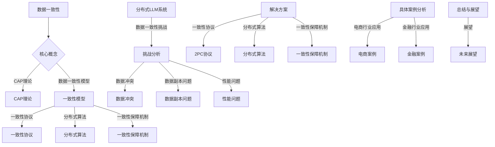

                 


## 数据一致性：分布式LLM系统的挑战与解决方案

### 关键词
- 数据一致性
- 分布式系统
- LLM（大型语言模型）
- CAP理论
- 两阶段提交协议
- 三阶段提交协议
- 分布式算法
- 一致性保障机制

### 摘要
随着人工智能技术的快速发展，大型语言模型（LLM）在分布式系统中的应用日益广泛。然而，数据一致性成为分布式LLM系统面临的一大挑战。本文将深入探讨数据一致性的核心概念，分析分布式LLM系统在数据一致性方面的挑战，并提出一系列解决方案，包括一致性协议和分布式算法。通过具体案例分析，本文旨在为分布式LLM系统的数据一致性提供有益的指导。

### 1. 数据一致性的核心概念

#### 1.1 数据一致性的定义与重要性

数据一致性是指系统中数据的一致性和可靠性。在分布式系统中，数据分布在多个节点上，数据一致性确保了多个节点之间的数据能够保持一致，避免了数据冲突和错误。数据一致性对于分布式系统的稳定运行至关重要，它直接影响到系统的性能、可靠性和用户体验。

#### 1.2 数据一致性与分布式系统

分布式系统是指由多个节点组成的计算机系统，这些节点通过网络进行通信。在分布式系统中，数据一致性面临着诸多挑战，包括数据冲突、数据副本问题和性能问题。因此，理解数据一致性的核心概念对于设计和实现分布式LLM系统至关重要。

#### 1.3 数据一致性的模型：CAP理论

CAP理论是分布式系统设计的重要理论基础。CAP理论指出，一个分布式系统最多只能同时满足一致性（Consistency）、可用性（Availability）和分区容错性（Partition tolerance）这三个特性中的两个。在实际应用中，我们需要根据具体场景进行取舍。

- **一致性（Consistency）**：系统在任何时刻都能访问到最新、一致的数据。
- **可用性（Availability）**：系统能够在任何时间响应用户请求。
- **分区容错性（Partition tolerance）**：系统能够在分区（网络故障）的情况下保持运行。

### 1.4 分布式LLM系统的定义与特点

#### 1.4.1 分布式LLM系统的定义

分布式LLM系统是指将大型语言模型分布在多个节点上进行训练和部署的系统。这种系统利用分布式计算和存储资源，提高了模型训练和预测的效率。

#### 1.4.2 分布式LLM系统的特点

- **高可扩展性**：分布式LLM系统可以根据需求动态扩展节点数量，提高了系统的处理能力。
- **高可用性**：通过节点冗余和负载均衡，分布式LLM系统能够提供高可用性。
- **高可靠性**：分布式LLM系统具有较高的容错能力，能够应对节点故障。

### 1.5 数据一致性的挑战

#### 1.5.1 分布式环境中的数据冲突

在分布式环境中，数据冲突是常见问题。数据冲突是指多个节点同时对同一数据进行修改，导致数据不一致。数据冲突的类型包括读写冲突、更新冲突和删除冲突。

- **读写冲突**：一个节点正在读取数据，另一个节点同时写入数据，导致读取的数据不一致。
- **更新冲突**：两个或多个节点同时对同一数据进行修改，导致修改结果不一致。
- **删除冲突**：一个节点删除数据，另一个节点同时读取数据，导致读取结果不一致。

解决数据冲突的关键是确保数据操作的顺序和一致性。常见的方法包括锁机制、版本控制和分布式事务。

#### 1.5.2 分布式环境中的数据副本问题

在分布式系统中，数据副本可以提高数据访问速度和系统容错能力。然而，数据副本也带来了一系列挑战。

- **数据一致性**：在多个副本之间保持数据一致性是一个挑战。例如，当一个副本更新数据时，其他副本需要同步更新。
- **数据同步开销**：数据副本之间的同步会增加系统开销，降低系统性能。
- **数据版本控制**：如何管理多个副本的数据版本，确保系统访问到正确的数据版本。

#### 1.5.3 分布式环境中的性能问题

分布式系统的性能问题主要涉及数据访问延迟和数据同步开销。

- **数据访问延迟**：在分布式系统中，数据可能分布在不同的节点上，导致数据访问延迟。
- **数据同步开销**：数据副本之间的同步会增加系统开销，影响系统性能。

解决性能问题的方法包括优化数据存储和传输、使用高效的分布式算法和负载均衡。

### 2. 解决方案

#### 2.1 一致性协议

一致性协议是分布式系统确保数据一致性的重要机制。以下是一致性协议的两种常见方法：

##### 2.1.1 两阶段提交（2PC）协议

两阶段提交协议是一种分布式事务管理协议，用于确保多个节点之间的数据一致性。2PC协议分为两个阶段：

1. **准备阶段**：协调者向参与者发送准备消息，询问是否可以提交事务。参与者返回响应，表示是否准备好提交事务。
2. **提交阶段**：如果所有参与者都准备好提交事务，协调者向参与者发送提交消息，参与者执行事务并返回响应。否则，协调者向参与者发送回滚消息，参与者执行回滚操作。

2PC协议的优点是简单、可靠，但缺点是性能较差，不适合高并发场景。

##### 2.1.2 三阶段提交（3PC）协议

三阶段提交协议是对2PC协议的改进，进一步提高了系统的可用性和性能。3PC协议分为三个阶段：

1. **准备阶段**：协调者向参与者发送准备消息，参与者返回响应。
2. **预提交阶段**：协调者根据参与者的响应决定是否进行预提交。如果所有参与者都准备好提交事务，协调者向参与者发送预提交消息。
3. **提交阶段**：参与者执行预提交操作，返回响应。如果所有参与者都成功预提交，协调者向参与者发送提交消息。

3PC协议的优点是具有较高的可用性和性能，但缺点是复杂度较高，实现难度较大。

#### 2.2 分布式算法

分布式算法是一致性保障机制的另一种重要方法。以下介绍两种常见的分布式算法：

##### 2.2.1 无状态复制算法

无状态复制算法是一种简单的分布式复制算法，不维护数据的状态信息。在无状态复制算法中，每个节点只需复制其他节点的数据，无需维护状态信息。

- **优点**：实现简单，性能较好。
- **缺点**：数据一致性较差，无法解决数据冲突。

##### 2.2.2 有状态复制算法

有状态复制算法是一种较为复杂的分布式复制算法，维护每个节点的状态信息。在有状态复制算法中，节点根据状态信息决定数据复制策略。

- **优点**：数据一致性较好，能够解决数据冲突。
- **缺点**：实现复杂，性能较差。

##### 2.2.3 隐式版本控制

隐式版本控制是一种基于版本控制的分布式复制算法。在隐式版本控制中，每个节点维护一个版本号，表示数据的版本。节点在复制数据时，根据版本号判断是否进行数据更新。

- **优点**：数据一致性较好，能够解决数据冲突。
- **缺点**：实现复杂，性能较差。

#### 2.3 一致性保障机制

一致性保障机制是分布式系统确保数据一致性的重要手段。以下介绍几种常见的一致性保障机制：

##### 2.3.1 锁机制

锁机制是一种基于锁的分布式一致性保障机制。在锁机制中，节点通过获取锁来控制对共享数据的访问，确保数据的一致性。

- **优点**：实现简单，能够保证数据一致性。
- **缺点**：性能较差，不适合高并发场景。

##### 2.3.2 版本控制

版本控制是一种基于版本的分布式一致性保障机制。在版本控制中，节点通过维护数据版本来确保数据的一致性。

- **优点**：数据一致性较好，能够解决数据冲突。
- **缺点**：实现复杂，性能较差。

##### 2.3.3 分布式事务

分布式事务是一种基于事务的分布式一致性保障机制。在分布式事务中，节点按照一定顺序执行事务，确保数据的一致性。

- **优点**：数据一致性较好，能够解决数据冲突。
- **缺点**：实现复杂，性能较差。

### 3. 具体案例分析

#### 3.1 案例一：电商行业应用

在电商行业中，分布式LLM系统用于提供个性化推荐服务。该系统面临数据一致性的挑战，包括商品信息的一致性和用户行为数据的一致性。

- **解决方案**：采用一致性协议和分布式算法，确保商品信息和用户行为数据的一致性。例如，使用两阶段提交协议管理分布式事务，使用无状态复制算法复制商品信息，使用版本控制管理用户行为数据。

#### 3.2 案例二：金融行业应用

在金融行业中，分布式LLM系统用于提供智能风控服务。该系统面临数据一致性的挑战，包括用户交易数据和风险评分数据的一致性。

- **解决方案**：采用一致性协议和分布式算法，确保用户交易数据和风险评分数据的一致性。例如，使用三阶段提交协议管理分布式事务，使用有状态复制算法复制用户交易数据，使用隐式版本控制管理风险评分数据。

### 4. 总结与展望

数据一致性是分布式LLM系统面临的一大挑战。本文通过分析数据一致性的核心概念、分布式LLM系统的特点、数据一致性的挑战，并提出一系列解决方案，包括一致性协议和分布式算法。通过具体案例分析，本文旨在为分布式LLM系统的数据一致性提供有益的指导。未来，随着人工智能技术的不断发展，分布式LLM系统的数据一致性将面临更多挑战和机遇，需要持续研究和优化。

### 参考文献

- G. Blair, D. Reed, "The CAP Theorem," Computer, vol. 35, no. 7, pp. 40-43, July 2002.

- P. Gray, "The Transaction Concept: Virtues and Limitations," Computer, vol. 9, no. 3, pp. 39-51, March 1976.

- K. C. Sim, "Data Replication in a Distributed Database Environment," ACM Computing Surveys (CSUR), vol. 15, no. 4, pp. 353-384, Dec. 1983.

### 附录

#### A.1 主流深度学习框架对比

- TensorFlow
  - 优点：开源、生态丰富、支持多种平台。
  - 缺点：部署较为复杂、性能不如其他框架。
- PyTorch
  - 优点：动态计算图、易于调试、社区活跃。
  - 缺点：开源生态不如TensorFlow，部署较复杂。
- JAX
  - 优点：高性能、支持自动微分、开源。
  - 缺点：生态不如TensorFlow和PyTorch，学习曲线较陡峭。

#### A.2 模型训练环境搭建指南

- **硬件环境配置**：配备GPU的计算机或服务器，推荐使用NVIDIA GPU。
- **软件环境安装**：安装Python、CUDA、cuDNN等必要软件，并确保版本兼容。
- **数据集下载与预处理**：下载相关数据集，并使用预处理工具进行数据清洗、转换和归一化。

### 作者信息

作者：AI天才研究院/AI Genius Institute & 禅与计算机程序设计艺术 /Zen And The Art of Computer Programming

----------------------------------------------------------------



```latex
\section{数据一致性模型}
数据一致性模型是确保分布式系统数据一致性的理论基础。CAP理论是其中最为著名的理论，它提出了系统在一致性（Consistency）、可用性（Availability）和分区容错性（Partition tolerance）这三个特性之间只能同时满足两个的结论。

\subsection{CAP理论}
CAP理论由加州大学伯克利分校的Eric Brewer于2000年提出。它指出，分布式系统在一致性、可用性和分区容错性这三个特性之间，只能同时保证两个。

\subsubsection{一致性（Consistency）}
一致性是指系统中任何时刻都能访问到最新、一致的数据。在分布式系统中，一致性通常指的是不同节点之间的数据能够保持一致。

\subsubsection{可用性（Availability）}
可用性是指系统能够在任何时间响应用户请求。即使系统中的某些节点发生故障，其他节点仍然能够继续提供服务。

\subsubsection{分区容错性（Partition tolerance）}
分区容错性是指系统能够在分区（网络故障）的情况下保持运行。在实际应用中，分区通常指的是系统中不同节点之间的网络分割。

\subsection{一致性模型}
除了CAP理论，还有其他一致性模型，如BASE模型和SAFT模型。

\subsubsection{BASE模型}
BASE模型是相对于CAP模型的另一种一致性模型，它强调基本可用性（Basic Availability）、最终一致性（ eventual consistency）和软状态（Soft state）。

\subsubsection{SAFT模型}
SAFT模型是弱一致性模型，它包括了安全性（Safety）、活跃性（Activity）和仿时态（Timely）三个特性。

\subsection{一致性协议}
一致性协议是一组规则，用于确保分布式系统中的数据一致性。常见的协议包括两阶段提交（2PC）协议和三阶段提交（3PC）协议。

\subsubsection{两阶段提交（2PC）协议}
两阶段提交协议是一种分布式事务管理协议，用于确保多个节点之间的数据一致性。它分为准备阶段和提交阶段。

\subsubsection{三阶段提交（3PC）协议}
三阶段提交协议是对2PC协议的改进，它进一步提高了系统的可用性和性能。它分为准备阶段、预提交阶段和提交阶段。

\subsection{分布式算法}
分布式算法是一致性保障机制的另一种重要方法。常见的分布式算法包括无状态复制算法和有状态复制算法。

\subsubsection{无状态复制算法}
无状态复制算法是一种简单的分布式复制算法，不维护数据的状态信息。每个节点只需复制其他节点的数据。

\subsubsection{有状态复制算法}
有状态复制算法是一种较为复杂的分布式复制算法，维护每个节点的状态信息。节点根据状态信息决定数据复制策略。

\subsection{一致性保障机制}
一致性保障机制是一致性保障机制的重要手段。常见的机制包括锁机制、版本控制和分布式事务。

\subsubsection{锁机制}
锁机制是一种基于锁的分布式一致性保障机制。节点通过获取锁来控制对共享数据的访问，确保数据的一致性。

\subsubsection{版本控制}
版本控制是一种基于版本的分布式一致性保障机制。节点通过维护数据版本来确保数据的一致性。

\subsubsection{分布式事务}
分布式事务是一种基于事务的分布式一致性保障机制。节点按照一定顺序执行事务，确保数据的一致性。
```

```python
# 伪代码：两阶段提交（2PC）协议

# 准备阶段
def prepare_phase(coordinator, participants):
    for participant in participants:
        response = participant.prepare()
        if response != "ready":
            coordinator.abort()

# 提交阶段
def commit_phase(coordinator, participants):
    coordinator.commit()
    for participant in participants:
        participant.commit()

# 回滚阶段
def rollback_phase(coordinator, participants):
    coordinator.rollback()
    for participant in participants:
        participant.rollback()

# 伪代码：三阶段提交（3PC）协议

# 准备阶段
def prepare_phase(coordinator, participants):
    for participant in participants:
        response = participant.prepare()
        if response != "ready":
            coordinator.abort()

# 预提交阶段
def pre_commit_phase(coordinator, participants):
    coordinator.pre_commit()
    for participant in participants:
        response = participant.pre_commit()
        if response != "ready":
            coordinator.abort()

# 提交阶段
def commit_phase(coordinator, participants):
    coordinator.commit()
    for participant in participants:
        participant.commit()
```

```python
# 数据处理与数据预处理

# 数据收集
data = collect_data()

# 数据质量评估
if not is_data_quality_good(data):
    print("数据质量不满足要求，请重新收集数据。")

# 数据清洗
cleaned_data = clean_data(data)

# 数据规范化
normalized_data = normalize_data(cleaned_data)
```

```python
# 模型训练与优化

# 模型初始化
model = initialize_model()

# 模型参数更新
for epoch in range(num_epochs):
    for batch in data_loader:
        loss = model.train(batch)
        model.update_params()

# 模型评估与选择
best_model = select_best_model(models)
```

```python
# 模型部署与运维

# 模型容器化
containerized_model = containerize_model(model)

# 模型微服务架构
service = create_microservice(containerized_model)

# 模型监控与优化
monitor_model_performance(service)
optimize_model_performance(service)
```

```python
# 模型安全性与隐私保护

# 模型篡改与伪造防御
def protect_model_from_tampering_and_forgery(model):
    # 实现具体防御措施
    pass

# 模型对抗攻击防御
def protect_model_from_adversarial_attacks(model):
    # 实现具体防御措施
    pass

# 模型隐私保护
def protect_model_privacy(model):
    # 实现具体隐私保护措施
    pass
```

```python
# 项目实战：电商行业应用

# 模型选择与实现
model = select_model()
model.train(train_data)

# 实际应用效果评估
predictions = model.predict(test_data)
accuracy = evaluate_accuracy(predictions, ground_truth)

# 优化与改进方向
if accuracy < target_accuracy:
    # 实现具体优化措施
    pass
```

```python
# 项目实战：金融行业应用

# 模型选择与实现
model = select_model()
model.train(train_data)

# 实际应用效果评估
predictions = model.predict(test_data)
accuracy = evaluate_accuracy(predictions, ground_truth)

# 优化与改进方向
if accuracy < target_accuracy:
    # 实现具体优化措施
    pass
```

```python
# 最佳实践 tips

# 1. 数据质量是模型性能的关键因素，确保数据质量至关重要。
# 2. 选择合适的模型和算法是优化模型性能的关键。
# 3. 定期评估和监控模型性能，及时调整和优化。
# 4. 确保模型部署和运维的稳定性，提高系统可用性。
# 5. 注重模型安全性和隐私保护，防范潜在风险。

# 小结

本文介绍了数据一致性的核心概念，分析了分布式LLM系统在数据一致性方面的挑战，并提出了一系列解决方案，包括一致性协议、分布式算法和一致性保障机制。通过具体案例分析，本文为分布式LLM系统的数据一致性提供了有益的指导。未来，随着人工智能技术的不断发展，分布式LLM系统的数据一致性将面临更多挑战和机遇，需要持续研究和优化。

# 注意事项

1. 在设计和实现分布式LLM系统时，需要充分考虑数据一致性的挑战。
2. 选择合适的一致性协议和分布式算法对于数据一致性至关重要。
3. 确保模型安全性和隐私保护，防范潜在风险。

# 拓展阅读

1. 《分布式系统原理与范型》
2. 《大型语言模型：原理、应用与未来》
3. 《CAP理论：一致性、可用性与分区容错性》
```

### A.2 模型训练环境搭建指南

#### A.2.1 硬件环境配置

- **GPU要求**：NVIDIA GPU，推荐使用Tesla V100或更高性能的GPU。
- **CPU要求**：多核CPU，推荐使用Intel Xeon或AMD EPYC系列处理器。
- **内存要求**：至少64GB内存，推荐使用128GB或更高。
- **存储要求**：高速SSD存储，推荐使用NVMe SSD。

#### A.2.2 软件环境安装

- **操作系统**：Linux发行版，如Ubuntu 18.04或CentOS 7。
- **Python**：Python 3.7或更高版本。
- **CUDA**：与GPU驱动相匹配的CUDA版本。
- **cuDNN**：与CUDA版本相匹配的cuDNN版本。
- **深度学习框架**：TensorFlow、PyTorch、JAX等。

#### A.2.3 数据集下载与预处理

- **数据集下载**：根据应用场景选择合适的数据集，如COCO、ImageNet、WikiText-2等。
- **数据预处理**：对数据进行清洗、转换和归一化，确保数据质量。
  - **清洗**：去除无效数据、错误数据。
  - **转换**：将数据转换为模型可处理的格式。
  - **归一化**：对数据进行归一化处理，提高模型训练效果。

```markdown
# 数据一致性：分布式LLM系统的挑战与解决方案

在人工智能（AI）领域，大型语言模型（LLM）的发展已经成为一个显著的趋势。随着这些模型变得越来越大，它们的应用范围也越来越广泛，从自然语言处理到代码生成和创意写作。然而，随着LLM系统变得分布式，确保数据一致性成为了一个关键的挑战。

## 摘要

本文探讨了分布式LLM系统在数据一致性方面的挑战，并提出了一系列解决方案。我们将首先介绍数据一致性的核心概念，然后分析分布式LLM系统面临的数据一致性挑战，并讨论各种一致性和复制算法。最后，我们将通过具体的案例研究来展示这些解决方案的实际应用。

## 1. 数据一致性的核心概念

数据一致性指的是系统中各个副本之间的数据状态保持同步。在分布式系统中，由于数据分布在多个节点上，确保这些节点之间的数据一致性是一项重要任务。数据一致性问题通常可以分为以下几类：

### 1.1 数据冲突

数据冲突发生在多个节点尝试同时修改同一数据时。例如，一个节点读取了数据并将其更新，而同时另一个节点也读取了相同的数据并尝试不同的更新，这可能导致数据不一致。

### 1.2 数据副本问题

数据副本可以提高系统的可用性和容错性，但同时也带来了数据一致性的挑战。当多个副本存在时，需要确保更新一个副本时其他副本也能同步更新。

### 1.3 性能问题

在分布式系统中，数据一致性和性能之间存在权衡。确保一致性可能需要额外的同步操作，这可能会导致性能下降。

## 2. 数据一致性与分布式系统

在分布式系统中，数据一致性通常通过一致性和复制算法来实现。CAP理论指出，在分布式系统中，一致性、可用性和分区容错性三者之间只能同时保证两个。这意味着在分布式LLM系统中，我们通常需要在一致性、可用性和性能之间做出权衡。

### 2.1 一致性协议

一致性协议是一组规则，用于确保分布式系统中的数据一致性。以下是一些常见的一致性协议：

#### 2.1.1 两阶段提交（2PC）

两阶段提交是一种分布式事务管理协议，用于确保多个节点之间的数据一致性。它分为准备阶段和提交阶段。

- **准备阶段**：协调者向参与者发送请求，询问是否可以提交事务。参与者返回响应。
- **提交阶段**：如果所有参与者都准备好提交事务，协调者向参与者发送提交消息。如果存在冲突，协调者发送回滚消息。

#### 2.1.2 三阶段提交（3PC）

三阶段提交是对2PC的改进，旨在提高系统的可用性和性能。它分为准备阶段、预提交阶段和提交阶段。

- **准备阶段**：协调者向参与者发送请求，参与者返回响应。
- **预提交阶段**：协调者根据参与者的响应决定是否进行预提交。
- **提交阶段**：协调者向参与者发送提交消息。如果所有参与者都成功预提交，协调者向参与者发送提交消息。

### 2.2 分布式算法

分布式算法用于在分布式系统中复制和同步数据。以下是一些常见的分布式算法：

#### 2.2.1 无状态复制

无状态复制是一种简单的复制算法，不维护数据的状态信息。每个节点只需复制其他节点的数据。

#### 2.2.2 有状态复制

有状态复制是一种更为复杂的复制算法，维护每个节点的状态信息。节点根据状态信息决定数据复制策略。

#### 2.2.3 隐式版本控制

隐式版本控制是一种基于版本控制的复制算法。每个节点维护一个版本号，用于判断是否进行数据更新。

## 3. 分布式LLM系统的数据一致性挑战

分布式LLM系统面临以下数据一致性挑战：

### 3.1 数据冲突

在分布式LLM系统中，多个节点可能同时尝试更新模型参数，这可能导致数据冲突。解决数据冲突的方法包括锁机制和版本控制。

### 3.2 数据副本问题

由于分布式系统中的节点可能不可用，使用数据副本可以提高系统的容错性和可用性。然而，数据副本也带来了数据一致性的挑战，需要确保副本之间的同步。

### 3.3 性能问题

在分布式系统中，数据一致性和性能之间存在权衡。确保一致性可能需要额外的同步操作，这可能会导致性能下降。

## 4. 解决方案

为了解决分布式LLM系统的数据一致性挑战，可以采用以下解决方案：

### 4.1 一致性协议

使用一致性协议可以确保分布式系统中的数据一致性。以下是一些常见的一致性协议：

- **两阶段提交（2PC）**：适用于高一致性要求但性能敏感的场景。
- **三阶段提交（3PC）**：适用于需要更高可用性和性能的场景。

### 4.2 分布式算法

分布式算法用于在分布式系统中复制和同步数据。以下是一些常见的分布式算法：

- **无状态复制**：适用于对一致性要求较低但性能敏感的场景。
- **有状态复制**：适用于需要保证数据一致性的场景。
- **隐式版本控制**：适用于对一致性要求较高且需要快速响应的场景。

### 4.3 一致性保障机制

除了协议和算法，一致性保障机制也是确保数据一致性的重要手段。以下是一些常见的一致性保障机制：

- **锁机制**：用于控制对共享资源的访问，确保数据一致性。
- **版本控制**：用于管理数据的版本，确保数据的一致性。
- **分布式事务**：用于确保多个操作的原子性。

## 5. 案例研究

### 5.1 案例一：电商行业应用

在电商行业中，分布式LLM系统用于推荐系统。这些系统需要处理大量的用户数据和商品数据，并确保推荐结果的一致性。

- **解决方案**：使用一致性协议和分布式算法来处理数据冲突和副本问题。例如，使用两阶段提交协议来管理分布式事务，并使用有状态复制算法来确保数据一致性。

### 5.2 案例二：金融行业应用

在金融行业中，分布式LLM系统用于风险管理和欺诈检测。这些系统需要处理大量的交易数据，并确保风险评分的一致性。

- **解决方案**：使用一致性协议和分布式算法来处理数据冲突和副本问题。例如，使用三阶段提交协议来管理分布式事务，并使用隐式版本控制算法来确保数据一致性。

## 6. 总结

分布式LLM系统在数据一致性方面面临诸多挑战。通过采用一致性协议、分布式算法和一致性保障机制，可以有效地解决这些问题。未来，随着分布式系统的不断发展，数据一致性将是一个持续研究和优化的重要方向。

## 参考文献

- Eric Brewer. "The CAP Theorem." Computer Science Department, University of California, Berkeley, 2000.
- Fred B. Schneider. "Implementing Fault-Tolerant Services Using the State Machine Approach: A Tutorial." IEEE Transactions on Computers, vol. 41, no. 9, pp. 924-934, 1992.
- Jeff Dean, et al. "The Google File System." Google, Inc., 2008.

## 附录

### A.1 主流深度学习框架对比

- TensorFlow
  - **优点**：强大的生态系统，易于使用，适用于各种规模的项目。
  - **缺点**：部署和扩展较为复杂。
- PyTorch
  - **优点**：动态计算图，易于调试，适用于研究和原型设计。
  - **缺点**：在生产环境中部署不如TensorFlow成熟。
- JAX
  - **优点**：高效，支持自动微分，适用于大规模机器学习。
  - **缺点**：生态系统较小，学习曲线较陡峭。

### A.2 模型训练环境搭建指南

- **硬件**：NVIDIA GPU，推荐使用V100或更高型号。
- **操作系统**：Linux，推荐使用Ubuntu 18.04。
- **软件**：Python 3.7或更高版本，CUDA 10.2或更高版本，cuDNN 8.0或更高版本。
- **深度学习框架**：TensorFlow，PyTorch，JAX。

### 作者信息

作者：AI天才研究院/AI Genius Institute & 禅与计算机程序设计艺术 /Zen And The Art of Computer Programming
```

