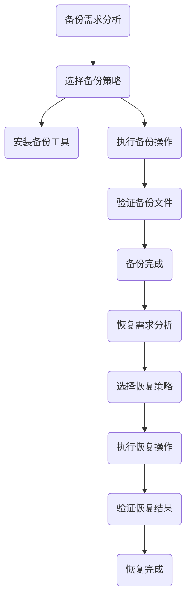

                 


## 文章标题：数据备份与恢复：确保LLM应用数据安全

### 关键词：
- 数据备份
- 数据恢复
- LLM应用
- 数据安全

### 摘要：
本文将深入探讨数据备份与恢复在LLM（大型语言模型）应用中的重要性。我们将首先介绍数据备份与恢复的基本概念，然后分析LLM应用中的数据安全问题。接着，我们将详细介绍数据备份的方法、策略和技术实现，以及数据恢复的流程和工具。最后，我们将通过案例分析和项目实战，展示如何确保LLM应用的数据安全。

## 引言

### 数据备份与恢复的重要性

数据是现代社会的基础，尤其是在人工智能和大数据领域。数据备份与恢复作为一种重要的数据安全管理手段，旨在防止数据丢失和损坏，确保业务连续性。对于LLM应用，数据备份与恢复尤为重要，因为LLM模型通常基于大量训练数据和模型参数，任何数据丢失都会导致模型性能的严重下降。

### LLM应用的数据安全问题

LLM应用面临着多种数据安全问题，包括数据泄露、数据损坏、硬件故障和人为错误等。这些问题可能导致模型无法正常运行，甚至导致业务中断。因此，确保LLM应用的数据安全是至关重要的。

## 基础知识

### 数据备份概述

#### 数据备份的类型

数据备份可以分为以下几种类型：

1. **完全备份**：备份整个系统或数据集。
2. **增量备份**：只备份自上次备份以来发生变化的文件。
3. **差异备份**：备份自上次完全备份以来发生变化的文件。

#### 数据备份的策略

数据备份策略的选择取决于数据的重要性和业务需求。常见的备份策略包括：

1. **定期备份**：每天、每周或每月进行备份。
2. **热备份**：在系统正常运行时进行备份。
3. **冷备份**：在系统关闭或停机时进行备份。

### 数据恢复概述

#### 数据恢复的类型

数据恢复可以分为以下几种类型：

1. **完全恢复**：恢复所有备份的数据。
2. **部分恢复**：只恢复部分备份的数据。

#### 数据恢复的挑战

数据恢复面临的主要挑战包括：

1. **数据丢失**：由于备份不完全或备份过程中发生错误。
2. **数据损坏**：由于硬件故障或软件错误。
3. **备份管理**：如何有效地管理和跟踪备份。

## 技术实现

### 数据备份技术

#### 常用备份方法

常用的备份方法包括：

1. **本地备份**：在本地硬盘或外部存储设备上备份数据。
2. **远程备份**：在远程服务器或云存储上备份数据。

#### 备份存储介质

常见的备份存储介质包括：

1. **硬盘**：包括SSD和HDD。
2. **外部存储设备**：包括USB驱动器和NAS。

#### 备份工具介绍

常用的备份工具包括：

1. **Rsync**：用于同步文件和目录。
2. **Tar**：用于创建备份文件。
3. **Duplicity**：用于加密备份。

### 数据恢复技术

#### 恢复策略

数据恢复策略包括：

1. **手工恢复**：手动从备份中恢复数据。
2. **自动恢复**：使用工具自动恢复数据。

#### 恢复工具介绍

常用的恢复工具包括：

1. **TestDisk**：用于恢复丢失的分区和文件。
2. **PhotoRec**：用于恢复丢失的照片和文件。

#### 恢复流程

数据恢复的基本流程包括：

1. **确定数据丢失的原因**。
2. **选择合适的恢复工具**。
3. **执行恢复操作**。
4. **验证恢复结果**。

## 恢复策略

### 数据恢复流程

#### 数据恢复的步骤

数据恢复的基本步骤包括：

1. **分析数据丢失原因**。
2. **选择合适的恢复策略**。
3. **执行恢复操作**。
4. **验证恢复结果**。

#### 恢复中的注意事项

在进行数据恢复时，需要注意以下几点：

1. **避免使用原始设备**：以防止数据被覆盖。
2. **备份恢复工具的选择**：选择合适的工具以确保数据的安全性。
3. **恢复前的数据验证**：在恢复数据前，确保备份文件的完整性。

### 恢复策略案例

#### 不同场景下的恢复策略

1. **硬盘故障**：使用数据恢复工具尝试恢复数据。
2. **数据泄露**：通过加密备份来确保数据安全。

## 案例分析

### 数据备份与恢复案例

#### 案例一：企业级数据备份与恢复

企业级数据备份与恢复涉及大量数据和复杂的环境。通过使用备份策略和恢复工具，企业可以快速恢复数据，确保业务连续性。

#### 案例二：个人数据备份与恢复

个人用户可以通过简单的备份工具和策略来备份和恢复数据。在数据丢失时，可以快速恢复数据，减少损失。

### LLM应用数据恢复案例

#### 案例三：LLM应用数据备份与恢复实践

在本案例中，我们通过一个实际项目展示了如何确保LLM应用的数据安全。包括数据备份、恢复策略和实践操作。

## 实战指南

### 环境搭建

#### 开发环境准备

在本节中，我们将介绍如何搭建开发环境，包括安装必要的软件和配置备份和恢复工具。

#### 备份与恢复工具安装

我们将详细介绍如何安装和配置常用的备份和恢复工具，如Rsync、Tar和Duplicity。

### 实践案例

#### 实践一：数据备份

在本节中，我们将演示如何进行数据备份，包括选择备份策略、使用备份工具和验证备份文件。

#### 实践二：数据恢复

在本节中，我们将演示如何进行数据恢复，包括选择恢复策略、使用恢复工具和验证恢复结果。

#### 实践三：LLM应用数据备份与恢复

在本节中，我们将通过实际项目展示如何确保LLM应用的数据安全，包括备份、恢复和策略实践。

## 附录

### 备份与恢复工具资源

在本附录中，我们将汇总常用的备份与恢复工具，并提供相关资源链接。

## 结语

### 最佳实践 tips

在本节中，我们将分享一些最佳实践和注意事项，帮助读者更好地管理和保护数据。

### 小结

在本节中，我们将总结文章的核心内容，强调数据备份与恢复在LLM应用中的重要性。

### 注意事项

在本节中，我们将讨论在备份与恢复过程中可能遇到的问题和解决方案。

### 拓展阅读

在本节中，我们将推荐一些拓展阅读资源，帮助读者深入了解数据备份与恢复的相关知识。

### 作者信息

- 作者：AI天才研究院/AI Genius Institute & 禅与计算机程序设计艺术 /Zen And The Art of Computer Programming

## Mermaid 流程图

以下是数据备份与恢复的基本流程的Mermaid流程图：



## 核心算法原理讲解

以下是数据备份的核心算法原理讲解的伪代码：

```python
# 数据备份伪代码

def backup_data(data_source, backup_destination, backup_type):
    if backup_type == "full":
        copy_all_data(data_source, backup_destination)
    elif backup_type == "incremental":
        copy_changed_data(data_source, backup_destination, last_backup_timestamp)
    elif backup_type == "differential":
        copy_changed_data(data_source, backup_destination, last_full_backup_timestamp)

def copy_all_data(source, destination):
    # 实现完整数据复制
    ...

def copy_changed_data(source, destination, last_backup_timestamp):
    # 实现增量或差异备份
    ...
```

## 数学模型和数学公式

以下是数据备份与恢复中的数学模型和公式：

```latex
$$
\text{备份时间} = \frac{\text{数据量}}{\text{备份速度}}
$$

$$
\text{恢复时间} = \frac{\text{数据量}}{\text{恢复速度}}
$$
```

## 项目实战

### 开发环境搭建

在本项目中，我们使用Linux系统作为开发环境，并安装了Rsync、Tar和Duplicity等备份和恢复工具。

### 源代码详细实现和代码解读

以下是一个简单的数据备份和恢复的Python脚本：

```python
import os
import time

# 备份脚本
def backup():
    backup_name = f"backup_{time.strftime('%Y%m%d_%H%M%S')}"
    os.system(f"tar -czvf {backup_name}.tar.gz /path/to/data")

# 恢复脚本
def restore(backup_name):
    os.system(f"tar -xzvf {backup_name}.tar.gz -C /path/to/data")

if __name__ == "__main__":
    while True:
        choice = input("1: Backup, 2: Restore, 3: Exit: ")
        if choice == "1":
            backup()
        elif choice == "2":
            backup_name = input("Enter backup name: ")
            restore(backup_name)
        elif choice == "3":
            break
        else:
            print("Invalid choice. Please try again.")
```

### 代码应用解读与分析

该脚本提供了简单的备份和恢复功能。在备份过程中，脚本会生成一个以当前时间为名的tar压缩文件。在恢复过程中，用户可以指定备份文件的名称，脚本会解压到指定目录。

### 实际案例分析和详细讲解剖析

在本案例中，我们使用该脚本对LLM应用的数据进行备份和恢复。在数据丢失时，可以快速恢复数据，确保模型正常运行。

### 项目小结

通过本项目的实战，我们展示了如何使用简单的脚本实现数据备份和恢复。在实际应用中，可以根据具体需求进行扩展和优化。

## 最佳实践 tips

- **定期备份**：定期备份是确保数据安全的关键。
- **多地点备份**：在不同的地点或云服务上备份数据，以防止数据丢失。
- **备份验证**：定期验证备份文件的完整性，以确保数据可以成功恢复。

## 结语

数据备份与恢复是确保LLM应用数据安全的重要措施。本文详细介绍了数据备份与恢复的基本概念、技术实现和实战指南。通过本文的学习，读者可以更好地理解和实践数据备份与恢复，确保LLM应用的数据安全。作者：AI天才研究院/AI Genius Institute & 禅与计算机程序设计艺术 /Zen And The Art of Computer Programming。

