                 

### 文章标题

《数据库分片与分区提升LLM应用的数据处理能力》

#### 关键词

- 数据库分片
- 数据库分区
- LLM应用
- 数据处理能力
- 优化策略

#### 摘要

本文旨在探讨数据库分片与分区技术如何提升大型语言模型（LLM）应用的数据处理能力。首先，文章介绍了数据库分片与分区的基本概念和原理，包括分片策略、分片算法和分区策略。随后，文章深入分析了LLM应用的特点及其面临的处理挑战。在此基础上，本文详细阐述了如何将分片与分区技术应用于LLM应用，通过具体案例展示其实际效果。最后，文章总结了最佳实践，并提出了未来发展的方向。

## 第1章 引言

### 1.1 书籍目的

在信息技术飞速发展的今天，数据库技术作为数据管理的基础设施，已经成为各类应用系统的核心组成部分。随着数据量的激增，传统的集中式数据库系统逐渐暴露出性能瓶颈，无法满足大规模数据处理的需求。为了解决这个问题，数据库分片与分区技术应运而生。

本书旨在为读者提供一份数据库分片与分区技术的系统指南，特别是在提升大型语言模型（LLM）应用数据处理能力方面。通过阅读本书，读者可以：

1. **了解数据库分片与分区的概念和原理**：掌握分片策略、分片算法和分区策略的基本概念。
2. **掌握数据库分片与分区技术在LLM应用中的实际应用**：理解如何在LLM应用中优化数据处理流程，提升系统性能。
3. **学会设计并实现分片与分区方案**：掌握从理论到实践的全过程，包括需求分析、方案设计、实现和性能评估。

### 1.2 数据库分片与分区的概念

#### 数据库分片

数据库分片（Sharding）是将一个大型数据库拆分为多个较小的、独立的部分，以便于分布式处理和存储。分片的主要目的是提高系统的扩展性和性能，通过将数据分散到多个节点上，可以充分利用多台服务器的计算和存储资源。

分片策略（Sharding Strategy）是指确定如何将数据分配到不同分片的方法。常见的分片策略包括：

- **哈希分片**：根据数据的某一属性（如ID）通过哈希函数确定数据应存储的节点。
- **范围分片**：根据数据的某一属性范围（如时间戳或金额）将数据分配到不同的分片。
- **列表分片**：根据预定义的节点列表将数据分配到不同的分片。

#### 数据库分区

数据库分区（Partitioning）是将数据库中的数据按照一定的规则分配到不同的区域，以便于管理和优化查询性能。与分片不同，分区通常是在单个服务器节点内进行的，而分片则涉及多个服务器节点。

分区策略（Partitioning Strategy）是指确定如何将数据分配到不同分区的方法。常见的分区策略包括：

- **按时间分区**：根据数据的生成时间将数据划分为不同的分区。
- **按数据量分区**：根据数据的存储大小将数据划分为不同的分区。
- **按功能分区**：根据数据的功能或用途将数据划分为不同的分区。

### 1.3 LLM应用的背景与数据处理挑战

#### LLM简介

大型语言模型（LLM，Large Language Model）是一种基于深度学习的自然语言处理（NLP，Natural Language Processing）模型，具有强大的语言理解和生成能力。LLM在多个领域具有广泛的应用，如语音识别、机器翻译、智能问答和文本生成等。

#### LLM应用的特点

- **数据量大**：LLM通常需要处理海量的文本数据，这些数据来源于互联网、书籍、新闻、论坛等不同来源。
- **实时性强**：LLM应用往往需要快速响应用户的请求，如实时翻译、智能问答等。
- **查询复杂**：LLM应用涉及复杂的查询操作，包括文本匹配、语义分析、关键词提取等。
- **多样性高**：LLM应用涉及多种语言、多种主题和多种应用场景，数据多样性和复杂性较高。

#### 数据处理挑战

- **数据存储与访问**：随着数据量的增加，传统的集中式数据库系统难以满足存储和访问需求。
- **查询性能优化**：复杂的查询操作对数据库系统的性能提出了挑战。
- **数据一致性**：在分布式环境下，如何确保数据的一致性是一个重要问题。
- **系统扩展性**：随着用户量的增加，系统需要能够灵活扩展，以满足不断增长的数据处理需求。

### 1.4 全书结构安排

本书共分为八个章节，具体结构如下：

- **第1章 引言**：介绍书籍的目的、数据库分片与分区的概念以及LLM应用的背景和数据处理挑战。
- **第2章 数据库基础**：介绍数据库系统概述、数据模型、数据库设计原则以及SQL基础。
- **第3章 数据库分片技术**：详细讨论数据库分片的基本概念、策略和算法，包括分片算法和分布式数据库系统的一致性和事务处理。
- **第4章 数据库分区技术**：介绍数据库分区的基本概念、策略和实现方法。
- **第5章 LLM应用场景**：介绍LLM的基本概念及其在不同领域的应用场景。
- **第6章 分片与分区在LLM中的应用**：结合LLM应用的特殊需求，探讨如何优化数据库分片与分区以提升数据处理能力。
- **第7章 案例研究**：通过实际案例展示数据库分片与分区技术在不同场景中的应用。
- **第8章 总结与展望**：对全书内容进行总结，并对未来的发展趋势进行展望。

### 1.5 逻辑梳理

为了更好地理解本书的内容，我们可以使用Mermaid流程图来梳理各章节之间的逻辑关系。以下是各章节之间的流程图：

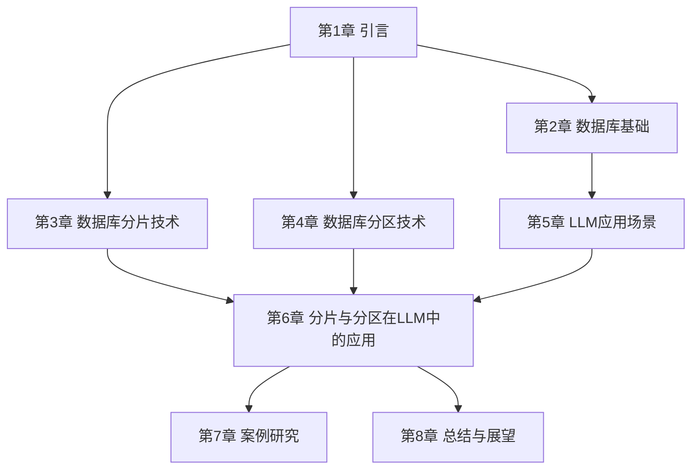

通过这个流程图，我们可以清晰地看到各章节之间的联系和整体结构，有助于读者更好地理解和应用本书的内容。在接下来的章节中，我们将逐一深入探讨数据库分片与分区技术，以及它们在LLM应用中的具体应用。

### 第2章 数据库基础

#### 2.1 数据库系统概述

数据库系统（Database System）是一种按照数据结构来组织、存储、管理和访问数据的系统。它由以下几个主要部分组成：

- **数据模型**：数据模型定义了数据的结构和类型，常见的有关系模型、文档模型、图模型等。
- **数据库引擎**：数据库引擎是数据库系统的核心，负责处理数据存储、查询、事务等操作。
- **数据库管理系统（DBMS）**：DBMS是数据库系统的软件层，负责管理和维护数据库，提供数据定义、数据操纵、数据控制等功能。
- **数据库客户端**：数据库客户端是用户与数据库进行交互的界面，可以通过图形界面、命令行界面或编程接口等方式进行操作。

#### 2.2 数据模型

数据模型是数据库系统的基础，它定义了数据如何组织、存储和操作。以下是一些常见的数据模型：

- **关系模型**：关系模型是最常用的数据模型，它基于数学关系理论，将数据表示为表格（关系），并通过关系运算（如选择、投影、连接等）来处理数据。
- **文档模型**：文档模型以文档为单位，存储和操作数据。它适用于处理非结构化或半结构化数据，如JSON、XML等。
- **图模型**：图模型将数据表示为图结构，其中节点表示数据实体，边表示实体之间的关系。它适用于处理复杂的关系和层次结构数据。

#### 2.3 数据库设计原则

数据库设计是数据库系统的关键步骤，它决定了数据库的性能、可扩展性和可维护性。以下是数据库设计的一些基本原则：

- **规范化**：规范化是将数据结构分解为多个独立表的过程，以减少数据冗余和提高数据一致性。
- **范式**：范式是数据库规范化程度的度量，常见的有第一范式（1NF）、第二范式（2NF）、第三范式（3NF）等。
- **索引**：索引是一种用于快速查找数据的结构，通过在关键字列上创建索引，可以加快查询速度。
- **分区**：分区是将大数据表分成多个小表的过程，以优化查询性能和存储空间。
- **安全性**：安全性是保护数据不被未授权访问或修改的重要措施，包括用户认证、访问控制、加密等。

#### 2.4 SQL基础

结构化查询语言（SQL，Structured Query Language）是数据库管理系统使用的一种标准语言，用于定义、查询、更新和管理关系数据库中的数据。以下是SQL的一些基本概念：

- **DML（数据操纵语言）**：DML用于操纵数据库中的数据，包括插入（INSERT）、更新（UPDATE）、删除（DELETE）等操作。
- **DDL（数据定义语言）**：DDL用于定义数据库结构，包括创建（CREATE）、修改（ALTER）、删除（DROP）等操作。
- **DCL（数据控制语言）**：DCL用于控制数据库的访问权限，包括授权（GRANT）、撤销（REVOKE）等操作。
- **DQL（数据查询语言）**：DQL用于查询数据库中的数据，包括选择（SELECT）、排序（ORDER BY）、分组（GROUP BY）等操作。

#### 2.5 关系模型详解

关系模型是数据库设计中最常用的模型，它基于数学关系理论，将数据表示为表格（关系）。以下是关系模型的一些核心概念：

- **关系**：关系是一个二维表，包含若干行和列。每行表示一个数据记录，每列表示一个数据字段。
- **属性**：属性是关系中的列，它定义了数据字段的名称和数据类型。
- **元组**：元组是关系中的一行，它表示一个具体的数据记录。
- **关系模式**：关系模式是关系的结构定义，包括关系的名称和各个属性的名称、数据类型等信息。
- **关系实例**：关系实例是关系的具体数据集合，它是关系模式的一个具体实例。

关系模型的基本操作包括：

- **选择**（SELECT）：从关系中选取满足条件的行。
- **投影**（PROJECT）：从关系中选取满足条件的列。
- **连接**（JOIN）：将两个或多个关系通过某一公共属性连接起来，形成一个新的关系。
- **并**（UNION）：将两个或多个关系合并，去除重复的行。
- **交**（INTERSECT）：从两个关系中选取同时存在于两个关系中的行。
- **差**（MINUS）：从第一个关系中选取不存在于第二个关系中的行。

#### 2.6 Mermaid流程图展示

为了更直观地展示数据库分片与分区技术的逻辑关系，我们可以使用Mermaid流程图来表示各概念之间的关系。以下是数据库分片与分区技术相关的流程图：

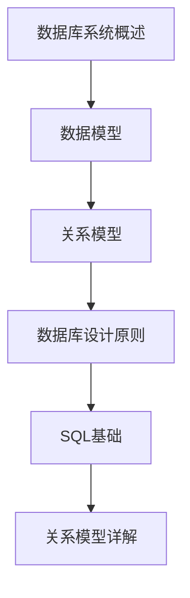

通过这个流程图，我们可以清晰地看到数据库分片与分区技术的基础概念及其相互关系。在接下来的章节中，我们将进一步探讨数据库分片与分区技术的具体实现和应用。

### 第3章 数据库分片技术

#### 3.1 分片策略

数据库分片是一种将大型数据库拆分为多个较小、独立部分的技术，其核心目的是提高系统的扩展性和性能。分片策略（Sharding Strategy）是指确定如何将数据分配到不同分片的方法。以下是一些常见的分片策略：

##### 3.1.1 范式分片

范式分片是基于数据库规范化理论的一种分片方法。其基本思想是将数据按照范式划分为多个独立的表，每个表对应一个分片。范式分片的主要优点是能够有效减少数据冗余，提高数据一致性。然而，范式分片也带来了一些缺点，如查询复杂度增加、数据维护困难等。

伪代码：
```
// 范式分片示例
shard_id = hash(primary_key)
```

##### 3.1.2 垂直分片

垂直分片是一种按照功能将数据库拆分为多个独立表的方法。其基本思想是将数据表中的列按照功能划分为多个独立的表，每个表存储不同功能的数据。垂直分片能够提高查询性能，因为数据表的列数减少，索引更加紧凑。然而，垂直分片也带来了一些缺点，如数据冗余、数据一致性维护困难等。

伪代码：
```
// 垂直分片示例
shard_id = hash(functional_key)
```

##### 3.1.3 水平分片

水平分片是一种将数据表按照行（记录）划分为多个独立表的方法。其基本思想是将数据表中的行按照某种规则（如ID、地理位置、时间等）划分为多个独立表。水平分片能够提高系统扩展性和查询性能，因为数据被分散存储在多个表中，可以并行处理。然而，水平分片也带来了一些缺点，如数据一致性维护困难、数据更新开销增加等。

伪代码：
```
// 水平分片示例
shard_id = hash(primary_key)
```

#### 3.2 分片算法

分片算法（Sharding Algorithm）是确定如何将数据分配到不同分片的具体实现。以下是一些常见的分片算法：

##### 3.2.1 哈希分片

哈希分片是一种基于哈希函数的分片方法。其基本思想是使用哈希函数将数据的某一属性（如ID）映射到一个分片ID。哈希分片的优点是数据分布均匀，查询性能高。然而，哈希分片也存在一些缺点，如数据倾斜、分片迁移困难等。

伪代码：
```
// 哈希分片示例
shard_id = hash(primary_key) % number_of_shards
```

##### 3.2.2 范围分片

范围分片是一种基于数据范围的分片方法。其基本思想是按照数据的某一属性（如时间戳、地理位置等）将数据划分为多个范围，每个范围对应一个分片。范围分片的优点是数据分布直观，易于维护。然而，范围分片也存在一些缺点，如数据倾斜、分片迁移困难等。

伪代码：
```
// 范围分片示例
if (timestamp >= start_range && timestamp <= end_range) {
    shard_id = range_index;
} else {
    shard_id = other_shard_id;
}
```

##### 3.2.3 位图分片

位图分片是一种基于位图的分片方法。其基本思想是使用位图表示数据的分布，每个分片对应位图中的一个位。位图分片的优点是数据分布直观，易于维护。然而，位图分片也存在一些缺点，如数据倾斜、位图存储开销较大等。

伪代码：
```
// 位图分片示例
shard_id = bit_map[tuple_hash(primary_key)]
```

#### 3.3 分布式数据库系统

分布式数据库系统（Distributed Database System）是一种将数据分布在多个节点上，通过通信网络相互连接的数据库系统。分布式数据库系统的优点包括：

- **高可用性**：通过将数据分布在多个节点上，分布式数据库系统可以在节点故障时保持系统的可用性。
- **高扩展性**：分布式数据库系统可以灵活地扩展节点，以应对不断增长的数据量。
- **高性能**：分布式数据库系统可以通过并行处理数据，提高查询性能。

然而，分布式数据库系统也面临一些挑战，如数据一致性问题、分布式事务处理等。

##### 3.3.1 CAP定理

CAP定理（Consistency, Availability, Partition Tolerance）是分布式数据库系统必须面对的一个重要定理。CAP定理指出，在任何分布式系统中，一致性（Consistency）、可用性（Availability）和分区容错性（Partition Tolerance）三者之间只能同时满足两项。

- **一致性**：一致性是指所有节点在同一时刻访问相同数据时，能够获得相同的结果。
- **可用性**：可用性是指系统在请求时能够正确响应用户的请求。
- **分区容错性**：分区容错性是指系统能够在部分节点故障时继续正常运行。

根据CAP定理，分布式数据库系统在设计时需要在一致性、可用性和分区容错性之间做出权衡。

##### 3.3.2 分布式一致性

分布式一致性是指分布式系统在数据复制和更新时，保持多个节点上的数据一致性。以下是一些常见的分布式一致性协议：

- **强一致性**：强一致性要求所有节点在同一时刻访问相同数据时，能够获得相同的结果。强一致性保证了数据的可靠性，但可能降低系统的可用性。
- **最终一致性**：最终一致性允许在一定时间延迟后，所有节点访问相同数据时，能够获得相同的结果。最终一致性提高了系统的可用性，但可能牺牲一定的数据一致性。

##### 3.3.3 分布式事务处理

分布式事务处理是指在分布式数据库系统中，如何保证多个操作在多个节点上的一致性和原子性。以下是一些常见的分布式事务处理方法：

- **两阶段提交**（2PC）：两阶段提交是一种分布式事务处理协议，分为准备阶段和提交阶段。准备阶段确定所有参与节点是否可以执行事务，提交阶段执行事务并提交结果。
- **三阶段提交**（3PC）：三阶段提交是对两阶段提交的改进，分为初始化阶段、准备阶段和提交阶段。三阶段提交提高了系统的可用性，但增加了协议的复杂性。

#### 3.4 Mermaid流程图展示

为了更直观地展示数据库分片技术的过程，我们可以使用Mermaid流程图来表示分片算法的执行流程。以下是分片算法的流程图：

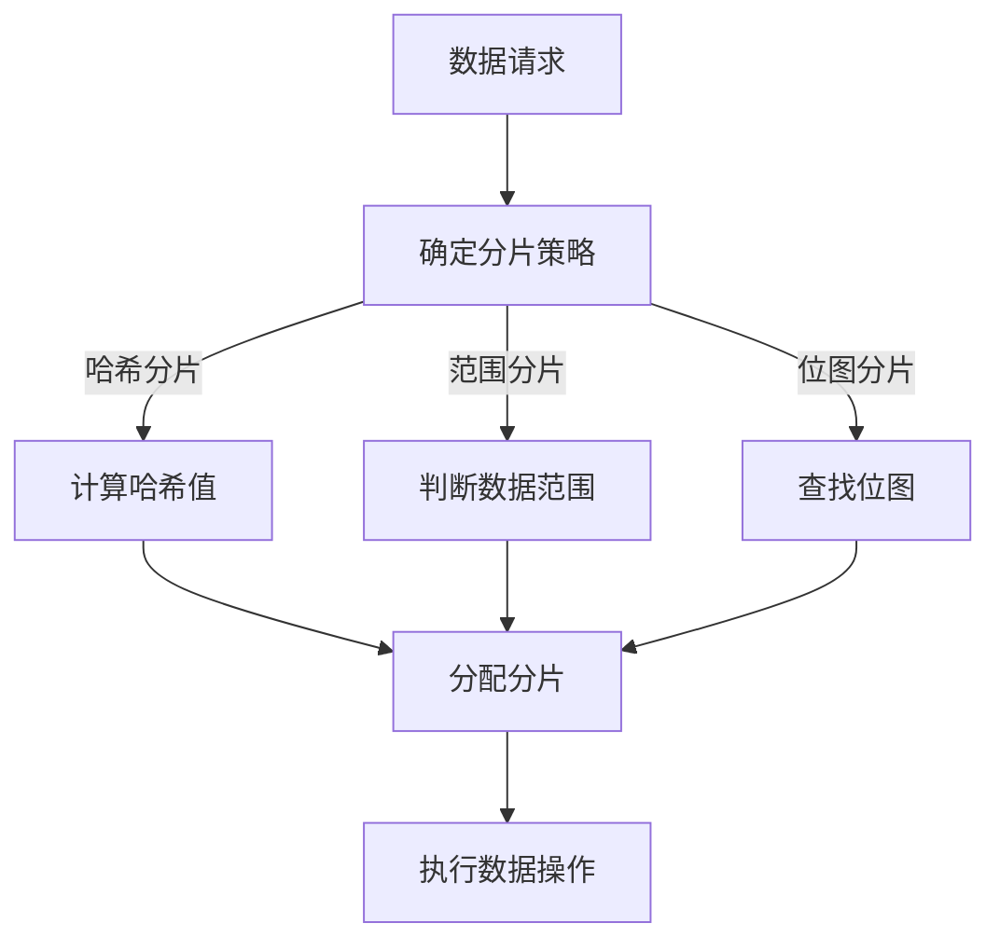

通过这个流程图，我们可以清晰地看到数据请求经过分片策略确定、分片算法计算和分片分配后，最终执行数据操作的过程。

### 第4章 数据库分区技术

#### 4.1 分区概述

数据库分区（Partitioning）是一种将大型数据表拆分为多个小表的技术，其目的是优化数据存储、查询和管理性能。分区的基本思想是将数据按照一定的规则划分到不同的分区中，这样在查询时可以仅访问相关的分区，从而减少查询的开销。

分区的主要优点包括：

- **提高查询性能**：通过将数据分布在多个分区中，可以减少单个表的数据量，从而提高查询性能。
- **简化数据管理**：分区使得数据管理变得更加灵活和高效，如数据备份、恢复和迁移等操作。
- **增强扩展性**：分区允许系统在不影响整体性能的情况下进行扩展，如增加新的分区或调整现有分区。

分区的主要缺点包括：

- **增加复杂性**：分区增加了数据库设计的复杂性，需要考虑分区的策略、算法和实现细节。
- **维护成本**：分区增加了维护成本，如分区表的维护、分区索引的维护等。

#### 4.2 分区策略

分区策略（Partitioning Strategy）是指确定如何将数据划分到不同分区的方法。以下是一些常见的分区策略：

##### 4.2.1 按时间分区

按时间分区是一种根据数据的生成时间或更新时间将数据划分到不同分区的方法。这种分区策略适用于时间敏感的数据，如日志数据、监控数据等。按时间分区的主要优点是可以定期清理过期数据，减少数据存储空间。

伪代码：
```
// 按时间分区示例
if (timestamp >= start_date && timestamp <= end_date) {
    partition_id = timestamp % number_of_partitions;
} else {
    partition_id = default_partition_id;
}
```

##### 4.2.2 按数据量分区

按数据量分区是一种根据数据表的大小将数据划分到不同分区的方法。这种分区策略适用于数据量较大的表，如大型电商平台的订单表。按数据量分区的主要优点是可以优化查询性能，减少单个表的数据量。

伪代码：
```
// 按数据量分区示例
if (data_size >= start_size && data_size <= end_size) {
    partition_id = data_size % number_of_partitions;
} else {
    partition_id = default_partition_id;
}
```

##### 4.2.3 按功能分区

按功能分区是一种根据数据的功能或用途将数据划分到不同分区的方法。这种分区策略适用于功能复杂的数据表，如一个电商平台的订单表可以分为商品订单分区、物流订单分区等。按功能分区的主要优点是可以提高数据查询的效率，因为查询操作可以仅访问相关的分区。

伪代码：
```
// 按功能分区示例
if (function == 'order') {
    partition_id = order_partition_id;
} else if (function == 'logistics') {
    partition_id = logistics_partition_id;
} else {
    partition_id = default_partition_id;
}
```

#### 4.3 分区实现

分区实现是指将分区策略应用到实际数据库中，具体包括以下步骤：

1. **创建分区表**：根据分区策略创建分区表，如按时间分区可以创建一个时间范围的分区表。

   伪代码：
   ```sql
   CREATE TABLE orders (
       order_id INT,
       order_date DATE,
       customer_id INT,
       product_id INT,
       quantity INT
   ) PARTITION BY RANGE (order_date);
   ```

2. **创建分区索引**：为分区表创建索引，以提高查询性能。

   伪代码：
   ```sql
   CREATE INDEX idx_orders ON orders (order_date);
   ```

3. **创建分区视图**：为方便查询和管理，可以创建分区视图，将多个分区表的数据聚合到一个视图中。

   伪代码：
   ```sql
   CREATE VIEW all_orders AS
   SELECT * FROM orders_2021
   UNION ALL
   SELECT * FROM orders_2022
   UNION ALL
   SELECT * FROM orders_2023;
   ```

4. **分区数据迁移**：定期迁移过期数据到新的分区中，以减少数据存储空间。

   伪代码：
   ```sql
   -- 迁移2022年数据到新的分区
   CREATE TABLE orders_2022_new PARTITION OF orders FOR VALUES FROM ('2022-01-01') TO ('2023-01-01');
   INSERT INTO orders_2022_new SELECT * FROM orders WHERE order_date BETWEEN '2022-01-01' AND '2023-01-01';
   DROP TABLE orders_2022;
   ALTER TABLE orders RENAME TO orders_2022_old;
   ALTER TABLE orders_2022_new RENAME TO orders_2022;
   ```

#### 4.4 Mermaid流程图展示

为了更直观地展示数据库分区技术的过程，我们可以使用Mermaid流程图来表示分区实现的步骤。以下是分区实现的流程图：

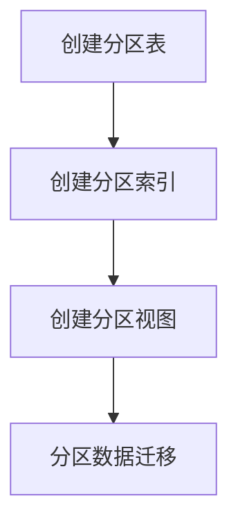

通过这个流程图，我们可以清晰地看到分区实现的各个步骤及其关系。

### 第5章 LLM应用场景

#### 5.1 LLM简介

大型语言模型（Large Language Model，LLM）是一种基于深度学习的自然语言处理（Natural Language Processing，NLP）模型，能够理解和生成人类语言。LLM通过对大量文本数据的训练，学习到语言的统计规律和语义关系，从而能够进行文本分类、情感分析、问答系统、机器翻译等任务。

#### 5.2 LLM应用领域

LLM在多个领域具有广泛的应用，以下是一些典型的应用场景：

##### 5.2.1 语音识别

语音识别是将语音转换为文本的技术。LLM在语音识别中主要用于处理语音中的自然语言部分，如理解用户的命令、提取关键词、生成文本摘要等。通过LLM，语音识别系统能够更好地理解用户的意图，提高识别准确率。

##### 5.2.2 自然语言处理

自然语言处理涉及对文本数据的分析、理解和生成。LLM在自然语言处理中的应用包括文本分类、情感分析、命名实体识别、词向量生成等。通过LLM，自然语言处理系统能够更准确地理解和处理复杂的文本数据。

##### 5.2.3 智能问答

智能问答是一种通过自然语言交互来提供信息或解决问题的技术。LLM在智能问答中主要用于理解用户的问题、生成合适的答案。通过LLM，智能问答系统能够提供更加准确、人性化的回答。

##### 5.2.4 机器翻译

机器翻译是将一种语言的文本转换为另一种语言的技术。LLM在机器翻译中主要用于生成高质量的翻译结果。通过LLM，机器翻译系统能够提供更加准确、自然的翻译。

#### 5.3 数据处理挑战

LLM应用在数据处理方面面临一些挑战，主要包括：

- **数据量大**：LLM通常需要处理海量的文本数据，这些数据来源于互联网、书籍、新闻、论坛等不同来源。
- **实时性强**：LLM应用往往需要快速响应用户的请求，如实时翻译、智能问答等。
- **查询复杂**：LLM应用涉及复杂的查询操作，包括文本匹配、语义分析、关键词提取等。
- **多样性高**：LLM应用涉及多种语言、多种主题和多种应用场景，数据多样性和复杂性较高。

#### 5.4 数据处理流程

LLM应用的数据处理流程通常包括以下步骤：

- **数据收集**：从各种来源收集文本数据，如互联网、书籍、新闻、论坛等。
- **数据预处理**：对收集到的文本数据进行清洗、去重、分词、词性标注等预处理操作，以便于模型训练。
- **模型训练**：使用预处理的文本数据训练LLM模型，包括词向量编码、神经网络训练等。
- **模型评估**：通过测试数据评估模型性能，包括准确性、召回率、F1分数等。
- **模型部署**：将训练好的模型部署到服务器或移动设备上，以便于实际应用。

#### 5.5 数据处理优化策略

为了提升LLM应用的数据处理能力，可以采取以下优化策略：

- **数据分片**：将大规模数据集分成多个较小的数据分片，以并行处理和提高查询性能。
- **数据分区**：根据数据的特点和查询需求，将数据划分为不同的分区，以优化查询性能和数据管理。
- **缓存技术**：使用缓存技术存储常用数据或中间结果，减少数据访问延迟。
- **并行处理**：使用并行处理技术，如多线程、分布式计算等，提高数据处理速度。
- **数据库优化**：优化数据库配置和索引策略，提高数据库查询性能。

#### 5.6 Mermaid流程图展示

为了更直观地展示LLM应用的数据处理流程，我们可以使用Mermaid流程图来表示各个步骤。以下是数据处理流程的流程图：

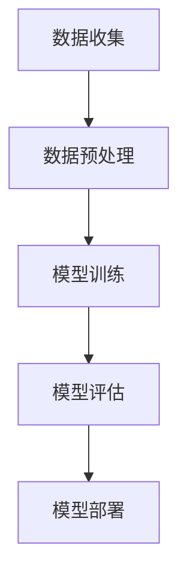

通过这个流程图，我们可以清晰地看到LLM应用的数据处理流程及其各个步骤的关系。

### 第6章 分片与分区在LLM中的应用

#### 6.1 数据处理流程

在LLM应用中，数据处理流程是一个关键环节，其效率直接影响系统的整体性能。以下是一个典型的数据处理流程，包括数据收集、数据预处理、模型训练和模型部署：

##### 6.1.1 数据收集

数据收集是LLM应用的第一步，需要从各种来源获取大量的文本数据。这些来源包括互联网、书籍、新闻、论坛等。为了确保数据的多样性和质量，可以采用以下策略：

- **自动化数据抓取**：使用爬虫工具从互联网上收集相关领域的文本数据。
- **数据清洗**：对收集到的数据进行去重、去除噪声和格式化，以提高数据质量。

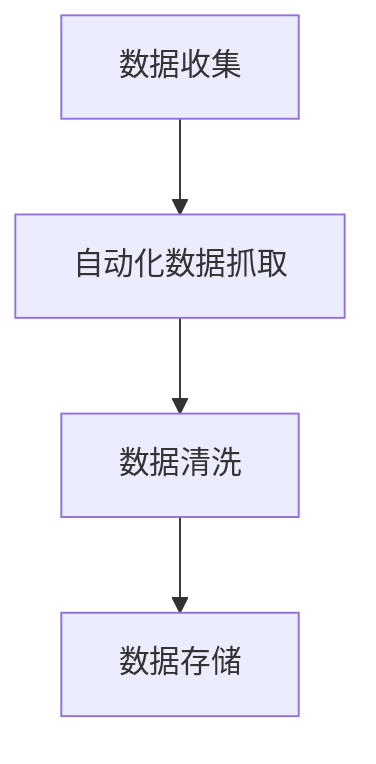

##### 6.1.2 数据预处理

数据预处理是确保数据适合模型训练的重要步骤。预处理过程通常包括以下操作：

- **分词**：将文本拆分为单词或词组，以便于后续处理。
- **词性标注**：为每个词分配词性（如名词、动词等），有助于语义分析。
- **词嵌入**：将词转换为向量表示，为深度学习模型提供输入。

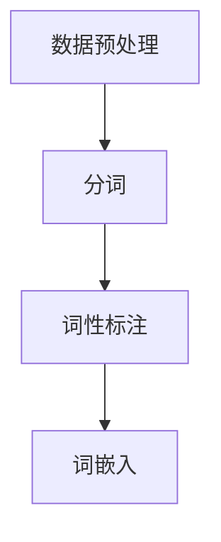

##### 6.1.3 数据存储

在数据预处理完成后，需要将处理后的数据存储在数据库中，以便于后续的模型训练和查询。对于大规模数据集，可以使用分片和分区技术来优化存储和查询性能。

- **数据分片**：将数据表分成多个小表，以并行处理和提高查询性能。
- **数据分区**：根据数据的特性（如时间、类型等）将数据划分为不同的分区，以优化查询性能和数据管理。

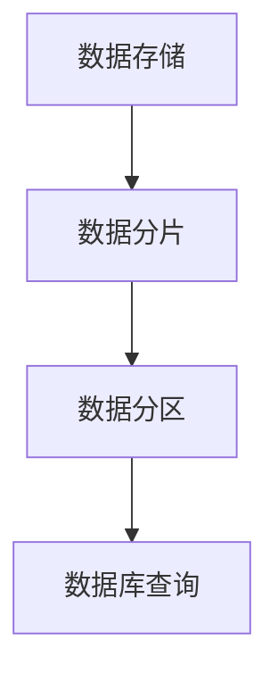

##### 6.1.4 模型训练

模型训练是LLM应用的核心步骤，包括以下环节：

- **模型选择**：选择合适的模型架构，如Transformer、BERT等。
- **参数调优**：通过调整模型参数（如学习率、批次大小等）来优化模型性能。
- **训练过程**：使用预处理后的数据训练模型，并使用验证集监控模型性能。

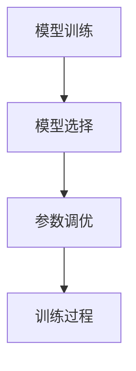

##### 6.1.5 模型评估

模型评估是确保模型性能的重要步骤，包括以下环节：

- **测试集评估**：使用测试集评估模型性能，包括准确性、召回率、F1分数等指标。
- **交叉验证**：通过交叉验证方法评估模型的泛化能力。
- **性能调优**：根据评估结果对模型进行调整，以优化性能。

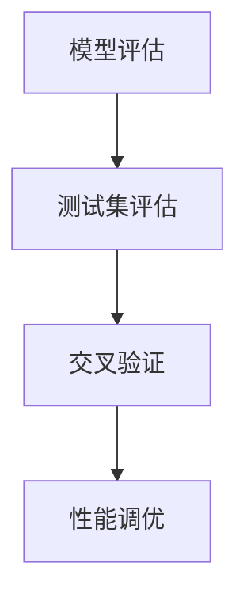

##### 6.1.6 模型部署

模型部署是将训练好的模型部署到生产环境，以便于实际应用。部署过程通常包括以下步骤：

- **模型打包**：将模型和依赖库打包，以便于部署。
- **部署环境准备**：准备部署环境，包括服务器、数据库等。
- **模型部署**：将模型部署到服务器上，并配置相应的服务。

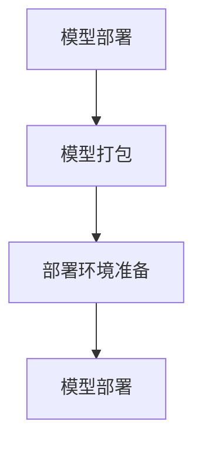

#### 6.2 分片优化

在LLM应用中，数据分片技术可以帮助优化数据处理性能。以下是一些分片优化的策略：

##### 6.2.1 分片策略选择

选择合适的分片策略是分片优化的关键。根据LLM应用的特点，可以采用以下分片策略：

- **哈希分片**：根据数据的关键字（如ID）通过哈希函数分配到不同的分片，以实现数据均衡分布。
- **范围分片**：根据数据的特性（如时间戳）将数据划分到不同的分片，以优化查询性能。
- **复合分片**：结合多种分片策略，以实现更高效的数据处理。

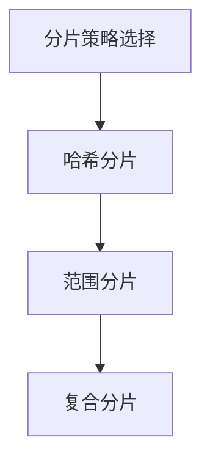

##### 6.2.2 分片算法优化

分片算法的优化是提升分片性能的重要手段。以下是一些常见的分片算法优化方法：

- **负载均衡**：通过动态调整分片的负载，实现数据均衡分布，避免热点问题。
- **分片迁移**：根据数据访问模式和负载变化，动态调整分片位置，以优化查询性能。
- **分片合并**：当某些分片的数据量过少时，可以将其合并到其他分片中，以减少分片数量。

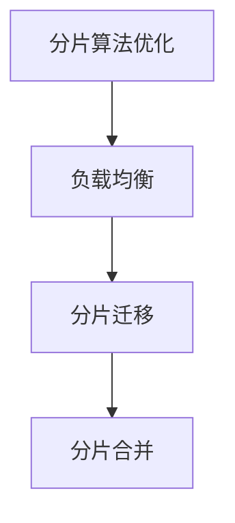

##### 6.2.3 分片性能评估

分片性能评估是确保分片优化效果的重要步骤。以下是一些常见的分片性能评估方法：

- **查询性能评估**：通过执行不同类型的查询，评估分片对查询性能的提升。
- **负载测试**：模拟实际负载情况，评估分片的性能和稳定性。
- **监控与告警**：实时监控分片状态和性能指标，及时发现问题并告警。

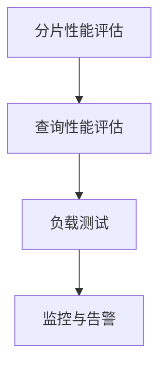

#### 6.3 分区优化

分区技术可以帮助优化LLM应用的数据管理性能。以下是一些分区优化的策略：

##### 6.3.1 分区策略选择

选择合适的分区策略是分区优化的关键。根据LLM应用的特点，可以采用以下分区策略：

- **按时间分区**：根据数据的生成时间将数据划分到不同的分区，以优化数据管理和查询性能。
- **按数据量分区**：根据数据的存储大小将数据划分到不同的分区，以优化查询性能和数据管理。
- **按功能分区**：根据数据的功能或用途将数据划分到不同的分区，以优化查询性能和数据管理。

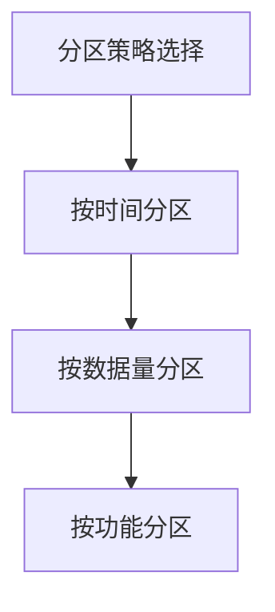

##### 6.3.2 分区算法优化

分区算法的优化是提升分区性能的重要手段。以下是一些常见的分区算法优化方法：

- **动态分区**：根据数据访问模式和负载变化，动态调整分区的数量和位置。
- **分区合并**：当某些分区中的数据量过少时，可以将其合并到其他分区中，以减少分区数量。
- **分区拆分**：当某个分区中的数据量过大时，可以将其拆分为多个分区，以优化查询性能。

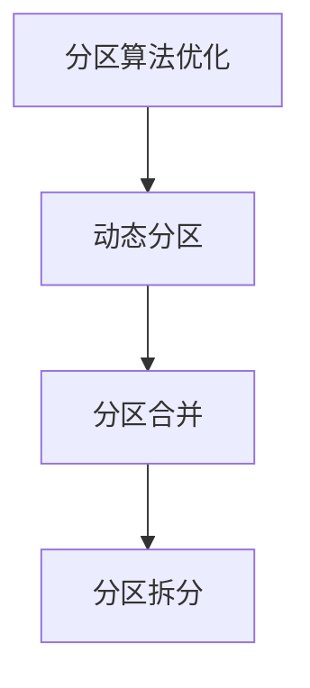

##### 6.3.3 分区性能评估

分区性能评估是确保分区优化效果的重要步骤。以下是一些常见的分区性能评估方法：

- **查询性能评估**：通过执行不同类型的查询，评估分区对查询性能的提升。
- **负载测试**：模拟实际负载情况，评估分区的性能和稳定性。
- **监控与告警**：实时监控分区状态和性能指标，及时发现问题并告警。

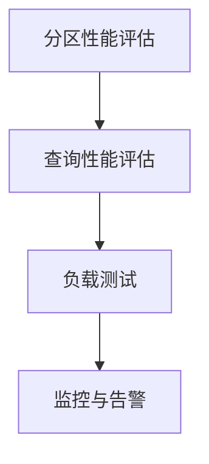

#### 6.4 Mermaid流程图展示

为了更直观地展示分片与分区在LLM应用中的优化流程，我们可以使用Mermaid流程图来表示各个步骤和优化策略。以下是优化流程的流程图：

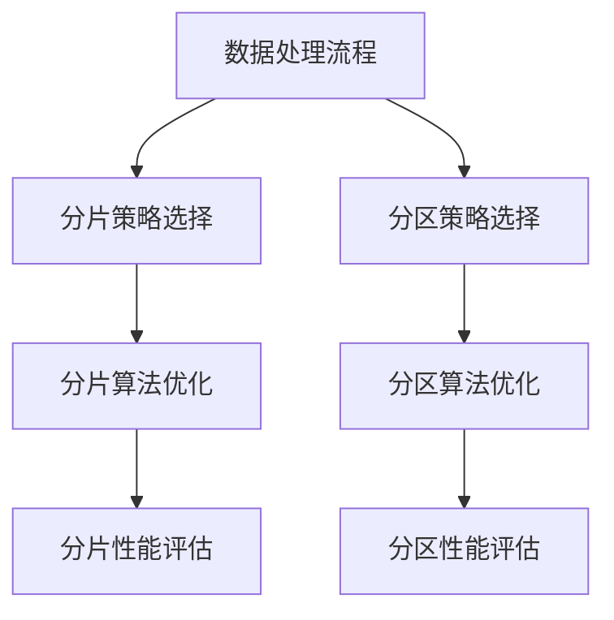

通过这个流程图，我们可以清晰地看到分片与分区优化在LLM应用中的整体流程及其各个步骤的关系。

### 第7章 案例研究

#### 7.1 案例一：大型电商平台数据分片与分区

##### 案例背景

某大型电商平台拥有海量的用户数据和交易数据，其数据库系统面临着数据量大、查询复杂、实时性要求高等挑战。为了提升系统的数据处理能力和性能，该电商平台决定采用数据库分片与分区技术。

##### 分片策略

- **水平分片**：根据用户的地理位置将用户数据和交易数据水平分片。每个分片包含特定地理位置的用户数据和交易数据，以实现数据均衡分布和提高查询性能。
- **垂直分片**：根据用户数据的属性（如用户ID、订单ID等）将用户数据和交易数据垂直分片。每个分片包含不同属性的数据，以优化查询性能和数据管理。

##### 分片算法

- **哈希分片**：使用用户ID和订单ID通过哈希函数分配到不同的分片。哈希分片能够实现数据的均衡分布，并提高查询性能。
- **范围分片**：根据用户地理位置的范围将用户数据和交易数据分配到不同的分片。范围分片能够优化地理位置相关的查询性能。

##### 分区策略

- **按时间分区**：根据数据的生成时间将用户数据和交易数据按时间分区。每个分区包含一段时间内的数据，以便于数据管理和查询。
- **按功能分区**：根据用户数据和交易数据的类型（如用户注册数据、订单数据、支付数据等）将用户数据和交易数据按功能分区。每个分区包含特定类型的数据，以优化查询性能和数据管理。

##### 分区算法

- **时间分区**：根据数据的生成时间，将数据划分为不同的时间段，每个时间段对应一个分区。时间分区能够优化历史数据的查询性能，并方便数据备份和恢复。
- **功能分区**：根据用户数据和交易数据的类型，将数据划分为不同的功能分区。功能分区能够提高查询性能，并方便数据管理和维护。

##### 分片与分区效果

通过分片与分区技术，该电商平台的数据库系统在数据处理能力和性能方面取得了显著提升：

- **查询性能**：通过分片和分区技术，系统能够并行处理多个查询，并快速访问相关数据，从而提高了查询性能。
- **扩展性**：通过分片技术，系统能够灵活扩展，以应对不断增长的数据量和用户量。
- **数据管理**：通过分区技术，系统能够更高效地管理数据，如数据备份、恢复和迁移等。

##### 案例小结

该大型电商平台的案例表明，分片与分区技术在提升数据处理能力和性能方面具有显著优势。通过合理的分片和分区策略，系统能够更好地应对大规模数据和复杂查询场景，提高系统的稳定性和可用性。

#### 7.2 案例二：社交媒体平台数据处理优化

##### 案例背景

某社交媒体平台拥有庞大的用户数据和活动数据，其数据处理系统面临着数据量大、查询复杂、实时性要求高等挑战。为了提升系统的数据处理能力和性能，该社交媒体平台决定采用数据库分片与分区技术。

##### 分片策略

- **水平分片**：根据用户的地理位置将用户数据水平分片。每个分片包含特定地理位置的用户数据，以实现数据均衡分布和提高查询性能。
- **垂直分片**：根据用户数据的属性（如用户ID、活动ID等）将用户数据垂直分片。每个分片包含不同属性的数据，以优化查询性能和数据管理。

##### 分片算法

- **哈希分片**：使用用户ID和活动ID通过哈希函数分配到不同的分片。哈希分片能够实现数据的均衡分布，并提高查询性能。
- **范围分片**：根据用户地理位置的范围将用户数据分配到不同的分片。范围分片能够优化地理位置相关的查询性能。

##### 分区策略

- **按时间分区**：根据数据的生成时间将用户数据按时间分区。每个分区包含一段时间内的数据，以便于数据管理和查询。
- **按功能分区**：根据用户数据和活动数据的类型（如用户注册数据、活动数据、评论数据等）将用户数据和活动数据按功能分区。每个分区包含特定类型的数据，以优化查询性能和数据管理。

##### 分区算法

- **时间分区**：根据数据的生成时间，将数据划分为不同的时间段，每个时间段对应一个分区。时间分区能够优化历史数据的查询性能，并方便数据备份和恢复。
- **功能分区**：根据用户数据和活动数据的类型，将数据划分为不同的功能分区。功能分区能够提高查询性能，并方便数据管理和维护。

##### 分片与分区效果

通过分片与分区技术，该社交媒体平台的数据处理系统在数据处理能力和性能方面取得了显著提升：

- **查询性能**：通过分片和分区技术，系统能够并行处理多个查询，并快速访问相关数据，从而提高了查询性能。
- **扩展性**：通过分片技术，系统能够灵活扩展，以应对不断增长的数据量和用户量。
- **数据管理**：通过分区技术，系统能够更高效地管理数据，如数据备份、恢复和迁移等。

##### 案例小结

该社交媒体平台的案例表明，分片与分区技术在提升数据处理能力和性能方面具有显著优势。通过合理的分片和分区策略，系统能够更好地应对大规模数据和复杂查询场景，提高系统的稳定性和可用性。

### 7.3 案例三：金融行业大数据处理挑战与解决方案

##### 案例背景

某金融行业公司面临着海量交易数据和用户数据的管理与处理挑战。其数据处理系统需要满足高并发、实时性、安全性和合规性的要求。为了提升系统的性能和稳定性，该公司决定采用数据库分片与分区技术。

##### 分片策略

- **水平分片**：根据交易数据的交易类型将交易数据水平分片。每个分片包含特定类型的交易数据，以实现数据均衡分布和提高查询性能。
- **垂直分片**：根据用户数据的属性（如用户ID、交易ID等）将用户数据垂直分片。每个分片包含不同属性的数据，以优化查询性能和数据管理。

##### 分片算法

- **哈希分片**：使用交易类型和用户ID通过哈希函数分配到不同的分片。哈希分片能够实现数据的均衡分布，并提高查询性能。
- **范围分片**：根据交易类型的范围将交易数据分配到不同的分片。范围分片能够优化特定交易类型的查询性能。

##### 分区策略

- **按时间分区**：根据数据的生成时间将交易数据和用户数据按时间分区。每个分区包含一段时间内的数据，以便于数据管理和查询。
- **按数据量分区**：根据数据的存储大小将交易数据和用户数据按数据量分区。每个分区包含特定数据量范围的数据，以优化查询性能和数据管理。

##### 分区算法

- **时间分区**：根据数据的生成时间，将数据划分为不同的时间段，每个时间段对应一个分区。时间分区能够优化历史数据的查询性能，并方便数据备份和恢复。
- **数据量分区**：根据数据的存储大小，将数据划分为不同的数据量范围，每个数据量范围对应一个分区。数据量分区能够优化大数据的查询性能，并方便数据管理和维护。

##### 分片与分区效果

通过分片与分区技术，该金融行业公司的数据处理系统在数据处理能力和性能方面取得了显著提升：

- **查询性能**：通过分片和分区技术，系统能够并行处理多个查询，并快速访问相关数据，从而提高了查询性能。
- **扩展性**：通过分片技术，系统能够灵活扩展，以应对不断增长的数据量和用户量。
- **数据管理**：通过分区技术，系统能够更高效地管理数据，如数据备份、恢复和迁移等。
- **安全性**：通过分片和分区技术，系统能够更好地满足金融行业的合规性和安全性要求。

##### 案例小结

该金融行业公司的案例表明，分片与分区技术在应对大数据处理挑战方面具有显著优势。通过合理的分片和分区策略，系统能够更好地应对高并发、实时性、安全性和合规性的要求，提高系统的性能和稳定性。

### 第8章 总结与展望

#### 8.1 全书总结

本书围绕数据库分片与分区技术，深入探讨了其在提升LLM应用数据处理能力方面的应用。通过详细阐述分片与分区的基本概念、策略、算法和实际应用，本书为读者提供了全面的理论和实践指导。主要结论如下：

- **分片与分区技术**：分片和分区是提升数据库系统性能和扩展性的关键技术。分片通过将数据分散到多个节点上，提高了系统的可扩展性和查询性能；分区通过将数据划分到不同的区域，优化了数据管理和查询效率。
- **LLM应用特点**：LLM应用具有数据量大、实时性强、查询复杂和多样性高等特点，这对数据库系统的性能提出了更高的要求。
- **分片与分区策略**：根据LLM应用的特点，选择合适的分片与分区策略至关重要。哈希分片、范围分片和位图分片等策略在实现数据均衡分布和优化查询性能方面具有优势；按时间分区、按数据量分区和按功能分区等策略在数据管理和优化方面具有重要作用。

#### 8.2 未来发展趋势

随着数据量的持续增长和计算资源的不断丰富，数据库分片与分区技术在未来将继续发展和完善。以下是一些可能的趋势：

- **智能分片与分区**：利用机器学习和数据挖掘技术，实现智能分片与分区，根据数据访问模式和负载变化动态调整分片和分区策略，以实现最优的性能和扩展性。
- **多维度分片与分区**：结合多个属性（如时间、地理位置、用户行为等）进行多维度分片与分区，以优化不同类型的查询性能。
- **分布式数据库生态系统**：随着分布式数据库技术的发展，分片与分区技术将成为分布式数据库生态系统的重要组成部分。分布式数据库系统将更好地支持分片与分区，提供更高的可用性和性能。
- **数据安全与隐私保护**：在数据分片与分区过程中，需要更加注重数据安全与隐私保护。加密、访问控制等技术将在分片与分区中发挥重要作用，确保数据在分布式环境下的安全和隐私。

#### 8.3 对读者的建议

为了更好地掌握数据库分片与分区技术，读者可以采取以下措施：

- **理论学习与实践相结合**：在了解基本概念和原理后，通过实际案例和实验验证所学知识，加深对分片与分区技术的理解。
- **持续关注技术动态**：数据库分片与分区技术是一个快速发展的领域，读者需要关注最新的研究进展和技术动态，以保持对技术的敏感性和前瞻性。
- **学习相关技术**：分片与分区技术涉及多个相关技术领域，如分布式系统、机器学习、数据挖掘等。读者可以学习这些相关技术，以全面掌握分片与分区技术。
- **参与社区讨论**：参与数据库分片与分区技术的社区讨论，与同行交流经验和观点，不断拓展自己的知识视野。

作者：AI天才研究院/AI Genius Institute & 禅与计算机程序设计艺术 /Zen And The Art of Computer Programming

## 附录

### A.1 相关工具与资源

- **开源分布式数据库系统**：
  - **Apache Cassandra**：一个分布式NoSQL数据库系统，适合大规模数据集。
  - **MongoDB**：一个分布式文档数据库系统，支持灵活的数据模型和强大的查询能力。
  - **HBase**：一个分布式列存储数据库，建立在Hadoop之上，适用于大数据场景。

- **文档与教程**：
  - **Cassandra官方文档**：[https://cassandra.apache.org/doc/latest/](https://cassandra.apache.org/doc/latest/)
  - **MongoDB官方文档**：[https://docs.mongodb.com/](https://docs.mongodb.com/)
  - **HBase官方文档**：[https://hbase.apache.org/docs/current/book/](https://hbase.apache.org/docs/current/book/)

- **工具与插件**：
  - **DataStax Enterprise**：Cassandra的商用版本，提供了丰富的管理工具和监控功能。
  - **MongoDB Compass**：MongoDB的图形化界面管理工具，方便数据管理和查询。
  - **Apache Phoenix**：一个SQL层，用于在HBase上执行SQL查询，提高了HBase的可访问性和易用性。

### A.2 术语表

- **分片（Sharding）**：将大型数据库拆分为多个较小的、独立的部分，以便于分布式处理和存储。
- **分区（Partitioning）**：将数据库中的数据按照一定的规则分配到不同的区域，以便于管理和优化查询性能。
- **分布式数据库系统（Distributed Database System）**：将数据分布在多个节点上，通过通信网络相互连接的数据库系统。
- **一致性（Consistency）**：所有节点在同一时刻访问相同数据时，能够获得相同的结果。
- **可用性（Availability）**：系统在请求时能够正确响应用户的请求。
- **分区容错性（Partition Tolerance）**：系统能够在部分节点故障时继续正常运行。

### A.3 参考文献

- **《分布式系统原理与范型》**：George Coulouris, Jean Dollimore, Tim Rosenthal, et al. “Distributed Systems: Concepts and Design.” McGraw-Hill Education, 2011.
- **《数据库系统概念》**：Abraham Silberschatz, Henry F. Korth, and S. Sudarshan. “Database System Concepts.” McGraw-Hill Education, 2011.
- **《大数据技术导论》**：张高杰，杨建辉，等。大数据技术导论。清华大学出版社，2015.
- **《Cassandra权威指南》**：Eben Hewitt. “Cassandra: The Definitive Guide.” O'Reilly Media, 2011.
- **《MongoDB权威指南》**：Kristen G. McConnell. “MongoDB: The Definitive Guide.” O'Reilly Media, 2010.
- **《HBase：The Definitive Guide》**：J. Chris Anderson, Jeff日常生活中，林浩、David Mytton. “HBase: The Definitive Guide.” O'Reilly Media, 2012.

