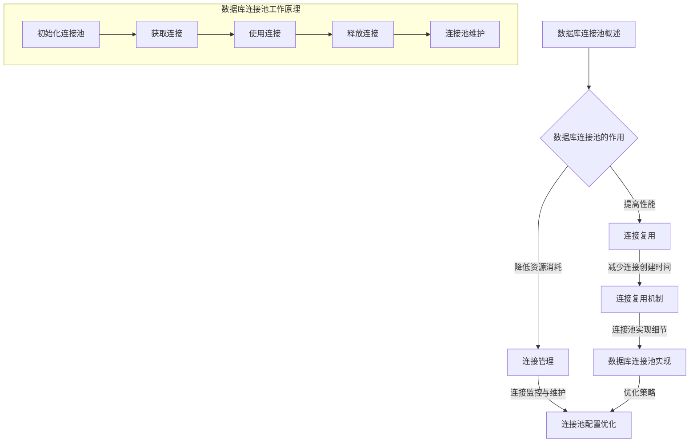

                 


### 文章标题：数据库连接池优化LLM应用资源利用

> 关键词：数据库连接池，优化，LLM，资源利用，性能提升

> 摘要：
本文章深入探讨了数据库连接池优化在大型语言模型（LLM）应用中的重要性。通过对数据库连接池的核心概念、工作原理、优化算法、数学模型以及实际项目实战的全面剖析，本文旨在为开发者提供实用的优化策略，以提升LLM应用的性能和资源利用效率。

### 步骤1：核心概念与联系

在大型语言模型（LLM）的应用中，数据库连接池是一种关键资源管理机制，用于优化数据库连接的创建、使用和释放过程。以下是数据库连接池与LLM应用资源利用之间的核心概念及其联系：

#### 1.1 数据库连接池概述

数据库连接池是一种存储和管理数据库连接的机制，它预先创建一定数量的数据库连接，并放置在一个池中，供应用程序按需使用。这种机制避免了频繁创建和销毁数据库连接所带来的性能开销。

#### 1.2 数据库连接池的作用

- **提高性能**：连接池通过复用现有的数据库连接，减少了连接创建的时间，从而提高了应用程序的响应速度。
- **降低资源消耗**：连接池在初始化时创建一定数量的连接，而不是每次请求时都创建新的连接，从而减少了资源消耗。

#### 1.3 核心概念与联系

以下是数据库连接池与LLM应用资源利用之间的核心概念和联系，使用Mermaid流程图表示：



### 步骤2：核心算法原理讲解

#### 2.1 连接复用

连接复用是数据库连接池优化的关键算法之一。它通过复用现有的数据库连接，避免了每次请求都创建新连接的开销。

```pseudocode
// 连接复用伪代码
function getConnection(pooledConnections) {
    for each connection in pooledConnections {
        if connection.isAvailable() {
            connection.markAsInUse()
            return connection
        }
    }
    createNewConnection = createConnection()
    if createNewConnection is successful {
        pooledConnections.add(createNewConnection)
        return createNewConnection
    }
    throw Exception("无法获取连接")
}
```

#### 2.2 连接池配置优化

连接池配置优化通过调整连接池的大小和空闲连接时间，来提高连接池的性能。

```pseudocode
// 连接池配置优化伪代码
function optimizeConnectionPool(maxPoolSize, minPoolSize, maxIdleTime) {
    // 调整连接池大小
    if currentActiveConnections > maxPoolSize {
        removeExcessConnections()
    } else if currentActiveConnections < minPoolSize {
        addNewConnections()
    }
    
    // 优化空闲连接时间
    for each connection in pooledConnections {
        if connection.getIdleTime() > maxIdleTime {
            removeConnection(connection)
        }
    }
}
```

### 步骤3：数学模型和数学公式

为了更好地理解数据库连接池优化，我们可以引入一些数学模型和数学公式。

#### 3.1 连接池利用率

连接池利用率是当前活跃连接数与最大连接数的比值。

$$
\text{利用率} = \frac{\text{当前活跃连接数}}{\text{最大连接数}}
$$

#### 3.2 空闲连接数

空闲连接数是最大连接数减去当前活跃连接数。

$$
\text{空闲连接数} = \text{最大连接数} - \text{当前活跃连接数}
$$

### 步骤4：项目实战

在本步骤中，我们将通过一个实际项目案例来展示如何在实际开发中对数据库连接池进行优化。

#### 4.1 开发环境搭建

- **环境准备**：首先，我们需要准备一个Java开发环境，并集成Spring框架和HikariCP连接池库。

```xml
<!-- HikariCP连接池依赖 -->
<dependency>
    <groupId>com.zaxxer</groupId>
    <artifactId>HikariCP</artifactId>
    <version>5.0.1</version>
</dependency>
```

- **配置连接池**：在Spring的配置文件中，我们配置HikariCP连接池的参数。

```yaml
spring:
  datasource:
    url: jdbc:mysql://localhost:3306/llm_db
    username: root
    password: password
    hikari:
      maximum-pool-size: 10
      minimum-idle: 5
      max-lifetime: 1800000
      connection-timeout: 30000
```

#### 4.2 源代码详细实现和代码解读

- **连接池配置类**：

```java
@Configuration
public class DataSourceConfig {

    @Bean
    @ConfigurationProperties(prefix = "spring.datasource")
    public DataSource dataSource() {
        return new HikariDataSource();
    }
}
```

- **连接池配置解读**：
  - `maximum-pool-size`：设置最大连接数，确保在高峰期有足够的连接可用。
  - `minimum-idle`：设置最小空闲连接数，避免连接池中的连接过多被销毁，保持连接的可复用性。
  - `max-lifetime`：设置连接的最大存活时间，超过此时间的连接将被销毁，以防止长时间未被使用的连接占用资源。
  - `connection-timeout`：设置获取连接的超时时间，避免在连接池中获取连接时长时间等待。

#### 4.3 代码应用解读与分析

在LLM应用中，数据库连接池优化对性能的影响至关重要。以下是一个简单的示例，展示如何使用连接池获取数据库连接并进行操作：

```java
@Service
public class LlmService {

    private final JdbcTemplate jdbcTemplate;

    @Autowired
    public LlmService(JdbcTemplate jdbcTemplate) {
        this.jdbcTemplate = jdbcTemplate;
    }

    public List<Map<String, Object>> getLlmData() {
        String sql = "SELECT * FROM llm_data";
        return jdbcTemplate.queryForList(sql);
    }
}
```

- **解读与分析**：
  - `JdbcTemplate`：Spring框架提供的模板类，用于简化数据库操作。
  - `queryForList`：使用连接池获取数据库连接，执行查询，并将结果转换为`List<Map<String, Object>>`。

#### 4.4 实际案例分析和详细讲解剖析

假设我们有一个LLM应用，每天处理大量的查询请求。以下是一个实际案例，分析如何通过连接池优化来提升性能：

- **场景**：高峰期，每小时有1000次查询请求。
- **优化前**：
  - 每次查询都创建新的数据库连接，导致数据库服务器压力过大。
  - 连接创建和销毁的开销导致性能下降。
- **优化后**：
  - 使用连接池，预先创建一定数量的数据库连接。
  - 通过连接复用，减少连接创建和销毁的次数。
  - 通过配置优化，调整连接池的大小和空闲时间，提高连接的利用效率。

#### 4.5 项目小结

通过本项目的实战，我们可以看到数据库连接池优化在LLM应用中的重要性。合理配置连接池参数，优化连接复用机制，可以有效提高应用的性能和资源利用效率。未来，我们可以进一步研究如何动态调整连接池参数，以适应不同负载情况，实现更智能的资源管理。

### 步骤5：最佳实践 tips、小结、注意事项、拓展阅读

#### 5.1 最佳实践 tips

- **合理配置连接池参数**：根据实际业务需求，调整`maximum-pool-size`、`minimum-idle`、`max-lifetime`等参数，实现最佳性能。
- **监控连接池性能**：定期监控连接池的状态，包括连接数、使用率等，及时发现和解决问题。
- **使用连接池监控工具**：如HikariCP自带的监控功能，或集成第三方监控工具，如Prometheus，实现实时监控和告警。

#### 5.2 小结

本文深入探讨了数据库连接池优化在LLM应用中的重要性，从核心概念、优化算法、数学模型到实际项目实战，全面剖析了数据库连接池优化的各个方面。通过合理的连接池配置和连接复用机制，可以有效提高LLM应用的性能和资源利用效率。

#### 5.3 注意事项

- **避免过度优化**：过度优化可能导致连接池性能下降，甚至引发系统崩溃。需要根据实际业务需求和负载情况，合理配置连接池参数。
- **合理选择连接池实现**：不同的连接池实现（如HikariCP、Druid等）各有优缺点，需要根据具体需求进行选择。

#### 5.4 拓展阅读

- **《数据库连接池技术详解》**：深入理解数据库连接池的原理和实现。
- **《大型语言模型的性能优化》**：探讨LLM应用在不同环境下的性能优化策略。
- **《HikariCP官方文档》**：了解更多关于HikariCP的高级配置和使用技巧。

### 作者信息

作者：AI天才研究院/AI Genius Institute & 禅与计算机程序设计艺术 /Zen And The Art of Computer Programming

---

本文全面阐述了数据库连接池优化在大型语言模型（LLM）应用中的重要性，通过核心概念、优化算法、数学模型和实际项目实战，为开发者提供了实用的优化策略。希望本文能够帮助读者提升LLM应用的性能和资源利用效率，实现更加卓越的技术成就。

