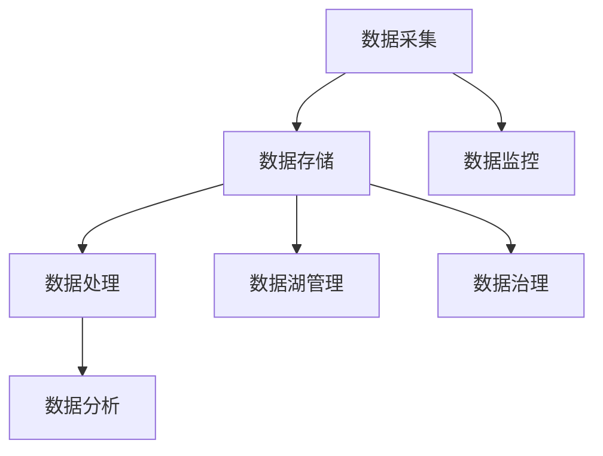
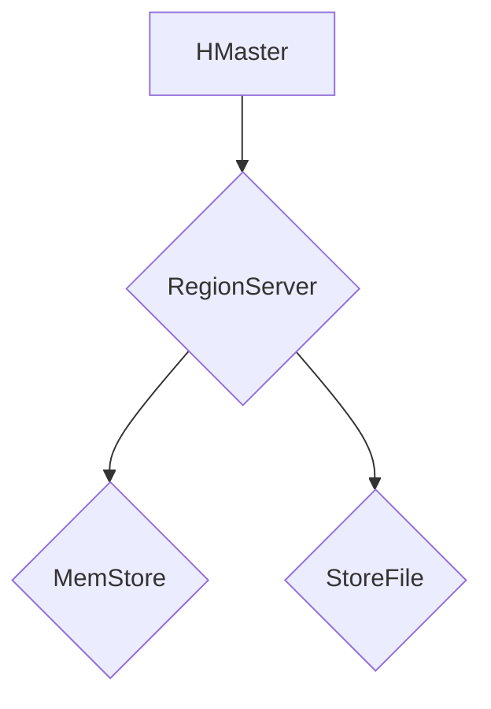

                 

### 文章标题

《数据湖架构：支持LLM应用的大规模数据分析》

### 关键词

- 数据湖
- 大规模数据分析
- LLM应用
- 分布式存储
- 分布式计算
- 数据预处理
- 数据治理

### 摘要

本文旨在深入探讨数据湖架构的设计与实现，特别是其在支持语言学习模型（LLM）应用中的关键作用。首先，我们将介绍数据湖的定义、发展历程及其与大数据平台的关系。随后，详细分析数据湖的架构设计原则和核心组件，包括数据采集、存储、处理和数据分析层。在此基础上，我们将深入探讨大规模数据处理与存储技术，如分布式文件系统和数据库，并使用伪代码展示核心算法原理。接着，我们关注数据湖与LLM的结合，介绍LLM的概念和应用场景，阐述数据湖在LLM中的数据预处理方法。随后，通过实际案例展示数据湖在电商和金融领域的应用，提供详细的案例分析。最后，本文将总结数据湖技术选型指南、搭建与优化步骤，并提供最佳实践建议。

### 数据湖架构

数据湖架构是一种新兴的大数据存储和处理架构，它与传统数据仓库架构有所不同，更加灵活和可扩展。数据湖的设计初衷是为了存储大量的结构化和非结构化数据，并提供高效的数据处理和分析能力，以满足现代企业对于数据多样化的需求。

#### 数据湖的定义

数据湖是一个分布式存储系统，用于存储海量结构化和非结构化数据。与传统数据仓库不同，数据湖不对数据进行预先处理或清洗，而是以原始形式存储，这样用户可以灵活地处理和挖掘数据，提取有价值的信息。

#### 数据湖的发展历程

1. **初始阶段（2000年代初）**：数据仓库开始普及，但面对数据多样化的挑战，传统的数据仓库难以满足需求。
2. **成熟阶段（2010年左右）**：随着Hadoop等分布式计算框架的出现，数据湖开始兴起，提供了一种新的数据存储和处理方式。
3. **当前阶段**：数据湖已经成为大数据领域的重要组成部分，被广泛应用于各类企业。

#### 数据湖与大数据平台的关系

数据湖是大数据平台的核心组件之一，与大数据平台的其他组件（如数据仓库、数据流处理系统、机器学习平台等）协同工作，形成一个完整的数据处理和分析生态系统。数据湖为大数据平台提供了海量数据的存储和管理能力，而数据仓库则专注于数据的清洗、转换和分析。

#### 数据湖架构设计原则

1. **高扩展性**：数据湖应能够轻松扩展以应对数据量的增长。
2. **数据多样性**：数据湖应能够存储各种类型的数据，包括结构化、半结构化和非结构化数据。
3. **高效性能**：数据湖应提供快速的数据读写性能，以满足实时数据处理和分析的需求。
4. **数据安全**：数据湖应具备完善的数据安全机制，确保数据在存储和处理过程中的安全性和隐私性。

#### 数据湖的核心组件

1. **数据采集层**：负责收集各种来源的数据，包括结构化数据、日志文件、社交媒体数据等。
2. **数据存储层**：使用分布式文件系统（如HDFS）或分布式数据库（如HBase）来存储海量数据。
3. **数据处理层**：提供数据清洗、转换和加载（ETL）功能，确保数据的质量和一致性。
4. **数据分析层**：支持数据探索、分析和可视化，帮助用户从海量数据中提取有价值的信息。

#### 数据湖架构的Mermaid流程图

以下是一个简化的数据湖架构的Mermaid流程图，展示了数据采集、存储、处理和数据分析的过程：



### 大规模数据处理与存储技术

在数据湖架构中，分布式文件系统和数据库是支持大规模数据处理和存储的关键技术。本节将详细介绍这些技术，并使用伪代码展示核心算法原理。

#### 分布式文件系统

分布式文件系统是一种用于存储和管理大规模数据的文件系统，通过将数据分布在多个节点上，提供高可用性和高性能。以下是一个简化的HDFS（Hadoop Distributed File System）的工作原理：

```python
def hdfs_write(file_path, data):
    # 将数据写入HDFS
    hdfs_client = HDFSClient()
    hdfs_client.create_file(file_path)
    hdfs_client.write_to_file(file_path, data)

def hdfs_read(file_path):
    # 从HDFS读取数据
    hdfs_client = HDFSClient()
    data = hdfs_client.read_from_file(file_path)
    return data
```

HDFS的主要优点包括：

- 高可用性：通过数据副本机制，确保数据在节点故障时不会丢失。
- 高性能：通过分布式文件系统的并行处理能力，提高数据读写速度。

但HDFS也有其缺点，例如：

- 数据随机访问性能较差：由于数据块分布在多个节点上，随机访问需要跨越多个节点。
- 不支持实时数据处理：HDFS更适合批处理作业，而非实时数据处理。

#### 分布式数据库

分布式数据库是一种将数据分布在多个节点上的数据库系统，通过分布式数据管理，提供高性能和可扩展性。以下是一个简化的HBase（Hadoop Database）的架构设计：



HBase的核心组件包括：

- **HMaster**：负责管理HBase集群，包括元数据管理、负载均衡和故障转移。
- **RegionServer**：负责存储和管理数据区域，处理数据读写请求。
- **MemStore**：缓存最近写入的数据，提高读写性能。
- **StoreFile**：持久化的数据文件，存储实际的数据。

HBase的查询优化方法包括：

- **索引**：通过索引数据，提高查询效率。
- **分片**：将数据分布到多个RegionServer上，提高查询并行度。
- **缓存**：使用内存缓存最近访问的数据，减少磁盘I/O操作。

#### 数据处理算法伪代码

以下是一个简化的数据处理算法伪代码，用于处理大规模数据：

```python
def process_data(data_stream):
    # 初始化数据处理变量
    processed_data = []
    for data in data_stream:
        # 数据清洗和预处理
        cleaned_data = clean_data(data)
        # 数据转换和加载
        transformed_data = transform_data(cleaned_data)
        # 数据聚合和汇总
        aggregated_data = aggregate_data(transformed_data)
        # 存储处理结果
        processed_data.append(aggregated_data)
    return processed_data
```

在数据处理过程中，常用的算法包括：

- **排序和聚合**：使用MapReduce框架进行大规模数据排序和聚合。
- **过滤和筛选**：根据特定条件筛选数据，减少数据处理量。
- **索引和缓存**：使用索引和数据缓存，提高数据处理速度。

通过分布式文件系统和数据库，数据湖能够支持大规模数据处理和存储，为数据分析和挖掘提供了坚实的基础。在下一节中，我们将探讨数据湖与语言学习模型（LLM）的结合及其应用。

