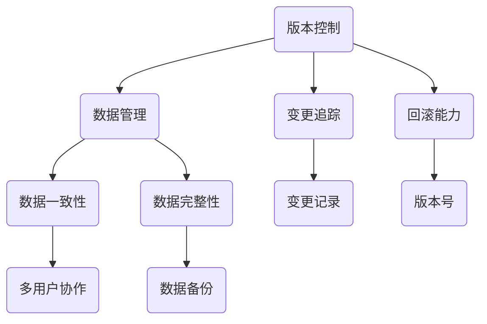
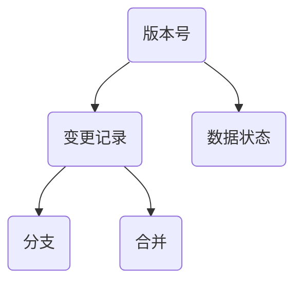

                 

### 摘要

随着大型语言模型（LLM）在人工智能领域的重要性日益凸显，其应用场景不断扩展，从自然语言处理、智能问答到自动化写作等。然而，LLM的迭代和优化过程需要依赖大量高质量的数据，这就带来了数据版本控制的问题。本文旨在探讨数据版本控制在LLM应用迭代中的重要性，分析其在数据管理中的挑战和解决方案，以及如何利用常见的数据版本控制工具和框架来支持LLM的迭代。通过本文的讨论，读者将了解到数据版本控制对LLM性能和稳定性的关键影响，以及在实际应用中的最佳实践。

### 关键词

- 数据版本控制
- 大型语言模型（LLM）
- 数据迭代
- 数据管理
- 版本控制工具
- 应用优化

### 第一部分：背景与基础

#### 第1章：数据版本控制的概述

##### 1.1 数据版本控制的基本概念

数据版本控制是一种跟踪和管理数据变化的技术，它确保了在不同开发阶段和团队成员之间数据的一致性和完整性。版本控制的核心目标是提供一种机制，使得任何人在任何时候都可以访问特定的数据版本，并可以轻松地回滚到先前的版本。

**核心概念与联系架构**

以下是一个Mermaid流程图，展示了数据版本控制的基本概念及其关系：



**核心算法原理讲解**

版本控制的基本算法原理包括：
- **变更记录**：每次数据修改都会生成一条变更记录，记录下修改的内容、时间以及修改者的信息。
- **版本号**：通过递增的版本号来标识数据的版本状态。
- **回滚能力**：允许用户回滚到先前的版本，撤销一系列的变更。

以下是伪代码，描述了版本控制的基本操作：

```python
# 初始化版本控制系统
initialize_version_control_system()

# 添加数据版本
add_version(data)

# 记录变更
record_change(data, change)

# 回滚到特定版本
rollback_to_version(version)
```

**数学模型和公式**

数据版本控制中的数学模型通常涉及版本号和时间戳，用于确定数据的版本状态。以下是版本号和时间戳的简单模型：

$$
V(t) = \max \{ v \in \mathbb{N} \mid \text{data} v \text{ is available at time } t \}
$$

其中，\( V(t) \) 表示在时间 \( t \) 可用的最高版本号。

**举例说明**

假设在一天内，有三个用户对数据进行了三次修改，版本号分别递增为1、2、3。若某个用户需要回滚到版本2，则可以通过以下步骤实现：

1. 记录当前版本号 \( V(t) = 3 \)。
2. 执行回滚操作 \( rollback_to_version(2) \)。
3. 系统将数据状态回滚到版本2。

##### 1.2 数据版本控制的重要性

数据版本控制在软件开发和数据管理中扮演着关键角色。在LLM应用迭代过程中，数据版本控制尤为重要：

- **保证数据一致性**：在多用户协作的情况下，数据版本控制确保了所有用户访问的数据都是一致的，避免了数据冲突。
- **支持数据回滚**：在LLM模型训练过程中，数据集可能会因为各种原因（如数据污染、模型调整）需要进行回滚，数据版本控制提供了这种灵活性。
- **维护数据完整性**：通过记录所有变更，数据版本控制帮助维护数据的完整性和可追溯性。

**核心算法原理讲解**

数据版本控制的重要性体现在以下几个方面：

1. **数据一致性**：使用版本控制可以避免多个用户对同一数据的修改造成的不一致问题。每个用户都在各自的版本基础上进行工作，减少了数据冲突的风险。

2. **数据回滚**：在LLM训练过程中，数据可能需要进行更新或回滚。版本控制提供了简单有效的回滚机制，使得开发者可以快速恢复到先前的数据状态。

3. **数据完整性**：通过记录所有变更，版本控制有助于追踪数据变更的历史，确保数据的完整性和可追溯性。

以下是伪代码，描述了数据版本控制在LLM应用中的重要性：

```python
# 初始化LLM项目
initialize	LLM_project()

# 添加数据集
add_dataset(dataset)

# 训练模型
train_model(model, dataset)

# 记录模型状态
record_model_state(model_state)

# 模型迭代
iterate_model(model, dataset, model_state)
```

**数学模型和公式**

在LLM应用中，数据版本控制可以通过以下公式来描述其重要性：

$$
I = C \times R \times V
$$

其中，\( I \) 表示数据版本控制的重要性，\( C \) 表示数据一致性，\( R \) 表示数据回滚能力，\( V \) 表示数据完整性。

**举例说明**

假设一个LLM模型正在训练过程中，数据集发生了污染，导致模型性能下降。通过数据版本控制，开发人员可以：

1. 回滚到干净的数据集版本。
2. 使用干净的数据集重新训练模型。
3. 确保模型的训练过程和数据的一致性。

##### 1.3 数据版本控制的历史与发展

数据版本控制的概念最早起源于软件开发领域，随着版本控制系统（如RCS和CVS）的出现，数据版本控制开始得到广泛应用。随着互联网和分布式系统的兴起，版本控制工具逐渐演变，例如Git的出现，使得版本控制变得更加高效和灵活。

**历史与发展**

- **早期版本控制**：RCS和CVS等早期版本控制工具主要基于中心化的模型，这些工具通过集中式服务器来管理版本信息。
- **分布式版本控制**：Git等分布式版本控制工具的出现，使得版本控制变得更加分布式和高效。每个用户都可以维护自己的版本库，减少了中央服务器的负载。

**常见的数据版本控制工具和框架**

- **Git**：Git是最流行的分布式版本控制工具，它支持快速、高效的数据版本管理。
- **SVN**：Subversion是一个中心化的版本控制工具，虽然不如Git分布式，但在某些场景下仍然有其优势。
- **Mercurial**：Mercurial与Git类似，也是一款分布式版本控制工具，具有强大的分支管理和合并功能。

**示例**

使用Git进行数据版本控制的基本命令包括：

```bash
# 初始化仓库
git init

# 添加文件
git add filename

# 提交更改
git commit -m "commit message"

# 查看提交历史
git log

# 创建分支
git branch feature

# 切换到分支
git checkout feature

# 合并分支
git merge feature
```

通过这些命令，开发人员可以轻松地管理数据的版本和控制变更。

### 第二部分：数据版本控制技术

#### 第2章：数据版本控制的基本概念和原理

数据版本控制是现代软件开发中不可或缺的一部分，它帮助团队协作和确保数据一致性。在深入探讨数据版本控制技术之前，我们需要了解其基本概念和原理。

##### 2.1 版本控制的基本概念

版本控制的基本概念包括版本号、变更记录、分支和合并等。这些概念构成了版本控制系统的核心。

- **版本号**：版本号是标识数据状态的唯一数字或字符串。每次数据变更后，版本号都会递增，以便追溯历史。
- **变更记录**：变更记录是记录每次数据变更的详细信息，包括变更的内容、时间、操作者等。
- **分支**：分支是版本控制系统中的一种机制，允许开发者在独立的环境中工作，而不影响主分支。
- **合并**：合并是将两个或多个分支的变更合并到一个共同版本的过程。

**核心概念与联系架构**

以下是数据版本控制的基本概念及其相互关系的Mermaid流程图：



**核心算法原理讲解**

版本控制的基本算法原理涉及以下几个方面：

1. **版本号递增**：每次数据变更后，版本号自动递增，以标识新的数据状态。
2. **变更记录**：每次变更都会生成一条记录，记录变更的内容、时间、操作者等信息。
3. **分支管理**：支持创建、切换和合并分支，以实现并行开发。
4. **合并算法**：在合并分支时，解决可能出现的冲突，确保数据一致性。

以下是版本控制的基本算法原理的伪代码：

```python
# 初始化版本控制系统
initialize_version_control_system()

# 添加数据版本
add_version(data)

# 记录变更
record_change(data, change)

# 创建分支
create_branch(branch)

# 切换分支
switch_branch(branch)

# 合并分支
merge_branches(branch1, branch2)
```

**数学模型和公式**

版本控制中的数学模型通常涉及版本号和时间戳，用于确定数据的版本状态。以下是版本号和时间戳的简单模型：

$$
V(t) = \max \{ v \in \mathbb{N} \mid \text{data} v \text{ is available at time } t \}
$$

其中，\( V(t) \) 表示在时间 \( t \) 可用的最高版本号。

**举例说明**

假设一个项目有多个开发者同时进行工作，以下是版本控制的基本操作：

1. **添加版本**：开发者A添加了一个新的数据文件，版本号递增为1。
2. **记录变更**：开发者B对文件进行了修改，生成了一条变更记录。
3. **创建分支**：开发者C需要独立开发一个新功能，创建了名为“feature1”的分支。
4. **切换分支**：开发者C切换到“feature1”分支，进行独立开发。
5. **合并分支**：在“feature1”分支开发完成后，将其合并回主分支。

通过这些操作，版本控制系统确保了数据的一致性和可追溯性。

##### 2.2 版本控制的基本原理

版本控制的基本原理包括数据备份、变更追踪和版本管理。这些原理共同确保了数据的安全和一致性。

- **数据备份**：数据备份是版本控制的基础，它确保了在任何时候都可以恢复数据。
- **变更追踪**：变更追踪记录了每次数据的修改，帮助团队了解数据的历史和变更过程。
- **版本管理**：版本管理是版本控制的核心，它通过版本号和变更记录来管理数据的不同状态。

**核心算法原理讲解**

版本控制的基本原理可以概括为以下几个步骤：

1. **初始化**：初始化版本控制系统，设置版本号和时间戳。
2. **添加数据**：将新数据添加到版本控制系统。
3. **记录变更**：每次数据修改时，记录变更的信息。
4. **备份数据**：定期备份数据，以确保数据的持久性。
5. **版本管理**：通过版本号和变更记录管理数据的不同状态。

以下是版本控制基本原理的伪代码：

```python
# 初始化版本控制系统
initialize_version_control_system()

# 添加数据
add_data(data)

# 记录变更
record_change(data, change)

# 备份数据
backup_data()

# 管理版本
manage_versions()
```

**数学模型和公式**

版本控制的基本数学模型涉及版本号和时间戳，用于确定数据的版本状态。以下是版本号和时间戳的简单模型：

$$
V(t) = \max \{ v \in \mathbb{N} \mid \text{data} v \text{ is available at time } t \}
$$

其中，\( V(t) \) 表示在时间 \( t \) 可用的最高版本号。

**举例说明**

假设一个项目团队正在开发一个软件，以下是版本控制的基本操作：

1. **初始化**：团队初始化版本控制系统，设置版本号和时间戳。
2. **添加数据**：开发者A添加了第一个版本的数据。
3. **记录变更**：开发者B对数据进行了一次修改，并记录了变更。
4. **备份数据**：系统自动备份数据，以防万一。
5. **版本管理**：系统通过版本号和变更记录管理数据的多个版本。

通过这些操作，版本控制系统确保了数据的安全和一致性。

##### 2.3 数据版本控制工具和框架

数据版本控制工具和框架是实施版本控制技术的关键。以下是一些常用的数据版本控制工具和框架：

- **Git**：Git是一个分布式版本控制工具，具有强大的分支管理和合并功能。
- **SVN**：SVN是一个中心化的版本控制工具，适用于大型团队和复杂项目。
- **Mercurial**：Mercurial与Git类似，也是一款分布式版本控制工具。

**核心算法原理讲解**

每个数据版本控制工具和框架都实现了不同的核心算法和原理，以下是对Git的简要介绍：

1. **分布式模型**：Git使用分布式模型，每个用户都有自己的版本库，可以独立工作。
2. **分支管理**：Git支持强大的分支管理，允许开发者创建、切换和合并分支。
3. **合并算法**：Git的合并算法可以高效地解决合并冲突，确保数据一致性。

以下是Git的基本算法原理的伪代码：

```python
# 初始化Git仓库
initialize_git_repository()

# 添加文件
add_file(file)

# 提交更改
commit_changes(message)

# 创建分支
create_branch(branch)

# 切换分支
switch_branch(branch)

# 合并分支
merge_branches(source_branch, target_branch)
```

**数学模型和公式**

Git的数学模型主要涉及哈希函数和版本库的存储。以下是Git中使用哈希函数的简单模型：

$$
H(data) = \text{hash_value}
$$

其中，\( H \) 表示哈希函数，\( data \) 表示数据，\( \text{hash_value} \) 表示生成的哈希值。

**举例说明**

假设一个团队使用Git进行版本控制，以下是基本操作：

1. **初始化**：团队初始化Git仓库，并创建第一个版本库。
2. **添加文件**：开发者A添加了一个新的文件到版本库。
3. **提交更改**：开发者B对文件进行了修改，并提交了更改。
4. **创建分支**：开发者C创建了名为“feature1”的分支。
5. **切换分支**：开发者C切换到“feature1”分支，进行独立开发。
6. **合并分支**：在“feature1”分支开发完成后，将其合并回主分支。

通过Git，团队可以高效地协作和版本控制数据。

### 第三部分：LLM应用迭代中的数据版本控制

#### 第3章：数据版本控制在LLM应用迭代中的应用

在LLM（大型语言模型）应用迭代过程中，数据版本控制起着至关重要的作用。LLM应用通常依赖于大量的训练数据和实时数据，数据的变化和迭代对模型的性能和稳定性有着直接的影响。本章将详细探讨数据版本控制在LLM应用迭代中的关键应用和挑战。

##### 3.1 数据版本控制在LLM模型开发中的应用

在LLM模型开发过程中，数据版本控制有助于确保训练数据的准确性和一致性。以下是数据版本控制在LLM模型开发中的应用：

- **数据收集与管理**：在收集训练数据时，版本控制可以帮助团队追踪数据的来源、收集时间和处理过程，确保数据的质量和可靠性。
- **数据清洗与预处理**：在数据处理阶段，版本控制可以帮助团队记录数据清洗和预处理的步骤，以便回溯和验证处理过程的正确性。
- **版本管理**：通过对数据进行版本管理，开发人员可以轻松地回滚到先前的数据版本，确保模型训练的连续性和稳定性。

**核心算法原理讲解**

数据版本控制在LLM模型开发中的应用可以通过以下算法原理来实现：

1. **数据追踪**：使用版本控制工具记录数据的每个版本和变更历史，确保数据的可追溯性。
2. **版本管理**：通过版本控制工具管理数据的不同版本，确保每个版本的训练数据都是准确和可靠的。
3. **数据回滚**：在数据处理过程中，如果发现数据问题，可以使用版本控制工具回滚到先前的数据版本，避免数据错误对模型训练的影响。

以下是数据版本控制在LLM模型开发中的伪代码：

```python
# 初始化数据版本控制系统
initialize_data_version_control()

# 添加训练数据
add_training_data(data)

# 记录数据变更
record_data_change(data, change)

# 预处理数据
preprocess_data(data)

# 版本管理
manage_data_versions()
```

**数学模型和公式**

在LLM模型开发中，数据版本控制的数学模型通常涉及数据完整性检查和版本匹配。以下是数据完整性检查的简单模型：

$$
I = \sum_{i=1}^{n} \frac{1}{|D_i|} \times \delta_{i}
$$

其中，\( I \) 表示数据完整性，\( D_i \) 表示第 \( i \) 个数据集，\( \delta_{i} \) 表示数据集 \( D_i \) 的错误率。

**举例说明**

假设一个团队正在开发一个LLM模型，以下是数据版本控制的基本操作：

1. **初始化**：团队初始化数据版本控制系统。
2. **添加训练数据**：团队收集并添加了多个数据集。
3. **记录数据变更**：在数据处理过程中，团队记录了每个数据集的变更历史。
4. **预处理数据**：团队对数据进行清洗和预处理，以准备用于模型训练。
5. **版本管理**：团队使用版本控制系统管理数据的不同版本，确保每个版本的数据都是准确和可靠的。

通过这些操作，团队可以确保LLM模型训练的数据质量和一致性。

##### 3.2 数据版本控制在LLM模型部署和维护中的应用

在LLM模型部署和维护过程中，数据版本控制同样至关重要。数据的变化可能会影响模型的性能和稳定性，因此需要有效的数据版本控制机制来管理数据更新和变更。

- **数据更新**：在模型部署后，数据版本控制可以帮助团队追踪和更新数据，确保模型始终使用最新的数据。
- **数据回滚**：在数据更新过程中，如果新数据导致模型性能下降，可以使用数据版本控制回滚到先前的数据版本。
- **版本匹配**：确保模型和数据版本的一致性，避免数据版本的不匹配导致的问题。

**核心算法原理讲解**

数据版本控制在LLM模型部署和维护中的应用可以通过以下算法原理来实现：

1. **数据版本匹配**：通过比对模型和数据版本，确保模型使用的数据版本与部署时的版本一致。
2. **数据更新机制**：使用版本控制工具定期更新数据，确保模型始终使用最新的数据。
3. **数据回滚机制**：在数据更新过程中，如果发现数据问题，可以立即回滚到先前的数据版本，避免影响模型性能。

以下是数据版本控制在LLM模型部署和维护中的伪代码：

```python
# 检查数据版本匹配
check_version_match(model_version, data_version)

# 更新数据版本
update_data_version(new_data)

# 回滚数据版本
rollback_data_version(previous_version)
```

**数学模型和公式**

在LLM模型部署和维护中，数据版本控制的数学模型通常涉及版本匹配度和数据更新频率。以下是数据版本匹配度的简单模型：

$$
M = \frac{\text{common\_version}}{\text{max_version}}
$$

其中，\( M \) 表示数据版本匹配度，\( \text{common\_version} \) 表示模型和数据共有的版本，\( \text{max_version} \) 表示模型和数据的最大版本。

**举例说明**

假设一个团队在维护一个已部署的LLM模型，以下是数据版本控制的基本操作：

1. **检查版本匹配**：团队检查模型和数据版本，确保版本一致。
2. **更新数据版本**：团队定期更新数据，确保模型使用最新的数据。
3. **回滚数据版本**：如果新数据导致模型性能下降，团队可以回滚到先前的数据版本。

通过这些操作，团队可以确保LLM模型的稳定性和性能。

##### 3.3 数据版本控制在LLM模型更新和迭代中的关键问题

在LLM模型的更新和迭代过程中，数据版本控制面临着一系列关键问题，包括数据一致性、数据安全性和数据完整性。

- **数据一致性**：在多用户协作的环境下，确保所有用户访问的数据都是一致的，避免数据冲突。
- **数据安全性**：保护数据不被未授权访问和篡改，确保数据的安全性。
- **数据完整性**：确保数据的准确性和完整性，避免数据丢失或损坏。

**核心算法原理讲解**

数据版本控制在LLM模型更新和迭代中的关键问题可以通过以下算法原理来解决：

1. **分布式数据一致性算法**：使用分布式一致性算法（如Paxos或Raft）确保多用户环境下的数据一致性。
2. **数据加密**：使用数据加密技术保护数据的安全性，防止数据泄露或篡改。
3. **数据完整性检查**：通过校验和或哈希函数确保数据的完整性，及时发现和修复数据问题。

以下是解决数据版本控制关键问题的伪代码：

```python
# 检查数据一致性
check_data_consistency()

# 加密数据
encrypt_data()

# 检查数据完整性
check_data_integrity()
```

**数学模型和公式**

在LLM模型更新和迭代中，数据版本控制的数学模型通常涉及一致性概率和数据加密强度。以下是数据一致性概率的简单模型：

$$
P(C) = \frac{\text{consistent\_data\_count}}{\text{total\_data\_count}}
$$

其中，\( P(C) \) 表示数据一致性概率，\( \text{consistent\_data\_count} \) 表示一致的数据条目数，\( \text{total\_data\_count} \) 表示总数据条目数。

**举例说明**

假设一个团队在更新一个LLM模型，以下是解决数据版本控制关键问题的基本操作：

1. **检查数据一致性**：团队使用一致性算法检查数据一致性。
2. **加密数据**：团队使用加密技术保护数据的安全性。
3. **检查数据完整性**：团队使用校验和或哈希函数检查数据的完整性。

通过这些操作，团队可以确保LLM模型的更新和迭代过程中数据的一致性、安全性和完整性。

### 第四部分：实战案例

#### 第4章：数据版本控制在LLM应用中的实战

在本文的第四部分，我们将通过两个具体的实战案例来探讨数据版本控制在LLM应用中的实际应用。这些案例将展示如何在不同的LLM应用场景中使用数据版本控制技术，以解决数据管理中的挑战。

##### 4.1 实战案例一：智能客服系统的数据版本控制

**案例背景**

一个智能客服系统需要处理大量的用户询问，并且需要不断更新和优化其对话能力。为了确保系统的高效运行和用户体验，数据版本控制成为关键。

**开发环境搭建**

1. **选择版本控制工具**：选择Git作为版本控制工具，因为它支持分布式协作和高效的数据管理。
2. **搭建Git仓库**：在服务器上搭建Git仓库，用于存储和管理所有的代码和数据。

```bash
# 创建Git仓库
git init

# 添加文件到仓库
git add .

# 提交初始版本
git commit -m "Initial commit"
```

**源代码详细实现**

1. **数据收集**：从多个渠道（如社交媒体、用户反馈）收集用户询问数据。
2. **数据预处理**：对收集到的数据进行清洗和预处理，以准备用于模型训练。

```python
# 收集数据
data = collect_data()

# 清洗数据
clean_data(data)

# 预处理数据
preprocess_data(data)
```

**代码解读与分析**

1. **版本控制数据集**：将数据集添加到Git仓库，并记录每个版本的变更。

```bash
# 添加数据集到Git仓库
git add data

# 提交数据集变更
git commit -m "Add and preprocess training data"
```

2. **模型训练和更新**：使用预处理后的数据集训练LLM模型，并定期更新模型。

```python
# 训练模型
train_model(model, data)

# 模型更新
update_model(model, new_data)
```

**实际案例分析和详细讲解**

1. **数据回滚**：在一次数据更新后，发现模型性能下降，可以使用Git回滚到先前的数据版本。

```bash
# 查看提交历史
git log

# 回滚到特定版本
git checkout <version>
```

2. **数据同步**：多个团队成员可以同时更新数据集，并使用Git的分支管理功能进行协同工作。

```bash
# 创建分支
git branch feature1

# 切换到分支
git checkout feature1

# 在分支上工作
add_data_to_feature1()

# 提交分支更改
git commit -m "Add new data to feature1"

# 合并分支
git merge feature1
```

**项目小结**

通过Git进行数据版本控制，智能客服系统可以确保数据的一致性、可追溯性和可靠性。开发团队可以轻松地回滚数据、更新模型，并高效地协同工作。

##### 4.2 实战案例二：自动写作系统的数据版本控制

**案例背景**

一个自动写作系统需要处理大量的文本数据，并且需要定期更新和优化写作算法。为了确保系统的高效运行和输出质量，数据版本控制成为关键。

**开发环境搭建**

1. **选择版本控制工具**：选择Git作为版本控制工具，因为它支持分布式协作和高效的数据管理。
2. **搭建Git仓库**：在服务器上搭建Git仓库，用于存储和管理所有的代码和数据。

```bash
# 创建Git仓库
git init

# 添加文件到仓库
git add .

# 提交初始版本
git commit -m "Initial commit"
```

**源代码详细实现**

1. **数据收集**：从多个渠道（如新闻网站、博客）收集文本数据。
2. **数据预处理**：对收集到的文本数据进行清洗和预处理，以准备用于模型训练。

```python
# 收集数据
data = collect_data()

# 清洗数据
clean_data(data)

# 预处理数据
preprocess_data(data)
```

**代码解读与分析**

1. **版本控制数据集**：将数据集添加到Git仓库，并记录每个版本的变更。

```bash
# 添加数据集到Git仓库
git add data

# 提交数据集变更
git commit -m "Add and preprocess text data"
```

2. **模型训练和更新**：使用预处理后的数据集训练自动写作模型，并定期更新模型。

```python
# 训练模型
train_model(model, data)

# 模型更新
update_model(model, new_data)
```

**实际案例分析和详细讲解**

1. **数据回滚**：在一次数据更新后，发现模型输出质量下降，可以使用Git回滚到先前的数据版本。

```bash
# 查看提交历史
git log

# 回滚到特定版本
git checkout <version>
```

2. **数据同步**：多个团队成员可以同时更新数据集，并使用Git的分支管理功能进行协同工作。

```bash
# 创建分支
git branch feature1

# 切换到分支
git checkout feature1

# 在分支上工作
add_data_to_feature1()

# 提交分支更改
git commit -m "Add new data to feature1"

# 合并分支
git merge feature1
```

**项目小结**

通过Git进行数据版本控制，自动写作系统可以确保数据的一致性、可追溯性和可靠性。开发团队可以轻松地回滚数据、更新模型，并高效地协同工作，从而提高系统的写作质量和效率。

### 第五部分：展望与未来

#### 第5章：数据版本控制在LLM应用迭代中的趋势和未来发展方向

随着大型语言模型（LLM）在各个领域的应用日益广泛，数据版本控制在LLM应用迭代中的重要性也逐渐凸显。未来的数据版本控制将在多个方向上发展，以适应更复杂的应用场景和更高的数据管理需求。

##### 5.1 数据版本控制的趋势

1. **分布式版本控制**：分布式版本控制将变得更加普及，尤其是随着云计算和边缘计算的发展，分布式数据版本控制能够更好地支持全球范围内的数据协作和实时更新。

2. **自动化版本控制**：自动化版本控制工具和框架将继续发展，通过人工智能和机器学习技术，自动识别和修复数据版本问题，提高版本控制的效率和准确性。

3. **数据隐私保护**：随着数据隐私和安全法规的加强，数据版本控制将更加注重数据隐私保护，采用加密和去标识化技术确保数据在版本控制过程中的安全性。

4. **集成化版本控制**：未来的数据版本控制将更加集成化，与数据管理、数据治理和数据安全等其他领域的技术相结合，形成统一的数据管理平台。

##### 5.2 未来发展方向

1. **智能数据版本控制**：利用人工智能和机器学习技术，开发智能数据版本控制算法，自动识别数据变更模式，预测数据版本冲突，并提供智能化的冲突解决策略。

2. **区块链技术融合**：将区块链技术与数据版本控制相结合，利用区块链的不可篡改性和透明性，提高数据版本控制的安全性和可信度。

3. **分布式数据一致性**：研究分布式数据一致性算法，解决分布式环境下的数据一致性问题，确保多个节点上的数据版本保持一致。

4. **多维度数据版本控制**：在现有的版本号和时间戳基础上，增加更多的维度（如用户、应用场景、数据类型等），实现更加精细化的数据版本管理。

##### 5.3 拓展阅读

- 《版本控制的艺术》
- 《区块链技术指南》
- 《分布式系统一致性》
- 《数据治理最佳实践》

通过这些阅读资料，读者可以更深入地了解数据版本控制、区块链技术、分布式系统和数据治理等方面的前沿知识和应用。

### 文章标题

《数据版本控制在LLM应用迭代中的应用》

### 作者

作者：AI天才研究院/AI Genius Institute & 禅与计算机程序设计艺术 /Zen And The Art of Computer Programming

### 总结

本文系统地介绍了数据版本控制在LLM应用迭代中的重要性，包括基本概念、原理、挑战和解决方案，以及实际应用中的最佳实践。通过深入探讨数据版本控制的核心算法、数学模型和实际案例，读者可以更好地理解如何在LLM应用中有效地管理数据版本，确保模型迭代过程中的数据一致性、稳定性和可靠性。未来，随着技术的发展，数据版本控制将在智能数据管理、分布式系统和区块链领域发挥更重要的作用。读者可以进一步参考拓展阅读中的资料，以深入了解相关领域的最新研究和技术应用。

