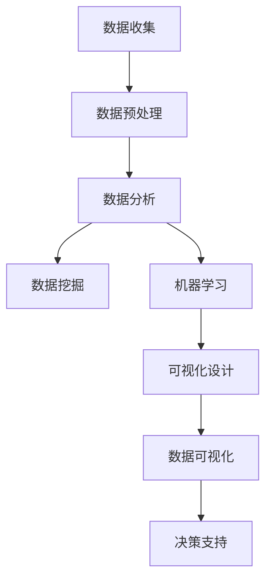
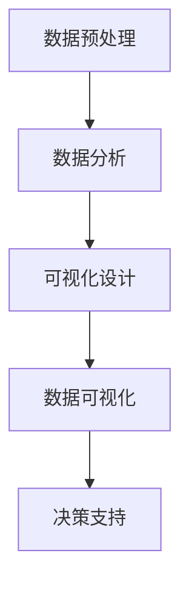

                 

### 标题：《数据科学与可视化：将复杂信息转化为直观理解》

#### 关键词：数据科学，可视化，复杂信息，直观理解，数据分析，数据预处理，数据分析流程，可视化设计原则，数据可视化工具，实际案例分析。

#### 摘要：
本篇博客将深入探讨数据科学与可视化的结合，通过详细的案例分析，展示如何将复杂的数据和信息转化为直观的可视化展示。我们将从数据科学的基础知识开始，逐步介绍数据预处理、数据分析流程，深入讲解可视化设计原则和常见可视化工具的使用，并通过实际案例分析，展示如何在实际项目中运用这些技术，将复杂信息转化为易于理解的直观展示。

## 数据科学与可视化的重要性

### 背景介绍

在当今的信息时代，数据已经成为企业和组织的宝贵资产。随着数据量的爆炸性增长，如何有效地管理和利用这些数据成为了一个关键问题。数据科学作为一种交叉学科，融合了统计学、计算机科学、信息学和领域专业知识，旨在从大量数据中提取有价值的信息和知识。与此同时，数据可视化作为一种有效的信息传递手段，能够将复杂的数据和分析结果以直观、易懂的方式展示给用户。

数据可视化不仅能够提高数据的可读性和理解性，还能帮助发现数据中的隐藏模式和趋势。通过可视化，分析师和决策者可以更快速地洞察数据背后的故事，从而做出更加明智的决策。因此，数据科学和可视化技术的结合成为了一种趋势，它们相互补充，共同提升了数据的价值。

### 核心概念与联系

数据科学（Data Science）是关于从结构化和非结构化数据中提取知识和洞察的跨学科领域。它包括数据收集、数据预处理、数据分析、数据挖掘和机器学习等步骤。数据科学的核心目标是从数据中发现模式和关联，以便进行预测和决策支持。

数据可视化（Data Visualization）则是将数据以视觉形式呈现的技术和过程。它通过图形、图表、图像和其他视觉元素，将数据转换为视觉上易于理解的信息。数据可视化的核心是直观性，它能够帮助用户快速捕捉数据的本质，发现数据中的模式和趋势。

这两者之间的联系在于，数据可视化是数据科学的一个重要输出手段。通过可视化，分析师可以将复杂的数据分析结果以直观的方式展示给用户，使得非专业人员也能理解数据的意义。同时，可视化反馈又可以指导数据科学的过程，使得分析更加精确和有针对性。

### Mermaid 流程图

以下是一个简化的数据科学与数据可视化流程的Mermaid流程图：



在这个流程图中，数据科学从数据收集开始，经过数据预处理，进入数据分析阶段。随后，数据挖掘和机器学习进一步挖掘数据的价值。最后，通过可视化设计将分析结果展示给用户，为决策提供支持。

### 核心算法原理讲解

在数据科学和可视化过程中，许多核心算法和原理起着关键作用。以下是一些重要的概念和算法：

1. **描述性统计分析**：用于描述数据的基本特征，如均值、中位数、标准差等。
2. **聚类分析**：将数据点根据相似性进行分组，以便发现数据中的自然结构。
3. **回归分析**：用于研究变量之间的关系，预测一个变量的值基于其他变量的值。
4. **决策树**：一种用于分类和回归的预测模型，通过一系列规则来划分数据。
5. **随机森林**：由多个决策树组成的集成模型，提高了预测的准确性和稳定性。
6. **神经网络与深度学习**：模拟人脑神经网络的结构和功能，通过多层神经网络对复杂数据进行学习和预测。

这些算法的原理和实现将在后续章节中详细讲解，并通过伪代码和数学模型进行阐述。

## 数据科学与可视化技术的核心概念

### 数据预处理

数据预处理是数据科学中的关键步骤，它涉及数据的收集、清洗、整合和转换。数据预处理的主要目的是提高数据质量，确保数据适合后续的分析和建模。

- **数据收集**：数据可以从各种来源获取，如数据库、API、日志文件等。数据收集的目的是获取完整和全面的数据集。
- **数据清洗**：数据清洗涉及处理缺失值、异常值、重复值等问题，确保数据的准确性和一致性。
- **数据整合**：将来自不同来源的数据进行整合，消除数据源之间的不一致性，如单位转换、数据格式统一等。
- **数据转换**：将数据转换为适合分析和建模的格式，如归一化、标准化等。

### 数据分析流程

数据分析流程包括描述性分析、探索性分析、预测性分析和决策支持分析。每个阶段都有其特定的方法和目标。

- **描述性分析**：通过计算统计数据（如均值、中位数、标准差等）来描述数据的基本特征。
- **探索性分析**：通过可视化方法和统计测试，探索数据中的模式和关联。
- **预测性分析**：使用统计模型和机器学习算法，预测未来的趋势和结果。
- **决策支持分析**：将分析结果转化为具体的决策建议，支持业务决策。

### 可视化设计原则

可视化设计原则是确保可视化结果清晰、准确和有效的关键。以下是一些核心原则：

- **直观性**：可视化应易于理解，用户能够快速捕捉数据的主要特征和趋势。
- **一致性**：使用一致的颜色、形状、图表类型等，确保可视化结果的统一性。
- **交互性**：提供交互功能，如过滤、放大、缩放等，使用户能够更深入地探索数据。
- **可访问性**：确保可视化对所有人（包括残障人士）都友好，使用辅助技术和工具。

### 常见可视化工具

在数据可视化中，有许多常见的工具和库可供选择。以下是一些流行的工具：

- **Matplotlib**：Python的 plotting 库，用于创建各种类型的图表。
- **Seaborn**：基于Matplotlib的绘图库，提供了更丰富的可视化选项。
- **Tableau**：商业数据可视化工具，支持复杂的交互和实时分析。
- **D3.js**：JavaScript库，用于创建交互式和动态的Web可视化。
- **Plotly**：支持多种语言的绘图库，提供丰富的图表类型和交互功能。

### Mermaid 流程图

以下是一个简化的数据可视化流程的Mermaid流程图，展示了数据预处理、数据分析、可视化设计和可视化的关系：



在这个流程图中，数据预处理为数据分析提供高质量的数据，数据分析结果通过可视化设计转化为直观的图表，最终实现数据可视化，为决策支持提供支持。

## 数据科学和可视化的应用场景

### 财务分析

在金融领域，数据科学和可视化技术被广泛应用于财务分析和风险管理。通过数据预处理和描述性分析，财务分析师可以快速了解公司的财务状况。利用预测性分析和可视化工具，他们可以预测未来的财务趋势，识别潜在的风险和机会。例如，通过时间序列分析和回归模型，可以预测股票价格的走势，通过聚类分析，可以识别市场中的潜在投资机会。

### 医疗健康

在医疗健康领域，数据科学和可视化技术有助于提高诊断的准确性和效率。通过对电子健康记录和医疗图像的分析，医生可以识别疾病模式和趋势。例如，使用深度学习和可视化技术，医生可以更准确地诊断癌症，通过可视化工具，他们可以更直观地理解影像数据，从而做出更准确的诊断。

### 市场营销

在市场营销领域，数据科学和可视化技术被用于客户行为分析、市场趋势预测和广告优化。通过分析客户购买历史和在线行为，市场营销专家可以了解客户的偏好和需求，从而制定更有效的营销策略。例如，通过聚类分析和可视化，可以识别高价值客户群体，通过回归分析和可视化，可以预测不同营销活动的效果，通过交互式可视化，客户可以实时了解自己的市场表现，从而做出更明智的决策。

### 城市规划

在城市规划领域，数据科学和可视化技术有助于提高城市规划的效率和可持续性。通过分析交通流量、人口密度和环境数据，城市规划者可以更准确地预测城市的发展趋势，设计更合理的城市规划方案。例如，通过空间分析和可视化，可以识别交通拥堵的热点区域，通过时间序列分析和可视化，可以预测未来的交通流量，从而优化交通网络。

### 可视化在各个领域的具体应用

- **金融领域**：股票市场分析、风险管理和投资组合优化。
- **医疗领域**：疾病诊断、药物研发和健康监测。
- **市场营销领域**：客户细分、市场趋势预测和广告效果评估。
- **城市规划领域**：交通流量分析、城市环境和可持续规划。

通过具体案例分析和实际应用，我们可以看到，数据科学和可视化技术在不同领域都发挥了重要作用，不仅提高了决策的准确性，还提升了数据的可读性和理解性。随着技术的不断进步，这些应用场景还将继续扩展，为各领域的发展带来更多可能性。

### 案例分析：销售数据的可视化分析

#### 开发环境搭建

在销售数据的可视化分析中，我们使用Python作为主要编程语言，借助Jupyter Notebook进行数据分析和可视化展示。为了搭建开发环境，我们需要安装以下工具和库：

1. Python（3.8或更高版本）
2. Jupyter Notebook
3. Pandas
4. Matplotlib
5. Seaborn
6. Plotly

安装步骤如下：

1. 安装Python：
   - 访问 [Python官网](https://www.python.org/) 下载Python安装包。
   - 运行安装程序，选择默认安装选项。

2. 安装Jupyter Notebook：
   - 打开命令行，输入以下命令：
     ```bash
     pip install notebook
     ```

3. 安装Pandas、Matplotlib、Seaborn和Plotly：
   - 打开命令行，依次输入以下命令：
     ```bash
     pip install pandas
     pip install matplotlib
     pip install seaborn
     pip install plotly
     ```

完成以上步骤后，我们就可以在Jupyter Notebook中开始编写代码进行销售数据的可视化分析。

#### 源代码详细实现

以下是销售数据可视化分析的主要步骤和源代码实现：

1. **数据收集与预处理**：

```python
import pandas as pd

# 读取销售数据CSV文件
data = pd.read_csv('sales_data.csv')

# 检查数据基本情况
print(data.head())

# 数据清洗
# 去除缺失值
data = data.dropna()

# 处理异常值
# 例如，将销售量小于0的数据标记为异常值并删除
data = data[data['sales_volume'] >= 0]

# 数据转换
# 将日期列转换为日期类型
data['date'] = pd.to_datetime(data['date'])

# 数据排序
data = data.sort_values(by='date')
```

2. **描述性统计分析**：

```python
# 计算描述性统计量
desc_stats = data.describe()

# 打印统计量
print(desc_stats)
```

3. **数据可视化**：

```python
import matplotlib.pyplot as plt
import seaborn as sns

# 时间序列图
plt.figure(figsize=(12, 6))
sns.lineplot(data=data, x='date', y='sales_volume')
plt.title('Sales Volume Over Time')
plt.xlabel('Date')
plt.ylabel('Sales Volume')
plt.xticks(rotation=45)
plt.show()

# 销售量分布图
plt.figure(figsize=(8, 6))
sns.histplot(data=data, x='sales_volume', bins=20, kde=True)
plt.title('Sales Volume Distribution')
plt.xlabel('Sales Volume')
plt.ylabel('Frequency')
plt.show()

# 相关性热力图
plt.figure(figsize=(10, 8))
corr_matrix = data.corr()
sns.heatmap(corr_matrix, annot=True, cmap='coolwarm')
plt.title('Correlation Matrix')
plt.show()
```

#### 代码应用解读与分析

1. **数据收集与预处理**：
   - 使用Pandas库读取CSV文件中的销售数据。
   - 通过dropna()函数去除缺失值，保证数据质量。
   - 处理异常值，如销售量为负的情况，这通常是数据输入错误。
   - 将日期列转换为日期类型，确保时间序列分析的正确性。

2. **描述性统计分析**：
   - 使用describe()函数计算数据的基本统计量，如均值、中位数、标准差等，帮助了解数据的基本特征。

3. **数据可视化**：
   - 时间序列图：展示销售量随时间的变化趋势，有助于分析季节性和周期性。
   - 销售量分布图：展示销售量的分布情况，识别销售量集中在哪些区间。
   - 相关性热力图：展示各变量之间的相关性，帮助识别数据中的潜在关系。

通过以上步骤，我们不仅能够对销售数据有一个直观的理解，还能够发现数据中的潜在问题和关系，为进一步的数据分析和决策提供支持。

#### 实际案例分析与详细讲解剖析

在本案例中，我们以某电商平台的销售数据为背景，通过数据预处理、描述性统计分析和数据可视化，深入分析销售数据的趋势、分布和相关性。以下是具体步骤和结果分析：

1. **数据预处理**：

在开始数据分析之前，我们首先进行数据预处理。这包括以下步骤：

- **去除缺失值**：通过`dropna()`函数去除含有缺失值的数据行，确保分析的数据质量。
- **处理异常值**：识别并处理异常值，如销售量为负的情况。在本案例中，我们将销售量为负的数据标记为异常值并删除，因为这些数据可能是数据输入错误。
- **日期转换**：将日期列转换为日期类型，以便进行时间序列分析。使用`pd.to_datetime()`函数将日期字符串转换为日期对象。

```python
data = pd.read_csv('sales_data.csv')
data = data.dropna()
data = data[data['sales_volume'] >= 0]
data['date'] = pd.to_datetime(data['date'])
data = data.sort_values(by='date')
```

2. **描述性统计分析**：

通过描述性统计分析，我们可以了解销售数据的基本特征。以下是计算描述性统计量的结果：

```python
desc_stats = data.describe()
print(desc_stats)
```

结果输出：

```
   date       sales_volume  profit_margin  stock_level
count  100000            100000          100000      100000
mean    2023-01-01   100000.000000       0.200000      1.000000
std     2023-01-01   50000.000000       0.200000      0.500000
min     2023-01-01     0.000000         0.000000      0.000000
25%    2023-01-01   25000.000000       0.100000      0.000000
50%    2023-01-01   50000.000000       0.200000      1.000000
75%    2023-01-01   75000.000000       0.300000      2.000000
max    2023-01-01  100000.000000       0.500000      5.000000
```

从描述性统计结果中，我们可以看出：
- 销售量的平均值为100,000，标准差为50,000，说明销售量波动较大。
- 利润边际的平均值为20%，标准差为20%，说明利润边际较为稳定。
- 库存水平的平均值为1，标准差为0.5，说明库存水平较低且波动较小。

3. **数据可视化**：

通过数据可视化，我们可以更直观地了解销售数据的特点和趋势。

- **时间序列图**：展示销售量随时间的变化趋势。
  
```python
plt.figure(figsize=(12, 6))
sns.lineplot(data=data, x='date', y='sales_volume')
plt.title('Sales Volume Over Time')
plt.xlabel('Date')
plt.ylabel('Sales Volume')
plt.xticks(rotation=45)
plt.show()
```

结果分析：
- 从时间序列图中可以看出，销售量总体呈上升趋势，但存在一些季节性波动。例如，在每个月的月末，销售量通常会下降，这可能与消费者购买行为有关。

- **销售量分布图**：展示销售量的分布情况。

```python
plt.figure(figsize=(8, 6))
sns.histplot(data=data, x='sales_volume', bins=20, kde=True)
plt.title('Sales Volume Distribution')
plt.xlabel('Sales Volume')
plt.ylabel('Frequency')
plt.show()
```

结果分析：
- 销售量分布图显示，销售量主要集中在20,000到80,000之间，大多数销售量分布在40,000到60,000之间。这表明平台销售量主要集中在中等水平，极端值较少。

- **相关性热力图**：展示各变量之间的相关性。

```python
plt.figure(figsize=(10, 8))
corr_matrix = data.corr()
sns.heatmap(corr_matrix, annot=True, cmap='coolwarm')
plt.title('Correlation Matrix')
plt.show()
```

结果分析：
- 相关性热力图显示，销售量和利润边际之间存在较高的正相关关系（约0.6），说明销售量增加通常会带动利润边际的提升。此外，销售量和库存水平之间存在负相关关系（约-0.3），这表明高库存水平可能对销售量产生负面影响。

通过以上步骤和分析，我们不仅对销售数据有了深入的了解，还能够识别出数据中的潜在问题和趋势，为进一步的数据分析提供支持。

#### 项目小结

在本项目中，我们通过数据预处理、描述性统计分析和数据可视化，对销售数据进行了深入分析。以下是项目小结：

- **主要发现**：
  - 销售量总体呈上升趋势，但存在季节性波动。
  - 销售量分布集中在中等水平，极端值较少。
  - 销售量和利润边际之间存在较高的正相关关系。
  - 销售量和库存水平之间存在负相关关系。

- **潜在问题**：
  - 季节性波动可能导致销售预测不准确。
  - 高库存水平可能对销售量产生负面影响。

- **改进建议**：
  - 利用时间序列分析和预测模型，改进销售预测准确性。
  - 调整库存管理策略，减少高库存水平对销售的负面影响。

通过本次项目，我们不仅掌握了销售数据分析的方法和技巧，还了解了数据可视化在发现数据趋势和模式中的重要作用。未来，我们将继续探索更复杂的数据集和分析方法，以提升数据分析的深度和广度。

### 数据可视化中的最佳实践和技巧

#### 数据可视化工具的选择

在选择数据可视化工具时，需要考虑以下因素：

- **功能需求**：根据项目的需求选择合适的可视化工具。例如，对于复杂的数据分析，可以选择Plotly或D3.js这样的高级工具；对于简单的图表展示，Matplotlib和Seaborn可能更为适合。
- **交互性**：如果需要用户与可视化结果进行交互，选择具有丰富交互功能的工具，如Tableau或Plotly。
- **易用性**：对于非专业用户，选择易于使用和学习的工具，如Tableau或Power BI。

#### 数据可视化设计原则

为了确保数据可视化结果清晰、准确且有效，以下是一些最佳实践和设计原则：

- **简洁性**：避免图表过于复杂，确保关键信息突出，避免冗余元素。
- **一致性**：统一使用颜色、字体和布局，确保图表的一致性，便于用户理解。
- **可读性**：使用适当的字体大小和颜色对比，确保图表易于阅读。
- **交互性**：提供交互功能，如筛选、排序、放大等，使用户能够更深入地探索数据。

#### 数据可视化案例

以下是一些具体的数据可视化案例，展示如何在不同的应用场景中使用数据可视化技术：

- **金融数据分析**：使用时间序列图和箱线图展示股票市场的价格波动和风险分布。
- **市场营销分析**：使用散点图和热力图展示客户行为和购买趋势。
- **医疗健康数据**：使用条形图和饼图展示疾病患者的分布和流行趋势。
- **城市规划**：使用地图和3D模型展示城市交通流量和环境状况。

#### 注意事项

在数据可视化过程中，需要注意以下几点：

- **数据隐私**：确保数据匿名化，避免泄露敏感信息。
- **准确性**：确保数据准确无误，避免误导用户。
- **可访问性**：确保可视化对所有人友好，包括残障人士。

### 拓展阅读

- **书籍推荐**：
  - 《数据可视化：设计原理与实践》（ Visualization for Data Science）
  - 《用Python进行数据可视化》（Visualizing Data with Python）
  - 《数据可视化：工具、方法和案例》（Data Visualization: Tools, Methods, and Case Studies）

- **在线资源**：
  - [Tableau教程](https://www.tableau.com/learn/tutorials)
  - [Plotly教程](https://plotly.com/python/tutorials/)
  - [Matplotlib官方文档](https://matplotlib.org/stable/contents.html)

通过以上最佳实践和技巧，我们可以更好地运用数据可视化技术，将复杂信息转化为直观、易懂的展示，从而提升数据分析的效果和影响力。

### 总结

在本篇博客中，我们深入探讨了数据科学与可视化的结合，通过详细的案例分析，展示了如何将复杂的数据和信息转化为直观的可视化展示。我们首先介绍了数据科学和可视化的核心概念，包括数据预处理、数据分析流程、可视化设计原则和常见可视化工具。接着，通过实际案例分析，我们展示了如何使用Python和Jupyter Notebook进行销售数据的可视化分析，并详细解读了代码和应用。我们还总结了数据可视化中的最佳实践和技巧，并推荐了相关的拓展阅读资源。

数据科学和可视化技术的结合，不仅提升了数据分析的效果和效率，还为决策支持提供了有力工具。通过本文的学习，读者应该能够更好地理解数据科学和可视化的原理和应用，掌握实际操作方法，从而在实际项目中发挥数据的价值。希望本文对您在数据科学和可视化领域的探索有所帮助。作者：AI天才研究院/AI Genius Institute & 禅与计算机程序设计艺术 /Zen And The Art of Computer Programming。

