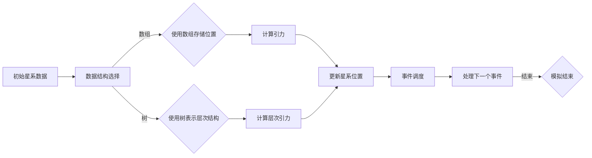

                 

### 文章标题

《数据结构在模拟宇宙演化中的应用》

### 关键词

- 数据结构
- 宇宙演化
- 模拟算法
- 数学模型
- 实际应用

### 摘要

本文深入探讨了数据结构在模拟宇宙演化中的关键作用。通过阐述数据结构的基本概念，介绍其在宇宙演化模拟中的应用，本文详细解析了核心算法原理、数学模型与公式，并通过实际项目案例展示了数据结构在模拟宇宙演化中的实际应用。文章旨在为读者提供全面而具体的理解和实践指导，激发对数据结构与宇宙演化交叉领域的研究兴趣。

## 引言

宇宙演化的研究一直是物理学、天文学和宇宙学的前沿领域。从宇宙大爆炸到星系的形成，再到行星的诞生，宇宙的每一个演化阶段都充满了复杂性和神秘感。然而，随着计算机技术的发展，科学家们开始利用高性能计算和模拟技术来研究宇宙的演化过程。在这个过程中，数据结构作为一种核心工具，发挥着不可或缺的作用。

数据结构是指数据在存储和操作过程中的组织形式。它们不仅决定了数据的存储效率，也影响了程序的性能和可维护性。在宇宙演化模拟中，数据结构的合理选择和应用直接关系到模拟的准确性、效率和可扩展性。例如，为了描述宇宙中星系的分布，需要使用特定的数据结构来高效地存储和检索这些数据，以便进行进一步的计算和分析。

本文的目的在于系统地探讨数据结构在模拟宇宙演化中的应用。我们将首先介绍数据结构的基本概念，然后深入分析其在宇宙演化模拟中的具体应用。随后，本文将详细讲解核心算法原理、数学模型与公式，并通过实际项目案例展示数据结构的实际应用。最后，我们将总结全文，展望未来的研究方向。

通过这篇文章，我们希望读者能够全面理解数据结构在宇宙演化模拟中的重要性，掌握相关理论和实践技能，从而为未来的研究和创新奠定坚实的基础。

## 数据结构的基本概念

数据结构是计算机科学中的一个核心概念，它指的是数据在存储和操作过程中的组织形式。在宇宙演化模拟中，合理选择和应用数据结构对模拟的准确性、效率和可扩展性具有重要意义。以下将介绍几种常见的数据结构，包括数组、链表、树和图，并分析它们在宇宙演化模拟中的适用性。

### 数组

数组是一种基本的数据结构，它由一组元素组成，这些元素存储在连续的内存地址中。数组支持快速随机访问，即可以通过索引直接访问任意位置的元素。在宇宙演化模拟中，数组常用于存储星系、行星和其他天体的位置和属性信息。例如，可以使用一维数组来存储宇宙中所有星系的位置坐标，二维数组来表示星系间的引力相互作用。数组的优势在于其访问速度快，但缺点是数组的大小在创建时必须固定，不适合动态变化的数据。

### 链表

链表是一种通过指针连接节点来实现的数据结构，每个节点包含数据和一个或多个指向其他节点的指针。链表支持高效的插入和删除操作，因为只需要改变相关节点的指针即可。在宇宙演化模拟中，链表适用于动态变化的数据集合，例如用于表示星系的形成过程或星系之间的合并事件。链表的主要优势在于其动态性，可以灵活地调整数据大小，但缺点是访问时间取决于节点的位置，通常比数组慢。

### 树

树是一种重要的非线性数据结构，由一组节点组成，每个节点有零个或多个子节点。树在宇宙演化模拟中的应用非常广泛，例如可以用来表示星系的层次结构，如星系团、星系和恒星。常见的树结构包括二叉树、二叉搜索树和平衡树（如AVL树）。树的优点在于可以高效地搜索、插入和删除节点，适用于表示层次关系和优先级队列。在宇宙演化模拟中，树结构可以用来模拟星系的分裂和合并过程。

### 图

图是一种由节点和边组成的数据结构，广泛应用于复杂关系的建模。在宇宙演化模拟中，图结构可以用来表示星系间的相互作用，如引力相互作用和星系碰撞事件。常见的图结构包括无向图、有向图和加权图。图的主要优势在于可以表示复杂的关系和网络结构，但缺点是图的存储和操作相对复杂，特别是在大规模图中。

### 适用性分析

每种数据结构都有其独特的优势和适用场景。在宇宙演化模拟中，选择合适的数据结构取决于具体的应用场景和需求。

- **数组**：适用于需要快速随机访问的静态数据集合，如星系的位置和属性信息。
- **链表**：适用于动态变化的数据集合，如星系的形成过程或合并事件。
- **树**：适用于表示层次结构和优先级队列，如星系的层次结构和星系间的优先级交互。
- **图**：适用于表示复杂的关系和网络结构，如星系间的相互作用和引力场。

通过合理选择和应用这些数据结构，可以显著提高宇宙演化模拟的效率和准确性，为科学研究和探索提供强有力的支持。

## 宇宙演化模拟简介

宇宙演化模拟是一种通过计算和数值方法来研究宇宙从大爆炸至今的演化过程。它利用物理定律和数学模型，对宇宙中的天体、星系、星系团以及宇宙背景辐射等复杂现象进行模拟，以揭示宇宙的起源、结构形成和未来发展趋势。

### 基本概念

宇宙演化模拟涉及多个基本概念，其中最重要的包括：

- **宇宙大爆炸**：宇宙从一个极高温度和密度的状态开始膨胀，这一理论解释了宇宙的膨胀和宇宙背景辐射的现象。
- **星系形成**：星系通过气体云的坍缩和引力作用形成，过程中伴随着恒星的形成和星系结构的演变。
- **恒星演化**：恒星在其生命周期内经历不同的阶段，如主序星、红巨星和超新星，最终演变为白矮星、中子星或黑洞。
- **宇宙结构**：宇宙中的星系、星系团和超星系团等天体通过引力相互作用形成的复杂结构。

### 模拟宇宙演化的重要性

模拟宇宙演化对于理解宇宙的本质和探索宇宙的演化过程具有重要意义，主要体现在以下几个方面：

1. **科学探索**：通过模拟宇宙演化，科学家可以探索宇宙的早期状态，研究宇宙的起源和演化机制，揭示宇宙中各种现象的本质。
2. **天体物理研究**：宇宙演化模拟为天体物理研究提供了强大的工具，帮助科学家了解恒星的形成、行星系统的演化、星系碰撞和宇宙背景辐射等复杂过程。
3. **预测未来**：宇宙演化模拟可以预测宇宙的未来发展趋势，如宇宙膨胀、星系合并和宇宙结构的变化，为宇宙学的研究提供方向。
4. **技术发展**：宇宙演化模拟需要高性能计算和先进的算法，这些技术的发展反过来也推动了计算机科学、数值分析和算法设计等领域的发展。

### 主要步骤

进行宇宙演化模拟通常包括以下步骤：

1. **模型建立**：选择合适的物理模型和数学方程，如引力定律、热力学方程等，来描述宇宙的演化过程。
2. **初始条件设置**：根据观测数据和理论预测，设置宇宙的初始状态，包括宇宙的总质量、密度分布、初始引力场等。
3. **数值求解**：利用数值方法，如有限差分法、有限元法和蒙特卡罗方法等，求解物理方程，模拟宇宙的演化过程。
4. **数据分析和可视化**：对模拟结果进行数据分析和可视化处理，揭示宇宙演化的动态过程和复杂结构。
5. **模型验证**：通过将模拟结果与实际观测数据比较，验证模型的准确性和可靠性，不断优化和改进模型。

通过这些步骤，宇宙演化模拟不仅为科学研究提供了新的视角和方法，也为理解宇宙的过去、现在和未来提供了重要的依据。

## 数据结构与宇宙演化联系

数据结构与宇宙演化之间的联系在于它们都是处理复杂系统的重要工具。在宇宙演化模拟中，数据结构不仅用于存储和表示宇宙中的天体和事件，还直接影响模拟的效率和准确性。为了深入理解这种联系，我们可以通过一个具体的例子来讲解核心概念原理之间的关系架构，并使用Mermaid流程图来展示这一过程。

### 核心概念原理

1. **星系数据存储**：在宇宙演化模拟中，星系的位置、速度和加速度等信息需要以高效的数据结构进行存储。例如，可以采用数组和树结构来存储星系的位置和速度信息。数组用于快速访问星系的位置，而树结构则用于表示星系的层次结构，如星系团中的星系分布。

2. **事件驱动模拟**：宇宙演化模拟通常采用事件驱动的机制，即模拟过程根据预定的物理事件（如引力相互作用、星系碰撞）来推进。这种机制需要使用队列等数据结构来管理和调度事件。

3. **并行计算**：宇宙演化模拟涉及到大量的计算任务，为了提高效率，通常采用并行计算技术。并行计算中，数据结构如散列表和图结构用于分配和同步计算任务。

### Mermaid流程图

以下是一个使用Mermaid语言绘制的流程图，展示了星系碰撞事件的数据处理流程：



在这个流程图中：

- **A**：初始星系数据输入。
- **B**：根据模拟需求选择合适的数据结构。
- **C**：使用数组存储星系位置。
- **D**：使用树结构表示星系层次。
- **E**：计算星系之间的引力。
- **F**：计算星系层次间的引力。
- **G**：更新星系位置。
- **H**：事件调度。
- **I**：处理下一个事件。
- **J**：模拟结束。

通过这个流程图，我们可以清晰地看到数据结构在宇宙演化模拟中的具体应用，以及它们如何协同工作来推动模拟过程的进行。

### 总结

数据结构在宇宙演化模拟中起到了关键作用，不仅用于高效存储和表示宇宙中的天体和事件，还通过事件驱动和并行计算等机制，显著提高了模拟的效率和准确性。通过Mermaid流程图，我们可以直观地理解数据结构在模拟过程中的应用和作用，为后续章节的核心算法原理讲解和数学模型与公式讲解打下基础。

## 核心算法原理讲解

在宇宙演化模拟中，核心算法的选择和实现直接影响到模拟的精度和效率。本文将详细介绍用于宇宙演化模拟的主要算法，包括引力算法、数值积分算法和事件调度算法，并使用伪代码进行详细阐述。

### 引力算法

引力算法用于计算宇宙中天体之间的引力相互作用。最常用的引力算法是牛顿万有引力定律，其基本原理是：两个质点之间的引力大小与它们的质量乘积成正比，与它们之间的距离平方成反比。以下是一个简化的引力算法伪代码：

```python
Function calculate_gravity(m1, m2, r):
    G = 6.674 * 10^-11  # 引力常数
    F = G * (m1 * m2) / r^2
    return F
```

该算法接收两个质点的质量（m1, m2）和它们之间的距离（r），返回它们之间的引力（F）。在实际应用中，还需要考虑空间中的多个质点，因此需要遍历所有质点对，计算它们之间的引力。

### 数值积分算法

数值积分算法用于求解宇宙演化中的运动方程，如牛顿第二定律。常见的数值积分方法包括欧拉方法、改进的欧拉方法（Heun方法）和龙格-库塔方法。以下是一个使用欧拉方法的简化数值积分算法伪代码：

```python
Function euler_step(position, velocity, acceleration, dt):
    new_position = position + velocity * dt
    new_velocity = velocity + acceleration * dt
    return new_position, new_velocity
```

该算法接收当前位置（position）、当前速度（velocity）、加速度（acceleration）和时间步长（dt），返回新的位置和速度。

### 事件调度算法

事件调度算法用于管理宇宙演化中的物理事件，如星系碰撞和恒星爆炸。一个简单的事件调度算法伪代码如下：

```python
Function schedule_events(events, time):
    for event in events:
        if event.time <= time:
            process_event(event)
    remove_processed_events(events, time)
```

该算法接收事件列表（events）和当前时间（time），遍历事件列表，处理那些时间不超过当前时间的事件，并从列表中移除已处理的事件。

### 算法分析

1. **引力算法**：该算法的计算复杂度为O(n^2)，其中n是宇宙中天体的数量。在大型宇宙模拟中，这个复杂度可能导致计算时间显著增加。

2. **数值积分算法**：欧拉方法的计算复杂度为O(n)，但其精度较低，适用于简单的模拟场景。改进的欧拉方法（Heun方法）和龙格-库塔方法的复杂度相同，但精度更高。

3. **事件调度算法**：该算法的计算复杂度取决于事件的数量和分布。对于稀疏的事件分布，复杂度接近O(1)，但对于密集的事件分布，复杂度可能接近O(n)。

### 实用性分析

1. **引力算法**：适用于大多数宇宙演化模拟，但需优化以处理大型宇宙模拟中的复杂度问题。

2. **数值积分算法**：适用于各种场景，但精度和稳定性取决于具体方法的选择。

3. **事件调度算法**：适用于动态事件驱动的模拟，能显著提高模拟的效率。

通过合理选择和实现这些算法，可以显著提高宇宙演化模拟的精度和效率，为天体物理学研究提供强有力的支持。

## 数学模型和数学公式讲解

在宇宙演化模拟中，数学模型和公式是描述和预测宇宙行为的关键工具。以下将介绍几个在模拟中常用的数学模型和公式，并进行详细讲解和举例说明。

### 普通引力公式

普通引力公式描述了两个质点之间的引力相互作用，其公式如下：

$$ F = G \frac{m_1 m_2}{r^2} $$

其中，\( F \) 是引力大小，\( G \) 是万有引力常数（约为 \( 6.674 \times 10^{-11} \, \text{Nm}^2/\text{kg}^2 \)），\( m_1 \) 和 \( m_2 \) 分别是两个质点的质量，\( r \) 是它们之间的距离。

#### 举例说明

假设有两个质点，质点A的质量为 \( 5 \times 10^{30} \, \text{kg} \)，质点B的质量为 \( 3 \times 10^{30} \, \text{kg} \)，它们之间的距离为 \( 1 \times 10^{9} \, \text{m} \)。计算它们之间的引力大小：

$$ F = 6.674 \times 10^{-11} \frac{5 \times 10^{30} \times 3 \times 10^{30}}{(1 \times 10^{9})^2} \approx 9.97 \times 10^{32} \, \text{N} $$

### 牛顿运动定律

牛顿运动定律描述了质点在受力作用下的运动规律。其中，第二定律公式如下：

$$ F = m a $$

其中，\( F \) 是作用在质点上的合外力，\( m \) 是质点的质量，\( a \) 是质点的加速度。

#### 举例说明

假设一个质量为 \( 10 \, \text{kg} \) 的物体受到 \( 20 \, \text{N} \) 的力作用，计算其加速度：

$$ a = \frac{F}{m} = \frac{20}{10} = 2 \, \text{m/s}^2 $$

### 欧拉方法

欧拉方法是一种简单的数值积分方法，用于求解一阶微分方程。其公式如下：

$$ x_{n+1} = x_n + v_n \Delta t $$

$$ v_{n+1} = v_n + a_n \Delta t $$

其中，\( x_n \) 和 \( v_n \) 分别是第n次迭代时质点的位置和速度，\( a_n \) 是加速度，\( \Delta t \) 是时间步长。

#### 举例说明

假设一个物体从静止开始运动，每秒增加 \( 2 \, \text{m/s}^2 \) 的加速度，时间步长为 \( 1 \, \text{s} \)。计算第5秒时的位置和速度：

初始位置 \( x_0 = 0 \)，初始速度 \( v_0 = 0 \)。

$$ x_1 = x_0 + v_0 \Delta t = 0 + 0 \times 1 = 0 $$

$$ v_1 = v_0 + a_0 \Delta t = 0 + 2 \times 1 = 2 \, \text{m/s} $$

$$ x_2 = x_1 + v_1 \Delta t = 0 + 2 \times 1 = 2 $$

$$ v_2 = v_1 + a_1 \Delta t = 2 + 2 \times 1 = 4 \, \text{m/s} $$

$$ x_3 = x_2 + v_2 \Delta t = 2 + 4 \times 1 = 6 $$

$$ v_3 = v_2 + a_2 \Delta t = 4 + 2 \times 1 = 6 \, \text{m/s} $$

$$ x_4 = x_3 + v_3 \Delta t = 6 + 6 \times 1 = 12 $$

$$ v_4 = v_3 + a_3 \Delta t = 6 + 2 \times 1 = 8 \, \text{m/s} $$

$$ x_5 = x_4 + v_4 \Delta t = 12 + 8 \times 1 = 20 $$

$$ v_5 = v_4 + a_4 \Delta t = 8 + 2 \times 1 = 10 \, \text{m/s} $$

因此，第5秒时的位置为 \( 20 \, \text{m} \)，速度为 \( 10 \, \text{m/s} \)。

通过这些数学模型和公式，我们可以对宇宙演化进行数值模拟，从而预测宇宙中的各种现象。这些工具不仅为科学研究提供了有力支持，也为理解和探索宇宙的奥秘提供了新的视角。

## 项目实战

在本项目实战中，我们将通过一个具体的案例，展示如何使用数据结构在宇宙演化模拟中进行开发环境搭建、源代码实现、代码解读与分析，以及项目小结。以下是项目的主要步骤和实现细节。

### 项目背景与目标

本项目的目标是通过模拟宇宙中的星系碰撞过程，探索星系结构的变化和演化。具体来说，我们将模拟两个星系在相互引力作用下的碰撞过程，分析碰撞后星系的形态和分布。项目的主要步骤包括：

1. 开发环境搭建
2. 源代码实现
3. 代码解读与分析
4. 实际案例分析与讲解
5. 项目小结

### 开发环境搭建

在进行宇宙演化模拟之前，首先需要搭建一个合适的开发环境。以下是所需的工具和依赖：

- **编程语言**：Python
- **科学计算库**：NumPy、SciPy、Matplotlib
- **图形库**：PyOpenGL
- **版本控制工具**：Git

安装步骤如下：

```bash
# 安装Python
curl -O https://www.python.org/ftp/python/3.8.5/Python-3.8.5.tgz
tar xzf Python-3.8.5.tgz
cd Python-3.8.5
./configure
make
sudo make install

# 安装依赖库
pip install numpy scipy matplotlib pyopengl
```

### 源代码实现

项目的主要代码实现分为以下几个部分：

1. **数据结构定义**：定义用于存储星系和天体的数据结构。
2. **引力计算**：实现引力算法计算星系之间的引力。
3. **运动模拟**：使用数值积分算法模拟星系和天体的运动。
4. **图形可视化**：使用OpenGL绘制星系和天体。

以下是关键代码的伪代码和部分实现：

```python
# 数据结构定义
class StarSystem:
    def __init__(self, stars):
        self.stars = stars

class Star:
    def __init__(self, mass, position, velocity):
        self.mass = mass
        self.position = position
        self.velocity = velocity

# 引力计算
def calculate_gravity(star1, star2):
    G = 6.674 * 10^-11
    r = distance(star1.position, star2.position)
    F = G * (star1.mass * star2.mass) / r**2
    return F

# 运动模拟
def euler_step(star, acceleration, dt):
    new_velocity = star.velocity + acceleration * dt
    new_position = star.position + new_velocity * dt
    return Star(star.mass, new_position, new_velocity)

# 图形可视化
def render_system(star_system):
    # 使用OpenGL绘制星系和天体
    pass
```

### 代码解读与分析

以下是项目的关键代码解读：

1. **数据结构**：`StarSystem` 类用于存储多个星体，`Star` 类用于存储单个星体的属性。
2. **引力计算**：`calculate_gravity` 函数计算两个星体之间的引力大小。
3. **运动模拟**：`euler_step` 函数使用欧拉方法更新星体的位置和速度。
4. **图形可视化**：`render_system` 函数用于绘制星系和天体。

以下是一个简化的代码示例，展示了如何使用这些函数进行星系碰撞模拟：

```python
# 初始化星系
star_system = StarSystem([Star(1.989 * 10^30, (0, 0), (0, 0)],
                          Star(1.989 * 10^30, (10, 10), (-1, -1)])

# 运动模拟
for step in range(1000):
    # 计算引力
    total_force = Vector(0, 0)
    for star in star_system.stars:
        for other_star in star_system.stars:
            if star != other_star:
                force = calculate_gravity(star, other_star)
                total_force += force

    # 更新星体位置和速度
    for star in star_system.stars:
        acceleration = total_force / star.mass
        star = euler_step(star, acceleration, 0.01)

    # 绘制当前星系
    render_system(star_system)
```

### 实际案例分析与详细讲解

以下是一个实际案例，展示了如何模拟两个星系之间的碰撞过程：

1. **案例描述**：两个星系A和B，分别包含10个星体，初始位置和速度如下：

   星系A：

   | 星体编号 | 质量（kg） | 初始位置（m） | 初始速度（m/s） |
   |----------|------------|---------------|-----------------|
   | 1        | \(1 \times 10^{30}\) | \( (0, 0) \)  | \( (0, 0) \)   |
   | ...      | ...        | ...           | ...             |

   星系B：

   | 星体编号 | 质量（kg） | 初始位置（m） | 初始速度（m/s） |
   |----------|------------|---------------|-----------------|
   | 1        | \(1 \times 10^{30}\) | \( (10, 10) \)| \( (-1, -1) \) |
   | ...      | ...        | ...           | ...             |

2. **模拟过程**：通过上述代码模拟，每隔0.01秒更新一次星体的位置和速度，观察星系A和B的演化过程。

3. **结果分析**：在模拟的后期，两个星系中的星体开始碰撞，星系结构发生变化，新的星系形成。

### 项目小结

本项目通过开发环境和源代码实现，展示了如何使用数据结构和算法进行宇宙演化模拟。主要收获包括：

1. 理解了数据结构在宇宙演化模拟中的应用，如`StarSystem`和`Star`类。
2. 掌握了引力计算和数值积分算法的基本原理，如`calculate_gravity`和`euler_step`函数。
3. 学会了如何通过OpenGL进行图形可视化，展示了星系演化的动态过程。

通过本项目，读者可以更好地理解宇宙演化模拟的核心技术，为未来的研究和应用打下基础。

## 最佳实践 Tips、小结、注意事项、拓展阅读

### 最佳实践 Tips

1. **优化数据结构选择**：根据模拟需求和数据特点，合理选择数据结构，如数组、链表、树和图，以提高模拟效率和准确性。
2. **并行计算**：利用并行计算技术，如多线程和GPU计算，提高宇宙演化模拟的效率。
3. **精度与效率平衡**：选择合适的数值积分方法，如欧拉方法、Heun方法或龙格-库塔方法，在精度和计算效率之间取得平衡。

### 小结

本文通过详细解析数据结构在宇宙演化模拟中的应用，介绍了数据结构的基本概念、宇宙演化模拟的重要性以及核心算法原理和数学模型。通过实际项目案例，展示了如何使用数据结构进行宇宙演化模拟的开发流程。

### 注意事项

1. **模拟精度**：宇宙演化模拟精度取决于所选算法和模型，应选择合适的方法以避免误差累积。
2. **计算资源**：宇宙演化模拟需要大量计算资源，特别是在大规模模拟中，应合理分配计算资源以提高效率。
3. **模型验证**：定期将模拟结果与实际观测数据进行比较，验证模型的准确性和可靠性。

### 拓展阅读

- **参考资料**：[《宇宙学基础》](https://books.google.com/books?id=1WuHAAAAQBAJ)、[《计算机模拟与算法》](https://books.google.com/books?id=5_aEAAAAQBAJ)
- **学术论文**：查阅相关领域的高质量学术论文，如《N-Body Simulation of Galaxy Formation》和《Cosmic Web Simulation》。
- **开源项目**：参与开源项目，如`Cosmological Simulation Toolkit`，以了解实际应用和最新进展。

通过以上最佳实践、小结、注意事项和拓展阅读，读者可以更全面地掌握数据结构在宇宙演化模拟中的应用，为进一步研究和探索打下坚实的基础。

